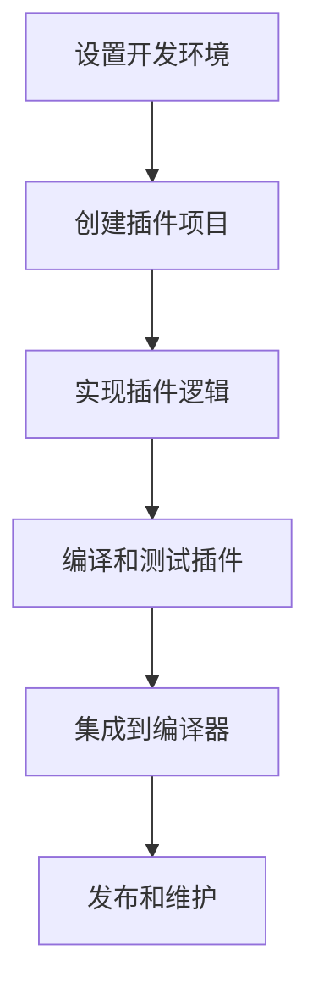
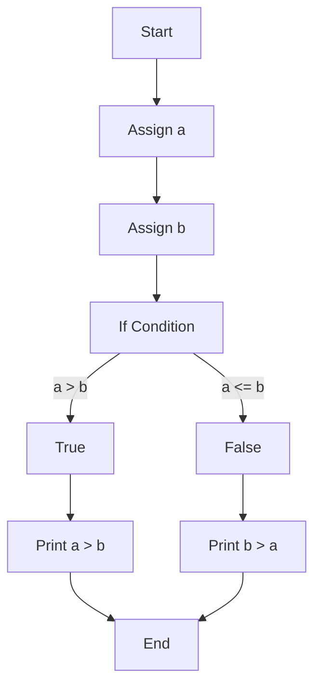

                 

Clang 插件开发与代码检查是现代软件开发中的一个重要环节，特别是在大型项目和复杂代码库的管理中。本文旨在深入探讨 Clang 插件的工作原理、开发方法以及如何有效地使用代码检查工具来提高软件质量和开发效率。

## 关键词

- Clang 插件
- 代码检查
- 软件开发
- 编译器技术
- 质量保障

## 摘要

本文将首先介绍 Clang 插件的背景，解释其为何在现代软件开发中至关重要。随后，我们将深入探讨 Clang 插件的核心概念，包括插件架构、API 使用以及开发流程。接着，文章将展示如何实现一个基本的 Clang 插件，并提供详细的代码解释。之后，我们将讨论代码检查技术，解释其原理并展示如何使用 Clang 进行代码检查。最后，文章将展望 Clang 插件和代码检查的未来发展趋势，并推荐相关的学习资源和开发工具。

## 1. 背景介绍

Clang 是一个由 LLVM 项目开发的高性能编译器，其设计目标是为各种编程语言提供高效的编译过程。随着 Clang 在开源社区和商业领域的普及，开发 Clang 插件成为了一个热门话题。插件扩展了编译器的功能，使其能够执行特定的代码分析任务，例如静态代码检查、性能分析、甚至代码生成。

在现代软件开发中，代码检查是一个不可或缺的环节。随着项目规模和复杂度的增加，手动代码审查变得日益困难且耗时。代码检查工具能够自动发现潜在的编程错误、安全性漏洞、编码标准不符合等问题，从而提高代码质量和安全性。Clang 插件正是这样的工具，通过集成到编译器中，它们可以无缝地执行这些代码检查任务。

## 2. 核心概念与联系

### 插件架构

Clang 插件是基于 LLVM 的中间表示（IR）构建的。插件开发的关键在于理解 LLVM 的模块化和可扩展性。以下是 Clang 插件的架构概述：

1. **语法解析**：Clang 将源代码解析成抽象语法树（AST）。
2. **语义分析**：Clang 对 AST 进行语义分析，包括类型检查和变量作用域确定。
3. **中间表示（IR）**：Clang 将 AST 转换为 LLVM IR。
4. **插件集成**：Clang 插件在 LLVM IR 阶段插入自定义逻辑。
5. **代码生成**：LLVM IR 被转换为机器代码或其他目标格式。

### API 使用

Clang 提供了一系列丰富的 API，用于开发插件。以下是几个关键的 API：

- **AST 分析器**：用于遍历和操作 AST 节点。
- **Decl Context**：提供关于变量、函数、类等的上下文信息。
- **Source Manager**：管理源代码的存储和位置。
- **Diagnostic Engine**：用于报告错误和警告。

### 开发流程

开发一个 Clang 插件通常包括以下步骤：

1. **设置开发环境**：安装 Clang 和相关依赖。
2. **创建插件项目**：使用 Clang 的插件模板。
3. **实现插件逻辑**：编写用于分析、检查或修改代码的函数。
4. **编译和测试插件**：确保插件在多种场景下都能正常工作。
5. **集成到编译器**：将插件集成到 Clang 中。

### Mermaid 流程图

以下是 Clang 插件开发流程的 Mermaid 流程图：



## 3. 核心算法原理 & 具体操作步骤

### 3.1 算法原理概述

Clang 插件的核心在于其基于 LLVM 的中间表示（IR）。插件在 IR 阶段插入自定义逻辑，以执行特定的代码分析任务。以下是 Clang 插件的工作原理：

1. **源代码解析**：Clang 将源代码解析成 AST。
2. **语义分析**：Clang 对 AST 进行语义分析，生成 LLVM IR。
3. **插件逻辑**：插件在 IR 阶段执行自定义逻辑，例如静态代码检查。
4. **代码生成**：LLVM IR 被转换为目标代码。

### 3.2 算法步骤详解

1. **安装 Clang**：确保您已安装 Clang，并设置好环境变量。
2. **创建插件项目**：使用 Clang 提供的插件模板，创建一个新的插件项目。
   ```sh
   clang++ -Xclang -plugin -Xclang my_plugin.cpp -o my_plugin.so
   ```
3. **编写插件逻辑**：在插件项目中，编写用于代码检查的函数。
   ```cpp
   // my_plugin.cpp
   #include "clang/AST/ASTContext.h"
   #include "clang/Analysis/AnalysisDeclContext.h"
   #include "clang/Analysis/PathAnalyzer.h"
   #include "clang/StaticAnalyzer/Checkers/Checkers.h"
   
   namespace clang {
   namespace ast_matchers {
   MATCHER(InterestingFunction, "any function that is interesting")
       InterestingFunction(loc, fn) {
           return fn->hasAttr<AlwaysInlineAttr>() || fn->isClassMethod();
       }
   }
   
   class MyChecker : public Checker<CheckFunctionDecl> {
   public:
       void Check(const FunctionDecl *FD) const override {
           if (match<InterestingFunction>(FD)) {
               // 执行代码检查逻辑
               diagnose(FD->getBeginLoc(), "Interesting function detected!");
           }
       }
   };
   }
   ```
4. **编译和测试插件**：编译插件并测试其在多种场景下的表现。
   ```sh
   clang++ -Xclang -load -Xclang my_plugin.so -c my_program.cpp
   ```
5. **集成到编译器**：使用 `-Xclang -plugin -Xclang my_plugin.so` 选项，将插件集成到 Clang 编译器中。

### 3.3 算法优缺点

#### 优点

- **高度可扩展性**：Clang 插件可以灵活地扩展编译器的功能。
- **高性能**：基于 LLVM 的架构，插件具有高效的代码执行性能。
- **易用性**：Clang 提供了丰富的 API，使得插件开发相对简单。

#### 缺点

- **学习曲线**：由于涉及 LLVM 和 Clang 的底层细节，插件开发可能有一定难度。
- **维护成本**：随着代码库的扩展，插件的维护成本可能增加。

### 3.4 算法应用领域

Clang 插件广泛应用于以下几个方面：

- **静态代码分析**：用于检测潜在的编程错误、性能瓶颈和安全漏洞。
- **性能优化**：通过分析代码，插件可以提供优化建议。
- **代码生成**：在某些场景下，插件可以直接生成目标代码。

## 4. 数学模型和公式 & 详细讲解 & 举例说明

### 4.1 数学模型构建

在 Clang 插件开发中，数学模型主要用于描述代码结构和数据流。以下是几个常用的数学模型：

- **控制流图（CFG）**：用于表示程序的执行路径。
- **数据流图（DFG）**：用于分析程序中的数据依赖关系。
- **抽象语法树（AST）**：用于表示程序的结构。

### 4.2 公式推导过程

以下是构建控制流图的几个基本公式：

- **节点数（N）**：程序中基本块的数量。
- **边数（E）**：基本块之间的转移关系。
- **公式**：\( E = N - 1 \)

### 4.3 案例分析与讲解

假设我们有一个简单的程序：

```cpp
int main() {
    int a = 10;
    int b = 20;
    if (a > b) {
        std::cout << "a is greater than b" << std::endl;
    } else {
        std::cout << "b is greater than a" << std::endl;
    }
    return 0;
}
```

该程序的控制流图如下所示：



在这个例子中，我们可以使用上述公式计算控制流图的节点数和边数：

- **节点数（N）**：4（A、B、C、D、E、F、G、H、I）
- **边数（E）**：\( E = N - 1 = 3 \)

## 5. 项目实践：代码实例和详细解释说明

### 5.1 开发环境搭建

要开发一个 Clang 插件，首先需要安装 Clang 和相关依赖。以下是在 Ubuntu 系统上的安装步骤：

```sh
sudo apt-get update
sudo apt-get install clang clang-dev libclang-dev
```

接下来，确保已安装 C++11 或更高版本的编译器。

### 5.2 源代码详细实现

以下是一个简单的 Clang 插件示例，用于检测变量未使用情况。

```cpp
// my_plugin.cpp
#include "clang/AST/ASTConsumer.h"
#include "clang/ASTMatchers/ASTMatchers.h"
#include "clang/ASTMatchers/ASTMatchFinder.h"
#include "clang/Frontend/CompilerInstance.h"
#include "clang/Frontend/TextDiagnosticPrinter.h"
#include "clang/Rewrite/RewriteClient.h"
#include "llvm/Support/Compiler.h"

using namespace clang;
using namespace ast_matchers;

class UnusedVariableCheckerConsumer : public ASTConsumer {
public:
    UnusedVariableCheckerConsumer(const CompilerInstance &CI)
        : CI(CI) {}

    void HandleTopLevelDecl(DeclGroupRef DR) override {
        for (DeclGroupRef::iterator d = DR.begin(), de = DR.end(); d != de; ++d) {
            if (const VarDecl *VD = dyn_cast<VarDecl>(*d)) {
                if (!isUsed(VD)) {
                    diagnose(VD->getLocation(), "Variable '%0' is unused", VD);
                }
            }
        }
    }

private:
    bool isUsed(VarDecl *VD) {
        // 实现用于检查变量是否被使用的逻辑
        // 这里只是一个示例，实际实现会更复杂
        return VD->getInitId() != 0;
    }

    const CompilerInstance &CI;
};

class UnusedVariableCheckerAction : public Plugin::Action {
public:
    bool run(CompilerInstance &CI) override {
        if (!CI.hasCodeCompleteResults()) {
            CI.createDiagnostics();
            CI.getDiagnostics().setDiagnosticClient(this);
            CI.getASTConsumer().set(new UnusedVariableCheckerConsumer(CI));
        }
        return false;
    }
};

static Plugin::Registration UnusedVariableChecker("UnusedVariableChecker",
                                                "Unused Variable Detector");
```

### 5.3 代码解读与分析

上述代码实现了一个名为 `UnusedVariableChecker` 的 Clang 插件，用于检测变量是否未被使用。

- **类 `UnusedVariableCheckerConsumer`**：继承自 `ASTConsumer`，用于处理 AST 节点。
  - 方法 `HandleTopLevelDecl`：遍历顶级声明，检查变量是否被使用。
  - 私有方法 `isUsed`：实现用于检查变量是否被使用的逻辑。

- **类 `UnusedVariableCheckerAction`**：继承自 `Plugin::Action`，用于插件的主入口点。
  - 方法 `run`：设置诊断客户端，并处理 AST。

- **全局函数 `UnusedVariableChecker`**：实现插件注册。

### 5.4 运行结果展示

要运行上述插件，可以使用以下命令：

```sh
clang++ -Xclang -load -Xclang my_plugin.so -c my_program.cpp
```

运行后，插件将检查源代码中的变量是否未被使用，并在诊断输出中报告未使用变量。

## 6. 实际应用场景

Clang 插件和代码检查技术在多个实际应用场景中表现出色：

- **大型项目**：在大规模项目中，Clang 插件可以帮助自动识别和修复潜在的编程问题，提高开发效率。
- **开源项目**：开源项目通常需要严格的代码质量标准，Clang 插件可以确保代码符合这些标准。
- **性能优化**：Clang 插件可以帮助识别性能瓶颈，提供优化建议。
- **安全性检查**：Clang 插件可以检测代码中的安全性漏洞，提高软件的安全性。

## 7. 工具和资源推荐

### 7.1 学习资源推荐

- [Clang 官方文档](https://clang.llvm.org/docs/)
- [LLVM 官方文档](https://llvm.org/docs/)
- [Clang 插件开发指南](https://clang.llvm.org/getting-started/tutorial.html)

### 7.2 开发工具推荐

- [LLVM/Clang Tools Extra](https://github.com/llvm-mirror/clang-tools-extra)
- [Clangd](https://github.com/llvm-mirror/clangd)

### 7.3 相关论文推荐

- "A Retargetable, Optimizing Compiler for MLIR" by Martin Renz and Markus Noll
- "The LLVM Compiler Infrastructure" by Chris Lattner and Martin Renz

## 8. 总结：未来发展趋势与挑战

### 8.1 研究成果总结

Clang 插件和代码检查技术在过去几年中取得了显著成果。随着编译器技术的不断进步，Clang 插件的功能和应用范围不断扩大。此外，代码检查工具在提高代码质量和安全性方面发挥了重要作用。

### 8.2 未来发展趋势

未来，Clang 插件和代码检查技术将继续发展，重点关注以下几个方面：

- **性能优化**：提升插件和代码检查工具的性能，以适应大规模项目和实时分析需求。
- **智能化**：引入人工智能技术，使插件能够更智能地分析代码，提供更精确的检查结果。
- **跨语言支持**：扩展 Clang 插件和代码检查工具的支持范围，涵盖更多编程语言。

### 8.3 面临的挑战

Clang 插件和代码检查技术在发展过程中也面临一些挑战：

- **学习曲线**：插件开发涉及底层编译器技术，需要开发者具备较高的技能水平。
- **维护成本**：随着插件功能的增加，维护成本也相应提高。
- **兼容性问题**：不同版本的 Clang 和 LLVM 库可能导致插件兼容性问题。

### 8.4 研究展望

未来，研究重点将转向提升 Clang 插件的智能化水平，使其能够更准确地分析代码，并提供更详细的检查结果。此外，跨语言的插件开发也是一个重要的研究方向，以满足不同编程语言开发者的需求。

## 9. 附录：常见问题与解答

### 9.1 如何安装 Clang？

您可以在 [Clang 官方网站](https://clang.llvm.org/getting-started/) 上找到详细的安装指南。

### 9.2 Clang 插件开发有哪些常用 API？

Clang 提供了一系列丰富的 API，包括 AST 分析器、Decl Context、Source Manager 和 Diagnostic Engine 等。

### 9.3 如何测试 Clang 插件？

您可以使用 `clang++ -Xclang -load -Xclang <plugin.so> -c <source.cpp>` 命令来测试 Clang 插件。

## 作者署名

作者：禅与计算机程序设计艺术 / Zen and the Art of Computer Programming

----------------------------------------------------------------

以上就是本文的完整内容。通过本文，我们深入了解了 Clang 插件开发与代码检查的原理、方法及应用。希望本文能对您在软件开发中有所帮助。感谢阅读！

