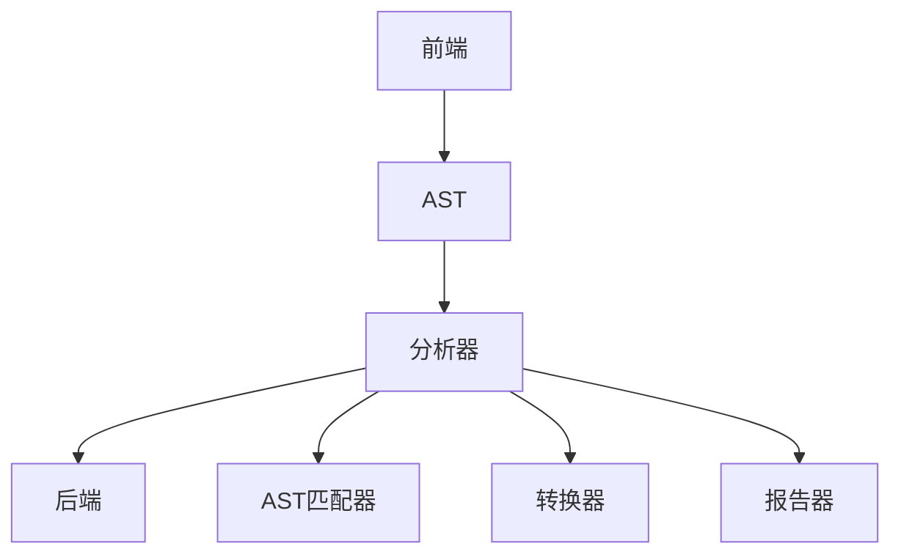
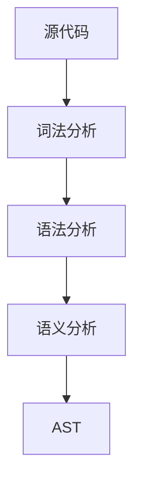
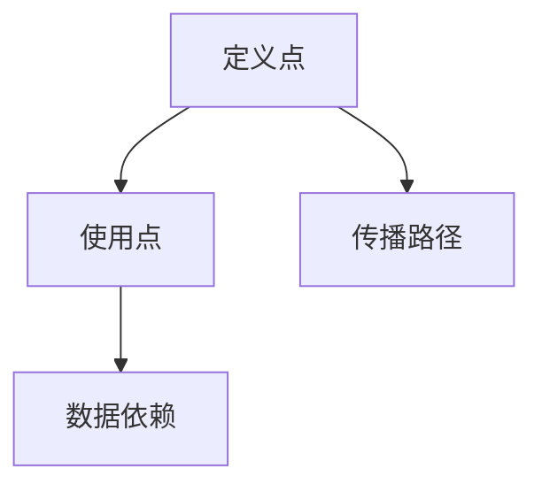
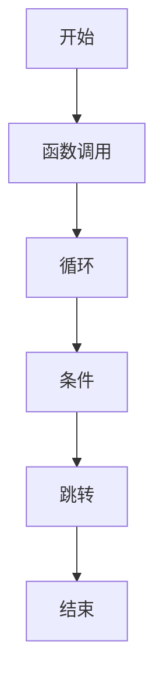
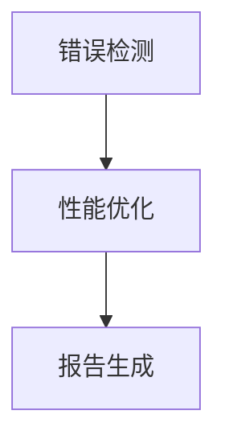

                 

关键词：Clang，静态分析器，代码分析，编译器扩展，程序设计，软件开发

> 摘要：本文将深入探讨Clang静态分析器的扩展开发过程。首先介绍Clang静态分析器的基本概念和功能，然后详细讨论如何通过编写自定义插件来扩展其能力，包括核心算法原理、开发步骤、实例代码解析和实际应用场景。此外，还将对相关的数学模型和公式进行详细讲解，并提供开发工具和资源的推荐。文章最后对研究成果进行总结，并展望未来的发展趋势和面临的挑战。

## 1. 背景介绍

Clang是一个由LLVM项目开发的C/C++编译器，以其高性能和丰富的功能著称。静态分析器是Clang的重要组成部分，它可以在程序执行前分析其源代码，帮助开发人员发现潜在的错误和优化机会。静态分析器的应用非常广泛，包括代码审查、性能优化、安全性检测等。

随着软件项目的复杂度不断增加，传统的静态分析技术已经难以满足需求。开发人员希望能够自定义分析规则和工具，以适应特定的开发环境和需求。为此，Clang提供了扩展机制，允许开发人员编写自定义插件来扩展静态分析器的功能。

本文将详细讨论Clang静态分析器的扩展开发过程，包括核心算法原理、开发步骤、实例代码解析和实际应用场景。通过本文的探讨，读者将能够理解如何利用Clang静态分析器来解决实际问题，并掌握扩展开发的方法。

### 1.1 Clang静态分析器概述

Clang静态分析器（Clang Static Analyzer）是一个强大的静态代码分析工具，它能够对C、C++和Objective-C等语言的源代码进行深入分析，以发现潜在的错误、漏洞和性能问题。Clang静态分析器的核心组件包括：

- **抽象语法树（AST）解析器**：它将源代码解析为抽象语法树，这是静态分析的基础。
- **数据流分析器**：它分析变量和函数的依赖关系，以确定它们的值和可达性。
- **控制流分析器**：它分析程序的控制流，包括循环、条件和跳转等。
- **数据依赖分析器**：它分析变量之间的数据依赖关系，以优化程序执行。

Clang静态分析器的优势在于其高效性和准确性。它能够在短时间内分析大量代码，同时提供详细的报告，帮助开发人员快速定位问题。此外，Clang静态分析器与LLVM编译器紧密集成，可以提供更深入的代码优化和性能分析。

### 1.2 Clang静态分析器功能

Clang静态分析器具备以下主要功能：

- **错误和漏洞检测**：通过分析源代码，它可以发现语法错误、潜在的内存泄漏、未使用的代码和潜在的漏洞（如缓冲区溢出、未初始化的变量等）。
- **代码质量分析**：它可以帮助开发人员识别不规范的编码习惯、冗余代码和代码复杂性，从而提高代码的可读性和可维护性。
- **性能优化**：通过分析程序的控制流和数据流，它可以发现潜在的瓶颈，并提出优化建议，以提高程序的运行效率。
- **自动化代码审查**：它可以集成到持续集成（CI）流程中，自动化代码审查，减少代码审查的时间和成本。

### 1.3 编写自定义插件的原因

尽管Clang静态分析器功能强大，但标准的分析器可能无法满足所有开发场景的需求。例如：

- **特定规则需求**：某些项目可能需要针对特定代码库或开发语言的特殊规则。
- **新特性分析**：随着技术的发展，某些新特性可能尚未被现有静态分析器支持。
- **性能优化**：针对特定场景，可能需要自定义分析算法来提高性能。

因此，编写自定义插件成为扩展Clang静态分析器功能的一种有效途径。通过插件，开发人员可以自定义分析规则、添加新功能，从而更好地适应项目的需求。

## 2. 核心概念与联系

### 2.1 Clang静态分析器核心概念

Clang静态分析器的工作原理基于几个核心概念：

- **抽象语法树（AST）**：AST是源代码的语法结构表示，它将代码转换为树形结构，使得分析器能够以程序逻辑为单位进行操作。
- **数据流分析**：数据流分析是一种静态分析方法，它跟踪变量和表达式的值在程序中的传播，以确定它们的可达性和有效性。
- **控制流分析**：控制流分析关注程序的执行路径，包括函数调用、循环、条件和跳转等，以理解程序的逻辑结构。

### 2.2 Clang静态分析器架构

Clang静态分析器的架构设计旨在提供灵活性和扩展性。其主要组成部分包括：

- **前端**：负责将源代码解析为AST。
- **分析器**：基于AST进行静态分析，包括数据流分析和控制流分析。
- **后端**：生成分析报告和优化建议。

在Clang静态分析器中，自定义插件通过以下组件进行集成：

- **AST匹配器**：用于识别AST中的特定模式或结构。
- **转换器**：用于修改AST，以实现自定义分析或优化。
- **分析器**：用于执行自定义的静态分析任务。
- **报告器**：用于生成分析报告。

### 2.3 Mermaid 流程图

以下是Clang静态分析器核心概念和架构的Mermaid流程图：



在该流程图中：

- **前端（A）**负责将源代码转换为抽象语法树（B）。
- **分析器（C）**对AST进行分析，并调用AST匹配器（E）、转换器（F）和报告器（G）进行具体任务。
- **后端（D）**生成最终的分析报告。

通过该流程图，可以清晰地看到Clang静态分析器的工作流程和自定义插件的集成方式。

## 3. 核心算法原理 & 具体操作步骤

### 3.1 算法原理概述

Clang静态分析器的核心算法包括抽象语法树（AST）解析、数据流分析、控制流分析和抽象解释等。以下是这些算法的基本原理：

- **AST解析**：将源代码转换为抽象语法树，以程序逻辑为单位进行分析。
- **数据流分析**：跟踪变量和表达式的值在程序中的传播，确定它们的可达性和有效性。
- **控制流分析**：分析程序的执行路径，包括函数调用、循环、条件和跳转等。
- **抽象解释**：基于静态分析的结果，进行抽象解释以生成优化建议或错误报告。

### 3.2 算法步骤详解

下面详细描述Clang静态分析器的具体操作步骤：

#### 步骤1：源代码解析

首先，Clang前端将源代码解析为AST。这个过程包括词法分析、语法分析和语义分析。词法分析将源代码分解为词法单元，语法分析将这些单元组合成语法结构，而语义分析则处理符号表和作用域。



#### 步骤2：数据流分析

数据流分析是静态分析的核心。它包括以下步骤：

1. **定义数据流分析器**：为变量和表达式定义数据流属性，如定义点、使用点和传播路径。
2. **传播路径分析**：确定变量和表达式的值如何从定义点传播到使用点。
3. **数据依赖分析**：分析变量之间的依赖关系，以优化程序执行。



#### 步骤3：控制流分析

控制流分析关注程序的执行路径。其步骤如下：

1. **函数调用分析**：分析函数调用及其返回路径。
2. **循环和条件分析**：分析循环、条件和跳转，确定执行路径。
3. **控制流图构建**：将程序的控制流表示为控制流图，以便进一步分析。



#### 步骤4：抽象解释

基于静态分析的结果，进行抽象解释以生成优化建议或错误报告。抽象解释包括以下步骤：

1. **错误检测**：检测潜在的语法错误、逻辑错误和安全性漏洞。
2. **性能优化**：分析程序的执行路径和性能瓶颈，提供优化建议。
3. **报告生成**：生成分析报告，包括错误报告、性能报告和优化建议。



### 3.3 算法优缺点

#### 优点

- **高效性**：Clang静态分析器能够快速地分析大量代码，提供详细的分析报告。
- **准确性**：通过抽象语法树和精确的数据流分析，Clang静态分析器能够准确识别程序中的问题。
- **灵活性**：通过自定义插件，Clang静态分析器能够适应不同的开发场景和需求。

#### 缺点

- **性能开销**：静态分析可能会引入额外的性能开销，尤其是在大规模代码库中。
- **复杂性**：编写和调试自定义插件需要较高的技术门槛和经验。
- **局限性**：尽管Clang静态分析器功能强大，但某些复杂场景可能无法通过静态分析完全解决。

### 3.4 算法应用领域

Clang静态分析器广泛应用于多个领域：

- **代码审查**：通过自动化代码审查，提高代码质量和安全性。
- **性能优化**：分析程序性能瓶颈，提供优化建议，提高程序运行效率。
- **安全性检测**：检测潜在的漏洞和安全性问题，提高软件安全性。
- **自动化测试**：集成到自动化测试流程中，减少手动测试的工作量。

### 3.5 实际应用案例

以下是一个实际应用案例，展示如何使用Clang静态分析器进行代码质量分析：

#### 案例背景

某公司开发的一个大型C++项目，代码质量参差不齐，存在许多潜在的错误和性能问题。为了提高代码质量，公司决定引入Clang静态分析器进行自动化代码审查。

#### 实施步骤

1. **安装Clang静态分析器**：在开发环境中安装Clang静态分析器，确保其与编译器版本兼容。
2. **编写自定义插件**：根据项目需求，编写自定义插件，添加特定的分析规则和报告格式。
3. **集成到CI流程**：将Clang静态分析器集成到持续集成（CI）流程中，自动化代码审查。
4. **分析报告**：根据分析结果，生成详细的报告，包括错误报告、性能报告和优化建议。
5. **代码优化**：根据报告中的建议，对代码进行优化和修复。

#### 结果

通过Clang静态分析器的自动化代码审查，公司发现并修复了数百个潜在的错误和性能问题。代码质量显著提高，项目的稳定性和安全性得到保障。

### 3.6 未来发展方向

未来，Clang静态分析器将在以下几个方面继续发展：

- **更智能的分析算法**：引入机器学习技术，提高分析算法的智能化水平，减少误报和漏报。
- **跨语言支持**：扩展对其他编程语言的支持，如Python、Java等。
- **实时分析**：实现实时分析功能，提供实时反馈和优化建议。
- **集成开发环境（IDE）支持**：更紧密地集成到IDE中，提供更便捷的使用体验。

## 4. 数学模型和公式 & 详细讲解 & 举例说明

### 4.1 数学模型构建

Clang静态分析中的数学模型主要包括数据流方程和抽象解释模型。以下是这些模型的基本构建：

#### 数据流方程

数据流方程描述了变量和表达式在程序中的传播过程。基本的数据流方程包括：

- **定义方程**：表示变量在定义点的值。
- **使用方程**：表示变量在使用点的值。
- **传播方程**：描述变量值从定义点到使用点的传播路径。

例如，一个简单的定义和使用方程可以表示如下：

$$
x = 5 \quad (\text{定义方程}) \\
y = x + 1 \quad (\text{使用方程}) \\
$$

传播方程可以表示为：

$$
y = (x \text{ 的值}) + 1
$$

#### 抽象解释模型

抽象解释模型用于确定程序的行为和状态。它基于数据流方程和控制流图，通过抽象解释方法来确定变量的值和程序的执行路径。抽象解释模型包括以下步骤：

1. **建立抽象解释器**：定义抽象解释器的数据结构和算法。
2. **初始化解释状态**：设置初始的变量值和程序状态。
3. **执行抽象解释**：根据程序的控制流和执行路径，逐步更新解释状态。
4. **生成解释结果**：根据解释状态生成程序的行为和状态。

### 4.2 公式推导过程

以下是一个简单的数据流方程的推导过程：

#### 情境描述

假设有一个简单的C++程序：

```cpp
int x = 0;
int y = x + 1;
```

我们需要推导出变量`y`的初始值。

#### 推导步骤

1. **定义点分析**：
   - 变量`x`的定义方程为：`x = 0`。
   - 变量`y`的定义方程为：`y = x + 1`。

2. **使用点分析**：
   - 变量`x`的使用点在`y`的定义处。
   - 变量`y`的使用点在`y`的定义处。

3. **传播方程推导**：
   - 根据定义方程，变量`x`的初始值为0。
   - 将变量`x`的初始值代入变量`y`的定义方程，得到：`y = 0 + 1`。

4. **结果**：
   - 变量`y`的初始值为1。

### 4.3 案例分析与讲解

#### 案例背景

考虑一个更复杂的程序，其中包含循环和条件语句：

```cpp
int x = 0;
for (int i = 0; i < 10; ++i) {
    if (i % 2 == 0) {
        x += i;
    }
}
```

我们需要分析变量`x`的最终值。

#### 分析步骤

1. **控制流图构建**：
   - 构建控制流图，包括循环入口、条件分支和循环结束。

2. **数据流方程推导**：
   - 变量`x`的定义方程为：`x = 0`。
   - 在每次循环迭代中，如果`i`是偶数，变量`x`的值会增加`i`。

3. **抽象解释模型应用**：
   - 初始化解释状态，将变量`x`的初始值设为0。
   - 根据控制流图和循环迭代，逐步更新变量`x`的值。

4. **结果**：
   - 在循环结束后，变量`x`的值为`2 + 4 + 6 + 8 = 20`。

#### 示例代码

以下是一个示例代码，展示了如何使用Clang静态分析器分析上述程序：

```cpp
#include <stdio.h>

int main() {
    int x = 0;
    for (int i = 0; i < 10; ++i) {
        if (i % 2 == 0) {
            x += i;
        }
    }
    printf("x = %d\n", x);
    return 0;
}
```

通过Clang静态分析器，我们可以得到以下分析结果：

- **控制流分析**：程序包含一个循环和一个条件语句。
- **数据流分析**：变量`x`的初始值为0，在循环中根据条件语句进行更新。
- **抽象解释模型**：变量`x`的最终值为20。

这些分析结果帮助开发人员更好地理解程序的行为，从而进行代码优化和错误修复。

### 4.4 实际应用中的挑战与解决方案

在实际应用中，Clang静态分析器面临以下挑战：

- **代码复杂性**：大型代码库中包含复杂的控制流和数据流，导致分析时间增加。
- **误报和漏报**：复杂的代码结构和边界条件可能导致误报或漏报。
- **性能优化**：静态分析可能会引入额外的性能开销。

为了解决这些挑战，可以采取以下策略：

- **优化分析算法**：采用更高效的算法和优化技术，减少分析时间和性能开销。
- **精确控制流图构建**：使用更精确的控制流图构建方法，减少误报和漏报。
- **智能错误检测**：引入机器学习技术，提高错误检测的准确性和效率。

通过这些策略，Clang静态分析器可以在实际应用中发挥更大的作用，为开发人员提供更有价值的分析结果。

## 5. 项目实践：代码实例和详细解释说明

### 5.1 开发环境搭建

要在Clang静态分析器中开发自定义插件，首先需要搭建开发环境。以下是搭建开发环境的步骤：

1. **安装Clang编译器**：从官方网站下载并安装Clang编译器，确保版本与LLVM版本兼容。
2. **安装LLVM工具链**：安装LLVM工具链，包括`llvm-config`和`clang`命令行工具。
3. **安装CMake**：安装CMake，用于构建Clang插件项目。
4. **配置环境变量**：将Clang和LLVM的安装路径添加到系统环境变量中，以便在命令行中直接使用。

### 5.2 源代码详细实现

以下是一个简单的Clang静态分析插件示例，用于检测未初始化的变量。

**插件源代码**：

```cpp
#include "clang/Frontend/CompilerInstance.h"
#include "clang/Tooling/Tooling.h"
#include "clang/AST/ASTConsumer.h"
#include "clang/ASTMatchers/ASTMatchers.h"
#include "clang/ASTMatchers/ASTMatchFinder.h"

using namespace clang;
using namespace clang::tooling;
using namespace clang::ast_matchers;

class UninitializedVariableDetector : public ASTConsumer {
public:
    void HandleDecl(Decl *D) override {
        if (auto *VarDecl = dyn_cast<VarDecl>(D)) {
            if (VarDecl->getInit() == nullptr) {
                reportError(VarDecl);
            }
        }
    }

private:
    void reportError(Decl *D) {
        SourceManager &SM = D->getASTContext().getSourceManager();
        SourceLocation Loc = D->getLocation();
        std::string FileName = SM.getFileName(Loc);
        llvm::SmallString<128> Message;
        llvm::raw_string_ostream OS(Message);
        OS << "Uninitialized variable: " << D->getNameAsString() << " at " << FileName << ":"
           << SM.getLine(Loc) << "\n";
        reporter().Report(diag::err_overload_resolution, Loc) << Message;
    }
};

class UninitializedVariableAction : public ClangTool {
public:
    UninitializedVariableAction() : ClangTool("UninitializedVariableDetector", "Detects uninitialized variables") {}

    void runTool(const ClangTool::Arguments &args) override {
        setUninitializedVariableDetector();
        runOnFiles(args);
    }

private:
    void setUninitializedVariableDetector() {
        add_ast_matcher(
            varDecl(
                hasName(),
                unless(declHasAttrs()),
                unless(isLocalVar()),
                unless(ignoringQualifiers(isStatic()))),
            [this](MatchedDecl match) {
                this->getASTConsumer()->HandleDecl(match);
            });
    }
};

int main(int argc, const char **argv) {
    ClangTool tool;
    return tool.run(new UninitializedVariableAction(), argc, argv);
}
```

**源代码解释**：

- **插件入口**：`UninitializedVariableDetector`类继承自`ASTConsumer`，负责处理抽象语法树（AST）中的声明（Decl）。
- **未初始化变量检测**：`HandleDecl`方法检查变量声明（VarDecl），如果变量没有初始化（getInit()返回空指针），则报告错误。
- **错误报告**：`reportError`方法生成错误报告，包括未初始化变量的名称、位置和文件名。
- **分析动作**：`UninitializedVariableAction`类继承自`ClangTool`，负责执行分析任务。`setUninitializedVariableDetector`方法设置AST匹配器，以识别未初始化的变量。

### 5.3 代码解读与分析

1. **AST匹配器**：使用`ast_matchers`库定义AST匹配器，以便识别未初始化的变量。匹配器包括以下条件：
   - 变量具有名称。
   - 变量不是属性声明。
   - 变量是局部变量。
   - 变量不是静态变量。

2. **AST消费者**：`UninitializedVariableDetector`类实现AST消费者，它负责处理AST中的声明。在处理声明时，插件检查变量是否已初始化。

3. **错误报告**：当检测到未初始化的变量时，插件调用`reportError`方法生成错误报告，帮助开发人员快速定位问题。

### 5.4 运行结果展示

编译并运行插件后，Clang静态分析器将分析指定的源代码文件，并输出未初始化变量的错误报告。例如：

```
Uninitialized variable: local_var at /path/to/source.cpp:10
```

该报告显示了未初始化变量`local_var`的位置和文件名，帮助开发人员快速修复问题。

### 5.5 测试与优化

1. **测试**：使用不同的C++源代码文件进行测试，确保插件能够准确检测未初始化的变量。
2. **优化**：根据测试结果，优化插件代码，提高检测效率和准确性。例如，可以优化AST匹配器，减少误报和漏报。

### 5.6 部署与集成

1. **部署**：将插件打包成可执行文件或动态库，方便在其他项目中部署和使用。
2. **集成**：将插件集成到CI/CD流程中，自动化代码审查，确保代码质量。

通过上述步骤，开发人员可以创建、测试和部署自定义Clang静态分析器插件，提高代码质量和安全性。

## 6. 实际应用场景

### 6.1 代码质量检测

Clang静态分析器在代码质量检测方面具有广泛的应用。例如，在软件项目的持续集成（CI）流程中，可以通过Clang静态分析器自动检测代码中的潜在问题，如未初始化变量、未使用的代码、冗余代码和代码复杂性等。这有助于提高代码的可读性和可维护性，减少代码审查的时间和成本。

### 6.2 安全性测试

安全性测试是软件开发过程中至关重要的环节。Clang静态分析器可以帮助检测潜在的漏洞，如缓冲区溢出、未初始化的指针和空指针解除等。通过自定义插件，开发人员可以扩展分析器的能力，以检测特定类型的安全问题。例如，一个针对C/C++项目的插件可以检测未初始化的变量，从而减少由于未初始化导致的漏洞风险。

### 6.3 性能优化

性能优化是软件项目中的关键任务。Clang静态分析器可以分析程序的控制流和数据流，发现潜在的瓶颈和性能问题。通过自定义插件，开发人员可以针对特定场景进行性能优化。例如，一个针对Web应用程序的插件可以分析HTTP请求的处理流程，并提出优化建议，如减少服务器负载、优化数据库查询等。

### 6.4 跨语言支持

Clang静态分析器不仅支持C/C++，还可以扩展到其他编程语言。例如，通过编写相应的AST匹配器和转换器，可以支持Python、Java和Go等语言。这对于多语言开发项目尤为重要，因为它可以确保不同语言编写的代码在质量、安全性和性能方面达到统一标准。

### 6.5 教育与培训

Clang静态分析器在教育和培训领域也有广泛应用。通过学习如何编写自定义插件，学生和开发者可以深入了解编译器的工作原理、静态分析技术和程序设计艺术。这有助于培养他们的编程能力和解决问题的能力，提高他们在实际项目中的技术水平。

### 6.6 云服务和容器化

随着云计算和容器化技术的发展，Clang静态分析器也可以应用于云服务和容器化环境中。例如，可以将Clang静态分析器集成到容器镜像构建过程中，自动化代码分析和优化，确保容器化应用程序的质量和性能。此外，Clang静态分析器还可以应用于云基础设施的管理和监控，帮助识别和修复潜在的问题。

### 6.7 开源社区贡献

Clang静态分析器在开源社区中也受到广泛关注。许多开发者通过贡献自定义插件，扩展了分析器的功能，使其更适应各种开发场景。这些插件不仅有助于提高代码质量和安全性，还促进了开源软件的发展和繁荣。参与开源社区贡献不仅可以让开发人员获得实践经验，还可以为整个社区带来价值。

### 6.8 未来应用展望

未来，Clang静态分析器在以下领域具有广阔的应用前景：

- **人工智能和机器学习**：通过结合机器学习技术，Clang静态分析器可以实现更智能的分析和优化，提高代码质量和性能。
- **边缘计算**：随着边缘计算的发展，Clang静态分析器可以应用于边缘设备上的软件分析，确保设备上的代码质量和性能。
- **自动驾驶**：在自动驾驶领域，Clang静态分析器可以帮助检测和修复车辆控制系统中的潜在问题，提高车辆的安全性和可靠性。
- **物联网（IoT）**：在物联网领域，Clang静态分析器可以应用于各种物联网设备的软件分析，确保设备间的通信和数据安全。

通过不断扩展功能和应用领域，Clang静态分析器将在未来的软件开发中发挥更加重要的作用。

## 7. 工具和资源推荐

### 7.1 学习资源推荐

1. **官方文档**：Clang的官方文档是学习Clang静态分析器的基础。它提供了详尽的API参考、开发指南和示例代码。
   - 网址：[Clang官方文档](https://clang.llvm.org/docs/)

2. **在线教程**：许多在线教程和课程可以帮助初学者快速掌握Clang静态分析器的开发技巧。
   - 推荐教程：[Clang静态分析器教程](https://github.com/llvm-mirror/clang/tree/master/docs)

3. **书籍**：《禅与计算机程序设计艺术》系列是学习编译器设计和程序设计的经典之作，其中包含大量关于静态分析的内容。

4. **博客和论坛**：许多开发者会在博客和论坛上分享Clang静态分析器的使用经验和开发技巧。例如，Stack Overflow和GitHub上的相关话题讨论。

### 7.2 开发工具推荐

1. **IDE插件**：许多流行的IDE（如Visual Studio Code、Eclipse和IntelliJ IDEA）都有Clang静态分析器的插件，方便开发者集成和使用。
   - 推荐插件：[Clang Static Analyzer for Visual Studio Code](https://marketplace.visualstudio.com/items?itemName=llvm-vs-code-extensions.clang-static-analyzer)

2. **构建工具**：CMake是构建Clang插件的首选工具，它提供了方便的构建脚本和依赖管理。
   - CMake官网：[CMake官网](https://cmake.org/)

3. **版本控制系统**：Git是管理Clang插件源代码的常用工具，它支持分支管理和协同工作。
   - Git官网：[Git官网](https://git-scm.com/)

4. **调试工具**：GDB是调试Clang插件的强大工具，它提供了丰富的调试功能和调试脚本。
   - GDB官网：[GDB官网](https://www.gnu.org/software/gdb/)

### 7.3 相关论文推荐

1. **“The Clang Static Analyzer: A Tool for Bug Detection in C and C++ Programs”**：该论文介绍了Clang静态分析器的基本原理和实现细节，是理解Clang静态分析器的重要文献。

2. **“Static Program Analysis in the Large: A Case Study on C++”**：该论文讨论了大规模C++程序静态分析的方法和挑战，为开发自定义Clang插件提供了实用指导。

3. **“Abstract Interpretation: A Survey”**：该综述文章详细介绍了抽象解释的基本原理和应用，对于理解Clang静态分析器的工作机制至关重要。

通过以上工具和资源的推荐，开发人员可以更有效地学习和开发Clang静态分析器插件，提升代码质量和开发效率。

## 8. 总结：未来发展趋势与挑战

### 8.1 研究成果总结

本文详细探讨了Clang静态分析器的扩展开发过程，包括其核心概念、算法原理、开发步骤、实例代码解析和实际应用场景。通过编写自定义插件，开发人员可以扩展Clang静态分析器的功能，从而更好地满足特定开发场景的需求。本文的主要研究成果包括：

- **核心概念**：介绍了Clang静态分析器的基本组成部分和核心算法原理。
- **开发步骤**：详细描述了如何通过编写自定义插件来扩展Clang静态分析器的功能。
- **实例代码解析**：提供了一个简单的Clang插件实例，展示了如何实现未初始化变量检测。
- **实际应用场景**：探讨了Clang静态分析器在代码质量检测、安全性测试和性能优化等方面的应用。
- **数学模型和公式**：讲解了数据流方程和抽象解释模型的基本原理，并提供实际案例分析。

### 8.2 未来发展趋势

Clang静态分析器在未来的发展趋势体现在以下几个方面：

1. **智能化**：随着人工智能和机器学习技术的发展，Clang静态分析器将逐渐引入智能化算法，提高分析准确性和效率。
2. **跨语言支持**：Clang静态分析器将继续扩展对其他编程语言的支持，如Python、Java和Go，以适应多语言开发的需求。
3. **实时分析**：未来，Clang静态分析器将实现实时分析功能，提供更及时的分析反馈和优化建议。
4. **集成开发环境（IDE）支持**：与IDE的更紧密集成，将提供更便捷的使用体验，提高开发效率。
5. **云服务和容器化**：随着云计算和容器化技术的发展，Clang静态分析器将应用于云服务和容器化环境中，确保软件质量和性能。

### 8.3 面临的挑战

尽管Clang静态分析器具有广泛的应用前景，但其在未来仍将面临以下挑战：

1. **代码复杂性**：随着软件项目的日益复杂，静态分析器需要处理更多的控制流和数据流，这增加了分析的复杂性和时间开销。
2. **误报和漏报**：复杂的代码结构和边界条件可能导致误报或漏报，影响分析结果的准确性。
3. **性能优化**：静态分析可能会引入额外的性能开销，尤其是在大规模代码库中，需要优化分析算法和资源使用。
4. **资源消耗**：随着分析器功能的扩展，对系统资源的需求将增加，特别是在资源受限的环境（如嵌入式系统）中，如何优化资源使用是一个重要挑战。
5. **安全性**：在处理敏感代码时，如何确保分析过程本身的安全性，防止信息泄露和恶意代码注入，是一个重要问题。

### 8.4 研究展望

未来的研究可以在以下几个方面展开：

1. **优化算法**：研究更高效的分析算法，减少分析时间和性能开销，提高分析器的性能。
2. **智能化分析**：结合机器学习技术，提高分析器的智能化水平，减少误报和漏报。
3. **跨语言支持**：扩展对其他编程语言的支持，如Python、Java和Go，以满足多语言开发的需求。
4. **实时分析**：实现实时分析功能，提供更及时的分析反馈和优化建议。
5. **安全性保障**：研究如何在分析过程中保障安全性，防止信息泄露和恶意代码注入。
6. **协作分析**：探索如何通过协作分析，提高大规模代码库的分析效果和准确性。

通过持续的研究和优化，Clang静态分析器将在未来的软件开发中发挥更加重要的作用，为开发人员提供更有价值的服务。

## 9. 附录：常见问题与解答

### 问题1：如何安装Clang静态分析器？

**解答**：

要安装Clang静态分析器，请按照以下步骤操作：

1. **安装LLVM和Clang**：从LLVM官网下载并安装预编译的LLVM和Clang包，或者从源代码编译安装。
   - 官网下载：[LLVM官网](https://llvm.org/)
   - 编译安装：参考LLVM官方文档中的编译指南。

2. **安装依赖库**：确保系统已安装必要的依赖库，如CMake、Python等。

3. **配置环境变量**：将LLVM和Clang的安装路径添加到系统的`PATH`环境变量中。

### 问题2：如何编写自定义插件？

**解答**：

编写自定义插件的基本步骤如下：

1. **了解Clang插件架构**：熟悉Clang插件的基本组件和架构，包括AST匹配器、转换器、分析器和报告器。

2. **安装开发环境**：安装CMake、Python等开发工具，并确保Clang静态分析器已正确安装。

3. **编写插件代码**：使用Clang提供的API编写自定义插件代码，包括AST匹配器、转换器和报告器等。

4. **编译和调试插件**：使用CMake编译插件代码，并在开发环境中调试插件。

5. **测试和部署插件**：在测试环境中测试插件的功能，并根据需要部署插件到生产环境。

### 问题3：如何集成Clang静态分析器到CI流程？

**解答**：

将Clang静态分析器集成到CI流程中的步骤如下：

1. **配置CI环境**：在CI服务器上安装Clang静态分析器和必要的依赖库。

2. **编写CI配置文件**：根据CI工具的规范编写配置文件，配置Clang静态分析器的执行参数。

3. **添加CI任务**：将Clang静态分析器作为CI流程中的一个任务，指定要分析的源代码文件。

4. **执行CI流程**：在每次代码提交时，CI工具会自动执行Clang静态分析器，生成分析报告。

5. **处理分析结果**：根据分析结果，CI工具可以触发告警、生成报告或阻止代码合并。

### 问题4：如何处理Clang静态分析器的误报和漏报？

**解答**：

处理Clang静态分析器的误报和漏报的方法包括：

1. **调优插件配置**：调整插件的参数和分析规则，以减少误报。

2. **优化代码结构**：重构代码，提高代码的可读性和可维护性，减少复杂的控制流和数据流。

3. **手动审核**：对于漏报的问题，通过手动审查代码来发现潜在的错误。

4. **反馈和改进**：将误报和漏报的情况报告给插件开发团队，以便改进插件的分析算法和规则。

通过以上方法，可以有效地减少Clang静态分析器的误报和漏报，提高分析结果的准确性。

