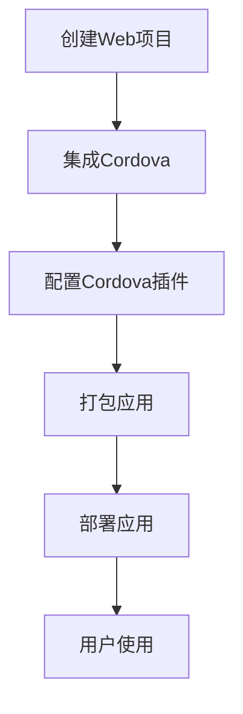

                 

关键词：Cordova，混合应用开发，移动开发，跨平台，原生应用，Web技术，开发者工具，移动框架。

## 摘要

本文将深入探讨Cordova框架，一个广泛用于混合移动应用开发的工具。我们将首先介绍Cordova的背景和核心概念，然后详细讲解其工作原理和主要特性。此外，我们将提供实用的项目实践和代码实例，帮助开发者更好地理解Cordova的应用场景。最后，本文将对Cordova的未来发展做出展望，并总结其主要优势和面临的挑战。

## 1. 背景介绍

随着移动设备的普及，移动应用开发成为软件开发领域的热点。传统的原生应用开发需要针对不同平台（如iOS和Android）编写独立的代码，这不仅增加了开发成本，也降低了开发效率。为了解决这个问题，跨平台开发框架应运而生，其中Cordova是最受欢迎的一个。

Cordova是由Adobe公司（现为Apache Cordova）发起的一个开源项目，旨在使用Web技术（如HTML、CSS和JavaScript）来开发跨平台的移动应用。通过Cordova，开发者可以将Web代码包装成原生应用，从而实现一次编写，多平台部署的目标。

Cordova的出现，解决了原生应用开发中的诸多痛点：

1. **减少重复劳动**：开发者不需要为每个平台编写独立的代码，从而节省了大量的时间和精力。
2. **共享代码**：大部分业务逻辑可以在Web层实现，从而提高代码的复用率。
3. **快速迭代**：Web技术的快速迭代特性使得开发者可以更快速地进行应用更新和优化。

## 2. 核心概念与联系

### 核心概念

Cordova的核心概念包括：

- **Webview**：Webview是一个内置在应用中的浏览器引擎，用于加载和渲染HTML页面。
- **插件**：Cordova插件是用于扩展Cordova核心功能的自定义代码模块。例如，用于访问设备摄像头、地理位置等的插件。
- **配置文件**：Cordova配置文件（如config.xml）定义了应用的设置和插件依赖。

### 架构原理

Cordova的工作原理可以概括为以下几个步骤：

1. **创建Web项目**：开发者使用HTML、CSS和JavaScript构建应用的前端部分。
2. **集成Cordova**：通过配置文件和命令行工具，将Web项目转换为Cordova项目。
3. **打包应用**：使用Cordova命令行工具，将Cordova项目打包成原生应用文件。
4. **部署应用**：将打包后的应用文件部署到移动设备或应用商店。

### Mermaid 流程图

以下是Cordova工作流程的Mermaid流程图：



## 3. 核心算法原理 & 具体操作步骤

### 3.1 算法原理概述

Cordova的核心算法主要涉及以下几个方面：

- **跨平台打包**：利用Web技术将应用打包成原生应用，实现一次编写，多平台部署。
- **插件机制**：通过插件机制，扩展Cordova的功能，实现对设备硬件的访问。
- **热更新**：支持热更新功能，允许开发者在不重新部署应用的情况下进行功能更新。

### 3.2 算法步骤详解

1. **创建Web项目**：使用HTML、CSS和JavaScript构建应用的前端部分。
2. **安装Cordova**：在命令行中运行`cordova -g`全局安装Cordova。
3. **初始化项目**：在Web项目目录中运行`cordova init`初始化Cordova项目。
4. **配置插件**：在config.xml文件中添加插件依赖，或在命令行中运行`cordova plugin add`添加插件。
5. **打包应用**：运行`cordova build`命令，将Cordova项目打包成原生应用文件。
6. **部署应用**：将打包后的应用文件部署到移动设备或应用商店。

### 3.3 算法优缺点

**优点**：

- **跨平台**：Cordova支持iOS和Android等主流平台，降低了开发成本。
- **快速迭代**：利用Web技术，可以快速开发和更新应用。
- **丰富插件**：Cordova插件库丰富，提供了对设备硬件的访问等功能。

**缺点**：

- **性能**：Web技术相比原生应用，在某些性能上存在一定差距。
- **兼容性**：Cordova应用需要考虑不同设备和浏览器的兼容性问题。

### 3.4 算法应用领域

Cordova主要应用于以下领域：

- **企业级应用**：企业可以使用Cordova快速构建跨平台的应用。
- **PWA（渐进式Web应用）**：Cordova支持PWA，使得Web应用可以具有原生应用的体验。
- **游戏开发**：虽然Cordova主要面向Web应用，但也可以用于游戏开发。

## 4. 数学模型和公式 & 详细讲解 & 举例说明

### 4.1 数学模型构建

在Cordova应用开发中，我们可以使用一些基本的数学模型来优化应用性能和用户体验。以下是一个简单的数学模型，用于计算页面加载时间：

$$
\text{加载时间} = \frac{\text{页面大小}}{\text{网络带宽}}
$$

### 4.2 公式推导过程

加载时间的计算公式可以通过以下步骤推导：

1. **页面大小**：页面大小可以通过计算HTML、CSS和JavaScript文件的总大小得到。
2. **网络带宽**：网络带宽可以通过测量用户网络连接的速度得到。

### 4.3 案例分析与讲解

假设一个页面大小为500KB，网络带宽为1Mbps。根据上述公式，我们可以计算出页面加载时间：

$$
\text{加载时间} = \frac{500KB}{1Mbps} = \frac{500 \times 1024B}{1 \times 1024KB/s} = 5s
$$

因此，该页面的加载时间为5秒。为了优化加载时间，我们可以考虑以下措施：

1. **减少页面大小**：通过压缩文件、删除不必要的代码和资源等手段减少页面大小。
2. **提高网络带宽**：通过使用更快的服务器、CDN（内容分发网络）等手段提高网络带宽。

## 5. 项目实践：代码实例和详细解释说明

### 5.1 开发环境搭建

在开始Cordova项目之前，我们需要搭建开发环境。以下是搭建Cordova开发环境的基本步骤：

1. **安装Node.js**：在官网上下载并安装Node.js。
2. **安装Cordova**：在命令行中运行`npm install -g cordova`安装Cordova。
3. **安装手机模拟器**：安装如Genymotion、Android Studio模拟器等手机模拟器。

### 5.2 源代码详细实现

以下是创建一个简单的Cordova应用的步骤：

1. **创建项目**：
   ```bash
   cordova create myApp com.example.myApp MyApp
   ```
2. **切换到项目目录**：
   ```bash
   cd myApp
   ```
3. **添加插件**：
   ```bash
   cordova plugin add cordova-plugin-splashscreen
   ```
4. **编辑配置文件**：
   ```xml
   <config-file target="config.xml" parent="/*">
       <feature name="SplashScreen">
           <param name="android-package" value="org.apache.cordova.splashscreen.SplashScreen"/>
       </feature>
   </config-file>
   ```
5. **启动开发服务器**：
   ```bash
   cordova run android
   ```

### 5.3 代码解读与分析

在上述步骤中，我们创建了一个简单的Cordova应用，并使用了SplashScreen插件来显示启动画面。以下是关键代码的解读：

- **创建项目**：`cordova create`命令创建了一个新的Cordova项目，并设置了项目的配置信息。
- **添加插件**：`cordova plugin add`命令添加了一个插件，用于显示启动画面。
- **编辑配置文件**：`<config-file>`元素用于修改config.xml文件，添加了SplashScreen插件的相关配置。
- **启动开发服务器**：`cordova run android`命令启动了Android平台上的开发服务器，用于运行和调试应用。

### 5.4 运行结果展示

在启动开发服务器后，我们可以在手机模拟器或真实设备上看到应用的运行结果。应用将首先显示一个启动画面，然后加载主页面。启动画面显示了Cordova的标志，表明应用已经成功启动。

## 6. 实际应用场景

Cordova框架在实际应用中具有广泛的应用场景，以下是一些典型的应用场景：

- **企业级应用**：企业可以使用Cordova快速构建跨平台的内部应用，提高工作效率。
- **教育应用**：教育机构可以使用Cordova开发互动式教育应用，提升学生的学习体验。
- **游戏开发**：游戏开发者可以利用Cordova实现跨平台的游戏应用，降低开发成本。

## 7. 工具和资源推荐

### 7.1 学习资源推荐

- **官方文档**：Apache Cordova的官方文档是学习Cordova的最佳资源。
- **在线教程**：许多在线平台提供了丰富的Cordova教程，如Codecademy、MDN Web Docs等。
- **书籍**：《Cordova Mobile Application Development》是一本非常受欢迎的Cordova入门书籍。

### 7.2 开发工具推荐

- **Visual Studio Code**：一个强大的代码编辑器，支持Cordova开发。
- **Genymotion**：一款功能强大的Android模拟器，适合Cordova开发者使用。
- **Cordova CLI**：Cordova的命令行工具，用于构建和管理Cordova项目。

### 7.3 相关论文推荐

- **"Cordova: Cross-Platform Mobile Development with Web Technologies"**：这篇论文介绍了Cordova的工作原理和优势。
- **"Hybrid Mobile Application Development: A Comparative Study of Cross-Platform Frameworks"**：该论文比较了多种跨平台开发框架，包括Cordova。

## 8. 总结：未来发展趋势与挑战

### 8.1 研究成果总结

Cordova作为跨平台移动应用开发框架，已经取得了显著的研究成果。其核心优势在于：

- **降低开发成本**：使用Web技术，实现一次编写，多平台部署。
- **提高开发效率**：通过插件机制，扩展功能，简化开发流程。

### 8.2 未来发展趋势

Cordova的未来发展趋势将集中在以下几个方面：

- **性能优化**：随着Web技术的不断进步，Cordova的性能将得到显著提升。
- **社区发展**：Cordova的社区将继续发展壮大，为开发者提供更丰富的资源和支持。
- **PWA支持**：Cordova将加强对渐进式Web应用（PWA）的支持，进一步提升应用的性能和用户体验。

### 8.3 面临的挑战

尽管Cordova具有诸多优势，但也面临着一些挑战：

- **性能瓶颈**：在某些场景下，Cordova的性能仍无法与原生应用相比。
- **兼容性问题**：不同设备和浏览器的兼容性问题可能导致开发难度增加。

### 8.4 研究展望

未来的研究工作可以集中在以下几个方面：

- **性能优化**：通过改进Webview和插件机制，提升Cordova的性能。
- **自动化测试**：开发自动化测试工具，提高Cordova应用的稳定性和可靠性。
- **开发者体验**：改进Cordova的开发工具和文档，降低开发门槛。

## 9. 附录：常见问题与解答

### 9.1 如何解决Cordova应用打包失败的问题？

**解答**：遇到Cordova应用打包失败的问题，可以尝试以下步骤：

1. **检查配置文件**：确保config.xml文件中的配置正确无误。
2. **更新插件**：使用`cordova plugin update`命令更新所有插件。
3. **清理项目**：在项目根目录下运行`cordova clean`命令清理项目。
4. **重新安装Cordova**：在命令行中运行`npm uninstall -g cordova`和`npm install -g cordova`卸载和重新安装Cordova。

### 9.2 如何在Cordova应用中调用原生API？

**解答**：在Cordova应用中调用原生API，需要使用Cordova插件。以下是创建和使用Cordova插件的步骤：

1. **创建插件**：使用`cordova plugin create`命令创建一个新的插件。
2. **实现插件**：在插件目录中编写JavaScript代码，实现插件的功能。
3. **集成插件**：在config.xml文件中添加插件依赖，并在应用代码中使用Cordova API调用插件功能。

### 9.3 如何优化Cordova应用的性能？

**解答**：优化Cordova应用的性能，可以从以下几个方面入手：

1. **减少HTTP请求**：合并CSS、JavaScript文件，减少HTTP请求次数。
2. **使用缓存**：合理使用浏览器缓存，减少资源的重复加载。
3. **优化CSS和JavaScript**：压缩CSS和JavaScript文件，减少文件大小。
4. **使用Web Workers**：将计算密集型任务分配给Web Workers，避免阻塞主线程。

## 作者署名

作者：禅与计算机程序设计艺术 / Zen and the Art of Computer Programming

----------------------------------------------------------------

以上完成了Cordova框架：混合移动应用开发的完整技术博客文章，涵盖了从背景介绍、核心概念、算法原理、项目实践、实际应用场景、工具和资源推荐、未来发展趋势与挑战，以及常见问题解答等各个方面，希望能够帮助到各位开发者更好地理解和使用Cordova框架。如果您有任何疑问或建议，欢迎在评论区留言。再次感谢您的阅读！

