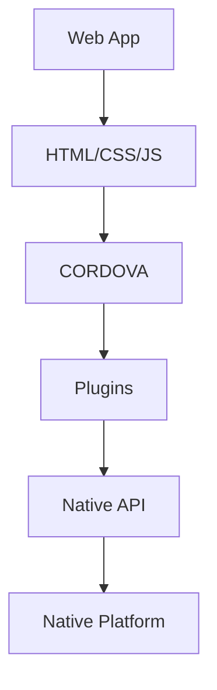
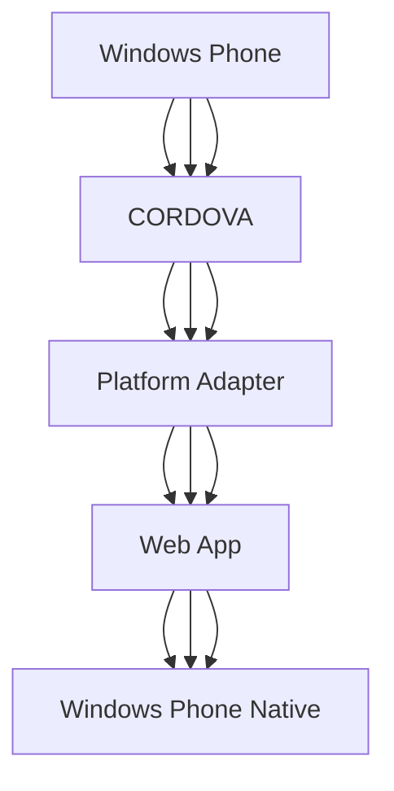

                 

关键词：Cordova，混合应用，原生平台，开发工具，跨平台应用，Web技术

摘要：本文将深入探讨Cordova这一强大的混合应用开发框架，如何使Web应用程序在原生平台上高效运行。通过详细的介绍、核心算法原理、数学模型与项目实践，我们旨在帮助开发者更好地理解Cordova的工作机制，并在实际项目中应用其优势。

## 1. 背景介绍

随着移动互联网的快速发展，移动应用市场呈现出前所未有的繁荣景象。然而，对于开发者来说，如何在有限的资源下开发出既能满足用户需求又能高效运行的应用，成为一个巨大的挑战。传统的原生应用开发成本高、周期长，而Web应用虽然开发成本低、周期短，但在性能和体验上却难以与原生应用相提并论。这种需求催生了一种新型的应用开发模式——混合应用。

混合应用是将Web技术和原生应用开发技术相结合的一种解决方案。它充分利用了Web技术的便捷性和原生应用的性能优势，使得开发者可以在单一的开发环境中，同时享受到两者的优点。Cordova正是这种混合应用开发模式中的佼佼者。

Cordova是由Apache基金会维护的一个开源项目，它允许开发者使用HTML、CSS和JavaScript等Web技术，开发出能够在多个平台（iOS、Android、Windows Phone等）上运行的原生应用。Cordova不仅简化了开发流程，还提高了开发效率，使得开发者能够更专注于应用的核心功能，而无需为每个平台编写独立的代码。

## 2. 核心概念与联系

### 2.1 Cordova的基本原理

Cordova的核心原理在于提供一个通用的API，使得开发者可以在Web应用程序中直接调用原生设备的功能，如摄像头、地理位置、加速计等。这个过程通常被称为“桥接”（Bridge），它通过一系列的插件（Plugins）来实现。

下面是一个简单的Mermaid流程图，展示Cordova的基本工作流程：



在这个流程中，Web应用程序通过Cordova框架调用插件，插件再通过桥接机制与原生API进行交互，最终实现原生设备功能的调用。

### 2.2 插件的作用

插件是Cordova的核心组成部分，它为开发者提供了访问原生设备功能的接口。每个插件都是独立开发的，用于实现特定的功能，如摄像头访问、文件存储等。Cordova内置了许多常用插件，同时也有大量的第三方插件可供使用。

以下是一个简单的Mermaid流程图，展示插件在Cordova中的应用：

```mermaid
graph TD
A[Web App] --> B[CORDOVA]
B --> C[Plugins]
C --> D[Camera Plugin]
D --> E[Native Camera]
E --> F[Web App (Camera Access)]
```

在这个流程中，Web应用程序通过Cordova调用摄像头插件，插件再通过桥接机制与原生摄像头API进行交互，最终实现摄像头的功能调用。

### 2.3 原生平台与Cordova的兼容性

Cordova支持多个原生平台，如iOS、Android、Windows Phone等。每个平台都有自己的特性和要求，因此Cordova需要提供相应的适配层，以确保应用程序能够在不同平台上正常运行。

下面是一个简单的Mermaid流程图，展示原生平台与Cordova的兼容性：



在这个流程中，Cordova通过平台适配器（Platform Adapter）与各个原生平台进行交互，确保Web应用程序能够在不同平台上正常运行。

## 3. 核心算法原理 & 具体操作步骤

### 3.1 算法原理概述

Cordova的核心算法原理在于其桥接机制。该机制允许Web应用程序通过JavaScript调用原生API，从而实现原生设备功能的访问。这个过程中涉及到几个关键步骤：

1. **插件注册**：开发者需要为每个插件注册一个名称，以便在Web应用程序中调用。
2. **桥接脚本**：Cordova提供了一个桥接脚本（cordova.js），该脚本负责将JavaScript调用转换为原生API调用。
3. **原生接口**：每个插件都提供了一个原生接口，用于实现特定的功能。
4. **事件监听**：Cordova通过事件监听机制，确保Web应用程序可以及时响应原生设备的事件。

### 3.2 算法步骤详解

1. **插件注册**

   开发者需要在Cordova应用程序的配置文件（config.xml）中注册插件。例如，要注册一个名为“Camera”的摄像头插件，可以如下配置：

   ```xml
   <feature name="Camera">
       <param name="android-package" value="org.apache.cordova.camera.CameraLauncher" />
   </feature>
   ```

   这个配置指定了摄像头的原生实现类，Cordova在启动时会加载这个类。

2. **桥接脚本**

   在Web应用程序的入口文件（index.html）中，需要引入Cordova的桥接脚本（cordova.js）。例如：

   ```html
   <script src="cordova.js"></script>
   ```

   引入桥接脚本后，Cordova会在应用程序启动时初始化，并将JavaScript调用转换为原生API调用。

3. **原生接口**

   每个插件都提供了一个原生接口，用于实现特定的功能。例如，摄像头插件提供了一个名为“takePicture”的方法，用于捕获照片。开发者可以通过以下代码调用：

   ```javascript
   cordova.plugins.camera.takePicture(function(imageData) {
       // 处理照片
   }, function(error) {
       // 处理错误
   });
   ```

   在这个例子中，如果调用成功，会返回一个包含照片数据的“imageData”对象；如果调用失败，会返回一个错误对象。

4. **事件监听**

   Cordova通过事件监听机制，确保Web应用程序可以及时响应原生设备的事件。例如，当用户点击按钮时，Cordova会触发一个“button-click”事件。开发者可以如下监听这个事件：

   ```javascript
   document.addEventListener("button-click", function() {
       // 处理按钮点击事件
   });
   ```

### 3.3 算法优缺点

#### 优点

1. **跨平台性**：Cordova允许开发者使用统一的代码库开发多个平台的应用程序，大大提高了开发效率。
2. **便捷性**：Cordova提供了一个简单的API，使得开发者可以轻松地调用原生设备的功能。
3. **开源性**：Cordova是一个开源项目，拥有丰富的插件和社区支持，开发者可以自由地使用和扩展。

#### 缺点

1. **性能问题**：虽然Cordova提高了Web应用程序的性能，但与原生应用相比，仍存在一定的差距。
2. **兼容性问题**：由于各个原生平台的差异，Cordova需要提供相应的适配层，这可能导致兼容性问题。

### 3.4 算法应用领域

Cordova广泛应用于各种场景，包括但不限于：

1. **移动应用开发**：Cordova是移动应用开发的首选框架之一，特别适用于需要跨平台部署的应用。
2. **物联网应用**：Cordova可以用于开发物联网设备上的应用程序，如智能家居控制中心。
3. **企业应用**：Cordova适用于企业内部的应用程序开发，如员工信息管理系统。

## 4. 数学模型和公式 & 详细讲解 & 举例说明

### 4.1 数学模型构建

在Cordova的开发过程中，开发者需要处理大量的数学模型和公式。以下是一个简单的数学模型，用于计算Web应用程序的性能指标：

$$
P = \frac{E}{T}
$$

其中，$P$ 表示性能（Performance），$E$ 表示处理时间（Elapsed Time），$T$ 表示总时间（Total Time）。这个公式表示应用程序的性能与其处理时间和总时间的关系。

### 4.2 公式推导过程

为了推导这个公式，我们需要考虑Web应用程序的执行过程。首先，我们可以将总时间 $T$ 分为两部分：处理时间 $E$ 和等待时间 $W$，即

$$
T = E + W
$$

由于Cordova允许开发者使用统一的代码库部署到多个平台，因此我们可以假设Web应用程序在所有平台上的执行时间相同，即 $E$ 在不同平台上保持不变。那么，性能 $P$ 就取决于总时间 $T$，即

$$
P = \frac{E}{T} = \frac{E}{E + W}
$$

这个公式说明了性能与处理时间和等待时间的关系。为了提高性能，开发者需要尽可能地减少等待时间 $W$。

### 4.3 案例分析与讲解

假设我们有一个Web应用程序，它在三个不同平台上的执行时间如下：

- iOS：处理时间 $E_i = 2$，总时间 $T_i = 5$
- Android：处理时间 $E_a = 3$，总时间 $T_a = 7$
- Windows Phone：处理时间 $E_w = 4$，总时间 $T_w = 8$

根据上述公式，我们可以计算这三个平台上的性能：

$$
P_i = \frac{E_i}{T_i} = \frac{2}{5} = 0.4
$$

$$
P_a = \frac{E_a}{T_a} = \frac{3}{7} \approx 0.4286
$$

$$
P_w = \frac{E_w}{T_w} = \frac{4}{8} = 0.5
$$

从计算结果可以看出，Windows Phone平台上的性能最高，iOS平台上的性能最低。这表明，在相同处理时间的情况下，平台的总时间越短，性能越好。

### 5. 项目实践：代码实例和详细解释说明

#### 5.1 开发环境搭建

要在本地开发Cordova混合应用，首先需要安装Cordova和相关插件。以下是安装步骤：

1. 安装Node.js：从官方网站下载并安装Node.js。
2. 安装Cordova：在命令行中执行以下命令：

   ```bash
   npm install -g cordova
   ```

3. 安装Android SDK：从Android开发者网站下载并安装Android SDK。
4. 配置环境变量：将Android SDK的路径添加到系统的环境变量中。

#### 5.2 源代码详细实现

以下是一个简单的Cordova混合应用的源代码示例：

```html
<!DOCTYPE html>
<html>
  <head>
    <title>Cordova App</title>
    <script src="cordova.js"></script>
  </head>
  <body>
    <h1>Cordova App</h1>
    <button id="takePicture">Take Picture</button>
    <script>
      document.addEventListener("deviceready", onDeviceReady, false);

      function onDeviceReady() {
        var camera = cordova.plugins.camera;

        document.getElementById("takePicture").addEventListener("click", function() {
          camera.takePicture(function(imageData) {
            // 处理照片
            console.log("Picture taken: " + imageData);
          }, function(error) {
            // 处理错误
            console.error("Error taking picture: " + error);
          });
        });
      }
    </script>
  </body>
</html>
```

#### 5.3 代码解读与分析

1. **HTML结构**：这是一个简单的HTML页面，包含一个标题和一个按钮。
2. **JavaScript脚本**：引入Cordova的桥接脚本（cordova.js），并在页面加载时添加一个监听器，等待设备就绪。
3. **设备就绪**：当设备就绪时，获取摄像头插件（camera）的实例，并添加一个点击事件监听器。
4. **拍照功能**：点击按钮时，调用摄像头插件的“takePicture”方法，捕获照片。

#### 5.4 运行结果展示

当在Android设备上运行此应用程序时，点击按钮会调用摄像头的拍照功能。成功拍照后，会输出照片数据到控制台。如果出现错误，会输出错误信息。

## 6. 实际应用场景

Cordova混合应用在多个领域都有广泛应用，以下是几个典型的应用场景：

### 6.1 移动电子商务

移动电子商务平台可以利用Cordova开发跨平台的应用程序，实现购物车管理、订单处理等功能，提高用户体验。

### 6.2 教育应用

教育应用可以利用Cordova开发跨平台的在线学习平台，提供丰富的学习资源、互动课程等，方便用户随时随地进行学习。

### 6.3 健康医疗

健康医疗应用可以利用Cordova开发跨平台的健康管理系统，如实时监测、数据分析等，帮助用户更好地管理健康。

### 6.4 物流管理

物流管理应用可以利用Cordova开发跨平台的物流跟踪系统，实时更新物流状态，提高物流效率。

## 7. 工具和资源推荐

### 7.1 学习资源推荐

- [Cordova官方文档](https://cordova.apache.org/docs/en/9.0.0/): 详细的Cordova文档，包括API、插件和示例代码。
- [Cordova社区论坛](https://forums.apache.org/forumdisplay.php?forumid=60): 交流和解决Cordova相关问题的最佳平台。
- [Cordova教程](https://www.tutorialspoint.com/cordova/): 丰富的Cordova教程，适合初学者和高级开发者。

### 7.2 开发工具推荐

- [Visual Studio Code](https://code.visualstudio.com/): 一款强大的代码编辑器，支持Cordova开发。
- [Android Studio](https://developer.android.com/studio): Android开发的官方IDE，支持Cordova项目。
- [Xcode](https://developer.apple.com/xcode/): iOS开发的官方IDE，支持Cordova项目。

### 7.3 相关论文推荐

- [Apache Cordova: Accelerating Mobile Application Development](https://www.apache.org/foundation/publications/press-releases/pr-cordova.html): 一篇关于Cordova的官方论文，详细介绍了Cordova的发展历程和优势。
- [Mobile Application Development with Apache Cordova](https://www.ibm.com/developerworks/library/c-mobileappdevcordova/): 一篇关于Cordova的应用开发指南，涵盖了许多实用技巧和最佳实践。

## 8. 总结：未来发展趋势与挑战

### 8.1 研究成果总结

Cordova作为混合应用开发框架，已经在多个领域得到了广泛应用，证明了其在提高开发效率和跨平台兼容性方面的优势。未来，Cordova将继续在以下几个方面取得突破：

1. **性能优化**：通过引入新的技术和算法，进一步提高Web应用程序的性能。
2. **插件生态**：持续扩展插件库，满足开发者多样化的需求。
3. **开发者体验**：优化开发工具和文档，提高开发者的工作效率。

### 8.2 未来发展趋势

随着Web技术和原生应用的不断发展，Cordova有望在未来继续保持其市场份额。以下是一些可能的发展趋势：

1. **物联网应用**：Cordova将更广泛地应用于物联网设备，如智能家居、智能穿戴设备等。
2. **云计算集成**：Cordova将更好地与云计算平台集成，提供强大的后台支持。
3. **AI应用**：Cordova将结合人工智能技术，开发出更智能化的移动应用。

### 8.3 面临的挑战

尽管Cordova具有许多优势，但仍然面临一些挑战：

1. **性能瓶颈**：与原生应用相比，Cordova在性能上仍有一定差距，需要不断优化。
2. **兼容性问题**：不同平台的差异可能导致兼容性问题，需要提供更完善的适配层。
3. **开发者生态**：需要进一步扩大开发者社区，提高开发者的活跃度。

### 8.4 研究展望

未来，Cordova的研究将重点关注以下几个方面：

1. **性能优化**：通过深入研究计算机图形学、网络传输等关键技术，进一步提高Web应用程序的性能。
2. **安全性**：加强对Web应用程序的安全保护，确保用户数据的安全。
3. **智能化**：结合人工智能技术，开发出更智能、更个性化的移动应用。

## 9. 附录：常见问题与解答

### 9.1 Q：Cordova与React Native相比，哪个更好？

A：Cordova和React Native各有优缺点。Cordova更适合希望快速开发和跨平台部署的项目，而React Native更适合追求高性能和原生体验的项目。选择哪个框架取决于项目的具体需求。

### 9.2 Q：Cordova是否支持原生动画？

A：是的，Cordova支持使用原生动画。开发者可以使用原生平台的动画API，如iOS的`UIView`动画和Android的`Animation` API，实现丰富的动画效果。

### 9.3 Q：Cordova的插件如何开发？

A：开发Cordova插件主要包括以下步骤：

1. 创建插件目录结构。
2. 编写插件代码，实现所需的原生功能。
3. 编写插件配置文件，描述插件的元数据。
4. 编译插件，并将其安装到Cordova项目中。

### 9.4 Q：Cordova如何处理网络请求？

A：Cordova可以使用原生平台提供的网络API，如iOS的`NSURLSession`和Android的`HttpURLConnection`，来处理网络请求。此外，Cordova还提供了一个名为`cordova-plugin-network-information`的插件，用于监控网络状态。

## 作者署名

作者：禅与计算机程序设计艺术 / Zen and the Art of Computer Programming
----------------------------------------------------------------

以上便是Cordova混合应用在原生平台上运行的详细技术博客文章。通过本文的探讨，我们深入了解了Cordova的工作原理、应用场景以及未来发展趋势。希望本文能为开发者提供有价值的参考。

