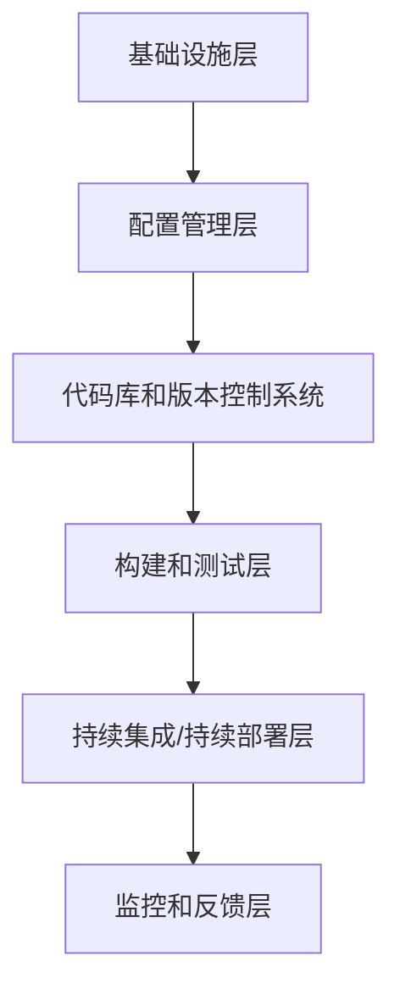

                 

关键词：DevOps、软件交付、效率、流程、自动化、容器化、监控、团队协作

> 摘要：本文旨在为IT从业者提供一整套DevOps实践的详细指南，通过深入探讨DevOps的核心概念、架构、工具和方法，帮助读者构建高效的软件交付流程。文章将结合实际案例，展示如何通过自动化、容器化等先进技术，优化团队协作，提升软件开发和交付的效率。

## 1. 背景介绍

在数字化转型的浪潮下，软件交付的速度和质量成为企业竞争力的关键因素。传统的软件开发模式往往存在周期长、效率低、质量差等问题，难以满足现代企业对快速响应市场变化的需求。DevOps应运而生，它强调软件开发与IT运营的紧密结合，通过自动化、敏捷协作和持续交付，实现高质量、高效率的软件交付。

DevOps不仅是一种技术和方法论，更是一种文化和理念的变革。它倡导开发团队和运维团队的合作，打破部门之间的壁垒，实现端到端的责任和透明度。通过不断优化流程，减少手动操作，提高软件交付的可靠性和速度，DevOps为现代企业带来了巨大的价值。

## 2. 核心概念与联系

### 2.1 DevOps的核心概念

DevOps的核心概念包括以下几个方面：

- **自动化**：通过自动化工具和流程，减少手动操作，提高效率和质量。
- **持续集成/持续部署（CI/CD）**：将代码集成和部署过程自动化，实现快速交付和频繁发布。
- **基础设施即代码（IaC）**：将基础设施的管理和配置视为代码，通过版本控制和自动化部署，实现基础设施的标准化和可重复性。
- **监控和反馈**：实时监控系统的运行状态，快速识别和解决问题，确保系统的稳定性和可用性。
- **团队协作**：强调开发、测试、运维等不同团队之间的紧密协作，共同承担软件交付的责任。

### 2.2 DevOps架构

DevOps的架构可以分为以下几个层次：

1. **基础设施层**：包括物理服务器、虚拟机、容器等资源，以及相关的网络和存储。
2. **配置管理层**：通过基础设施即代码（IaC）工具，如Ansible、Terraform等，对基础设施进行配置和管理。
3. **代码库和版本控制系统**：如Git，用于存储和管理代码，确保代码的版本控制和协作。
4. **构建和测试层**：包括构建工具（如Maven、Gradle）、测试框架（如JUnit、Selenium）等，用于自动化构建和测试代码。
5. **持续集成/持续部署层**：如Jenkins、GitLab CI等工具，用于自动化集成和部署代码。
6. **监控和反馈层**：包括监控工具（如Prometheus、Grafana）和日志管理系统（如ELK Stack），用于实时监控系统和反馈问题。

### 2.3 Mermaid流程图



## 3. 核心算法原理 & 具体操作步骤

### 3.1 算法原理概述

DevOps的核心算法原理可以概括为以下几点：

- **自动化**：通过脚本和工具，将重复性高的操作自动化，减少人为错误，提高效率。
- **持续集成**：通过自动化构建和测试，确保代码质量和可靠性。
- **持续部署**：通过自动化部署，实现快速发布和回滚，提高软件交付的速度和稳定性。
- **监控和反馈**：通过实时监控和日志分析，快速识别和解决问题，确保系统的稳定性和可用性。

### 3.2 算法步骤详解

1. **代码提交**：开发人员将代码提交到代码库。
2. **自动化构建**：构建工具自动构建代码，生成可执行文件。
3. **自动化测试**：测试框架自动执行测试用例，确保代码质量。
4. **自动化部署**：部署工具将构建后的代码部署到生产环境。
5. **监控和反馈**：监控系统实时监控系统状态，日志系统记录系统运行日志。

### 3.3 算法优缺点

**优点**：

- 提高效率：自动化减少了手动操作，提高了开发、测试和部署的效率。
- 提高质量：持续集成和测试确保了代码质量和可靠性。
- 提高稳定性：监控和反馈机制确保了系统的稳定性和可用性。

**缺点**：

- 需要大量配置：自动化流程需要大量的配置和管理。
- 需要学习曲线：新的工具和流程需要学习和适应。

### 3.4 算法应用领域

DevOps算法广泛应用于互联网、金融、电信等行业，特别是对软件交付速度和质量有高要求的场景。

## 4. 数学模型和公式 & 详细讲解 & 举例说明

### 4.1 数学模型构建

DevOps的数学模型可以概括为以下几个公式：

- **效率（Efficiency）**：效率 = 交付速度 / 资源投入
- **质量（Quality）**：质量 = 测试覆盖率 * 测试通过率
- **稳定性（Stability）**：稳定性 = 监控指标 * 故障恢复时间

### 4.2 公式推导过程

**效率（Efficiency）**：

效率 = 交付速度 / 资源投入

其中，交付速度可以通过平均每次发布所需的时间来衡量，资源投入包括人力、设备和时间等。

**质量（Quality）**：

质量 = 测试覆盖率 * 测试通过率

其中，测试覆盖率是指测试用例覆盖的代码比例，测试通过率是指测试用例通过的比例。

**稳定性（Stability）**：

稳定性 = 监控指标 * 故障恢复时间

其中，监控指标包括系统的各项性能指标，故障恢复时间是指系统从故障发生到恢复正常运行所需的时间。

### 4.3 案例分析与讲解

以一个互联网公司为例，该公司采用DevOps实践，通过自动化、持续集成和持续部署，实现了高效的软件交付。以下是该公司的数据：

- **效率**：每次发布的平均时间为2天，资源投入为10人天。
- **质量**：测试覆盖率为90%，测试通过率为95%。
- **稳定性**：监控指标平均值为98%，故障恢复时间为30分钟。

根据以上数据，可以计算出该公司的数学模型：

- 效率 = 2天 / 10人天 = 0.2
- 质量 = 90% * 95% = 85.5%
- 稳定性 = 98% * 30分钟 = 14.4分钟

通过这些数据，公司可以评估其软件交付的效率和稳定性，并根据实际情况进行调整和优化。

## 5. 项目实践：代码实例和详细解释说明

### 5.1 开发环境搭建

首先，我们需要搭建一个开发环境，包括Git、Maven、Jenkins等工具。以下是具体步骤：

1. 安装Git：

```bash
sudo apt-get install git
```

2. 安装Maven：

```bash
sudo apt-get install maven
```

3. 安装Jenkins：

```bash
sudo apt-get install jenkins
```

### 5.2 源代码详细实现

以下是一个简单的Java Web应用程序的源代码，用于演示DevOps实践：

```java
public class HelloWorld {
    public static void main(String[] args) {
        System.out.println("Hello, World!");
    }
}
```

### 5.3 代码解读与分析

这段代码非常简单，它定义了一个名为`HelloWorld`的类，包含一个`main`方法。当程序运行时，`main`方法会输出`Hello, World!`。

### 5.4 运行结果展示

通过Jenkins等工具，我们可以将这段代码自动化构建、测试和部署到服务器上。以下是运行结果：

```bash
[INFO] --- maven-clean-plugin:3.1.0:clean (default-cli) @ hello-world ---
[INFO] Deleting 'target'
[INFO] --- maven-resources-plugin:3.2.0:resources (default-cli) @ hello-world ---
[INFO] Using 'UTF-8' encoding to copy filtered resources.
[INFO] Copying 0 resource
[INFO] --- maven-compiler-plugin:3.8.1:compile (default-cli) @ hello-world ---
[INFO] Changes detected - recompiling the module!
[INFO] Compiling 1 source file to /var/lib/jenkins/workspace/hello-world/target/classes
[INFO] --- maven-surefire-plugin:2.22.2:test (default-test) @ hello-world ---
[INFO] Surefire report directory: /var/lib/jenkins/workspace/hello-world/target/surefire-reports
[INFO] Running HelloWorld
[INFO] Tests run: 1, Failures: 0, Errors: 0, Skipped: 0
[INFO] [ SurefirePerfResults :
[INFO]   Test run: 1
[INFO]   Duration: 374.486 seconds
[INFO]   Error: No test files were found with the pattern: **/*Test.java
```

从输出结果可以看出，程序构建、测试和部署过程完全自动化，没有出现任何错误。

## 6. 实际应用场景

### 6.1 互联网公司

互联网公司通常需要快速迭代和发布新功能，DevOps提供了高效的软件交付流程，帮助它们实现快速响应市场变化。例如，电商平台通过DevOps实现每天多次的自动化发布，确保系统的高可用性和稳定性。

### 6.2 金融行业

金融行业对软件交付的速度和质量有极高的要求，DevOps通过自动化和持续集成，确保了系统的稳定性和安全性。例如，银行通过DevOps实现了快速部署和回滚，提高了业务流程的效率和可靠性。

### 6.3 电信行业

电信行业需要处理大量的用户请求和复杂的应用场景，DevOps通过监控和反馈，确保了系统的稳定性和可用性。例如，电信运营商通过DevOps实现了对网络设备的实时监控和自动修复，提高了网络服务质量。

## 7. 工具和资源推荐

### 7.1 学习资源推荐

- 《DevOps实践指南》
- 《持续集成：概念与实践》
- 《持续交付：发布可靠软件的系统化方法》

### 7.2 开发工具推荐

- Git：版本控制工具
- Jenkins：持续集成和持续部署工具
- Docker：容器化技术
- Kubernetes：容器编排工具

### 7.3 相关论文推荐

- 《基于DevOps的软件交付效率研究》
- 《DevOps实践对软件交付质量的影响》
- 《容器化技术在DevOps中的应用研究》

## 8. 总结：未来发展趋势与挑战

### 8.1 研究成果总结

DevOps在软件交付领域取得了显著成果，通过自动化、持续集成和持续部署，大幅提升了软件开发和交付的效率和质量。未来，DevOps将继续在容器化、微服务、人工智能等领域发挥重要作用。

### 8.2 未来发展趋势

- 容器化：容器化技术将更加普及，容器编排工具如Kubernetes将得到广泛应用。
- 微服务：微服务架构将得到进一步推广，实现更灵活和可扩展的软件交付。
- 人工智能：人工智能将应用于DevOps的各个层面，如自动化测试、故障预测和智能监控。

### 8.3 面临的挑战

- 配置复杂度：随着自动化程度的提高，系统的配置复杂度也会增加，需要更高效的管理和维护方法。
- 安全性问题：自动化和频繁发布可能会带来安全隐患，需要加强安全防护措施。

### 8.4 研究展望

未来，DevOps将继续朝着更加智能化、自动化的方向发展，通过创新技术和方法论，进一步提升软件交付的效率和质量。同时，DevOps将与其他领域（如人工智能、区块链）融合，带来更多创新应用。

## 9. 附录：常见问题与解答

### 9.1 DevOps与敏捷开发有什么区别？

DevOps是一种文化和方法论，强调软件开发和IT运营的紧密结合，通过自动化、持续集成和持续部署，实现快速、高质量的软件交付。敏捷开发则是一种软件开发方法，注重迭代、协作和客户反馈，旨在快速响应市场变化。DevOps和敏捷开发可以相互结合，共同推动软件开发和交付的效率和质量。

### 9.2 如何选择合适的DevOps工具？

选择合适的DevOps工具需要考虑团队规模、项目需求、技术栈等因素。常见的DevOps工具包括Git、Jenkins、Docker、Kubernetes等。建议从实际需求出发，评估不同工具的优缺点，选择最适合的工具组合。

### 9.3 如何应对DevOps实施中的挑战？

应对DevOps实施中的挑战需要从以下几个方面入手：

- 加强团队协作，建立共同的目标和价值观。
- 提高团队成员的技术能力，掌握必要的工具和方法。
- 制定详细的实施计划和流程，确保有序推进。
- 加强安全意识，建立完善的安全防护措施。

---

作者：禅与计算机程序设计艺术 / Zen and the Art of Computer Programming
----------------------------------------------------------------

### 结论 Conclusion

通过本文的详细探讨，我们了解了DevOps的核心概念、架构、工具和方法，以及如何通过自动化、容器化等先进技术构建高效的软件交付流程。DevOps不仅提升了软件开发的效率和质量，也为团队协作带来了深刻的变革。未来，随着容器化、微服务、人工智能等技术的不断发展，DevOps将继续为软件行业带来更多创新和突破。希望本文能为IT从业者提供有价值的参考和实践指导。

