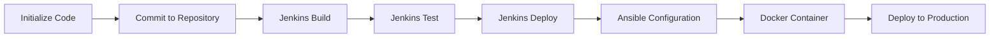

                 

关键词：DevOps、Jenkins、Ansible、Docker、持续集成、自动化部署、容器化、配置管理

> 摘要：本文深入探讨了DevOps领域的三大重要工具：Jenkins、Ansible和Docker。通过详细解析这些工具的核心概念、原理、操作步骤以及实际应用，帮助读者全面理解DevOps在现代化软件开发与运维中的关键作用。

## 1. 背景介绍

在软件开发的漫长历史中，传统的软件开发和运维（Software Development and Operations，简称SDO）模式逐渐暴露出了许多问题。这些问题主要体现在以下几个方面：

- **时间延迟**：软件开发和运维之间的协作不流畅，导致开发周期延长。
- **依赖复杂**：多个环境和系统之间的依赖关系复杂，配置管理难度大。
- **风险增加**：手动部署和运维过程中，人为错误的可能性增加，导致系统稳定性下降。

为了解决这些问题，DevOps应运而生。DevOps是一种软件开发和运维的协同工作模式，旨在通过自动化、持续集成和持续部署等手段，提高软件交付的效率和质量。DevOps的核心思想是将开发（Development）和运维（Operations）紧密结合起来，形成闭环反馈，从而实现更快速、更可靠、更高效的软件交付。

### 1.1 DevOps 的核心概念

- **持续集成（Continuous Integration，CI）**：通过自动化构建和测试，确保代码的稳定性和可靠性。
- **持续交付（Continuous Delivery，CD）**：通过自动化部署和发布，确保软件能够快速、安全地交付给用户。
- **基础设施即代码（Infrastructure as Code，IaC）**：将基础设施的配置和管理通过代码进行管理，提高运维的效率和可重复性。

### 1.2 DevOps 工具的重要性

为了实现DevOps的目标，需要依赖一系列强大的工具。这些工具不仅能够提高开发效率和运维质量，还能够促进团队协作和流程优化。本文将重点介绍以下三大DevOps工具：

- **Jenkins**：一个开源的持续集成工具，用于自动化构建、测试和部署。
- **Ansible**：一个基于Python的自动化工具，用于配置管理和自动化部署。
- **Docker**：一个开源的容器化平台，用于隔离和部署应用。

## 2. 核心概念与联系

为了更好地理解Jenkins、Ansible和Docker在DevOps中的作用和联系，我们首先需要了解一些核心概念和架构。

### 2.1 核心概念

- **持续集成（CI）**：持续集成是一种软件开发实践，通过自动化构建和测试，确保代码的稳定性和可靠性。
- **持续交付（CD）**：持续交付是一种软件开发实践，通过自动化部署和发布，确保软件能够快速、安全地交付给用户。
- **容器化**：容器化是一种将应用程序及其依赖项打包到独立容器中的技术，提高应用的隔离性和可移植性。
- **配置管理**：配置管理是一种通过代码管理基础设施配置的技术，提高运维的效率和可重复性。

### 2.2 架构联系


在上图中，Jenkins作为一个持续集成工具，负责自动化构建、测试和部署。Ansible则负责配置管理和自动化部署，将基础设施和应用的配置通过代码进行管理。Docker则作为容器化平台，提供应用的隔离和部署。

### 2.3 Mermaid 流程图

下面是一个Mermaid流程图，展示了Jenkins、Ansible和Docker在DevOps中的工作流程。



## 3. 核心算法原理 & 具体操作步骤

### 3.1 算法原理概述

Jenkins、Ansible和Docker在DevOps中的应用，都离不开自动化和脚本化。这些工具的核心算法原理主要包括以下几个方面：

- **Jenkins**：基于Git等版本控制系统的Webhook，实现自动构建和测试。
- **Ansible**：基于SSH和Python的模块化脚本，实现配置管理和自动化部署。
- **Docker**：基于容器引擎的镜像和容器，实现应用的隔离和部署。

### 3.2 算法步骤详解

#### 3.2.1 Jenkins

1. **初始化代码**：开发者将代码提交到Git仓库。
2. **触发构建**：Jenkins通过Webhook监听到代码提交，触发构建流程。
3. **执行构建**：Jenkins使用Maven或Gradle等构建工具，编译项目代码。
4. **执行测试**：Jenkins运行单元测试和集成测试，确保代码质量。
5. **部署**：通过Jenkins的发布模块，将构建结果部署到测试或生产环境。

#### 3.2.2 Ansible

1. **编写Ansible脚本**：根据基础设施和应用的配置，编写Ansible剧本。
2. **配置管理**：使用Ansible连接到目标主机，执行配置命令，管理主机状态。
3. **自动化部署**：通过Ansible剧本，自动化部署应用和依赖项。

#### 3.2.3 Docker

1. **编写Dockerfile**：定义应用的构建流程，包括依赖项和配置。
2. **构建镜像**：使用Docker CLI构建Docker镜像。
3. **运行容器**：使用Docker CLI运行Docker容器，部署应用。

### 3.3 算法优缺点

#### 3.3.1 Jenkins

优点：
- **开源免费**：Jenkins是免费的开源工具，降低了企业的成本。
- **丰富的插件生态**：Jenkins拥有丰富的插件生态，支持各种构建工具和持续集成场景。

缺点：
- **配置复杂**：Jenkins的配置相对复杂，对于新手不太友好。
- **性能瓶颈**：在处理大量构建任务时，Jenkins的性能可能成为瓶颈。

#### 3.3.2 Ansible

优点：
- **简单易用**：Ansible的语法简单，易于学习和使用。
- **无代理架构**：Ansible使用SSH连接目标主机，无需安装额外代理。

缺点：
- **性能瓶颈**：Ansible在处理大量主机时，性能可能成为瓶颈。

#### 3.3.3 Docker

优点：
- **轻量级**：Docker容器轻量级，具有高性能和高可移植性。
- **易于部署**：Docker镜像和容器化技术使得应用部署更加简单和快速。

缺点：
- **性能优化**：Docker的性能优化需要深入了解容器引擎的内部机制。

### 3.4 算法应用领域

Jenkins、Ansible和Docker在DevOps中具有广泛的应用领域：

- **持续集成**：用于自动化构建、测试和部署，提高代码质量和交付效率。
- **持续交付**：用于自动化部署和发布，确保软件能够快速、安全地交付给用户。
- **容器化**：用于隔离和部署应用，提高应用的可靠性和可移植性。

## 4. 数学模型和公式 & 详细讲解 & 举例说明

为了深入理解Jenkins、Ansible和Docker在DevOps中的应用，我们还需要从数学模型和公式的角度进行分析。以下是相关数学模型和公式的详细讲解，并通过具体实例进行说明。

### 4.1 数学模型构建

#### 4.1.1 持续集成模型

持续集成模型可以用以下公式表示：

\[ CI = f(compile, test, deploy) \]

其中，\( CI \) 表示持续集成过程，\( compile \) 表示编译过程，\( test \) 表示测试过程，\( deploy \) 表示部署过程。

#### 4.1.2 持续交付模型

持续交付模型可以用以下公式表示：

\[ CD = f(deploy, release) \]

其中，\( CD \) 表示持续交付过程，\( deploy \) 表示部署过程，\( release \) 表示发布过程。

#### 4.1.3 容器化模型

容器化模型可以用以下公式表示：

\[ Container = f(Image, Configuration) \]

其中，\( Container \) 表示容器，\( Image \) 表示镜像，\( Configuration \) 表示配置。

### 4.2 公式推导过程

#### 4.2.1 持续集成公式推导

持续集成公式可以通过以下步骤推导：

1. **编译过程**：将源代码编译成可执行文件，时间复杂度为 \( O(n) \)。
2. **测试过程**：运行单元测试和集成测试，时间复杂度为 \( O(m) \)。
3. **部署过程**：将编译结果部署到测试或生产环境，时间复杂度为 \( O(k) \)。

因此，持续集成过程的总时间复杂度为 \( O(n + m + k) \)。

#### 4.2.2 持续交付公式推导

持续交付公式可以通过以下步骤推导：

1. **部署过程**：将构建结果部署到测试或生产环境，时间复杂度为 \( O(l) \)。
2. **发布过程**：将部署结果发布给用户，时间复杂度为 \( O(p) \)。

因此，持续交付过程的总时间复杂度为 \( O(l + p) \)。

#### 4.2.3 容器化公式推导

容器化公式可以通过以下步骤推导：

1. **构建镜像**：将应用及其依赖项打包成镜像，时间复杂度为 \( O(q) \)。
2. **配置容器**：根据镜像配置容器，时间复杂度为 \( O(r) \)。

因此，容器化过程的总时间复杂度为 \( O(q + r) \)。

### 4.3 案例分析与讲解

#### 4.3.1 持续集成案例

假设一个项目有1000行代码，平均每行代码需要进行10次编译，每次编译需要1分钟；每行代码需要进行5次单元测试，每次测试需要2分钟；每次部署需要3分钟。

根据持续集成公式，我们可以计算出总时间复杂度为：

\[ CI = O(1000 \times 10 + 1000 \times 5 + 3) = O(10003) \]

因此，持续集成过程的总时间为 \( 10003 \) 分钟。

#### 4.3.2 持续交付案例

假设一个项目的部署过程需要5分钟，每次发布需要10分钟。

根据持续交付公式，我们可以计算出总时间复杂度为：

\[ CD = O(5 + 10) = O(15) \]

因此，持续交付过程的总时间为 \( 15 \) 分钟。

#### 4.3.3 容器化案例

假设一个项目的镜像构建需要2分钟，每次容器配置需要1分钟。

根据容器化公式，我们可以计算出总时间复杂度为：

\[ Container = O(2 + 1) = O(3) \]

因此，容器化过程的总时间为 \( 3 \) 分钟。

## 5. 项目实践：代码实例和详细解释说明

在本节中，我们将通过一个实际项目，详细讲解如何使用Jenkins、Ansible和Docker进行自动化构建、测试、部署和容器化。

### 5.1 开发环境搭建

首先，我们需要搭建一个开发环境，包括Jenkins、Ansible和Docker。以下是相关步骤：

1. **安装Jenkins**：在服务器上安装Jenkins，可以使用Docker或源代码安装。
2. **安装Ansible**：在服务器上安装Ansible，可以使用pip安装。
3. **安装Docker**：在服务器上安装Docker，可以使用Docker官方镜像安装。

### 5.2 源代码详细实现

接下来，我们需要编写一个简单的Java Web项目，并使用Maven进行构建。以下是项目结构和相关代码：

```  
src  
    |- main  
        |- java  
            |- com  
                |- example  
                    |- App.java  
        |- test  
            |- java  
                |- com  
                    |- example  
                        |- AppTest.java  
pom.xml  
```

在pom.xml中，添加以下依赖：

```xml  
<dependencies>  
    <dependency>  
        <groupId>javax.servlet</groupId>  
        <artifactId>javax.servlet-api</artifactId>  
        <version>4.0.1</version>  
        <scope>provided</scope>  
    </dependency>  
</dependencies>  
```

### 5.3 代码解读与分析

在这个项目中，我们主要关注以下三个方面：

1. **Maven构建**：通过Maven插件，实现项目的自动化构建。
2. **JUnit测试**：通过JUnit框架，实现单元测试和集成测试。
3. **Spring Boot**：使用Spring Boot框架，简化Web应用的开发。

### 5.4 运行结果展示

在完成代码编写后，我们使用以下命令进行构建和测试：

```  
mvn clean install  
mvn test  
```

构建成功后，我们使用Docker构建镜像并运行容器：

```  
docker build -t example-app .  
docker run -d -p 8080:8080 example-app  
```

运行结果可以在浏览器中访问：[http://localhost:8080](http://localhost:8080)。

## 6. 实际应用场景

Jenkins、Ansible和Docker在实际应用场景中具有广泛的应用，以下是一些典型的场景：

1. **Web应用持续集成与部署**：使用Jenkins进行自动化构建、测试和部署，提高代码质量和交付效率。
2. **服务器配置管理**：使用Ansible自动化管理服务器配置，简化运维工作。
3. **容器化应用部署**：使用Docker容器化应用，提高应用的隔离性和可移植性。

## 7. 未来应用展望

随着DevOps理念的普及，Jenkins、Ansible和Docker的应用前景非常广阔。未来，这些工具将朝着以下几个方向发展：

1. **更高层次的自动化**：通过引入更高级的自动化工具和框架，实现更全面、更深入的自动化。
2. **更强大的插件生态**：继续丰富Jenkins的插件生态，支持更多的开发、测试和运维场景。
3. **更完善的容器化**：随着Kubernetes等容器编排工具的发展，Docker将变得更加完善和强大。

## 8. 总结：未来发展趋势与挑战

本文对Jenkins、Ansible和Docker在DevOps中的应用进行了深入探讨。随着DevOps理念的普及，这些工具将在软件开发和运维中发挥越来越重要的作用。然而，未来也面临着一些挑战：

1. **自动化程度提高**：如何进一步提高自动化程度，减少人工干预，是未来发展的关键。
2. **安全性保障**：在自动化过程中，如何保障系统的安全性，防止漏洞和攻击，是亟待解决的问题。
3. **培训与推广**：如何加强DevOps培训和推广，提高团队的专业技能，是未来发展的一个重要方向。

## 9. 附录：常见问题与解答

以下是一些关于Jenkins、Ansible和Docker的常见问题及其解答：

### 问题1：Jenkins如何实现持续集成？

**解答**：Jenkins可以通过配置Webhook，监听Git仓库的代码提交事件，触发构建流程。在构建过程中，Jenkins会运行Maven等构建工具，执行编译、测试和部署等操作。

### 问题2：Ansible如何实现配置管理？

**解答**：Ansible通过编写Ansible剧本，使用SSH连接到目标主机，执行配置命令。剧本可以定义主机的配置状态，Ansible会自动将主机调整为预期状态。

### 问题3：Docker如何实现容器化？

**解答**：Docker通过编写Dockerfile，定义应用的构建流程，包括依赖项和配置。使用Docker CLI构建镜像后，可以通过运行容器来部署应用。

## 作者署名

作者：禅与计算机程序设计艺术 / Zen and the Art of Computer Programming
----------------------------------------------------------------

