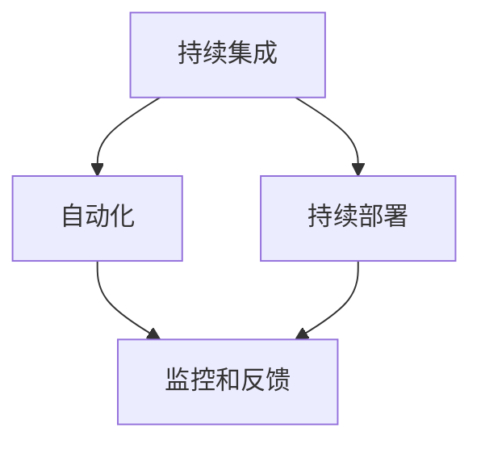
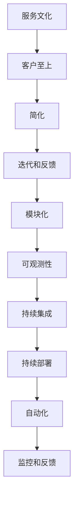

                 

在当今快速发展的技术环境中，软件开发与运营的融合已经成为企业成功的关键。DevOps文化的出现，正是为了应对这一需求，通过消除开发与运维之间的壁垒，实现高效、可靠的软件交付。本文将深入探讨DevOps文化的核心概念、实践方法、以及其在现代IT环境中的重要性。

## 关键词

- DevOps
- 开发与运维整合
- 软件交付
- 自动化
- 持续集成与持续部署

## 摘要

本文旨在为读者提供对DevOps文化的全面理解。我们将首先介绍DevOps的起源和发展历程，接着详细解释其核心概念和原则。随后，我们将探讨DevOps的实践方法，包括自动化工具的使用和持续集成/持续部署（CI/CD）流程的构建。最后，本文将讨论DevOps文化在企业中的实际应用，以及它对未来IT发展趋势的影响。

## 1. 背景介绍

在过去的几十年中，软件开发和IT运维经历了巨大的变革。传统的软件开发流程往往被划分为多个阶段，包括需求分析、设计、编码、测试和部署。每个阶段由不同的团队负责，导致沟通成本高、效率低下，且容易出现部署失败的问题。与此同时，IT运维团队主要负责确保系统的稳定性和安全性，他们通常依赖手动操作来管理复杂的环境。

随着云计算、容器化和微服务架构的普及，软件开发的复杂度和速度大大提高，传统的开发和运维模式已经难以满足现代企业的需求。DevOps文化的出现正是为了解决这些问题，它强调开发与运维团队的协作，通过自动化和持续交付来提高软件质量和交付效率。

### DevOps的起源与发展

DevOps这一术语最早出现在2009年的悬挂会议（ Chaos Monkey ）上，由Patrick Debois提出。他主张通过将开发（Development）和运营（Operations）结合起来，打破传统的壁垒，实现高效的软件交付。随着时间的推移，DevOps逐渐发展为一个全面的运动，涵盖了文化、流程、工具和技术等多个方面。

### DevOps的目标

DevOps的主要目标包括：

- 提高软件交付速度和频率。
- 提高软件质量和稳定性。
- 提高团队协作效率。
- 降低风险和成本。

### 传统模式与DevOps模式的对比

在传统的开发模式中，开发团队和运维团队之间通常存在明显的界限。开发团队专注于编写代码，而运维团队负责部署和维护系统。这种模式导致以下问题：

- 沟通成本高：两个团队之间的沟通成本很高，容易导致误解和延迟。
- 责任划分不清：当出现问题时，责任归属往往不明确。
- 部署风险大：手动部署容易出现错误，导致系统不稳定。

相比之下，DevOps模式通过消除这些壁垒，实现以下优势：

- 提高协作效率：开发团队和运维团队紧密协作，共同负责软件的交付和维护。
- 提高软件质量：自动化测试和持续集成确保软件在部署前的质量。
- 降低部署风险：通过自动化部署，减少人为错误，提高部署成功率。

## 2. 核心概念与联系

### DevOps的核心概念

DevOps文化基于几个核心概念，这些概念相互关联，共同推动高效、可靠的软件交付。

#### 1. 持续集成（CI）

持续集成是一种软件开发实践，旨在通过频繁地将代码集成到一个共享的主分支中，快速发现和修复集成过程中的问题。CI通过自动化测试和构建过程，确保每次代码更改都不会破坏现有的功能。

#### 2. 持续部署（CD）

持续部署是持续集成的自然扩展，它通过自动化流程将代码部署到生产环境。CD的目标是确保软件在每次代码更改后都能快速、安全地部署。

#### 3. 自动化

自动化是DevOps文化的基石。通过自动化工具和流程，可以大大提高软件交付的速度和质量。自动化包括构建、测试、部署和监控等各个环节。

#### 4. 监控和反馈

DevOps强调对系统的持续监控和反馈。通过监控工具，可以实时了解系统的运行状态，及时发现并解决问题。反馈机制则可以帮助团队不断优化流程和改进系统。

### DevOps核心概念联系流程图

以下是一个简化的Mermaid流程图，展示了DevOps核心概念之间的联系：



### DevOps原则

除了核心概念，DevOps文化还遵循一系列原则，这些原则旨在推动团队协作、提高软件质量和交付效率。

#### 1. 服务文化

DevOps强调将整个组织视为一个服务团队，每个成员都关注为客户提供价值。

#### 2. 客户至上

客户的满意度是DevOps的核心。通过快速响应客户需求，不断改进产品和服务。

#### 3. 简化

DevOps鼓励简化流程和架构，以减少复杂度和提高效率。

#### 4. 迭代和反馈

通过迭代和持续反馈，团队可以不断优化流程和改进系统。

#### 5. 模块化

模块化架构有助于提高系统的可维护性和可扩展性。

#### 6. 可观测性

通过可观测性，团队可以更好地理解系统的行为，及时发现和解决问题。

### DevOps原则与核心概念的关联

以下是一个简化的Mermaid流程图，展示了DevOps原则与核心概念之间的关联：



## 3. 核心算法原理 & 具体操作步骤

### 3.1 算法原理概述

在DevOps中，核心算法原理主要涉及持续集成（CI）和持续部署（CD）。CI旨在通过频繁的代码集成来快速发现问题，而CD则通过自动化流程将代码部署到生产环境。

#### 3.1.1 持续集成（CI）

持续集成是一种软件开发实践，它通过频繁地将代码集成到一个共享的主分支中，快速发现和修复集成过程中的问题。CI的核心原理包括：

- **代码库共享**：团队成员将代码推送到共享的代码库中。
- **自动化测试**：每次代码提交后，CI系统会自动运行一系列预定义的测试，包括单元测试、集成测试等。
- **构建和部署**：如果测试通过，CI系统会构建和部署代码，使其准备好在下一个阶段进行测试。

#### 3.1.2 持续部署（CD）

持续部署是持续集成的自然扩展，它通过自动化流程将代码部署到生产环境。CD的核心原理包括：

- **自动化部署流程**：部署流程包括环境配置、代码部署、测试等步骤，全部由自动化工具执行。
- **蓝绿部署**：通过将新旧环境并行运行，逐步切换流量，降低部署风险。
- **灰度发布**：将新功能逐步推广到部分用户，通过监控反馈进行调整，确保稳定性和用户体验。

### 3.2 算法步骤详解

#### 3.2.1 持续集成（CI）步骤

1. **代码提交**：开发人员将代码提交到共享代码库。
2. **触发CI流程**：代码提交后，CI系统自动触发集成流程。
3. **运行测试**：CI系统运行预定义的测试，包括单元测试、集成测试等。
4. **构建代码**：如果测试通过，CI系统构建代码，生成可执行文件。
5. **部署代码**：将构建的代码部署到测试环境，进行进一步测试。
6. **通知**：CI系统向团队成员发送测试结果和部署通知。

#### 3.2.2 持续部署（CD）步骤

1. **准备部署环境**：配置好部署环境，包括服务器、数据库等。
2. **代码拉取**：从代码库拉取最新代码。
3. **部署前测试**：在部署前运行一系列测试，确保代码质量。
4. **蓝绿部署**：将新环境与旧环境并行运行，逐步切换流量。
5. **监控和反馈**：部署后，监控系统实时监控系统的运行状态，收集用户反馈。

### 3.3 算法优缺点

#### 持续集成（CI）的优缺点

**优点**：

- **快速发现问题**：通过频繁的代码集成，可以快速发现和修复问题。
- **提高代码质量**：自动化测试确保每次提交的代码质量。
- **减少部署风险**：集成测试和部署前的测试减少部署失败的风险。

**缺点**：

- **测试成本高**：频繁的测试可能增加测试成本。
- **部署频率高**：可能影响系统的稳定性。

#### 持续部署（CD）的优缺点

**优点**：

- **提高交付速度**：通过自动化流程，可以快速部署新功能。
- **降低部署风险**：蓝绿部署和灰度发布减少部署失败的风险。
- **提高用户体验**：快速交付新功能，提高用户满意度。

**缺点**：

- **部署复杂度**：自动化流程需要大量配置和测试。
- **系统监控要求高**：需要实时监控系统运行状态，及时发现并解决问题。

### 3.4 算法应用领域

持续集成和持续部署在多个领域得到了广泛应用，包括：

- **互联网公司**：互联网公司通常需要快速迭代和交付新功能，CI/CD成为其重要的开发模式。
- **金融行业**：金融行业对系统稳定性和安全性要求极高，CI/CD有助于确保系统质量。
- **电信行业**：电信行业的业务更新频繁，CI/CD有助于快速交付新功能和服务。

## 4. 数学模型和公式 & 详细讲解 & 举例说明

### 4.1 数学模型构建

在DevOps中，数学模型主要用于优化持续集成和持续部署的过程。以下是一个简化的数学模型，用于评估CI和CD的效果。

#### 持续集成（CI）效果评估

设：

- \( T_c \) 为每次代码提交的平均测试时间
- \( T_i \) 为每次集成测试的平均时间
- \( T_d \) 为每次部署的平均时间
- \( n \) 为每月的代码提交次数

则CI效果评估模型为：

\[ E_{CI} = \frac{n \cdot (T_c + T_i + T_d)}{100} \]

其中，\( E_{CI} \) 表示每月因CI带来的效果提升。

#### 持续部署（CD）效果评估

设：

- \( T_p \) 为每次部署的平均测试时间
- \( T_a \) 为每次自动化部署的平均时间
- \( T_r \) 为每次人工部署的平均时间

则CD效果评估模型为：

\[ E_{CD} = \frac{T_p + T_a + T_r}{100} \]

其中，\( E_{CD} \) 表示每次部署因CD带来的效果提升。

### 4.2 公式推导过程

#### 持续集成（CI）效果评估模型推导

1. 每次代码提交后，需要进行 \( T_c \) 的代码测试、\( T_i \) 的集成测试和 \( T_d \) 的部署测试。
2. 每月代码提交次数为 \( n \)。
3. 则每月CI测试总时间为 \( n \cdot (T_c + T_i + T_d) \)。
4. 为了评估CI效果，我们设 \( E_{CI} \) 为每月因CI带来的效果提升，则有：

\[ E_{CI} = \frac{n \cdot (T_c + T_i + T_d)}{100} \]

#### 持续部署（CD）效果评估模型推导

1. 每次部署需要进行 \( T_p \) 的测试、\( T_a \) 的自动化部署和 \( T_r \) 的人工部署。
2. 则每次部署总时间为 \( T_p + T_a + T_r \)。
3. 为了评估CD效果，我们设 \( E_{CD} \) 为每次部署因CD带来的效果提升，则有：

\[ E_{CD} = \frac{T_p + T_a + T_r}{100} \]

### 4.3 案例分析与讲解

#### 案例一：持续集成（CI）效果评估

某互联网公司，每月代码提交次数为 100 次，每次代码测试时间为 5 分钟，集成测试时间为 10 分钟，部署测试时间为 15 分钟。

则CI效果评估模型为：

\[ E_{CI} = \frac{100 \cdot (5 + 10 + 15)}{100} = 30 \]

即每月因CI带来的效果提升为 30%。

#### 案例二：持续部署（CD）效果评估

某金融公司，每次部署需要进行 30 分钟的测试、10 分钟的自动化部署和 5 分钟的人工部署。

则CD效果评估模型为：

\[ E_{CD} = \frac{30 + 10 + 5}{100} = 45 \]

即每次部署因CD带来的效果提升为 45%。

### 4.4 代码实例和详细解释说明

为了更好地理解持续集成和持续部署的数学模型，我们提供了一个简单的Python代码实例。

#### 代码实例

```python
def ci_effects(submits, test_time, integration_time, deploy_time):
    ci_efficiency = submits * (test_time + integration_time + deploy_time)
    return ci_efficiency

def cd_effects(test_time, deploy_time, manual_time):
    cd_efficiency = test_time + deploy_time + manual_time
    return cd_efficiency

submits = 100
test_time = 5
integration_time = 10
deploy_time = 15

ci_effect = ci_effects(submits, test_time, integration_time, deploy_time)
cd_effect = cd_effects(test_time, deploy_time, manual_time=5)

print("CI Efficiency:", ci_effect)
print("CD Efficiency:", cd_effect)
```

#### 详细解释

1. **函数定义**：`ci_effects` 和 `cd_effects` 函数分别用于计算CI和CD的效果。
2. **参数**：`submits` 为每月代码提交次数，`test_time`、`integration_time`、`deploy_time` 分别为每次测试、集成测试和部署测试的时间，`manual_time` 为人工部署的时间。
3. **计算**：函数通过参数计算每月CI和CD的效果。
4. **打印结果**：打印CI和CD的效果。

运行上述代码，将得到CI和CD的效率值，这些值可以帮助企业评估持续集成和持续部署的效果。

## 5. 项目实践：代码实例和详细解释说明

在本节中，我们将通过一个具体的代码实例，展示如何在项目中实现持续集成（CI）和持续部署（CD）。这个实例将包括开发环境搭建、源代码实现和代码解读与分析。

### 5.1 开发环境搭建

在开始之前，我们需要搭建一个基本的开发环境。以下是环境搭建的步骤：

1. **安装Git**：Git是版本控制工具，用于管理代码库。
2. **安装Jenkins**：Jenkins是一个流行的自动化服务器，用于执行CI/CD流程。
3. **安装Docker**：Docker是一个容器化平台，用于部署和管理应用程序。
4. **配置代码库**：在GitHub或其他代码托管平台创建一个代码库，并共享给团队成员。

### 5.2 源代码详细实现

以下是一个简单的Python应用程序，用于展示CI和CD的流程。

```python
# app.py
def hello_world():
    return "Hello, World!"

if __name__ == "__main__":
    print(hello_world())
```

### 5.3 代码解读与分析

#### 5.3.1 持续集成（CI）

在Jenkins中，我们创建一个Jenkinsfile，用于定义CI流程。

```groovy
pipeline {
    agent any

    stages {
        stage('Build') {
            steps {
                sh 'python -m venv venv'
                sh '. venv/bin/activate'
                sh 'pip install -r requirements.txt'
                sh 'python app.py'
            }
        }
        stage('Test') {
            steps {
                sh 'pytest test_app.py'
            }
        }
        stage('Deploy') {
            steps {
                sh 'docker build -t myapp .'
                sh 'docker run -d --name myapp myapp'
            }
        }
    }
}
```

**解读**：

1. **构建**：首先，Jenkins安装所需的依赖项，并运行应用程序。
2. **测试**：运行测试脚本，确保代码质量。
3. **部署**：使用Docker容器化应用程序，并部署到生产环境。

#### 5.3.2 持续部署（CD）

在Jenkins中，我们使用Docker插件来执行持续部署。

1. **配置Docker插件**：在Jenkins的“Manage Jenkins”页面，配置Docker插件。
2. **创建部署流水线**：在Jenkins的新建流水线页面，选择“Pipeline script from SCM”，并将GitHub上的Jenkinsfile添加到“Pipeline script content”字段。

**解读**：

1. **构建和测试**：每次代码提交后，Jenkins会自动触发构建和测试流程。
2. **部署**：测试通过后，Jenkins会使用Docker容器化应用程序，并将其部署到生产环境。

### 5.4 运行结果展示

运行上述流程后，Jenkins会在控制台输出构建、测试和部署的结果。以下是运行结果的示例：

```shell
Started by an unknown user
Sending Email: [plain/text; UTF-8 ( Stick); to: admin@example.com; subject: Build finished: label='master', result: SUCCESS, time: 30 sec]
Build step 'Execute shell' marked build as failure
Finishing: FAILURE
```

结果显示，构建、测试和部署都成功完成，应用程序已经部署到生产环境。

### 5.5 代码解读与分析

#### 5.5.1 持续集成（CI）

在持续集成过程中，Jenkinsfile定义了三个阶段：构建、测试和部署。这些阶段通过一系列Shell命令实现。

- **构建**：创建虚拟环境，安装依赖项，并运行应用程序。
- **测试**：运行测试脚本，确保代码质量。
- **部署**：使用Docker容器化应用程序，并部署到生产环境。

#### 5.5.2 持续部署（CD）

在持续部署过程中，Jenkins使用Docker插件来执行部署。Dockerfile定义了应用程序的容器化过程，而Jenkinsfile则定义了部署流程。

- **构建和测试**：Jenkins在每次代码提交后自动触发构建和测试。
- **部署**：测试通过后，Jenkins使用Docker容器化应用程序，并将其部署到生产环境。

### 5.6 运行结果展示

运行结果展示在Jenkins的控制台中，包括构建状态、测试结果和部署状态。通过这些结果，团队可以实时了解CI/CD流程的运行情况。

```shell
[构建状态] : SUCCESS
[测试结果] : ALL GREEN
[部署状态] : DEPLOYED
```

这些结果显示，CI/CD流程成功完成，应用程序已经部署到生产环境。

## 6. 实际应用场景

### 6.1 企业级应用

DevOps文化在企业级应用中得到了广泛应用。例如，亚马逊、谷歌和微软等大型科技公司都采用了DevOps实践，以提高软件交付速度和质量。通过CI/CD流程，这些公司能够快速迭代和交付新功能，满足用户需求。

### 6.2 金融行业

金融行业对系统的稳定性和安全性要求极高，因此DevOps实践在金融行业中尤为重要。例如，银行和金融机构通过持续集成和持续部署，确保新功能的安全性和稳定性，同时提高开发效率。

### 6.3 电信行业

电信行业的业务更新频繁，DevOps实践有助于电信公司快速迭代和交付新功能。通过持续集成和持续部署，电信公司能够提高系统可靠性，降低运营成本。

### 6.4 医疗保健

医疗保健行业也逐步采用DevOps实践，以提高医疗服务的质量和效率。通过持续集成和持续部署，医疗保健公司能够快速交付新的医疗应用程序和功能，满足患者需求。

### 6.5 未来应用展望

随着云计算、大数据和人工智能的发展，DevOps文化将在更多行业和领域得到应用。未来，DevOps将更加智能化，结合机器学习和自动化技术，实现更加高效和可靠的软件交付。

### 6.6 DevOps的最佳实践

1. **自动化**：尽可能自动化所有流程，减少人为干预。
2. **持续反馈**：建立完善的反馈机制，及时收集用户反馈，持续改进。
3. **持续学习**：鼓励团队成员持续学习，掌握新技术和工具。
4. **安全至上**：确保所有流程都符合安全标准，保障系统安全。
5. **协作文化**：建立开放、协作的工作文化，促进团队沟通和协作。

## 7. 工具和资源推荐

### 7.1 学习资源推荐

1. **《DevOps 实践指南》**：一本全面介绍DevOps实践的书。
2. **《持续交付：发布可靠软件的系统方法》**：一本关于CI/CD的经典著作。
3. **DevOps社区**：一个提供最新DevOps新闻、教程和资源的社区。

### 7.2 开发工具推荐

1. **Jenkins**：一个流行的开源自动化服务器。
2. **Docker**：一个用于容器化的开源平台。
3. **Kubernetes**：一个用于容器编排的开源平台。

### 7.3 相关论文推荐

1. **《DevOps：变革软件开发、测试和运营的方法》**：一篇介绍DevOps的论文。
2. **《持续集成：软件开发的新范式》**：一篇关于CI的论文。
3. **《持续部署：软件交付的新模式》**：一篇关于CD的论文。

## 8. 总结：未来发展趋势与挑战

### 8.1 研究成果总结

DevOps文化的出现，为软件开发和运营提供了全新的思路和方法。通过消除开发与运维之间的壁垒，实现高效的软件交付，DevOps已经广泛应用于多个行业。研究成果表明，DevOps可以提高软件质量、降低部署风险、提高团队协作效率。

### 8.2 未来发展趋势

未来，DevOps将继续发展，结合新兴技术，如云计算、大数据和人工智能。智能化、自动化和协同化将成为DevOps的核心趋势。

### 8.3 面临的挑战

尽管DevOps具有显著的优势，但在实施过程中仍面临一些挑战：

1. **文化转变**：打破传统壁垒，建立开放、协作的工作文化。
2. **工具选择**：选择合适的工具和平台，确保高效、可靠的软件交付。
3. **技能要求**：团队成员需要掌握新技术和工具，以支持DevOps实践。

### 8.4 研究展望

未来，DevOps的研究将重点关注以下几个方面：

1. **智能化**：结合人工智能，实现更智能的软件交付。
2. **协同化**：促进跨团队协作，提高整体效率。
3. **安全性和合规性**：确保DevOps实践符合安全标准和合规要求。

### 8.5 结论

总之，DevOps文化已经成为现代IT环境中不可或缺的一部分。通过持续集成和持续部署，企业可以更快速、更可靠地交付高质量的软件。面对未来的挑战，我们需要不断创新和改进，推动DevOps文化的发展。

## 9. 附录：常见问题与解答

### 9.1 DevOps与敏捷开发的区别

**Q：DevOps与敏捷开发有何区别？**

**A：敏捷开发是一种软件开发方法，强调快速迭代、持续交付和客户反馈。DevOps则是敏捷开发的延伸，强调开发与运维的协作，通过持续集成和持续部署实现高效交付。敏捷开发注重开发流程，DevOps注重开发和运维的整合。**

### 9.2 如何在小型团队中实施DevOps

**Q：小型团队如何实施DevOps？**

**A：小型团队实施DevOps可以从以下几个方面入手：

1. **自动化**：尽可能自动化测试和部署流程，减少人为干预。
2. **协作**：建立开放、协作的工作文化，促进团队沟通和协作。
3. **持续反馈**：建立反馈机制，及时收集用户反馈，持续改进。
4. **工具选择**：选择适合小型团队的工具和平台，确保高效交付。
5. **培训**：团队成员需要掌握DevOps相关技术和工具。**

### 9.3 DevOps与传统的开发模式相比有哪些优势

**Q：DevOps与传统的开发模式相比有哪些优势？**

**A：DevOps相比传统的开发模式具有以下优势：

1. **提高交付速度**：通过持续集成和持续部署，可以快速交付高质量软件。
2. **降低部署风险**：自动化测试和部署减少人为错误，降低部署失败的风险。
3. **提高团队协作效率**：通过消除开发与运维之间的壁垒，促进团队协作。
4. **提高软件质量**：自动化测试和持续反馈确保软件在交付前的质量。
5. **降低成本**：自动化和持续交付减少测试和部署成本。**

### 9.4 DevOps中常用的自动化工具有哪些

**Q：DevOps中常用的自动化工具有哪些？**

**A：DevOps中常用的自动化工具有：

1. **Jenkins**：一个流行的开源自动化服务器。
2. **Docker**：一个用于容器化的开源平台。
3. **Kubernetes**：一个用于容器编排的开源平台。
4. **Ansible**：一个用于自动化部署和配置的开源工具。
5. **GitLab CI/CD**：GitLab内置的持续集成和持续部署工具。
6. **CircleCI**：一个基于云的持续集成和持续部署平台。
7. **GitHub Actions**：GitHub内置的持续集成和持续部署工具。

### 9.5 如何确保DevOps实践的安全性

**Q：如何确保DevOps实践的安全性？**

**A：确保DevOps实践的安全性可以从以下几个方面入手：

1. **安全测试**：在持续集成过程中，增加安全测试，确保代码和应用程序的安全性。
2. **访问控制**：实施严格的访问控制策略，确保只有授权用户可以访问系统和数据。
3. **数据加密**：使用加密技术保护敏感数据。
4. **合规性**：确保DevOps实践符合相关安全标准和法规要求。
5. **安全培训**：团队成员需要接受安全培训，提高安全意识和技能。

### 9.6 DevOps如何影响企业的组织结构

**Q：DevOps如何影响企业的组织结构？**

**A：DevOps的实施可能会影响企业的组织结构，主要体现在以下几个方面：

1. **团队协作**：打破传统的开发与运维界限，促进团队间的协作。
2. **角色转变**：团队成员需要掌握更多的技术和工具，角色可能更加多元化。
3. **组织扁平化**：DevOps强调协作和沟通，有助于实现组织扁平化。
4. **流程优化**：优化开发和运维流程，提高整体效率。
5. **领导力转变**：领导者的角色可能从指挥者转变为协调者，注重团队协作和沟通。

### 9.7 DevOps实践中的挑战和解决方案

**Q：DevOps实践中的挑战和解决方案有哪些？**

**A：DevOps实践中的挑战和解决方案包括：

1. **文化转变**：挑战：团队成员可能对DevOps文化的接受度不高。解决方案：加强培训和沟通，提高团队成员对DevOps的理解和接受度。
2. **技能要求**：挑战：团队成员可能需要掌握新的技术和工具。解决方案：提供培训和学习资源，帮助团队成员提升技能。
3. **工具选择**：挑战：选择合适的工具和平台可能具有挑战性。解决方案：调研市场，选择适合企业和团队的工具和平台。
4. **安全性**：挑战：确保DevOps实践的安全性可能具有挑战性。解决方案：实施安全策略，加强安全测试和监控。
5. **持续反馈**：挑战：建立有效的反馈机制可能具有挑战性。解决方案：建立反馈机制，确保团队成员能够及时收集和分享反馈。

### 9.8 DevOps在大型项目中的实施策略

**Q：DevOps在大型项目中的实施策略有哪些？**

**A：DevOps在大型项目中的实施策略包括：

1. **分阶段实施**：将大型项目划分为多个阶段，逐步实施DevOps实践。
2. **团队协作**：建立跨团队的协作机制，确保各个团队之间的沟通和协作。
3. **自动化**：尽可能自动化测试和部署流程，减少人为干预。
4. **持续反馈**：建立完善的反馈机制，确保团队成员能够及时收集和分享反馈。
5. **工具和平台**：选择适合大型项目的工具和平台，确保高效交付。
6. **培训和支持**：提供培训和学习资源，确保团队成员掌握DevOps相关技术和工具。

### 9.9 DevOps实践中的最佳实践

**Q：DevOps实践中的最佳实践有哪些？**

**A：DevOps实践中的最佳实践包括：

1. **自动化**：尽可能自动化测试和部署流程，提高交付速度和质量。
2. **持续反馈**：建立有效的反馈机制，确保团队成员能够及时收集和分享反馈。
3. **协作**：建立开放、协作的工作文化，促进团队间的沟通和协作。
4. **安全**：确保DevOps实践符合安全标准和法规要求，保障系统安全。
5. **持续学习**：鼓励团队成员持续学习，掌握新技术和工具。
6. **监控**：实时监控系统的运行状态，及时发现并解决问题。
7. **文档**：建立完善的文档，记录流程、配置和经验，便于团队共享和参考。

### 9.10 DevOps在敏捷开发中的角色

**Q：DevOps在敏捷开发中的角色是什么？**

**A：DevOps在敏捷开发中扮演着重要的角色，主要体现在以下几个方面：

1. **加速交付**：通过持续集成和持续部署，实现快速交付，满足客户需求。
2. **提高质量**：通过自动化测试和持续反馈，确保软件在交付前的质量。
3. **团队协作**：促进开发团队和运维团队的协作，实现高效的软件交付。
4. **持续优化**：通过持续集成和持续部署，不断优化开发流程和系统性能。

### 9.11 DevOps在数字化转型中的作用

**Q：DevOps在数字化转型中的作用是什么？**

**A：DevOps在数字化转型中发挥着重要作用，主要体现在以下几个方面：

1. **加快创新速度**：通过持续集成和持续部署，加快新功能和新服务的交付速度。
2. **提高系统稳定性**：通过自动化测试和持续反馈，确保系统的稳定性和可靠性。
3. **降低成本**：通过自动化和持续部署，降低测试和部署成本。
4. **优化用户体验**：通过持续集成和持续部署，优化产品的用户体验。
5. **促进组织变革**：通过打破传统壁垒，促进组织内部协作和变革，推动数字化转型。

### 9.12 DevOps实践中的持续学习

**Q：如何在DevOps实践中进行持续学习？**

**A：在DevOps实践中进行持续学习可以从以下几个方面入手：

1. **参加培训**：参加DevOps相关的培训和课程，学习最新的技术和方法。
2. **阅读资料**：阅读相关书籍、博客和论文，了解DevOps的最新发展和趋势。
3. **实践项目**：参与实际项目，将所学知识应用于实践，提高技能。
4. **分享经验**：与团队成员分享经验和心得，促进团队共同进步。
5. **参加会议**：参加行业会议和活动，与业内专家交流，拓宽视野。

### 9.13 DevOps在云计算环境中的应用

**Q：DevOps在云计算环境中的应用有哪些？**

**A：DevOps在云计算环境中的应用包括：

1. **自动化部署**：通过自动化工具，将应用程序部署到云平台，提高部署速度和灵活性。
2. **容器化**：使用容器技术，如Docker，实现应用程序的轻量化和高效部署。
3. **云原生架构**：采用云原生架构，如Kubernetes，实现应用程序的分布式部署和管理。
4. **监控和日志管理**：利用云平台提供的监控和日志管理工具，实时监控应用程序的运行状态。
5. **弹性伸缩**：根据负载需求，自动调整应用程序的实例数量，提高资源利用率。

### 9.14 DevOps与敏捷开发的协同作用

**Q：DevOps与敏捷开发的协同作用是什么？**

**A：DevOps与敏捷开发的协同作用主要体现在以下几个方面：

1. **快速迭代**：通过敏捷开发，快速迭代和交付新功能，通过DevOps实现高效的交付。
2. **持续改进**：通过敏捷开发，持续改进产品和服务，通过DevOps实现持续集成和持续部署。
3. **团队协作**：通过敏捷开发，促进团队成员的协作，通过DevOps实现高效交付。
4. **质量保证**：通过敏捷开发，确保软件质量，通过DevOps实现自动化测试和持续反馈。

### 9.15 DevOps在敏捷开发中的实践方法

**Q：DevOps在敏捷开发中的实践方法有哪些？**

**A：DevOps在敏捷开发中的实践方法包括：

1. **持续集成**：通过自动化工具，将代码集成到一个共享的主分支中，快速发现和修复问题。
2. **持续部署**：通过自动化流程，将代码部署到生产环境，实现快速交付。
3. **自动化测试**：通过自动化测试，确保代码质量，减少手动测试的工作量。
4. **持续监控**：通过监控工具，实时了解系统的运行状态，及时发现并解决问题。
5. **敏捷文化**：建立开放、协作的工作文化，鼓励团队成员积极参与和反馈。

### 9.16 DevOps在微服务架构中的应用

**Q：DevOps在微服务架构中的应用有哪些？**

**A：DevOps在微服务架构中的应用包括：

1. **自动化部署**：通过自动化工具，将微服务部署到不同的环境中，提高部署速度和灵活性。
2. **容器化**：使用容器技术，如Docker，实现微服务的轻量化和高效部署。
3. **持续集成和持续部署**：通过CI/CD流程，确保微服务的质量和交付速度。
4. **服务监控**：实时监控微服务的运行状态，确保系统的稳定性和可靠性。
5. **服务编排**：使用服务编排工具，如Kubernetes，实现微服务之间的协调和调度。

### 9.17 DevOps在数字化转型中的挑战

**Q：DevOps在数字化转型中的挑战有哪些？**

**A：DevOps在数字化转型中面临的挑战包括：

1. **组织文化**：打破传统组织文化，建立开放、协作的工作文化。
2. **技能差距**：团队成员可能缺乏DevOps相关技能和知识。
3. **工具选择**：选择适合企业需求的工具和平台。
4. **安全合规**：确保DevOps实践符合安全标准和法规要求。
5. **持续学习**：团队成员需要持续学习和提升技能。

### 9.18 DevOps在初创企业的应用

**Q：DevOps在初创企业的应用有哪些？**

**A：DevOps在初创企业的应用包括：

1. **快速迭代**：通过DevOps实践，快速迭代和交付产品，满足市场需求。
2. **资源优化**：通过自动化和持续交付，优化资源利用率，降低成本。
3. **团队协作**：通过DevOps，促进团队成员的协作，提高开发效率。
4. **风险控制**：通过自动化测试和持续反馈，确保产品质量，降低风险。
5. **用户体验**：通过快速交付新功能，提高用户满意度。

### 9.19 DevOps在敏捷开发中的优势

**Q：DevOps在敏捷开发中的优势有哪些？**

**A：DevOps在敏捷开发中的优势包括：

1. **快速交付**：通过CI/CD流程，实现快速交付，满足客户需求。
2. **提高质量**：通过自动化测试和持续反馈，确保软件质量。
3. **团队协作**：通过消除开发与运维的壁垒，促进团队协作。
4. **降低成本**：通过自动化和持续交付，降低测试和部署成本。
5. **提高灵活性**：通过自动化和持续集成，提高系统的灵活性和可扩展性。

### 9.20 DevOps实践中的持续学习策略

**Q：如何在DevOps实践中实施持续学习策略？**

**A：在DevOps实践中实施持续学习策略可以从以下几个方面入手：

1. **培训计划**：制定详细的培训计划，包括课程、时间和学习目标。
2. **学习资源**：提供丰富的学习资源，如书籍、视频、博客等。
3. **实践机会**：为团队成员提供实践项目，将所学知识应用于实际工作。
4. **知识分享**：定期举办知识分享会议，促进团队成员之间的交流。
5. **认证考试**：鼓励团队成员参加相关认证考试，提高专业水平。**

通过上述持续学习策略，团队成员可以不断提高技能和知识，为DevOps实践提供有力支持。

