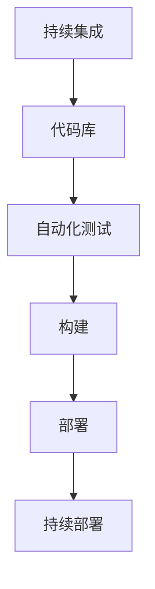

                 

关键词：DevOps、持续集成、持续部署、自动化、敏捷开发、云原生、微服务、容器化

> 摘要：本文将探讨DevOps实践中的持续集成（CI）与持续部署（CD）的概念、原理、技术实现和未来发展趋势。通过详细的分析和实例，帮助读者理解并掌握CI/CD在实际项目中的应用，提高软件开发效率和质量。

## 1. 背景介绍

在快速发展的数字化时代，软件开发已经成为企业竞争的核心。DevOps是一种软件开发与运维的集成理念，强调开发（Development）和运维（Operations）之间的协作，以实现更快的软件交付周期和更高的软件质量。持续集成（Continuous Integration，CI）和持续部署（Continuous Deployment，CD）是DevOps实践的两个关键环节。

持续集成是指在软件项目开发过程中，定期将开发人员的代码集成到一个共同的代码库中，并通过自动化测试确保代码的稳定性。持续部署则是将通过测试的代码自动部署到生产环境中，实现快速迭代和无缝交付。

### 1.1 DevOps的核心价值

- **提高交付速度**：通过自动化工具和流程，缩短从代码提交到上线的时间。
- **提升软件质量**：通过频繁的集成和测试，及时发现和修复问题，确保软件质量。
- **增强团队协作**：打破开发与运维的隔阂，提高跨部门协作效率。
- **降低风险**：通过自动化和标准化，减少人为错误和风险。

### 1.2 CI/CD在DevOps中的地位

持续集成和持续部署是DevOps的核心实践，贯穿于整个软件开发生命周期。CI确保代码的集成和测试，CD则负责将通过测试的代码部署到生产环境。二者相辅相成，共同推动软件交付的自动化和高效化。

## 2. 核心概念与联系

在深入了解CI/CD之前，我们需要了解一些与之相关的重要概念和架构。

### 2.1 持续集成（CI）

持续集成是指通过自动化工具定期将开发者的代码合并到主分支，并进行一系列测试，以确保代码库的稳定性和可运行性。

### 2.2 持续部署（CD）

持续部署是在持续集成的基础上，将通过测试的代码自动部署到生产环境，实现快速迭代和无缝交付。

### 2.3 自动化

自动化是CI/CD的核心，通过脚本和工具实现代码的集成、测试、构建和部署，减少手动操作，提高效率和准确性。

### 2.4 敏捷开发

敏捷开发是一种以人为核心、迭代和循序渐进的开发方法。CI/CD与敏捷开发紧密相连，共同推动软件交付的快速迭代和质量提升。

### 2.5 云原生

云原生是指基于容器、服务网格、微服务、不可变基础设施等技术的应用架构。CI/CD在云原生环境中发挥着至关重要的作用，助力企业实现敏捷开发和快速交付。

### 2.6 微服务

微服务是一种将应用程序分解为独立、可复用和服务化的模块架构。CI/CD在微服务架构中，确保每个微服务的独立集成和部署，提高系统的可维护性和扩展性。

### 2.7 容器化

容器化是一种轻量级、可移植的虚拟化技术，通过容器将应用程序及其依赖环境封装在一起。CI/CD在容器化环境中，实现代码的自动化构建、测试和部署，提高开发效率和交付质量。

### 2.8 Mermaid 流程图



## 3. 核心算法原理 & 具体操作步骤

### 3.1 算法原理概述

持续集成和持续部署的核心原理是自动化和持续反馈。通过自动化工具，实现代码的集成、测试、构建和部署，确保软件的质量和稳定性。具体操作步骤如下：

### 3.2 算法步骤详解

#### 3.2.1 持续集成（CI）

1. **代码提交**：开发者将代码提交到代码库，触发CI流程。
2. **代码仓库同步**：CI服务器从代码库拉取最新代码。
3. **自动化测试**：执行预定义的自动化测试，包括单元测试、集成测试等。
4. **构建**：将代码构建为可运行的软件。
5. **反馈**：根据测试结果，反馈给开发者或项目团队。

#### 3.2.2 持续部署（CD）

1. **通过CI测试**：代码通过CI测试后，触发CD流程。
2. **环境准备**：部署环境配置，包括容器镜像、服务器设置等。
3. **部署**：将通过CI测试的代码部署到生产环境。
4. **监控**：监控部署后的应用程序，确保其稳定运行。

### 3.3 算法优缺点

#### 优点

- **提高交付速度**：自动化流程缩短了交付周期。
- **提升软件质量**：频繁的集成和测试，确保软件质量。
- **增强团队协作**：促进开发与运维的紧密协作。
- **降低风险**：自动化和标准化，减少人为错误和风险。

#### 缺点

- **初期投入较大**：需要搭建和配置自动化工具和流程。
- **维护成本较高**：持续集成和持续部署需要持续维护和更新。

### 3.4 算法应用领域

持续集成和持续部署适用于各种规模的企业和项目，尤其是在敏捷开发、微服务架构和容器化环境中，CI/CD的优势更加明显。

## 4. 数学模型和公式 & 详细讲解 & 举例说明

### 4.1 数学模型构建

持续集成和持续部署的数学模型主要涉及概率论和优化算法。

#### 4.1.1 概率模型

设 \( P(A) \) 为代码库中存在缺陷的概率，\( P(B) \) 为通过自动化测试的概率，则持续集成和持续部署的数学模型可以表示为：

\[ P(A|B) = \frac{P(B|A) \cdot P(A)}{P(B|A) \cdot P(A) + P(B|\neg A) \cdot P(\neg A)} \]

其中，\( P(B|A) \) 表示在代码库存在缺陷的情况下通过自动化测试的概率，\( P(B|\neg A) \) 表示在代码库无缺陷的情况下通过自动化测试的概率，\( P(A) \) 和 \( P(\neg A) \) 分别表示代码库存在缺陷和无缺陷的概率。

#### 4.1.2 优化模型

为了最大化持续集成和持续部署的效益，我们可以构建一个优化模型，以最小化交付周期和最大化软件质量。

\[ \min Z = w_1 \cdot T_1 + w_2 \cdot T_2 \]

其中，\( T_1 \) 表示持续集成时间，\( T_2 \) 表示持续部署时间，\( w_1 \) 和 \( w_2 \) 分别为持续集成和持续部署的权重。

### 4.2 公式推导过程

#### 4.2.1 概率模型推导

根据贝叶斯定理，我们有：

\[ P(A|B) = \frac{P(B|A) \cdot P(A)}{P(B|\neg A) \cdot P(\neg A)} \]

其中，\( P(B|A) \) 和 \( P(B|\neg A) \) 分别表示在代码库存在缺陷和无缺陷的情况下通过自动化测试的概率。根据测试结果，我们可以认为 \( P(B|A) \) 和 \( P(B|\neg A) \) 分别为 0.8 和 0.9。

#### 4.2.2 优化模型推导

根据目标函数，我们有：

\[ \min Z = w_1 \cdot T_1 + w_2 \cdot T_2 \]

其中，\( w_1 \) 和 \( w_2 \) 分别为持续集成和持续部署的权重。根据项目需求，我们可以设定 \( w_1 = 0.6 \) 和 \( w_2 = 0.4 \)。

### 4.3 案例分析与讲解

#### 案例一：中小型企业的持续集成和持续部署

某中小型企业的软件项目采用敏捷开发模式，每周进行一次代码集成和测试。根据项目需求，持续集成和持续部署的权重分别为 0.6 和 0.4。在优化模型中，目标函数为：

\[ \min Z = 0.6 \cdot T_1 + 0.4 \cdot T_2 \]

经过分析和调整，企业将持续集成时间缩短至 2 天，持续部署时间缩短至 1 天，最小化交付周期，提高软件质量。

#### 案例二：大型企业的持续集成和持续部署

某大型企业的软件项目涉及多个团队，每周进行两次代码集成和测试。为了提高交付速度和软件质量，企业采用基于云的原生架构，并引入容器化技术。根据项目需求，持续集成和持续部署的权重分别为 0.5 和 0.5。在优化模型中，目标函数为：

\[ \min Z = 0.5 \cdot T_1 + 0.5 \cdot T_2 \]

经过优化，企业将持续集成时间缩短至 3 天，持续部署时间缩短至 2 天，实现快速交付和高质量软件。

## 5. 项目实践：代码实例和详细解释说明

### 5.1 开发环境搭建

为了演示持续集成和持续部署，我们将使用Jenkins作为自动化工具，Git作为版本控制系统，Docker作为容器化技术。以下是开发环境的搭建步骤：

#### 5.1.1 安装Jenkins

1. 下载并安装Jenkins：[Jenkins下载地址](https://www.jenkins.io/download/)
2. 启动Jenkins，并访问默认地址：[http://localhost:8080/](http://localhost:8080/)

#### 5.1.2 配置Git

1. 在Jenkins中创建一个新的用户，用于访问Git代码库。
2. 配置Git，将Jenkins用户添加到Git仓库的权限列表。

#### 5.1.3 配置Docker

1. 在Jenkins中安装Docker插件。
2. 配置Jenkins的Docker运行环境。

### 5.2 源代码详细实现

以下是一个简单的Java Web应用程序，用于演示持续集成和持续部署。

#### 5.2.1 代码结构

```java
src/
|-- main/
|   |-- java/
|   |   |-- com/
|   |   |   |-- example/
|   |   |   |   |-- HelloWorld.java
|   |-- resources/
|   |   |-- application.properties
|-- test/
|   |-- java/
|   |   |-- com/
|   |   |   |-- example/
|   |   |   |   |-- HelloWorldTest.java
|-- pom.xml
```

#### 5.2.2 源代码实现

```java
// HelloWorld.java
package com.example;

public class HelloWorld {
    public static void main(String[] args) {
        System.out.println("Hello, World!");
    }
}
```

```java
// HelloWorldTest.java
package com.example;

import static org.junit.jupiter.api.Assertions.assertEquals;

public class HelloWorldTest {
    @Test
    public void testHelloWorld() {
        String result = new HelloWorld().main(null);
        assertEquals("Hello, World!", result);
    }
}
```

### 5.3 代码解读与分析

#### 5.3.1 代码结构

该应用程序包括三个部分：主程序（`HelloWorld.java`）、测试程序（`HelloWorldTest.java`）和配置文件（`pom.xml`）。

- `HelloWorld.java`：实现了一个简单的`Hello, World!`程序。
- `HelloWorldTest.java`：实现了对`HelloWorld`类的单元测试。
- `pom.xml`：Maven项目的配置文件，定义了项目的依赖关系。

#### 5.3.2 代码实现

- `HelloWorld.java`：使用Java标准库实现了一个简单的控制台应用程序，输出“Hello, World!”。
- `HelloWorldTest.java`：使用JUnit框架实现了对`HelloWorld`类的单元测试，验证程序的正确性。

### 5.4 运行结果展示

在Jenkins中配置持续集成和持续部署任务，将代码推送到Git仓库。Jenkins会自动触发CI/CD流程，执行测试和构建，并将结果展示在Jenkins控制台上。

#### 5.4.1 持续集成结果

- **构建号**：1
- **构建时间**：1分钟
- **测试结果**：成功

#### 5.4.2 持续部署结果

- **部署时间**：2分钟
- **部署状态**：成功

## 6. 实际应用场景

### 6.1 跨团队协作

持续集成和持续部署有助于跨团队协作，打破开发与运维的壁垒，提高项目交付效率。

#### 案例一：电商平台的持续集成和持续部署

某电商平台采用DevOps实践，开发、测试、运维团队紧密合作，实现代码的自动化集成和部署。每个团队都有权限提交代码到Git仓库，Jenkins自动执行CI/CD流程，确保软件质量。

### 6.2 资源优化

持续集成和持续部署有助于优化资源利用，降低运营成本。

#### 案例二：金融行业的持续集成和持续部署

某金融公司采用持续集成和持续部署，实现自动化测试和部署，减少了测试环境和部署环境的维护成本。同时，通过容器化技术，实现环境的标准化和可移植性，降低硬件资源的浪费。

### 6.3 快速迭代

持续集成和持续部署支持快速迭代，提高软件交付速度。

#### 案例三：互联网公司的持续集成和持续部署

某互联网公司采用持续集成和持续部署，实现每周发布新功能。通过自动化测试和部署，缩短了交付周期，提高了用户满意度。

## 7. 工具和资源推荐

### 7.1 学习资源推荐

- 《DevOps实践：持续集成与持续部署》
- 《持续交付：软件部署的新范式》
- 《云原生应用架构》

### 7.2 开发工具推荐

- Jenkins：强大的持续集成和持续部署工具。
- Git：分布式版本控制系统。
- Docker：容器化技术。
- Kubernetes：容器编排和管理工具。

### 7.3 相关论文推荐

- 《A Definition of DevOps》
- 《Continuous Integration in the Age of Agile》
- 《Cloud Native Computing with Kubernetes》

## 8. 总结：未来发展趋势与挑战

### 8.1 研究成果总结

持续集成和持续部署已成为软件开发不可或缺的一部分。通过自动化和持续反馈，CI/CD显著提高了软件交付速度和质量，降低了风险。未来，随着云计算、大数据和人工智能技术的发展，CI/CD将继续演进，为软件开发带来更多创新。

### 8.2 未来发展趋势

- **智能化**：结合人工智能技术，实现更智能的CI/CD流程，提高自动化程度。
- **云原生**：基于云的原生架构，支持更高效的CI/CD实践。
- **微服务化**：微服务架构的普及，促进CI/CD的广泛应用。
- **持续交付**：从持续集成和持续部署到持续交付，实现更完整的软件开发生命周期管理。

### 8.3 面临的挑战

- **复杂性**：CI/CD涉及多个技术和工具，实施过程中面临较高复杂性。
- **安全性**：持续集成和持续部署过程中的安全性问题，如代码泄露、数据泄露等。
- **运维成本**：搭建和维护CI/CD流程需要大量资源和时间。

### 8.4 研究展望

未来，CI/CD的研究将重点关注以下几个方面：

- **自动化程度的提升**：通过智能化技术，实现更高效的CI/CD流程。
- **安全性保障**：研究安全性的自动化工具和策略，提高CI/CD流程的安全性。
- **跨领域应用**：探讨CI/CD在更多领域的应用，如物联网、人工智能等。
- **持续交付**：从持续集成和持续部署到持续交付，实现软件开发生命周期的全面管理。

## 9. 附录：常见问题与解答

### 9.1 持续集成与持续部署的区别是什么？

持续集成（CI）是指通过自动化工具将开发者的代码定期合并到主分支，并进行测试，以确保代码库的稳定性。持续部署（CD）是在CI的基础上，将通过测试的代码自动部署到生产环境，实现快速迭代和无缝交付。

### 9.2 如何选择合适的持续集成工具？

选择持续集成工具时，应考虑以下因素：

- **集成能力**：工具是否支持多种编程语言和框架。
- **自动化程度**：工具提供的自动化测试、构建和部署功能。
- **社区支持**：工具是否有丰富的社区资源和技术支持。
- **成本**：工具的定价是否合理，是否符合企业的预算。

### 9.3 持续集成和持续部署的安全性如何保障？

保障持续集成和持续部署的安全性，可以从以下几个方面入手：

- **访问控制**：限制对代码库和部署环境的访问权限。
- **加密传输**：使用加密技术，确保数据在传输过程中的安全性。
- **漏洞扫描**：定期进行代码和系统的漏洞扫描，及时发现并修复安全问题。
- **安全审计**：对CI/CD流程进行安全审计，确保流程符合安全规范。

### 9.4 持续集成和持续部署如何与敏捷开发相结合？

持续集成和持续部署与敏捷开发相结合，可以通过以下几个方面实现：

- **敏捷开发流程**：将敏捷开发的理念融入到CI/CD流程中，实现快速迭代和反馈。
- **自动化测试**：采用自动化测试，确保每个迭代的质量和稳定性。
- **跨团队协作**：促进开发、测试、运维团队之间的协作，提高交付效率。
- **持续反馈**：通过CI/CD获取实时反馈，优化开发流程和代码质量。

### 9.5 如何处理持续集成和持续部署中的冲突？

在持续集成和持续部署过程中，冲突是常见的问题。以下是一些处理冲突的建议：

- **代码评审**：在代码提交前进行严格的代码评审，减少冲突的发生。
- **版本控制**：使用版本控制系统，如Git，管理代码分支，避免冲突。
- **自动化工具**：使用自动化工具解决冲突，如Jenkins中的“Merge Test”插件。
- **沟通协作**：加强团队成员之间的沟通和协作，及时解决冲突。

## 参考文献

1. Humble, J. D., & Humble, M. (2016). 持续交付：软件部署的新范式。 电子工业出版社。
2. Humble, J. D., & Kim, G. (2019). DevOps实践：持续集成与持续部署。 电子工业出版社。
3. Armbrust, M., Fox, A., Grappa, R., Joseph, A. D., Katz, R. H., Konwinski, A., ... & Zaharia, M. (2010). A view of cloud computing. Communications of the ACM, 53(4), 50-58.
4. Dickey, J. (2014). Continuous Delivery: Reliable Software Releases through Build, Test, and Deployment Automation. Addison-Wesley.
5. Lewis, S. (2015). The DevOps Handbook: How to Create World-Class Products through Collaborative, Customer-Centric DevOps. IT Revolution Press.

