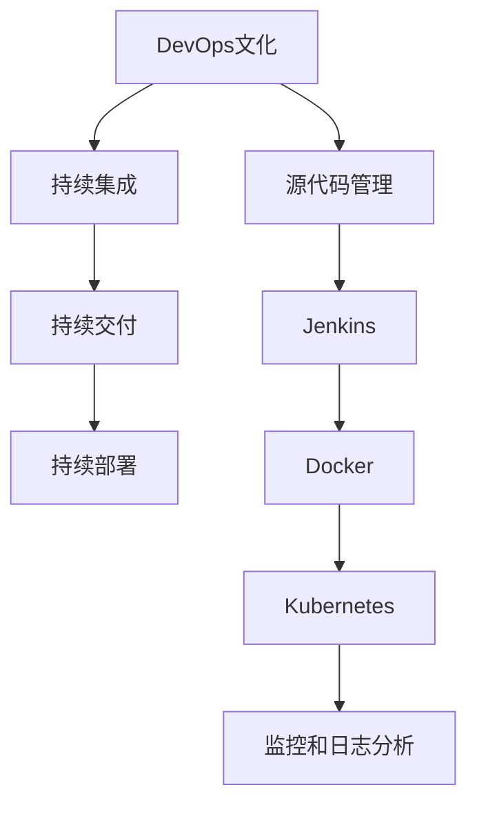

                 

关键词：DevOps、工具链、搭建、集成、持续集成、持续交付、自动化、容器化、CI/CD流程

## 摘要

本文将深入探讨DevOps工具链的搭建与集成。DevOps是一种软件开发实践，旨在通过敏捷、持续集成和持续交付的方式，缩短软件开发生命周期，提高软件质量，并让开发者、运维人员等协作更加紧密。本文将介绍DevOps的核心概念、工具链搭建步骤、集成策略以及未来应用展望。

## 1. 背景介绍

随着软件行业的快速发展，软件开发和运维的复杂度不断增加。传统的软件开发流程往往存在多个阶段，如需求分析、设计、编码、测试、部署等，每个阶段都由不同团队负责，导致沟通成本高、协作效率低。此外，软件发布周期长，容易出现bug和性能问题。

为了解决这些问题，DevOps应运而生。DevOps是一种文化、实践和工具的集合，旨在通过自动化、协作和持续反馈，实现快速、高质量的软件交付。DevOps强调开发（Development）和运维（Operations）之间的紧密协作，通过持续集成（Continuous Integration，CI）和持续交付（Continuous Delivery，CD）等实践，提高软件交付效率和质量。

## 2. 核心概念与联系

### 2.1 DevOps的核心概念

#### 2.1.1 持续集成（CI）

持续集成是一种软件开发实践，旨在将代码快速、频繁地集成到主分支，以便尽早发现和解决问题。通过持续集成，可以自动化测试、构建和部署，确保代码质量。

#### 2.1.2 持续交付（CD）

持续交付是一种软件开发实践，旨在确保软件可以在任何时间、任何环境稳定运行。持续交付通过自动化测试、部署和监控，确保软件交付过程高效、可靠。

#### 2.1.3 持续部署（Continuous Deployment，CD）

持续部署是持续交付的延伸，旨在将通过测试的代码自动部署到生产环境。持续部署进一步缩短了软件交付周期，提高了交付频率。

### 2.2 DevOps工具链

DevOps工具链是指用于实现DevOps实践的一系列工具。常见的DevOps工具包括：

#### 2.2.1 源代码管理工具（如Git）

源代码管理工具用于存储和管理代码，支持多人协作开发。

#### 2.2.2 持续集成工具（如Jenkins、Travis CI）

持续集成工具用于自动化构建、测试和部署代码。

#### 2.2.3 持续交付工具（如Docker、Kubernetes）

持续交付工具用于容器化应用，实现自动化部署和扩展。

#### 2.2.4 监控和日志分析工具（如ELK、Prometheus）

监控和日志分析工具用于实时监控应用性能和日志，及时发现和处理问题。

### 2.3 DevOps架构

DevOps架构是指实现DevOps实践的系统架构。常见的DevOps架构包括：

#### 2.3.1 水平扩展架构

水平扩展架构通过增加服务器节点，实现应用的高可用性和可扩展性。

#### 2.3.2 微服务架构

微服务架构将应用拆分为多个独立的小服务，实现应用的模块化和高可用性。

#### 2.3.3 容器化架构

容器化架构通过Docker等容器化技术，实现应用的轻量级、可移植和自动化部署。

### 2.4 Mermaid流程图



## 3. 核心算法原理 & 具体操作步骤

### 3.1 算法原理概述

DevOps工具链的搭建与集成涉及到多个核心算法，如版本控制算法、构建算法、部署算法等。以下简要介绍这些算法的原理：

#### 3.1.1 版本控制算法

版本控制算法用于管理代码的版本，确保代码库的稳定性和安全性。常见的版本控制算法包括Git的分支管理、合并策略等。

#### 3.1.2 构建算法

构建算法用于自动化构建代码，生成可运行的软件包。常见的构建算法包括Maven、Gradle等构建工具的构建流程。

#### 3.1.3 部署算法

部署算法用于自动化部署软件，将代码从开发环境、测试环境、生产环境等不同环境中发布。常见的部署算法包括Docker、Kubernetes等容器化技术的部署流程。

### 3.2 算法步骤详解

以下详细描述DevOps工具链搭建与集成的具体操作步骤：

#### 3.2.1 搭建源代码管理工具

1. 安装Git：在服务器上安装Git，配置用户信息。
2. 创建代码仓库：在代码仓库中存储项目代码，支持多人协作开发。
3. 分支管理：创建开发分支、测试分支、主分支等，确保代码的稳定性和安全性。

#### 3.2.2 搭建持续集成工具

1. 安装Jenkins：在服务器上安装Jenkins，配置Jenkins服务。
2. 创建Jenkins任务：配置Jenkins任务，用于自动化构建、测试和部署代码。
3. 配置构建脚本：编写构建脚本，实现自动化构建、测试和部署。

#### 3.2.3 搭建持续交付工具

1. 安装Docker：在服务器上安装Docker，配置Docker服务。
2. 创建Docker镜像：编写Dockerfile，构建Docker镜像。
3. 部署Docker镜像：使用Kubernetes等容器化技术，自动化部署Docker镜像。

#### 3.2.4 搭建监控和日志分析工具

1. 安装ELK：在服务器上安装Elasticsearch、Logstash、Kibana，配置ELK集群。
2. 收集日志：配置Logstash，收集服务器和应用的日志。
3. 分析日志：使用Kibana等工具，分析日志数据，监控应用性能。

### 3.3 算法优缺点

#### 3.3.1 版本控制算法

优点：

- 简化代码管理，支持多人协作开发。
- 支持分支管理，提高代码的稳定性和安全性。

缺点：

- 需要一定的学习和使用成本。
- 可能导致代码库的膨胀。

#### 3.3.2 构建算法

优点：

- 自动化构建，提高构建效率。
- 支持多种编程语言和框架。

缺点：

- 需要一定的配置和维护。

#### 3.3.3 部署算法

优点：

- 自动化部署，提高部署效率。
- 支持容器化技术，提高应用的轻量级和可移植性。

缺点：

- 可能导致环境不一致，影响应用稳定性。

### 3.4 算法应用领域

DevOps工具链广泛应用于各种领域，如Web应用、移动应用、大数据应用、云计算应用等。以下简要介绍几个典型应用场景：

#### 3.4.1 Web应用

Web应用通常需要快速迭代、持续交付。DevOps工具链可以帮助企业实现自动化构建、测试和部署，提高开发效率和软件质量。

#### 3.4.2 移动应用

移动应用通常需要在多个平台（iOS、Android等）上发布。DevOps工具链可以自动化构建、测试和部署，提高发布效率，降低发布风险。

#### 3.4.3 大数据应用

大数据应用通常需要处理海量数据，对性能和稳定性有较高要求。DevOps工具链可以自动化部署和扩展，提高数据处理效率。

#### 3.4.4 云计算应用

云计算应用通常需要快速部署、弹性扩展。DevOps工具链可以自动化部署和扩展，提高资源利用率，降低运维成本。

## 4. 数学模型和公式 & 详细讲解 & 举例说明

### 4.1 数学模型构建

在DevOps工具链搭建与集成过程中，常见的数学模型包括：

#### 4.1.1 持续集成模型

持续集成模型可以通过以下公式表示：

\[ \text{持续集成速率} = \frac{\text{代码变更次数}}{\text{时间}} \]

其中，持续集成速率表示单位时间内代码变更的频率。

#### 4.1.2 持续交付模型

持续交付模型可以通过以下公式表示：

\[ \text{交付速率} = \frac{\text{交付次数}}{\text{时间}} \]

其中，交付速率表示单位时间内软件交付的频率。

### 4.2 公式推导过程

#### 4.2.1 持续集成模型推导

持续集成模型可以通过以下推导过程得到：

1. 假设在一个时间段内，代码库中有 \( N \) 次代码变更。
2. 假设该时间段为 \( T \)。
3. 持续集成速率表示单位时间内代码变更的频率，即 \( \text{持续集成速率} = \frac{\text{代码变更次数}}{\text{时间}} \)。

因此，持续集成模型可以表示为：

\[ \text{持续集成速率} = \frac{N}{T} \]

#### 4.2.2 持续交付模型推导

持续交付模型可以通过以下推导过程得到：

1. 假设在一个时间段内，软件有 \( M \) 次交付。
2. 假设该时间段为 \( T \)。
3. 持续交付速率表示单位时间内软件交付的频率，即 \( \text{交付速率} = \frac{\text{交付次数}}{\text{时间}} \)。

因此，持续交付模型可以表示为：

\[ \text{交付速率} = \frac{M}{T} \]

### 4.3 案例分析与讲解

以下通过一个案例，分析DevOps工具链的数学模型：

假设一个项目团队，在一个季度（3个月）内，进行了10次代码变更，每次变更都成功通过了持续集成测试。同时，该团队在一个季度内，成功交付了5个版本。根据上述数学模型，可以计算：

1. 持续集成速率：

\[ \text{持续集成速率} = \frac{10}{3} = 3.33 \text{ 次/月} \]

2. 交付速率：

\[ \text{交付速率} = \frac{5}{3} = 1.67 \text{ 次/月} \]

这个案例表明，该团队在一个季度内，平均每月进行了3.33次代码变更，并且每月成功交付了1.67个版本。

通过这个案例，我们可以看到数学模型在分析DevOps工具链性能方面的作用。根据这些模型，我们可以优化工具链，提高开发效率和软件质量。

## 5. 项目实践：代码实例和详细解释说明

### 5.1 开发环境搭建

在本节中，我们将搭建一个简单的DevOps工具链，包括Git、Jenkins、Docker和Kubernetes。以下是搭建步骤：

#### 5.1.1 安装Git

1. 在服务器上安装Git：

```bash
sudo apt-get update
sudo apt-get install git
```

2. 配置Git用户信息：

```bash
git config --global user.name "Your Name"
git config --global user.email "your@example.com"
```

#### 5.1.2 安装Jenkins

1. 安装Jenkins：

```bash
sudo apt-get install jenkins
```

2. 配置Jenkins服务：

```bash
sudo systemctl start jenkins
sudo systemctl enable jenkins
```

3. 访问Jenkins Web界面：http://<服务器IP地址>:8080

#### 5.1.3 安装Docker

1. 安装Docker：

```bash
sudo apt-get update
sudo apt-get install docker-ce docker-ce-cli containerd.io
```

2. 配置Docker服务：

```bash
sudo systemctl start docker
sudo systemctl enable docker
```

3. 验证Docker安装：

```bash
docker --version
```

#### 5.1.4 安装Kubernetes

1. 安装Kubernetes：

```bash
sudo apt-get update
sudo apt-get install kubectl
```

2. 配置Kubernetes服务：

```bash
sudo kubeadm init
sudo mkdir -p /root/.kube
sudo cp -i /etc/kubernetes/admin.conf /root/.kube/config
sudo chown $(id -u):$(id -g) /root/.kube/config
```

3. 验证Kubernetes安装：

```bash
kubectl --version
kubectl get nodes
```

### 5.2 源代码详细实现

在本节中，我们将创建一个简单的Web应用，并使用Git进行版本控制。

#### 5.2.1 创建Web应用

1. 创建一个名为`myapp`的目录：

```bash
mkdir myapp
cd myapp
```

2. 创建一个名为`main.go`的Go语言文件：

```bash
touch main.go
```

3. 在`main.go`文件中编写简单的Web应用代码：

```go
package main

import (
    "fmt"
    "log"
    "net/http"
)

func main() {
    http.HandleFunc("/", handleRequest)
    log.Fatal(http.ListenAndServe(":8080", nil))
}

func handleRequest(w http.ResponseWriter, r *http.Request) {
    fmt.Fprintf(w, "Hello, World!")
}
```

4. 运行Web应用：

```bash
go run main.go
```

5. 在浏览器中访问`http://<服务器IP地址>:8080`，查看Web应用是否运行正常。

### 5.3 代码解读与分析

在本节中，我们将分析Web应用的代码，并介绍如何将其容器化。

#### 5.3.1 代码解读

Web应用的代码非常简单，主要实现了一个HTTP服务器。当客户端请求访问`/`路径时，服务器返回"Hello, World!"字符串。

#### 5.3.2 容器化

为了将Web应用容器化，我们需要创建一个Docker镜像。以下是一个简单的Dockerfile：

```Dockerfile
FROM golang:1.18-alpine

WORKDIR /app

COPY main.go .

RUN go build -o main .

CMD ["./main"]
```

该Dockerfile基于Alpine Linux镜像，安装Go语言环境，并将`main.go`文件复制到镜像中。然后，编译Go应用程序并运行。

### 5.4 运行结果展示

#### 5.4.1 构建Docker镜像

1. 将Dockerfile保存到`myapp`目录中。
2. 构建Docker镜像：

```bash
docker build -t myapp:latest .
```

3. 验证镜像是否构建成功：

```bash
docker images
```

#### 5.4.2 运行Docker容器

1. 运行Docker容器：

```bash
docker run -d -p 8080:8080 myapp:latest
```

2. 在浏览器中访问`http://<服务器IP地址>:8080`，查看Web应用是否运行正常。

## 6. 实际应用场景

### 6.1 Web应用

Web应用是最常见的DevOps工具链应用场景之一。通过持续集成和持续交付，企业可以快速迭代和发布Web应用。例如，电商平台、社交媒体、在线教育等应用，都需要频繁发布新功能和修复bug。

### 6.2 移动应用

移动应用的开发和发布也面临着快速迭代和高可用性的挑战。DevOps工具链可以帮助企业实现自动化构建、测试和部署，提高移动应用的发布效率。

### 6.3 大数据应用

大数据应用通常需要处理海量数据，对性能和稳定性有较高要求。通过DevOps工具链，企业可以实现自动化部署和扩展，提高数据处理效率，降低运维成本。

### 6.4 云计算应用

云计算应用的发展，使得DevOps工具链在云计算环境中得到了广泛应用。企业可以通过容器化和自动化部署，实现云计算应用的高可用性和弹性扩展。

## 7. 工具和资源推荐

### 7.1 学习资源推荐

- 《DevOps实践指南》
- 《持续集成：从理论到实践》
- 《Kubernetes权威指南》

### 7.2 开发工具推荐

- Git：开源版本控制工具
- Jenkins：开源持续集成工具
- Docker：开源容器化工具
- Kubernetes：开源容器编排工具

### 7.3 相关论文推荐

- "DevOps: A Cultural Phenomenon"
- "Continuous Integration in Practice"
- "Containerization and Microservices: A Practical Guide"

## 8. 总结：未来发展趋势与挑战

### 8.1 研究成果总结

DevOps工具链在提升软件开发效率和软件质量方面取得了显著成果。通过持续集成、持续交付和持续部署，企业可以实现快速、高质量的软件交付。此外，容器化和微服务架构的兴起，也为DevOps工具链的应用提供了更多可能性。

### 8.2 未来发展趋势

未来，DevOps工具链将继续朝着自动化、智能化、集成化方向发展。以下是一些发展趋势：

- 自动化程度更高，减少人为干预。
- 智能化工具的出现，如AI驱动的测试和监控。
- 更多的集成和协同，如与DevSecOps、FinOps等领域的融合。

### 8.3 面临的挑战

DevOps工具链在发展过程中也面临一些挑战：

- 工具链的复杂性，如何简化工具链，降低使用门槛。
- 各个工具之间的兼容性和集成问题。
- 需要专业的技能和知识，如何培养更多DevOps人才。

### 8.4 研究展望

未来，研究重点将集中在以下几个方面：

- 开发更高效、更易用的DevOps工具。
- 探索DevOps与其他领域的融合，如DevSecOps、FinOps等。
- 研究如何在多云环境下实现DevOps的最佳实践。

## 9. 附录：常见问题与解答

### 9.1 如何搭建持续集成工具？

搭建持续集成工具（如Jenkins）的基本步骤包括：

1. 安装Jenkins：在服务器上安装Jenkins，配置Jenkins服务。
2. 创建Jenkins任务：配置Jenkins任务，用于自动化构建、测试和部署代码。
3. 配置构建脚本：编写构建脚本，实现自动化构建、测试和部署。

### 9.2 如何容器化应用？

容器化应用的基本步骤包括：

1. 编写Dockerfile：编写Dockerfile，定义应用的构建和运行环境。
2. 构建Docker镜像：使用Dockerfile构建Docker镜像。
3. 运行Docker容器：使用Docker容器运行应用。

### 9.3 如何自动化部署应用？

自动化部署应用的基本步骤包括：

1. 使用容器化技术（如Docker）：将应用容器化，实现自动化部署。
2. 使用容器编排工具（如Kubernetes）：配置Kubernetes，实现自动化部署和扩展。

## 作者署名

作者：禅与计算机程序设计艺术 / Zen and the Art of Computer Programming

