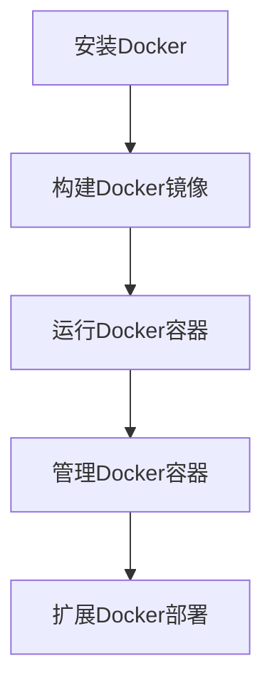

                 

关键词：Docker、容器化、部署、实战、云计算、微服务

> 摘要：本文将深入探讨Docker容器化技术的核心概念、部署流程、以及其在云计算和微服务架构中的应用，帮助读者理解Docker容器化部署的实战技巧和策略。

## 1. 背景介绍

随着云计算和微服务架构的兴起，应用部署的灵活性和可移植性变得尤为重要。传统的虚拟化技术虽然能够在一定程度上解决应用部署的问题，但是它们的资源占用较高，部署和管理复杂。Docker作为一种轻量级容器技术，能够更高效地实现应用部署和运行。本文将围绕Docker容器化部署，从基础概念到实践操作，为您呈现一个全面的实战指南。

## 2. 核心概念与联系

### 2.1 Docker简介

Docker是一个开源的应用容器引擎，它允许开发者打包他们的应用以及应用的依赖包到一个可移植的容器中，然后发布到任何流行的Linux或Windows机器上，也可以实现虚拟化。容器是完全使用沙箱机制，相互之间不会有任何接口（类似iPhone的App）而且更轻量级。

### 2.2 容器和虚拟机的区别

容器和传统的虚拟机相比，具有以下几个显著特点：

- **启动速度**：容器启动速度快，通常在毫秒级别，而虚拟机则需要几分钟。
- **资源占用**：容器共享操作系统内核，因此占用资源较少，而虚拟机则需要为每个虚拟机分配独立的操作系统和硬件资源。
- **隔离性**：容器提供了良好的隔离性，但不如虚拟机。
- **灵活性**：容器可以在任何操作系统上运行，而虚拟机则需要特定的虚拟化平台。

### 2.3 Mermaid 流程图

下面是一个简单的Mermaid流程图，展示了Docker的基本流程：



## 3. 核心算法原理 & 具体操作步骤

### 3.1 算法原理概述

Docker容器化部署的核心在于镜像（Image）和容器（Container）。

- **镜像**：镜像是静态的只读模板，用于创建容器。镜像中包含了运行应用的所需的所有组件，如操作系统、库文件、配置文件等。
- **容器**：容器是从镜像创建的运行实例，它是动态的、可写的。容器在运行时可以执行各种操作，如启动服务、处理请求等。

### 3.2 算法步骤详解

#### 3.2.1 安装Docker

在大多数Linux发行版中，可以通过包管理器安装Docker。以下是一个在Ubuntu上安装Docker的示例命令：

```bash
sudo apt-get update
sudo apt-get install docker-ce docker-ce-cli containerd.io
```

#### 3.2.2 构建Docker镜像

构建Docker镜像通常涉及编写一个Dockerfile文件，该文件定义了构建镜像的步骤和指令。以下是一个简单的Dockerfile示例：

```Dockerfile
FROM ubuntu:18.04
RUN apt-get update && apt-get install -y nginx
COPY . /var/www/html
EXPOSE 80
CMD ["nginx", "-g", "daemon off;"]
```

使用以下命令构建镜像：

```bash
docker build -t my-nginx .
```

#### 3.2.3 运行Docker容器

构建好镜像后，可以使用以下命令运行容器：

```bash
docker run -d -p 8080:80 my-nginx
```

这里的命令会将本地端口8080映射到容器的80端口。

#### 3.2.4 管理Docker容器

Docker提供了丰富的命令用于管理容器，如启动、停止、重启、删除等。以下是一些常用命令的示例：

```bash
# 启动容器
docker start container_id

# 停止容器
docker stop container_id

# 删除容器
docker rm container_id

# 重启容器
docker restart container_id
```

### 3.3 算法优缺点

#### 优点

- **轻量级**：容器不需要为每个应用分配独立的操作系统和硬件资源，因此启动速度快，资源占用低。
- **可移植性**：容器可以运行在任何支持Docker的操作系统上，无需担心环境差异。
- **一致性**：容器提供了一个一致的环境，确保应用在不同环境中运行一致。

#### 缺点

- **安全性**：容器虽然提供了隔离性，但不如虚拟机安全。
- **资源管理**：容器需要更加精细的资源管理，否则可能导致资源浪费。

### 3.4 算法应用领域

Docker容器化技术广泛应用于以下领域：

- **云计算**：容器化技术能够提高云计算平台的资源利用率和服务质量。
- **微服务**：容器化技术支持微服务的部署和扩展，提高系统的可维护性和可扩展性。
- **持续集成和持续部署（CI/CD）**：容器化技术能够简化CI/CD流程，提高开发效率和交付速度。

## 4. 数学模型和公式 & 详细讲解 & 举例说明

### 4.1 数学模型构建

Docker容器化部署的数学模型主要涉及资源管理和性能优化。以下是一个简单的数学模型：

- **资源模型**：资源模型定义了容器所需的CPU、内存、存储等资源。
- **性能模型**：性能模型描述了容器在不同资源配置下的性能表现。

### 4.2 公式推导过程

资源模型和性能模型可以通过以下公式推导：

- **资源公式**：\( R = C \times M \times S \)
  - \( R \)：资源需求
  - \( C \)：CPU需求
  - \( M \)：内存需求
  - \( S \)：存储需求

- **性能公式**：\( P = \frac{R}{T} \)
  - \( P \)：性能
  - \( R \)：资源需求
  - \( T \)：运行时间

### 4.3 案例分析与讲解

假设一个容器需要1000个CPU周期、1GB内存和1GB存储，运行时间为10秒。我们可以通过以下公式计算其性能：

\( P = \frac{1000 + 1 + 1}{10} = 110 \)

这意味着该容器的性能为110个单位。

## 5. 项目实践：代码实例和详细解释说明

### 5.1 开发环境搭建

在本节中，我们将搭建一个简单的Docker环境。首先，确保您的操作系统支持Docker，然后按照以下步骤操作：

1. 安装Docker：

```bash
sudo apt-get update
sudo apt-get install docker-ce docker-ce-cli containerd.io
```

2. 验证Docker安装：

```bash
docker --version
```

### 5.2 源代码详细实现

在本节中，我们将创建一个简单的Web应用，并将其容器化。首先，创建一个名为`my-app`的目录，然后在该目录下创建一个名为`Dockerfile`的文件，内容如下：

```Dockerfile
FROM ubuntu:18.04
RUN apt-get update && apt-get install -y nginx
COPY . /var/www/html
EXPOSE 80
CMD ["nginx", "-g", "daemon off;"]
```

接下来，在`my-app`目录下创建一个名为`index.html`的文件，内容如下：

```html
<!DOCTYPE html>
<html>
<head>
    <title>Hello Docker</title>
</head>
<body>
    <h1>Hello, World!</h1>
</body>
</html>
```

### 5.3 代码解读与分析

- **Dockerfile**：Dockerfile定义了如何构建镜像。`FROM`指令指定了基础镜像，`RUN`指令安装了Nginx，`COPY`指令将当前目录中的文件复制到容器的`/var/www/html`目录，`EXPOSE`指令暴露了80端口，`CMD`指令指定了启动Nginx服务的命令。

- **index.html**：这是Web应用的首页，包含一个简单的欢迎信息。

### 5.4 运行结果展示

在构建和运行Docker容器后，您可以在浏览器中访问`http://localhost:8080`查看Web应用的运行结果。

```bash
docker build -t my-app .
docker run -d -p 8080:80 my-app
```

## 6. 实际应用场景

Docker容器化技术在实际应用中具有广泛的应用场景，以下是一些典型例子：

- **云计算平台**：如AWS、Azure和Google Cloud等，都支持Docker容器化部署。
- **微服务架构**：Docker容器化技术支持微服务的部署和扩展，如Spring Cloud、Kubernetes等。
- **持续集成和持续部署（CI/CD）**：Docker容器化技术能够简化CI/CD流程，提高开发效率和交付速度。

## 7. 工具和资源推荐

### 7.1 学习资源推荐

- **官方文档**：Docker的官方文档是学习Docker的最佳资源之一。
- **在线教程**：如Docker官方提供的在线教程和指南。
- **书籍**：《Docker Deep Dive》和《Docker容器应用实战》等。

### 7.2 开发工具推荐

- **Visual Studio Code**：强大的代码编辑器，支持Docker插件。
- **Docker Desktop**：适用于Windows和macOS的Docker桌面应用。
- **Kubernetes**：用于容器编排和管理的开源平台，与Docker紧密集成。

### 7.3 相关论文推荐

- **“Docker: Lightweight Linux Containers for Developing, Deploying, and Running Applications”**：介绍了Docker的基本原理和设计理念。
- **“Kubernetes: System Architecture”**：介绍了Kubernetes的系统架构和设计原则。

## 8. 总结：未来发展趋势与挑战

### 8.1 研究成果总结

Docker容器化技术在过去几年中取得了显著的进展，已经成为云计算和微服务架构的重要组成部分。随着技术的不断成熟，Docker容器化部署的应用场景将更加广泛。

### 8.2 未来发展趋势

- **容器化与微服务的深度融合**：容器化技术将继续与微服务架构相结合，推动企业级应用的开发和部署。
- **容器编排与管理**：随着容器化应用的增多，容器编排和管理将成为关键挑战，Kubernetes等容器编排工具将发挥更大的作用。
- **跨平台兼容性**：Docker将不断提升跨平台兼容性，使得容器化技术在更多操作系统上得到应用。

### 8.3 面临的挑战

- **安全性**：容器化技术需要进一步加强安全性，以应对潜在的安全威胁。
- **资源管理**：容器化环境下的资源管理变得更加复杂，需要更精细的资源分配和管理策略。

### 8.4 研究展望

未来，Docker容器化技术将在以下几个方面得到进一步发展：

- **自动化**：容器化技术的自动化程度将不断提高，简化部署和管理流程。
- **性能优化**：通过持续的性能优化，提升容器化应用的性能和效率。
- **标准化**：容器化技术的标准化将加速其普及和应用，推动整个行业的发展。

## 9. 附录：常见问题与解答

### 9.1 什么是Docker？

Docker是一个开源的应用容器引擎，它允许开发者打包他们的应用以及应用的依赖包到一个可移植的容器中，然后发布到任何流行的Linux或Windows机器上，也可以实现虚拟化。

### 9.2 Docker容器与虚拟机有什么区别？

容器和传统的虚拟机相比，具有以下几个显著特点：启动速度、资源占用、隔离性和灵活性。容器提供了良好的隔离性，但不如虚拟机。

### 9.3 如何在Windows上安装Docker？

在Windows上安装Docker可以通过Docker Desktop进行。请访问Docker官方网站下载Docker Desktop，并按照安装向导进行安装。

### 9.4 Docker容器如何进行扩容？

Docker容器可以通过以下命令进行扩容：

```bash
docker run -d -p 8080:80 --cpus 2.0 --memory 2g my-nginx
```

这里的`--cpus`和`--memory`参数用于指定容器的CPU和内存限制。

---

作者：禅与计算机程序设计艺术 / Zen and the Art of Computer Programming
----------------------------------------------------------------

