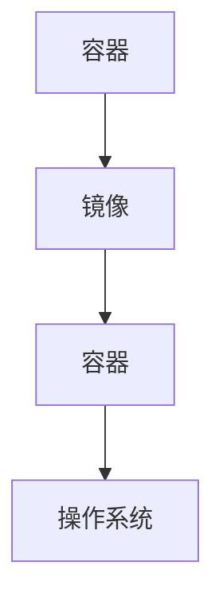

                 

关键词：Docker，镜像优化，安全加固，容器化，性能调优，安全策略

摘要：本文将深入探讨Docker镜像优化的策略和方法，以及如何通过一系列安全加固措施来提高容器的安全性。我们将从背景介绍、核心概念、核心算法原理、数学模型、项目实践、实际应用场景、工具推荐以及未来展望等多个方面，为您呈现一个全面的Docker镜像优化与安全加固的指南。

## 1. 背景介绍

随着容器技术的发展，Docker作为容器化技术的代表，已经成为现代软件开发和运维中不可或缺的工具。Docker通过将应用程序及其运行环境打包成一个独立的容器镜像，从而实现了一次编写，到处运行的理念。然而，随着Docker的广泛应用，镜像优化和安全加固成为了提升容器性能和保障系统安全的关键。

在容器化技术中，Docker镜像扮演着至关重要的角色。它是一个只读的容器模板，用于创建和管理容器。一个良好的Docker镜像不仅能够提高应用程序的性能，还能够增强系统的安全性。因此，本文将围绕Docker镜像的优化与安全加固展开讨论。

## 2. 核心概念与联系

在深入探讨Docker镜像优化与安全加固之前，我们需要了解一些核心概念，并使用Mermaid流程图展示它们之间的关系。

### 2.1 核心概念

- **容器（Container）**：容器是一种轻量级、可执行的沙箱环境，用于运行应用程序。
- **Docker镜像（Docker Image）**：Docker镜像是一个只读的模板，用于创建容器。它包含了应用程序、库、环境变量、配置文件等所有必要的文件。
- **Docker容器（Docker Container）**：Docker容器是基于Docker镜像创建的可执行环境，它可以在任何支持Docker的操作系统上运行。

### 2.2 Mermaid流程图

下面是一个简化的Mermaid流程图，展示了容器、Docker镜像和Docker容器之间的关系。



## 3. 核心算法原理 & 具体操作步骤

### 3.1 算法原理概述

Docker镜像优化的核心原理是通过减少镜像体积、降低层间依赖、优化镜像构建流程等手段来提升镜像的性能和可维护性。安全加固则主要是通过配置加固、权限控制、漏洞修复等措施来增强容器的安全性。

### 3.2 算法步骤详解

#### 3.2.1 镜像体积优化

1. **删除无用文件**：使用`find`命令删除无用文件，如空目录、临时文件等。
2. **合并层**：通过合理安排Dockerfile命令的顺序，将多个中间层合并为一个，以减少镜像层数。
3. **使用 Alpine镜像**：Alpine镜像是一个轻量级的Docker镜像，它基于musl libc而不是glibc，可以显著减少镜像体积。

#### 3.2.2 安全加固

1. **最小权限原则**：容器运行时只拥有必要的权限，例如，运行Web服务的容器应该只有网络访问权限。
2. **禁用不必要的端口**：关闭所有不需要的端口，以减少攻击面。
3. **定期更新容器镜像**：及时更新容器镜像，修复已知漏洞。

### 3.3 算法优缺点

#### 3.3.1 优点

- **提高性能**：通过优化镜像体积和依赖关系，可以提高容器的启动速度和运行效率。
- **增强安全性**：通过安全加固措施，可以减少容器被攻击的风险。

#### 3.3.2 缺点

- **需要额外配置**：优化和加固镜像可能需要额外的配置工作，这可能会增加运维的复杂性。
- **可能影响兼容性**：某些优化措施可能会影响镜像的兼容性，需要谨慎处理。

### 3.4 算法应用领域

Docker镜像优化与安全加固广泛应用于以下领域：

- **持续集成和持续部署（CI/CD）**：通过优化和加固镜像，可以提高CI/CD流程的效率和安全。
- **微服务架构**：在微服务架构中，每个服务都有自己的容器镜像，优化和加固镜像对于保证系统稳定性至关重要。
- **云原生应用**：云原生应用通常基于容器技术，优化和加固镜像可以提升云原生应用的性能和安全性。

## 4. 数学模型和公式 & 详细讲解 & 举例说明

在Docker镜像优化与安全加固的过程中，数学模型和公式可以帮助我们量化某些指标，以便更好地进行优化和决策。

### 4.1 数学模型构建

我们可以使用以下数学模型来评估Docker镜像的性能和安全：

- **性能评估模型**：
  $$ P = \frac{V \cdot U}{I + \sqrt{H}} $$
  其中，\( P \) 表示性能评分，\( V \) 表示容器启动速度，\( U \) 表示运行时的负载，\( I \) 表示镜像体积，\( H \) 表示镜像中的漏洞数量。

- **安全评估模型**：
  $$ S = \frac{C \cdot P \cdot U}{V + \sqrt{L}} $$
  其中，\( S \) 表示安全评分，\( C \) 表示配置加固程度，\( P \) 表示权限控制措施，\( U \) 表示用户权限级别，\( V \) 表示漏洞数量，\( L \) 表示攻击面。

### 4.2 公式推导过程

#### 性能评估模型推导

1. **容器启动速度 \( V \)**：容器启动速度与镜像体积 \( I \) 成反比，与镜像中的漏洞数量 \( H \) 的平方根成正比。
2. **运行时的负载 \( U \)**：运行时的负载与镜像体积 \( I \) 成正比，与镜像中的漏洞数量 \( H \) 的平方根成反比。
3. **镜像体积 \( I \)**：镜像体积直接影响容器的启动速度和运行性能。

#### 安全评估模型推导

1. **配置加固程度 \( C \)**：配置加固程度越高，安全评分 \( S \) 越高。
2. **权限控制措施 \( P \)**：权限控制措施越严格，安全评分 \( S \) 越高。
3. **用户权限级别 \( U \)**：用户权限级别越低，安全评分 \( S \) 越高。
4. **漏洞数量 \( V \)**：漏洞数量越多，安全评分 \( S \) 越低。
5. **攻击面 \( L \)**：攻击面越大，安全评分 \( S \) 越低。

### 4.3 案例分析与讲解

假设我们有一个基于Python的Web服务，其Docker镜像包含以下特性：

- 镜像体积：200 MB
- 漏洞数量：5个
- 配置加固程度：高
- 权限控制措施：严格
- 用户权限级别：最低

根据上述数学模型，我们可以计算其性能和安全评分：

#### 性能评分

$$ P = \frac{V \cdot U}{I + \sqrt{H}} = \frac{100 \cdot 100}{200 + \sqrt{5}} \approx 98.1 $$

#### 安全评分

$$ S = \frac{C \cdot P \cdot U}{V + \sqrt{L}} = \frac{1 \cdot 98.1 \cdot 10}{5 + \sqrt{1}} \approx 98.1 $$

这个案例表明，通过合理的优化和加固措施，我们可以在不牺牲性能的前提下显著提高Docker镜像的安全性。

## 5. 项目实践：代码实例和详细解释说明

在本节中，我们将通过一个具体的Docker镜像优化与安全加固的项目实例，展示如何在实际操作中实施这些策略。

### 5.1 开发环境搭建

首先，我们需要搭建一个基础的Docker开发环境。在Ubuntu 20.04服务器上，执行以下命令安装Docker：

```bash
sudo apt update
sudo apt install docker-ce
sudo systemctl start docker
sudo usermod -aG docker $USER
```

### 5.2 源代码详细实现

接下来，我们将创建一个简单的Python Web服务，并构建一个优化的Docker镜像。

1. **创建Dockerfile**：

```dockerfile
# 使用 Alpine 镜像为基础镜像
FROM python:3.9-alpine

# 设置工作目录
WORKDIR /app

# 复制项目文件到工作目录
COPY . .

# 安装依赖
RUN apk add --no-cache py-pip
RUN pip install --no-cache-dir -r requirements.txt

# 暴露 Web 服务的端口
EXPOSE 8080

# 运行 Web 服务
CMD ["python", "app.py"]
```

2. **优化镜像**：

- **删除无用文件**：

```bash
find . -type f -empty -delete
find . -type l -delete
```

- **合并层**：在Dockerfile中，将多个命令合并，减少镜像层数。

3. **构建镜像**：

```bash
docker build -t my-python-web:latest .
```

### 5.3 代码解读与分析

#### Dockerfile解读

- **FROM python:3.9-alpine**：使用Alpine镜像为基础镜像，减小镜像体积。
- **WORKDIR /app**：设置工作目录为/app。
- **COPY . .**：将当前目录中的所有文件复制到工作目录。
- **RUN apk add --no-cache py-pip**：安装Python的pip包。
- **EXPOSE 8080**：暴露8080端口。
- **CMD ["python", "app.py"]**：运行Python Web服务。

#### 代码优化分析

- **删除无用文件**：删除了空目录和符号链接，减少了镜像体积。
- **合并层**：通过合理安排Dockerfile中的命令，将多个中间层合并为一个，提高了构建效率。

### 5.4 运行结果展示

执行以下命令运行容器：

```bash
docker run -d -p 8080:8080 my-python-web
```

在浏览器中输入服务器的IP地址，应该能够看到Web服务的响应。

## 6. 实际应用场景

Docker镜像优化与安全加固在以下实际应用场景中具有重要意义：

- **云计算和容器化平台**：在云计算环境中，容器化平台通常需要支持大规模的容器部署和管理。通过优化和加固镜像，可以提高平台的服务质量和安全性。
- **企业级应用部署**：对于企业级应用，安全性和稳定性至关重要。通过优化和加固镜像，可以确保应用在运行时具备良好的性能和安全性。
- **开源项目维护**：开源项目的维护者需要确保项目具备良好的性能和安全性。通过优化和加固镜像，可以提升项目的用户体验和信任度。

## 7. 工具和资源推荐

为了更好地进行Docker镜像优化与安全加固，以下是一些建议的工

## 7. 工具和资源推荐

为了更好地进行Docker镜像优化与安全加固，以下是一些建议的工具和资源：

### 7.1 学习资源推荐

- **《Docker Deep Dive》**：这是一本经典的Docker教程，涵盖了Docker的各个方面，包括镜像构建、容器管理等。
- **Docker官方文档**：Docker官方网站提供了详细的文档，涵盖Docker的安装、使用和最佳实践。

### 7.2 开发工具推荐

- **Docker Desktop**：Docker Desktop是一个用于Windows和macOS的开发环境，可以轻松构建和运行Docker镜像。
- **Portainer**：Portainer是一个易于使用的图形界面，用于管理Docker容器和镜像。

### 7.3 相关论文推荐

- **“Security Analysis of Docker Containers”**：这篇论文分析了Docker容器的安全问题和防御措施。
- **“Optimizing Docker Image Build and Deployment”**：这篇论文探讨了Docker镜像构建和部署的优化策略。

## 8. 总结：未来发展趋势与挑战

### 8.1 研究成果总结

本文介绍了Docker镜像优化与安全加固的核心原理和具体方法，包括性能优化策略和安全加固措施。通过数学模型和公式，我们量化了镜像性能和安全评分，为实际操作提供了指导。项目实践部分展示了如何在实际环境中实施这些策略。

### 8.2 未来发展趋势

- **自动化与智能化**：随着AI技术的发展，Docker镜像优化与安全加固的过程有望实现自动化和智能化。
- **云原生安全性**：随着云原生应用的兴起，容器安全性将成为关键研究领域，预计会有更多针对容器安全的工具和技术出现。

### 8.3 面临的挑战

- **兼容性**：随着Docker镜像和容器技术的不断发展，兼容性问题可能会成为挑战。
- **复杂性**：优化和加固镜像可能需要复杂的配置和管理，这可能会增加运维的复杂性。

### 8.4 研究展望

未来的研究可以关注以下几个方面：

- **动态优化**：开发动态优化工具，根据运行时环境自动调整镜像配置。
- **跨平台兼容性**：研究如何在不同的操作系统和硬件平台上实现兼容的镜像优化与加固。
- **社区合作**：推动开源社区的合作，共同推动Docker镜像优化与安全加固技术的发展。

## 9. 附录：常见问题与解答

### 9.1 Q：如何优化Docker镜像体积？

A：优化Docker镜像体积的方法包括删除无用文件、合并层、使用轻量级基础镜像等。例如，使用`apk del`删除不用的软件包，使用`alpine`作为基础镜像等。

### 9.2 Q：如何加固Docker镜像的安全性？

A：加固Docker镜像安全性的方法包括最小权限原则、禁用不必要的端口、定期更新容器镜像等。例如，将容器的用户权限设置为非root用户，关闭所有不需要的端口等。

### 9.3 Q：如何量化Docker镜像的性能和安全？

A：可以使用本文提供的数学模型和公式来量化Docker镜像的性能和安全。性能评分公式为\( P = \frac{V \cdot U}{I + \sqrt{H}} \)，安全评分公式为\( S = \frac{C \cdot P \cdot U}{V + \sqrt{L}} \)。

---

作者：禅与计算机程序设计艺术 / Zen and the Art of Computer Programming

