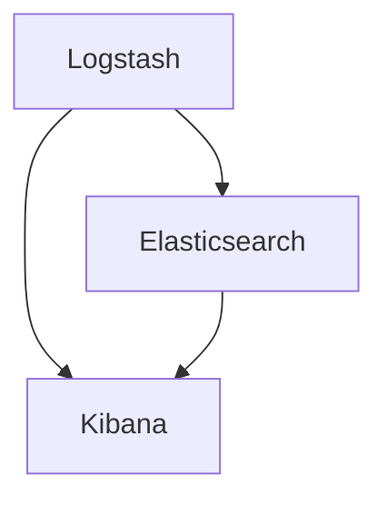

                 

关键词：ELK，日志分析，Elasticsearch，Logstash，Kibana

> 摘要：本文将详细探讨ELK日志分析系统的搭建过程，从背景介绍到核心概念，再到具体操作步骤，全面解析如何构建一个高效、实用的日志分析平台。

## 1. 背景介绍

在当今信息化社会中，企业产生了大量的日志数据，这些日志记录了系统的运行状态、用户操作、错误信息等，对于运维人员来说，如何有效地收集、存储和分析这些日志数据，成为了亟待解决的问题。ELK（Elasticsearch、Logstash、Kibana）日志分析系统作为一款开源日志分析解决方案，以其强大的数据处理能力和易用性，受到了广泛的应用。

ELK日志分析系统由三个核心组件组成：

- **Elasticsearch**：一款高性能、可扩展的搜索引擎，负责存储和检索日志数据。
- **Logstash**：一款数据收集和处理工具，用于收集各种来源的日志数据，并将其转化为适合Elasticsearch索引的数据格式。
- **Kibana**：一款可视化和数据分析平台，用于展示和分析Elasticsearch中的数据。

本文将详细讲解ELK日志分析系统的搭建过程，帮助读者了解如何使用ELK组件搭建一个高效、实用的日志分析平台。

## 2. 核心概念与联系

为了更好地理解ELK日志分析系统的运作原理，我们先来介绍一下这三个核心组件及其之间的联系。

### 2.1 Elasticsearch

Elasticsearch是一款基于Lucene的高性能、可扩展的搜索引擎。它能够快速地索引和检索海量数据，支持复杂的全文搜索和数据分析。在ELK日志分析系统中，Elasticsearch负责存储和检索日志数据。

### 2.2 Logstash

Logstash是一款数据收集和处理工具，它可以从各种数据源（如文件、数据库、网络流等）收集数据，并对其进行过滤、转换和丰富，最终将其转化为适合Elasticsearch索引的数据格式。在ELK日志分析系统中，Logstash充当了数据管道的角色，将来自不同来源的日志数据传输到Elasticsearch中。

### 2.3 Kibana

Kibana是一款可视化和数据分析平台，它通过可视化仪表板、图表和报告，帮助用户分析Elasticsearch中的数据。在ELK日志分析系统中，Kibana提供了友好的用户界面，使得用户可以轻松地进行日志数据的查询、分析和监控。

### 2.4 Mermaid 流程图

下面是一个简单的Mermaid流程图，展示了ELK日志分析系统中各个组件之间的联系：



在上面的流程图中，Logstash作为数据收集和处理工具，首先从各种数据源收集日志数据，然后将其传输到Elasticsearch进行存储和索引。Kibana作为数据分析平台，可以通过Elasticsearch查询和展示日志数据。

## 3. 核心算法原理 & 具体操作步骤

### 3.1 算法原理概述

ELK日志分析系统采用了以下核心算法原理：

- **Elasticsearch**：使用倒排索引技术进行高效的数据检索和查询。
- **Logstash**：使用数据管道（Pipeline）进行日志数据的收集、过滤、转换和丰富。
- **Kibana**：使用数据可视化和仪表板技术，提供直观的数据分析界面。

### 3.2 算法步骤详解

下面是搭建ELK日志分析系统的具体操作步骤：

#### 3.2.1 Elasticsearch搭建

1. 下载并安装Elasticsearch。
2. 配置Elasticsearch，设置集群名称、节点名称等参数。
3. 启动Elasticsearch服务。

#### 3.2.2 Logstash搭建

1. 下载并安装Logstash。
2. 创建一个Logstash配置文件，指定输入、过滤和处理步骤。
3. 启动Logstash服务。

#### 3.2.3 Kibana搭建

1. 下载并安装Kibana。
2. 配置Kibana，设置Elasticsearch的连接信息。
3. 启动Kibana服务。

#### 3.2.4 数据收集和展示

1. 将日志数据输入到Logstash中。
2. Logstash将日志数据进行处理，并传输到Elasticsearch中。
3. 在Kibana中创建仪表板和图表，展示Elasticsearch中的数据。

### 3.3 算法优缺点

- **优点**：ELK日志分析系统具有以下优点：
  - **高效**：Elasticsearch提供了高效的全文检索和数据分析能力。
  - **可扩展**：ELK组件均支持水平扩展，可以轻松应对海量数据的处理。
  - **易用**：Kibana提供了直观的可视化界面，使得数据分析变得简单易行。

- **缺点**：ELK日志分析系统也存在一些缺点：
  - **资源消耗**：Elasticsearch和Kibana在运行时需要较高的系统资源。
  - **学习成本**：ELK组件的功能丰富，但同时也意味着需要较高的学习成本。

### 3.4 算法应用领域

ELK日志分析系统在以下领域具有广泛的应用：

- **运维监控**：实时监控系统的运行状态，快速定位故障。
- **安全审计**：分析日志数据，发现潜在的安全风险。
- **业务分析**：通过对日志数据进行分析，优化业务流程和用户体验。

## 4. 数学模型和公式 & 详细讲解 & 举例说明

### 4.1 数学模型构建

在ELK日志分析系统中，数据模型的设计至关重要。一个基本的数据模型包括以下字段：

- **timestamp**：日志记录的时间戳。
- **source**：日志来源。
- **level**：日志级别（如DEBUG、INFO、ERROR等）。
- **message**：日志内容。

假设我们使用Elasticsearch的DSL（Domain Specific Language）来构建索引模板，数据模型可以表示为：

```json
{
  "mappings": {
    "properties": {
      "timestamp": {
        "type": "date"
      },
      "source": {
        "type": "keyword"
      },
      "level": {
        "type": "keyword"
      },
      "message": {
        "type": "text"
      }
    }
  }
}
```

### 4.2 公式推导过程

在构建数据模型时，我们需要考虑以下因素：

- **数据量**：日志数据的总量。
- **数据分布**：日志数据的分布情况。
- **索引速度**：日志数据的索引速度。

假设日志数据总量为\(N\)，数据分布为均匀分布，索引速度为\(v\)，那么可以推导出以下公式：

- **索引时间**：\(T = \frac{N}{v}\)

其中，\(T\)表示索引所需的总时间，\(N\)表示日志数据总量，\(v\)表示索引速度。

### 4.3 案例分析与讲解

假设一个企业每天产生10GB的日志数据，使用Logstash进行日志收集和处理，假设Logstash的处理速度为1GB/min，Elasticsearch的索引速度为2GB/min，那么我们可以计算出：

- **索引所需时间**：\(T = \frac{10GB}{2GB/min} = 5min\)

这意味着每天产生的10GB日志数据需要5分钟才能完全索引到Elasticsearch中。

在实际应用中，我们还需要考虑日志数据的存储空间、集群性能等因素，从而调整索引速度和存储策略，以实现高效的日志分析。

## 5. 项目实践：代码实例和详细解释说明

### 5.1 开发环境搭建

在开始搭建ELK日志分析系统之前，我们需要搭建一个合适的开发环境。以下是一个基本的开发环境搭建步骤：

1. **操作系统**：推荐使用Linux系统，如CentOS 7或Ubuntu 18.04。
2. **Elasticsearch**：下载并安装Elasticsearch，参考官方文档：https://www.elastic.co/guide/en/elasticsearch/reference/current/get-started.html
3. **Logstash**：下载并安装Logstash，参考官方文档：https://www.elastic.co/guide/en/logstash/current/get-started.html
4. **Kibana**：下载并安装Kibana，参考官方文档：https://www.elastic.co/guide/en/kibana/current/get-started.html

### 5.2 源代码详细实现

下面是一个简单的Logstash配置文件示例，用于收集并处理系统日志：

```yaml
input {
  file {
    path => "/var/log/messages"
    type => "system_log"
    startpos => 0
    sincedb_path => "/var/lib/logstash/sincedb"
  }
}

filter {
  if "system_log" in [type] {
    grok {
      match => { "message" => "%{TIMESTAMP_ISO8601:timestamp}\t%{DATA:source}\t%{DATA:level}\t%{DATA:message}" }
    }
  }
}

output {
  if "system_log" in [type] {
    elasticsearch {
      hosts => ["localhost:9200"]
      index => "system_log-%{+YYYY.MM.dd}"
    }
  }
}
```

在这个示例中，Logstash从文件路径为`/var/log/messages`的系统日志文件中收集数据，使用Grok插件进行日志解析，并将解析后的数据发送到Elasticsearch进行存储。

### 5.3 代码解读与分析

在这个Logstash配置文件中：

- **输入（Input）模块**：使用`file`插件从系统日志文件中收集数据，配置了文件路径、数据类型（`type`）、起始位置（`startpos`）和sincedb数据库路径（`sincedb_path`）。
- **过滤（Filter）模块**：使用`grok`插件对日志消息进行解析，通过正则表达式匹配提取出时间戳、日志源、日志级别和日志内容。
- **输出（Output）模块**：使用`elasticsearch`插件将解析后的数据发送到Elasticsearch，配置了Elasticsearch的连接地址（`hosts`）和索引名称（`index`）。

### 5.4 运行结果展示

配置完成后，启动Logstash服务，开始收集并处理日志数据。在Kibana中创建一个新的仪表板，通过Elasticsearch查询和展示日志数据。

假设我们查询系统日志中某段时间内的错误日志，可以在Kibana的搜索栏中输入以下查询语句：

```json
{
  "query": {
    "bool": {
      "filter": {
        "range": {
          "timestamp": {
            "gte": "2023-01-01T00:00:00",
            "lte": "2023-01-31T23:59:59"
          }
        },
        "term": {
          "level": "ERROR"
        }
      }
    }
  }
}
```

查询结果将展示出指定时间范围内，日志级别为错误的日志记录。通过这种方式，我们可以直观地分析和监控系统的运行状态。

## 6. 实际应用场景

ELK日志分析系统在各个领域具有广泛的应用，以下是一些实际应用场景：

- **运维监控**：企业可以使用ELK日志分析系统监控服务器、应用和网络的运行状态，快速定位故障，提高系统稳定性。
- **安全审计**：通过分析日志数据，发现潜在的安全威胁，提高网络安全防护能力。
- **业务分析**：通过对业务日志的分析，优化业务流程，提高用户体验和满意度。
- **运维自动化**：使用ELK日志分析系统，结合自动化脚本和工具，实现自动化运维，提高运维效率。

## 7. 工具和资源推荐

### 7.1 学习资源推荐

- **Elastic官方文档**：https://www.elastic.co/guide/
- **Elastic博客**：https://www.elastic.co/guide/blog/
- **ELK中文社区**：https://www.elk社区.com/

### 7.2 开发工具推荐

- **Elastic Stack工具**：https://www.elastic.co/guide/downloads/current.html
- **Kibana插件**：https://www.kibana.cn/plugins/

### 7.3 相关论文推荐

- **Elasticsearch：The Definitive Guide**：https://www.elastic.co/guide/en/elasticsearch/guide/current/getting-started.html
- **Logstash：The Definitive Guide**：https://www.elastic.co/guide/en/logstash/current/getting-started.html
- **Kibana：The Definitive Guide**：https://www.elastic.co/guide/en/kibana/current/getting-started.html

## 8. 总结：未来发展趋势与挑战

### 8.1 研究成果总结

ELK日志分析系统凭借其高效、易用的特点，在日志收集、存储、分析和展示等方面取得了显著的成果。目前，ELK已经成为企业日志分析的首选工具，广泛应用于运维监控、安全审计和业务分析等领域。

### 8.2 未来发展趋势

- **智能化**：随着人工智能技术的发展，ELK日志分析系统将逐步实现智能化，提高日志数据分析和处理的自动化程度。
- **云原生**：随着云计算的普及，ELK日志分析系统将逐步向云原生架构演进，实现弹性扩展和资源优化。
- **多样化**：ELK日志分析系统将支持更多数据源和数据分析工具的集成，满足不同场景下的日志分析需求。

### 8.3 面临的挑战

- **数据安全**：在日志分析过程中，如何确保数据安全和隐私保护，将成为ELK日志分析系统面临的挑战。
- **性能优化**：随着日志数据量的增加，如何提高ELK日志分析系统的性能和稳定性，将是重要的研究方向。
- **生态建设**：完善ELK日志分析系统的生态，吸引更多开发者参与，推动系统的持续发展和优化。

### 8.4 研究展望

未来，ELK日志分析系统将在智能化、云原生和多样化等方面继续发展，为企业和个人提供更高效、更智能的日志分析解决方案。同时，如何应对数据安全、性能优化和生态建设等挑战，将成为ELK日志分析系统研究的重要方向。

## 9. 附录：常见问题与解答

### 9.1 Elasticsearch无法启动

- 检查Elasticsearch的配置文件，确保集群名称、节点名称等参数设置正确。
- 检查Elasticsearch的依赖库和插件，确保安装齐全。
- 检查Elasticsearch的运行日志，查看错误信息和提示，根据错误信息进行排查。

### 9.2 Logstash无法收集日志

- 确保Logstash的输入插件配置正确，路径和文件名是否正确。
- 检查Logstash的运行日志，查看错误信息和提示，根据错误信息进行排查。
- 确保Logstash的配置文件路径正确，且配置文件格式无误。

### 9.3 Kibana无法连接Elasticsearch

- 确保Kibana的Elasticsearch连接地址和端口设置正确。
- 检查Elasticsearch的运行状态，确保Elasticsearch服务已启动。
- 检查Elasticsearch的运行日志，查看错误信息和提示，根据错误信息进行排查。

### 9.4 如何优化ELK日志分析系统的性能

- 调整Elasticsearch的索引和查询参数，优化索引速度和查询性能。
- 合理规划Elasticsearch的集群架构，提高系统容错能力和查询性能。
- 使用Logstash的缓存和批量处理功能，提高日志收集和传输速度。
- 使用Kibana的缓存和异步处理功能，提高数据展示和交互性能。

---

作者：禅与计算机程序设计艺术 / Zen and the Art of Computer Programming

以上就是关于ELK日志分析系统搭建的详细教程，希望能对大家有所帮助。在搭建和优化ELK日志分析系统时，多实践、多总结，相信你一定能掌握这个强大的日志分析工具。

