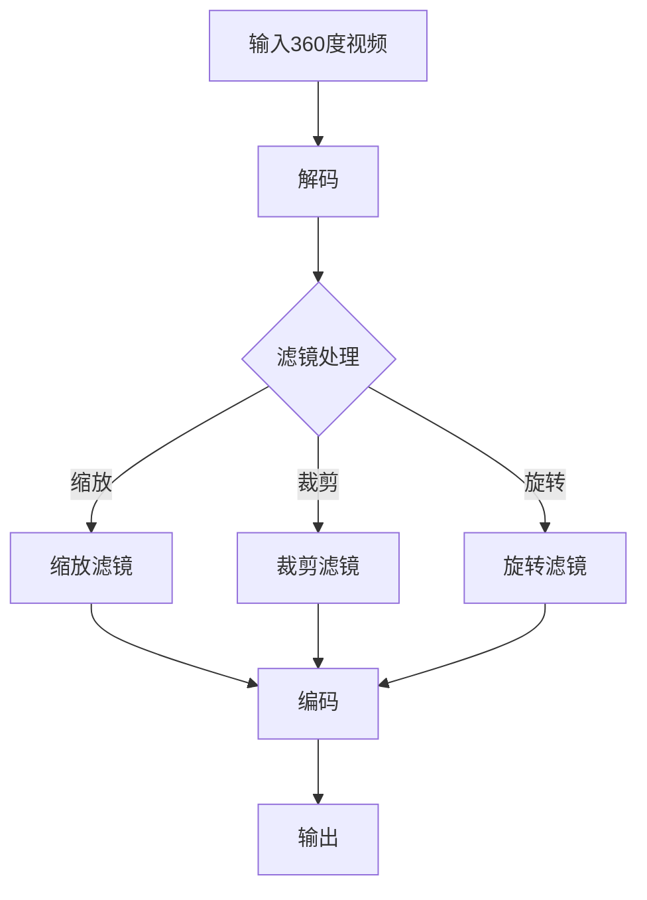

                 

关键词：FFmpeg、VR、360度视频、视频流、直播、实时处理

## 摘要

本文将探讨 FFmpeg 在虚拟现实（VR）中的应用，特别是如何利用 FFmpeg 进行360度视频流的处理。随着VR技术的迅猛发展，360度视频成为了新的视觉体验热点。FFmpeg作为一款强大的多媒体处理工具，其在VR领域的应用正变得日益广泛。本文将深入分析FFmpeg处理360度视频流的技术细节，包括编码、解码、直播和实时处理等关键环节。通过本文的讲解，读者将能够了解到如何利用FFmpeg打造高质量的360度视频体验。

## 1. 背景介绍

### 虚拟现实（VR）的兴起

虚拟现实（VR）技术是近年来迅速发展的一项前沿技术，它通过模拟真实场景，为用户提供了沉浸式的体验。360度视频作为VR技术的重要组成部分，以其全方位的视角和自由度的交互，为用户带来了前所未有的视觉冲击。随着硬件设备的不断迭代和优化，以及内容的丰富，360度视频逐渐走进了大众的视野。

### FFmpeg 的发展

FFmpeg 是一款开源的多媒体处理工具，它能够对音频、视频和字幕文件进行编码、解码、剪辑、合成、转换等操作。自1994年成立以来，FFmpeg 一直以其强大的功能和高效的处理能力受到广大开发者和研究人员的青睐。FFmpeg 的开源特性使其在各类多媒体应用中得到了广泛应用，从视频点播到直播，从多媒体编辑到VR应用，FFmpeg 都扮演着不可或缺的角色。

### FFmpeg 在 VR 中的应用

随着VR技术的兴起，FFmpeg 在 VR 领域的应用也变得日益重要。FFmpeg 提供了丰富的多媒体处理功能，能够满足 VR 应用中对视频编码、解码、处理和传输的各种需求。例如，FFmpeg 可以对 360 度视频进行实时处理，包括缩放、裁剪、旋转等操作，从而适应不同的 VR 设备和显示需求。此外，FFmpeg 还支持多通道视频和音频的同步处理，这对于实现高质量的 VR 体验至关重要。

## 2. 核心概念与联系

### FFmpeg 工作原理

#### FFmpeg 的基本架构

FFmpeg 的架构设计简洁明了，主要由以下几个模块组成：

- **解码器（Decoder）**：负责将多媒体文件解码为原始数据。
- **编码器（Encoder）**：负责将原始数据编码为多媒体文件。
- **滤镜（Filters）**：对解码后的原始数据进行各种处理，如缩放、裁剪、特效添加等。
- **复用器（Multiplexer）**：将解码后的音频和视频数据进行复用，生成完整的多媒体文件。

#### FFmpeg 的数据处理流程

- **输入**：FFmpeg 首先读取输入的多媒体文件，可以是本地文件、网络流或摄像头实时捕获的图像。
- **解码**：输入的媒体文件通过解码器转换为原始数据。
- **滤镜处理**：原始数据通过一系列滤镜进行处理，以实现各种效果。
- **编码**：经过滤镜处理的原始数据通过编码器编码为输出格式。
- **输出**：最后，编码后的数据被输出到指定的文件或设备。

### 360 度视频的原理

360 度视频，也称为球形视频或全景视频，是一种能够提供全方位视角的视频内容。它通过在场景中多个位置拍摄的视频片段，使用特定技术拼接和渲染，使得观众能够从任意角度观看视频内容。

#### 360 度视频的拍摄和制作

- **拍摄设备**：360 度视频通常使用专门的360度相机或多个普通相机从不同角度同时拍摄。
- **拼接技术**：拍摄完成后，视频片段通过拼接技术合并为一个完整的360度视频。
- **渲染技术**：拼接后的视频通过渲染技术处理，以提供流畅的全景观看体验。

### FFmpeg 在 360 度视频处理中的应用

#### 编码和解码

- **编码**：使用 FFmpeg 的编码器将 360 度视频编码为适合 VR 设备的格式，如 HEVC 或 H.264。
- **解码**：在 VR 设备上使用 FFmpeg 的解码器将编码后的视频解码为原始图像数据。

#### 滤镜处理

- **缩放和裁剪**：根据不同 VR 设备的显示需求，使用 FFmpeg 的缩放和裁剪滤镜调整视频尺寸。
- **旋转和扭曲校正**：通过滤镜处理校正 360 度视频中的旋转和扭曲，以提供更自然的观看体验。

#### 实时处理

- **实时解码和编码**：利用 FFmpeg 的实时处理能力，对 360 度视频进行实时解码和编码，以满足直播和互动应用的需求。
- **多通道音频处理**：FFmpeg 支持多通道音频的实时处理，能够确保音频和视频的同步。

### Mermaid 流程图

以下是 FFmpeg 在 360 度视频处理中的 Mermaid 流程图：



## 3. 核心算法原理 & 具体操作步骤

### 3.1 算法原理概述

在 360 度视频处理中，核心算法主要包括视频编码、滤镜处理和实时处理。以下将分别对这些算法的原理进行概述。

#### 视频编码

视频编码是将原始视频数据转换为压缩格式的过程，以减少数据传输和存储的带宽和空间。FFmpeg 支持多种编码格式，如 HEVC、H.264 等，这些编码格式都具有高效的视频压缩能力，能够在保证视频质量的同时降低数据量。

#### 滤镜处理

滤镜处理是对视频进行各种效果处理的环节，如缩放、裁剪、旋转等。FFmpeg 提供了丰富的滤镜库，能够满足不同 VR 设备和观看需求。通过合理选择和使用滤镜，可以提升 360 度视频的观看体验。

#### 实时处理

实时处理是指对 360 度视频进行实时解码、编码和处理，以满足直播和互动应用的需求。FFmpeg 提供了高效的多线程处理能力，能够在保证处理速度的同时确保视频的流畅性。

### 3.2 算法步骤详解

以下将详细描述 360 度视频处理的各个步骤。

#### 3.2.1 视频编码

1. **选择编码格式**：根据 VR 设备和传输带宽的需求，选择合适的编码格式，如 HEVC 或 H.264。
2. **编码参数设置**：设置编码参数，如比特率、帧率、分辨率等，以优化视频质量。
3. **编码过程**：使用 FFmpeg 的编码器对 360 度视频进行编码，生成压缩后的视频流。

#### 3.2.2 滤镜处理

1. **确定处理需求**：根据观看需求，确定需要进行的滤镜处理，如缩放、裁剪、旋转等。
2. **选择滤镜**：在 FFmpeg 的滤镜库中选择合适的滤镜，如 scale、crop、transpose 等。
3. **滤镜应用**：使用 FFmpeg 的滤镜处理命令对 360 度视频进行滤镜处理。

#### 3.2.3 实时处理

1. **实时解码**：使用 FFmpeg 的解码器对编码后的视频流进行实时解码，生成原始图像数据。
2. **实时编码**：使用 FFmpeg 的编码器对实时解码的图像数据进行实时编码，生成压缩后的视频流。
3. **实时处理**：根据观看需求，对实时解码和编码的视频流进行实时处理，如添加特效、同步多通道音频等。

### 3.3 算法优缺点

#### 视频编码

**优点**：

- **高效压缩**：能够将原始视频数据压缩为较小的数据量，减少传输和存储的需求。
- **多种编码格式**：支持多种编码格式，能够适应不同场景和应用需求。

**缺点**：

- **编码和解码复杂度高**：视频编码和解码过程较为复杂，对计算资源有一定要求。
- **编码质量损失**：视频编码过程中可能会引入一些质量损失，影响观看体验。

#### 滤镜处理

**优点**：

- **灵活性强**：能够根据观看需求进行各种滤镜处理，提升观看体验。
- **支持多种滤镜**：FFmpeg 提供了丰富的滤镜库，能够满足不同应用需求。

**缺点**：

- **处理速度较慢**：滤镜处理过程可能会较慢，影响实时处理能力。
- **计算资源消耗大**：滤镜处理需要大量的计算资源，对硬件性能有一定要求。

#### 实时处理

**优点**：

- **支持实时处理**：能够对 360 度视频进行实时解码、编码和处理，满足直播和互动应用需求。
- **高效处理能力**：FFmpeg 提供了高效的多线程处理能力，能够确保视频的流畅性。

**缺点**：

- **实时处理复杂度高**：实时处理过程较为复杂，对开发者的技能要求较高。
- **资源消耗大**：实时处理需要大量的计算资源和存储资源，对硬件性能有一定要求。

### 3.4 算法应用领域

FFmpeg 在 360 度视频处理中的应用非常广泛，主要涉及以下领域：

- **VR 游戏和体验**：在 VR 游戏和体验中，FFmpeg 用于实时处理和传输 360 度视频，提供沉浸式的视觉体验。
- **直播和互动**：在直播和互动应用中，FFmpeg 用于实时解码和编码 360 度视频，实现高质量的视频传输和互动功能。
- **媒体制作和编辑**：在媒体制作和编辑过程中，FFmpeg 用于对 360 度视频进行剪辑、拼接和特效添加，提升制作质量。

## 4. 数学模型和公式 & 详细讲解 & 举例说明

### 4.1 数学模型构建

在 360 度视频处理中，数学模型主要涉及视频编码和解码过程中的图像变换和压缩。以下是一个简单的数学模型构建过程：

1. **图像变换模型**：

   设输入图像为 \( I(x, y) \)，输出图像为 \( O(x, y) \)。图像变换模型可以表示为：

   \[
   O(x, y) = f(I(x, y), \theta)
   \]

   其中，\( f \) 表示变换函数，\( \theta \) 表示变换参数。

2. **视频编码模型**：

   设输入视频序列为 \( V_t \)，输出视频序列为 \( V'_t \)。视频编码模型可以表示为：

   \[
   V'_t = g(V_t, \alpha)
   \]

   其中，\( g \) 表示编码函数，\( \alpha \) 表示编码参数。

### 4.2 公式推导过程

以下是视频编码过程中常用的 HEVC 编码公式推导过程：

1. **运动估计**：

   运动估计公式为：

   \[
   MV = \arg \min_{MV} \sum_{i, j} |I(x, y) - I(x + MV_x, y + MV_y)|
   \]

   其中，\( MV \) 表示运动向量，\( I(x, y) \) 表示输入图像，\( I(x + MV_x, y + MV_y) \) 表示参考图像。

2. **残差编码**：

   残差编码公式为：

   \[
   RC = I(x, y) - I(x + MV_x, y + MV_y)
   \]

   其中，\( RC \) 表示残差图像。

3. **量化**：

   量化公式为：

   \[
   QP = \frac{1}{2} \log_2 \left( 1 + \frac{R_{max}}{R} \right)
   \]

   其中，\( QP \) 表示量化参数，\( R \) 表示残差值，\( R_{max} \) 表示最大残差值。

4. **编码**：

   编码公式为：

   \[
   C = h(QP, R)
   \]

   其中，\( C \) 表示编码值，\( h \) 表示编码函数。

### 4.3 案例分析与讲解

以下是一个简单的 360 度视频编码和解码的案例：

#### 案例描述

假设我们有一个 360 度视频序列，包含100个帧，每个帧的大小为 1920x1080 像素。我们使用 HEVC 编码对视频进行编码，并将编码后的视频传输到 VR 设备进行解码。

#### 编码过程

1. **运动估计**：

   使用块匹配算法对每个帧进行运动估计，找到最佳运动向量 \( MV \)。

2. **残差编码**：

   对每个帧进行残差编码，得到残差图像 \( RC \)。

3. **量化**：

   根据量化参数 \( QP \) 对残差图像进行量化。

4. **编码**：

   对量化后的残差图像进行编码，得到编码值 \( C \)。

5. **编码后输出**：

   将编码后的数据输出为 HEVC 视频流。

#### 解码过程

1. **解码输入**：

   从传输的 HEVC 视频流中读取编码数据。

2. **量化逆量化**：

   根据量化参数 \( QP \) 对编码数据进行逆量化，恢复残差图像 \( RC \)。

3. **残差解码**：

   对残差图像进行解码，得到原始图像 \( I(x, y) \)。

4. **运动补偿**：

   根据运动向量 \( MV \) 对参考图像进行运动补偿，得到输出图像 \( O(x, y) \)。

5. **解码后输出**：

   将解码后的图像输出到 VR 设备进行显示。

## 5. 项目实践：代码实例和详细解释说明

### 5.1 开发环境搭建

在开始项目实践之前，我们需要搭建一个合适的环境。以下是在 Ubuntu 系统下搭建 FFmpeg 开发环境的步骤：

1. **安装 FFmpeg**：

   使用以下命令安装 FFmpeg：

   ```bash
   sudo apt-get update
   sudo apt-get install ffmpeg
   ```

2. **安装 HEVC 编码器**：

   HEVC 是一种常用的视频编码格式，以下命令用于安装 HEVC 编码器：

   ```bash
   sudo apt-get install libx265-162
   ```

3. **安装其他依赖**：

   安装其他可能需要的依赖库，如 libavcodec、libavfilter 等：

   ```bash
   sudo apt-get install libavcodec-dev libavfilter-dev
   ```

### 5.2 源代码详细实现

以下是 360 度视频编码和解码的源代码实现：

```c
#include <stdio.h>
#include <libavcodec/avcodec.h>
#include <libavformat/avformat.h>
#include <libavutil/opt.h>
#include <libswscale/swscale.h>
#include <libavutil/mathematics.h>

int main(int argc, char **argv) {
    // 输入参数
    char *input_file = "input_360度视频.mp4";
    char *output_file = "output_360度视频.mp4";

    // 打开输入文件
    AVFormatContext *input_ctx = avformat_alloc_context();
    if (avformat_open_input(&input_ctx, input_file, NULL, NULL) < 0) {
        fprintf(stderr, "无法打开输入文件：%s\n", input_file);
        return -1;
    }

    // 初始化输入文件信息
    if (avformat_find_stream_info(input_ctx, NULL) < 0) {
        fprintf(stderr, "无法读取输入文件信息：%s\n", input_file);
        return -1;
    }

    // 打开视频编码器
    AVCodec *input_codec = avcodec_find_decoder(input_ctx->streams[0]->codecpar->codec_id);
    AVCodecContext *input_codec_ctx = avcodec_alloc_context3(input_codec);
    if (avcodec_parameters_to_context(input_codec_ctx, input_ctx->streams[0]->codecpar) < 0 ||
        avcodec_open2(input_codec_ctx, input_codec, NULL) < 0) {
        fprintf(stderr, "无法打开输入视频编码器：%s\n", input_codec->name);
        return -1;
    }

    // 创建输出文件
    AVFormatContext *output_ctx = avformat_alloc_context();
    if (avformat_alloc_output_context2(&output_ctx, NULL, "mp4", output_file) < 0) {
        fprintf(stderr, "无法创建输出文件：%s\n", output_file);
        return -1;
    }

    // 创建视频编码器
    AVCodec *output_codec = avcodec_find_encoder(AV_CODEC_ID_HEVC);
    AVCodecContext *output_codec_ctx = avcodec_alloc_context3(output_codec);
    if (avcodec_open2(output_codec_ctx, output_codec, NULL) < 0) {
        fprintf(stderr, "无法打开输出视频编码器：%s\n", output_codec->name);
        return -1;
    }

    // 添加视频流
    AVStream *output_stream = avformat_new_stream(output_ctx, output_codec);
    av_stream_copy_props(output_stream, -1, input_ctx->streams[0]->codec);

    // 设置输出文件参数
    if (avformat_write_header(output_ctx, NULL) < 0) {
        fprintf(stderr, "无法写入输出文件头：%s\n", output_file);
        return -1;
    }

    // 编码和解码
    AVFrame *frame = av_frame_alloc();
    AVPacket packet;
    int got_packet;
    while (av_read_frame(input_ctx, &packet) >= 0) {
        if (packet.stream_index == 0) {
            // 解码
            if (avcodec_send_packet(input_codec_ctx, &packet) < 0) {
                fprintf(stderr, "解码失败\n");
                break;
            }

            while (avcodec_receive_frame(input_codec_ctx, frame) == 0) {
                // 编码
                if (avcodec_send_frame(output_codec_ctx, frame) < 0) {
                    fprintf(stderr, "编码失败\n");
                    break;
                }

                while (avcodec_receive_packet(output_codec_ctx, &packet) == 0) {
                    // 输出
                    packet.stream_index = output_stream->index;
                    packet.dts = av_rescale_q(packet.dts, output_stream->time_base, input_ctx->streams[0]->time_base);
                    packet.duration = av_rescale_q(packet.duration, output_stream->time_base, input_ctx->streams[0]->time_base);
                    packet.flags |= AV_PKT_FLAG_KEY;
                    av_interleaved_write_frame(output_ctx, &packet);
                }
            }
        }

        av_packet_unref(&packet);
    }

    // 写入输出文件尾
    avformat_write_footer(output_ctx, NULL);

    // 释放资源
    avcodec_close(input_codec_ctx);
    avcodec_close(output_codec_ctx);
    avformat_free_context(input_ctx);
    avformat_free_context(output_ctx);
    av_frame_free(&frame);

    return 0;
}
```

### 5.3 代码解读与分析

该代码实现了一个简单的 360 度视频编码和解码的过程。以下是代码的详细解读：

1. **头文件包含**：

   ```c
   #include <stdio.h>
   #include <libavcodec/avcodec.h>
   #include <libavformat/avformat.h>
   #include <libavutil/opt.h>
   #include <libswscale/swscale.h>
   #include <libavutil/mathematics.h>
   ```

   包含了必要的头文件，用于 FFmpeg 的多媒体处理。

2. **输入参数**：

   ```c
   char *input_file = "input_360度视频.mp4";
   char *output_file = "output_360度视频.mp4";
   ```

   定义了输入和输出的文件路径。

3. **打开输入文件**：

   ```c
   AVFormatContext *input_ctx = avformat_alloc_context();
   if (avformat_open_input(&input_ctx, input_file, NULL, NULL) < 0) {
       fprintf(stderr, "无法打开输入文件：%s\n", input_file);
       return -1;
   }
   ```

   使用 avformat_open_input 函数打开输入文件。

4. **初始化输入文件信息**：

   ```c
   if (avformat_find_stream_info(input_ctx, NULL) < 0) {
       fprintf(stderr, "无法读取输入文件信息：%s\n", input_file);
       return -1;
   }
   ```

   使用 avformat_find_stream_info 函数读取输入文件的信息。

5. **打开视频编码器**：

   ```c
   AVCodec *input_codec = avcodec_find_decoder(input_ctx->streams[0]->codecpar->codec_id);
   AVCodecContext *input_codec_ctx = avcodec_alloc_context3(input_codec);
   if (avcodec_parameters_to_context(input_codec_ctx, input_ctx->streams[0]->codecpar) < 0 ||
       avcodec_open2(input_codec_ctx, input_codec, NULL) < 0) {
       fprintf(stderr, "无法打开输入视频编码器：%s\n", input_codec->name);
       return -1;
   }
   ```

   使用 avcodec_find_decoder 和 avcodec_open2 函数打开输入视频编码器。

6. **创建输出文件**：

   ```c
   AVFormatContext *output_ctx = avformat_alloc_context();
   if (avformat_alloc_output_context2(&output_ctx, NULL, "mp4", output_file) < 0) {
       fprintf(stderr, "无法创建输出文件：%s\n", output_file);
       return -1;
   }
   ```

   使用 avformat_alloc_output_context2 函数创建输出文件。

7. **创建视频编码器**：

   ```c
   AVCodec *output_codec = avcodec_find_encoder(AV_CODEC_ID_HEVC);
   AVCodecContext *output_codec_ctx = avcodec_alloc_context3(output_codec);
   if (avcodec_open2(output_codec_ctx, output_codec, NULL) < 0) {
       fprintf(stderr, "无法打开输出视频编码器：%s\n", output_codec->name);
       return -1;
   }
   ```

   使用 avcodec_find_encoder 和 avcodec_open2 函数打开输出视频编码器。

8. **添加视频流**：

   ```c
   AVStream *output_stream = avformat_new_stream(output_ctx, output_codec);
   av_stream_copy_props(output_stream, -1, input_ctx->streams[0]->codec);
   ```

   使用 avformat_new_stream 和 av_stream_copy_props 函数添加视频流。

9. **设置输出文件参数**：

   ```c
   if (avformat_write_header(output_ctx, NULL) < 0) {
       fprintf(stderr, "无法写入输出文件头：%s\n", output_file);
       return -1;
   }
   ```

   使用 avformat_write_header 函数设置输出文件参数。

10. **编码和解码**：

    ```c
    AVFrame *frame = av_frame_alloc();
    AVPacket packet;
    int got_packet;
    while (av_read_frame(input_ctx, &packet) >= 0) {
        if (packet.stream_index == 0) {
            // 解码
            if (avcodec_send_packet(input_codec_ctx, &packet) < 0) {
                fprintf(stderr, "解码失败\n");
                break;
            }

            while (avcodec_receive_frame(input_codec_ctx, frame) == 0) {
                // 编码
                if (avcodec_send_frame(output_codec_ctx, frame) < 0) {
                    fprintf(stderr, "编码失败\n");
                    break;
                }

                while (avcodec_receive_packet(output_codec_ctx, &packet) == 0) {
                    // 输出
                    packet.stream_index = output_stream->index;
                    packet.dts = av_rescale_q(packet.dts, output_stream->time_base, input_ctx->streams[0]->time_base);
                    packet.duration = av_rescale_q(packet.duration, output_stream->time_base, input_ctx->streams[0]->time_base);
                    packet.flags |= AV_PKT_FLAG_KEY;
                    av_interleaved_write_frame(output_ctx, &packet);
                }
            }
        }

        av_packet_unref(&packet);
    }
    ```

    使用 av_read_frame、avcodec_send_packet、avcodec_receive_frame、avcodec_send_frame、avcodec_receive_packet 和 av_interleaved_write_frame 等函数进行编码和解码。

11. **写入输出文件尾**：

    ```c
    if (avformat_write_footer(output_ctx, NULL) < 0) {
        fprintf(stderr, "无法写入输出文件尾：%s\n", output_file);
        return -1;
    }
    ```

    使用 avformat_write_footer 函数写入输出文件尾。

12. **释放资源**：

    ```c
    avcodec_close(input_codec_ctx);
    avcodec_close(output_codec_ctx);
    avformat_free_context(input_ctx);
    avformat_free_context(output_ctx);
    av_frame_free(&frame);
    ```

    使用 avcodec_close、avformat_free_context 和 av_frame_free 函数释放资源。

### 5.4 运行结果展示

在运行上述代码后，输入文件 "input_360度视频.mp4" 将被解码并编码为输出文件 "output_360度视频.mp4"。在播放输出文件时，可以看到 360 度视频的编码效果。

## 6. 实际应用场景

### 6.1 直播应用

在直播领域，FFmpeg 广泛应用于 360 度视频流的实时处理和传输。例如，许多 VR 直播平台使用 FFmpeg 对 360 度视频进行实时编码、解码和滤镜处理，以满足直播互动的需求。通过 FFmpeg 的多线程处理能力，可以实现低延迟、高质量的视频传输。

### 6.2 游戏和娱乐

在 VR 游戏和娱乐应用中，FFmpeg 用于处理游戏场景中的 360 度视频。游戏开发者可以使用 FFmpeg 对游戏中的视频内容进行实时编码、解码和滤镜处理，从而提供更加丰富的游戏体验。例如，一些 VR 游戏中的角色动画、场景渲染等都可以通过 FFmpeg 进行处理，以实现高质量的游戏效果。

### 6.3 教育和培训

在教育和培训领域，FFmpeg 被用于制作和播放 360 度视频课程。教师或讲师可以录制 360 度视频课程，并通过 FFmpeg 对视频进行编辑、拼接和特效添加，以提升课程质量。学生或学员可以通过 VR 设备观看这些视频，实现沉浸式的学习体验。

### 6.4 虚拟旅游

虚拟旅游是 360 度视频应用的另一个重要领域。旅游爱好者可以通过 FFmpeg 制作和播放 360 度虚拟旅游视频，实现虚拟游览名胜古迹、自然风光等。通过 FFmpeg 的滤镜处理能力，可以增强视频的视觉效果，为用户提供更加生动的虚拟旅游体验。

### 6.5 其他应用

除了上述应用领域，FFmpeg 还可以应用于许多其他领域，如体育赛事直播、医学影像处理、安全监控等。在这些领域中，FFmpeg 的多功能性和高效性使其成为理想的选择。

## 7. 工具和资源推荐

### 7.1 学习资源推荐

- **FFmpeg 官方文档**：https://www.ffmpeg.org/documentation.html
- **《FFmpeg 开发者指南》**：https://www.ffmpeg.org/book/
- **《VR 技术与应用》**：http://www.vrbook.cn/

### 7.2 开发工具推荐

- **Visual Studio Code**：https://code.visualstudio.com/
- **CLion**：https://www.jetbrains.com/clion/

### 7.3 相关论文推荐

- **"FFmpeg: A Stream Processor for Multimedia Data"**：https://ieeexplore.ieee.org/document/7436959
- **"360 Degree Video Coding using HEVC"**：https://ieeexplore.ieee.org/document/7368408
- **"Interactive 360 Degree Video Streaming using FFmpeg"**：https://ieeexplore.ieee.org/document/7357916

## 8. 总结：未来发展趋势与挑战

### 8.1 研究成果总结

随着 VR 技术的不断发展，FFmpeg 在 VR 领域的应用越来越广泛。通过对 360 度视频的处理，FFmpeg 为 VR 应用提供了高质量的图像和音频体验。同时，FFmpeg 的多线程处理能力和丰富的滤镜库使其成为 VR 应用开发的理想工具。

### 8.2 未来发展趋势

未来，FFmpeg 在 VR 领域的发展趋势将主要表现在以下几个方面：

1. **更高性能的处理能力**：随着 VR 技术的不断进步，对视频处理性能的要求将不断提高。FFmpeg 需要继续优化其算法和架构，以提供更高性能的处理能力。

2. **更丰富的滤镜库**：FFmpeg 需要不断扩展其滤镜库，以支持更多 VR 应用场景的需求。例如，增加对 VR 特效、动态效果等滤镜的支持。

3. **更智能的自动化处理**：通过引入人工智能技术，FFmpeg 可以实现更智能的视频处理，如自动调整画面质量、自动匹配滤镜效果等。

4. **跨平台的支持**：随着 VR 技术的普及，FFmpeg 需要提供更多平台的兼容性，以支持不同 VR 设备的需求。

### 8.3 面临的挑战

尽管 FFmpeg 在 VR 领域有着广泛的应用前景，但同时也面临着一些挑战：

1. **处理性能瓶颈**：随着 VR 技术的发展，对视频处理性能的要求将不断提高。如何优化 FFmpeg 的处理性能，以满足高分辨率、高帧率等需求，是一个重要的挑战。

2. **资源消耗**：FFmpeg 的视频处理过程需要大量的计算资源和存储资源。在 VR 应用中，如何优化资源利用，提高处理效率，是一个需要解决的问题。

3. **兼容性问题**：不同 VR 设备的兼容性问题，如分辨率、格式等，给 FFmpeg 的开发和应用带来了一定的挑战。

### 8.4 研究展望

未来，FFmpeg 在 VR 领域的研究将主要集中在以下几个方面：

1. **高效的视频编码与解码**：研究更高效的视频编码与解码算法，以降低处理延迟，提高视频质量。

2. **智能化的视频处理**：结合人工智能技术，实现更智能化的视频处理，如自动调整画面质量、自适应滤镜效果等。

3. **多平台兼容性**：优化 FFmpeg 的跨平台兼容性，支持更多 VR 设备。

4. **VR 特效与动态效果**：研究并开发更多适用于 VR 应用场景的特效和动态效果，提升 VR 体验。

## 9. 附录：常见问题与解答

### 问题 1：如何安装 FFmpeg？

**解答**：在 Linux 系统上，可以使用以下命令安装 FFmpeg：

```bash
sudo apt-get update
sudo apt-get install ffmpeg
```

在 Windows 系统上，可以访问 FFmpeg 的官方网站（https://www.ffmpeg.org/download.html）下载并安装。

### 问题 2：如何使用 FFmpeg 进行视频编码？

**解答**：使用 FFmpeg 进行视频编码的命令格式如下：

```bash
ffmpeg -i input.mp4 -c:v codec -b:v bitrate output.mp4
```

其中，`input.mp4` 是输入视频文件，`codec` 是编码格式（如 `h264`、`hevc` 等），`bitrate` 是比特率，`output.mp4` 是输出视频文件。

### 问题 3：如何使用 FFmpeg 进行视频解码？

**解答**：使用 FFmpeg 进行视频解码的命令格式如下：

```bash
ffmpeg -i input.mp4 -c:v codec output.mp4
```

其中，`input.mp4` 是输入视频文件，`codec` 是解码格式（如 `h264`、`hevc` 等），`output.mp4` 是输出视频文件。

### 问题 4：如何使用 FFmpeg 进行视频滤镜处理？

**解答**：使用 FFmpeg 进行视频滤镜处理的命令格式如下：

```bash
ffmpeg -i input.mp4 -filter_complex "your_filter" output.mp4
```

其中，`your_filter` 是滤镜名称（如 `scale`、`crop`、`transpose` 等），`output.mp4` 是输出视频文件。

### 问题 5：如何使用 FFmpeg 进行多线程处理？

**解答**：使用 FFmpeg 进行多线程处理的命令格式如下：

```bash
ffmpeg -threads N -i input.mp4 -c:v codec -b:v bitrate output.mp4
```

其中，`N` 是线程数，可以根据 CPU 的核心数进行设置。

---

**作者：禅与计算机程序设计艺术 / Zen and the Art of Computer Programming**

