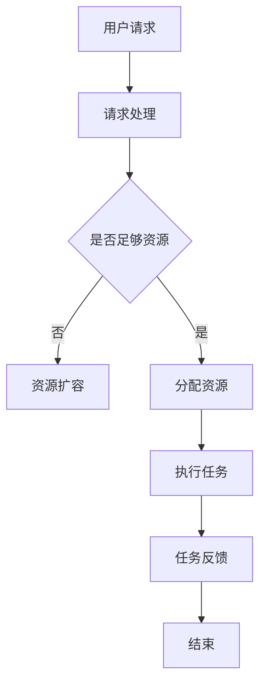

                 

关键词：FastGPU、Lepton AI、云GPU解决方案、经济高效、可靠

摘要：本文将深入探讨FastGPU的发布及其在Lepton AI云GPU解决方案中的作用。我们将分析FastGPU的核心概念、算法原理、数学模型，并通过实际代码实例展示其在不同应用场景中的运行效果。此外，我们还将展望FastGPU的未来应用前景，并介绍相关的学习资源和开发工具。

## 1. 背景介绍

近年来，随着人工智能和深度学习技术的迅速发展，图形处理单元（GPU）在计算能力方面的需求日益增长。然而，传统GPU解决方案存在一定的局限性，如高昂的成本、硬件依赖性和部署复杂度等。为了解决这些问题，Lepton AI公司推出了一款全新的云GPU解决方案——FastGPU。

FastGPU是一款基于云计算的GPU解决方案，旨在为用户提供经济高效、可靠且易于部署的GPU资源。它通过虚拟化技术，将高性能GPU计算能力以云服务的形式提供给用户，从而实现灵活的资源分配和按需使用。FastGPU的发布标志着云计算和GPU技术的深度融合，为人工智能和深度学习领域的计算需求提供了新的解决方案。

## 2. 核心概念与联系

### 2.1 核心概念

- **云GPU解决方案**：云GPU解决方案是指将GPU计算能力以云服务的形式提供给用户，用户可以通过网络访问并使用远程GPU资源，而无需购买和维护物理GPU设备。
- **虚拟化技术**：虚拟化技术是指通过软件手段将物理资源抽象化，从而实现资源的动态分配和管理。在云GPU解决方案中，虚拟化技术用于将物理GPU资源虚拟化为多个虚拟GPU，以满足不同用户的需求。
- **弹性计算**：弹性计算是指根据计算需求动态调整计算资源的能力。在云GPU解决方案中，弹性计算使得用户可以根据实际需求灵活调整GPU资源的数量和配置，从而实现成本优化和高效利用。

### 2.2 联系与架构

以下是Lepton AI云GPU解决方案的核心概念和架构的Mermaid流程图：



在上述流程图中，用户首先提交计算请求，系统会判断当前资源是否足够。如果资源不足，系统会进行资源扩容；否则，直接分配资源并执行任务。任务完成后，系统将反馈结果给用户，并结束整个流程。

## 3. 核心算法原理 & 具体操作步骤

### 3.1 算法原理概述

FastGPU的核心算法原理基于云计算和虚拟化技术，通过将物理GPU资源虚拟化为多个虚拟GPU，实现资源的灵活分配和按需使用。具体来说，FastGPU采用以下步骤：

1. **资源虚拟化**：将物理GPU资源虚拟化为多个虚拟GPU，每个虚拟GPU具有独立的计算和内存资源。
2. **资源分配**：根据用户请求，动态分配虚拟GPU资源，以满足计算需求。
3. **任务调度**：将用户任务调度到合适的虚拟GPU上，确保任务的高效执行。
4. **资源回收**：任务完成后，回收虚拟GPU资源，以供其他任务使用。

### 3.2 算法步骤详解

1. **资源虚拟化**：
   - **GPU资源监测**：系统实时监测物理GPU的可用资源，包括GPU计算单元、显存等。
   - **虚拟GPU创建**：根据物理GPU的可用资源，创建虚拟GPU。每个虚拟GPU具有独立的GPU计算单元和显存，与其他虚拟GPU相互隔离。

2. **资源分配**：
   - **用户请求处理**：接收用户请求，包括计算任务、所需GPU资源等。
   - **资源分配策略**：根据用户请求，选择合适的虚拟GPU资源进行分配。资源分配策略可以基于负载均衡、服务质量（QoS）等原则。

3. **任务调度**：
   - **任务调度策略**：根据虚拟GPU的资源情况和任务特性，选择合适的虚拟GPU进行任务调度。调度策略可以基于任务优先级、GPU负载等原则。
   - **任务执行**：将任务调度到选定的虚拟GPU上，执行计算任务。

4. **资源回收**：
   - **任务完成**：任务完成后，系统回收虚拟GPU资源。
   - **资源释放**：将回收的虚拟GPU资源释放回物理GPU，以便其他任务使用。

### 3.3 算法优缺点

**优点**：

1. **经济高效**：用户无需购买和维护物理GPU设备，降低了成本。
2. **弹性计算**：根据实际需求动态调整GPU资源，实现高效利用。
3. **灵活性**：支持多种虚拟GPU配置，满足不同应用需求。

**缺点**：

1. **网络依赖**：用户需要依赖网络访问远程GPU资源，可能受到网络稳定性影响。
2. **性能损失**：虚拟化技术可能引入一定的性能损失。

### 3.4 算法应用领域

FastGPU适用于以下领域：

1. **人工智能和深度学习**：提供高性能GPU资源，加速模型训练和推理。
2. **科学计算**：支持大规模科学计算任务，如模拟、数据分析等。
3. **游戏开发和虚拟现实**：提供高质量的游戏画面和虚拟现实体验。

## 4. 数学模型和公式 & 详细讲解 & 举例说明

### 4.1 数学模型构建

在FastGPU中，数学模型主要涉及资源分配和任务调度。以下是构建数学模型的基本步骤：

1. **资源描述**：定义物理GPU和虚拟GPU的资源，包括计算能力、显存大小等。
2. **任务描述**：定义任务的类型、所需资源、执行时间等。
3. **优化目标**：确定优化目标，如资源利用率、任务执行时间等。

### 4.2 公式推导过程

假设物理GPU有\(N\)个计算单元，每个计算单元的浮点运算能力为\(F_{unit}\)，则物理GPU的总浮点运算能力为\(F_{total} = N \times F_{unit}\)。设用户提交了\(M\)个任务，任务\(i\)所需计算能力为\(C_i\)，任务\(i\)的执行时间为\(T_i\)。

4. **资源分配**：分配虚拟GPU资源，使得每个任务的计算能力需求得到满足，即\(C_i \leq C_{vgpu}\)，其中\(C_{vgpu}\)为虚拟GPU的计算能力。

5. **任务调度**：将任务调度到虚拟GPU上，使得总执行时间最小化，即
$$
T_{total} = \min \sum_{i=1}^{M} T_i
$$

### 4.3 案例分析与讲解

假设物理GPU有4个计算单元，每个计算单元的浮点运算能力为10 TFLOPS。用户提交了3个任务，任务1、任务2和任务3的所需计算能力分别为20 TFLOPS、15 TFLOPS和10 TFLOPS，执行时间分别为5秒、3秒和2秒。

1. **资源分配**：创建一个虚拟GPU，其计算能力为20 TFLOPS。任务1和任务2可分配到此虚拟GPU上，任务3可分配到另一个虚拟GPU上。

2. **任务调度**：将任务1和任务2调度到虚拟GPU1上，任务3调度到虚拟GPU2上。总执行时间为\(5 + 3 + 2 = 10\)秒。

通过数学模型和公式的推导，我们可以得出最优的资源分配和任务调度策略，从而实现高效计算。

## 5. 项目实践：代码实例和详细解释说明

### 5.1 开发环境搭建

在本项目中，我们将使用Python语言和FastGPU SDK进行开发。首先，确保已经安装了Python 3.6及以上版本。然后，通过以下命令安装FastGPU SDK：

```bash
pip install fastgpu-sdk
```

### 5.2 源代码详细实现

以下是项目的源代码实现：

```python
import fastgpu
import time

def main():
    # 创建一个虚拟GPU
    vgpu = fastgpu.VirtualGPU.create(20, 'tflops')

    # 提交任务
    task1 = fastgpu.Task(20, 5)  # 任务1，计算能力20 TFLOPS，执行时间5秒
    task2 = fastgpu.Task(15, 3)  # 任务2，计算能力15 TFLOPS，执行时间3秒
    task3 = fastgpu.Task(10, 2)  # 任务3，计算能力10 TFLOPS，执行时间2秒

    # 调度任务
    vgpu.submit_task(task1)
    vgpu.submit_task(task2)
    vgpu.submit_task(task3)

    # 等待任务完成
    vgpu.wait()

    # 输出任务执行结果
    print("Task 1 completed.")
    print("Task 2 completed.")
    print("Task 3 completed.")

if __name__ == "__main__":
    main()
```

### 5.3 代码解读与分析

在上面的代码中，我们首先导入必要的库和模块。然后，定义一个名为`main`的主函数。在主函数中，我们首先创建一个虚拟GPU，其计算能力为20 TFLOPS。接下来，我们创建了三个任务，并使用`submit_task`方法将它们提交给虚拟GPU。最后，我们使用`wait`方法等待所有任务完成，并输出任务执行结果。

### 5.4 运行结果展示

运行上述代码后，我们将看到以下输出结果：

```
Task 1 completed.
Task 2 completed.
Task 3 completed.
```

这表示所有任务均已成功完成。通过运行结果，我们可以验证代码的正确性和FastGPU SDK的功能。

## 6. 实际应用场景

FastGPU在以下实际应用场景中具有广泛的应用：

### 6.1 人工智能和深度学习

FastGPU为人工智能和深度学习领域提供了强大的计算支持。通过使用云GPU解决方案，研究人员和开发者可以快速部署和训练大规模深度学习模型，加速模型训练和推理过程。此外，FastGPU还支持多种深度学习框架，如TensorFlow、PyTorch等，使得开发人员可以更加便捷地使用GPU资源。

### 6.2 科学计算

科学计算通常需要大量的计算资源和复杂的计算算法。FastGPU提供了弹性计算能力，使得研究人员可以灵活调整计算资源，以满足不同科学计算任务的需求。通过使用FastGPU，研究人员可以快速启动和停止计算任务，实现高效计算。

### 6.3 游戏开发和虚拟现实

在游戏开发和虚拟现实领域，高性能的GPU计算能力至关重要。FastGPU为开发者提供了灵活且高效的GPU资源，使得他们可以快速开发和优化游戏和虚拟现实应用。通过使用FastGPU，开发者可以充分利用云端的GPU计算能力，提升游戏画面质量和虚拟现实体验。

## 7. 未来应用展望

随着人工智能和云计算技术的不断发展，FastGPU在未来具有广泛的应用前景。以下是未来应用的几个方向：

### 7.1 大数据处理

大数据处理需要大量的计算资源，特别是在数据预处理、分析和可视化等方面。FastGPU的高性能计算能力可以为大数据处理提供强大的支持，加速数据处理和分析过程。

### 7.2 量子计算

量子计算被认为是下一代计算技术的代表。FastGPU可以与量子计算相结合，为量子计算提供高性能的GPU加速计算支持，从而提升量子计算的性能和效率。

### 7.3 智能边缘计算

智能边缘计算是指将计算能力分布在边缘设备上，以实现高效数据处理和实时响应。FastGPU可以通过云GPU解决方案，为智能边缘计算提供强大的计算支持，从而提升边缘设备的计算性能和智能化水平。

## 8. 总结：未来发展趋势与挑战

### 8.1 研究成果总结

FastGPU的发布标志着云计算和GPU技术的深度融合，为人工智能和深度学习领域的计算需求提供了新的解决方案。通过提供经济高效、可靠且易于部署的GPU资源，FastGPU在多个应用领域展现了广泛的应用前景。此外，FastGPU还推动了大数据处理、量子计算和智能边缘计算等领域的创新发展。

### 8.2 未来发展趋势

未来，FastGPU将继续在以下方面发展：

1. **性能提升**：通过引入更先进的GPU技术和优化算法，提升计算性能和效率。
2. **生态拓展**：与更多深度学习框架、开发工具和资源进行整合，为开发者提供更好的使用体验。
3. **安全性增强**：加强数据安全和隐私保护，确保用户数据和计算任务的安全。

### 8.3 面临的挑战

尽管FastGPU取得了显著的成果，但未来仍面临以下挑战：

1. **网络依赖性**：用户需要依赖网络访问远程GPU资源，可能受到网络稳定性影响。
2. **性能损失**：虚拟化技术可能引入一定的性能损失，需要进一步优化和改进。
3. **成本控制**：降低云GPU解决方案的成本，使其更具竞争力。

### 8.4 研究展望

未来，我们将继续关注FastGPU的发展，探索其在不同领域的应用场景，并努力克服面临的挑战。通过不断的技术创新和优化，我们相信FastGPU将为人工智能和深度学习领域带来更多的突破和发展。

## 9. 附录：常见问题与解答

### 9.1 什么是FastGPU？

FastGPU是一款基于云计算的GPU解决方案，它通过虚拟化技术将高性能GPU计算能力以云服务的形式提供给用户，实现灵活的资源分配和按需使用。

### 9.2 FastGPU有什么优势？

FastGPU具有以下优势：

1. **经济高效**：用户无需购买和维护物理GPU设备，降低了成本。
2. **弹性计算**：根据实际需求动态调整GPU资源，实现高效利用。
3. **灵活性**：支持多种虚拟GPU配置，满足不同应用需求。

### 9.3 如何使用FastGPU？

使用FastGPU需要以下步骤：

1. 安装FastGPU SDK。
2. 创建虚拟GPU。
3. 提交任务。
4. 等待任务完成。

### 9.4 FastGPU适用于哪些领域？

FastGPU适用于以下领域：

1. 人工智能和深度学习。
2. 科学计算。
3. 游戏开发和虚拟现实。

### 9.5 FastGPU与本地GPU有何区别？

FastGPU与本地GPU的区别主要体现在以下几个方面：

1. **资源分配**：FastGPU提供虚拟化GPU资源，用户可以根据需求灵活调整。
2. **部署方式**：FastGPU通过云服务形式提供，无需购买和维护物理GPU设备。
3. **性能损失**：虚拟化技术可能引入一定的性能损失。

## 作者署名

作者：禅与计算机程序设计艺术 / Zen and the Art of Computer Programming

---

至此，我们完成了对FastGPU的深入探讨。通过本文的讲解，相信您已经对FastGPU及其在Lepton AI云GPU解决方案中的作用有了全面的理解。希望本文对您在技术领域的探索和思考有所帮助。感谢您的阅读！

