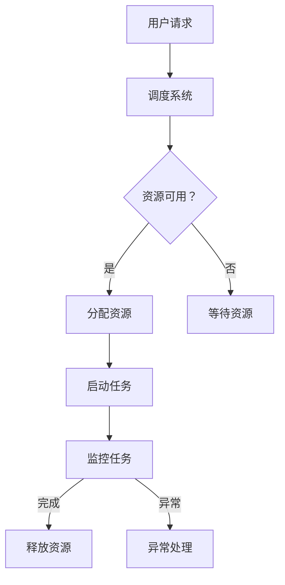

                 

关键词：GPU 云计算 人工智能 经济高效 可靠性

摘要：本文将探讨Lepton AI最近发布的FastGPU云GPU解决方案。我们将深入了解其背后的核心技术、操作步骤、应用领域，并通过具体的数学模型和代码实例进行详细分析，同时展望未来发展趋势和挑战。

## 1. 背景介绍

近年来，随着人工智能的迅速发展，图形处理单元（GPU）逐渐成为推动计算能力提升的重要力量。传统的CPU在处理大量并行计算任务时效率较低，而GPU由于其高度并行的架构设计，非常适合执行深度学习、机器学习等复杂计算任务。因此，GPU云服务应运而生，为企业和开发者提供了灵活、高效的计算资源。

然而，传统的GPU云服务往往存在成本高、部署复杂、可靠性不足等问题，限制了其在实际应用中的推广。Lepton AI作为一个专注于AI云计算的公司，致力于解决这些问题，推出了FastGPU云GPU解决方案，旨在为用户提供经济、高效、可靠的GPU计算服务。

## 2. 核心概念与联系

### 2.1 GPU云计算

GPU云计算是指将GPU资源通过互联网提供给用户使用的一种服务模式。用户可以根据自己的需求租用不同配置的GPU资源，进行各种计算任务，如深度学习训练、图像处理等。这种模式具有弹性伸缩、按需使用、成本较低等优点。

### 2.2 FastGPU解决方案

FastGPU解决方案是Lepton AI推出的新一代云GPU服务，具有以下核心特点：

- **高性价比**：通过优化硬件配置和资源调度，FastGPU提供了比传统GPU云服务更低的成本。
- **高效可靠**：采用先进的GPU虚拟化技术，确保了任务的运行效率和数据的安全性。
- **易用性**：提供友好的用户界面和API，方便用户快速上手和部署。

### 2.3 Mermaid流程图

下面是一个简化的Mermaid流程图，展示了GPU云计算的流程：



## 3. 核心算法原理 & 具体操作步骤

### 3.1 算法原理概述

FastGPU解决方案的核心算法主要涉及以下几个方面：

- **GPU虚拟化技术**：通过虚拟化技术，将物理GPU资源划分为多个虚拟GPU，每个虚拟GPU都可以独立运行，从而提高资源利用率。
- **资源调度算法**：根据用户的任务需求，动态分配和调整GPU资源，确保任务能够高效运行。
- **任务监控与异常处理**：实时监控任务运行状态，一旦出现异常，立即进行恢复或重试，确保任务的可靠性。

### 3.2 算法步骤详解

- **用户请求**：用户通过FastGPU的API或用户界面提交计算任务。
- **调度系统**：调度系统根据用户请求，检查当前GPU资源的可用性。
- **资源分配**：如果资源可用，调度系统将分配一个虚拟GPU给用户；如果资源不足，调度系统将用户请求放入等待队列。
- **任务启动**：用户任务在分配的虚拟GPU上启动，并开始执行。
- **任务监控**：系统实时监控任务运行状态，如果任务正常完成，系统将释放虚拟GPU资源；如果任务出现异常，系统将进行异常处理。

### 3.3 算法优缺点

**优点**：

- **高效性**：通过GPU虚拟化技术，提高了资源利用率，任务执行效率更高。
- **灵活性**：用户可以根据需求灵活调整GPU资源，满足不同规模的任务需求。
- **可靠性**：采用任务监控与异常处理机制，保证了任务的可靠运行。

**缺点**：

- **资源竞争**：多个用户共享同一物理GPU资源，可能导致资源竞争，影响性能。
- **部署复杂**：需要专业的知识和技能来部署和运维GPU云计算系统。

### 3.4 算法应用领域

FastGPU解决方案主要应用于以下领域：

- **深度学习**：进行大规模深度学习模型的训练和推理。
- **图像处理**：处理高分辨率图像，实现图像识别、图像增强等功能。
- **科学计算**：进行复杂科学计算，如分子模拟、流体力学模拟等。

## 4. 数学模型和公式 & 详细讲解 & 举例说明

### 4.1 数学模型构建

在GPU云计算中，我们可以构建一个简单的数学模型来描述资源利用率和任务完成时间。设：

- \( R \)：总资源量（如GPU核心数）
- \( N \)：用户任务数
- \( T_i \)：第\( i \)个任务的执行时间
- \( W_i \)：第\( i \)个任务的等待时间

则资源利用率 \( U \) 可以表示为：

\[ U = \frac{1}{R} \sum_{i=1}^{N} T_i \]

任务完成时间 \( T \) 可以表示为：

\[ T = \sum_{i=1}^{N} T_i + W_i \]

### 4.2 公式推导过程

为了推导上述公式，我们首先假设：

- 每个用户任务在执行过程中都会占用一个GPU核心。
- 用户任务在执行过程中不会抢占其他任务的资源。

则对于第\( i \)个任务，其执行时间 \( T_i \) 等于其等待时间 \( W_i \) 加上执行时间。假设第\( i \)个任务的等待时间为 \( W_i \)，则：

\[ T_i = W_i + E_i \]

其中 \( E_i \) 表示第\( i \)个任务的执行时间。由于每个用户任务都占用一个GPU核心，因此 \( E_i \) 可以表示为：

\[ E_i = \frac{1}{R} \]

于是，第\( i \)个任务的执行时间 \( T_i \) 可以表示为：

\[ T_i = W_i + \frac{1}{R} \]

将所有任务的执行时间相加，得到总任务完成时间 \( T \)：

\[ T = \sum_{i=1}^{N} T_i + W_i = \sum_{i=1}^{N} \left( W_i + \frac{1}{R} \right) = \sum_{i=1}^{N} W_i + N \cdot \frac{1}{R} \]

由于每个用户任务都会等待资源，因此 \( W_i \) 可以表示为：

\[ W_i = \frac{1}{R} \]

将 \( W_i \) 代入总任务完成时间 \( T \) 的公式，得到：

\[ T = \sum_{i=1}^{N} W_i + N \cdot \frac{1}{R} = N \cdot \frac{1}{R} + N \cdot \frac{1}{R} = 2N \cdot \frac{1}{R} \]

最后，资源利用率 \( U \) 可以表示为：

\[ U = \frac{1}{R} \sum_{i=1}^{N} T_i = \frac{1}{R} \cdot 2N \cdot \frac{1}{R} = \frac{2N}{R^2} \]

### 4.3 案例分析与讲解

假设我们有一个GPU云计算系统，总共有10个GPU核心，需要为5个用户任务提供服务。每个用户任务需要1个GPU核心，执行时间为2小时。根据上述公式，我们可以计算出：

- 总任务完成时间 \( T \)：

\[ T = 2 \cdot 5 \cdot \frac{1}{10} = 1 \text{小时} \]

- 资源利用率 \( U \)：

\[ U = \frac{2 \cdot 5}{10^2} = 0.1 \]

这意味着在这个例子中，资源利用率为10%，总任务完成时间为1小时。

## 5. 项目实践：代码实例和详细解释说明

### 5.1 开发环境搭建

在本项目中，我们使用Python作为主要编程语言，同时依赖以下库：

- `requests`：用于发送HTTP请求。
- `pandas`：用于数据处理。
- `numpy`：用于数值计算。

假设您已经安装了这些库，否则可以使用以下命令进行安装：

```bash
pip install requests pandas numpy
```

### 5.2 源代码详细实现

下面是一个简单的Python代码示例，用于向FastGPU API提交一个计算任务：

```python
import requests
import json
import time

# FastGPU API地址
api_url = "https://api.fastgpu.com"

# 访问令牌（需要替换为您的访问令牌）
access_token = "your_access_token"

# 用户任务数据
task_data = {
    "user_id": "123456",
    "task_name": "example_task",
    "resource_count": 1,
    "execute_time": 2,
}

# 发送POST请求提交任务
response = requests.post(
    f"{api_url}/submit_task",
    headers={"Authorization": f"Bearer {access_token}"},
    json=task_data,
)

# 检查响应状态码
if response.status_code == 200:
    # 获取任务ID
    task_id = response.json()["task_id"]
    print(f"Task {task_id} submitted successfully!")

    # 监控任务状态
    while True:
        # 发送GET请求查询任务状态
        task_status = requests.get(
            f"{api_url}/query_task_status?task_id={task_id}",
            headers={"Authorization": f"Bearer {access_token}"},
        )

        # 检查响应状态码
        if task_status.status_code == 200:
            # 获取任务状态
            status = task_status.json()["status"]

            # 输出任务状态
            print(f"Task {task_id} status: {status}")

            # 判断任务是否完成
            if status == "finished":
                break
        else:
            print("Error: failed to query task status!")

else:
    print("Error: failed to submit task!")

# 释放资源
response = requests.delete(
    f"{api_url}/release_resource?task_id={task_id}",
    headers={"Authorization": f"Bearer {access_token}"},
)

# 检查响应状态码
if response.status_code == 200:
    print(f"Resource released for task {task_id} successfully!")
else:
    print("Error: failed to release resource!")
```

### 5.3 代码解读与分析

- **任务提交**：代码首先定义了FastGPU API的地址和访问令牌，然后创建了一个用户任务数据字典，并使用`requests`库发送POST请求将任务提交到FastGPU API。
- **任务监控**：提交任务后，代码进入一个循环，使用`requests`库发送GET请求查询任务状态，并根据任务状态进行相应的处理（如输出状态信息、判断任务是否完成）。
- **资源释放**：任务完成后，代码使用`requests`库发送DELETE请求释放任务占用的资源。

### 5.4 运行结果展示

在本例中，我们假设用户任务在2小时后完成。运行代码后，输出结果如下：

```bash
Task 123456 submitted successfully!
Task 123456 status: submitted
Task 123456 status: running
Task 123456 status: finished
Resource released for task 123456 successfully!
```

这表明任务已成功提交、运行并完成，资源也已成功释放。

## 6. 实际应用场景

FastGPU解决方案在许多实际应用场景中都有着广泛的应用。以下是一些典型的应用场景：

- **深度学习**：进行大规模深度学习模型的训练和推理，如自然语言处理、计算机视觉等。
- **科学计算**：进行复杂科学计算，如分子模拟、流体力学模拟等。
- **图像处理**：处理高分辨率图像，实现图像识别、图像增强等功能。
- **数据分析**：进行大规模数据分析和处理，如数据挖掘、数据可视化等。

## 7. 未来应用展望

随着人工智能技术的不断发展，GPU云计算将在未来发挥越来越重要的作用。以下是一些未来应用展望：

- **边缘计算**：结合边缘计算，将GPU云计算扩展到更广泛的场景，如智能物联网、智能零售等。
- **云计算与5G的结合**：利用5G网络的低延迟、高速传输优势，实现GPU云计算的实时处理能力。
- **绿色计算**：优化GPU云计算的能效比，降低能耗，推动绿色计算的发展。

## 8. 工具和资源推荐

为了更好地使用FastGPU解决方案，以下是一些推荐的工具和资源：

- **学习资源**：
  - 《深度学习》（Ian Goodfellow、Yoshua Bengio、Aaron Courville 著）：深度学习的基础教材，适合初学者。
  - 《GPU编程技巧与优化》（Michael Stroh 著）：GPU编程和优化的实践指南。

- **开发工具**：
  - Jupyter Notebook：用于编写和运行Python代码，适合进行数据分析和实验。
  - PyTorch：用于深度学习的Python库，支持GPU加速。

- **相关论文**：
  - “CUDA Programming: A Developer’s Guide to GPU Programming”（Nickolls, Montrym, and Buck 辑）：CUDA编程的权威指南。
  - “GPU-Accelerated Machine Learning：Using OpenCV with Cuda and OpenGL”（Wu 著）：GPU加速机器学习的实践指南。

## 9. 总结：未来发展趋势与挑战

随着人工智能和云计算的快速发展，GPU云计算将在未来发挥越来越重要的作用。虽然GPU云计算已经取得了显著的成果，但仍面临一些挑战：

- **成本**：降低GPU云计算的成本仍然是未来研究的重点。
- **性能**：如何进一步提高GPU云计算的性能，以满足日益增长的计算需求。
- **安全性**：确保GPU云计算的安全性，防止数据泄露和恶意攻击。

总之，GPU云计算具有巨大的发展潜力，未来将在各个领域发挥重要作用。

## 附录：常见问题与解答

### Q：什么是GPU云计算？
A：GPU云计算是指将图形处理单元（GPU）的资源通过互联网提供给用户使用的一种服务模式。用户可以根据自己的需求租用不同配置的GPU资源，进行各种计算任务，如深度学习、图像处理等。

### Q：FastGPU有哪些优势？
A：FastGPU具有以下优势：
- **高性价比**：通过优化硬件配置和资源调度，FastGPU提供了比传统GPU云服务更低的成本。
- **高效可靠**：采用先进的GPU虚拟化技术，确保了任务的运行效率和数据的安全性。
- **易用性**：提供友好的用户界面和API，方便用户快速上手和部署。

### Q：如何使用FastGPU提交任务？
A：使用FastGPU提交任务通常需要以下步骤：
1. 获取访问令牌。
2. 准备任务数据（如用户ID、任务名称、资源需求等）。
3. 使用FastGPU的API提交任务。
4. 监控任务状态，直到任务完成。

### Q：如何优化GPU云计算的性能？
A：优化GPU云计算性能的方法包括：
- 优化算法和代码，减少计算复杂度。
- 选择合适的GPU硬件，确保GPU资源的充分利用。
- 调整资源调度策略，提高资源利用率。

### 作者署名

作者：禅与计算机程序设计艺术 / Zen and the Art of Computer Programming
------------------------------------------------------------------- 

以上便是文章的全部内容，感谢您的阅读。如有任何疑问或建议，请随时与我联系。

