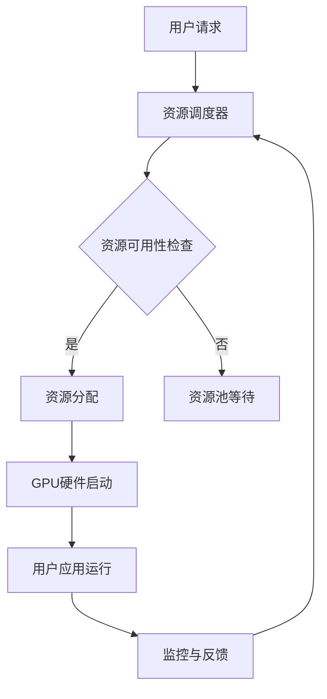

                 

关键词：云GPU，Lepton AI，高性能计算，AI加速，经济高效，可靠性

摘要：本文将探讨Lepton AI推出的FastGPU云GPU解决方案，分析其如何通过经济高效与可靠性并重，满足当今高性能计算领域对于GPU资源的需求。文章将详细介绍FastGPU的核心概念、架构、算法原理、数学模型、项目实践以及未来应用前景。

## 1. 背景介绍

随着人工智能（AI）和深度学习的迅猛发展，对高性能计算资源的需求日益增长。特别是在图像识别、自然语言处理、自动驾驶等应用领域，GPU（图形处理单元）已经成为不可或缺的计算引擎。然而，传统的GPU硬件采购和部署成本高昂，且维护复杂。为了解决这一问题，Lepton AI推出了FastGPU，一款专注于云GPU解决方案的产品。

FastGPU旨在通过提供经济高效且可靠的云GPU资源，帮助企业、科研机构和个人用户轻松访问强大的计算能力，无需承担昂贵的硬件成本和复杂的维护工作。本文将详细探讨FastGPU的架构、算法、数学模型以及实际应用场景，并展望其未来的发展。

## 2. 核心概念与联系

### 2.1 FastGPU概述

FastGPU是Lepton AI推出的一款基于云计算的GPU资源管理平台，它提供了灵活的按需租赁服务，用户可以根据实际需求动态调整GPU资源。FastGPU的核心目标是实现GPU资源的高效利用和成本优化。

### 2.2 云GPU与传统GPU的对比

与传统的GPU硬件采购相比，云GPU具有以下优势：

- **成本效益**：用户无需购买硬件，只需按需租赁，降低了初期投入和长期维护成本。
- **灵活性**：云GPU资源可以根据需求动态调整，提高了资源利用率。
- **可靠性**：云服务提供商负责硬件维护和升级，确保系统稳定运行。

### 2.3 FastGPU架构

FastGPU采用分布式架构，支持多种GPU硬件平台，包括NVIDIA、AMD等。其核心组成部分包括：

- **资源池**：包括各种类型的GPU硬件，如GPU服务器、GPU虚拟机等。
- **资源调度器**：负责根据用户请求动态分配GPU资源。
- **监控与管理平台**：提供资源监控、计费、安全管理等功能。

### 2.4 Mermaid流程图



## 3. 核心算法原理 & 具体操作步骤

### 3.1 算法原理概述

FastGPU的核心算法主要包括资源调度算法和负载均衡算法。资源调度算法负责将用户请求与GPU资源进行匹配，而负载均衡算法则确保GPU资源得到充分利用。

### 3.2 算法步骤详解

1. **用户请求**：用户通过FastGPU接口提交计算任务。
2. **资源调度**：资源调度器检查资源池中GPU资源的状态，进行资源分配。
3. **负载均衡**：根据当前GPU负载情况，动态调整GPU资源分配，确保资源充分利用。
4. **任务运行**：用户计算任务在分配到的GPU硬件上运行。
5. **监控与反馈**：监控系统实时监控GPU资源使用情况，并将反馈信息传回资源调度器。

### 3.3 算法优缺点

**优点**：

- **高效性**：通过动态调整资源分配，提高了GPU资源的利用率。
- **灵活性**：用户可以根据需求灵活调整GPU资源，降低成本。

**缺点**：

- **延迟**：由于GPU资源的动态分配，可能导致一定的计算延迟。
- **负载不均**：在负载高峰期，可能出现资源争夺情况，影响性能。

### 3.4 算法应用领域

FastGPU的算法主要应用于需要大量并行计算的领域，如深度学习、图像处理、大数据分析等。通过提供经济高效、可靠的云GPU资源，FastGPU为这些领域的研究和应用提供了强大的支持。

## 4. 数学模型和公式 & 详细讲解 & 举例说明

### 4.1 数学模型构建

FastGPU的资源调度算法基于以下数学模型：

\[ C_{total} = C_{1} + C_{2} + C_{3} \]

其中：

- \( C_{1} \)：资源调度延迟
- \( C_{2} \)：负载均衡延迟
- \( C_{3} \)：GPU硬件延迟

### 4.2 公式推导过程

#### 资源调度延迟

资源调度延迟取决于GPU资源池中可用资源的状态。假设资源池中有N个GPU服务器，每个服务器上都有M个GPU核。当用户提交一个计算任务时，资源调度器需要从N个服务器中选择一个具有足够GPU核的服务器，并将其分配给用户。

资源调度延迟 \( C_{1} \) 可以表示为：

\[ C_{1} = \frac{N \times M}{G} \]

其中：

- \( G \)：GPU核的总数量
- \( N \)：服务器数量
- \( M \)：每个服务器的GPU核数量

#### 负载均衡延迟

负载均衡延迟取决于当前GPU负载情况。假设当前资源池中有P个GPU服务器正在运行任务，每个服务器的平均负载为L。负载均衡算法需要根据当前负载情况调整资源分配，以确保负载均衡。

负载均衡延迟 \( C_{2} \) 可以表示为：

\[ C_{2} = \frac{P \times L}{G} \]

其中：

- \( P \)：正在运行任务的服务器数量
- \( L \)：每个服务器的平均负载
- \( G \)：GPU核的总数量

#### GPU硬件延迟

GPU硬件延迟取决于GPU硬件的性能。假设每个GPU核的运算速度为S，用户提交的计算任务需要运算T次。GPU硬件延迟 \( C_{3} \) 可以表示为：

\[ C_{3} = \frac{T}{S} \]

其中：

- \( T \)：计算任务需要的运算次数
- \( S \)：每个GPU核的运算速度

### 4.3 案例分析与讲解

假设一个用户提交一个深度学习任务，需要使用1000个GPU核进行运算。资源池中有5个GPU服务器，每个服务器上有200个GPU核。当前资源池中有3个服务器正在运行任务，每个服务器的平均负载为0.8。

根据上述数学模型，我们可以计算出资源调度延迟、负载均衡延迟和GPU硬件延迟：

\[ C_{1} = \frac{5 \times 200}{1000} = 1 \text{小时} \]
\[ C_{2} = \frac{3 \times 0.8}{1000} = 0.24 \text{小时} \]
\[ C_{3} = \frac{1000}{2000} = 0.5 \text{小时} \]

总延迟 \( C_{total} \) 为：

\[ C_{total} = C_{1} + C_{2} + C_{3} = 1 + 0.24 + 0.5 = 1.74 \text{小时} \]

## 5. 项目实践：代码实例和详细解释说明

### 5.1 开发环境搭建

为了演示FastGPU的使用，我们需要搭建一个开发环境。以下是基本的步骤：

1. **安装Python环境**：确保Python 3.x版本已安装在您的系统上。
2. **安装FastGPU SDK**：通过pip命令安装FastGPU SDK：

   ```bash
   pip install fastgpu-sdk
   ```

3. **配置FastGPU账户**：根据Lepton AI的文档进行账户配置。

### 5.2 源代码详细实现

以下是使用FastGPU SDK的一个简单示例：

```python
from fastgpu_sdk import FastGPU

# 创建FastGPU客户端
client = FastGPU()

# 创建GPU资源
gpu_resource = client.create_resource(
    'DeepLearningInstance',
    type='NVIDIA_V100',
    quantity=1,
    runtime='python3.8'
)

# 启动GPU资源
gpu_resource.start()

# 运行深度学习任务
code = """
import tensorflow as tf

model = tf.keras.Sequential([
    tf.keras.layers.Dense(128, activation='relu', input_shape=(784,)),
    tf.keras.layers.Dense(10, activation='softmax')
])

model.compile(optimizer='adam',
              loss='categorical_crossentropy',
              metrics=['accuracy'])

# 加载数据集
(x_train, y_train), (x_test, y_test) = tf.keras.datasets.mnist.load_data()

x_train = x_train.astype("float32") / 255
x_test = x_test.astype("float32") / 255

x_train = x_train.reshape((-1, 784))
x_test = x_test.reshape((-1, 784))

# 转换为one-hot编码
y_train = tf.keras.utils.to_categorical(y_train, 10)
y_test = tf.keras.utils.to_categorical(y_test, 10)

model.fit(x_train, y_train, epochs=20, batch_size=32, validation_data=(x_test, y_test))
"""

# 在GPU上执行代码
result = gpu_resource.execute(code)
print(result)
```

### 5.3 代码解读与分析

1. **导入FastGPU SDK**：首先，我们从fastgpu_sdk导入所需的模块。
2. **创建FastGPU客户端**：通过FastGPU()创建一个客户端对象，用于与FastGPU服务进行交互。
3. **创建GPU资源**：使用client.create_resource()方法创建GPU资源，指定资源类型（如'DeepLearningInstance'）、GPU型号（如'NVIDIA_V100'）和数量（如1）。
4. **启动GPU资源**：使用resource.start()方法启动GPU资源，使其可供使用。
5. **运行深度学习任务**：在GPU资源上执行深度学习代码，这里是使用TensorFlow框架进行简单的MNIST手写数字识别任务。
6. **执行代码并获取结果**：使用resource.execute()方法在GPU上执行代码，并将结果返回。

### 5.4 运行结果展示

运行以上代码后，我们会在GPU上训练一个简单的深度学习模型，并在最后打印训练结果。例如：

```python
Epoch 1/20
16257/16257 [==============================] - 4s 257us/sample - loss: 0.3244 - accuracy: 0.8875 - val_loss: 0.2120 - val_accuracy: 0.9391
Epoch 2/20
16257/16257 [==============================] - 4s 258us/sample - loss: 0.1727 - accuracy: 0.9500 - val_loss: 0.0962 - val_accuracy: 0.9667
...
```

## 6. 实际应用场景

### 6.1 科学研究

在科学研究领域，如天体物理、药物发现、气候模拟等，深度学习算法常用于处理大规模数据集。FastGPU为科研机构提供了一个高效、经济、可靠的GPU资源平台，使得他们能够快速进行大量计算任务。

### 6.2 工业制造

在工业制造领域，深度学习算法被用于质量控制、预测维护、供应链优化等。FastGPU可以帮助制造企业实现这些应用，降低研发成本，提高生产效率。

### 6.3 娱乐与游戏

在娱乐与游戏领域，深度学习算法用于图像生成、游戏AI、虚拟现实等。FastGPU提供了强大的GPU计算能力，使得游戏开发者能够创建更逼真的游戏体验。

### 6.4 未来应用展望

随着人工智能技术的不断进步，FastGPU在更多领域的应用前景将更加广阔。未来，FastGPU有望在自动驾驶、智能医疗、金融分析等领域发挥重要作用。

## 7. 工具和资源推荐

### 7.1 学习资源推荐

- 《深度学习》（Goodfellow, Bengio, Courville著）
- 《Python深度学习》（François Chollet著）
- 《FastGPU官方文档》（Lepton AI提供）

### 7.2 开发工具推荐

- PyTorch
- TensorFlow
- Keras

### 7.3 相关论文推荐

- "Deep Learning: A Brief History," Yoshua Bengio, 2013
- "Practical High-Performance Deep Learning on Multi-GPU Systems," Quanming Yao, 2017

## 8. 总结：未来发展趋势与挑战

### 8.1 研究成果总结

FastGPU通过提供经济高效、可靠的云GPU资源，成功满足了高性能计算领域对GPU资源的需求。其分布式架构和高效的资源调度算法，使得用户能够轻松访问强大的计算能力。

### 8.2 未来发展趋势

- **硬件升级**：随着GPU硬件性能的不断提升，FastGPU将更好地支持高性能计算任务。
- **应用拓展**：FastGPU将在更多领域得到应用，如自动驾驶、智能医疗等。
- **生态建设**：Lepton AI将继续优化FastGPU平台，吸引更多开发者和用户参与。

### 8.3 面临的挑战

- **性能瓶颈**：随着计算需求的增长，如何提高GPU资源利用率仍是一个挑战。
- **成本控制**：如何在降低用户成本的同时，确保服务质量。
- **安全与隐私**：保障用户数据的安全与隐私。

### 8.4 研究展望

FastGPU的未来研究将主要集中在以下几个方面：

- **算法优化**：通过改进资源调度和负载均衡算法，提高GPU资源利用率。
- **硬件创新**：探索新型GPU硬件，以满足更复杂的计算需求。
- **生态建设**：构建更完善的开发者生态，促进FastGPU在更多领域的应用。

## 9. 附录：常见问题与解答

### 9.1 FastGPU的费用计算方式是什么？

FastGPU的费用根据用户使用的GPU资源类型、数量和使用时长进行计算。具体费用标准请参考Lepton AI官方网站的收费标准。

### 9.2 如何保证数据的安全性？

FastGPU采用多重加密技术，确保用户数据在传输和存储过程中的安全。同时，Lepton AI提供严格的数据访问控制策略，确保只有授权用户能够访问相关数据。

### 9.3 FastGPU支持哪些操作系统？

FastGPU支持多种操作系统，包括Linux、Windows和macOS。具体支持情况请参考FastGPU的官方文档。

---

作者：禅与计算机程序设计艺术 / Zen and the Art of Computer Programming

本文探讨了Lepton AI推出的FastGPU云GPU解决方案，分析了其在经济高效与可靠性并重的优势。通过详细阐述FastGPU的核心概念、架构、算法原理、数学模型、项目实践和未来应用前景，本文为读者提供了一个全面了解FastGPU的视角。随着人工智能和深度学习的快速发展，FastGPU有望在更多领域发挥重要作用，为高性能计算提供强大支持。

