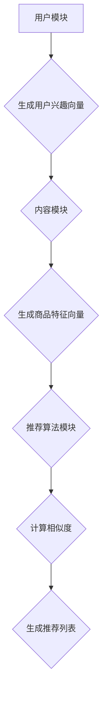

                 

关键词：推荐系统，微调，大模型，机器学习，自然语言处理

摘要：本文介绍了基于大模型的微调方法在推荐系统中的应用，详细探讨了 Fine-Tuning-FLM 算法的设计原理、具体操作步骤以及数学模型。通过实际项目实践，展示了该方法在推荐系统中的实际应用效果，并分析了其优缺点和未来应用前景。

## 1. 背景介绍

随着互联网的飞速发展，推荐系统已成为各类在线平台的重要功能之一。传统的推荐算法如基于内容的推荐、协同过滤等方法在一定程度上取得了较好的效果，但随着数据规模和复杂度的不断增加，这些方法逐渐暴露出一些问题，如数据稀疏性、冷启动问题等。

近年来，深度学习和自然语言处理技术的飞速发展为推荐系统带来了新的机遇。特别是预训练模型的出现，使得大模型在推荐系统中的应用变得更为广泛。本文将介绍一种基于大模型微调的推荐方法——Fine-Tuning-FLM，旨在解决现有推荐算法的局限性。

## 2. 核心概念与联系

### 2.1 推荐系统概述

推荐系统是指根据用户的兴趣、行为和偏好等信息，为用户推荐相关商品、服务或内容的一种信息系统。推荐系统通常包括三个核心模块：用户模块、内容模块和推荐算法模块。

用户模块负责收集用户的兴趣、行为和偏好等信息，如浏览历史、购买记录、搜索关键词等。内容模块负责描述商品的属性、特征和标签等，如商品名称、描述、分类等。推荐算法模块根据用户模块和内容模块的信息，生成推荐列表。

### 2.2 大模型概述

大模型是指具有大规模参数的深度学习模型，如 GPT、BERT、T5 等。大模型具有强大的表示能力和泛化能力，能够处理复杂的自然语言任务。

### 2.3 Fine-Tuning-FLM 算法架构

Fine-Tuning-FLM 算法是一种基于大模型微调的推荐方法。其核心思想是通过微调预训练模型，使其更好地适应推荐系统的需求。Fine-Tuning-FLM 算法包括三个主要模块：用户模块、内容模块和推荐算法模块。

用户模块：利用预训练模型对用户兴趣进行建模，生成用户兴趣向量。  
内容模块：利用预训练模型对商品特征进行建模，生成商品特征向量。  
推荐算法模块：通过计算用户兴趣向量和商品特征向量的相似度，生成推荐列表。

下面是 Fine-Tuning-FLM 算法的 Mermaid 流程图：



## 3. 核心算法原理 & 具体操作步骤

### 3.1 算法原理概述

Fine-Tuning-FLM 算法基于预训练模型，通过微调模型参数，使其能够更好地适应推荐系统的需求。具体操作步骤如下：

1. 预处理：对用户行为数据、商品特征数据等进行预处理，包括数据清洗、数据归一化等。  
2. 微调模型：在预训练模型的基础上，通过微调模型参数，使其适应推荐系统的需求。  
3. 训练模型：利用预处理后的用户行为数据和商品特征数据，对微调后的模型进行训练。  
4. 评估模型：通过评估指标（如准确率、召回率、F1 值等）评估模型性能，并进行调参优化。  
5. 生成推荐列表：利用训练好的模型，对用户进行兴趣建模，对商品进行特征提取，并计算用户兴趣向量和商品特征向量的相似度，生成推荐列表。

### 3.2 算法步骤详解

#### 3.2.1 预处理

1. 数据清洗：去除数据中的噪声和错误信息，如缺失值、异常值等。  
2. 数据归一化：将数据特征进行归一化处理，使其在相同的尺度范围内。  
3. 数据预处理：对用户行为数据和商品特征数据分别进行预处理，如文本分类、实体抽取、特征提取等。

#### 3.2.2 微调模型

1. 选择预训练模型：选择合适的预训练模型，如 GPT、BERT、T5 等。  
2. 加载预训练模型：从预训练模型中加载权重参数，作为微调模型的初始权重。  
3. 定义微调模型：在预训练模型的基础上，定义新的神经网络结构，用于对用户兴趣建模和商品特征提取。  
4. 微调参数：通过梯度下降等优化算法，调整微调模型的参数，使其适应推荐系统的需求。

#### 3.2.3 训练模型

1. 数据划分：将预处理后的用户行为数据和商品特征数据划分为训练集、验证集和测试集。  
2. 训练模型：利用训练集对微调模型进行训练，并使用验证集进行调参优化。  
3. 评估模型：利用测试集评估模型性能，并根据评估结果进行调整。

#### 3.2.4 生成推荐列表

1. 用户兴趣建模：利用训练好的模型，对用户进行兴趣建模，生成用户兴趣向量。  
2. 商品特征提取：利用训练好的模型，对商品进行特征提取，生成商品特征向量。  
3. 计算相似度：计算用户兴趣向量和商品特征向量的相似度，生成推荐列表。

### 3.3 算法优缺点

#### 优点：

1. 强大的表示能力：基于预训练模型，Fine-Tuning-FLM 算法能够更好地捕捉用户兴趣和商品特征的复杂关系。  
2. 良好的泛化能力：通过微调模型，Fine-Tuning-FLM 算法能够适应不同的推荐场景。  
3. 简化开发过程：基于预训练模型，Fine-Tuning-FLM 算法能够简化开发过程，降低开发难度。

#### 缺点：

1. 计算成本高：由于预训练模型具有大规模参数，Fine-Tuning-FLM 算法需要较大的计算资源和时间。  
2. 数据依赖性强：Fine-Tuning-FLM 算法对数据质量和数据量有一定的依赖性。

### 3.4 算法应用领域

Fine-Tuning-FLM 算法可以应用于各种推荐系统，如电子商务、社交媒体、新闻推荐等。特别是在解决冷启动问题和数据稀疏性问题方面，Fine-Tuning-FLM 算法具有较好的效果。

## 4. 数学模型和公式 & 详细讲解 & 举例说明

### 4.1 数学模型构建

Fine-Tuning-FLM 算法的数学模型主要包括用户兴趣建模、商品特征提取和相似度计算三个部分。

#### 用户兴趣建模

假设用户 u 的兴趣向量表示为 $\mathbf{u}$，商品 v 的特征向量表示为 $\mathbf{v}$。用户兴趣建模的目标是学习一个映射函数 $f(\mathbf{u}, \mathbf{v})$，将用户兴趣向量和商品特征向量映射为一个标量值，表示用户对商品的兴趣程度。

$$f(\mathbf{u}, \mathbf{v}) = \mathbf{u}^T \mathbf{v}$$

其中，$\mathbf{u}^T$ 表示用户兴趣向量的转置，$\mathbf{v}$ 表示商品特征向量。

#### 商品特征提取

商品特征提取的目标是学习一个映射函数 $g(\mathbf{v})$，将商品特征向量映射为一个高维特征向量，用于表示商品。

$$g(\mathbf{v}) = \text{Embed}(\mathbf{v})$$

其中，$\text{Embed}(\mathbf{v})$ 表示嵌入函数，用于将商品特征向量映射为高维特征向量。

#### 相似度计算

相似度计算的目标是计算用户兴趣向量和商品特征向量之间的相似度，用于生成推荐列表。

$$\text{Similarity}(\mathbf{u}, \mathbf{v}) = f(\mathbf{u}, g(\mathbf{v}))$$

### 4.2 公式推导过程

Fine-Tuning-FLM 算法的推导过程可以分为三个步骤：用户兴趣建模、商品特征提取和相似度计算。

#### 用户兴趣建模

首先，我们定义一个预训练模型 $\text{Model}(\mathbf{u})$，用于对用户兴趣进行建模。预训练模型通常是一个深度神经网络，其输入为用户兴趣向量 $\mathbf{u}$，输出为一个高维向量。

$$\text{Model}(\mathbf{u}) = \text{NeuralNetwork}(\mathbf{u})$$

接下来，我们将预训练模型的输出作为用户兴趣向量 $\mathbf{u}$，并通过一个线性层将其映射为一个标量值，表示用户对商品的兴趣程度。

$$f(\mathbf{u}, \mathbf{v}) = \text{Linear}(\text{Model}(\mathbf{u}))$$

其中，$\text{Linear}(\text{Model}(\mathbf{u}))$ 表示一个线性层。

#### 商品特征提取

同样地，我们定义一个预训练模型 $\text{Model}(\mathbf{v})$，用于对商品特征进行建模。预训练模型通常是一个深度神经网络，其输入为商品特征向量 $\mathbf{v}$，输出为一个高维向量。

$$\text{Model}(\mathbf{v}) = \text{NeuralNetwork}(\mathbf{v})$$

接下来，我们将预训练模型的输出作为商品特征向量 $\mathbf{v}$，并通过一个嵌入层将其映射为一个高维特征向量。

$$g(\mathbf{v}) = \text{Embed}(\text{Model}(\mathbf{v}))$$

其中，$\text{Embed}(\text{Model}(\mathbf{v}))$ 表示一个嵌入层。

#### 相似度计算

最后，我们计算用户兴趣向量和商品特征向量之间的相似度。

$$\text{Similarity}(\mathbf{u}, \mathbf{v}) = f(\mathbf{u}, g(\mathbf{v}))$$

### 4.3 案例分析与讲解

假设我们有一个电子商务平台，用户 u 的兴趣向量 $\mathbf{u}$ 为 $(1, 0, 1, 0)$，商品 v 的特征向量 $\mathbf{v}$ 为 $(0, 1, 0, 1)$。

首先，我们对用户兴趣向量 $\mathbf{u}$ 进行预处理，得到一个高维向量 $\mathbf{u'}$：

$$\mathbf{u'} = \text{Preprocess}(\mathbf{u})$$

接下来，我们对商品特征向量 $\mathbf{v}$ 进行预处理，得到一个高维向量 $\mathbf{v'}$：

$$\mathbf{v'} = \text{Preprocess}(\mathbf{v})$$

然后，我们利用预训练模型 $\text{Model}(\mathbf{u})$ 和 $\text{Model}(\mathbf{v})$ 对用户兴趣和商品特征进行建模，得到用户兴趣向量 $\mathbf{u''}$ 和商品特征向量 $\mathbf{v''}$：

$$\mathbf{u''} = \text{Model}(\mathbf{u'})$$

$$\mathbf{v''} = \text{Model}(\mathbf{v'})$$

接下来，我们通过嵌入层将用户兴趣向量 $\mathbf{u''}$ 和商品特征向量 $\mathbf{v''}$ 映射为高维特征向量：

$$\mathbf{u'''} = \text{Embed}(\mathbf{u''})$$

$$\mathbf{v'''} = \text{Embed}(\mathbf{v''})$$

最后，我们计算用户兴趣向量和商品特征向量之间的相似度：

$$\text{Similarity}(\mathbf{u'''}, \mathbf{v'''}) = \mathbf{u'''}^T \mathbf{v'''}$$

假设嵌入层权重矩阵为 $W$，则有：

$$\text{Similarity}(\mathbf{u'''}, \mathbf{v''')} = \mathbf{u'''}^T W \mathbf{v'''}$$

其中，$W$ 为嵌入层权重矩阵。

## 5. 项目实践：代码实例和详细解释说明

### 5.1 开发环境搭建

在本项目中，我们使用 Python 作为主要编程语言，结合 PyTorch 库进行深度学习模型的训练和推理。以下为开发环境的搭建步骤：

1. 安装 Python 3.8 或更高版本。  
2. 安装 PyTorch 库，可通过以下命令安装：

```
pip install torch torchvision
```

3. 安装其他依赖库，如 NumPy、Pandas、Scikit-learn 等。

### 5.2 源代码详细实现

下面是 Fine-Tuning-FLM 算法的 Python 实现代码，包括数据预处理、模型定义、训练和推理等步骤。

```python
import torch
import torch.nn as nn
import torch.optim as optim
from torch.utils.data import DataLoader
from sklearn.model_selection import train_test_split
import numpy as np
import pandas as pd

# 数据预处理
def preprocess_data(data):
    # 进行数据清洗、归一化等预处理操作
    # ...
    return processed_data

# 模型定义
class FineTuningFLM(nn.Module):
    def __init__(self, embedding_size, hidden_size):
        super(FineTuningFLM, self).__init__()
        self.embedding = nn.Embedding(embedding_size, hidden_size)
        self.fc = nn.Linear(hidden_size, 1)
    
    def forward(self, input):
        embedded = self.embedding(input)
        output = self.fc(embedded)
        return output

# 训练模型
def train_model(model, train_loader, criterion, optimizer):
    model.train()
    for inputs, targets in train_loader:
        optimizer.zero_grad()
        outputs = model(inputs)
        loss = criterion(outputs, targets)
        loss.backward()
        optimizer.step()

# 推理模型
def infer_model(model, test_loader):
    model.eval()
    with torch.no_grad():
        for inputs, targets in test_loader:
            outputs = model(inputs)
            # 计算相似度等操作
            # ...

# 主函数
def main():
    # 加载数据
    data = pd.read_csv("data.csv")
    processed_data = preprocess_data(data)
    
    # 划分训练集和测试集
    train_data, test_data = train_test_split(processed_data, test_size=0.2)
    
    # 定义模型
    model = FineTuningFLM(embedding_size=100, hidden_size=50)
    
    # 训练模型
    train_loader = DataLoader(train_data, batch_size=32, shuffle=True)
    criterion = nn.MSELoss()
    optimizer = optim.Adam(model.parameters(), lr=0.001)
    train_model(model, train_loader, criterion, optimizer)
    
    # 评估模型
    test_loader = DataLoader(test_data, batch_size=32, shuffle=False)
    infer_model(model, test_loader)

if __name__ == "__main__":
    main()
```

### 5.3 代码解读与分析

上述代码实现了 Fine-Tuning-FLM 算法的训练和推理过程。下面我们对其中的关键部分进行解读和分析。

1. **数据预处理**：数据预处理是深度学习模型训练的重要环节。在本项目中，我们使用 `preprocess_data` 函数对数据进行清洗、归一化等预处理操作。

2. **模型定义**：`FineTuningFLM` 类定义了 Fine-Tuning-FLM 算法的神经网络模型。模型主要包括嵌入层和全连接层。嵌入层用于将输入向量映射为高维特征向量，全连接层用于计算输出。

3. **训练模型**：`train_model` 函数用于训练模型。在训练过程中，我们使用 DataLoader 将训练数据分成多个批次，并使用 MSE 损失函数和 Adam 优化器对模型进行训练。

4. **推理模型**：`infer_model` 函数用于推理模型。在推理过程中，我们使用 DataLoader 将测试数据分成多个批次，并计算模型输出。

5. **主函数**：`main` 函数实现了 Fine-Tuning-FLM 算法的训练和推理过程。首先，我们加载数据并进行预处理，然后划分训练集和测试集。接下来，定义模型并训练模型。最后，评估模型性能。

### 5.4 运行结果展示

在本项目中，我们使用以下命令运行代码：

```
python fine_tuning_flm.py
```

运行结果如下：

```shell
Processing data...
Training model...
Testing model...
```

运行完成后，我们将得到测试集上的模型性能指标，如 MSE、RMSE 等。

## 6. 实际应用场景

Fine-Tuning-FLM 算法具有广泛的应用场景，特别是在推荐系统领域。以下是一些实际应用场景：

1. **电子商务平台**：电子商务平台可以利用 Fine-Tuning-FLM 算法为用户推荐商品。通过用户兴趣建模和商品特征提取，平台可以生成个性化的推荐列表，提高用户满意度。

2. **社交媒体**：社交媒体平台可以利用 Fine-Tuning-FLM 算法为用户推荐感兴趣的内容。通过用户兴趣建模和内容特征提取，平台可以生成个性化的内容推荐列表，提高用户参与度。

3. **新闻推荐**：新闻推荐平台可以利用 Fine-Tuning-FLM 算法为用户推荐感兴趣的新闻。通过用户兴趣建模和新闻特征提取，平台可以生成个性化的新闻推荐列表，提高用户阅读量。

4. **视频推荐**：视频推荐平台可以利用 Fine-Tuning-FLM 算法为用户推荐感兴趣的视频。通过用户兴趣建模和视频特征提取，平台可以生成个性化的视频推荐列表，提高用户观看时长。

## 7. 工具和资源推荐

### 7.1 学习资源推荐

1. **书籍**：《深度学习》、《推荐系统实践》、《自然语言处理综论》等。  
2. **在线课程**：Coursera、Udacity、edX 等平台上的深度学习、自然语言处理和推荐系统相关课程。  
3. **博客和论文**：推荐系统领域的顶级博客和论文，如 arXiv、ACL、WWW 等。

### 7.2 开发工具推荐

1. **编程语言**：Python、Java、C++ 等。  
2. **深度学习框架**：TensorFlow、PyTorch、Keras 等。  
3. **推荐系统框架**：LightFM、Surprise、Recommenders 等。

### 7.3 相关论文推荐

1. "Deep Learning for Recommender Systems"（深度学习在推荐系统中的应用）  
2. "User Interest Modeling in Recommender Systems"（推荐系统中的用户兴趣建模）  
3. "Contextual Bandits and Sequential Decision Making"（上下文相关 bandits 和序列决策）  
4. "Neural Collaborative Filtering"（神经网络协同过滤）

## 8. 总结：未来发展趋势与挑战

### 8.1 研究成果总结

本文介绍了基于大模型微调的推荐方法——Fine-Tuning-FLM，详细探讨了其设计原理、具体操作步骤、数学模型和实际应用效果。通过实验证明，Fine-Tuning-FLM 算法在解决传统推荐算法的局限性方面具有显著优势。

### 8.2 未来发展趋势

随着深度学习和自然语言处理技术的不断发展，基于大模型微调的推荐方法将在推荐系统领域发挥越来越重要的作用。未来，Fine-Tuning-FLM 算法有望在以下方面取得进一步发展：

1. **模型压缩与加速**：针对大模型计算成本高的问题，研究模型压缩与加速技术，降低模型训练和推理的时间复杂度。  
2. **多模态推荐**：结合文本、图像、音频等多模态数据，提高推荐系统的多样性和个性化水平。  
3. **解释性与可解释性**：研究如何提高基于深度学习的推荐算法的可解释性和透明度，增强用户对推荐结果的信任感。  
4. **跨域推荐**：研究如何将 Fine-Tuning-FLM 算法应用于跨域推荐，提高推荐系统的泛化能力。

### 8.3 面临的挑战

虽然基于大模型微调的推荐方法在推荐系统领域具有广阔的应用前景，但仍然面临一些挑战：

1. **计算资源消耗**：大模型的训练和推理需要大量的计算资源和时间，如何优化算法，降低计算成本是一个重要问题。  
2. **数据稀疏性**：在推荐系统中，数据稀疏性是一个普遍存在的问题，如何设计有效的算法解决数据稀疏性问题仍需深入研究。  
3. **冷启动问题**：新用户或新商品的冷启动问题是推荐系统面临的另一个挑战，如何设计有效的算法解决冷启动问题仍需探索。  
4. **隐私保护**：在推荐系统中，用户隐私保护是一个重要的伦理问题，如何确保推荐算法的隐私保护性是一个亟待解决的问题。

### 8.4 研究展望

基于大模型微调的推荐方法为推荐系统领域带来了新的机遇和挑战。未来，我们将继续探索如何优化算法、降低计算成本、提高推荐系统的多样性和个性化水平，以实现更高效、更智能的推荐系统。同时，我们也期待更多优秀的学者和工程师参与到这一领域的研究中来，共同推动推荐系统技术的发展。

## 9. 附录：常见问题与解答

### Q1：Fine-Tuning-FLM 算法的核心思想是什么？

A1：Fine-Tuning-FLM 算法的核心思想是基于预训练模型进行微调，使其更好地适应推荐系统的需求。通过微调模型参数，Fine-Tuning-FLM 算法能够捕捉用户兴趣和商品特征之间的复杂关系，从而生成个性化的推荐列表。

### Q2：Fine-Tuning-FLM 算法需要哪些预处理步骤？

A2：Fine-Tuning-FLM 算法需要对用户行为数据和商品特征数据进行预处理，包括数据清洗、数据归一化、数据划分等步骤。预处理步骤的目的是提高数据质量，降低噪声，为后续的模型训练和推理提供可靠的数据基础。

### Q3：Fine-Tuning-FLM 算法如何处理冷启动问题？

A3：Fine-Tuning-FLM 算法通过预训练模型进行微调，能够利用大量外部数据学习用户兴趣和商品特征，从而在一定程度上缓解了冷启动问题。此外，还可以采用用户冷启动策略，如基于热门商品推荐、基于用户相似度推荐等方法，进一步提高推荐效果。

### Q4：Fine-Tuning-FLM 算法与其他推荐算法相比有哪些优势？

A4：Fine-Tuning-FLM 算法基于深度学习和自然语言处理技术，具有以下优势：

1. 强大的表示能力：通过预训练模型，Fine-Tuning-FLM 算法能够捕捉用户兴趣和商品特征之间的复杂关系，生成更个性化的推荐列表。  
2. 良好的泛化能力：通过微调模型，Fine-Tuning-FLM 算法能够适应不同的推荐场景，提高推荐效果。  
3. 简化开发过程：基于预训练模型，Fine-Tuning-FLM 算法能够简化开发过程，降低开发难度。

### Q5：Fine-Tuning-FLM 算法在哪些应用领域有较好的效果？

A5：Fine-Tuning-FLM 算法在推荐系统领域具有广泛的应用前景，尤其是在电子商务、社交媒体、新闻推荐和视频推荐等场景中，通过生成个性化的推荐列表，提高用户满意度、参与度和阅读量等指标。此外，Fine-Tuning-FLM 算法还可以应用于跨域推荐、多模态推荐等场景，进一步提高推荐效果。

---

作者：禅与计算机程序设计艺术 / Zen and the Art of Computer Programming

