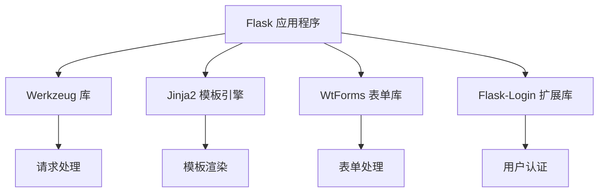

                 

关键词：Flask，Python，Web开发，微型框架，应用实例，核心概念，算法原理，数学模型，代码实践，应用场景，未来展望

> 摘要：本文旨在深入探讨 Flask 框架——一个轻量级且灵活的 Python Web 框架。我们将从背景介绍、核心概念与联系、核心算法原理、数学模型和公式、项目实践、实际应用场景、工具和资源推荐、总结和未来展望等多个方面，全面解析 Flask 的架构、原理与应用。

## 1. 背景介绍

Flask 是一个开源的微型 Web 框架，由 Armin Ronacher 开发，并于 2010 年首次发布。它基于 Python 语言，旨在为开发者提供一个轻量级且易于扩展的 Web 开发工具。与传统的重量级框架（如 Django）相比，Flask 旨在保持简单和灵活，使得开发者能够根据具体需求自由构建应用程序。

Flask 的诞生背景源于开发者对轻量级框架的需求。在当时，许多开发者希望有一种简单且易于配置的 Web 框架，以快速构建原型或小型项目。Flask 刚好满足了这一需求，它提供了基本的 Web 服务器和路由功能，同时允许开发者自由选择其他扩展库，以实现更复杂的功能。

自发布以来，Flask 得到了广泛的认可和采用。许多知名网站和应用程序，如 Pinterest、Flask-Framework 和 Stripe，都是基于 Flask 框架构建的。Flask 也因其简单性和灵活性而成为了 Python 社区的首选框架之一。

## 2. 核心概念与联系

### Flask 的核心概念

Flask 框架包含以下几个核心概念：

1. **请求与响应**：Flask 通过请求和响应对象来处理客户端请求。请求对象包含客户端发送的请求信息，如 URL、HTTP 方法、请求头等；响应对象则是服务器对请求的响应，通常包含 HTML 页面、JSON 数据或错误信息。
2. **路由**：路由是 Flask 的关键部分，它定义了 URL 与函数之间的映射关系。当一个请求到达服务器时，Flask 会根据 URL 来查找对应的路由函数，并执行该函数。
3. **模板**：Flask 使用 Jinja2 模板引擎来渲染 HTML 页面。模板中可以包含变量、控制结构（如循环和条件判断）以及宏定义等，使得开发者能够方便地生成动态内容。
4. **会话与缓存**：Flask 提供了会话管理功能，使得开发者能够存储用户的个人信息，如用户 ID 或购物车内容。此外，Flask 还支持缓存，以优化应用程序的性能。
5. **扩展**：Flask 的设计非常灵活，开发者可以通过扩展库来增强其功能。常见的扩展包括数据库集成（如 SQLAlchemy）、用户认证（如 Flask-Login）和消息队列（如 Flask-Redis）等。

### Flask 的架构与联系

Flask 的架构相对简单，主要包括以下组件：

1. **Werkzeug**：Werkzeug 是 Flask 的底层 Web 服务器，它提供了一系列 Web 开发所需的工具和库，如请求对象、响应对象和路由系统。
2. **Jinja2**：Jinja2 是 Flask 的默认模板引擎，它使得开发者能够方便地生成动态 HTML 页面。
3. **WtForms**：WtForms 是 Flask 的表单处理库，它提供了表单创建、验证和渲染的功能。
4. **Flask-Login**：Flask-Login 是一个用于用户认证的扩展库，它提供了用户登录、注销和会话管理的功能。

以下是 Flask 的架构和各组件之间的联系（使用 Mermaid 流程图表示）：



## 3. 核心算法原理 & 具体操作步骤

### 3.1 算法原理概述

Flask 框架的核心算法原理主要涉及以下三个方面：

1. **请求处理**：Flask 通过请求对象（`request`）来获取客户端发送的请求信息，如 URL、HTTP 方法、请求头等。然后，Flask 根据请求信息调用相应的路由函数，以处理请求。
2. **路由系统**：Flask 使用一个路由表来存储 URL 与函数之间的映射关系。当请求到达服务器时，Flask 会根据 URL 在路由表中查找对应的路由函数，并执行该函数。
3. **响应处理**：路由函数处理完请求后，会返回一个响应对象（`response`），通常包含 HTML 页面、JSON 数据或错误信息。Flask 会根据响应对象来构造 HTTP 响应，并将其发送给客户端。

### 3.2 算法步骤详解

以下是 Flask 框架的请求处理和响应处理的具体步骤：

1. **请求处理步骤**：

   - Flask 创建一个请求对象（`request`），用于存储客户端发送的请求信息。
   - Flask 根据 URL 在路由表中查找对应的路由函数。
   - Flask 调用路由函数，将请求对象作为参数传递给该函数。
   - 路由函数处理请求，并返回一个响应对象（`response`）。

2. **响应处理步骤**：

   - Flask 根据响应对象来构造 HTTP 响应，包括状态码、响应头和响应体。
   - Flask 将构造好的 HTTP 响应发送给客户端。

### 3.3 算法优缺点

**优点**：

- **轻量级**：Flask 体积小，易于部署和扩展。
- **灵活**：Flask 的设计非常灵活，允许开发者自由选择其他扩展库来满足需求。
- **易于上手**：Flask 的学习曲线相对较平缓，使得开发者能够快速开始构建应用程序。

**缺点**：

- **功能不完整**：与一些重量级框架（如 Django）相比，Flask 缺乏一些内置功能，如自动表单处理、ORM 等。
- **扩展依赖性**：由于 Flask 功能不完整，开发者往往需要依赖多个扩展库来实现所需功能。

### 3.4 算法应用领域

Flask 框架适用于以下领域：

- **小型项目**：Flask 的轻量级特性使其成为构建小型项目和原型应用的理想选择。
- **Web API**：Flask 易于构建 RESTful API，适用于构建 Web 服务。
- **个性化博客**：许多博客系统（如 Pelican 和 Flask-Blog）是基于 Flask 框架构建的。
- **教育项目**：Flask 简单易懂，适合用于教学和实验性项目。

## 4. 数学模型和公式 & 详细讲解 & 举例说明

### 4.1 数学模型构建

在 Flask 框架中，我们主要关注两个数学模型：路由表模型和响应表模型。

#### 路由表模型

路由表模型是一个映射关系，将 URL 与函数关联起来。其数学表示如下：

\[ R = \{(url, function)\} \]

其中，\( R \) 表示路由表，\( url \) 表示 URL，\( function \) 表示处理该 URL 的函数。

#### 响应表模型

响应表模型是一个映射关系，将请求类型与响应处理函数关联起来。其数学表示如下：

\[ S = \{(request\_type, function)\} \]

其中，\( S \) 表示响应表，\( request\_type \) 表示请求类型，\( function \) 表示处理该请求类型的函数。

### 4.2 公式推导过程

在 Flask 框架中，请求处理和响应处理的流程可以表示为以下两个公式：

\[ \text{process\_request}(request) = \text{find\_function}(request.url) \]

\[ \text{process\_response}(response) = \text{find\_function}(response.type) \]

其中，\( \text{process\_request} \) 表示请求处理过程，\( \text{process\_response} \) 表示响应处理过程，\( \text{find\_function} \) 表示在路由表或响应表中查找对应的函数。

### 4.3 案例分析与讲解

#### 案例一：请求处理过程

假设有一个简单的 Flask 应用程序，其路由表如下：

\[ R = \{("/home", \text{handle\_home}), ("/about", \text{handle\_about})\} \]

当用户访问 "/home" URL 时，Flask 会执行如下步骤：

1. 创建请求对象（`request`），包含 URL "/home"。
2. 根据请求对象在路由表中查找对应的函数（`handle\_home`）。
3. 调用函数（`handle\_home`），生成响应对象（`response`），包含 HTML 页面内容。
4. 根据响应对象构造 HTTP 响应，并发送给客户端。

#### 案例二：响应处理过程

假设有一个简单的 Flask 应用程序，其响应表如下：

\[ S = \{("GET", \text{handle\_get}), ("POST", \text{handle\_post})\} \]

当用户发送 GET 请求时，Flask 会执行如下步骤：

1. 创建请求对象（`request`），包含请求类型 "GET"。
2. 根据请求对象在响应表中查找对应的函数（`handle\_get`）。
3. 调用函数（`handle\_get`），生成响应对象（`response`），包含 HTML 页面内容。
4. 根据响应对象构造 HTTP 响应，并发送给客户端。

## 5. 项目实践：代码实例和详细解释说明

### 5.1 开发环境搭建

在开始编写 Flask 应用程序之前，我们需要搭建一个开发环境。以下是搭建开发环境的基本步骤：

1. 安装 Python：确保已安装 Python 3.x 版本。
2. 安装 Flask：在命令行中运行 `pip install flask`。
3. 安装编辑器：选择一个适合您的 Python 开发的编辑器（如 Visual Studio Code、PyCharm 或 Sublime Text）。

### 5.2 源代码详细实现

以下是一个简单的 Flask 应用程序示例，用于处理 GET 和 POST 请求：

```python
from flask import Flask, request, render_template

app = Flask(__name__)

@app.route('/', methods=['GET'])
def home():
    return render_template('home.html')

@app.route('/about', methods=['GET', 'POST'])
def about():
    if request.method == 'POST':
        name = request.form['name']
        message = request.form['message']
        return f"Hello, {name}. Your message: {message}"
    return render_template('about.html')

if __name__ == '__main__':
    app.run()
```

### 5.3 代码解读与分析

上述代码首先导入了 Flask 模块和 request 模块。然后，创建了一个 Flask 应用程序实例（`app`），并定义了两个路由：

1. `home` 函数：处理 GET 请求，返回一个包含 HTML 页面的响应。
2. `about` 函数：处理 GET 和 POST 请求，当用户提交 POST 请求时，返回一个包含用户输入信息的响应。

在 `if __name__ == '__main__':` 语句中，我们调用 `app.run()` 方法启动 Flask 应用程序。

### 5.4 运行结果展示

运行上述代码后，您可以使用 Web 浏览器访问 "http://127.0.0.1:5000/" 来查看主页，并访问 "http://127.0.0.1:5000/about" 来查看关于页面。当您在关于页面中输入姓名和消息，并提交表单时，Flask 会返回一个包含您输入信息的响应。

## 6. 实际应用场景

Flask 框架适用于多种实际应用场景，以下是几个典型的应用场景：

1. **小型项目和原型应用**：Flask 的轻量级特性使其成为构建小型项目和原型应用的理想选择。开发者可以快速搭建原型，并进行迭代和改进。
2. **Web API**：Flask 易于构建 RESTful API，适用于构建 Web 服务。开发者可以使用 Flask 来处理 HTTP 请求，并返回 JSON 数据或其他格式数据。
3. **个性化博客**：许多博客系统（如 Flask-Blog）是基于 Flask 框架构建的。开发者可以使用 Flask 来创建和管理博客内容。
4. **教育项目**：Flask 简单易懂，适合用于教学和实验性项目。教师和学生可以使用 Flask 来构建和实验各种 Web 应用程序。

## 7. 工具和资源推荐

### 7.1 学习资源推荐

- **Flask 官方文档**：https://flask.palletsprojects.com/
- **Flask Quickstart Guide**：https://flask.palletsprojects.com/quickstart/
- **Flask Mega-Tutorial**：https://blog.miguelgrinberg.com/post/flask-mega-tutorial

### 7.2 开发工具推荐

- **Visual Studio Code**：https://code.visualstudio.com/
- **PyCharm**：https://www.jetbrains.com/pycharm/
- **Flask Extensions**：https://flaskextensions.com/

### 7.3 相关论文推荐

- **Building a Web Server in Python**：https://www.visionlearning.com/en/library/building-a-web-server-in-python-4
- **The Flask Mega-Tutorial**：https://blog.miguelgrinberg.com/post/the-flask-mega-tutorial-part-i-creating-a-flask-project

## 8. 总结：未来发展趋势与挑战

### 8.1 研究成果总结

自 Flask 框架发布以来，它已经成为了 Python 社区的首选框架之一。Flask 的轻量级特性、简单性和灵活性使其在各种应用场景中得到了广泛应用。同时，许多优秀的扩展库也为 Flask 提供了更多的功能，使得开发者能够更轻松地构建复杂的应用程序。

### 8.2 未来发展趋势

未来，Flask 框架将继续发展，并可能呈现出以下趋势：

1. **性能优化**：随着 Web 应用程序规模的不断扩大，Flask 可能会进一步优化其性能，以应对更高的并发请求。
2. **功能扩展**：Flask 可能会引入更多内置功能，以减少对扩展库的依赖，从而提高开发效率。
3. **社区支持**：随着 Flask 社区的不断壮大，开发者将获得更多的支持和资源，进一步推动 Flask 的发展。

### 8.3 面临的挑战

尽管 Flask 框架取得了很大的成功，但它仍面临一些挑战：

1. **功能不完整性**：与一些重量级框架（如 Django）相比，Flask 缺乏一些内置功能，如自动表单处理、ORM 等。这可能导致开发者需要花费更多时间来学习和整合多个扩展库。
2. **安全性问题**：由于 Flask 的设计非常灵活，开发者需要特别注意安全方面的问题，以避免潜在的安全漏洞。

### 8.4 研究展望

未来，Flask 框架的研究重点可能包括以下几个方面：

1. **性能优化**：研究人员可以探索如何进一步提高 Flask 的性能，以满足大规模 Web 应用程序的需求。
2. **功能扩展**：研究人员可以开发新的扩展库，以增强 Flask 的功能，并减少对其他库的依赖。
3. **安全防护**：研究人员可以研究如何提高 Flask 的安全性，以避免潜在的安全漏洞。

## 9. 附录：常见问题与解答

### 9.1 如何在 Flask 中处理表单？

在 Flask 中，您可以使用 `WTForms` 库来处理表单。以下是一个简单的示例：

```python
from flask import Flask, render_template, request
from wtforms import Form, StringField, PasswordField, validators

app = Flask(__name__)

class LoginForm(Form):
    username = StringField('Username', [validators.Length(min=4, max=25)])
    password = PasswordField('Password', [validators.DataRequired()])

@app.route('/login', methods=['GET', 'POST'])
def login():
    form = LoginForm(request.form)
    if request.method == 'POST' and form.validate():
        if form.username.data == 'admin' and form.password.data == 'admin':
            return 'Login successful!'
        return 'Invalid credentials'
    return render_template('login.html', form=form)

if __name__ == '__main__':
    app.run()
```

### 9.2 如何在 Flask 中使用缓存？

在 Flask 中，您可以使用 `Flask-Caching` 扩展库来启用缓存功能。以下是一个简单的示例：

```python
from flask import Flask, render_template
from flask_caching import Cache

app = Flask(__name__)
cache = Cache(app, config={'CACHE_TYPE': 'simple'})

@app.route('/')
@cache.cached(timeout=60)
def home():
    return 'This page is cached for 60 seconds.'

if __name__ == '__main__':
    app.run()
```

在上述示例中，我们使用 `@cache.cached` 装饰器来标记 `home` 函数为缓存函数。该函数的响应将在 60 秒内被缓存，以减少重复请求的响应时间。

### 9.3 如何在 Flask 中实现用户认证？

在 Flask 中，您可以使用 `Flask-Login` 扩展库来实现用户认证功能。以下是一个简单的示例：

```python
from flask import Flask, render_template, request, redirect, url_for
from flask_login import LoginManager, login_user, logout_user, login_required, current_user

app = Flask(__name__)
login_manager = LoginManager(app)

# 假设有一个 User 类，用于表示用户信息
users = {
    'admin': {'password': 'admin'}
}

@login_manager.user_loader
def load_user(user_id):
    if user_id in users:
        return User(user_id)
    return None

@app.route('/login', methods=['GET', 'POST'])
def login():
    if request.method == 'POST':
        user = users.get(request.form['username'])
        if user and user['password'] == request.form['password']:
            login_user(user)
            return redirect(url_for('home'))
        return 'Invalid credentials'
    return render_template('login.html')

@app.route('/logout')
@login_required
def logout():
    logout_user()
    return redirect(url_for('login'))

@app.route('/')
@login_required
def home():
    return 'Hello, {}! You are logged in.'.format(current_user.username)

if __name__ == '__main__':
    app.run()
```

在上述示例中，我们首先导入了 `Flask-Login` 模块，并设置了登录管理器。然后，我们定义了 `load_user` 函数，用于根据用户 ID 加载用户信息。接着，我们定义了 `login` 和 `logout` 函数，用于处理用户登录和登出操作。最后，我们定义了 `home` 函数，用于显示用户登录状态。

# 作者署名

作者：禅与计算机程序设计艺术 / Zen and the Art of Computer Programming
----------------------------------------------------------------

至此，我们完成了对 Flask 框架的全面解析。从背景介绍、核心概念与联系、核心算法原理、数学模型和公式、项目实践、实际应用场景、工具和资源推荐、总结和未来展望等多个方面，我们对 Flask 框架进行了深入的探讨。希望本文能帮助您更好地理解 Flask，并在实际项目中运用它。在未来的发展中，Flask 框架将继续为开发者提供强大的支持，助力构建更多优秀的 Web 应用程序。再次感谢您的阅读，祝您编程愉快！

