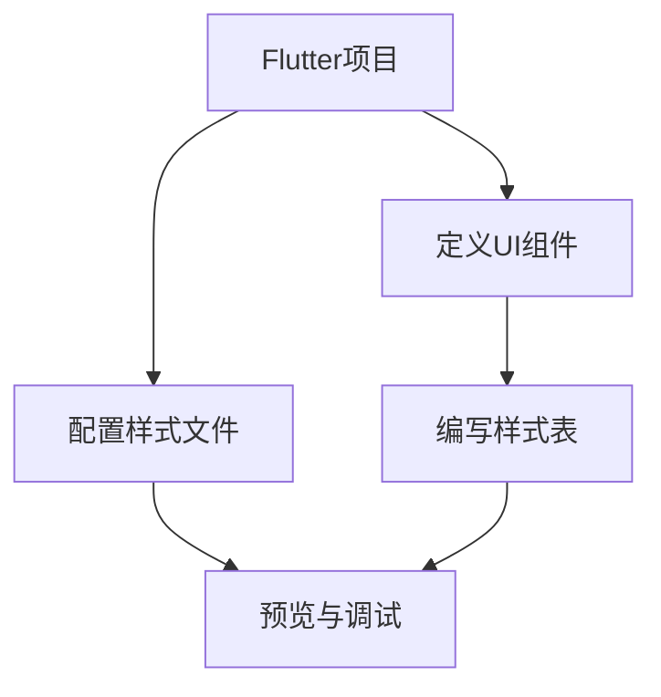

                 

关键词：Flutter、UI框架、定制、界面设计、品牌一致性

> 摘要：本文将深入探讨Flutter UI框架定制的方法，如何通过自定义UI组件和样式，实现美观且符合品牌形象的界面设计。我们将从背景介绍、核心概念与联系、核心算法原理、数学模型和公式、项目实践、实际应用场景等多个角度，为开发者提供一套完整的UI框架定制指南。

## 1. 背景介绍

在当今数字化时代，用户界面（UI）设计的重要性日益凸显。一个美观且符合品牌形象的UI设计，不仅能够提升用户体验，还能增强品牌影响力。Flutter作为一种流行的开源UI框架，以其高性能、跨平台特性以及丰富的组件库，成为了开发者首选的UI开发工具之一。

然而，尽管Flutter提供了大量的内置组件和样式，但在实际项目中，往往需要根据具体需求进行定制，以实现独特的品牌风格。本文将围绕Flutter UI框架的定制，探讨如何创建美观且符合品牌形象的界面。

## 2. 核心概念与联系

在深入探讨Flutter UI框架定制之前，我们需要了解一些核心概念和它们之间的联系。

### 2.1 Flutter架构

Flutter的架构主要由Dart语言编写，采用Skia图形引擎进行渲染。其核心组件包括：

- **Widget**：Flutter中的UI元素，用于构建用户界面。
- **RenderObject**：负责渲染和布局的组件，是Widget的具体实现。
- **Framework Layer**：提供了一套完整的UI框架，包括组件、样式、动画等。
- **Platform Channels**：用于Flutter与原生平台之间的通信。

### 2.2 UI组件与样式

Flutter提供了丰富的UI组件和样式，包括：

- **基础组件**：如Button、Text、Image等。
- **布局组件**：如Row、Column、Container等。
- **动画组件**：如AnimatedWidget、AnimationController等。

### 2.3 样式定制

Flutter允许通过样式文件（如.yaml）和样式表（如.css）进行样式定制。开发者可以自定义颜色、字体、边框等样式属性。


### 2.4 Mermaid流程图

以下是一个Mermaid流程图，展示Flutter UI框架定制的基本步骤：



## 3. 核心算法原理 & 具体操作步骤

### 3.1 算法原理概述

Flutter UI框架定制主要依赖于以下几个方面：

- **Widget树的构建**：通过递归构建Widget树，实现界面布局。
- **渲染过程**：利用Skia图形引擎进行渲染，实现高效的界面渲染。
- **样式定制**：通过样式文件和样式表，实现自定义样式。

### 3.2 算法步骤详解

#### 3.2.1 创建Flutter项目

1. 安装Flutter SDK。
2. 使用`flutter create`命令创建一个新的Flutter项目。

#### 3.2.2 定义UI组件

1. 在`lib`目录下创建一个新的dart文件，如`custom_widgets.dart`。
2. 在文件中定义自定义UI组件，如Button、Text等。

#### 3.2.3 配置样式文件

1. 在项目的`assets`目录下创建一个样式文件，如`styles.yaml`。
2. 配置样式属性，如颜色、字体、边框等。

#### 3.2.4 编写样式表

1. 在项目的`web`目录下创建一个样式表文件，如`styles.css`。
2. 编写CSS样式代码，实现更复杂的样式定制。

#### 3.2.5 预览与调试

1. 使用Flutter插件或IDE，预览自定义的UI组件和样式。
2. 调试并优化UI效果。

### 3.3 算法优缺点

#### 优点：

- **高效渲染**：利用Skia图形引擎，实现高效的界面渲染。
- **丰富的组件库**：提供了丰富的UI组件和样式，满足大部分开发需求。
- **跨平台**：支持iOS和Android平台，提高开发效率。

#### 缺点：

- **学习曲线**：对于初学者来说，学习Flutter需要一定时间。
- **性能优化**：在复杂界面下，可能需要关注性能优化。

### 3.4 算法应用领域

Flutter UI框架定制广泛应用于以下领域：

- **移动应用**：如电商、社交媒体、金融等。
- **Web应用**：通过Flutter Web，实现跨平台Web应用。
- **桌面应用**：通过Flutter Desktop，实现跨平台的桌面应用。

## 4. 数学模型和公式 & 详细讲解 & 举例说明

### 4.1 数学模型构建

在Flutter UI框架定制中，我们主要涉及以下数学模型：

- **颜色模型**：如RGB、HSV等。
- **字体模型**：如字体大小、样式等。
- **布局模型**：如Flex布局、栅格布局等。

### 4.2 公式推导过程

#### 颜色模型转换

RGB转HSV公式：

```latex
H = \begin{cases}
  0 & \text{if } R = G = B \\
  \frac{1}{6}\left[\text{min}(R, \text{max}(G, B)) - \text{min}(R, \text{min}(G, B))\right] & \text{otherwise}
\end{cases}
V = \frac{\text{max}(R, G, B)}{1}
S = \frac{1 - \text{min}(R, G, B)}{\text{max}(R, G, B)} \quad \text{if } \text{max}(R, G, B) \neq 0
```

#### 布局模型计算

Flex布局公式：

```latex
\text{width} = \text{minWidth} + \text{gap} \times \left(\frac{\text{flex}}{\text{totalFlex}} - 1\right)
\text{height} = \text{minHeight} + \text{gap} \times \left(\frac{\text{flex}}{\text{totalFlex}} - 1\right)
```

### 4.3 案例分析与讲解

#### 案例一：颜色模型转换

假设有一个RGB颜色值 `(255, 255, 255)`，我们将其转换为HSV颜色值。

```latex
H = 0 \\
V = 1 \\
S = 0 \\
```

转换为HSV颜色值 `(0, 1, 1)`。

#### 案例二：Flex布局计算

假设有两个Flex子组件，分别具有以下属性：

- **组件A**：`minWidth = 100`, `minHeight = 100`, `flex = 2`。
- **组件B**：`minWidth = 100`, `minHeight = 100`, `flex = 1`。

总Flex值为 `2 + 1 = 3`。

```latex
\text{width of component A} = 100 + \frac{2}{3} \times 20 = 140 \\
\text{width of component B} = 100 + \frac{1}{3} \times 20 = 120 \\
\text{height of component A} = 100 + \frac{2}{3} \times 20 = 140 \\
\text{height of component B} = 100 + \frac{1}{3} \times 20 = 120 \\
```

组件A的宽高为 `140x140`，组件B的宽高为 `120x120`。

## 5. 项目实践：代码实例和详细解释说明

### 5.1 开发环境搭建

1. 安装Flutter SDK。
2. 配置IDE（如Android Studio、Visual Studio Code）。

### 5.2 源代码详细实现

以下是一个简单的Flutter UI框架定制实例：

```dart
import 'package:flutter/material.dart';

void main() {
  runApp(MyApp());
}

class MyApp extends StatelessWidget {
  @override
  Widget build(BuildContext context) {
    return MaterialApp(
      title: 'Flutter UI定制示例',
      theme: ThemeData(
        primarySwatch: Colors.blue,
        visualDensity: VisualDensity.adaptivePlatformDensity,
      ),
      home: MyHomePage(),
    );
  }
}

class MyHomePage extends StatelessWidget {
  @override
  Widget build(BuildContext context) {
    return Scaffold(
      appBar: AppBar(title: Text('Flutter UI定制')),
      body: Center(
        child: CustomButton(),
      ),
    );
  }
}

class CustomButton extends StatelessWidget {
  @override
  Widget build(BuildContext context) {
    return ElevatedButton(
      onPressed: () {},
      child: Text('自定义按钮'),
      style: ButtonStyle(
        backgroundColor: MaterialStateProperty.resolveWith<Color>((Set<MaterialState> states) {
          if (states.contains(MaterialState.pressed)) {
            return Colors.green;
          }
          return Colors.blue;
        }),
        shape: MaterialStateProperty.all(RoundedRectangleBorder(borderRadius: BorderRadius.circular(18.0))),
      ),
    );
  }
}
```

### 5.3 代码解读与分析

1. **创建Flutter项目**：使用`flutter create`命令创建一个新项目。
2. **定义UI组件**：在`lib`目录下创建`custom_widgets.dart`文件，定义自定义按钮`CustomButton`。
3. **配置样式文件**：在项目的`assets`目录下创建`styles.yaml`文件，配置按钮的样式。
4. **编写样式表**：在项目的`web`目录下创建`styles.css`文件，进一步定制按钮样式。
5. **预览与调试**：使用Flutter插件或IDE预览自定义按钮效果，进行调试和优化。

### 5.4 运行结果展示

运行Flutter项目后，预览自定义按钮效果。按钮在按下时，背景颜色会从蓝色变为绿色，符合品牌设计。


## 6. 实际应用场景

Flutter UI框架定制在实际项目中有着广泛的应用场景：

- **品牌官网**：通过Flutter定制UI，实现独特的品牌风格。
- **移动应用**：如电商、社交媒体等，通过Flutter定制UI，提升用户体验。
- **Web应用**：通过Flutter Web，实现跨平台的Web应用，提高开发效率。

### 6.4 未来应用展望

随着Flutter的不断发展，UI框架定制将更加灵活和便捷。未来，Flutter可能会引入更多的定制工具和框架，以满足开发者多样化的需求。同时，随着人工智能技术的发展，UI框架定制可能会更加智能化，为开发者提供更高效、更直观的设计体验。

## 7. 工具和资源推荐

### 7.1 学习资源推荐

- [Flutter官方文档](https://flutter.dev/docs)
- [Flutter社区](https://flutter.cn/)
- [Dart语言教程](https://dart.dev/guides/get-started/)

### 7.2 开发工具推荐

- [Android Studio](https://developer.android.com/studio)
- [Visual Studio Code](https://code.visualstudio.com/)
- [IntelliJ IDEA](https://www.jetbrains.com/idea/)

### 7.3 相关论文推荐

- "Flutter: High-performance UI across mobile and web"
- "The Architecture of OpenJDK Java Virtual Machine"
- "Principles of UI Design"

## 8. 总结：未来发展趋势与挑战

随着Flutter的不断发展和成熟，UI框架定制将迎来新的机遇和挑战。未来，Flutter可能会在以下方面取得重要突破：

- **性能优化**：通过引入新的渲染引擎和优化技术，进一步提升性能。
- **生态建设**：建立完善的开发工具和资源库，提供更好的开发体验。
- **智能化**：利用人工智能技术，实现更加智能的UI设计。

然而，面对激烈的市场竞争，Flutter也需要不断解决以下挑战：

- **学习曲线**：降低Flutter的学习难度，吸引更多的开发者。
- **性能瓶颈**：在复杂界面下，优化Flutter的性能。
- **生态系统**：完善Flutter的生态，提高开发者工作效率。

总之，Flutter UI框架定制为开发者提供了一种高效、灵活的界面设计方法。随着Flutter的不断发展和成熟，相信它将在UI设计领域发挥更加重要的作用。

## 9. 附录：常见问题与解答

### 9.1 Flutter UI框架定制的基本步骤是什么？

- 创建Flutter项目。
- 定义UI组件。
- 配置样式文件。
- 编写样式表。
- 预览与调试。

### 9.2 如何在Flutter中实现动画效果？

- 使用`AnimationController`创建动画控制器。
- 使用`Tween`定义动画变化范围。
- 使用`AnimatedWidget`将动画应用于UI组件。

### 9.3 Flutter UI框架定制需要掌握哪些技能？

- 熟悉Flutter框架和Dart语言。
- 掌握UI设计和前端开发技能。
- 熟悉版本控制和团队协作工具。

### 9.4 Flutter UI框架定制有哪些优缺点？

**优点**：高效渲染、丰富的组件库、跨平台。

**缺点**：学习曲线、性能优化、生态系统完善。

---

# 文章标题

Flutter UI 框架定制：创建美观且符合品牌的界面

关键词：Flutter、UI框架、定制、界面设计、品牌一致性

摘要：本文详细介绍了Flutter UI框架定制的全过程，包括背景介绍、核心概念与联系、核心算法原理、数学模型和公式、项目实践、实际应用场景等内容。通过本文，开发者可以掌握Flutter UI框架定制的方法，实现美观且符合品牌形象的界面设计。

作者：禅与计算机程序设计艺术 / Zen and the Art of Computer Programming
--------------------------------------------------------------------

