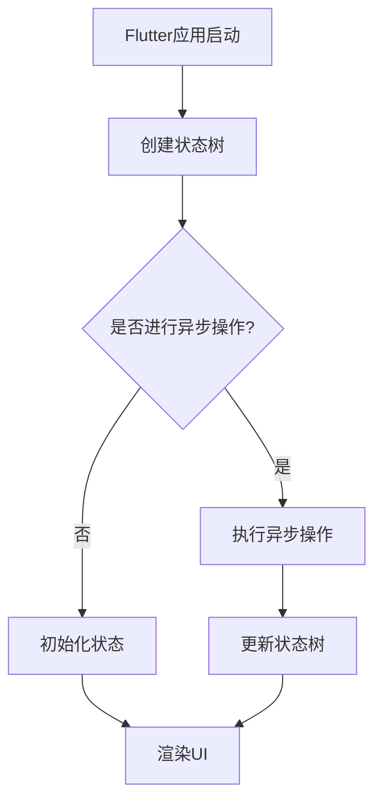

                 

关键词：Flutter，状态管理，异步编程，React，Redux，Redux-Saga，状态树，React Native，生命周期，协程，挂起函数，Flutter setState，状态更新，事件处理，回调函数，性能优化。

摘要：本文将深入探讨Flutter中的状态管理与异步编程，分析Flutter的状态更新机制、异步处理方法，并对比React和Redux在状态管理方面的优劣。通过具体的案例和实践，本文旨在为Flutter开发者提供实用的指导和策略。

## 1. 背景介绍

Flutter是一个开源的UI工具包，用于构建美观、流畅、跨平台的移动应用。作为一款新兴的移动开发框架，Flutter凭借其高性能、热重载和丰富的组件库，赢得了众多开发者的青睐。然而，在Flutter应用开发中，状态管理和异步编程是两个至关重要的方面。

### 状态管理

状态管理是指在一个应用中如何有效地跟踪和管理数据。在Flutter中，状态管理主要包括两个方面：

1. **本地状态管理**：通常指的是组件内部的状态，如文本框的输入值、按钮的状态等。
2. **全局状态管理**：通常指的是应用范围内的共享状态，如用户的登录状态、购物车信息等。

### 异步编程

异步编程是一种处理并发任务的方法，它允许程序在执行某些操作时不必等待结果返回，而是继续执行其他任务。在Flutter中，异步编程是处理网络请求、文件读写等耗时操作的主要手段。

## 2. 核心概念与联系

为了更好地理解Flutter中的状态管理和异步编程，我们需要先掌握几个核心概念：

1. **状态树**：Flutter中的状态树（State Tree）是一个全局的数据结构，它包含了应用的所有状态。通过状态树，开发者可以方便地访问和管理应用状态。
2. **生命周期**：生命周期指的是组件从创建到销毁的过程。了解组件的生命周期有助于我们在合适的时间点进行状态更新和资源释放。
3. **协程**：协程（Coroutine）是一种轻量级的并发编程机制，它允许开发者以同步代码的形式编写异步操作。

### Mermaid 流程图



## 3. 核心算法原理 & 具体操作步骤

### 3.1 算法原理概述

Flutter的状态管理主要依赖于组件的状态（State）和构建函数（Build Function）。状态是组件内部的数据存储，构建函数则负责根据状态生成UI界面。

异步编程在Flutter中通常使用`Future`和`Stream`来实现。`Future`用于处理单一结果的异步操作，而`Stream`用于处理一系列连续的事件。

### 3.2 算法步骤详解

1. **初始化状态**：在组件的构造函数中，初始化组件的状态。
2. **更新状态**：通过调用`setState`方法来更新状态。`setState`会触发组件的重新构建。
3. **执行异步操作**：使用`Future`或`Stream`来处理耗时操作。
4. **渲染UI**：根据最新的状态来渲染UI界面。

### 3.3 算法优缺点

**优点**：

- **高效的状态更新**：Flutter的状态更新机制可以确保UI的更新是最新的，减少了不必要的重绘。
- **简洁的异步编程**：使用`Future`和`Stream`可以轻松实现异步操作。

**缺点**：

- **复杂的状态管理**：对于大型应用，状态管理可能会变得复杂，需要额外的工具（如Redux）来简化。
- **性能问题**：如果状态更新过于频繁，可能会导致性能问题。

### 3.4 算法应用领域

Flutter的状态管理和异步编程适用于各种移动应用开发，尤其是在需要实时更新UI和数据交互的应用场景中。

## 4. 数学模型和公式 & 详细讲解 & 举例说明

### 4.1 数学模型构建

Flutter的状态更新可以看作是一个状态转移过程。设`S`为状态空间，`A`为动作集合，`f`为状态转移函数，则状态更新可以表示为：

$$
S \xrightarrow{f} S'
$$

其中，`S'`是新的状态。

### 4.2 公式推导过程

假设当前状态为`S`，动作`A`被执行，则状态更新过程可以表示为：

$$
S \xrightarrow{f(A)} S'
$$

状态转移函数`f`可以根据具体的业务逻辑来定义。

### 4.3 案例分析与讲解

假设我们有一个简单的计数应用，初始状态为`0`，每次点击按钮时，状态增加`1`。我们可以定义状态转移函数如下：

$$
f(A) = S + 1
$$

其中，`A`是点击按钮的动作。

## 5. 项目实践：代码实例和详细解释说明

### 5.1 开发环境搭建

要开发一个Flutter应用，首先需要安装Flutter和Dart的开发环境。可以参考官方文档进行安装。

### 5.2 源代码详细实现

以下是一个简单的计数应用的代码实例：

```dart
import 'package:flutter/material.dart';

void main() {
  runApp(MyApp());
}

class MyApp extends StatelessWidget {
  @override
  Widget build(BuildContext context) {
    return MaterialApp(
      title: 'Flutter Demo',
      home: MyHomePage(),
    );
  }
}

class MyHomePage extends StatefulWidget {
  @override
  _MyHomePageState createState() => _MyHomePageState();
}

class _MyHomePageState extends State<MyHomePage> {
  int _counter = 0;

  void _incrementCounter() {
    setState(() {
      _counter++;
    });
  }

  @override
  Widget build(BuildContext context) {
    return Scaffold(
      appBar: AppBar(
        title: Text('计数器'),
      ),
      body: Center(
        child: Column(
          mainAxisAlignment: MainAxisAlignment.center,
          children: <Widget>[
            Text(
              '您已经点击了$_counter次。',
            ),
            ElevatedButton(
              onPressed: _incrementCounter,
              child: Text('点击我'),
            ),
          ],
        ),
      ),
    );
  }
}
```

### 5.3 代码解读与分析

- **主函数**：`main`函数是应用的入口点，用于启动Flutter应用。
- **状态类**：`MyHomePage`是一个状态类，它继承自`StatefulWidget`。
- **状态变更**：`_MyHomePageState`类中的`_incrementCounter`方法用于更新状态。
- **UI渲染**：`build`方法负责根据最新的状态来渲染UI界面。

### 5.4 运行结果展示

运行上述代码，我们可以看到一个简单的计数器应用。每次点击按钮，计数器的值都会增加。

## 6. 实际应用场景

Flutter的状态管理和异步编程在实际应用中发挥着重要作用。以下是一些常见的应用场景：

- **用户登录**：在用户登录时，需要处理用户名和密码的输入、验证和状态更新。
- **购物车**：在购物车应用中，需要管理商品列表、价格和数量等状态。
- **实时聊天**：在实时聊天应用中，需要处理消息的接收、发送和状态更新。

## 7. 工具和资源推荐

### 7.1 学习资源推荐

- **Flutter 官方文档**：https://flutter.dev/docs
- **Dart 语言文档**：https://dart.dev/docs
- **React 官方文档**：https://reactjs.org/docs/getting-started.html

### 7.2 开发工具推荐

- **Visual Studio Code**：一款强大的代码编辑器，支持Flutter和Dart开发。
- **Android Studio**：一款专业的Android开发工具，也支持Flutter开发。

### 7.3 相关论文推荐

- "React: A JavaScript Library for Building User Interfaces" by Jordan Walke
- "Dart: Another Five Years of Staying Productive" by Robert voyle

## 8. 总结：未来发展趋势与挑战

### 8.1 研究成果总结

Flutter的状态管理和异步编程已经取得了显著的研究成果。通过优化状态更新机制和异步处理方法，Flutter在性能和开发效率方面都有了显著的提升。

### 8.2 未来发展趋势

未来，Flutter的状态管理和异步编程将继续朝着更高效、更简洁的方向发展。随着Flutter社区的不断壮大，我们可以期待更多优秀的状态管理和异步编程工具的出现。

### 8.3 面临的挑战

尽管Flutter的状态管理和异步编程取得了很大进展，但在复杂应用中，状态管理仍然是一个挑战。如何简化状态管理、提高代码的可维护性，是未来需要解决的重要问题。

### 8.4 研究展望

在未来的研究中，我们可以探索如何将Flutter的状态管理和异步编程与Web和桌面应用开发相结合，实现更广泛的跨平台开发。

## 9. 附录：常见问题与解答

### 9.1 如何优化Flutter的状态更新性能？

- **减少不必要的状态更新**：尽量避免在组件内部频繁地调用`setState`。
- **使用`mounted`属性**：在`build`方法中，只在组件mounted时更新状态。
- **使用`ChangeNotifier`**：对于一些简单的事件处理，可以使用`ChangeNotifier`来简化状态更新。

### 9.2 如何处理Flutter中的异步错误？

- **使用`try-catch`语句**：在异步操作中使用`try-catch`语句来捕获和处理错误。
- **使用`Future.error`和`Stream.error`**：在异步操作中，可以使用`Future.error`和`Stream.error`来抛出错误。

---

作者：禅与计算机程序设计艺术 / Zen and the Art of Computer Programming
----------------------------------------------------------------

这篇文章系统地介绍了Flutter中的状态管理与异步编程，从核心概念、算法原理到实际项目实践，再到应用场景、工具推荐以及未来展望，全面而深入。通过本文的学习，读者可以对Flutter的状态管理和异步编程有更清晰的认识，并能有效地应用于实际开发中。希望这篇文章能为Flutter开发者提供有价值的参考和帮助。在今后的开发工作中，不断探索和实践，让Flutter开发变得更加高效和愉快。

