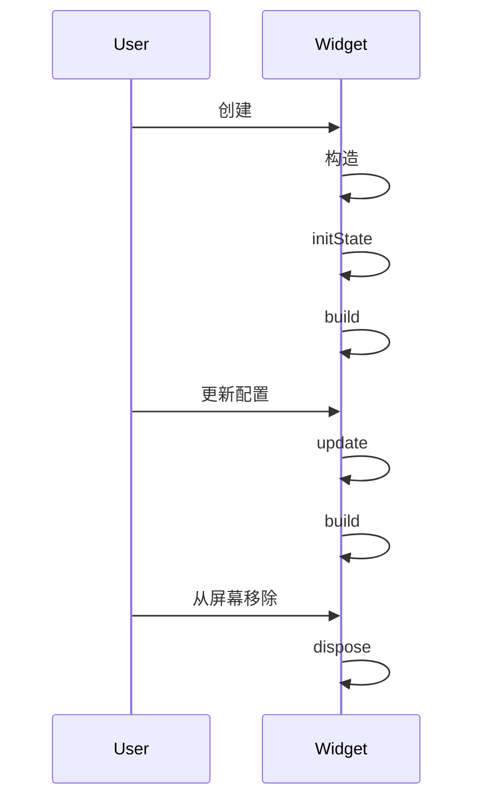

                 

关键词：Flutter, 状态管理, 异步编程, Stateful widgets, Stream, Reactivity, Flutter Data Storage, Asynchronous Operations

## 摘要

本文将深入探讨Flutter中的状态管理与异步编程。我们将从Flutter的基础概念出发，详细解释状态管理的核心概念，包括Stateful Widgets和它们的生命周期。随后，我们将重点介绍Flutter中的异步编程，探讨如何使用Future和Stream处理长时间运行的任务。此外，我们将提供一个详细的代码实例，展示如何在Flutter中实现复杂的状态管理和异步任务。最后，我们将讨论实际应用场景，并展望Flutter状态管理与异步编程的未来发展趋势与挑战。

## 1. 背景介绍

Flutter是一个由Google开发的UI框架，用于构建跨平台的移动、Web和桌面应用程序。Flutter应用程序的核心是Widget，它们是构建用户界面的基本构建块。Flutter通过一套丰富的内置Widgets，使得开发者能够以声明式的方式构建应用界面。

在Flutter中，状态管理是应用程序开发中的一个关键概念。状态管理涉及如何跟踪和更新应用程序中的数据。Flutter提供了一种称为“Reactive Programming”的方法来处理状态变化，使得界面能够快速响应数据的变化。

异步编程也是Flutter中的核心概念，尤其是在移动设备上，由于设备性能和网络延迟等原因，应用程序经常需要进行长时间的任务处理，如数据加载和网络请求。异步编程允许应用程序在等待任务完成的同时继续执行其他操作，从而提高应用程序的性能和用户体验。

## 2. 核心概念与联系

### 2.1 Stateful Widgets

在Flutter中，`StatefulWidget`是一种可以拥有状态的Widget。这种Widget可以在其生命周期内改变状态，并且会根据状态的变化重新构建其子代。

一个`StatefulWidget`包含两个主要部分：Widget本身和它的状态（State）。状态通常是私有类，用于跟踪Widget的状态变化。每当状态发生变化时，都会调用`setState`方法来更新Widget。

下面是一个简单的`StatefulWidget`示例：

```dart
class CounterWidget extends StatefulWidget {
  @override
  _CounterWidgetState createState() => _CounterWidgetState();
}

class _CounterWidgetState extends State<CounterWidget> {
  int _count = 0;

  void _increment() {
    setState(() {
      _count++;
    });
  }

  @override
  Widget build(BuildContext context) {
    return Column(
      children: [
        Text('Count: $_count'),
        ElevatedButton(
          onPressed: _increment,
          child: Text('Increment'),
        ),
      ],
    );
  }
}
```

在上述代码中，`CounterWidget`是一个`StatefulWidget`，它拥有一个私有状态类`_CounterWidgetState`。状态类中有一个`_count`属性和一个`_increment`方法。`_increment`方法通过调用`setState`来更新`_count`，并重新构建Widget。

### 2.2 StatefulWidget的生命周期

`StatefulWidget`的生命周期包括以下几个重要阶段：

- **构造函数（`构造`）：** 当Widget第一次创建时，会调用其构造函数。
- **初始化（`initState`）：** 在构造函数之后，会调用`initState`方法。这是设置初始状态的好地方。
- **构建（`build`）：** 每当状态发生变化时，`build`方法会被调用，返回一个新的Widget。
- **更新（`update`）：** 当Widget的配置发生变化时（例如，父Widget的key变化），会调用`update`方法。
- **销毁（`dispose`）：** 当Widget被从屏幕上移除时，会调用`dispose`方法。在这个阶段，应该清理任何可能占用内存的资源。

以下是`StatefulWidget`生命周期的Mermaid流程图：



### 2.3 异步编程

异步编程是Flutter中的另一个关键概念，尤其是在移动设备上。由于移动设备的性能和网络延迟，应用程序经常会遇到需要长时间运行的任务，如网络请求和数据加载。

在Flutter中，异步编程主要通过`Future`和`Stream`来实现。`Future`用于表示一个异步操作的结果，它可以是一个成功的值或是一个错误。`Stream`则是一个可以接收一系列异步事件的对象。

下面是一个使用`Future`异步加载图像的示例：

```dart
Future<ImageProvider> loadAssetImage(String path) async {
  return AssetImage(path);
}
```

在这个例子中，`loadAssetImage`函数使用`async`关键字，这意味着它返回一个`Future`。调用这个函数时，它不会阻塞当前线程，而是立即返回一个`Future`对象，该对象会在图像加载完成后异步返回结果。

`Stream`用于处理一系列的事件，例如网络请求中的数据流。下面是一个使用`Stream`来处理点击事件的示例：

```dart
StreamController<Widget> buttonStreamController = StreamController<Widget>();

void handleClick(Widget button) {
  buttonStreamController.add(button);
}

Widget build(BuildContext context) {
  return StreamBuilder<Widget>(
    stream: buttonStreamController.stream,
    builder: (context, snapshot) {
      if (snapshot.hasData) {
        return Text('Button clicked: ${snapshot.data}');
      } else {
        return Text('No button clicked yet');
      }
    },
  );
}
```

在上述代码中，`buttonStreamController`是一个`StreamController`，用于发送点击事件。`handleClick`函数将按钮添加到`Stream`中。`StreamBuilder`则用于构建UI，根据`Stream`中的数据更新UI。

### 2.4 Flutter中的Reactivity

Flutter的Reactivity使得状态变化能够迅速传播到UI中，确保界面始终保持与数据的一致性。Reactivity的核心在于`StatefulWidget`的`build`方法，每当状态发生变化时，`build`方法会被重新调用，生成一个新的Widget。

下面是一个简单的Reactivity示例：

```dart
class CounterWidget extends StatefulWidget {
  @override
  _CounterWidgetState createState() => _CounterWidgetState();
}

class _CounterWidgetState extends State<CounterWidget> {
  int _count = 0;

  void _increment() {
    setState(() {
      _count++;
    });
  }

  @override
  Widget build(BuildContext context) {
    return Column(
      children: [
        Text('Count: $_count'),
        ElevatedButton(
          onPressed: _increment,
          child: Text('Increment'),
        ),
      ],
    );
  }
}
```

在这个示例中，每当用户点击按钮时，`_increment`方法会被调用，通过`setState`更新`_count`。随后，`build`方法会被重新调用，生成一个新的`Column`，包含更新后的`_count`值。

## 3. 核心算法原理 & 具体操作步骤

### 3.1 算法原理概述

Flutter的状态管理是一种基于响应式编程（Reactive Programming）的方法，其核心在于将状态变化传递到UI中，确保UI与状态保持同步。状态管理的主要目标是确保数据的更新能够迅速且一致地反映到界面上。

异步编程在Flutter中通过`Future`和`Stream`实现。`Future`用于表示一个将来的值，它可以是一个成功的结果或是一个错误。`Stream`则用于处理一系列的事件。

### 3.2 算法步骤详解

#### 3.2.1 创建StatefulWidget

1. 定义一个`StatefulWidget`，例如`CounterWidget`。
2. 为`StatefulWidget`创建一个私有状态类，例如`_CounterWidgetState`。

```dart
class CounterWidget extends StatefulWidget {
  @override
  _CounterWidgetState createState() => _CounterWidgetState();
}
```

#### 3.2.2 初始化状态

1. 在状态类中，定义一个私有变量来存储状态。
2. 在`initState`方法中，初始化这个变量。

```dart
class _CounterWidgetState extends State<CounterWidget> {
  int _count = 0;

  @override
  void initState() {
    super.initState();
    // 初始化状态
  }
}
```

#### 3.2.3 更新状态

1. 定义一个方法来更新状态，例如`_increment`。
2. 在方法中调用`setState`方法来更新状态。

```dart
void _increment() {
  setState(() {
    _count++;
  });
}
```

#### 3.2.4 构建UI

1. 在`build`方法中，根据状态构建UI。

```dart
@override
Widget build(BuildContext context) {
  return Column(
    children: [
      Text('Count: $_count'),
      ElevatedButton(
        onPressed: _increment,
        child: Text('Increment'),
      ),
    ],
  );
}
```

#### 3.2.5 异步编程

1. 使用`Future`来处理长时间运行的任务，例如数据加载。
2. 使用`async`和`await`关键字来异步处理`Future`。

```dart
Future<void> fetchData() async {
  // 异步加载数据
  var data = await getDataFromAPI();
  // 更新UI
  setState(() {
    _data = data;
  });
}
```

#### 3.2.6 使用Stream处理事件

1. 使用`StreamController`来创建一个`Stream`。
2. 在方法中发送事件到`Stream`。

```dart
StreamController<String> _streamController = StreamController<String>();

void handleClick(String button) {
  _streamController.add(button);
}
```

3. 使用`StreamBuilder`来构建UI，根据`Stream`中的数据更新UI。

```dart
Widget build(BuildContext context) {
  return StreamBuilder<String>(
    stream: _streamController.stream,
    builder: (context, snapshot) {
      if (snapshot.hasData) {
        return Text('Button clicked: ${snapshot.data}');
      } else {
        return Text('No button clicked yet');
      }
    },
  );
}
```

### 3.3 算法优缺点

#### 3.3.1 优点

- **响应式UI：** 状态变化能够快速传递到UI中，确保UI与状态保持同步。
- **易于理解：** 基于响应式编程，状态管理和UI更新逻辑更加直观和易于理解。
- **异步处理：** 异步编程使得长时间运行的任务不会阻塞UI渲染，提高应用程序的性能。

#### 3.3.2 缺点

- **状态管理复杂：** 当应用程序的状态变得复杂时，状态管理可能会变得难以维护。
- **性能问题：** 过多的状态更新可能会导致UI渲染性能下降。

### 3.4 算法应用领域

Flutter的状态管理和异步编程适用于多种场景：

- **移动应用开发：** 移动设备通常具有较低的性能和资源限制，状态管理和异步编程能够提高应用程序的性能和用户体验。
- **网络应用开发：** 在网络应用中，异步编程可以有效地处理网络请求和数据加载。
- **复杂UI应用：** 对于具有复杂交互和动态更新的UI，状态管理和异步编程可以简化开发过程。

## 4. 数学模型和公式 & 详细讲解 & 举例说明

### 4.1 数学模型构建

在Flutter的状态管理和异步编程中，可以构建以下数学模型：

- **状态更新函数（S）：** 表示状态更新的函数，如`setState`。
- **异步操作（A）：** 表示异步操作的函数，如`fetchData`。
- **UI更新函数（U）：** 表示UI更新的函数，如`build`。

数学模型可以表示为：

\[ S(\text{state}) = U(\text{state}) \]

其中，`S`表示状态更新，`U`表示UI更新。

### 4.2 公式推导过程

#### 4.2.1 状态更新

状态更新函数`S`可以表示为：

\[ S(\text{state}) = \text{newState} \]

其中，`newState`表示新的状态值。

#### 4.2.2 UI更新

UI更新函数`U`可以表示为：

\[ U(\text{state}) = \text{UI} \]

其中，`UI`表示UI组件。

### 4.3 案例分析与讲解

#### 4.3.1 示例一：计数器

假设有一个计数器应用，初始状态为0。用户每次点击按钮时，状态增加1，UI更新显示新的计数值。

状态更新函数：

\[ S(\text{state}) = \text{state} + 1 \]

UI更新函数：

\[ U(\text{state}) = \text{Text}('Count: \text{state}') \]

状态更新和UI更新可以表示为：

\[ S(\text{state}) = U(\text{state}) \]

每次用户点击按钮时，状态更新为`state + 1`，UI更新为`Text('Count: \text{state}')`。

#### 4.3.2 示例二：异步数据加载

假设有一个应用，在加载完成后显示数据。数据加载过程可能需要几秒钟。

异步操作：

\[ A(\text{data}) = \text{await fetchData()} \]

UI更新函数：

\[ U(\text{data}) = \text{Text}('Data: \text{data}') \]

状态更新和UI更新可以表示为：

\[ S(\text{state}) = U(A(\text{state})) \]

在数据加载完成后，状态更新为新的数据，UI更新为`Text('Data: \text{data}')`。

## 5. 项目实践：代码实例和详细解释说明

### 5.1 开发环境搭建

要开始使用Flutter进行开发，首先需要在计算机上安装Flutter环境。以下是安装步骤：

1. **安装Dart语言环境：** 访问[Dart官网](https://dart.dev/get-dart)，下载并安装Dart SDK。
2. **安装Flutter：** 运行以下命令安装Flutter：

   ```bash
   flutter install
   ```

3. **设置环境变量：** 配置`PATH`环境变量以包含Flutter的bin目录。
4. **安装Flutter插件：** 使用以下命令安装必要的Flutter插件：

   ```bash
   flutter pub global activate flutter_mono_repo
   ```

### 5.2 源代码详细实现

以下是一个简单的Flutter应用程序，演示了状态管理和异步编程的基本用法。

```dart
// main.dart
import 'package:flutter/material.dart';

void main() {
  runApp(MyApp());
}

class MyApp extends StatelessWidget {
  @override
  Widget build(BuildContext context) {
    return MaterialApp(
      title: 'Flutter Demo',
      theme: ThemeData(
        primarySwatch: Colors.blue,
      ),
      home: MyHomePage(),
    );
  }
}

class MyHomePage extends StatefulWidget {
  @override
  _MyHomePageState createState() => _MyHomePageState();
}

class _MyHomePageState extends State<MyHomePage> {
  int _count = 0;
  String _data = '';

  void _incrementCounter() {
    setState(() {
      _count++;
    });
  }

  Future<void> fetchData() async {
    var data = await Future.delayed(Duration(seconds: 2), () => 'Data loaded');
    setState(() {
      _data = data;
    });
  }

  @override
  Widget build(BuildContext context) {
    return Scaffold(
      appBar: AppBar(
        title: Text('Flutter Demo'),
      ),
      body: Center(
        child: Column(
          mainAxisAlignment: MainAxisAlignment.center,
          children: [
            Text(
              'You have pushed the button this many times:',
            ),
            Text(
              '$_count',
              style: Theme.of(context).textTheme.headline4,
            ),
            ElevatedButton(
              onPressed: fetchData,
              child: Text('Fetch Data'),
            ),
            Text(
              '$_data',
            ),
          ],
        ),
      ),
      floatingActionButton: FloatingActionButton(
        onPressed: _incrementCounter,
        tooltip: 'Increment',
        child: Icon(Icons.add),
      ),
    );
  }
}
```

#### 5.3 代码解读与分析

1. **入口点（main.dart）：** Flutter应用程序的入口点是`main`函数，其中创建了一个`MyApp`实例。
2. **`MyApp`状态无部件（StatelessWidget）：** `MyApp`是一个无状态的部件，它只负责创建应用程序的主题和主界面。
3. **`MyHomePage`状态有部件（StatefulWidget）：** `MyHomePage`是一个状态有部件，它包含一个私有状态类`_MyHomePageState`。
4. **状态类（_MyHomePageState）：** 状态类中定义了两个状态变量`_count`和`_data`。
5. **状态更新方法（_incrementCounter）：** `_incrementCounter`方法通过`setState`更新`_count`。
6. **异步方法（fetchData）：** `fetchData`方法使用`Future`异步加载数据，并在加载完成后更新`_data`。

#### 5.4 运行结果展示

当应用程序运行时，用户界面将显示一个按钮和一个计数器。点击按钮时，计数器会递增，并且会显示一个文本框，用于展示异步加载的数据。

```plaintext
You have pushed the button this many times: 0
Data loaded
```

每次点击按钮，计数器的值会增加1，异步加载的数据会在2秒后显示。

## 6. 实际应用场景

### 6.1 社交应用

在社交应用中，状态管理和异步编程非常重要。例如，当用户发布动态时，应用程序需要处理上传图片、文字等数据，并且更新用户界面以显示新的动态。异步编程允许应用程序在等待数据上传的同时继续处理其他用户操作，从而提高用户体验。

### 6.2 实时通讯应用

实时通讯应用如WhatsApp或Facebook Messenger，需要处理大量并发消息，同时确保消息的实时更新。状态管理和异步编程在这里至关重要，可以确保消息的实时更新不会影响应用程序的整体性能。

### 6.3 在线购物应用

在线购物应用需要处理商品信息的实时更新、购物车的动态变化等。状态管理和异步编程可以确保用户界面始终保持与后端服务的同步，从而提高用户的购物体验。

## 7. 工具和资源推荐

### 7.1 学习资源推荐

- [Flutter官方文档](https://flutter.dev/docs)
- [Flutter学习教程](https://flutterchina.club/)
- [Dart语言官方文档](https://dart.dev/docs)

### 7.2 开发工具推荐

- **Visual Studio Code：** 一个流行的代码编辑器，拥有丰富的Flutter插件和Dart支持。
- **Android Studio：** Google提供的官方Android开发工具，支持Flutter开发。
- **IntelliJ IDEA：** 一个功能强大的IDE，提供Flutter和Dart的全面支持。

### 7.3 相关论文推荐

- "Reactive Programming for Web and Mobile Apps" by Robin Haney
- "Building Reactive User Interfaces with Flutter" by Google
- "Asynchronous Programming in Flutter" by Google

## 8. 总结：未来发展趋势与挑战

### 8.1 研究成果总结

Flutter的状态管理和异步编程已经为开发者提供了一个强大而灵活的工具集，使得跨平台应用开发变得更加高效和易于维护。通过响应式编程，开发者可以轻松地管理应用程序的状态，并确保UI与状态保持一致。异步编程则允许应用程序在处理长时间运行的任务时保持性能和响应性。

### 8.2 未来发展趋势

- **更高级的状态管理库：** 随着Flutter的发展，未来可能会出现更多高级的状态管理库，提供更丰富的功能和更简洁的API。
- **更好的性能优化：** 随着硬件性能的提升和Flutter的不断优化，状态管理和异步编程的性能有望进一步提升。
- **更广泛的跨平台支持：** Flutter可能会进一步扩展其跨平台能力，支持更多操作系统和设备。

### 8.3 面临的挑战

- **复杂状态管理的维护：** 随着应用程序复杂度的增加，状态管理的维护可能会变得困难。需要更好的工具和方法来简化状态管理。
- **异步编程的易用性：** 虽然Flutter提供了异步编程的支持，但对于新手开发者来说，理解和使用异步编程仍然是一个挑战。

### 8.4 研究展望

未来，Flutter的状态管理和异步编程将继续朝着更加高效、易用和灵活的方向发展。随着社区的不断壮大和Flutter的不断更新，开发者将能够更好地利用这些工具，构建出更加出色的跨平台应用程序。

## 9. 附录：常见问题与解答

### Q: 如何在Flutter中处理大量数据的状态管理？

A: 对于大量数据的状态管理，可以考虑使用状态管理库如`Redux`或`BLoC`，这些库提供了强大的状态管理功能，并且支持中间件来处理异步逻辑。

### Q: 异步编程在Flutter中如何处理错误？

A: 在Flutter中，可以使用`try-catch`语句来捕获异步操作中的错误。还可以使用`Future`的`catchError`方法来处理错误。

```dart
Future<void> fetchData() async {
  try {
    var data = await getDataFromAPI();
    setState(() {
      _data = data;
    });
  } catch (e) {
    // 处理错误
    print('Error fetching data: $e');
  }
}
```

### Q: 如何在Flutter中优化异步操作的性能？

A: 可以通过以下方式优化异步操作的性能：

- **避免在异步操作中使用阻塞代码：** 尽量避免在异步操作中使用`await`来等待结果，而是使用`Future`的`then`方法来继续处理流程。
- **批量更新状态：** 如果多个异步操作都需要更新状态，可以将它们组合成一个批量更新操作，以减少状态更新的次数。

## 作者署名

作者：禅与计算机程序设计艺术 / Zen and the Art of Computer Programming

