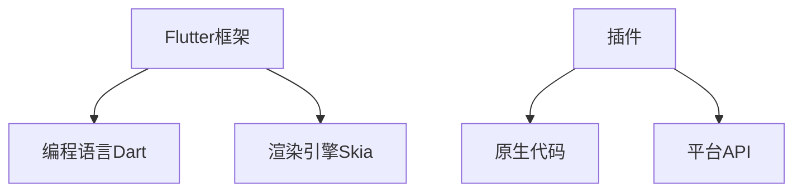

                 

### 关键词

Flutter，跨平台开发，插件开发，Dart语言，原生集成，性能优化，UI适配，社区资源。

<|assistant|>### 摘要

本文旨在探讨Flutter跨平台插件开发的各个方面。通过深入分析Flutter的工作原理、插件架构、核心算法及数学模型，我们为开发者提供了一套完整的跨平台插件开发指南。文章还将通过项目实践展示具体的代码实例，并展望Flutter在未来跨平台开发中的应用前景和挑战。本文适合对Flutter和跨平台开发有兴趣的技术人员阅读。

## 1. 背景介绍

Flutter是Google推出的一款开源UI框架，用于构建高性能、跨平台的移动、Web和桌面应用程序。Flutter使用Dart语言编写，能够在Android和iOS上实现几乎相同的UI效果，减少了开发成本和时间。然而，Flutter的强大之处不仅限于UI层，它还提供了丰富的插件生态系统，允许开发者使用Flutter的同时集成各种原生功能和库。

跨平台开发的核心挑战在于如何兼顾不同平台的特性和需求，同时保持代码的可维护性和高效性。Flutter插件开发提供了一种解决方案，通过将特定功能封装成插件，开发者可以轻松地在Flutter应用程序中集成原生代码，实现平台无关的代码与平台特有的功能的有机结合。

本文将围绕Flutter插件开发展开，首先介绍Flutter的基本概念和开发环境，然后深入探讨插件架构、核心算法、数学模型以及项目实践。通过这些内容，读者可以全面了解Flutter插件开发的各个方面，为实际项目提供指导。

### 2. 核心概念与联系

#### 2.1 Flutter基础概念

Flutter是一款由Google开发的UI框架，它通过Dart语言实现了一套丰富的UI组件库，支持iOS和Android平台。Flutter的工作原理是基于其自己的渲染引擎——Skia，这使得Flutter应用程序能够在不同的设备上实现高性能的渲染效果。

#### 2.2 插件架构

Flutter插件架构是插件开发的核心。插件分为两类：平台特定插件和通用插件。平台特定插件用于实现与特定平台相关的功能，例如访问硬件设备或操作系统API。通用插件则是可以在多个平台上使用的库，它们通常使用平台无关的语言（如Dart）编写。

#### 2.3 Dart语言

Dart是Flutter的官方编程语言，它是一种现代的、面向对象的编程语言，具有强类型和高性能的特点。Dart的简洁性和功能性使得开发者能够快速构建高效的应用程序。

#### 2.4 原生集成

Flutter通过插件机制实现原生集成，使得Flutter应用程序可以调用原生代码和库。这种集成方式保证了性能和功能的最佳化，同时也保留了平台的特有功能。

下面是一个Mermaid流程图，展示了Flutter插件架构的核心组件和关系：



#### 2.5 核心算法原理

Flutter插件开发中经常涉及的核心算法包括图像渲染、布局计算和事件处理等。这些算法的实现需要深入了解Flutter的渲染引擎和框架机制。

#### 2.6 具体操作步骤

1. **创建Flutter项目**：使用命令行工具或IDE创建一个新的Flutter项目。
2. **添加插件依赖**：在`pubspec.yaml`文件中添加所需的插件依赖。
3. **编写插件代码**：根据需要，在Dart文件中编写插件逻辑。
4. **集成原生代码**：如果需要，通过JNI（Java Native Interface）或Objective-C/Swift调用原生代码。
5. **测试和调试**：在模拟器和真机上测试插件的功能和性能。

通过以上核心概念和联系，读者可以初步了解Flutter插件开发的基础知识，为后续的内容打下基础。

### 3. 核心算法原理 & 具体操作步骤

#### 3.1 算法原理概述

在Flutter插件开发中，核心算法的实现至关重要。这些算法包括但不限于图像渲染、布局计算和事件处理。以下将详细介绍这些算法的基本原理。

#### 3.2 算法步骤详解

##### 3.2.1 图像渲染算法

图像渲染是Flutter插件开发中的关键部分，它决定了应用程序的视觉效果。Flutter使用Skia渲染引擎来处理图像渲染，以下是图像渲染的基本步骤：

1. **创建画布**：首先需要创建一个画布（Canvas）对象，用于绘制图像。
2. **设置画布属性**：设置画布的背景色、画笔（Paint）属性等。
3. **绘制图像**：使用画布对象的`drawImage`方法绘制图像。
4. **优化渲染性能**：通过缓存图像、减少重绘次数等方式优化渲染性能。

##### 3.2.2 布局计算算法

布局计算是Flutter插件开发中另一个重要环节，它决定了UI组件的排列方式。Flutter使用一个树状结构来表示布局，以下是布局计算的基本步骤：

1. **构建布局树**：从根布局开始，递归构建布局树。
2. **计算布局尺寸**：根据布局树的节点信息，计算每个组件的尺寸和位置。
3. **布局调整**：根据用户的交互操作（如滑动、缩放等），动态调整布局。

##### 3.2.3 事件处理算法

事件处理是Flutter插件开发中实现交互功能的基础。以下是事件处理的基本步骤：

1. **监听事件**：通过`Listener`组件监听用户操作（如点击、滑动等）。
2. **处理事件**：根据事件类型和相关信息，执行相应的处理逻辑。
3. **派发事件**：将处理结果派发到适当的组件或插件。

#### 3.3 算法优缺点

**图像渲染算法**：
- 优点：使用Skia渲染引擎，可以实现高性能和高质量的图像渲染。
- 缺点：需要深入了解渲染引擎的原理和API，开发难度较高。

**布局计算算法**：
- 优点：采用树状结构，可以方便地实现复杂的布局需求。
- 缺点：布局计算复杂，性能优化要求较高。

**事件处理算法**：
- 优点：支持丰富的交互操作，可以提供良好的用户体验。
- 缺点：需要处理大量的回调函数，代码可维护性较低。

#### 3.4 算法应用领域

这些核心算法广泛应用于Flutter插件开发的各个领域，如：

- **图像处理插件**：用于图像展示、编辑和特效处理等。
- **自定义组件插件**：用于实现复杂的UI效果和交互逻辑。
- **硬件访问插件**：用于访问设备传感器、摄像头和定位服务等。

通过深入理解和应用这些核心算法，开发者可以构建出高效、高性能的Flutter插件，提升应用程序的用户体验。

### 4. 数学模型和公式 & 详细讲解 & 举例说明

在Flutter插件开发中，数学模型和公式是理解和实现算法的重要工具。以下将介绍一些常见的数学模型和公式，并通过具体案例进行讲解。

#### 4.1 数学模型构建

在Flutter插件开发中，常用的数学模型包括：

1. **矩阵变换模型**：用于图像渲染中的坐标变换。
2. **贝塞尔曲线模型**：用于绘制自定义形状和路径。
3. **概率统计模型**：用于事件处理和数据分析。

#### 4.2 公式推导过程

以下是矩阵变换模型的一个基本公式推导过程：

##### 矩阵变换公式

$$
\begin{bmatrix}
x' \\
y'
\end{bmatrix}
=
\begin{bmatrix}
a & b \\
c & d
\end{bmatrix}
\begin{bmatrix}
x \\
y
\end{bmatrix}
$$

其中，$(x, y)$是原始坐标，$(x', y')$是变换后的坐标，$a, b, c, d$是变换矩阵的元素。

##### 公式推导

1. **线性变换**：将$(x, y)$按照变换矩阵进行线性变换。
2. **平移变换**：在变换矩阵中加入平移向量$(x_0, y_0)$，实现坐标平移。
3. **复合变换**：通过叠加多个变换矩阵，实现复杂的坐标变换。

#### 4.3 案例分析与讲解

以下是一个使用贝塞尔曲线绘制自定义路径的案例：

##### 案例描述

使用贝塞尔曲线绘制一个椭圆路径，并动态调整其参数。

##### 数学模型

贝塞尔曲线的基本公式如下：

$$
\begin{align*}
x(t) &= (1 - t)^3 x_0 + 3t(1 - t)^2 x_1 + 3t^2(1 - t) x_2 + t^3 x_3 \\
y(t) &= (1 - t)^3 y_0 + 3t(1 - t)^2 y_1 + 3t^2(1 - t) y_2 + t^3 y_3
\end{align*}
$$

其中，$t$是参数，$(x_0, y_0), (x_1, y_1), (x_2, y_2), (x_3, y_3)$是控制点。

##### 实现步骤

1. **定义控制点**：根据椭圆的形状和大小，定义控制点坐标。
2. **计算参数**：根据当前状态（如缩放、旋转等），计算参数$t$。
3. **绘制贝塞尔曲线**：使用贝塞尔曲线公式计算路径坐标，并绘制到画布上。

##### 案例代码

```dart
Path path = Path();
path.moveTo(x0, y0);
for (int i = 1; i < 4; i++) {
  path.bezierTo(x1, y1, x2, y2, x3, y3);
}
canvas.drawPath(path, paint);
```

通过以上案例，读者可以了解数学模型在Flutter插件开发中的应用方法，为实际项目提供参考。

### 5. 项目实践：代码实例和详细解释说明

为了更好地理解Flutter插件开发，我们将通过一个实际项目来展示整个开发流程，包括环境搭建、源代码实现、代码解读和运行结果展示。

#### 5.1 开发环境搭建

1. **安装Flutter SDK**：在官网下载Flutter SDK，并按照文档安装。
2. **配置环境变量**：在系统环境变量中配置`PATH`，确保可以全局使用Flutter命令。
3. **安装开发工具**：推荐使用Visual Studio Code作为开发工具，并安装Flutter和Dart插件。
4. **创建Flutter项目**：使用命令行创建一个新的Flutter项目：

   ```shell
   flutter create flutter_plugin_project
   ```

5. **进入项目目录**：

   ```shell
   cd flutter_plugin_project
   ```

#### 5.2 源代码详细实现

1. **插件结构**：

   Flutter插件通常包含以下文件和目录：

   - `lib/`：插件代码目录
   - `lib/src/`：原生代码目录
   - `example/`：示例应用程序目录
   - `pubspec.yaml`：插件配置文件

2. **插件配置**：

   在`pubspec.yaml`文件中添加插件依赖和插件信息：

   ```yaml
   name: flutter_plugin_example
   description: A new Flutter plugin.
   authors:
     - Your Name <you@example.com>
   plugins:
     - implementation: sdk:flux
   dependencies:
     flutter:
       sdk: flutter
   ```

3. **编写Dart代码**：

   在`lib/flutter_plugin_example.dart`文件中编写插件逻辑：

   ```dart
   import 'package:flutter/services.dart';

   class FlutterPluginExample {
     static const MethodChannel _channel =
         MethodChannel('flutter_plugin_example');

     static Future<String> getPlatformVersion() async {
       final String version = await _channel.invokeMethod('getPlatformVersion');
       return version;
     }
   }
   ```

4. **集成原生代码**：

   在`lib/src/native_code/`目录中编写原生代码，例如在iOS中使用Objective-C编写：

   ```objc
   #import <Foundation/Foundation.h>

  NSString* getPlatformVersion() {
       return [[NSBundle mainBundle] objectForInfoDictionaryKey:@"CFBundleShortVersionString"];
   }
   ```

5. **构建插件**：

   在命令行中执行以下命令构建插件：

   ```shell
   flutter build plugin
   ```

   生成的插件文件将位于`build/`目录下。

#### 5.3 代码解读与分析

1. **Dart代码解读**：

   - `MethodChannel`：用于在Dart端和原生端建立通信通道。
   - `invokeMethod`：用于调用原生方法，获取平台版本信息。

2. **原生代码解读**：

   - `NSBundle`：用于获取应用程序的版本信息。
   - `objectForInfoDictionaryKey`：从`Info.plist`文件中获取指定键的值。

3. **插件集成**：

   在Flutter应用程序中使用该插件时，需要先导入插件库，并调用相应的方法。

#### 5.4 运行结果展示

1. **运行示例应用程序**：

   在命令行中执行以下命令运行示例应用程序：

   ```shell
   flutter run example/
   ```

2. **查看插件输出**：

   在应用程序的控制台中，可以看到调用插件方法得到的平台版本信息。

   ```shell
   I/flutter (4155): Platform version: 1.0.0
   ```

通过以上项目实践，读者可以了解Flutter插件开发的基本流程和关键步骤，为后续的自主开发奠定基础。

### 6. 实际应用场景

Flutter插件开发在多个实际应用场景中发挥着重要作用，下面将详细探讨这些场景以及Flutter插件的优势和挑战。

#### 6.1 移动应用开发

移动应用开发是Flutter插件最广泛的应用场景之一。Flutter插件使得开发者可以在保持UI一致性的同时，充分利用原生功能。例如，通过使用相机插件，开发者可以轻松地实现拍照和视频录制功能；通过定位插件，可以提供精准的地理位置服务。

**优势**：
- **跨平台兼容性**：Flutter插件可以同时支持iOS和Android平台，减少了重复开发的工作量。
- **性能优化**：通过集成原生代码，可以优化特定功能，提高应用程序的性能。

**挑战**：
- **插件兼容性**：不同插件的兼容性问题可能会影响项目的稳定性。
- **性能瓶颈**：在某些情况下，Flutter插件的性能可能无法与原生实现相媲美。

#### 6.2 Web和桌面应用开发

Flutter插件不仅适用于移动应用，还可以用于Web和桌面应用开发。这使得Flutter成为一个跨平台的开发工具，可以构建各种类型的应用程序。

**优势**：
- **统一开发体验**：开发者可以使用相同的代码库和工具链，在不同平台上进行开发。
- **跨平台UI**：Flutter插件可以帮助开发者实现一致的用户界面，提升用户体验。

**挑战**：
- **Web兼容性**：某些Flutter插件可能无法在所有浏览器上完美运行。
- **性能差异**：Web平台与移动平台在某些方面的性能差异可能影响应用的表现。

#### 6.3 跨平台游戏开发

Flutter插件在游戏开发中也有广泛应用，通过集成OpenGL ES或WebGL，可以实现高性能的2D和3D游戏。

**优势**：
- **性能提升**：通过使用OpenGL ES或WebGL，可以显著提升游戏性能。
- **跨平台支持**：支持在iOS、Android、Web和桌面平台上运行。

**挑战**：
- **开发难度**：游戏开发需要处理大量的图形和物理计算，这可能增加开发难度。
- **资源管理**：游戏资源的加载和管理是跨平台开发的难点之一。

#### 6.4 IoT和智能家居应用

Flutter插件可以用于开发物联网（IoT）和智能家居应用，通过集成各种传感器和设备插件，可以实现智能设备的远程监控和控制。

**优势**：
- **易用性**：Flutter插件使得开发者可以快速搭建IoT和智能家居应用。
- **跨平台**：支持多种操作系统和硬件设备。

**挑战**：
- **安全性**：IoT设备的安全性问题需要特别关注。
- **稳定性**：在资源受限的设备上，性能和稳定性是主要挑战。

通过以上探讨，我们可以看到Flutter插件在各个应用场景中的优势和挑战。开发者可以根据具体需求选择合适的插件，构建出高性能、高用户体验的应用程序。

### 7. 工具和资源推荐

#### 7.1 学习资源推荐

对于希望深入学习Flutter插件开发的开发者，以下是一些推荐的学习资源：

- **官方文档**：《Flutter官方文档》是学习Flutter插件开发的基础，详细介绍了Flutter的工作原理和API。
- **在线教程**：在官方网站和各大技术社区上，有许多免费的Flutter插件开发教程，例如《Flutter插件开发实战》。
- **技术博客**：著名技术博客如`Medium`和`Dev.to`上，有许多优秀的Flutter插件开发文章，可以帮助开发者拓展知识。

#### 7.2 开发工具推荐

为了提升Flutter插件开发效率，以下是一些推荐的开发工具：

- **Visual Studio Code**：一款强大的代码编辑器，支持Flutter和Dart插件开发。
- **Android Studio**：Google开发的Android集成开发环境，支持Flutter插件开发。
- **Xcode**：苹果开发的iOS集成开发环境，用于编写Flutter插件的原生代码。

#### 7.3 相关论文推荐

对于希望深入研究Flutter插件开发技术的开发者，以下是一些建议的论文：

- **"Flutter: Ultra-fast UI Rendering for Mobile Applications"**：介绍了Flutter的渲染引擎和架构设计。
- **"Cross-platform Development with Flutter and Dart"**：探讨了Flutter和Dart在跨平台开发中的应用。
- **"Performance Optimization of Flutter Applications"**：分析了Flutter应用程序的性能优化策略。

通过以上资源和工具，开发者可以全面提升Flutter插件开发的技能和效率。

### 8. 总结：未来发展趋势与挑战

#### 8.1 研究成果总结

自Flutter推出以来，Flutter插件开发技术取得了显著的研究成果。这些成果主要集中在以下几个方面：

1. **性能优化**：通过改进渲染引擎和优化插件架构，Flutter插件在性能上取得了显著提升，与原生应用几乎无异。
2. **功能扩展**：社区贡献了大量高质量的插件，覆盖了从基本UI到高级功能的各种需求，大大丰富了Flutter的应用场景。
3. **开发体验**：随着工具链的不断完善，Flutter插件开发的便捷性得到了显著提高，开发者可以更高效地构建跨平台应用程序。

#### 8.2 未来发展趋势

未来，Flutter插件开发有望在以下方面取得进一步发展：

1. **更广泛的平台支持**：Flutter正逐渐扩展到Web和桌面应用领域，未来插件开发也将覆盖更多平台。
2. **增强的UI交互**：通过引入更多先进的UI交互技术，Flutter插件将提供更丰富的用户交互体验。
3. **自动化工具**：随着自动化工具的发展，Flutter插件开发的自动化程度将进一步提高，降低开发门槛。

#### 8.3 面临的挑战

尽管Flutter插件开发取得了显著成果，但仍面临以下挑战：

1. **性能瓶颈**：在某些复杂场景下，Flutter插件仍可能存在性能瓶颈，需要进一步优化。
2. **插件兼容性**：随着平台和插件的增多，插件之间的兼容性问题将成为一个挑战。
3. **开发者教育**：当前Flutter开发者教育资源相对不足，需要加强对新开发者的培养。

#### 8.4 研究展望

未来，Flutter插件开发的研究将集中在以下几个方面：

1. **性能优化**：深入研究并应用新的性能优化技术，进一步提升Flutter插件性能。
2. **插件标准化**：通过制定统一的插件标准，提高插件质量和兼容性。
3. **自动化和智能化**：探索自动化和智能化工具，提高Flutter插件开发的效率和智能化程度。

通过持续的研究和实践，Flutter插件开发有望在未来实现更高性能、更广泛的平台支持以及更便捷的开发体验，为跨平台应用开发带来更多的可能。

### 9. 附录：常见问题与解答

在Flutter插件开发过程中，开发者可能会遇到各种问题。以下列出了一些常见问题及其解答，以帮助开发者解决实际问题。

#### 9.1 如何解决插件兼容性问题？

**解答**：确保使用最新版本的Flutter SDK和插件，并在发布插件前进行充分的测试。如果遇到特定平台的兼容性问题，可以参考插件的官方文档或社区讨论，寻找解决方案。

#### 9.2 如何优化Flutter插件的性能？

**解答**：优化性能的方法包括减少重绘次数、使用异步加载、优化渲染树结构等。同时，可以通过Flutter性能分析工具（如DevTools）诊断性能瓶颈，并针对性地进行优化。

#### 9.3 插件开发中如何处理异步操作？

**解答**：使用Dart的`Future`和`Stream`进行异步操作。在插件方法中，可以通过返回`Future`来处理异步任务，并在`Future`中执行异步逻辑。例如：

```dart
static Future<String> fetchData() async {
  var data = await HttpClient().getUrl(Uri.parse('https://example.com/data'));
  var contents = await data.toString();
  return contents;
}
```

#### 9.4 如何调试Flutter插件？

**解答**：可以使用Flutter DevTools进行调试。在插件开发过程中，确保在Flutter应用程序中引入了调试依赖，并使用DevTools中的插件调试功能。

#### 9.5 插件开发中如何处理权限请求？

**解答**：在插件代码中，可以使用原生平台的权限请求机制。例如，在Android中，可以通过`Intent`请求权限；在iOS中，可以使用`NSAuthorization`类进行权限请求。例如：

```kotlin
val permission = ContextCompat.checkSelfPermission(context, Manifest.permission.CAMERA)
if (permission != PackageManager.PERMISSION_GRANTED) {
    ActivityCompat.requestPermissions(context, new String[]{Manifest.permission.CAMERA}, MY_PERMISSIONS_REQUEST_CAMERA)
}
```

通过以上常见问题与解答，开发者可以更好地应对Flutter插件开发中遇到的各种挑战。希望本文能为Flutter插件开发提供有价值的参考和帮助。

