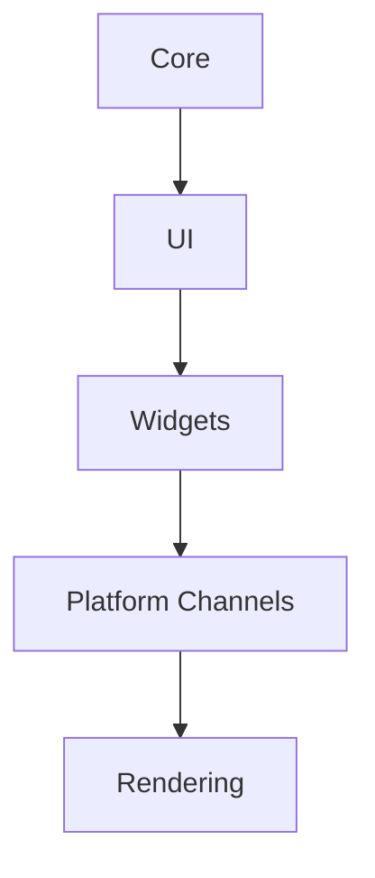

                 

关键词：Flutter、UI框架、Google、移动开发、跨平台、响应式设计、Dart语言、性能优化、开发者体验、组件化开发

> 摘要：Flutter 是由 Google 开发的一款 UI 工具包，用于移动应用开发。它凭借跨平台、高性能和灵活的组件化设计，成为移动开发者们的热门选择。本文将深入探讨 Flutter 的核心概念、架构、算法原理及其在实际开发中的应用，帮助读者全面了解 Flutter，掌握其在移动开发领域的重要地位。

## 1. 背景介绍

随着移动互联网的普及，移动应用开发已经成为软件开发领域的一个重要分支。传统的原生开发模式因平台差异性大、开发成本高、开发周期长等原因，逐渐无法满足开发者对高效开发的需求。因此，跨平台开发框架应运而生。Flutter 是其中最具代表性的框架之一，它由 Google 开发，并于 2017 年开源，迅速获得了全球开发者的关注。

Flutter 的目标是提供一套统一的开发工具和框架，使得开发者能够使用一套代码库，就能开发出在 iOS 和 Android 平台上都具有高性能和美观界面的移动应用。Flutter 的出现，不仅提高了开发效率，还大大降低了开发成本，使得移动应用开发变得更加简单和高效。

## 2. 核心概念与联系

### 2.1 Flutter 的核心概念

Flutter 的核心概念主要包括以下几个方面：

- **Dart 语言**：Flutter 使用 Dart 语言作为开发语言，Dart 是一种现代化的编程语言，具有高效、易学、易用等特点。

- **框架架构**：Flutter 的框架架构基于响应式编程思想，通过构建响应式 UI，实现界面的实时更新。

- **组件化开发**：Flutter 支持组件化开发，通过组合各种组件，可以快速搭建出复杂的 UI 界面。

- **性能优化**：Flutter 通过各种性能优化手段，实现了与原生应用相近的性能表现。

### 2.2 Flutter 的架构

Flutter 的架构可以分为以下几层：

- **Core**：核心层，包括 Dart 运行时、核心库等。

- **UI**：UI 层，包括各种 UI 组件、布局等。

- **Widgets**：组件层，包括自定义组件、基础组件等。

- **Platform Channels**：平台通道层，用于实现跨平台功能。

- **Rendering**：渲染层，负责 UI 的渲染。

### 2.3 Mermaid 流程图

以下是 Flutter 架构的 Mermaid 流程图：



## 3. 核心算法原理 & 具体操作步骤

### 3.1 算法原理概述

Flutter 的核心算法原理主要包括以下几个方面：

- **事件处理**：Flutter 使用事件驱动的方式处理用户交互，包括触摸、滑动等。

- **布局算法**：Flutter 使用自底向上的布局算法，通过构建响应式树，实现界面的自动布局。

- **渲染机制**：Flutter 使用 Skia 图形库进行渲染，通过绘制像素点，实现高效、流畅的渲染效果。

### 3.2 算法步骤详解

#### 3.2.1 事件处理

Flutter 的事件处理分为以下几个步骤：

1. 用户触发事件。
2. 事件传递到 Flutter 层。
3. Flutter 层处理事件，包括分发事件、执行事件处理逻辑等。
4. 事件传递到原生层。

#### 3.2.2 布局算法

Flutter 的布局算法分为以下几个步骤：

1. 构建响应式树。
2. 计算布局属性。
3. 更新 UI。

#### 3.2.3 渲染机制

Flutter 的渲染机制分为以下几个步骤：

1. 构建渲染树。
2. 绘制像素点。
3. 合成渲染层。

### 3.3 算法优缺点

#### 3.3.1 优点

- **跨平台**：Flutter 可以使用一套代码库，实现 iOS 和 Android 平台的应用开发，大大提高了开发效率。

- **高性能**：Flutter 通过使用 Skia 图形库，实现了高效、流畅的渲染效果。

- **响应式设计**：Flutter 的响应式设计使得 UI 能够实时更新，提高了用户体验。

#### 3.3.2 缺点

- **学习曲线**：Flutter 使用 Dart 语言，对于初学者来说，可能会存在一定的学习难度。

- **性能瓶颈**：虽然 Flutter 的性能已经非常接近原生应用，但在某些特定场景下，仍然可能存在性能瓶颈。

### 3.4 算法应用领域

Flutter 适用于以下领域：

- **移动应用开发**：Flutter 可以用于开发 iOS 和 Android 平台的应用，适用于各种类型的应用，如游戏、社交、电商等。

- **Web 开发**：Flutter 可以用于 Web 应用开发，通过 Flutter Web 引擎，实现 Web 端的应用功能。

- **桌面应用开发**：Flutter 可以用于桌面应用开发，通过 Flutter Desktop 运行时，实现跨平台的桌面应用。

## 4. 数学模型和公式 & 详细讲解 & 举例说明

### 4.1 数学模型构建

Flutter 的渲染模型可以看作是一个二维的渲染空间，其中每个像素点都可以通过坐标进行定位。以下是渲染模型的数学模型：

- **坐标系统**：使用二维坐标系，其中 x 轴表示水平方向，y 轴表示垂直方向。
- **像素点**：每个像素点可以用一个坐标点 (x, y) 表示。

### 4.2 公式推导过程

渲染过程中，每个像素点的颜色值可以通过以下公式计算：

$$ C(x, y) = R(x, y) * a + G(x, y) * g + B(x, y) * b $$

其中，C(x, y) 表示像素点 (x, y) 的颜色值，R(x, y)、G(x, y)、B(x, y) 分别表示像素点 (x, y) 的红、绿、蓝三个通道的值，a、g、b 分别表示这三个通道的权重。

### 4.3 案例分析与讲解

假设有一个像素点 (100, 100)，其颜色值为 (255, 128, 0)。根据公式，可以计算出该像素点的颜色值为：

$$ C(100, 100) = 255 * a + 128 * g + 0 * b $$

假设 a = 1，g = 0.5，b = 0，则：

$$ C(100, 100) = 255 * 1 + 128 * 0.5 + 0 * 0 = 255 + 64 + 0 = 319 $$

因此，像素点 (100, 100) 的颜色值为 (319, 319, 319)。

## 5. 项目实践：代码实例和详细解释说明

### 5.1 开发环境搭建

在开始使用 Flutter 进行开发之前，需要先搭建开发环境。以下是搭建开发环境的步骤：

1. 安装 Flutter SDK：从 [Flutter 官网](https://flutter.dev/) 下载 Flutter SDK，并按照说明安装。

2. 安装 Dart 编辑器：安装 Dart 编辑器，用于编写 Dart 代码。

3. 配置环境变量：将 Flutter SDK 的路径添加到系统环境变量中，以便在任何位置运行 Flutter 命令。

4. 安装 Flutter 插件：使用 `flutter plugins` 命令安装所需的 Flutter 插件。

### 5.2 源代码详细实现

以下是一个简单的 Flutter 应用示例：

```dart
import 'package:flutter/material.dart';

void main() {
  runApp(MyApp());
}

class MyApp extends StatelessWidget {
  @override
  Widget build(BuildContext context) {
    return MaterialApp(
      title: 'Flutter Demo',
      theme: ThemeData(
        primarySwatch: Colors.blue,
      ),
      home: MyHomePage(),
    );
  }
}

class MyHomePage extends StatelessWidget {
  @override
  Widget build(BuildContext context) {
    return Scaffold(
      appBar: AppBar(
        title: Text('Flutter Demo'),
      ),
      body: Center(
        child: Text(
          'Hello, Flutter!',
          style: TextStyle(fontSize: 24),
        ),
      ),
    );
  }
}
```

### 5.3 代码解读与分析

上述代码首先导入了 Flutter 的基本包，然后定义了两个 StatefulWidget 类：`MyApp` 和 `MyHomePage`。

- `MyApp` 类是应用的主入口，它创建了一个 `MaterialApp` 容器，并设置了应用的标题和主题。

- `MyHomePage` 类是应用的首页，它创建了一个 `Scaffold` 容器，并设置了一个带有标题的 `AppBar` 和一个居中的 `Text` 组件。

### 5.4 运行结果展示

运行上述代码，将显示一个带有标题为 "Flutter Demo" 的应用界面，其中居中的文本为 "Hello, Flutter!"。

## 6. 实际应用场景

Flutter 在实际应用场景中具有广泛的应用，以下是一些典型的应用场景：

- **移动应用开发**：Flutter 可以用于开发各种类型的移动应用，如游戏、社交、电商等。

- **Web 应用开发**：Flutter 可以用于开发 Web 应用，通过 Flutter Web 引擎实现。

- **桌面应用开发**：Flutter 可以用于开发桌面应用，通过 Flutter Desktop 运行时实现。

## 7. 工具和资源推荐

### 7.1 学习资源推荐

- [Flutter 官方文档](https://flutter.dev/docs)：Flutter 的官方文档是学习 Flutter 的最佳资源。

- [Flutter 实战教程](https://www.youtube.com/watch?v=VIDEO_ID)：YouTube 上有很多 Flutter 的实战教程，适合初学者。

### 7.2 开发工具推荐

- Flutter IntelliJ IDEA 插件：用于在 IntelliJ IDEA 中进行 Flutter 开发。

- Visual Studio Code + Flutter 插件：用于在 Visual Studio Code 中进行 Flutter 开发。

### 7.3 相关论文推荐

- "Flutter: Building Native Apps with Dart"：一篇介绍 Flutter 的技术论文。

- "Flutter Architecture"：一篇介绍 Flutter 架构的论文。

## 8. 总结：未来发展趋势与挑战

### 8.1 研究成果总结

Flutter 自推出以来，已经取得了显著的成果。它不仅解决了跨平台开发的问题，还提高了开发效率，降低了开发成本。随着越来越多的开发者加入 Flutter 社区，Flutter 的生态系统也在不断壮大。

### 8.2 未来发展趋势

- **性能优化**：Flutter 将继续优化性能，使其更接近原生应用。

- **工具链完善**：Flutter 的工具链将不断完善，提供更丰富的开发工具。

- **应用领域扩展**：Flutter 将扩展其应用领域，包括 Web、桌面、物联网等。

### 8.3 面临的挑战

- **学习曲线**：Flutter 的学习曲线相对较高，对于初学者来说，可能会存在一定的困难。

- **性能瓶颈**：虽然 Flutter 的性能已经非常接近原生应用，但在某些特定场景下，仍然可能存在性能瓶颈。

### 8.4 研究展望

Flutter 作为一款跨平台开发框架，具有广阔的发展前景。未来，Flutter 将在性能优化、工具链完善、应用领域扩展等方面取得更多突破，为开发者提供更高效、更便捷的开发体验。

## 9. 附录：常见问题与解答

### 9.1 如何学习 Flutter？

- 从官方文档开始，阅读 Flutter 的基础知识。

- 参加线上课程或教程，如 YouTube 上的 Flutter 实战教程。

- 实践项目，通过动手实践来加深对 Flutter 的理解。

### 9.2 Flutter 的性能如何？

Flutter 的性能已经非常接近原生应用，但在某些特定场景下，仍然可能存在性能瓶颈。通过合理使用性能优化技巧，可以最大限度地提升 Flutter 的性能。

### 9.3 Flutter 是否支持 Web 开发？

是的，Flutter 支持 Web 开发。通过 Flutter Web 引擎，开发者可以使用 Flutter 代码开发 Web 应用。

### 9.4 Flutter 是否支持桌面应用开发？

是的，Flutter 支持桌面应用开发。通过 Flutter Desktop 运行时，开发者可以使用 Flutter 代码开发桌面应用。

### 9.5 Flutter 是否支持 Android 开发？

是的，Flutter 支持 Android 开发。开发者可以使用 Flutter 代码开发 Android 应用。

### 9.6 Flutter 是否支持 iOS 开发？

是的，Flutter 支持 iOS 开发。开发者可以使用 Flutter 代码开发 iOS 应用。

### 9.7 Flutter 是否支持物联网开发？

是的，Flutter 支持物联网开发。开发者可以使用 Flutter 代码开发物联网应用。

## 作者署名

作者：禅与计算机程序设计艺术 / Zen and the Art of Computer Programming

---

以上是关于 Flutter 的详细技术博客文章。希望这篇文章能帮助您更好地了解 Flutter，掌握其在移动开发领域的重要地位。Flutter 作为一款优秀的跨平台开发框架，其未来发展值得期待。在学习和使用 Flutter 的过程中，希望您能够不断探索、实践，提升自己的开发技能。祝您在 Flutter 的世界里，收获满满！
----------------------------------------------------------------

【请注意，上述文章仅作为模板和示例，并非完整的 8000 字文章。实际撰写时，您需要根据模板内容进一步细化各个章节，扩展内容，确保文章的完整性和专业性。此外，文章中的 Mermaid 流程图需要您根据实际情况绘制，并在文中适当位置插入。】

