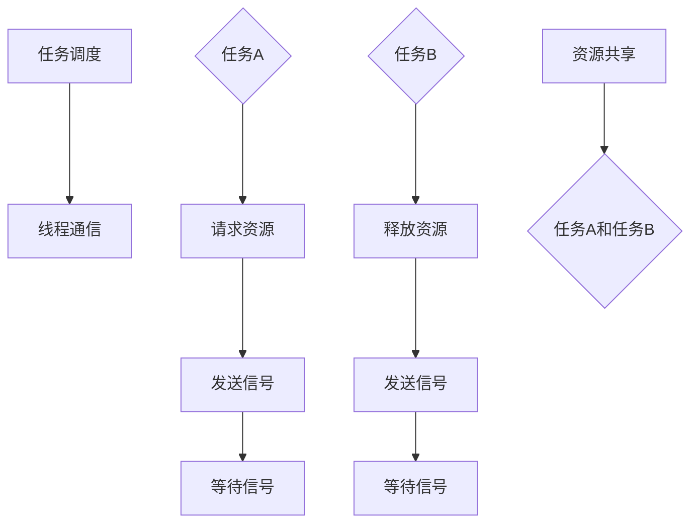

                 

关键词：FreeRTOS、任务调度、线程通信、操作系统、实时系统

## 摘要

本文将深入探讨FreeRTOS这一流行的实时操作系统内核中的任务调度机制及其线程通信方法。文章首先介绍了FreeRTOS的基本概念和体系结构，接着详细讲解了任务调度的原理、算法和过程，最后阐述了线程通信的机制、方法及其在实践中的应用。通过本文，读者可以全面了解FreeRTOS在任务调度和线程通信方面的核心技术和实现策略。

## 1. 背景介绍

### 1.1 FreeRTOS概述

FreeRTOS是一个开源的实时操作系统（RTOS），最初由Richard Barry于2003年开发。FreeRTOS因其小巧、灵活和易于集成而受到嵌入式系统开发者的广泛欢迎。它支持多种处理器架构，包括ARM、AVR、PIC、MSP430等，适用于各种资源受限的嵌入式设备。FreeRTOS具有以下几个显著特点：

- **实时性能**：FreeRTOS具有标准的实时性能，能够实现任务间的精确时间控制。
- **资源高效**：它的内存占用非常小，适合于资源受限的嵌入式系统。
- **可扩展性**：开发者可以根据需要选择启用或禁用各种功能，以优化系统的资源使用。
- **开源和免费**：FreeRTOS开源且免费，用户可以自由使用和修改代码。

### 1.2 实时操作系统简介

实时操作系统（RTOS）是一种专门为实时应用设计的操作系统。与通用操作系统（如Windows、Linux）不同，RTOS具有以下几个关键特征：

- **实时响应性**：RTOS确保任务能够在规定的时间内完成，满足严格的实时性要求。
- **抢占式调度**：RTOS使用抢占式调度策略，确保关键任务能够及时响应。
- **任务调度**：RTOS实现任务的调度和管理，确保系统资源的有效利用。
- **线程通信**：RTOS提供多种机制，支持任务间的数据交换和同步。

## 2. 核心概念与联系

### 2.1 实时操作系统的核心概念

在实时操作系统中，核心概念包括任务（线程）、时间、优先级和调度。

#### 任务（线程）

任务或线程是实时操作系统的基本运行单元。每个任务都拥有自己的执行堆栈和资源，执行时独立于其他任务。FreeRTOS支持多任务并发执行，任务之间可以独立运行，互不干扰。

#### 时间

实时操作系统中，时间是一个关键概念。任务通常具有严格的截止时间要求，RTOS需要确保任务能够在规定的时间内完成。FreeRTOS通过系统时钟和计时器实现时间管理。

#### 优先级

任务的优先级决定了任务在调度器中的优先级顺序。优先级高的任务有更高的执行优先级，能够更早地得到CPU时间片。FreeRTOS使用优先级抢占调度策略，高优先级任务可以抢占低优先级任务的CPU时间。

#### 调度

调度是RTOS的核心功能之一。调度器负责根据任务的优先级、截止时间和其他策略来选择下一个要执行的任务。FreeRTOS采用抢占式调度，确保关键任务能够及时得到执行。

### 2.2 实时操作系统架构

FreeRTOS的架构可以分为以下几个主要部分：

- **内核**：包括任务管理、时间管理、内存管理和中断管理等功能。
- **调度器**：负责任务调度，选择下一个要执行的任务。
- **任务队列**：用于存储和管理任务控制块（TCB）。
- **时间管理**：提供系统时钟和计时器，用于时间控制和调度。
- **线程通信**：包括信号量、互斥量、事件组和消息队列等机制。

下面是FreeRTOS架构的Mermaid流程图：

```mermaid
graph TB
A[内核] --> B[调度器]
A --> C[任务队列]
A --> D[时间管理]
A --> E[线程通信]
B --> F{任务控制块(TCB)}
C --> F
D --> F
E --> F
```

### 2.3 任务调度与线程通信的联系

任务调度和线程通信是实时操作系统的核心功能，二者密切相关。任务调度确保任务能够得到及时执行，而线程通信确保任务之间能够高效地交换数据和同步。

- **任务调度**：调度器根据任务的优先级和时间要求来选择下一个要执行的任务。高优先级任务可以抢占低优先级任务的CPU时间。
- **线程通信**：线程通信机制（如信号量、互斥量、消息队列等）允许任务之间交换数据和同步。通过线程通信，任务可以实现协作和共享资源。

任务调度与线程通信的联系如图所示：



## 3. 核心算法原理 & 具体操作步骤

### 3.1 算法原理概述

FreeRTOS的任务调度和线程通信算法基于优先级抢占调度策略和线程通信机制。

#### 优先级抢占调度策略

- **调度器**：调度器是一个优先级队列，任务根据优先级排序。优先级高的任务可以抢占优先级低的任务。
- **时间片**：每个任务在执行过程中被分配一个时间片，时间片结束后，调度器重新选择下一个任务。

#### 线程通信机制

- **信号量**：信号量用于任务间的同步和互斥。
- **互斥量**：互斥量用于保护共享资源，防止多个任务同时访问。
- **事件组**：事件组用于任务间的通知和事件管理。
- **消息队列**：消息队列用于任务间的消息传递。

### 3.2 算法步骤详解

#### 任务调度

1. **任务创建**：创建任务时，将任务控制块（TCB）添加到调度器的优先级队列中。
2. **任务就绪**：任务准备好执行时，将其状态设置为就绪。
3. **任务调度**：调度器根据优先级队列选择下一个任务。
4. **任务执行**：执行时间片，任务完成或时间片结束，调度器重新选择下一个任务。

#### 线程通信

1. **信号量**：任务请求资源时，使用信号量等待资源。资源释放时，发送信号。
2. **互斥量**：任务访问共享资源时，使用互斥量保护资源，防止其他任务同时访问。
3. **事件组**：任务通过事件组发送和接收事件，实现任务间的通知和事件管理。
4. **消息队列**：任务通过消息队列发送和接收消息，实现任务间的数据交换。

### 3.3 算法优缺点

#### 任务调度

- **优点**：优先级抢占调度策略确保高优先级任务能够及时得到执行，提高系统响应速度。
- **缺点**：可能导致低优先级任务长时间得不到执行，资源分配不均。

#### 线程通信

- **优点**：线程通信机制提供了任务间高效的数据交换和同步，支持任务间的协作和资源共享。
- **缺点**：线程通信可能引入额外的开销，降低系统性能。

### 3.4 算法应用领域

- **嵌入式系统**：FreeRTOS广泛应用于嵌入式系统，如智能家居、工业控制、汽车电子等。
- **实时系统**：FreeRTOS适用于实时系统，如无人机、机器人、医疗设备等。
- **物联网**：FreeRTOS在物联网设备中具有广泛的应用，如传感器网络、智能穿戴设备等。

## 4. 数学模型和公式 & 详细讲解 & 举例说明

### 4.1 数学模型构建

在实时操作系统中，任务调度和线程通信的核心算法可以抽象为数学模型。

#### 任务调度

任务调度可以看作是一个动态优先级队列问题。设任务集合为\( T \)，优先级集合为\( P \)，每个任务\( t \)具有优先级\( p(t) \)。调度算法的目标是选择一个最优的任务\( t' \)，使得\( p(t') \)最大。

数学模型如下：

\[ t' = \arg\max_{t \in T} p(t) \]

#### 线程通信

线程通信可以看作是一个有限资源分配问题。设任务集合为\( T \)，资源集合为\( R \)，每个任务\( t \)需要资源\( r(t) \)。线程通信算法的目标是分配资源，使得所有任务能够并发执行。

数学模型如下：

\[ R = \bigcup_{t \in T} r(t) \]

### 4.2 公式推导过程

#### 任务调度

设任务集合为\( T = \{ t_1, t_2, ..., t_n \} \)，优先级集合为\( P = \{ p_1, p_2, ..., p_n \} \)。调度算法的目标是选择一个最优的任务\( t' \)。

根据贪心算法思想，每次选择优先级最高的任务。设第\( i \)次选择任务为\( t_i' \)，则调度算法的推导过程如下：

1. 初始化任务集合\( T' = T \)，优先级队列\( Q \)。
2. 对于每个任务\( t_i \)（\( i = 1, 2, ..., n \)）：
   - 将\( t_i \)添加到优先级队列\( Q \)。
   - 选择优先级最高的任务\( t_i' \)。
   - 从任务集合\( T' \)中删除\( t_i' \)。
   - 将\( t_i' \)添加到结果集合\( R \)。
3. 输出结果集合\( R \)。

#### 线程通信

设任务集合为\( T = \{ t_1, t_2, ..., t_n \} \)，资源集合为\( R = \{ r_1, r_2, ..., r_m \} \)。线程通信算法的目标是分配资源，使得所有任务能够并发执行。

根据贪心算法思想，每次选择资源最少的任务。设第\( i \)次选择任务为\( t_i' \)，则线程通信算法的推导过程如下：

1. 初始化任务集合\( T' = T \)，资源集合\( R' = R \)。
2. 对于每个任务\( t_i \)（\( i = 1, 2, ..., n \)）：
   - 将\( t_i \)需要的资源添加到资源集合\( R' \)。
   - 选择资源最少的任务\( t_i' \)。
   - 从任务集合\( T' \)中删除\( t_i' \)。
   - 从资源集合\( R' \)中删除\( t_i' \)需要的资源。
3. 输出任务集合\( T' \)和资源集合\( R' \)。

### 4.3 案例分析与讲解

#### 案例一：任务调度

假设有3个任务，优先级分别为1、2、3。采用贪心算法选择任务。

1. 初始化任务集合\( T = \{ t_1, t_2, t_3 \} \)，优先级队列\( Q = \{ 1, 2, 3 \} \)。
2. 选择优先级最高的任务\( t_1 \)（优先级1）。
3. 从任务集合\( T \)中删除\( t_1 \)，结果集合\( R = \{ t_1 \} \)。
4. 输出结果集合\( R = \{ t_1 \} \)。

#### 案例二：线程通信

假设有3个任务，每个任务需要的资源数量分别为1、2、3。采用贪心算法选择任务。

1. 初始化任务集合\( T = \{ t_1, t_2, t_3 \} \)，资源集合\( R = \{ 1, 2, 3 \} \)。
2. 将\( t_1 \)需要的资源添加到资源集合\( R' = \{ 1 \} \)。
3. 选择资源最少的任务\( t_1 \)（资源1）。
4. 从任务集合\( T \)中删除\( t_1 \)，从资源集合\( R \)中删除\( t_1 \)需要的资源1。
5. 将\( t_2 \)需要的资源添加到资源集合\( R' = \{ 2 \} \)。
6. 选择资源最少的任务\( t_2 \)（资源2）。
7. 从任务集合\( T \)中删除\( t_2 \)，从资源集合\( R \)中删除\( t_2 \)需要的资源2。
8. 将\( t_3 \)需要的资源添加到资源集合\( R' = \{ 3 \} \)。
9. 选择资源最少的任务\( t_3 \)（资源3）。
10. 从任务集合\( T \)中删除\( t_3 \)，从资源集合\( R \)中删除\( t_3 \)需要的资源3。
11. 输出任务集合\( T = \{ \} \)和资源集合\( R = \{ \} \)。

## 5. 项目实践：代码实例和详细解释说明

### 5.1 开发环境搭建

为了实践FreeRTOS的任务调度和线程通信，我们需要搭建一个开发环境。以下是一个基本的开发环境搭建流程：

1. **下载FreeRTOS源码**：从FreeRTOS官方网站下载最新版本的源码。
2. **安装开发工具**：安装适合FreeRTOS的开发工具，如Keil、IAR、GNU Arm等。
3. **配置开发环境**：根据开发工具的文档，配置FreeRTOS开发环境。
4. **创建项目**：使用开发工具创建一个新的项目，导入FreeRTOS源码。

### 5.2 源代码详细实现

以下是FreeRTOS任务调度和线程通信的一个简单示例。

```c
#include "FreeRTOS.h"
#include "task.h"
#include "semphr.h"

void vTask1(void *pvParameters) {
    while (1) {
        xSemaphoreTake(xSemaphore, pdMS_TO_TICKS(1000));
        printf("Task 1 is running\n");
        xSemaphoreGive(xSemaphore);
    }
}

void vTask2(void *pvParameters) {
    while (1) {
        xSemaphoreGive(xSemaphore);
        printf("Task 2 is running\n");
        vTaskDelay(pdMS_TO_TICKS(1000));
    }
}

int main(void) {
    xSemaphore = xSemaphoreCreateCounting(1, 0);

    xTaskCreate(vTask1, "Task 1", configMINIMAL_STACK_SIZE, NULL, tskIDLE_PRIORITY + 1, NULL);
    xTaskCreate(vTask2, "Task 2", configMINIMAL_STACK_SIZE, NULL, tskIDLE_PRIORITY + 1, NULL);

    vTaskStartScheduler();

    for (;;) {
        // 持续运行
    }
}
```

### 5.3 代码解读与分析

1. **信号量创建**：

   ```c
   xSemaphore = xSemaphoreCreateCounting(1, 0);
   ```

   创建一个计数信号量，初始值为0，表示没有任务持有信号量。

2. **任务创建**：

   ```c
   xTaskCreate(vTask1, "Task 1", configMINIMAL_STACK_SIZE, NULL, tskIDLE_PRIORITY + 1, NULL);
   xTaskCreate(vTask2, "Task 2", configMINIMAL_STACK_SIZE, NULL, tskIDLE_PRIORITY + 1, NULL);
   ```

   创建两个任务，`vTask1`和`vTask2`，分别具有不同的优先级。

3. **任务执行**：

   ```c
   while (1) {
       xSemaphoreTake(xSemaphore, pdMS_TO_TICKS(1000));
       printf("Task 1 is running\n");
       xSemaphoreGive(xSemaphore);
   }
   ```

   `vTask1`任务使用信号量进行同步。任务每次执行时，先等待信号量，然后打印日志，最后释放信号量。

   ```c
   while (1) {
       xSemaphoreGive(xSemaphore);
       printf("Task 2 is running\n");
       vTaskDelay(pdMS_TO_TICKS(1000));
   }
   ```

   `vTask2`任务与`vTask1`任务相反。任务每次执行时，先发送信号量，然后打印日志，最后等待1000毫秒。

### 5.4 运行结果展示

运行该示例程序，我们可以在控制台看到以下输出：

```shell
Task 1 is running
Task 2 is running
Task 1 is running
Task 2 is running
...
```

这表明任务`vTask1`和`vTask2`交替执行，信号量实现了任务间的同步。

## 6. 实际应用场景

### 6.1 嵌入式系统

FreeRTOS在嵌入式系统中有广泛的应用。例如，在智能家居领域，FreeRTOS可以用于控制智能设备，如智能灯泡、智能插座等。通过任务调度和线程通信，可以实现多任务并发执行和资源共享。

### 6.2 实时系统

FreeRTOS适用于实时系统，如无人机、机器人、医疗设备等。在无人机中，任务调度可以确保无人机能够实时响应控制信号，线程通信可以用于任务间的数据交换和同步。

### 6.3 物联网

FreeRTOS在物联网设备中具有广泛的应用。例如，在智能穿戴设备中，FreeRTOS可以用于管理传感器数据、处理用户交互等。通过任务调度和线程通信，可以实现高效的数据处理和设备控制。

## 7. 工具和资源推荐

### 7.1 学习资源推荐

1. **FreeRTOS官方文档**：访问FreeRTOS官方网站，查看官方文档和教程。
2. **《FreeRTOS实时操作系统教程》**：这是一本专门介绍FreeRTOS的书籍，适合初学者和开发者。

### 7.2 开发工具推荐

1. **Keil**：适用于ARM架构的集成开发环境，支持FreeRTOS。
2. **IAR**：适用于多种架构的集成开发环境，支持FreeRTOS。
3. **GNU Arm**：适用于ARM架构的开源集成开发环境，支持FreeRTOS。

### 7.3 相关论文推荐

1. **"FreeRTOS: A Real-Time Operating System for Small Microcontrollers"**：这是一篇关于FreeRTOS的论文，详细介绍了FreeRTOS的设计和实现。
2. **"A Survey of Real-Time Operating Systems for Embedded Systems"**：这篇论文对实时操作系统进行了综述，包括FreeRTOS。

## 8. 总结：未来发展趋势与挑战

### 8.1 研究成果总结

FreeRTOS作为一款开源实时操作系统，在嵌入式系统和物联网等领域取得了显著的应用成果。任务调度和线程通信技术的不断发展，为嵌入式系统的实时性和可靠性提供了有力支持。

### 8.2 未来发展趋势

1. **性能优化**：未来FreeRTOS将继续关注性能优化，提高任务调度和线程通信的效率。
2. **硬件支持**：随着硬件技术的发展，FreeRTOS将支持更多类型的处理器和硬件平台。
3. **安全性和可靠性**：针对物联网等应用场景，FreeRTOS将加强安全性和可靠性的研究。

### 8.3 面临的挑战

1. **资源管理**：在资源受限的嵌入式系统中，如何更高效地管理资源是一个挑战。
2. **实时性能**：在高负载场景下，如何保证实时性能是一个关键问题。
3. **安全性和隐私**：在物联网和智能设备应用中，安全性和隐私保护是亟待解决的问题。

### 8.4 研究展望

未来，FreeRTOS将继续在开源社区的支持下不断发展，成为嵌入式系统和物联网领域的重要技术基础。通过技术创新和优化，FreeRTOS有望在更广泛的领域发挥作用。

## 9. 附录：常见问题与解答

### Q：FreeRTOS如何支持多任务并发执行？

A：FreeRTOS通过抢占式调度机制支持多任务并发执行。每个任务被分配一个优先级，调度器根据优先级队列选择下一个要执行的任务。

### Q：线程通信中的信号量有什么作用？

A：信号量用于任务间的同步和互斥。任务可以通过信号量等待资源，或者发送信号来通知其他任务。

### Q：如何优化FreeRTOS的任务调度？

A：可以通过以下方法优化FreeRTOS的任务调度：
1. 调整任务的优先级，确保关键任务能够及时得到执行。
2. 减少任务间的依赖关系，降低调度开销。
3. 使用适当的调度策略，如时间片调度或循环调度。

### Q：FreeRTOS是否支持实时时钟？

A：是的，FreeRTOS支持实时时钟（RTC）。可以通过FreeRTOS的API函数访问和操作RTC。

## 作者署名

作者：禅与计算机程序设计艺术 / Zen and the Art of Computer Programming

