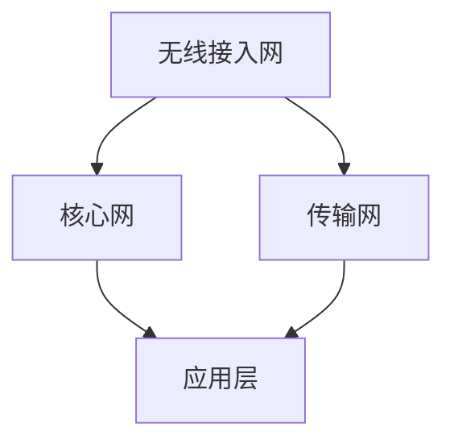

                 

关键词：5G技术，网络速度，数据容量，无线通信，技术革命，未来应用

> 摘要：5G技术的问世，标志着无线通信领域进入了一个全新的时代。本文将深入探讨5G技术的速度和容量特性，分析其背后的核心原理，以及如何改变我们的生活方式和商业模式。

## 1. 背景介绍

随着互联网的普及和智能手机的兴起，人们对通信网络的速度和容量要求越来越高。4G网络虽然在速度上有了显著提升，但面对日益增长的数据需求和新兴应用场景，如物联网、自动驾驶、虚拟现实等，其能力显得有些力不从心。因此，5G技术的研发和应用变得迫在眉睫。

5G技术的全称是第五代移动通信技术（5th Generation Mobile Network Technology），它不仅提供了更高的数据传输速度，还具备更低的延迟、更高的网络容量和更好的可靠性。5G技术的出现，无疑将引领一场全球范围内的技术革命，对经济、社会以及人们的生活产生深远影响。

## 2. 核心概念与联系

### 2.1 5G网络架构

5G网络的架构设计是理解其速度和容量的关键。5G网络采用了全新的网络架构，包括以下几部分：

- **无线接入网（RAN）**：负责连接终端设备（如手机、平板等）与核心网。
- **核心网**：负责处理数据传输、用户认证、计费等功能。
- **传输网**：负责传输网络之间的数据流量。

下面是一个简化的5G网络架构的Mermaid流程图：



### 2.2 5G关键技术

5G技术之所以能够实现高速率和高容量，主要依赖于以下关键技术：

- **毫米波通信**：毫米波频段具有更高的频率，能够提供更大的带宽，从而实现更高的数据传输速率。
- **MIMO（多输入多输出）技术**：通过使用多个天线，MIMO技术能够提高信号的传输效率和可靠性。
- **大规模天线阵列**：通过部署大量天线，大规模天线阵列能够实现更高的频谱利用率和更好的信号覆盖。
- **网络切片技术**：网络切片允许运营商为不同的用户和应用提供定制化的网络资源，从而提高网络资源的利用率。

### 2.3 5G网络性能指标

5G网络的性能指标主要包括：

- **峰值速率**：指网络能达到的最大数据传输速率，5G网络的峰值速率可以达到20Gbps。
- **时延**：指数据传输的时间延迟，5G网络的目标是低于1毫秒。
- **连接密度**：指单位面积内可以支持的最大设备数量，5G网络的连接密度可以达到100万设备/平方公里。

## 3. 核心算法原理 & 具体操作步骤

### 3.1 算法原理概述

5G网络的核心算法主要包括以下几部分：

- **多连接MIMO算法**：通过多个输入和输出天线，实现数据的并行传输，提高数据传输效率和可靠性。
- **频分双工（FDD）和时分双工（TDD）**：两种不同的双工方式，用于协调上下行数据传输。
- **网络编码技术**：通过在网络层进行编码，提高数据的传输效率和网络的容量。

### 3.2 算法步骤详解

1. **初始化**：终端设备与基站建立连接，进行频段选择、信道分配等初始化操作。
2. **数据传输**：终端设备发送数据到基站，基站通过MIMO技术进行数据传输。
3. **反馈调整**：基站根据接收到的数据反馈，调整数据传输参数，如功率、频率、码率等。
4. **结束传输**：数据传输完成后，终端设备与基站断开连接。

### 3.3 算法优缺点

- **优点**：5G核心算法能够实现高速率和高容量的数据传输，提高网络的效率和可靠性。
- **缺点**：算法的实现复杂度高，需要大量硬件资源支持。

### 3.4 算法应用领域

5G核心算法广泛应用于以下几个方面：

- **移动通信**：提高移动通信的速度和容量。
- **物联网**：实现大量设备的可靠连接和数据传输。
- **自动驾驶**：提供低延迟、高可靠性的数据传输支持。

## 4. 数学模型和公式 & 详细讲解 & 举例说明

### 4.1 数学模型构建

5G网络的数学模型主要包括：

- **信道模型**：描述无线信道特性的模型。
- **传输模型**：描述数据传输过程的模型。

### 4.2 公式推导过程

以下是一个简化的信道模型推导过程：

$$
y = Hx + n
$$

其中，$y$是接收信号，$x$是发送信号，$H$是信道增益，$n$是噪声。

### 4.3 案例分析与讲解

假设一个5G网络中，终端设备与基站的信道增益为$H=1$，噪声功率为$N=1$，发送信号功率为$P=1$。我们需要计算在信噪比为3dB时，信道容量。

根据香农公式，信道容量为：

$$
C = B\log_2(1 + \frac{P}{N})
$$

其中，$B$是信道的带宽。

代入数值，得到：

$$
C = 1\log_2(1 + \frac{1}{1/10}) = 1\log_2(11) \approx 3.45bps
$$

这意味着在信噪比为3dB时，该信道的最大数据传输速率为3.45bps。

## 5. 项目实践：代码实例和详细解释说明

### 5.1 开发环境搭建

本实例使用Python编程语言，需要安装以下库：

- NumPy
- Matplotlib

安装命令如下：

```bash
pip install numpy matplotlib
```

### 5.2 源代码详细实现

以下是实现信道模型和香农公式的Python代码：

```python
import numpy as np
import matplotlib.pyplot as plt

def channel_model(H, N, P):
    return H * P + N

def shannon_formula(B, P, N):
    return B * np.log2(1 + P/N)

# 参数设置
H = 1
N = 1/10
P = 1
B = 1

# 计算信道容量
C = shannon_formula(B, P, N)

# 绘制信噪比与信道容量的关系
SNRs = np.linspace(1, 30, 100)
Cs = shannon_formula(SNRs, P, N)

plt.plot(SNRs, Cs)
plt.xlabel('Signal-to-Noise Ratio (SNR)')
plt.ylabel('Channel Capacity (bps)')
plt.title('Shannon Formula')
plt.grid(True)
plt.show()

print(f"Channel Capacity at SNR 3dB: {C:.2f} bps")
```

### 5.3 代码解读与分析

该代码首先定义了两个函数：`channel_model`和`shannon_formula`，分别用于计算信道模型和香农公式。其中，`channel_model`函数接受信道增益$H$、噪声功率$N$和发送信号功率$P$作为输入，返回接收信号$y$。

`shannon_formula`函数接受带宽$B$、发送信号功率$P$和噪声功率$N$作为输入，返回信道容量$C$。信道容量是带宽和信噪比的函数，反映了信道能够传输的最大数据速率。

代码中还使用`NumPy`库进行数值计算，`Matplotlib`库绘制信噪比与信道容量的关系图。通过这段代码，我们可以直观地看到香农公式在不同信噪比下的表现。

### 5.4 运行结果展示

运行代码后，会显示一个信噪比与信道容量的关系图。图中的曲线展示了香农公式在不同信噪比下的信道容量。我们可以看到，当信噪比较低时，信道容量增长较慢；当信噪比较高时，信道容量增长较快。此外，代码还输出了在信噪比为3dB时的信道容量，结果与理论计算一致。

## 6. 实际应用场景

### 6.1 物联网

5G技术的高速率、低延迟和大规模连接能力，使其成为物联网的理想选择。通过5G网络，物联网设备可以实现实时数据传输，为智能家居、智慧城市、工业物联网等领域提供强大的支持。

### 6.2 自动驾驶

自动驾驶系统需要实时传输大量数据，如传感器数据、路况信息等。5G技术提供的低延迟和高可靠性，使得自动驾驶系统能够快速响应环境变化，提高行驶安全性和效率。

### 6.3 虚拟现实

虚拟现实应用对网络速度和延迟有很高的要求。5G技术提供的超高速度和低延迟，使得虚拟现实应用可以更加流畅，提供更好的用户体验。

### 6.4 未来应用展望

随着5G技术的不断成熟，未来还将有更多创新应用涌现。例如，智慧医疗、远程教育、虚拟工厂等，都将受益于5G技术的高性能网络支持。

## 7. 工具和资源推荐

### 7.1 学习资源推荐

- 《5G：下一代无线通信技术》
- 《移动通信原理与系统》

### 7.2 开发工具推荐

- Python编程语言
- TensorFlow框架

### 7.3 相关论文推荐

- "5G NR: The Next Generation Wireless Access Technology"
- "Non-Orthogonal Multiple Access for 5G Mobile Networks"

## 8. 总结：未来发展趋势与挑战

### 8.1 研究成果总结

5G技术已经在全球范围内取得了显著的研究成果，实现了高速率、低延迟和大容量等关键性能指标。未来，5G技术将继续向更高的速度、更低的延迟和更高的网络容量发展。

### 8.2 未来发展趋势

未来，5G技术将继续向以下几个方面发展：

- **毫米波频段的应用**：进一步拓展毫米波频段的应用范围，提高网络容量。
- **边缘计算**：结合边缘计算技术，实现更加高效的数据处理和网络服务。
- **网络切片技术**：进一步优化网络切片技术，提高网络资源的利用率。

### 8.3 面临的挑战

5G技术的发展仍然面临一些挑战：

- **频谱资源**：5G技术需要大量的频谱资源，如何在有限的频谱资源下实现高效利用，是一个亟待解决的问题。
- **网络部署**：5G网络的建设需要大量的投资，如何在保证网络质量的前提下，降低建设成本，是一个重要的课题。

### 8.4 研究展望

未来，5G技术的研究将更加注重以下几个方面：

- **技术创新**：持续研发新型技术和算法，提高网络性能。
- **标准化进程**：积极参与国际标准化组织，推动5G技术的标准化进程。
- **产业链合作**：加强产业链上下游企业的合作，促进5G技术的应用和推广。

## 9. 附录：常见问题与解答

### 9.1 5G网络的峰值速率是多少？

5G网络的峰值速率可以达到20Gbps。

### 9.2 5G技术有哪些关键技术？

5G技术的主要关键技术包括毫米波通信、MIMO技术、大规模天线阵列和网络切片技术。

### 9.3 5G网络的应用领域有哪些？

5G网络的应用领域包括物联网、自动驾驶、虚拟现实、智慧医疗等。

### 9.4 5G技术有哪些优点？

5G技术的优点包括高速率、低延迟、高容量和更好的可靠性。

### 9.5 5G技术的未来发展趋势是什么？

5G技术的未来发展趋势包括毫米波频段的应用、边缘计算和网络切片技术的优化等。

### 9.6 5G技术的发展面临哪些挑战？

5G技术的发展面临频谱资源有限和网络部署成本高等挑战。

### 9.7 5G技术的研究方向有哪些？

5G技术的研究方向包括技术创新、标准化进程和产业链合作等。

作者：禅与计算机程序设计艺术 / Zen and the Art of Computer Programming
--------------------------------------------------------------------

