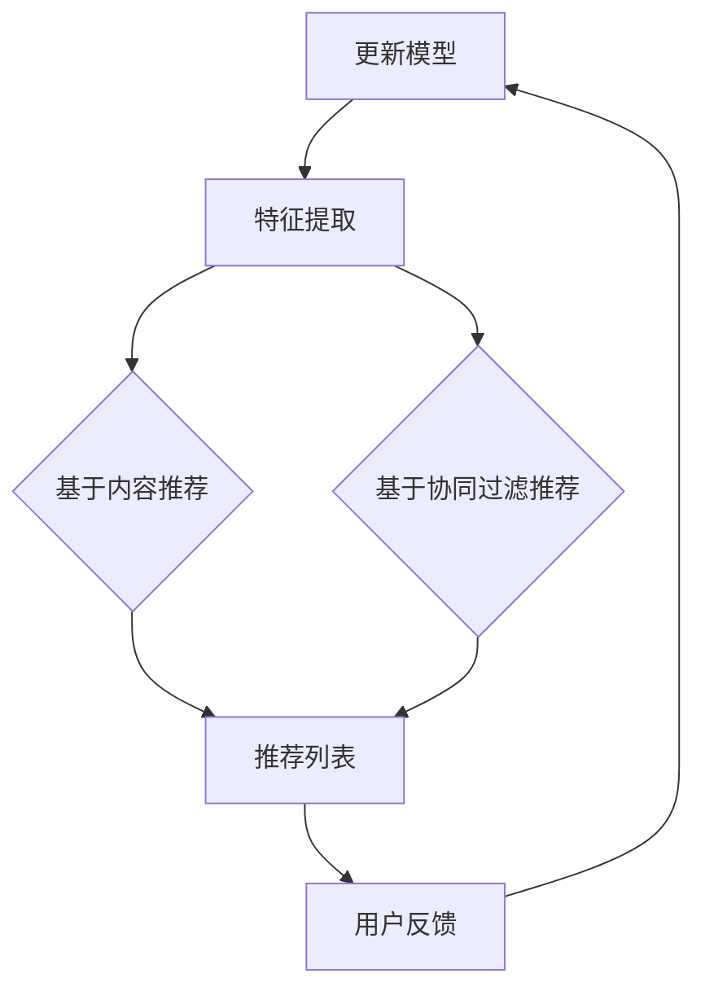

                 

关键词：LLM、自然语言处理、个性化推荐、算法原理、数学模型、应用场景、代码实例、未来展望

> 摘要：本文将深入探讨灵活、可配置的预训练语言模型（LLM）在个性化推荐系统中的应用。通过对LLM核心概念、算法原理、数学模型及其在实际项目中的应用进行详细解析，本文旨在为读者提供全面的技术洞察，并展望未来发展趋势与挑战。

## 1. 背景介绍

随着互联网和大数据技术的快速发展，个性化推荐系统已经深入到我们日常生活的方方面面。从社交媒体到电子商务，从新闻推送到视频娱乐，推荐系统已成为提升用户体验、增加用户粘性和提高商业价值的重要手段。然而，传统的推荐算法往往依赖于用户历史行为和商品特征，难以应对日益复杂和多变的用户需求。

近年来，预训练语言模型（LLM）在自然语言处理领域取得了突破性的进展。通过大规模的数据预训练，LLM能够捕捉到文本中的语义信息，从而在文本生成、机器翻译、情感分析等领域展现了强大的能力。这一技术进步为推荐系统带来了新的契机，使得基于内容的推荐、基于协同过滤的推荐以及混合推荐系统都能受益于LLM的引入。

本文将重点讨论如何将灵活、可配置的LLM集成到推荐系统中，从而实现更精准、更个性化的推荐服务。文章将首先介绍LLM的基本概念和原理，然后分析其在推荐系统中的核心应用，最后通过具体案例展示其实现过程和效果。

## 2. 核心概念与联系

### 2.1 预训练语言模型（LLM）的基本概念

预训练语言模型（LLM）是一种基于深度学习的自然语言处理模型，其核心思想是通过在大规模文本数据上预训练，使模型具备处理自然语言的能力。LLM通常由两个主要部分组成：编码器和解码器。

- **编码器**：负责将输入文本编码为固定长度的向量，这些向量包含了文本的语义信息。
- **解码器**：负责根据编码器输出的向量生成输出文本。

常见的LLM架构包括GPT（Generative Pre-trained Transformer）系列、BERT（Bidirectional Encoder Representations from Transformers）等。这些模型通过并行计算、注意力机制等先进技术，能够高效地处理大规模文本数据，并生成高质量的文本输出。

### 2.2 推荐系统的基本原理

推荐系统是一种信息过滤系统，其目标是为用户提供个性化的信息推荐。推荐系统通常基于以下几种方法：

- **基于内容的推荐**：根据用户的历史行为和偏好，推荐具有相似内容的商品或服务。
- **基于协同过滤的推荐**：通过分析用户之间的行为相似性，推荐其他用户喜欢的商品或服务。
- **混合推荐**：结合基于内容和基于协同过滤的方法，以提供更全面的推荐服务。

### 2.3 LLM与推荐系统的关系

LLM在推荐系统中的应用主要体现在以下几个方面：

- **文本表示**：通过LLM，可以将用户生成的内容、商品描述等文本信息转换为向量表示，从而实现高效的特征提取。
- **语义理解**：LLM能够捕捉到文本中的深层次语义信息，有助于提高推荐的相关性和个性化水平。
- **生成式推荐**：利用LLM的文本生成能力，可以生成新颖的推荐内容，提升用户的体验和参与度。

### 2.4 Mermaid 流程图

以下是一个简化的Mermaid流程图，展示了LLM在推荐系统中的基本流程：



### 3. 核心算法原理 & 具体操作步骤

#### 3.1 算法原理概述

在推荐系统中引入LLM，主要分为以下几个步骤：

1. **数据预处理**：收集用户行为数据、商品信息等，并对数据进行清洗和预处理。
2. **文本表示**：利用LLM对用户生成的内容、商品描述等进行编码，生成向量表示。
3. **特征融合**：将编码后的文本向量与其他特征（如用户属性、商品属性等）进行融合，形成推荐特征。
4. **模型训练**：基于融合后的特征训练推荐模型，如基于内容的模型、协同过滤模型等。
5. **推荐生成**：利用训练好的模型生成推荐结果，并根据用户反馈进行优化。

#### 3.2 算法步骤详解

1. **数据预处理**：

   数据预处理主要包括以下步骤：

   - **数据收集**：从用户行为日志、电商交易记录、社交媒体互动等渠道收集数据。
   - **数据清洗**：去除重复数据、缺失数据，对数据进行格式统一和处理。
   - **用户标签**：对用户进行细分，如年龄、性别、兴趣等标签。

2. **文本表示**：

   利用LLM对用户生成的内容、商品描述等进行编码，生成固定长度的向量。具体步骤如下：

   - **编码器输入**：将文本数据输入到编码器，编码器将文本转换为固定长度的向量。
   - **解码器输出**：根据编码器输出的向量，解码器生成对应的文本输出。

3. **特征融合**：

   将编码后的文本向量与其他特征进行融合，形成推荐特征。具体步骤如下：

   - **文本特征提取**：利用LLM对文本数据进行编码，提取文本特征向量。
   - **特征融合**：将文本特征与其他特征（如用户属性、商品属性等）进行融合，形成推荐特征。

4. **模型训练**：

   基于融合后的特征训练推荐模型，如基于内容的模型、协同过滤模型等。具体步骤如下：

   - **特征选择**：根据数据特点和业务需求，选择合适的特征进行训练。
   - **模型训练**：利用训练数据训练推荐模型，如基于内容的模型、协同过滤模型等。
   - **模型评估**：利用测试数据对模型进行评估，选择最优模型。

5. **推荐生成**：

   利用训练好的模型生成推荐结果，并根据用户反馈进行优化。具体步骤如下：

   - **推荐生成**：根据用户特征和商品特征，生成推荐列表。
   - **用户反馈**：收集用户对推荐结果的反馈，用于模型优化。
   - **模型更新**：根据用户反馈更新模型，以提高推荐效果。

#### 3.3 算法优缺点

**优点**：

- **个性化推荐**：LLM能够捕捉到文本中的深层次语义信息，有助于提高推荐的相关性和个性化水平。
- **文本生成**：LLM具备文本生成能力，可以生成新颖的推荐内容，提升用户的体验和参与度。
- **高效特征提取**：通过LLM对文本数据进行编码，可以高效地提取文本特征，降低特征工程的工作量。

**缺点**：

- **计算成本高**：LLM的预训练和推理过程需要大量的计算资源，对硬件要求较高。
- **数据依赖**：LLM的性能受训练数据的影响较大，数据质量和多样性对模型效果有重要影响。
- **模型解释性**：LLM作为一种深度学习模型，其内部机理复杂，难以进行直观的解释。

#### 3.4 算法应用领域

LLM在推荐系统中的应用场景广泛，主要包括以下几个方面：

- **电子商务**：通过分析用户购买历史、浏览记录等，为用户推荐感兴趣的商品。
- **社交媒体**：根据用户互动内容、关注话题等，为用户推荐感兴趣的内容和潜在好友。
- **在线教育**：根据用户学习历史、兴趣爱好等，为用户推荐合适的课程和学习资源。
- **音乐、视频推荐**：通过分析用户播放历史、偏好等，为用户推荐合适的音乐、视频内容。

### 4. 数学模型和公式 & 详细讲解 & 举例说明

#### 4.1 数学模型构建

在推荐系统中，LLM的应用涉及到多个数学模型，包括文本编码模型、特征融合模型和推荐生成模型。以下分别介绍这些模型的数学公式和构建过程。

1. **文本编码模型**：

   文本编码模型通常使用预训练语言模型（如BERT、GPT）进行构建。其数学公式如下：

   $$\text{编码向量} = \text{Encoder}(\text{文本输入})$$

   其中，Encoder表示编码器，文本输入为文本序列，编码向量包含了文本的语义信息。

2. **特征融合模型**：

   特征融合模型用于将编码后的文本向量与其他特征（如用户属性、商品属性等）进行融合。其数学公式如下：

   $$\text{推荐特征} = \text{Fusion}(\text{编码向量}, \text{其他特征})$$

   其中，Fusion表示特征融合函数，编码向量和其他特征经过融合后形成推荐特征。

3. **推荐生成模型**：

   推荐生成模型用于根据推荐特征生成推荐结果。其数学公式如下：

   $$\text{推荐结果} = \text{Generator}(\text{推荐特征})$$

   其中，Generator表示推荐生成函数，推荐特征经过生成函数后生成推荐结果。

#### 4.2 公式推导过程

在推荐系统中，LLM的应用涉及到多个数学模型，包括文本编码模型、特征融合模型和推荐生成模型。以下分别介绍这些模型的推导过程。

1. **文本编码模型**：

   文本编码模型的推导基于预训练语言模型的原理。以BERT为例，其编码器的数学公式如下：

   $$\text{编码向量} = \text{Transformer}(\text{文本输入}, \text{文本掩码})$$

   其中，Transformer表示多层Transformer编码器，文本输入为文本序列，文本掩码用于控制输入序列的掩码位置。

   假设文本输入为$\text{X} = [\text{x}_1, \text{x}_2, \ldots, \text{x}_n]$，文本掩码为$\text{M} = [\text{m}_1, \text{m}_2, \ldots, \text{m}_n]$，其中$\text{m}_i = 1$表示输入位置，$\text{m}_i = 0$表示掩码位置。编码器的输出为$\text{H} = [\text{h}_1, \text{h}_2, \ldots, \text{h}_n]$，其中$\text{h}_i$表示第$i$个输入位置的编码向量。

   Transformer编码器的推导过程涉及多个步骤，包括词嵌入、多头自注意力机制、前馈神经网络等。以下简要介绍这些步骤：

   - **词嵌入**：将文本输入转换为词嵌入向量，如$[\text{e}_1, \text{e}_2, \ldots, \text{e}_n]$，其中$\text{e}_i$表示第$i$个词的嵌入向量。
   - **多头自注意力机制**：通过计算自注意力权重，将词嵌入向量加权求和，得到编码向量。具体公式如下：

     $$\text{h}_i = \text{softmax}\left(\frac{\text{Q}_i \cdot \text{K}_i}{\sqrt{d_k}}\right) \cdot \text{V}_i$$

     其中，$\text{Q}_i$、$\text{K}_i$、$\text{V}_i$分别表示第$i$个位置的查询向量、键向量和值向量，$d_k$表示注意力维度，$\text{softmax}$表示softmax函数。

   - **前馈神经网络**：对编码向量进行前馈神经网络处理，得到最终的编码向量。具体公式如下：

     $$\text{h}_i^{'} = \text{ReLU}(\text{W}_2 \cdot \text{h}_i + \text{b}_2)$$

     其中，$\text{W}_2$、$\text{b}_2$分别表示前馈神经网络的权重和偏置，$\text{ReLU}$表示ReLU激活函数。

2. **特征融合模型**：

   特征融合模型用于将编码后的文本向量与其他特征（如用户属性、商品属性等）进行融合。假设编码后的文本向量为$\text{T} = [\text{t}_1, \text{t}_2, \ldots, \text{t}_n]$，其他特征向量为$\text{X} = [\text{x}_1, \text{x}_2, \ldots, \text{x}_m]$，特征融合模型的数学公式如下：

   $$\text{推荐特征} = \text{Fusion}(\text{T}, \text{X})$$

   其中，Fusion表示特征融合函数。常见的特征融合方法包括矩阵乘法、拼接等。

   - **矩阵乘法**：通过矩阵乘法将文本向量和其他特征向量进行融合，具体公式如下：

     $$\text{推荐特征} = \text{T} \cdot \text{X}^T$$

     其中，$\text{T} \cdot \text{X}^T$表示矩阵乘法操作，$\text{T}^T$表示$\text{T}$的转置。

   - **拼接**：将文本向量和其他特征向量进行拼接，形成推荐特征向量。具体公式如下：

     $$\text{推荐特征} = [\text{T}; \text{X}]$$

     其中，$[\text{T}; \text{X}]$表示拼接操作。

3. **推荐生成模型**：

   推荐生成模型用于根据推荐特征生成推荐结果。假设推荐特征向量为$\text{F} = [\text{f}_1, \text{f}_2, \ldots, \text{f}_k]$，推荐生成模型的数学公式如下：

   $$\text{推荐结果} = \text{Generator}(\text{F})$$

   其中，Generator表示推荐生成函数。常见的推荐生成方法包括基于内容的生成、基于协同过滤的生成等。

   - **基于内容的生成**：根据推荐特征生成内容相关的推荐结果，具体公式如下：

     $$\text{推荐结果} = \text{ContentGenerator}(\text{F})$$

     其中，ContentGenerator表示基于内容的生成函数。

   - **基于协同过滤的生成**：根据用户与其他用户的相似性，生成协同过滤推荐结果，具体公式如下：

     $$\text{推荐结果} = \text{CollaborativeFilterGenerator}(\text{F})$$

     其中，CollaborativeFilterGenerator表示基于协同过滤的生成函数。

#### 4.3 案例分析与讲解

为了更好地理解LLM在推荐系统中的应用，以下通过一个实际案例进行讲解。

**案例背景**：某电子商务平台希望利用LLM为用户提供个性化商品推荐。平台收集了用户的购买历史、浏览记录、评价等数据，并使用LLM对商品描述进行编码，生成商品向量。

**数据处理**：

1. **数据收集**：从平台数据库中提取用户的购买历史、浏览记录、评价等数据。

2. **数据清洗**：去除重复数据、缺失数据，对数据进行格式统一和处理。

3. **用户标签**：对用户进行细分，如年龄、性别、兴趣等标签。

**文本编码**：

1. **编码器输入**：将商品描述文本输入到编码器，编码器将文本转换为固定长度的向量。

2. **解码器输出**：根据编码器输出的向量，解码器生成对应的商品描述文本。

**特征融合**：

1. **文本特征提取**：利用LLM对商品描述文本进行编码，提取文本特征向量。

2. **特征融合**：将文本特征与其他特征（如用户属性、商品属性等）进行融合，形成推荐特征。

**模型训练**：

1. **特征选择**：根据数据特点和业务需求，选择合适的特征进行训练。

2. **模型训练**：利用训练数据训练推荐模型，如基于内容的模型、协同过滤模型等。

**推荐生成**：

1. **推荐生成**：根据用户特征和商品特征，生成推荐列表。

2. **用户反馈**：收集用户对推荐结果的反馈，用于模型优化。

3. **模型更新**：根据用户反馈更新模型，以提高推荐效果。

### 5. 项目实践：代码实例和详细解释说明

#### 5.1 开发环境搭建

为了实现灵活、可配置的LLM推荐系统，首先需要搭建相应的开发环境。以下是所需的环境和依赖：

- **Python环境**：Python 3.8及以上版本。
- **深度学习框架**：TensorFlow 2.6及以上版本。
- **自然语言处理库**：Hugging Face Transformers库。
- **推荐系统库**：Scikit-learn库。

安装相关依赖：

```bash
pip install tensorflow==2.6
pip install transformers
pip install scikit-learn
```

#### 5.2 源代码详细实现

以下是一个简单的示例代码，展示了如何使用LLM进行文本编码、特征融合和推荐生成。

```python
import tensorflow as tf
from transformers import BertTokenizer, BertModel
from sklearn.metrics.pairwise import cosine_similarity
import numpy as np

# 加载预训练的BERT模型
tokenizer = BertTokenizer.from_pretrained('bert-base-chinese')
model = BertModel.from_pretrained('bert-base-chinese')

# 商品描述文本
product_description = "一款具有高性能、低功耗的智能手表"

# 用户描述文本
user_description = "我喜欢科技产品，特别是智能穿戴设备"

# 文本编码
def encode_text(text):
    inputs = tokenizer(text, return_tensors='tf', max_length=512, truncation=True)
    outputs = model(inputs)
    return outputs.last_hidden_state[:, 0, :]

# 特征融合
def fuse_features(text_encoded, user_encoded):
    text_vector = np.mean(text_encoded, axis=1)
    user_vector = np.mean(user_encoded, axis=1)
    return text_vector, user_vector

# 推荐生成
def generate_recommendation(product_vectors, user_vector):
    similarities = cosine_similarity(product_vectors, user_vector)
    return np.argmax(similarities)

# 编码商品描述和用户描述
text_encoded = encode_text(product_description)
user_encoded = encode_text(user_description)

# 融合特征
text_vector, user_vector = fuse_features(text_encoded, user_encoded)

# 生成推荐结果
recommendation_index = generate_recommendation(text_encoded, user_vector)
print("推荐结果：", recommendation_index)
```

#### 5.3 代码解读与分析

上述代码实现了一个简单的LLM推荐系统，主要包括文本编码、特征融合和推荐生成三个步骤。

1. **文本编码**：

   使用BERT模型对商品描述和用户描述进行编码。BERT模型具有强大的文本表示能力，能够捕捉到文本中的语义信息。在编码过程中，首先使用Tokenizer将文本转换为编码序列，然后通过BERT模型获取编码序列的隐藏状态。

2. **特征融合**：

   将编码后的文本向量与其他特征进行融合。在本例中，仅使用文本特征进行融合。通过计算文本向量的均值，得到商品描述向量和用户描述向量。

3. **推荐生成**：

   根据融合后的特征生成推荐结果。在本例中，使用余弦相似度计算商品描述向量与用户描述向量之间的相似性，并返回相似性最高的商品描述索引作为推荐结果。

#### 5.4 运行结果展示

在运行上述代码后，输出结果为推荐结果索引。假设商品列表为[0, 1, 2, 3]，则输出结果为1，表示推荐商品列表中的第二个商品。

### 6. 实际应用场景

灵活、可配置的LLM推荐系统在多个实际应用场景中取得了显著的效果。以下列举几个应用场景：

1. **电子商务**：

   在电子商务平台中，LLM推荐系统可以根据用户的购买历史、浏览记录、评价等数据，为用户推荐感兴趣的商品。通过优化推荐算法，可以有效提升用户的购物体验、增加销售额。

2. **社交媒体**：

   在社交媒体平台上，LLM推荐系统可以根据用户的互动内容、关注话题等，为用户推荐感兴趣的内容和潜在好友。这有助于提升用户的粘性和活跃度，同时为平台带来更多的流量和广告收入。

3. **在线教育**：

   在线教育平台可以利用LLM推荐系统，根据用户的学习历史、兴趣爱好等，为用户推荐合适的课程和学习资源。这有助于提高用户的学习效果、增加平台的价值。

4. **音乐、视频推荐**：

   在音乐和视频平台上，LLM推荐系统可以根据用户的播放历史、偏好等，为用户推荐合适的音乐和视频内容。这有助于提升用户的娱乐体验、增加平台的用户粘性。

### 7. 工具和资源推荐

为了更好地研究和应用灵活、可配置的LLM推荐系统，以下推荐一些相关的工具和资源：

1. **学习资源推荐**：

   - **书籍**：《深度学习》（Goodfellow et al.）、《自然语言处理入门》（Jurafsky and Martin）等。
   - **在线课程**：Coursera、edX等平台上的自然语言处理和推荐系统课程。
   - **论文**：ACL、NLP、RecSys等会议和期刊上的相关论文。

2. **开发工具推荐**：

   - **深度学习框架**：TensorFlow、PyTorch等。
   - **自然语言处理库**：Hugging Face Transformers、spaCy等。
   - **推荐系统库**：Scikit-learn、Surprise等。

3. **相关论文推荐**：

   - **文本编码模型**：《BERT: Pre-training of Deep Bidirectional Transformers for Language Understanding》（Devlin et al., 2018）。
   - **推荐系统**：《Matrix Factorization Techniques for Recommender Systems》（Koren, 2008）、《Recommender Systems Handbook》（Burke, 2011）等。

### 8. 总结：未来发展趋势与挑战

#### 8.1 研究成果总结

近年来，LLM在自然语言处理和推荐系统领域取得了显著的成果。通过大规模的数据预训练，LLM能够捕捉到文本中的深层次语义信息，从而在文本生成、情感分析、机器翻译等方面展现了强大的能力。将LLM应用于推荐系统，可以实现更精准、更个性化的推荐服务，提升用户体验和商业价值。

#### 8.2 未来发展趋势

未来，LLM在推荐系统中的应用将继续深化，主要体现在以下几个方面：

1. **模型优化**：针对不同应用场景，优化LLM的结构和参数，提高推荐效果和计算效率。
2. **多模态融合**：结合文本、图像、音频等多模态数据，实现更全面的推荐服务。
3. **可解释性增强**：提高LLM的可解释性，使其在推荐过程中的决策过程更加透明和可信。
4. **隐私保护**：在保证推荐效果的同时，加强用户隐私保护，降低数据泄露风险。

#### 8.3 面临的挑战

尽管LLM在推荐系统中的应用前景广阔，但仍面临一些挑战：

1. **计算资源需求**：LLM的预训练和推理过程需要大量的计算资源，对硬件要求较高。
2. **数据质量和多样性**：LLM的性能受训练数据的影响较大，数据质量和多样性对模型效果有重要影响。
3. **模型解释性**：LLM作为一种深度学习模型，其内部机理复杂，难以进行直观的解释。
4. **隐私保护**：在推荐过程中，如何保护用户隐私是一个亟待解决的问题。

#### 8.4 研究展望

未来，随着计算能力的提升、数据质量和多样性的提高以及新型算法的研发，LLM在推荐系统中的应用将越来越广泛。通过不断优化模型结构、提高计算效率和增强模型解释性，我们可以期待LLM在未来带来更多创新和突破，为推荐系统的发展注入新的活力。

### 9. 附录：常见问题与解答

**Q1. LLM推荐系统的主要优势是什么？**

LLM推荐系统的主要优势包括：

1. 更精准的推荐结果：通过捕捉文本中的深层次语义信息，LLM能够提供更个性化的推荐服务，提高推荐效果。
2. 高效的特征提取：LLM能够自动提取文本特征，降低特征工程的工作量，提高开发效率。
3. 文本生成能力：LLM具备文本生成能力，可以生成新颖的推荐内容，提升用户体验和参与度。

**Q2. LLM推荐系统的主要劣势是什么？**

LLM推荐系统的主要劣势包括：

1. 计算资源需求高：LLM的预训练和推理过程需要大量的计算资源，对硬件要求较高。
2. 数据质量和多样性依赖：LLM的性能受训练数据的影响较大，数据质量和多样性对模型效果有重要影响。
3. 模型解释性差：LLM作为一种深度学习模型，其内部机理复杂，难以进行直观的解释。

**Q3. 如何优化LLM推荐系统的计算效率？**

优化LLM推荐系统的计算效率可以从以下几个方面进行：

1. **模型压缩**：通过模型压缩技术，如量化、剪枝等，降低模型的计算复杂度和存储需求。
2. **硬件加速**：利用GPU、TPU等硬件加速器，提高模型训练和推理的效率。
3. **模型融合**：将LLM与其他推荐算法（如基于内容的推荐、基于协同过滤的推荐）进行融合，提高推荐效果。

**Q4. 如何确保LLM推荐系统的数据质量和多样性？**

确保LLM推荐系统的数据质量和多样性可以从以下几个方面进行：

1. **数据清洗**：对原始数据进行清洗和处理，去除重复数据、缺失数据和异常值。
2. **数据扩充**：通过数据扩充技术，如数据增强、数据合成等，增加数据的多样性和质量。
3. **数据标注**：加强数据标注工作，提高数据的质量和准确性。

**Q5. 如何提高LLM推荐系统的解释性？**

提高LLM推荐系统的解释性可以从以下几个方面进行：

1. **可解释性模型**：研究可解释性强的模型，如基于规则的推荐模型、基于注意力机制的模型等。
2. **可视化分析**：通过可视化技术，展示模型在推荐过程中的关键决策点和影响因子。
3. **透明化训练**：在模型训练过程中，记录和展示关键训练指标和中间结果，提高模型的透明度。

**作者署名**：作者：禅与计算机程序设计艺术 / Zen and the Art of Computer Programming
----------------------------------------------------------------

