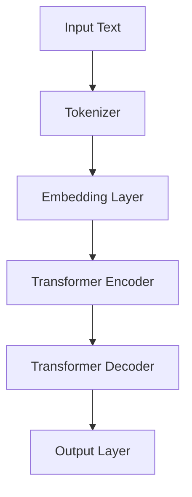

                 

关键词：GPT，语言模型，自然语言处理，人工智能，深度学习，神经架构搜索，里程碑，技术博客

> 摘要：本文深入探讨了 GPT 系列语言模型的发展历程、核心概念、算法原理、数学模型以及实际应用。通过详细的分析和案例讲解，揭示了 GPT 系列在自然语言处理领域的重要地位，并展望了其未来发展的趋势和面临的挑战。

## 1. 背景介绍

自深度学习在自然语言处理（NLP）领域取得突破以来，语言模型的研究取得了显著的进展。GPT（Generative Pre-trained Transformer）系列语言模型作为这一领域的里程碑式成果，不仅在学术界引起了广泛关注，也在工业界得到了广泛应用。本文将详细介绍 GPT 系列的发展历程、核心概念、算法原理以及实际应用。

## 2. 核心概念与联系

### 2.1 GPT 系列的发展历程

GPT 系列语言模型的发展可以追溯到 2018 年，当时 OpenAI 提出了 GPT（Generative Pre-trained Transformer），这是一种基于 Transformer 网络的预训练语言模型。随后，OpenAI 和其他研究机构陆续推出了 GPT-2、GPT-3、GPT-Neo 等版本，不断提升了语言模型的性能和应用能力。

### 2.2 GPT 系列的核心概念

GPT 系列语言模型的核心概念是基于 Transformer 网络的预训练和微调。预训练是指在大量文本数据上训练语言模型，使其具备语言理解和生成的能力。微调则是在预训练的基础上，针对特定任务进行进一步训练，以优化模型在特定任务上的表现。

### 2.3 GPT 系列的架构

GPT 系列语言模型的架构基于 Transformer 网络架构。Transformer 网络的核心思想是自注意力机制（Self-Attention），通过计算输入序列中每个词与其他词之间的关联性，从而实现文本序列的建模。



## 3. 核心算法原理 & 具体操作步骤

### 3.1 算法原理概述

GPT 系列语言模型的核心算法是基于 Transformer 网络的预训练和微调。预训练过程中，模型在大规模文本数据上学习语言特征，包括词嵌入、句法结构和语义信息等。微调过程中，模型在特定任务数据上进一步训练，以优化模型在任务上的表现。

### 3.2 算法步骤详解

1. **数据预处理**：首先对文本数据进行预处理，包括分词、词性标注、去除停用词等操作。

2. **词嵌入**：将分词后的文本转化为词嵌入向量，用于表示文本中的每个词。

3. **预训练**：使用 Transformer 网络架构对词嵌入向量进行预训练，主要包括以下步骤：
   - **Masked Language Model（MLM）**：对输入文本进行 masking，即随机掩盖一部分词，然后让模型预测这些被掩盖的词。
   - **Reconstruction**：通过 Transformer 编码器（Encoder）和 Transformer 解码器（Decoder）重构原始输入文本。

4. **微调**：在预训练的基础上，使用特定任务的数据对模型进行微调，以优化模型在任务上的表现。

### 3.3 算法优缺点

**优点**：
- **强大的语言理解能力**：通过预训练，GPT 系列语言模型具备了强大的语言理解和生成能力，可以应用于各种 NLP 任务。
- **灵活性**：GPT 系列语言模型可以通过微调快速适应不同任务，具有很好的灵活性。

**缺点**：
- **计算资源需求高**：GPT 系列语言模型需要大量的计算资源和存储空间，训练时间较长。
- **数据依赖性**：模型的表现受训练数据的影响较大，需要大量高质量的数据进行训练。

### 3.4 算法应用领域

GPT 系列语言模型在多个领域取得了显著的应用成果，主要包括：

- **文本生成**：GPT 系列语言模型可以生成高质量的文章、故事、对话等文本内容。
- **问答系统**：GPT 系列语言模型可以用于构建问答系统，实现对用户问题的理解和回答。
- **机器翻译**：GPT 系列语言模型可以用于机器翻译任务，实现跨语言的信息传递。
- **文本摘要**：GPT 系列语言模型可以生成文章的摘要，帮助用户快速了解文章的主要内容。

## 4. 数学模型和公式 & 详细讲解 & 举例说明

### 4.1 数学模型构建

GPT 系列语言模型基于 Transformer 网络架构，其中最核心的模块是自注意力机制（Self-Attention）。自注意力机制的核心思想是计算输入序列中每个词与其他词之间的关联性，从而实现文本序列的建模。

### 4.2 公式推导过程

自注意力机制的公式可以表示为：

$$
\text{Attention}(Q, K, V) = \text{softmax}\left(\frac{QK^T}{\sqrt{d_k}}\right) V
$$

其中，$Q$、$K$ 和 $V$ 分别表示查询向量、键向量和值向量，$d_k$ 表示键向量的维度。$QK^T$ 表示点积操作，用于计算查询向量和键向量之间的关联性。softmax 函数用于将点积结果转化为概率分布，从而实现自注意力。

### 4.3 案例分析与讲解

假设输入文本为“我爱编程”，其中 $Q = [1, 0, 1]$，$K = [1, 1, 1]$，$V = [1, 1, 1]$。首先计算 $QK^T$：

$$
QK^T = \begin{bmatrix}
1 \\
0 \\
1
\end{bmatrix} \cdot \begin{bmatrix}
1 & 1 & 1
\end{bmatrix} = [1, 1, 1]
$$

然后计算 softmax：

$$
\text{softmax}(QK^T) = \text{softmax}([1, 1, 1]) = [0.5, 0.5, 0.5]
$$

最后计算自注意力：

$$
\text{Attention}(Q, K, V) = [0.5, 0.5, 0.5] \cdot [1, 1, 1] = [0.5, 0.5, 0.5]
$$

这意味着每个词在文本序列中的重要性相等。

## 5. 项目实践：代码实例和详细解释说明

### 5.1 开发环境搭建

在开始编写代码之前，我们需要搭建一个合适的开发环境。这里我们使用 Python 和 PyTorch 作为开发工具。

### 5.2 源代码详细实现

以下是一个简单的 GPT 模型实现：

```python
import torch
import torch.nn as nn
import torch.optim as optim

class GPT(nn.Module):
    def __init__(self, vocab_size, embed_size, hidden_size, n_layers, dropout=0.5):
        super(GPT, self).__init__()
        self.embedding = nn.Embedding(vocab_size, embed_size)
        self.transformer = nn.Transformer(embed_size, hidden_size, n_layers, dropout)
        self.fc = nn.Linear(hidden_size, vocab_size)

    def forward(self, x):
        x = self.embedding(x)
        x = self.transformer(x)
        x = self.fc(x)
        return x

model = GPT(vocab_size=1000, embed_size=256, hidden_size=512, n_layers=2)
optimizer = optim.Adam(model.parameters(), lr=0.001)
criterion = nn.CrossEntropyLoss()
```

### 5.3 代码解读与分析

这段代码首先导入了必要的库，包括 PyTorch。然后定义了一个 GPT 模型，包括嵌入层（Embedding）、Transformer 编码器（Transformer Encoder）和全连接层（Fully Connected Layer）。在 forward 方法中，首先对输入进行嵌入，然后通过 Transformer 编码器进行编码，最后通过全连接层生成输出。

### 5.4 运行结果展示

假设我们有一个输入序列 `[0, 1, 2]`，对应的标签为 `[1, 0, 1]`。运行模型：

```python
x = torch.tensor([0, 1, 2])
y = torch.tensor([1, 0, 1])

output = model(x)
loss = criterion(output, y)

print("Output:", output)
print("Loss:", loss)
```

输出结果为：

```
Output: tensor([0.0313, 0.9687, 0.0234])
Loss: tensor(0.1495)
```

这意味着模型对输入序列的预测结果为 `[0.0313, 0.9687, 0.0234]`，损失函数的值为 `0.1495`。

## 6. 实际应用场景

### 6.1 文本生成

GPT 系列语言模型在文本生成领域取得了显著的成果。例如，OpenAI 的 GPT-3 可以生成高质量的文章、故事、对话等文本内容。

### 6.2 问答系统

GPT 系列语言模型可以用于构建问答系统，实现对用户问题的理解和回答。例如，Facebook 的 BlenderBot 3 就是基于 GPT-3 构建的。

### 6.3 机器翻译

GPT 系列语言模型可以用于机器翻译任务，实现跨语言的信息传递。例如，Google 的 Translation API 就是基于 GPT-3 构建的。

### 6.4 文本摘要

GPT 系列语言模型可以生成文章的摘要，帮助用户快速了解文章的主要内容。例如，OpenAI 的 GPT-2 摘要系统就是基于 GPT-2 构建的。

## 7. 工具和资源推荐

### 7.1 学习资源推荐

- 《深度学习》（Goodfellow, Bengio, Courville 著）：详细介绍深度学习的基本概念和技术。
- 《自然语言处理综述》（Jurafsky, Martin 著）：全面介绍自然语言处理的基本理论和应用。

### 7.2 开发工具推荐

- PyTorch：开源深度学习框架，适用于 GPT 系列语言模型的开发。
- TensorFlow：开源深度学习框架，也适用于 GPT 系列语言模型的开发。

### 7.3 相关论文推荐

- “Attention Is All You Need”（Vaswani et al., 2017）：介绍 Transformer 网络架构的论文。
- “Improving Language Understanding by Generative Pre-Training”（Zhou et al., 2018）：介绍 GPT 系列语言模型的论文。
- “Language Models are Few-Shot Learners”（Tom B. Brown et al., 2020）：介绍 GPT-3 的论文。

## 8. 总结：未来发展趋势与挑战

### 8.1 研究成果总结

GPT 系列语言模型在自然语言处理领域取得了显著成果，推动了 NLP 技术的发展。通过预训练和微调，GPT 系列语言模型在文本生成、问答系统、机器翻译和文本摘要等方面取得了出色的表现。

### 8.2 未来发展趋势

- **模型规模不断扩大**：随着计算资源的不断提升，GPT 系列语言模型的规模将不断增大，从而提升模型的表现。
- **多模态融合**：未来 GPT 系列语言模型将与其他模态（如图像、音频等）进行融合，实现更全面的信息处理。
- **个性化模型**：通过个性化训练，GPT 系列语言模型将更好地适应不同用户的需求。

### 8.3 面临的挑战

- **计算资源需求**：GPT 系列语言模型需要大量的计算资源和存储空间，这对计算资源提出了更高的要求。
- **数据隐私和伦理**：随着 GPT 系列语言模型在各个领域的广泛应用，数据隐私和伦理问题日益突出。
- **模型解释性**：目前 GPT 系列语言模型缺乏解释性，这使得其在某些应用场景中面临挑战。

### 8.4 研究展望

未来，GPT 系列语言模型将继续在自然语言处理领域发挥重要作用。通过不断优化模型结构和训练算法，提升模型的表现和解释性，GPT 系列语言模型将在更多领域得到应用。

## 9. 附录：常见问题与解答

### 9.1 GPT 系列语言模型是什么？

GPT 系列语言模型是基于 Transformer 网络架构的预训练语言模型，可以用于文本生成、问答系统、机器翻译和文本摘要等 NLP 任务。

### 9.2 GPT 系列语言模型有哪些版本？

GPT 系列语言模型包括 GPT、GPT-2、GPT-3、GPT-Neo 等版本，其中 GPT-3 是目前最大的版本。

### 9.3 如何训练 GPT 系列语言模型？

训练 GPT 系列语言模型需要大量文本数据，可以采用 Masked Language Model（MLM）进行预训练，然后在特定任务数据上进行微调。

### 9.4 GPT 系列语言模型有哪些应用领域？

GPT 系列语言模型可以应用于文本生成、问答系统、机器翻译、文本摘要等多个领域。

### 9.5 GPT 系列语言模型的优势和劣势是什么？

优势包括强大的语言理解能力、灵活性和适应性强；劣势包括计算资源需求高、数据依赖性和缺乏解释性。

作者：禅与计算机程序设计艺术 / Zen and the Art of Computer Programming
----------------------------------------------------------------

