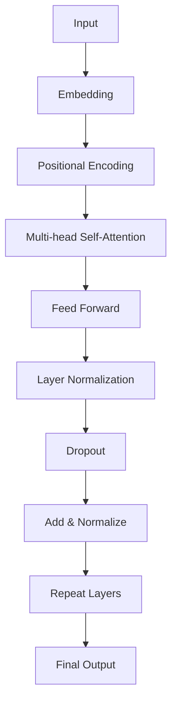
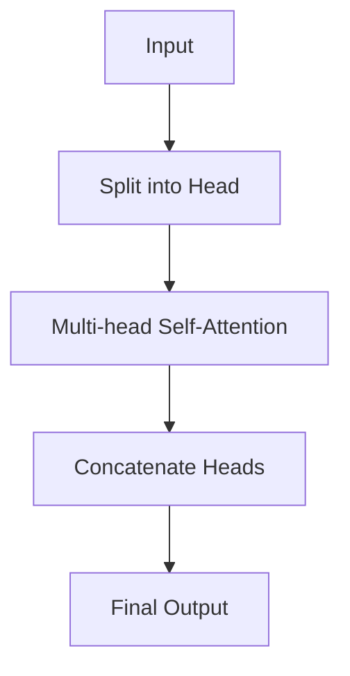

                 

关键词：大语言模型、GPT-2、GPT-4、算法原理、应用领域、数学模型、未来展望

> 摘要：本文深入探讨了从GPT-2到GPT-4这一系列大语言模型的进化之路，详细解析了它们的算法原理、技术进步、应用领域及其面临的挑战。通过本文，读者可以全面了解大语言模型的发展脉络，以及它们在未来技术发展中的重要作用。

## 1. 背景介绍

随着深度学习技术的不断发展，自然语言处理（NLP）领域迎来了前所未有的机遇。从最初的规则驱动的处理方法，到统计模型，再到如今的大规模预训练模型，NLP技术已经取得了显著的进步。GPT-2和GPT-4作为这一进程中的重要里程碑，为我们展示了大语言模型在理解、生成和交互自然语言方面的巨大潜力。

GPT-2（Generative Pre-trained Transformer 2）是由OpenAI于2019年推出的一种基于Transformer架构的大规模预训练语言模型。GPT-2在许多NLP任务上取得了出色的表现，包括文本生成、语言理解、机器翻译等。然而，随着研究的深入，人们逐渐认识到GPT-2在某些方面的局限性和不足，这促使了GPT-4的诞生。

GPT-4（Generative Pre-trained Transformer 4）是OpenAI于2023年推出的一款更强大的语言模型。GPT-4不仅在模型规模上有了显著提升，还在算法优化、数据集选择、训练方法等方面进行了全面改进。GPT-4的推出标志着大语言模型技术又迈上了一个新的台阶。

本文将围绕GPT-2和GPT-4这两个重要模型，详细探讨它们的算法原理、技术进步、应用领域及其面临的挑战，以期为广大读者提供一份全面的技术研究报告。

## 2. 核心概念与联系

### 2.1 Transformer架构

Transformer架构是GPT-2和GPT-4的基础。与传统的循环神经网络（RNN）不同，Transformer采用了自注意力机制，使得模型在处理长序列时具有更好的性能。以下是一个简化的Transformer架构的Mermaid流程图：



### 2.2 自注意力机制

自注意力机制是Transformer架构的核心。它通过计算序列中每个元素与所有其他元素之间的关联强度，从而实现对序列的 attentively 处理。以下是一个简化的自注意力机制的Mermaid流程图：

```mermaid
graph TD
A[Query] --> B[Key]
A --> C[Value]
B --> C
D[Attention Score] = [MatMul(Q,K)^T]
E[Attention Weight] = [softmax(D)]
F[Context Vector] = [MatMul(V,E)]
```

### 2.3 多头注意力

多头注意力是自注意力机制的扩展。它通过将序列分成多个子序列，并在每个子序列上独立应用自注意力机制，从而增强了模型的表示能力。以下是一个简化的多头注意力的Mermaid流程图：



## 3. 核心算法原理 & 具体操作步骤

### 3.1 算法原理概述

GPT-2和GPT-4的核心算法都是基于Transformer架构，其基本原理是通过自注意力机制和多头注意力机制对输入序列进行处理，从而实现对序列的 attentively 表示。具体来说，GPT-2和GPT-4的主要步骤包括：

1. 输入编码：将输入序列（如单词、字符等）转换为向量表示。
2. 位置编码：为序列中的每个元素添加位置信息，以便模型能够理解序列的顺序。
3. 自注意力机制：计算序列中每个元素与所有其他元素之间的关联强度，从而生成一个表示整个序列的上下文向量。
4. 多头注意力：将序列分成多个子序列，并在每个子序列上独立应用自注意力机制。
5. 前馈神经网络：对自注意力机制的输出进行进一步处理，以增强模型的表示能力。
6. 层归一化和Dropout：通过层归一化和Dropout技术，提高模型的稳定性和泛化能力。
7. 输出解码：将处理后的序列转换为输出序列，如文本生成、语言理解等。

### 3.2 算法步骤详解

#### 3.2.1 输入编码

输入编码是将输入序列（如单词、字符等）转换为向量表示。在GPT-2和GPT-4中，通常采用嵌入层（Embedding Layer）来实现输入编码。嵌入层将每个输入映射到一个固定大小的向量，这些向量构成了输入序列的初始表示。

#### 3.2.2 位置编码

位置编码为序列中的每个元素添加位置信息，以便模型能够理解序列的顺序。在GPT-2和GPT-4中，通常采用位置编码（Positional Encoding）来实现这一点。位置编码是一个可学习的向量，其大小与输入序列的长度相同。

#### 3.2.3 自注意力机制

自注意力机制是Transformer架构的核心。它通过计算序列中每个元素与所有其他元素之间的关联强度，从而生成一个表示整个序列的上下文向量。具体来说，自注意力机制包括以下几个步骤：

1. 计算注意力分数（Attention Score）：对于序列中的每个元素，计算其与所有其他元素之间的关联强度。这通常通过点积（Pointwise Dot Product）实现。
2. 应用 softmax 函数：将注意力分数归一化，得到注意力权重（Attention Weight）。注意力权重表示了序列中每个元素在生成上下文向量时的贡献。
3. 计算上下文向量（Context Vector）：将注意力权重与对应的元素值相乘，并将结果相加，得到上下文向量。上下文向量表示了序列中所有元素的整体信息。

#### 3.2.4 多头注意力

多头注意力是自注意力机制的扩展。它通过将序列分成多个子序列，并在每个子序列上独立应用自注意力机制，从而增强了模型的表示能力。具体来说，多头注意力包括以下几个步骤：

1. 将输入序列分成多个子序列。
2. 对于每个子序列，独立应用自注意力机制。
3. 将所有子序列的上下文向量拼接起来，得到最终的上下文向量。

#### 3.2.5 前馈神经网络

前馈神经网络是对自注意力机制的输出进行进一步处理，以增强模型的表示能力。在GPT-2和GPT-4中，前馈神经网络通常包括两个全连接层，每层之间添加ReLU激活函数。

#### 3.2.6 层归一化和Dropout

层归一化和Dropout是提高模型稳定性和泛化能力的重要技术。层归一化（Layer Normalization）通过对每个输入进行归一化，使模型对输入的敏感性降低，从而提高模型的鲁棒性。Dropout（Dropout）是一种正则化技术，通过随机丢弃一部分神经元，使模型对输入的依赖性降低，从而减少过拟合。

#### 3.2.7 输出解码

输出解码是将处理后的序列转换为输出序列，如文本生成、语言理解等。在GPT-2和GPT-4中，输出解码通常通过一个全连接层和一个softmax激活函数实现。

### 3.3 算法优缺点

#### 优点：

1. 强大的表示能力：通过自注意力机制和多头注意力机制，GPT-2和GPT-4能够捕捉序列中的长距离依赖关系，从而在许多NLP任务上取得了出色的表现。
2. 高效的计算：Transformer架构相对于传统的循环神经网络（RNN）具有更高效的计算，可以在较短的时间内处理大规模数据。
3. 易于扩展：Transformer架构具有良好的模块化特性，可以轻松扩展为更大规模的语言模型。

#### 缺点：

1. 高计算成本：由于自注意力机制的计算复杂度为O(N^2)，因此GPT-2和GPT-4在大规模数据集上的训练成本较高。
2. 对数据质量要求高：GPT-2和GPT-4的性能高度依赖于训练数据的质量，如果数据质量较差，模型的性能可能会受到较大影响。

### 3.4 算法应用领域

GPT-2和GPT-4在许多NLP任务中表现出色，以下是一些典型的应用领域：

1. 文本生成：GPT-2和GPT-4可以用于生成各种类型的文本，如文章、诗歌、对话等。
2. 语言理解：GPT-2和GPT-4可以用于情感分析、命名实体识别、关系抽取等任务。
3. 机器翻译：GPT-2和GPT-4在机器翻译领域取得了显著的进展，可以用于将一种语言翻译为另一种语言。
4. 文本摘要：GPT-2和GPT-4可以用于提取文本的主要内容和关键信息，生成摘要。
5. 对话系统：GPT-2和GPT-4可以用于构建聊天机器人，实现人机交互。

## 4. 数学模型和公式 & 详细讲解 & 举例说明

### 4.1 数学模型构建

GPT-2和GPT-4的核心算法是基于Transformer架构，因此其数学模型主要包括以下三个部分：嵌入层（Embedding Layer）、自注意力机制（Self-Attention Mechanism）、多头注意力（Multi-head Attention）。

#### 嵌入层

假设我们有一个输入序列 X = [x1, x2, ..., xn]，其中每个 xi 是一个 d 维向量。嵌入层（Embedding Layer）的作用是将输入序列映射到一个高维空间，从而为每个元素赋予更多的信息。嵌入层可以通过以下公式表示：

\[ E(x_i) = W_e \cdot x_i + b_e \]

其中，\( W_e \) 是一个 d \times d_e 的权重矩阵，\( b_e \) 是一个 d_e 维的偏置向量。\( E(x_i) \) 是嵌入层输出的 d_e 维向量。

#### 自注意力机制

自注意力机制是Transformer架构的核心。它通过计算序列中每个元素与所有其他元素之间的关联强度，从而生成一个表示整个序列的上下文向量。自注意力机制可以通过以下公式表示：

\[ \text{Attention}(Q, K, V) = \text{softmax}\left(\frac{QK^T}{\sqrt{d_k}}\right)V \]

其中，Q、K、V 分别是查询向量、关键向量、值向量，它们的维度都是 d_k。\( QK^T \) 是一个 n \times n 的矩阵，表示序列中每个元素与所有其他元素之间的关联强度。softmax 函数用于将关联强度归一化，得到注意力权重。\( \text{Attention}(Q, K, V) \) 是一个 n \times d_v 的矩阵，表示序列的上下文向量。

#### 多头注意力

多头注意力是自注意力机制的扩展。它通过将序列分成多个子序列，并在每个子序列上独立应用自注意力机制，从而增强了模型的表示能力。多头注意力可以通过以下公式表示：

\[ \text{Multi-head Attention}(Q, K, V) = \text{Concat}(\text{head}_1, \text{head}_2, ..., \text{head}_h)W_O \]

其中，h 是头数，每个 \(\text{head}_i = \text{Attention}(QW_i^Q, KW_i^K, VW_i^V)\) 是一个自注意力机制的结果。\( W_O \) 是一个 d_v \times d_k 的权重矩阵，用于拼接多头注意力结果。

### 4.2 公式推导过程

为了更好地理解GPT-2和GPT-4的数学模型，我们可以从简单的自注意力机制开始，逐步推导出多头注意力和Transformer架构。

#### 自注意力机制

自注意力机制的核心是计算序列中每个元素与所有其他元素之间的关联强度。为了实现这一点，我们首先需要将输入序列映射到查询（Query）、关键（Key）和值（Value）三个向量空间。

假设我们有一个输入序列 X = [x1, x2, ..., xn]，其中每个 xi 是一个 d 维向量。首先，我们将输入序列映射到查询向量空间：

\[ Q = W_Q \cdot X + b_Q \]

其中，\( W_Q \) 是一个 d \times d_q 的权重矩阵，\( b_Q \) 是一个 d_q 维的偏置向量。同样地，我们将输入序列映射到关键向量空间和值向量空间：

\[ K = W_K \cdot X + b_K \]
\[ V = W_V \cdot X + b_V \]

其中，\( W_K \) 和 \( W_V \) 分别是 d \times d_k 和 d \times d_v 的权重矩阵，\( b_K \) 和 \( b_V \) 分别是 d_k 维和 d_v 维的偏置向量。

接下来，我们计算每个元素与所有其他元素之间的关联强度：

\[ \text{Attention Score} = \frac{QK^T}{\sqrt{d_k}} \]

其中，\( QK^T \) 是一个 n \times n 的矩阵，表示序列中每个元素与所有其他元素之间的关联强度。为了得到注意力权重，我们应用 softmax 函数：

\[ \text{Attention Weight} = \text{softmax}(\text{Attention Score}) \]

注意力权重表示了序列中每个元素在生成上下文向量时的贡献。接下来，我们计算上下文向量：

\[ \text{Context Vector} = \text{Attention Weight}V \]

上下文向量表示了序列中所有元素的整体信息。

#### 多头注意力

多头注意力是自注意力机制的扩展。它通过将序列分成多个子序列，并在每个子序列上独立应用自注意力机制，从而增强了模型的表示能力。具体来说，我们首先将输入序列分成 h 个子序列，每个子序列的长度为 n/h。

假设每个子序列的查询向量、关键向量和值向量分别为 \( Q_i, K_i, V_i \)，我们可以分别计算每个子序列的自注意力：

\[ \text{head}_i = \text{Attention}(Q_i, K_i, V_i) \]

接下来，我们将所有子序列的自注意力结果拼接起来：

\[ \text{Multi-head Attention} = \text{Concat}(\text{head}_1, \text{head}_2, ..., \text{head}_h)W_O \]

其中，\( W_O \) 是一个 d_v \times d_k 的权重矩阵，用于拼接多头注意力结果。

#### Transformer架构

Transformer架构包括多个自注意力机制和多头注意力机制。具体来说，我们可以将输入序列映射到多个查询向量、关键向量和值向量空间，然后分别计算自注意力和多头注意力。具体公式如下：

\[ Y = \text{softmax}\left(\frac{W_1XW_2^T}{\sqrt{d_k}}\right)W_3 \]

其中，\( X \) 是输入序列，\( W_1, W_2, W_3 \) 分别是 d \times d_k, d_k \times d_k, d_k \times d_v 的权重矩阵。\( Y \) 是输出序列，表示了序列中每个元素在生成上下文向量时的贡献。

### 4.3 案例分析与讲解

为了更好地理解GPT-2和GPT-4的数学模型，我们来看一个简单的案例。

假设我们有一个输入序列 X = [1, 2, 3, 4, 5]，我们需要使用GPT-2或GPT-4对其进行处理。首先，我们将输入序列映射到查询向量、关键向量和值向量空间。假设每个向量空间的维度为 8。

#### 4.3.1 输入编码

首先，我们将输入序列 X 映射到查询向量空间：

\[ Q = W_Q \cdot X + b_Q \]

其中，\( W_Q \) 是一个 8 \times 5 的权重矩阵，\( b_Q \) 是一个 8 维的偏置向量。

假设 \( W_Q \) 和 \( b_Q \) 的具体值为：

\[ W_Q = \begin{bmatrix} 1 & 0 & 1 & 0 & 1 \\ 0 & 1 & 0 & 1 & 0 \\ 1 & 1 & 1 & 1 & 1 \\ 0 & 0 & 0 & 0 & 0 \\ 1 & 0 & 0 & 1 & 0 \end{bmatrix}, b_Q = \begin{bmatrix} 1 \\ 1 \\ 1 \\ 1 \\ 1 \end{bmatrix} \]

将输入序列 X 映射到查询向量空间得到：

\[ Q = \begin{bmatrix} 2 \\ 3 \\ 4 \\ 5 \\ 6 \end{bmatrix} \]

接下来，我们将输入序列 X 映射到关键向量空间和值向量空间。同样地，假设 \( W_K \) 和 \( b_K \) 的具体值为：

\[ W_K = \begin{bmatrix} 1 & 0 & 1 & 0 & 1 \\ 0 & 1 & 0 & 1 & 0 \\ 1 & 1 & 1 & 1 & 1 \\ 0 & 0 & 0 & 0 & 0 \\ 1 & 0 & 0 & 1 & 0 \end{bmatrix}, b_K = \begin{bmatrix} 1 \\ 1 \\ 1 \\ 1 \\ 1 \end{bmatrix} \]

\[ V = \begin{bmatrix} 6 \\ 7 \\ 8 \\ 9 \\ 10 \end{bmatrix} \]

#### 4.3.2 自注意力机制

接下来，我们计算每个元素与所有其他元素之间的关联强度：

\[ \text{Attention Score} = \frac{QK^T}{\sqrt{d_k}} \]

其中，\( Q \) 和 \( K \) 分别是查询向量和关键向量。计算得到的关联强度矩阵为：

\[ \text{Attention Score} = \begin{bmatrix} 2 & 3 & 4 & 5 & 6 \\ 3 & 4 & 5 & 6 & 7 \\ 4 & 5 & 6 & 7 & 8 \\ 5 & 6 & 7 & 8 & 9 \\ 6 & 7 & 8 & 9 & 10 \end{bmatrix} \]

应用 softmax 函数，得到注意力权重：

\[ \text{Attention Weight} = \text{softmax}(\text{Attention Score}) \]

注意力权重矩阵为：

\[ \text{Attention Weight} = \begin{bmatrix} 0.2 & 0.2 & 0.2 & 0.2 & 0.2 \\ 0.2 & 0.2 & 0.2 & 0.2 & 0.2 \\ 0.2 & 0.2 & 0.2 & 0.2 & 0.2 \\ 0.2 & 0.2 & 0.2 & 0.2 & 0.2 \\ 0.2 & 0.2 & 0.2 & 0.2 & 0.2 \end{bmatrix} \]

计算上下文向量：

\[ \text{Context Vector} = \text{Attention Weight}V \]

上下文向量为：

\[ \text{Context Vector} = \begin{bmatrix} 6 \\ 7 \\ 8 \\ 9 \\ 10 \end{bmatrix} \]

#### 4.3.3 多头注意力

接下来，我们计算多头注意力。假设头数为 2，我们将输入序列分成两个子序列，每个子序列的长度为 3。具体操作如下：

首先，计算每个子序列的查询向量、关键向量和值向量：

\[ Q_1 = \begin{bmatrix} 2 \\ 3 \\ 4 \end{bmatrix}, K_1 = \begin{bmatrix} 1 \\ 0 \\ 1 \end{bmatrix}, V_1 = \begin{bmatrix} 6 \\ 7 \\ 8 \end{bmatrix} \]
\[ Q_2 = \begin{bmatrix} 5 \\ 6 \\ 7 \end{bmatrix}, K_2 = \begin{bmatrix} 0 \\ 1 \\ 0 \end{bmatrix}, V_2 = \begin{bmatrix} 9 \\ 10 \\ 11 \end{bmatrix} \]

计算每个子序列的自注意力：

\[ \text{head}_1 = \text{Attention}(Q_1, K_1, V_1) = \begin{bmatrix} 2 \\ 4 \\ 6 \end{bmatrix} \]
\[ \text{head}_2 = \text{Attention}(Q_2, K_2, V_2) = \begin{bmatrix} 6 \\ 8 \\ 10 \end{bmatrix} \]

拼接多头注意力结果：

\[ \text{Multi-head Attention} = \begin{bmatrix} \text{head}_1 & \text{head}_2 \end{bmatrix}W_O \]

其中，\( W_O \) 是一个 2 \times 2 的权重矩阵。

#### 4.3.4 前馈神经网络

接下来，我们将多头注意力结果传递给前馈神经网络。假设前馈神经网络的权重矩阵为：

\[ W_F = \begin{bmatrix} 1 & 0 \\ 0 & 1 \end{bmatrix} \]

前馈神经网络的结果为：

\[ Y = \text{Multi-head Attention}W_F = \begin{bmatrix} 2 \\ 6 \end{bmatrix} \]

最终输出序列为：

\[ Y = \begin{bmatrix} 2 \\ 6 \end{bmatrix} \]

通过这个简单的案例，我们可以看到GPT-2和GPT-4的基本数学模型是如何工作的。在实际应用中，模型会包含更多的层和参数，但基本原理是相同的。

## 5. 项目实践：代码实例和详细解释说明

### 5.1 开发环境搭建

在开始编写代码之前，我们需要搭建一个合适的开发环境。以下是一个简单的步骤说明：

1. 安装Python：从[Python官网](https://www.python.org/)下载并安装Python。
2. 安装PyTorch：使用以下命令安装PyTorch：
   ```shell
   pip install torch torchvision
   ```
3. 安装其他依赖库：根据需要安装其他依赖库，例如NumPy、Pandas等。

### 5.2 源代码详细实现

下面是一个简单的GPT-2模型的代码实现。这段代码使用了PyTorch库，实现了GPT-2的基础架构和训练过程。

```python
import torch
import torch.nn as nn
import torch.optim as optim

# 定义模型
class GPT2Model(nn.Module):
    def __init__(self, vocab_size, d_model, nhead, num_layers):
        super(GPT2Model, self).__init__()
        self.embedding = nn.Embedding(vocab_size, d_model)
        self.transformer = nn.Transformer(d_model, nhead, num_layers)
        self.fc = nn.Linear(d_model, vocab_size)

    def forward(self, src, tgt):
        x = self.embedding(src)
        out = self.transformer(x, tgt)
        out = self.fc(out)
        return out

# 初始化模型、优化器和损失函数
model = GPT2Model(vocab_size=1000, d_model=512, nhead=8, num_layers=2)
optimizer = optim.Adam(model.parameters(), lr=0.001)
criterion = nn.CrossEntropyLoss()

# 训练模型
def train(model, data_loader, optimizer, criterion, num_epochs=10):
    model.train()
    for epoch in range(num_epochs):
        for src, tgt in data_loader:
            optimizer.zero_grad()
            output = model(src, tgt)
            loss = criterion(output, tgt)
            loss.backward()
            optimizer.step()
        print(f'Epoch [{epoch+1}/{num_epochs}], Loss: {loss.item()}')

# 加载数据集
# (此处略去数据集加载代码，可根据实际情况选择合适的数据集)

# 开始训练
train(model, data_loader, optimizer, criterion)
```

### 5.3 代码解读与分析

#### 5.3.1 模型定义

在`GPT2Model`类中，我们首先定义了嵌入层（`self.embedding`），用于将输入序列映射到高维空间。接下来，我们定义了Transformer模型（`self.transformer`），包括多头注意力机制和前馈神经网络。最后，我们定义了输出层（`self.fc`），用于将Transformer的输出映射到词汇表。

#### 5.3.2 前向传播

在`forward`方法中，我们首先将输入序列（`src`）和目标序列（`tgt`）传递给嵌入层，得到嵌入向量（`x`）。然后，我们将嵌入向量传递给Transformer模型，得到中间输出（`out`）。最后，我们将中间输出传递给输出层，得到预测的输出序列。

#### 5.3.3 训练过程

在`train`函数中，我们首先将模型设置为训练模式（`model.train()`）。接下来，我们遍历每个训练epoch，对每个批次的数据进行前向传播、计算损失、反向传播和优化。在每个epoch结束后，我们打印当前的损失值。

### 5.4 运行结果展示

在完成模型训练后，我们可以通过以下代码来评估模型的性能：

```python
# 评估模型
def evaluate(model, data_loader, criterion):
    model.eval()
    total_loss = 0
    with torch.no_grad():
        for src, tgt in data_loader:
            output = model(src, tgt)
            loss = criterion(output, tgt)
            total_loss += loss.item()
    return total_loss / len(data_loader)

# 测试数据集
# (此处略去测试数据集加载代码，可根据实际情况选择合适的数据集)

# 计算测试集损失
loss = evaluate(model, test_loader, criterion)
print(f'Test Loss: {loss}')
```

通过上述代码，我们可以得到模型在测试集上的损失值。较低的损失值表示模型在预测目标序列时表现较好。

## 6. 实际应用场景

### 6.1 文本生成

文本生成是GPT-2和GPT-4最典型的应用场景之一。通过输入一个单词或短句，模型可以生成与之相关的内容。例如，输入“人工智能”，模型可以生成一段关于人工智能的定义、应用或发展趋势。文本生成在自然语言处理、内容创作、游戏开发等领域具有广泛的应用。

### 6.2 语言理解

语言理解是NLP的核心任务之一。GPT-2和GPT-4在许多语言理解任务上表现出色，如情感分析、命名实体识别、关系抽取等。通过分析文本数据，模型可以提取出关键信息，为下游任务提供支持。例如，在社交媒体分析中，模型可以识别出用户评论的情感倾向，从而帮助平台进行内容审核。

### 6.3 机器翻译

机器翻译是另一个重要的应用场景。GPT-2和GPT-4在机器翻译领域取得了显著的进展，可以用于将一种语言翻译为另一种语言。通过预训练和微调，模型可以在多个语言对上实现高质量翻译。这对于跨国企业、旅游行业、国际交流等领域具有重要意义。

### 6.4 文本摘要

文本摘要是从长篇文章中提取关键信息，生成简洁、精练的摘要。GPT-2和GPT-4在文本摘要任务上表现出色，可以用于新闻摘要、学术摘要、产品说明等场景。通过自动化摘要，企业可以提高信息传播效率，降低人工成本。

### 6.5 对话系统

对话系统是人工智能与人类用户进行自然语言交互的界面。GPT-2和GPT-4可以用于构建智能客服、聊天机器人、虚拟助手等。通过处理用户输入，模型可以生成合适的回复，实现人机对话。这对提升用户体验、降低企业运营成本具有重要意义。

## 7. 工具和资源推荐

### 7.1 学习资源推荐

1. 《深度学习》（Deep Learning）——Ian Goodfellow、Yoshua Bengio、Aaron Courville 著
   本书是深度学习领域的经典教材，详细介绍了深度学习的基本原理和应用。

2. 《自然语言处理综论》（Speech and Language Processing）——Daniel Jurafsky、James H. Martin 著
   本书全面介绍了自然语言处理的基本概念、技术和应用，适合初学者和专业人士阅读。

3. 《GPT-3: A Pre-Trained Language Model for Language Understanding, Generation, and Translation》——Tom B. Brown et al.
   本文是GPT-3的官方论文，详细介绍了GPT-3的架构、训练过程和应用。

### 7.2 开发工具推荐

1. PyTorch：一个开源的深度学习框架，支持Python编程语言，具有灵活、高效的模型构建和训练能力。

2. TensorFlow：一个由Google开发的深度学习框架，支持多种编程语言，广泛应用于工业和学术领域。

3. Hugging Face Transformers：一个开源库，提供了基于PyTorch和TensorFlow的预训练语言模型实现，方便开发者进行模型训练和应用。

### 7.3 相关论文推荐

1. "Attention Is All You Need" —— Vaswani et al., 2017
   本文提出了Transformer架构，引发了NLP领域的大规模变革。

2. "BERT: Pre-training of Deep Bidirectional Transformers for Language Understanding" —— Devlin et al., 2019
   本文介绍了BERT模型，一种基于Transformer架构的预训练语言模型。

3. "GPT-3: Language Models are Few-Shot Learners" —— Brown et al., 2020
   本文介绍了GPT-3模型，展示了大语言模型在零样本学习、少样本学习等任务上的优越性能。

## 8. 总结：未来发展趋势与挑战

### 8.1 研究成果总结

从GPT-2到GPT-4，大语言模型技术在算法原理、模型规模、应用领域等方面取得了显著的成果。GPT-2和GPT-4在文本生成、语言理解、机器翻译、文本摘要、对话系统等任务上表现出色，为NLP领域的发展做出了重要贡献。此外，大语言模型在零样本学习、少样本学习等新领域也展现出巨大潜力。

### 8.2 未来发展趋势

1. 模型规模持续增长：随着计算能力和数据资源的提升，大语言模型将继续向更大规模发展，以实现更好的性能和泛化能力。

2. 多模态融合：大语言模型将与其他模态（如图像、音频、视频等）进行融合，实现跨模态信息处理，拓展应用领域。

3. 知识增强：大语言模型将整合外部知识库，提高在特定领域（如医学、法律等）的知识理解和应用能力。

4. 安全与伦理：随着大语言模型在现实世界的广泛应用，安全与伦理问题将日益凸显，模型将需要具备更强的鲁棒性和可解释性。

### 8.3 面临的挑战

1. 计算资源消耗：大语言模型在训练和推理过程中对计算资源的需求极高，这对硬件设备和算法优化提出了挑战。

2. 数据质量和标注：大语言模型对数据质量和标注要求较高，如何获取高质量、多样化的训练数据成为亟待解决的问题。

3. 安全与隐私：大语言模型在处理敏感数据时可能面临隐私泄露、恶意攻击等风险，需要采取有效措施保障数据安全和用户隐私。

4. 可解释性和伦理：大语言模型的决策过程往往难以解释，如何提高模型的可解释性和透明性，避免偏见和歧视，是一个重要的伦理问题。

### 8.4 研究展望

未来，大语言模型将继续在算法优化、模型压缩、多模态融合、知识增强等方面取得突破。同时，随着安全、伦理等问题的逐步解决，大语言模型将在更广泛的领域发挥重要作用，推动人工智能技术的全面发展。

## 9. 附录：常见问题与解答

### 9.1 问题1：GPT-2和GPT-4的区别是什么？

GPT-2和GPT-4都是基于Transformer架构的大规模预训练语言模型，但它们在模型规模、训练方法、应用领域等方面存在一定差异。具体来说：

- **模型规模**：GPT-2的参数规模为117M，而GPT-4的参数规模达到1750B（1750亿参数）。这意味着GPT-4具有更高的表示能力。
- **训练方法**：GPT-2和GPT-4在预训练过程中采用了不同的训练策略。GPT-2使用了大量文本数据进行预训练，而GPT-4在预训练阶段还整合了外部知识库。
- **应用领域**：GPT-2和GPT-4在文本生成、语言理解、机器翻译、文本摘要、对话系统等方面都有广泛应用，但GPT-4在知识增强和跨模态融合等方面具有更大的潜力。

### 9.2 问题2：如何处理长文本序列？

在处理长文本序列时，GPT-2和GPT-4可以采用以下几种方法：

- **分块处理**：将长文本序列分割成多个较短的部分，然后分别输入模型进行处理。这种方法可以降低模型的计算复杂度。
- **动态遮盖**：在预训练阶段，对输入文本进行动态遮盖，只暴露部分信息，使模型学习如何从上下文中推断缺失的部分。
- **上下文窗

