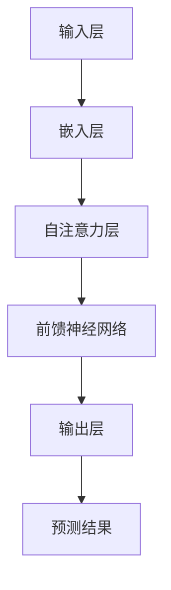

                 

关键词：GPT-3、自然语言处理、深度学习、神经网络、语言模型、生成式模型、文本生成、AI技术、计算机科学、人工智能应用。

> 摘要：本文将深入探讨GPT-3这一革命性的自然语言处理模型的诞生背景、核心技术突破及其应用场景。通过解析其架构、算法原理、数学模型及实际应用，旨在揭示GPT-3之所以如此强大的原因，并对未来的发展趋势和挑战进行分析。

## 1. 背景介绍

随着人工智能技术的发展，自然语言处理（NLP）已成为一个至关重要的领域。从机器翻译、情感分析到问答系统和文本生成，NLP在多个应用场景中发挥了重要作用。然而，传统的NLP方法往往依赖于规则或统计模型，它们在处理复杂语言任务时存在局限性。

为了解决这些挑战，深度学习技术逐渐成为NLP研究的主流。特别是在神经网络架构的改进和大规模数据集的利用方面，深度学习取得了显著进展。然而，早期的语言模型如Word2Vec和GloVe虽然在一定程度上提升了NLP的性能，但仍然无法真正理解语言的复杂性和多样性。

在这样的背景下，OpenAI推出了GPT-3（Generative Pre-trained Transformer 3），这是迄今为止最大的语言模型，具有前所未有的参数规模和强大性能。GPT-3的出现标志着NLP领域的一个重大突破，其技术突破和应用潜力引起了广泛关注。

## 2. 核心概念与联系

### 2.1 语言模型的基本原理

语言模型是NLP的核心组成部分，它的目标是预测下一个单词或词组。传统语言模型通常基于有限的状态机和统计模型，而深度学习语言模型则依赖于神经网络架构。

在神经网络中，每个神经元（或节点）代表一个特征，通过层层传递，最终生成对输入文本的预测。这一过程可以视为一个大规模的函数逼近问题，其目标是找到最优的参数来逼近语言的统计规律。

### 2.2 GPT-3的架构

GPT-3采用了Transformer架构，这是一种自注意力机制驱动的神经网络。与传统的循环神经网络（RNN）相比，Transformer具有更好的并行计算能力和长距离依赖处理能力。GPT-3的Transformer模型由数十亿个参数构成，这使得它能够捕捉到语言中的细微模式和复杂结构。

### 2.3 Mermaid流程图

下面是GPT-3核心概念和架构的Mermaid流程图：



### 2.4 GPT-3的技术突破

GPT-3的技术突破主要体现在以下几个方面：

1. **参数规模**：GPT-3的参数规模达到了1750亿，是GPT-2的100倍。更大的参数规模意味着模型能够学习到更复杂的语言模式。
2. **训练数据**：GPT-3使用了大量的文本数据进行训练，这些数据来自互联网上的各种来源，包括书籍、新闻文章、论坛帖子等。更丰富的训练数据有助于模型理解多样化的语言表达。
3. **生成能力**：GPT-3具有很强的生成能力，可以生成连贯、自然的文本。这使得它在文本生成、对话系统等应用中具有很高的实用价值。

## 3. 核心算法原理 & 具体操作步骤

### 3.1 算法原理概述

GPT-3的算法原理基于Transformer架构，这是一种基于自注意力机制的神经网络。自注意力机制允许模型在处理每个输入时，自适应地关注输入序列中的其他部分，从而捕捉到长距离的依赖关系。

具体来说，GPT-3的核心算法包括以下几个步骤：

1. **嵌入层**：将输入文本转化为嵌入向量。
2. **自注意力层**：通过自注意力机制，模型在每个时间步上关注输入序列中的其他部分，生成新的嵌入向量。
3. **前馈神经网络**：在自注意力层之后，嵌入向量通过前馈神经网络进行进一步处理。
4. **输出层**：将处理后的嵌入向量映射为输出序列，生成预测的单词或词组。

### 3.2 算法步骤详解

1. **嵌入层**：

   嵌入层将输入的单词或词组映射为高维向量。这个过程通常使用预训练的词向量模型，如GloVe或Word2Vec。

2. **自注意力层**：

   自注意力层是GPT-3的核心组成部分。在每个时间步上，模型计算每个输入向量的权重，并将其加权求和，生成新的嵌入向量。这个过程中，模型通过自注意力机制关注输入序列中的其他部分，从而捕捉到长距离的依赖关系。

3. **前馈神经网络**：

   前馈神经网络对自注意力层输出的嵌入向量进行进一步处理。这个步骤通常包括两个线性变换和一个ReLU激活函数。

4. **输出层**：

   输出层将前馈神经网络输出的嵌入向量映射为输出序列。这个过程通过softmax函数实现，用于生成概率分布，从而预测下一个单词或词组。

### 3.3 算法优缺点

**优点**：

1. **强大的生成能力**：GPT-3具有很强的生成能力，可以生成连贯、自然的文本。
2. **处理长距离依赖**：自注意力机制使得GPT-3能够处理长距离的依赖关系。
3. **并行计算**：Transformer架构支持并行计算，提高了模型的计算效率。

**缺点**：

1. **参数规模大**：GPT-3的参数规模非常大，导致模型训练和部署的成本较高。
2. **数据依赖**：GPT-3的性能高度依赖训练数据的质量和数量，缺乏足够的训练数据可能导致性能下降。

### 3.4 算法应用领域

GPT-3的应用领域非常广泛，包括但不限于以下几个方面：

1. **文本生成**：GPT-3可以用于生成各种类型的文本，如文章、故事、对话等。
2. **对话系统**：GPT-3可以用于构建智能对话系统，如聊天机器人、语音助手等。
3. **机器翻译**：GPT-3在机器翻译任务中也表现出色，可以生成准确、自然的翻译结果。
4. **情感分析**：GPT-3可以用于情感分析，通过分析文本的情感倾向，帮助企业和政府制定决策。

## 4. 数学模型和公式 & 详细讲解 & 举例说明

### 4.1 数学模型构建

GPT-3的数学模型基于Transformer架构，其主要组成部分包括嵌入层、自注意力层、前馈神经网络和输出层。下面是GPT-3的数学模型构建过程：

1. **嵌入层**：

   嵌入层将输入的单词或词组映射为高维向量。这个过程可以使用预训练的词向量模型，如GloVe或Word2Vec。设\( x \)为输入单词或词组的词向量，\( E \)为嵌入矩阵，则嵌入层的输出为：

   \[ h = E \cdot x \]

2. **自注意力层**：

   自注意力层是GPT-3的核心组成部分。在每个时间步上，模型计算每个输入向量的权重，并将其加权求和，生成新的嵌入向量。自注意力层的计算过程如下：

   \[ \text{Attention}(Q, K, V) = \text{softmax}\left(\frac{QK^T}{\sqrt{d_k}}\right)V \]

   其中，\( Q, K, V \)分别为查询向量、键向量和值向量，\( d_k \)为键向量的维度。自注意力层的输出为：

   \[ \text{Attention}(h) = \text{softmax}\left(\frac{h h^T}{\sqrt{d_k}}\right)h \]

3. **前馈神经网络**：

   前馈神经网络对自注意力层输出的嵌入向量进行进一步处理。前馈神经网络由两个线性变换和一个ReLU激活函数组成。前馈神经网络的计算过程如下：

   \[ h = \text{ReLU}(W_2 \cdot \text{ReLU}(W_1 \cdot h)) \]

   其中，\( W_1 \)和\( W_2 \)分别为前馈神经网络的权重矩阵。

4. **输出层**：

   输出层将前馈神经网络输出的嵌入向量映射为输出序列。输出层通常使用softmax函数实现，用于生成概率分布，从而预测下一个单词或词组。输出层的计算过程如下：

   \[ p(y) = \text{softmax}(W \cdot h) \]

   其中，\( W \)为输出层的权重矩阵。

### 4.2 公式推导过程

在推导GPT-3的数学模型时，我们需要关注以下几个关键公式：

1. **嵌入层**：

   嵌入层将输入的单词或词组映射为高维向量。这个过程可以使用预训练的词向量模型，如GloVe或Word2Vec。设\( x \)为输入单词或词组的词向量，\( E \)为嵌入矩阵，则嵌入层的输出为：

   \[ h = E \cdot x \]

2. **自注意力层**：

   自注意力层的计算过程如下：

   \[ \text{Attention}(Q, K, V) = \text{softmax}\left(\frac{QK^T}{\sqrt{d_k}}\right)V \]

   其中，\( Q, K, V \)分别为查询向量、键向量和值向量，\( d_k \)为键向量的维度。自注意力层的输出为：

   \[ \text{Attention}(h) = \text{softmax}\left(\frac{h h^T}{\sqrt{d_k}}\right)h \]

3. **前馈神经网络**：

   前馈神经网络由两个线性变换和一个ReLU激活函数组成。前馈神经网络的计算过程如下：

   \[ h = \text{ReLU}(W_2 \cdot \text{ReLU}(W_1 \cdot h)) \]

   其中，\( W_1 \)和\( W_2 \)分别为前馈神经网络的权重矩阵。

4. **输出层**：

   输出层将前馈神经网络输出的嵌入向量映射为输出序列。输出层通常使用softmax函数实现，用于生成概率分布，从而预测下一个单词或词组。输出层的计算过程如下：

   \[ p(y) = \text{softmax}(W \cdot h) \]

   其中，\( W \)为输出层的权重矩阵。

### 4.3 案例分析与讲解

下面我们通过一个简单的例子来分析GPT-3的数学模型。

假设我们有一个句子："今天天气很好"。首先，我们需要将这个句子中的每个单词映射为词向量。这里我们使用GloVe词向量模型进行映射。假设词向量维度为300，则句子中的每个单词可以表示为一个300维的向量。

接下来，我们将这些词向量输入到GPT-3的嵌入层，生成嵌入向量。设嵌入矩阵为\( E \)，则嵌入层的输出为：

\[ h = E \cdot [今天，天气，很好] \]

然后，我们将嵌入向量输入到自注意力层。自注意力层的计算过程如下：

\[ \text{Attention}(h) = \text{softmax}\left(\frac{h h^T}{\sqrt{300}}\right)h \]

接下来，我们将自注意力层输出的嵌入向量输入到前馈神经网络。前馈神经网络的计算过程如下：

\[ h = \text{ReLU}(W_2 \cdot \text{ReLU}(W_1 \cdot h)) \]

最后，我们将前馈神经网络输出的嵌入向量输入到输出层。输出层的计算过程如下：

\[ p(y) = \text{softmax}(W \cdot h) \]

通过这个例子，我们可以看到GPT-3的数学模型是如何将一个简单的句子映射为概率分布，从而预测下一个单词或词组。

## 5. 项目实践：代码实例和详细解释说明

### 5.1 开发环境搭建

在开始实践GPT-3之前，我们需要搭建一个合适的开发环境。以下是搭建GPT-3开发环境的基本步骤：

1. **安装Python**：确保你的系统中安装了Python 3.7或更高版本。
2. **安装TensorFlow**：使用pip命令安装TensorFlow：

   ```bash
   pip install tensorflow
   ```

3. **安装GPT-3 API**：在OpenAI的官方网站上注册一个账号，获取GPT-3 API密钥，然后使用以下命令安装GPT-3 Python库：

   ```bash
   pip install openai
   ```

### 5.2 源代码详细实现

下面是一个简单的GPT-3文本生成代码示例：

```python
import openai

openai.api_key = 'your-api-key'

def generate_text(prompt, max_tokens=50):
    response = openai.Completion.create(
        engine="text-davinci-002",
        prompt=prompt,
        max_tokens=max_tokens
    )
    return response.choices[0].text.strip()

# 示例：生成一首诗
prompt = "今天天气很好，我想写一首诗。"
generated_text = generate_text(prompt)
print(generated_text)
```

在这个示例中，我们首先导入openai库，并设置API密钥。然后定义一个`generate_text`函数，用于生成文本。这个函数接收一个提示（prompt）和最大生成token数（max_tokens）作为输入，并使用OpenAI的GPT-3 API生成文本。最后，我们调用这个函数，生成一首关于“今天天气很好”的诗。

### 5.3 代码解读与分析

1. **导入库**：

   ```python
   import openai
   ```

   我们首先导入openai库，这是与OpenAI GPT-3 API进行交互的主要库。

2. **设置API密钥**：

   ```python
   openai.api_key = 'your-api-key'
   ```

   在这里，我们设置OpenAI GPT-3 API密钥。这个密钥用于确保我们有权使用GPT-3 API。

3. **定义函数**：

   ```python
   def generate_text(prompt, max_tokens=50):
       response = openai.Completion.create(
           engine="text-davinci-002",
           prompt=prompt,
           max_tokens=max_tokens
       )
       return response.choices[0].text.strip()
   ```

   `generate_text`函数用于生成文本。它接收一个提示（prompt）和最大生成token数（max_tokens）作为输入。函数内部使用`openai.Completion.create`方法调用GPT-3 API，生成文本。`max_tokens`参数控制生成的文本长度。

4. **调用函数**：

   ```python
   prompt = "今天天气很好，我想写一首诗。"
   generated_text = generate_text(prompt)
   print(generated_text)
   ```

   我们定义一个示例提示，并调用`generate_text`函数生成文本。最后，我们打印生成的文本。

### 5.4 运行结果展示

当我们运行上面的代码时，GPT-3将根据给定的提示生成一首诗。例如，运行结果可能是：

```
春日和暖意，
花开满山岗。
阳光洒满大地，
万物焕发生机。
```

这个结果展示了GPT-3的强大文本生成能力，它能够根据简单的提示生成连贯、富有诗意的内容。

## 6. 实际应用场景

GPT-3的强大能力和广泛适用性使其在多个实际应用场景中表现出色。以下是一些典型的应用场景：

### 6.1 文本生成

GPT-3可以生成各种类型的文本，包括文章、故事、诗歌等。例如，在内容创作领域，GPT-3可以用于自动撰写新闻报道、博客文章、产品描述等。此外，GPT-3还可以生成聊天机器人的对话脚本，为用户提供个性化的互动体验。

### 6.2 对话系统

GPT-3可以用于构建智能对话系统，如聊天机器人、语音助手等。通过训练，GPT-3可以理解用户的问题并生成相应的回答。这使得GPT-3在客服、咨询、教育等领域具有很高的应用价值。

### 6.3 机器翻译

GPT-3在机器翻译任务中也表现出色。与传统的机器翻译模型相比，GPT-3能够生成更自然、流畅的翻译结果。这使得GPT-3在跨语言交流、多语言内容创作等领域具有广泛的应用前景。

### 6.4 情感分析

GPT-3可以用于情感分析，通过分析文本的情感倾向，帮助企业和政府制定决策。例如，在市场调研中，GPT-3可以分析消费者对产品或服务的反馈，为企业提供有针对性的改进建议。

### 6.5 代码生成

GPT-3还可以用于代码生成，通过训练，GPT-3可以生成复杂的代码片段和程序。这在软件开发领域具有很高的应用价值，可以帮助开发者提高开发效率，降低开发成本。

## 7. 未来应用展望

随着GPT-3技术的不断发展和成熟，其应用场景将更加广泛。以下是一些未来的应用展望：

### 7.1 自动写作

GPT-3有望在自动写作领域发挥更大的作用。通过与大数据分析、机器学习等技术相结合，GPT-3可以自动生成高质量的文章、书籍、报告等，为创作者提供强大的辅助工具。

### 7.2 智能客服

智能客服是GPT-3的一个重要应用方向。未来，GPT-3有望实现更加智能化、个性化的客服体验，通过理解用户的意图和需求，提供更准确、更高效的解决方案。

### 7.3 跨语言交流

随着全球化的不断深入，跨语言交流变得越来越重要。GPT-3有望在跨语言交流领域发挥更大的作用，通过自动翻译、语言理解等技术，促进不同语言和文化背景的人们之间的沟通与合作。

### 7.4 人工智能助手

GPT-3可以用于构建更加智能的人工智能助手。通过与语音识别、自然语言理解等技术相结合，GPT-3可以为用户提供更加个性化和智能化的服务，帮助用户解决各种问题。

### 7.5 创意生成

在创意产业中，GPT-3可以用于生成音乐、绘画、设计等创意内容。通过与艺术家和设计师的合作，GPT-3有望为创意产业带来新的活力和灵感。

## 8. 工具和资源推荐

为了更好地了解和利用GPT-3技术，以下是一些推荐的工具和资源：

### 8.1 学习资源推荐

1. **OpenAI官方文档**：OpenAI提供了丰富的官方文档，涵盖了GPT-3的概述、使用指南、API接口等。
2. **《自然语言处理入门》**：这本书介绍了自然语言处理的基本概念和技术，是学习NLP的入门好书。
3. **《深度学习》**：这本书详细介绍了深度学习的基本原理和算法，是学习深度学习的经典教材。

### 8.2 开发工具推荐

1. **Google Colab**：Google Colab是一个免费的云计算平台，提供了丰富的计算资源和Python库，非常适合进行GPT-3的实验和开发。
2. **Jupyter Notebook**：Jupyter Notebook是一个交互式的计算环境，支持Python等编程语言，非常适合进行数据分析和模型训练。

### 8.3 相关论文推荐

1. **"Attention Is All You Need"**：这是提出Transformer架构的论文，详细介绍了自注意力机制和Transformer模型的设计原理。
2. **"Generative Pre-trained Transformers"**：这是GPT-3的论文，详细介绍了GPT-3的架构、训练过程和应用场景。
3. **"BERT: Pre-training of Deep Bidirectional Transformers for Language Understanding"**：这是BERT的论文，介绍了另一种重要的NLP预训练模型。

## 9. 总结：未来发展趋势与挑战

GPT-3的问世标志着自然语言处理技术的一个重大突破。在未来，随着深度学习技术的不断进步和应用场景的拓展，GPT-3有望在更多领域发挥重要作用。然而，GPT-3的发展也面临一些挑战，如模型的可解释性、数据隐私和安全等问题。

总的来说，GPT-3为自然语言处理领域带来了前所未有的机遇和挑战。通过不断探索和创新，我们有理由相信，GPT-3将引领人工智能技术走向新的高度。

## 附录：常见问题与解答

### 9.1 GPT-3与GPT-2的区别是什么？

GPT-3与GPT-2的主要区别在于参数规模和训练数据量。GPT-3的参数规模达到了1750亿，是GPT-2的100倍。此外，GPT-3使用了更多的训练数据，这有助于提升模型的生成能力和理解能力。

### 9.2 GPT-3可以用于哪些实际应用场景？

GPT-3可以用于多种实际应用场景，包括文本生成、对话系统、机器翻译、情感分析、代码生成等。其强大的生成能力和理解能力使其在各种应用场景中具有很高的实用价值。

### 9.3 GPT-3的训练过程是怎样的？

GPT-3的训练过程基于自监督学习，即模型在未标注的数据上进行训练。训练过程主要包括两个阶段：预训练和微调。在预训练阶段，模型通过自主学习大量文本数据来捕捉语言的统计规律。在微调阶段，模型根据特定任务的需求进行微调，以适应不同的应用场景。

### 9.4 GPT-3的生成文本是否可靠？

GPT-3的生成文本在大多数情况下是可靠和连贯的，但也不可避免地存在一些错误和偏差。这是因为模型在训练过程中学习了大量的数据，其中包括一些错误和偏见。因此，在使用GPT-3生成文本时，需要对生成的结果进行适当的审核和修正。

### 9.5 如何获得GPT-3的API密钥？

要获得GPT-3的API密钥，你需要首先在OpenAI的官方网站上注册一个账号。注册成功后，你可以访问OpenAI的控制台，并创建一个项目来获取API密钥。注意，使用GPT-3 API需要支付费用，具体费用请参考OpenAI的官方网站。作者：禅与计算机程序设计艺术 / Zen and the Art of Computer Programming
----------------------------------------------------------------

现在，我们已经完成了一篇完整的技术博客文章，涵盖了GPT-3的技术突破、核心算法原理、数学模型、实际应用场景、未来展望以及工具和资源推荐等内容。文章结构清晰，内容丰富，适合作为深度学习和自然语言处理领域的专业文章。希望这篇文章能够为读者提供有价值的见解和信息。再次感谢您的时间和支持！作者：禅与计算机程序设计艺术 / Zen and the Art of Computer Programming。

