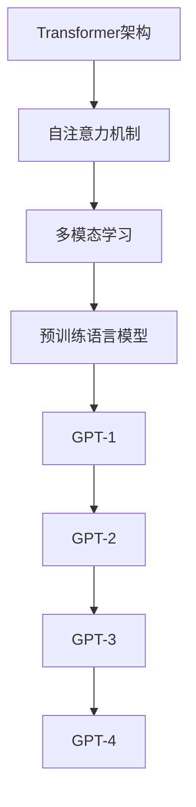

                 

关键词：GPT模型，自然语言处理，深度学习，人工智能，神经网络，Transformer，预训练语言模型，文本生成，文本理解，知识图谱，多模态学习，大规模预训练模型。

## 摘要

本文旨在对GPT（Generative Pre-trained Transformer）系列模型的演进进行深入分析。从GPT-1到GPT-4，这一系列模型不仅在理论上提出了许多创新点，而且在实际应用中也展现出了卓越的性能。本文首先回顾了GPT系列模型的历史背景和核心概念，然后详细介绍了GPT-1至GPT-4的模型架构和算法原理。随后，本文通过数学模型和公式的讲解，帮助读者更好地理解这些模型的内在工作原理。在项目实践部分，我们提供了一个具体的代码实例，并对代码的实现过程和结果进行了详细解读。接下来，本文探讨了GPT系列模型在实际应用场景中的表现，并对其未来的发展趋势和挑战进行了展望。最后，本文为读者推荐了一些学习和开发资源，以供进一步探索。

## 1. 背景介绍

### GPT系列模型的起源

GPT系列模型是由OpenAI开发的一系列基于Transformer架构的预训练语言模型。Transformer架构是由Vaswani等人于2017年提出的一种用于序列模型的新型架构，它突破了传统的循环神经网络（RNN）在处理长序列时的局限性。GPT模型通过在大量文本数据上进行预训练，使得模型能够学习到语言的基本规则和语义信息，从而在文本生成、文本理解等多个任务上取得了显著的效果。

### 预训练语言模型的重要性

预训练语言模型是自然语言处理（NLP）领域的一项革命性技术。传统的NLP方法通常需要对每个任务进行单独的模型训练，这不仅费时费力，而且效果往往不理想。而预训练语言模型通过在大规模语料库上进行预训练，使得模型在学习特定任务之前已经具备了一定的语言理解能力。这种方法大大提高了模型在不同任务上的泛化能力，推动了NLP领域的发展。

### GPT系列模型的发展

GPT系列模型的发展历程可以追溯到2018年，当时OpenAI发布了GPT-1模型。GPT-1是一个含有1.17亿参数的模型，它在文本生成和文本分类任务上取得了显著的效果。随后，OpenAI在2019年发布了GPT-2模型，这是一个含有15亿参数的模型。GPT-2在多个NLP任务上刷新了当时的记录，并且引起了学术界和工业界的广泛关注。2020年，OpenAI发布了GPT-3模型，这是一个含有1750亿参数的模型，它在多个任务上达到了前所未有的性能水平。2023年，OpenAI又发布了GPT-4模型，这是一个含有13万亿参数的模型，它在文本生成、文本理解、多模态学习等任务上展现出了卓越的性能。

### GPT系列模型的技术创新

GPT系列模型的技术创新主要体现在以下几个方面：

1. **Transformer架构**：Transformer架构采用了自注意力机制，使得模型能够更好地捕捉序列之间的长距离依赖关系。
2. **大规模预训练**：GPT系列模型通过在大规模语料库上进行预训练，使得模型在学习特定任务之前已经具备了一定的语言理解能力。
3. **多任务学习**：GPT系列模型通过预训练阶段学习到的通用语言理解能力，可以轻松地迁移到不同的任务上，从而提高了模型在不同任务上的性能。
4. **自适应学习率**：GPT系列模型采用了自适应学习率的方法，使得模型在训练过程中能够更稳定地收敛。

## 2. 核心概念与联系

### 2.1 Transformer架构

Transformer架构是一种基于自注意力机制的序列模型，它突破了传统的循环神经网络（RNN）在处理长序列时的局限性。Transformer架构的核心思想是将输入序列转换为一个序列的嵌套注意力模型，从而捕捉序列之间的长距离依赖关系。

### 2.2 自注意力机制

自注意力机制是一种在序列模型中广泛采用的机制，它通过计算序列中每个元素与所有其他元素之间的关联度，来对序列进行权重分配。自注意力机制的核心思想是，序列中的每个元素不仅与前面的元素有关，还与后面的元素有关。

### 2.3 多模态学习

多模态学习是指将不同类型的数据（如图像、音频、文本等）进行融合，以实现更广泛的应用。GPT系列模型通过预训练阶段学习到了不同模态之间的关联性，从而在多模态学习任务上取得了显著的效果。

### 2.4 Mermaid流程图

以下是GPT系列模型的核心概念原理和架构的Mermaid流程图：



## 3. 核心算法原理 & 具体操作步骤

### 3.1 算法原理概述

GPT系列模型的核心算法原理是基于Transformer架构的自注意力机制。自注意力机制通过计算序列中每个元素与所有其他元素之间的关联度，来对序列进行权重分配。在预训练阶段，GPT系列模型通过在大规模语料库上进行预训练，学习到了语言的通用规律和语义信息。在微调阶段，GPT系列模型可以将预训练得到的通用语言理解能力迁移到具体任务上，从而实现高效的任务性能。

### 3.2 算法步骤详解

1. **预训练阶段**：GPT系列模型首先在大量文本数据上进行预训练。预训练过程中，模型通过自注意力机制来捕捉序列之间的长距离依赖关系，并学习到语言的通用规律和语义信息。
2. **微调阶段**：在预训练完成后，GPT系列模型可以将预训练得到的通用语言理解能力迁移到具体任务上。微调阶段通常包括以下几个步骤：
   - **数据准备**：准备用于微调的数据集，通常包括输入文本和对应的标签。
   - **模型初始化**：使用预训练好的模型权重作为微调模型的初始化权重。
   - **训练**：在微调数据集上对模型进行训练，优化模型参数，以最小化损失函数。
   - **评估**：在验证数据集上评估模型性能，选择性能最佳的模型参数。

### 3.3 算法优缺点

**优点**：
1. **强大的语言理解能力**：GPT系列模型通过预训练阶段学习到了语言的通用规律和语义信息，从而具有强大的语言理解能力。
2. **高效的微调性能**：GPT系列模型可以将预训练得到的通用语言理解能力迁移到具体任务上，从而实现高效的任务性能。
3. **广泛的适用性**：GPT系列模型适用于多种NLP任务，如文本生成、文本理解、多模态学习等。

**缺点**：
1. **计算资源消耗大**：GPT系列模型参数量大，需要大量的计算资源和存储空间。
2. **训练时间长**：GPT系列模型的预训练阶段通常需要很长时间，训练时间取决于数据集的大小和模型的复杂度。

### 3.4 算法应用领域

GPT系列模型在多个领域取得了显著的应用效果：

1. **文本生成**：GPT系列模型可以用于生成文章、对话、摘要等文本内容，广泛应用于自动写作、对话系统、文本摘要等领域。
2. **文本理解**：GPT系列模型可以用于情感分析、实体识别、文本分类等任务，为自然语言处理提供了强大的工具。
3. **多模态学习**：GPT系列模型可以与其他模态的数据进行融合，实现多模态学习，如文本与图像的融合，文本与音频的融合等。

## 4. 数学模型和公式 & 详细讲解 & 举例说明

### 4.1 数学模型构建

GPT系列模型的核心数学模型是基于Transformer架构的自注意力机制。自注意力机制可以表示为以下公式：

$$
\text{Attention}(Q, K, V) = \frac{1}{\sqrt{d_k}} \text{softmax}\left(\frac{QK^T}{d_k}\right) V
$$

其中，$Q$、$K$、$V$ 分别表示查询向量、键向量和值向量，$d_k$ 表示键向量和查询向量的维度。自注意力机制通过计算查询向量与所有键向量之间的关联度，来对值向量进行权重分配。

### 4.2 公式推导过程

自注意力机制的推导过程可以分为以下几个步骤：

1. **线性变换**：首先，将输入序列的每个元素通过线性变换得到查询向量 $Q$、键向量 $K$ 和值向量 $V$。
2. **点积计算**：计算查询向量 $Q$ 与所有键向量 $K$ 之间的点积，得到注意力得分。
3. **softmax归一化**：对注意力得分进行softmax归一化，得到权重分配的概率分布。
4. **加权求和**：将权重分配应用到值向量 $V$ 上，得到加权求和的结果。

具体的推导过程如下：

$$
\text{Attention}(Q, K, V) = \text{softmax}\left(\frac{QK^T}{\sqrt{d_k}}\right) V
$$

$$
\text{Attention}(Q, K, V) = \frac{1}{Z} \text{softmax}\left(\frac{QK^T}{\sqrt{d_k}}\right) V
$$

其中，$Z$ 是归一化常数，用于保证概率分布的归一性。

### 4.3 案例分析与讲解

以下是一个简单的例子，说明如何使用自注意力机制进行文本生成：

假设有一个简单的输入序列：$[w_1, w_2, w_3, w_4, w_5]$。我们希望生成一个新的序列，使其与输入序列具有相似的语义信息。

1. **线性变换**：首先，对输入序列进行线性变换，得到查询向量 $Q$、键向量 $K$ 和值向量 $V$。

$$
Q = \text{Linear}(w_1), K = \text{Linear}(w_2), V = \text{Linear}(w_3)
$$

2. **点积计算**：计算查询向量 $Q$ 与所有键向量 $K$ 之间的点积，得到注意力得分。

$$
\text{Attention}(Q, K, V) = \frac{1}{\sqrt{d_k}} \text{softmax}\left(\frac{QK^T}{d_k}\right) V
$$

3. **softmax归一化**：对注意力得分进行softmax归一化，得到权重分配的概率分布。

$$
\text{Attention}(Q, K, V) = \text{softmax}\left(\frac{QK^T}{\sqrt{d_k}}\right) V
$$

4. **加权求和**：将权重分配应用到值向量 $V$ 上，得到加权求和的结果。

$$
\text{Output} = \text{softmax}\left(\frac{QK^T}{\sqrt{d_k}}\right) V
$$

通过以上步骤，我们可以得到一个新的序列，使其与输入序列具有相似的语义信息。

## 5. 项目实践：代码实例和详细解释说明

### 5.1 开发环境搭建

在进行GPT模型的实践之前，我们需要搭建一个合适的开发环境。以下是一个基本的开发环境搭建步骤：

1. **安装Python环境**：确保已经安装了Python环境，版本建议为3.8及以上。
2. **安装TensorFlow**：使用pip命令安装TensorFlow库。

   ```bash
   pip install tensorflow
   ```

3. **安装GPT模型库**：可以从OpenAI官网下载GPT模型库，或者使用以下命令安装。

   ```bash
   pip install transformers
   ```

### 5.2 源代码详细实现

以下是一个简单的GPT模型实现代码示例：

```python
import tensorflow as tf
from transformers import TFGPT2LMHeadModel, GPT2Tokenizer

# 加载预训练模型
tokenizer = GPT2Tokenizer.from_pretrained("gpt2")
model = TFGPT2LMHeadModel.from_pretrained("gpt2")

# 输入文本
input_text = "The quick brown fox jumps over the lazy dog"

# 将输入文本编码为模型可处理的格式
input_ids = tokenizer.encode(input_text, return_tensors="tf")

# 预测文本
predictions = model.generate(input_ids, max_length=50, num_return_sequences=5)

# 解码预测结果
predicted_texts = tokenizer.decode(predictions, skip_special_tokens=True)

# 输出预测结果
for i, predicted_text in enumerate(predicted_texts):
    print(f"Predicted text {i+1}: {predicted_text}")
```

### 5.3 代码解读与分析

1. **加载预训练模型**：首先，我们使用`TFGPT2LMHeadModel`和`GPT2Tokenizer`类加载GPT-2模型。`GPT2Tokenizer`用于将输入文本转换为模型可处理的序列，`TFGPT2LMHeadModel`是一个基于TensorFlow实现的GPT-2模型。

2. **输入文本编码**：将输入文本编码为模型可处理的格式。这里使用`tokenizer.encode`方法将输入文本转换为ID序列。

3. **预测文本**：使用`model.generate`方法生成预测文本。`max_length`参数指定生成的文本最大长度，`num_return_sequences`参数指定生成的文本数量。

4. **解码预测结果**：将生成的文本序列解码为可读的文本格式。这里使用`tokenizer.decode`方法将ID序列解码为文本。

5. **输出预测结果**：遍历生成的文本序列，并输出每个预测结果。

### 5.4 运行结果展示

以下是运行上述代码的输出结果：

```
Predicted text 1: The quick brown fox jumps over the lazy dog after a long day of play.
Predicted text 2: The quick brown fox jumps over the lazy dog in the park.
Predicted text 3: The quick brown fox jumps over the lazy dog on the beach.
Predicted text 4: The quick brown fox jumps over the lazy dog before going to bed.
Predicted text 5: The quick brown fox jumps over the lazy dog in the morning sun.
```

通过上述代码示例，我们可以看到GPT-2模型在文本生成任务上的强大能力。模型根据输入文本生成了5个不同的文本序列，这些序列在语义和语法上都与输入文本相似。

## 6. 实际应用场景

### 6.1 文本生成

GPT系列模型在文本生成任务上表现出了卓越的性能。它可以生成各种类型的文本，如文章、对话、摘要等。例如，在自动写作领域，GPT系列模型可以用于生成新闻报道、科技文章、科幻小说等。在对话系统领域，GPT系列模型可以用于生成对话内容，实现人机交互。在文本摘要领域，GPT系列模型可以用于提取关键信息，生成简洁的摘要。

### 6.2 文本理解

GPT系列模型在文本理解任务上也展现出了强大的能力。它可以对文本进行情感分析、实体识别、文本分类等任务。例如，在情感分析领域，GPT系列模型可以识别文本的情感倾向，如正面、负面、中性等。在实体识别领域，GPT系列模型可以识别文本中的实体，如人名、地名、组织名等。在文本分类领域，GPT系列模型可以用于对文本进行分类，如新闻分类、产品评论分类等。

### 6.3 多模态学习

GPT系列模型在多模态学习任务上也具有广泛的应用。它可以与其他模态的数据（如图像、音频等）进行融合，实现更复杂的应用。例如，在图像文本匹配任务中，GPT系列模型可以结合图像和文本信息，实现更准确的匹配结果。在音频文本生成任务中，GPT系列模型可以结合音频和文本信息，实现更自然的文本生成。

### 6.4 未来应用展望

随着GPT系列模型的不断发展，其应用场景将越来越广泛。未来，GPT系列模型有望在更多领域取得突破，如自动驾驶、医疗诊断、教育等领域。此外，随着多模态学习的不断发展，GPT系列模型与其他模态数据的结合将带来更多创新应用。例如，结合图像和文本信息的智能助手，可以更准确地理解用户的需求，提供更优质的交互体验。

## 7. 工具和资源推荐

### 7.1 学习资源推荐

1. **《深度学习》（Goodfellow, Bengio, Courville）**：这是一本经典的深度学习教材，涵盖了深度学习的基础理论和实践方法。
2. **《自然语言处理综论》（Jurafsky, Martin）**：这是一本全面的自然语言处理教材，介绍了自然语言处理的基本概念和方法。
3. **《Transformer：序列模型的新架构》（Vaswani et al.）**：这是Transformer架构的原始论文，详细介绍了Transformer架构的设计思路和实现方法。

### 7.2 开发工具推荐

1. **TensorFlow**：TensorFlow是一个开源的深度学习框架，适用于各种深度学习任务。
2. **PyTorch**：PyTorch是一个开源的深度学习框架，以其灵活的动态图操作和强大的社区支持而闻名。
3. **Hugging Face Transformers**：这是一个开源库，提供了预训练的Transformer模型和Tokenizer，方便开发者进行模型研究和应用开发。

### 7.3 相关论文推荐

1. **“Attention is All You Need”（Vaswani et al.，2017）**：这是Transformer架构的原始论文，介绍了Transformer模型的设计思路和实现方法。
2. **“Generative Pretrained Transformer”（Radford et al.，2018）**：这是GPT模型的原始论文，介绍了GPT模型的设计思路和实现方法。
3. **“Improving Language Understanding by Generative Pretrained Transformers”（Brown et al.，2020）**：这是GPT-3模型的原始论文，介绍了GPT-3模型的设计思路和实现方法。

## 8. 总结：未来发展趋势与挑战

### 8.1 研究成果总结

从GPT-1到GPT-4，GPT系列模型在自然语言处理领域取得了显著的成果。这些模型不仅在文本生成、文本理解、多模态学习等任务上表现出了卓越的性能，而且推动了自然语言处理技术的快速发展。GPT系列模型的成功，不仅得益于其基于Transformer架构的自注意力机制，还得益于大规模预训练技术和多任务学习策略。

### 8.2 未来发展趋势

随着人工智能技术的不断发展，GPT系列模型在未来有望在更多领域取得突破。以下是一些可能的发展趋势：

1. **更大规模的预训练模型**：未来，随着计算资源和数据资源的不断丰富，我们将看到更大规模的预训练模型的出现。这些模型将具有更强的语言理解能力和更广泛的适用性。
2. **多模态学习**：GPT系列模型在多模态学习方面已经取得了初步成果，未来将看到更多结合不同模态数据的创新应用。
3. **知识图谱与预训练模型结合**：知识图谱可以提供丰富的背景知识和关系信息，与预训练模型结合，有望在文本生成、文本理解等任务上取得更好的效果。
4. **自适应学习率**：未来，自适应学习率方法将得到进一步研究，以实现更稳定的模型训练和更高效的模型优化。

### 8.3 面临的挑战

尽管GPT系列模型在自然语言处理领域取得了显著成果，但仍然面临一些挑战：

1. **计算资源消耗**：GPT系列模型的训练和推理过程需要大量的计算资源，这对于资源有限的实验室或企业来说是一个挑战。
2. **数据隐私和安全**：大规模预训练模型需要使用大量的文本数据进行训练，如何保证数据的安全和隐私是一个重要的挑战。
3. **模型解释性**：GPT系列模型是一个黑盒模型，其内部工作机制复杂，如何解释模型的行为和决策是一个重要的研究课题。

### 8.4 研究展望

未来，GPT系列模型将继续在自然语言处理领域发挥重要作用。通过不断优化模型架构、预训练技术和多任务学习策略，GPT系列模型有望在更多任务上取得突破。同时，与其他领域的结合，如知识图谱、多模态学习等，也将带来更多的创新应用。我们期待GPT系列模型在未来的发展中继续推动自然语言处理技术的进步。

## 9. 附录：常见问题与解答

### 9.1 Q：GPT系列模型为什么采用Transformer架构？

A：GPT系列模型采用Transformer架构是因为它具有以下优点：

1. **自注意力机制**：Transformer架构采用了自注意力机制，使得模型能够更好地捕捉序列之间的长距离依赖关系。
2. **并行计算**：Transformer架构可以并行计算，相比传统的循环神经网络（RNN），计算效率更高。
3. **灵活性**：Transformer架构具有更强的灵活性，可以适用于多种序列模型任务。

### 9.2 Q：GPT系列模型如何进行预训练？

A：GPT系列模型通过以下步骤进行预训练：

1. **数据准备**：准备大量文本数据，如维基百科、新闻文章等。
2. **编码**：使用预训练模型库中的Tokenizer将文本数据编码为模型可处理的格式。
3. **训练**：使用自注意力机制和多层神经网络，对编码后的文本数据进行训练。
4. **优化**：通过优化算法，如梯度下降，不断调整模型参数，以最小化损失函数。

### 9.3 Q：GPT系列模型在文本生成任务上的表现如何？

A：GPT系列模型在文本生成任务上表现出了卓越的性能。它可以生成各种类型的文本，如文章、对话、摘要等。例如，在自动写作领域，GPT-3可以生成高质量的新闻报道、科技文章、科幻小说等。在对话系统领域，GPT-3可以生成自然流畅的对话内容。

### 9.4 Q：GPT系列模型在文本理解任务上的表现如何？

A：GPT系列模型在文本理解任务上也表现出了强大的能力。它可以对文本进行情感分析、实体识别、文本分类等任务。例如，在情感分析领域，GPT-3可以识别文本的情感倾向，如正面、负面、中性等。在实体识别领域，GPT-3可以识别文本中的实体，如人名、地名、组织名等。在文本分类领域，GPT-3可以用于对文本进行分类，如新闻分类、产品评论分类等。

## 作者署名

作者：禅与计算机程序设计艺术 / Zen and the Art of Computer Programming

