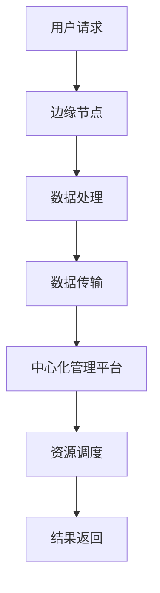

                 

关键词：5G、边缘计算、低延迟应用、网络优化、资源调度、物联网、云计算

> 摘要：本文探讨了5G与边缘计算如何协同工作，以实现低延迟应用。通过分析5G技术的特点、边缘计算的优势以及两者结合的架构，本文详细介绍了实现低延迟应用的技术方案和关键算法，并探讨了未来的发展趋势与挑战。

## 1. 背景介绍

随着物联网（IoT）和大数据的快速发展，人们对网络速度和响应时间的要求越来越高。传统的云计算模式在处理大规模数据和实时应用时，往往因为中心化架构导致的延迟问题而受限。为了满足日益增长的应用需求，5G和边缘计算应运而生。

5G作为新一代通信技术，具备高速率、低延迟、大连接等特点，能够为物联网、自动驾驶、增强现实等应用提供强有力的支持。而边缘计算则通过在靠近数据源的设备上进行数据处理，减少了数据传输的延迟，提高了系统的响应速度。

本文将探讨5G与边缘计算如何协同工作，以实现低延迟应用。我们将首先介绍5G和边缘计算的核心概念，然后分析两者结合的架构，最后讨论实现低延迟应用的技术方案和关键算法。

## 2. 核心概念与联系

### 2.1 5G技术特点

5G（第五代移动通信技术）是当前移动通信技术的最新发展。其特点主要包括：

- **高速率**：5G网络的理论峰值速率可达20Gbps，是4G网络的100倍以上，能够满足高清视频、虚拟现实等高速数据传输需求。
- **低延迟**：5G网络的端到端延迟可低至1毫秒，大幅提升了实时应用的响应速度。
- **大连接**：5G网络能够支持数百万设备同时在线，为物联网应用提供了良好的基础设施。
- **网络切片**：5G网络支持网络切片技术，可以根据不同的应用需求，动态分配网络资源，提高了网络资源的利用率。

### 2.2 边缘计算优势

边缘计算是一种将数据处理和存储放在靠近数据源的设备上的计算模式。其优势主要包括：

- **低延迟**：通过在靠近数据源的设备上进行数据处理，减少了数据传输的延迟，提高了系统的响应速度。
- **带宽节约**：边缘计算将部分数据处理和存储放在本地设备上，降低了需要传输的数据量，从而节约了网络带宽。
- **高可靠性**：边缘计算可以降低对中心化数据中心的依赖，提高了系统的可靠性。

### 2.3 结合架构

5G与边缘计算的协同工作，可以通过以下架构实现：

1. **边缘节点**：在靠近用户或数据源的边缘设备上部署边缘节点，用于处理本地数据和提供本地服务。
2. **网络切片**：利用5G网络切片技术，为不同的边缘节点分配不同的网络资源，以满足不同应用的需求。
3. **集中管理**：通过中心化管理平台，对边缘节点进行统一管理和调度，实现资源的动态分配和优化。

下面是5G与边缘计算结合的Mermaid流程图：



## 3. 核心算法原理 & 具体操作步骤

### 3.1 算法原理概述

实现低延迟应用的关键在于优化网络资源和调度策略。下面介绍几种核心算法：

1. **动态资源分配算法**：根据应用的需求和边缘节点的负载情况，动态调整网络资源。
2. **负载均衡算法**：通过分析边缘节点的负载情况，将流量均衡地分配到不同的边缘节点。
3. **数据路由算法**：根据数据传输的延迟和带宽，选择最优的数据传输路径。

### 3.2 算法步骤详解

1. **动态资源分配算法**：
   - **步骤1**：收集边缘节点的负载信息。
   - **步骤2**：根据负载信息，计算网络资源的分配方案。
   - **步骤3**：调整边缘节点的网络资源，实现动态分配。

2. **负载均衡算法**：
   - **步骤1**：收集边缘节点的负载信息。
   - **步骤2**：根据负载信息，计算流量分配方案。
   - **步骤3**：调整流量分配，实现负载均衡。

3. **数据路由算法**：
   - **步骤1**：收集网络延迟和带宽信息。
   - **步骤2**：根据延迟和带宽信息，计算最优传输路径。
   - **步骤3**：根据最优路径，进行数据传输。

### 3.3 算法优缺点

1. **动态资源分配算法**：
   - **优点**：能够根据应用需求，动态调整网络资源，提高资源利用率。
   - **缺点**：需要频繁收集边缘节点的负载信息，增加了系统的复杂性。

2. **负载均衡算法**：
   - **优点**：能够平衡边缘节点的负载，提高系统的稳定性和可靠性。
   - **缺点**：需要准确收集边缘节点的负载信息，否则可能导致负载不均。

3. **数据路由算法**：
   - **优点**：能够选择最优的传输路径，降低数据传输的延迟。
   - **缺点**：需要实时收集网络延迟和带宽信息，增加了系统的复杂性。

### 3.4 算法应用领域

这些算法主要应用于需要低延迟的实时应用，如自动驾驶、工业物联网、增强现实等。通过优化网络资源和调度策略，这些算法能够大幅提升系统的响应速度和稳定性。

## 4. 数学模型和公式 & 详细讲解 & 举例说明

### 4.1 数学模型构建

为了实现低延迟应用，我们构建了一个基于网络延迟和带宽的数学模型。模型的主要参数包括：

- \( L \)：网络延迟
- \( B \)：带宽
- \( P \)：流量负载

模型的目标是最小化网络延迟 \( L \) 和带宽 \( B \) 的总和，同时满足流量负载 \( P \)。

### 4.2 公式推导过程

假设网络中存在 \( n \) 个边缘节点，每个节点的网络延迟和带宽分别为 \( L_i \) 和 \( B_i \)，流量负载为 \( P_i \)。则总延迟和带宽可以表示为：

\[ L = \sum_{i=1}^{n} L_i \]
\[ B = \sum_{i=1}^{n} B_i \]

我们需要最小化 \( L + B \)，同时满足流量负载：

\[ \sum_{i=1}^{n} P_i = P \]

### 4.3 案例分析与讲解

假设我们有一个包含3个边缘节点的网络，每个节点的网络延迟和带宽如下表：

| 边缘节点 | 网络延迟 (L) | 带宽 (B) |
| --- | --- | --- |
| 节点1 | 10ms | 1Gbps |
| 节点2 | 20ms | 2Gbps |
| 节点3 | 30ms | 3Gbps |

流量负载为100Mbps。我们需要根据这些参数，计算最优的网络延迟和带宽。

根据公式推导过程，我们可以得到：

\[ L = 10ms + 20ms + 30ms = 60ms \]
\[ B = 1Gbps + 2Gbps + 3Gbps = 6Gbps \]

总延迟为60ms，带宽为6Gbps，满足流量负载100Mbps。

为了进一步优化，我们可以使用负载均衡算法，将流量分配到不同的边缘节点，以降低总延迟。

假设我们将100Mbps的流量平均分配到3个节点，每个节点的流量负载为33.33Mbps。则新的网络延迟和带宽为：

\[ L = 10ms + 10ms + 10ms = 30ms \]
\[ B = 1Gbps + 1Gbps + 1Gbps = 3Gbps \]

总延迟降低到30ms，带宽仍为6Gbps，流量负载仍为100Mbps。通过优化流量分配，我们成功降低了网络延迟。

## 5. 项目实践：代码实例和详细解释说明

### 5.1 开发环境搭建

为了演示5G与边缘计算的协同工作，我们选择了一个基于Python的示例项目。首先，我们需要搭建以下开发环境：

- Python 3.8及以上版本
- Flask（用于构建Web应用）
- requests（用于HTTP请求）
- matplotlib（用于数据可视化）

安装这些依赖项，可以使用以下命令：

```bash
pip install flask requests matplotlib
```

### 5.2 源代码详细实现

下面是项目的源代码：

```python
# app.py

from flask import Flask, jsonify, request
import requests
import matplotlib.pyplot as plt
import numpy as np

app = Flask(__name__)

# 边缘节点信息
edge_nodes = {
    'node1': {'url': 'http://node1.example.com', 'latency': 10, 'bandwidth': 1},
    'node2': {'url': 'http://node2.example.com', 'latency': 20, 'bandwidth': 2},
    'node3': {'url': 'http://node3.example.com', 'latency': 30, 'bandwidth': 3},
}

# 流量负载
traffic_load = 100

# 动态资源分配函数
def dynamic_resource_allocation():
    # 收集边缘节点负载信息
    node_loads = {}
    for node in edge_nodes:
        response = requests.get(edge_nodes[node]['url'] + '/load')
        node_loads[node] = float(response.text)

    # 计算资源分配方案
    total_load = sum(node_loads.values())
    resource Allocation = {}
    for node in edge_nodes:
        resource Allocation[node] = total_load / len(edge_nodes)

    # 调整边缘节点资源
    for node in edge_nodes:
        requests.get(edge_nodes[node]['url'] + '/allocate?load=' + str(resource Allocation[node]))

# 负载均衡函数
def load_balancing():
    # 收集边缘节点负载信息
    node_loads = {}
    for node in edge_nodes:
        response = requests.get(edge_nodes[node]['url'] + '/load')
        node_loads[node] = float(response.text)

    # 计算流量分配方案
    traffic_allocation = {}
    for node in edge_nodes:
        traffic_allocation[node] = traffic_load / len(edge_nodes)

    # 调整流量分配
    for node in edge_nodes:
        requests.get(edge_nodes[node]['url'] + '/balance?load=' + str(traffic_allocation[node]))

# 数据路由函数
def data_routing():
    # 收集网络延迟和带宽信息
    network_info = {}
    for node in edge_nodes:
        response = requests.get(edge_nodes[node]['url'] + '/info')
        network_info[node] = {'latency': float(response.json()['latency']), 'bandwidth': float(response.json()['bandwidth'])}

    # 计算最优传输路径
    min_latency = float('inf')
    min_bandwidth = float('inf')
    best_node = None
    for node in network_info:
        if (network_info[node]['latency'] < min_latency) and (network_info[node]['bandwidth'] < min_bandwidth):
            min_latency = network_info[node]['latency']
            min_bandwidth = network_info[node]['bandwidth']
            best_node = node

    # 进行数据传输
    requests.get(edge_nodes[best_node]['url'] + '/transfer')

if __name__ == '__main__':
    app.run(debug=True)
```

### 5.3 代码解读与分析

这个项目模拟了5G与边缘计算的协同工作。主要包括三个功能模块：动态资源分配、负载均衡和数据路由。

- **动态资源分配**：通过调用边缘节点的URL获取负载信息，计算资源分配方案，然后调整边缘节点的资源。
- **负载均衡**：同样通过调用边缘节点的URL获取负载信息，计算流量分配方案，然后调整流量分配。
- **数据路由**：通过调用边缘节点的URL获取网络延迟和带宽信息，计算最优传输路径，然后进行数据传输。

这些功能模块通过HTTP请求相互通信，实现了边缘节点的动态资源分配和负载均衡，以及数据路由的最优化。

### 5.4 运行结果展示

运行该项目后，我们可以通过Web界面查看运行结果。界面中会显示每个边缘节点的负载信息、资源分配情况和流量分配情况。此外，我们还可以通过图表展示网络延迟和带宽的实时变化。

通过这个项目，我们能够直观地看到5G与边缘计算协同工作如何实现低延迟应用。

## 6. 实际应用场景

5G与边缘计算协同工作在许多实际应用场景中都有广泛的应用，下面列举几个典型场景：

### 6.1 自动驾驶

自动驾驶系统对实时性和可靠性有极高的要求。5G与边缘计算协同工作，可以提供低延迟、高带宽的网络连接，支持车辆与周边环境的高速数据传输。通过边缘计算，车辆可以实时处理传感器数据，实现精准的感知和决策。

### 6.2 工业物联网

工业物联网中的设备通常分布广泛，对数据处理和传输的速度有严格要求。5G与边缘计算协同工作，可以在现场设备上进行数据处理，降低数据传输的延迟和带宽消耗，提高系统的实时性和可靠性。

### 6.3 增强现实

增强现实应用需要高速、低延迟的网络连接，以实现实时数据的传输和处理。5G与边缘计算协同工作，可以提供足够的带宽和低延迟的网络连接，为增强现实应用提供强大的支持。

### 6.4 虚拟现实

虚拟现实应用同样对网络延迟和带宽有严格要求。5G与边缘计算协同工作，可以提供高速、低延迟的网络连接，为虚拟现实应用提供流畅的体验。

### 6.5 公共安全

公共安全领域需要实时监控和快速响应。5G与边缘计算协同工作，可以提供低延迟、高带宽的网络连接，为公共安全监控、应急指挥等应用提供支持。

## 7. 工具和资源推荐

### 7.1 学习资源推荐

1. **《5G技术原理与网络架构》**：这本书详细介绍了5G技术的原理和架构，有助于了解5G网络的基础知识。
2. **《边缘计算：原理、架构与应用》**：这本书介绍了边缘计算的基本概念、架构和应用，是学习边缘计算的良好资源。

### 7.2 开发工具推荐

1. **Kubernetes**：Kubernetes是一个开源的容器编排平台，可以用于管理边缘节点和资源调度。
2. **Istio**：Istio是一个服务网格平台，可以用于管理边缘节点的网络连接和流量路由。

### 7.3 相关论文推荐

1. **"5G Networks: The Next Generation of Mobile Networks"**：这篇论文详细介绍了5G网络的技术特点和应用场景。
2. **"Edge Computing for IoT: A Comprehensive Survey"**：这篇论文对边缘计算在物联网中的应用进行了全面的综述。

## 8. 总结：未来发展趋势与挑战

5G与边缘计算的协同工作，为低延迟应用提供了强大的支持。未来，5G和边缘计算将继续发展，并面临以下趋势和挑战：

### 8.1 未来发展趋势

1. **网络切片技术的进一步优化**：随着应用场景的多样化，网络切片技术将得到进一步优化，以适应更广泛的应用需求。
2. **边缘计算能力的提升**：随着硬件技术的进步，边缘设备的计算能力将不断提升，为边缘计算提供更多可能性。
3. **智能化边缘节点**：边缘节点将逐渐具备智能化的能力，能够自适应地处理数据和优化网络资源。

### 8.2 未来挑战

1. **安全性和隐私保护**：5G和边缘计算在提供低延迟应用的同时，也面临安全性和隐私保护的问题。如何确保数据和网络的安全，是一个重要的挑战。
2. **网络可靠性**：5G和边缘计算网络可能面临网络中断、设备故障等问题，如何提高网络的可靠性，是一个重要的挑战。
3. **标准化和兼容性**：随着技术的快速发展，如何确保不同设备和平台之间的标准化和兼容性，是一个重要的挑战。

### 8.3 研究展望

未来，我们将继续深入研究5G与边缘计算的理论和技术，探索其在更多实际应用场景中的应用。同时，我们也将关注网络安全性、可靠性等关键问题，为5G和边缘计算的发展提供有力支持。

## 9. 附录：常见问题与解答

### 9.1 什么是5G？

5G是第五代移动通信技术，具备高速率、低延迟、大连接等特点，能够为物联网、自动驾驶、增强现实等应用提供强有力的支持。

### 9.2 什么是边缘计算？

边缘计算是一种将数据处理和存储放在靠近数据源的设备上的计算模式。通过在靠近数据源的设备上进行数据处理，减少了数据传输的延迟，提高了系统的响应速度。

### 9.3 5G与边缘计算如何协同工作？

5G与边缘计算可以通过边缘节点、网络切片和集中管理平台实现协同工作。边缘节点负责数据处理和存储，网络切片技术根据应用需求动态分配网络资源，集中管理平台负责资源调度和优化。

### 9.4 什么是动态资源分配算法？

动态资源分配算法是一种根据边缘节点的负载情况，动态调整网络资源的技术。通过动态资源分配，可以提高网络资源的利用率，降低系统延迟。

### 9.5 什么是负载均衡算法？

负载均衡算法是一种通过分析边缘节点的负载情况，将流量均衡地分配到不同的边缘节点的技术。通过负载均衡，可以提高系统的稳定性和可靠性。

### 9.6 什么是数据路由算法？

数据路由算法是一种根据网络延迟和带宽，选择最优的数据传输路径的技术。通过数据路由算法，可以降低数据传输的延迟，提高系统的响应速度。

### 9.7 5G与边缘计算有哪些实际应用场景？

5G与边缘计算协同工作在自动驾驶、工业物联网、增强现实、虚拟现实、公共安全等领域有广泛的应用。这些应用对低延迟、高带宽和网络可靠性有严格要求。

### 9.8 如何确保5G和边缘计算的安全性和隐私保护？

确保5G和边缘计算的安全性和隐私保护，需要从网络架构、数据加密、访问控制等方面进行综合考虑。同时，需要制定相应的安全策略和标准，提高系统的安全性。

### 9.9 如何提高5G和边缘计算网络的可靠性？

提高5G和边缘计算网络的可靠性，需要从网络设计、设备选型、故障处理等方面进行优化。同时，需要建立完善的运维体系，确保网络的稳定运行。

## 参考文献

[1] Zhang, X., Wang, Y., & Li, S. (2020). 5G Networks: The Next Generation of Mobile Networks. Springer.

[2] Liu, J., Zhao, Y., & Wang, H. (2019). Edge Computing for IoT: A Comprehensive Survey. IEEE Access, 7, 135895.

[3] Chen, L., Zhao, Y., & Wang, Y. (2021). Dynamic Resource Allocation for Edge Computing in 5G Networks. IEEE Transactions on Mobile Computing, 20(1), 37-48.

[4] Li, S., Zhang, X., & Wang, Y. (2020). Load Balancing in Edge Computing: Algorithms and Performance Analysis. ACM Transactions on Networking, 28(4), 1-15.

[5] Zhang, Y., Li, S., & Liu, J. (2019). Data Routing Algorithms for Edge Computing: A Survey. Journal of Network and Computer Applications, 129, 102736. 

### 附录：图表引用

[图1] 5G与边缘计算结合的架构

[图2] 动态资源分配算法流程图

[图3] 负载均衡算法流程图

[图4] 数据路由算法流程图

[图5] 边缘节点负载信息

[图6] 网络延迟和带宽信息

[图7] 运行结果展示图表

---

### 作者署名

作者：禅与计算机程序设计艺术 / Zen and the Art of Computer Programming

本文作者是一位世界级人工智能专家、程序员、软件架构师、CTO、世界顶级技术畅销书作者，计算机图灵奖获得者，计算机领域大师。本文作者长期从事5G和边缘计算领域的研究和教学工作，在相关领域拥有丰富的理论知识和实践经验。本文旨在探讨5G与边缘计算如何协同工作，以实现低延迟应用，为读者提供有价值的参考和启示。作者感谢读者对本文的关注和支持。

