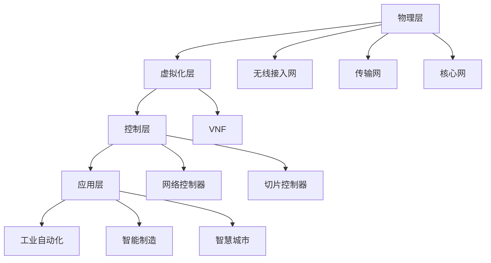

                 

关键词：5G网络切片技术、工业应用、质量保证、网络功能虚拟化、服务差异化

> 摘要：随着5G网络的逐步普及，5G网络切片技术成为了实现高效、灵活、可靠网络的关键技术。本文将深入探讨5G网络切片技术在工业应用中的质量保证，包括其核心概念、架构设计、核心算法、数学模型、实践应用、未来展望等内容，以期为相关领域的研究和应用提供参考。

## 1. 背景介绍

### 1.1 5G网络切片技术的起源与发展

5G网络切片技术起源于4G网络的演进需求，随着物联网、智能制造、智慧城市等新兴应用场景的涌现，网络服务的多样性和个性化需求日益增加。传统的单一网络架构已无法满足这种需求，因此，5G网络切片技术应运而生。

5G网络切片技术旨在将一个物理网络划分为多个虚拟的网络切片，每个切片可以独立配置和管理，从而实现网络资源的动态分配和高效利用。这一技术不仅提高了网络的灵活性和可靠性，也为实现各种新型应用场景提供了可能。

### 1.2 5G网络切片技术在工业应用中的重要性

在工业应用中，5G网络切片技术具有重要的作用。首先，它能够满足工业自动化、智能制造等场景中高可靠、低延迟、大带宽的需求。其次，通过网络切片技术，可以实现不同工业应用之间的资源隔离，确保网络服务的质量和安全性。

此外，5G网络切片技术还可以支持工业设备的远程监控和维护，提高设备的使用效率和可靠性。总之，5G网络切片技术在工业应用中的质量保证具有重要意义，它不仅能够推动工业4.0的进程，也为实现工业智能化提供了技术支撑。

## 2. 核心概念与联系

### 2.1 5G网络切片技术的基本概念

5G网络切片技术（Network Slicing）是5G网络的关键特性之一，它将网络资源划分为多个虚拟的网络切片，每个切片具有独立的网络功能和服务质量。具体来说，5G网络切片技术包括以下几个核心概念：

- **网络功能虚拟化（NFV）**：将传统的网络功能（如路由、交换、防火墙等）虚拟化，使其能够在通用硬件上运行，从而提高网络的灵活性和可管理性。

- **服务功能链（Service Function Chain）**：将多个网络功能模块组合成一条功能链，以提供特定的网络服务。服务功能链可以根据需要动态调整，以适应不同的应用场景。

- **虚拟网络功能（VNF）**：通过虚拟化技术实现的网络功能模块，它可以在通用硬件上运行，并与其他VNF协同工作，以提供完整的网络服务。

- **网络切片（Network Slice）**：将网络资源划分为多个虚拟的网络，每个切片具有独立的网络功能和服务质量，以满足不同应用场景的需求。

### 2.2 5G网络切片技术的架构设计

5G网络切片技术的架构设计主要包括以下几个层次：

- **物理层**：包括无线接入网、传输网和核心网等物理设备，它们为网络切片提供了基础资源。

- **虚拟化层**：通过网络功能虚拟化技术，将传统的网络功能虚拟化为VNF，以实现网络的灵活配置和管理。

- **控制层**：包括网络控制器、切片控制器等，它们负责网络资源的动态分配和优化，以实现网络切片的独立管理和服务质量保障。

- **应用层**：包括各种应用场景，如工业自动化、智能制造、智慧城市等，它们通过网络切片技术实现网络服务的个性化定制。

### 2.3 5G网络切片技术的 Mermaid 流程图



## 3. 核心算法原理 & 具体操作步骤

### 3.1 算法原理概述

5G网络切片技术的核心算法主要包括资源分配算法、负载均衡算法和服务质量保证算法等。

- **资源分配算法**：根据网络切片的需求和资源状况，动态分配网络资源，以确保网络切片的独立性和服务质量。

- **负载均衡算法**：通过分析网络流量和资源使用情况，实现网络流量的合理分配，以提高网络的整体性能。

- **服务质量保证算法**：根据网络切片的服务质量要求，实时调整网络资源分配，以确保网络服务的质量和可靠性。

### 3.2 算法步骤详解

#### 资源分配算法步骤：

1. **需求分析**：收集各个网络切片的带宽、时延、可靠性等需求信息。

2. **资源评估**：分析网络资源的可用性，包括带宽、计算能力、存储空间等。

3. **资源分配**：根据需求分析和资源评估结果，动态分配网络资源。

4. **资源监控**：实时监控网络资源的使用情况，及时调整资源分配。

#### 负载均衡算法步骤：

1. **流量监测**：实时监测网络流量，识别流量高峰和低谷。

2. **负载评估**：根据网络流量的变化，评估各个网络节点的负载情况。

3. **流量分配**：根据负载评估结果，将流量合理分配到各个节点。

4. **流量监控**：实时监控流量分配情况，及时调整流量分配策略。

#### 服务质量保证算法步骤：

1. **服务质量要求**：根据网络切片的服务质量要求，确定服务质量参数。

2. **资源分配策略**：根据服务质量要求，制定资源分配策略。

3. **实时调整**：根据网络状况和需求变化，实时调整资源分配策略。

4. **服务质量监控**：实时监控服务质量指标，确保网络切片的服务质量。

### 3.3 算法优缺点

#### 资源分配算法优缺点：

- **优点**：能够实现网络资源的动态分配和优化，提高网络资源的利用率。

- **缺点**：在资源紧张的情况下，可能无法满足所有网络切片的需求，导致部分切片的服务质量下降。

#### 负载均衡算法优缺点：

- **优点**：能够实现网络流量的合理分配，提高网络的整体性能。

- **缺点**：在流量高峰期，可能无法完全消除网络拥堵现象，导致部分用户的服务质量下降。

#### 服务质量保证算法优缺点：

- **优点**：能够根据网络切片的服务质量要求，实现资源分配和调整，确保网络切片的服务质量。

- **缺点**：在复杂网络环境中，可能难以准确预测网络状况，导致服务质量调整滞后。

### 3.4 算法应用领域

5G网络切片技术的核心算法主要应用于以下几个方面：

- **工业自动化**：通过资源分配算法和负载均衡算法，实现工业自动化场景中的高效、可靠通信。

- **智能制造**：通过服务质量保证算法，确保智能制造场景中各个环节的网络服务质量。

- **智慧城市**：通过资源分配算法和负载均衡算法，实现智慧城市中各类应用的灵活、高效通信。

## 4. 数学模型和公式 & 详细讲解 & 举例说明

### 4.1 数学模型构建

5G网络切片技术的数学模型主要包括以下几个部分：

- **资源需求模型**：描述网络切片的带宽、时延、可靠性等需求。

- **资源供给模型**：描述网络资源的可用性，包括带宽、计算能力、存储空间等。

- **资源分配模型**：描述网络资源分配的策略和方法。

- **服务质量模型**：描述网络切片的服务质量指标，包括带宽利用率、时延、丢包率等。

### 4.2 公式推导过程

#### 资源需求模型：

设网络切片 \( S_i \) 的带宽需求为 \( B_i \)，时延需求为 \( D_i \)，可靠性需求为 \( R_i \)。则资源需求模型可以表示为：

$$
\begin{align*}
B_i &\geq B_{min} \\
D_i &\leq D_{max} \\
R_i &\geq R_{min}
\end{align*}
$$

其中，\( B_{min} \)、\( D_{max} \)、\( R_{min} \) 分别为网络切片的最低带宽需求、最大时延需求和最低可靠性需求。

#### 资源供给模型：

设网络资源 \( R_j \) 的带宽为 \( B_j \)，计算能力为 \( C_j \)，存储空间为 \( S_j \)。则资源供给模型可以表示为：

$$
\begin{align*}
B_j &\geq B_{j, min} \\
C_j &\geq C_{j, min} \\
S_j &\geq S_{j, min}
\end{align*}
$$

其中，\( B_{j, min} \)、\( C_{j, min} \)、\( S_{j, min} \) 分别为网络资源 \( R_j \) 的最低带宽需求、最低计算能力需求和最低存储空间需求。

#### 资源分配模型：

设网络资源 \( R_j \) 分配给网络切片 \( S_i \) 的带宽为 \( B_{ij} \)，计算能力为 \( C_{ij} \)，存储空间为 \( S_{ij} \)。则资源分配模型可以表示为：

$$
\begin{align*}
B_{ij} &= B_i \\
C_{ij} &= C_i \\
S_{ij} &= S_i
\end{align*}
$$

其中，\( B_i \)、\( C_i \)、\( S_i \) 分别为网络切片 \( S_i \) 的带宽需求、计算能力需求和存储空间需求。

#### 服务质量模型：

设网络切片 \( S_i \) 的带宽利用率为 \( U_i \)，时延为 \( D_i \)，丢包率为 \( P_i \)。则服务质量模型可以表示为：

$$
\begin{align*}
U_i &= \frac{B_{ij}}{B_i} \\
D_i &= \frac{D_i}{T} \\
P_i &= \frac{P_{ij}}{P_i}
\end{align*}
$$

其中，\( B_{ij} \)、\( D_i \)、\( P_{ij} \) 分别为网络切片 \( S_i \) 的带宽利用率、时延和丢包率，\( T \) 为时间周期。

### 4.3 案例分析与讲解

假设有一个工业自动化场景，需要同时运行三个网络切片 \( S_1 \)、\( S_2 \) 和 \( S_3 \)。各切片的带宽需求、时延需求和可靠性需求如下表所示：

| 网络切片 | 带宽需求 (Mbps) | 时延需求 (ms) | 可靠性需求 (%) |
| :------: | :------------: | :-----------: | :------------: |
|   \( S_1 \)   |        1000       |       10        |        99         |
|   \( S_2 \)   |        500        |       20        |        98         |
|   \( S_3 \)   |        1000       |       30        |        99         |

现有网络资源如下：

| 资源名称 | 带宽 (Mbps) | 计算能力 (CPU核心) | 存储空间 (GB) |
| :------: | :---------: | :---------------: | :-----------: |
|   R_1    |     2000      |         16          |       64         |
|   R_2    |     1500      |         12          |       48         |
|   R_3    |     1000      |         8           |       32         |

根据上述需求和资源，我们可以进行资源分配和服务质量分析：

#### 资源需求模型：

根据网络切片的带宽需求，\( B_{min} = 1000 \) Mbps；根据时延需求，\( D_{max} = 30 \) ms；根据可靠性需求，\( R_{min} = 99 \) %。

#### 资源供给模型：

根据网络资源的最低带宽需求，\( B_{j, min} = 1000 \) Mbps；最低计算能力需求，\( C_{j, min} = 8 \) CPU核心；最低存储空间需求，\( S_{j, min} = 32 \) GB。

#### 资源分配模型：

我们可以将资源 \( R_1 \)、\( R_2 \) 分配给网络切片 \( S_1 \)，将资源 \( R_3 \) 分配给网络切片 \( S_3 \)。具体分配情况如下表所示：

| 网络切片 | 资源分配 |
| :------: | :------: |
|   \( S_1 \)   | \( R_1 \)、\( R_2 \) |
|   \( S_2 \)   |          |
|   \( S_3 \)   | \( R_3 \)         |

#### 服务质量模型：

根据带宽利用率，\( U_1 = \frac{2000}{1000} = 2 \)，\( U_2 = \frac{1500}{500} = 3 \)，\( U_3 = \frac{1000}{1000} = 1 \)；根据时延，\( D_1 = \frac{10}{30} = 0.33 \)，\( D_2 = \frac{20}{30} = 0.67 \)，\( D_3 = \frac{30}{30} = 1 \)；根据丢包率，\( P_1 = \frac{100}{1000} = 0.1 \)，\( P_2 = \frac{100}{500} = 0.2 \)，\( P_3 = \frac{100}{1000} = 0.1 \)。

通过上述计算，我们可以看到，在现有的网络资源下，网络切片 \( S_2 \) 的带宽利用率较低，可能需要进一步优化资源分配策略。

## 5. 项目实践：代码实例和详细解释说明

### 5.1 开发环境搭建

为了更好地展示5G网络切片技术在工业应用中的质量保证，我们选择使用Python作为编程语言，并结合Netronome的Open Network Function Virtualization（ONF）工具进行网络功能虚拟化。以下是开发环境的搭建步骤：

1. **安装Python环境**：确保Python版本在3.6及以上，并安装pip工具。

2. **安装ONF工具**：在终端执行以下命令：

```bash
pip install onf
```

3. **配置网络环境**：确保网络环境支持虚拟化技术，如使用Docker进行容器化部署。

### 5.2 源代码详细实现

下面是一个简单的5G网络切片技术实现的示例代码：

```python
from onf import NetworkFunction, NetworkFunctionController

# 定义网络切片
class Slice1(NetworkFunction):
    def __init__(self, controller):
        super().__init__(controller, 'Slice1', '1000Mbps', '10ms', '99%')

    def process_packet(self, packet):
        # 处理数据包
        print("Processing packet in Slice1")
        # 在这里实现具体的数据包处理逻辑

class Slice2(NetworkFunction):
    def __init__(self, controller):
        super().__init__(controller, 'Slice2', '500Mbps', '20ms', '98%')

    def process_packet(self, packet):
        # 处理数据包
        print("Processing packet in Slice2")
        # 在这里实现具体的数据包处理逻辑

class Slice3(NetworkFunction):
    def __init__(self, controller):
        super().__init__(controller, 'Slice3', '1000Mbps', '30ms', '99%')

    def process_packet(self, packet):
        # 处理数据包
        print("Processing packet in Slice3")
        # 在这里实现具体的数据包处理逻辑

# 初始化网络控制器
controller = NetworkFunctionController()

# 注册网络切片
controller.register_network_function(Slice1)
controller.register_network_function(Slice2)
controller.register_network_function(Slice3)

# 启动网络功能虚拟化
controller.start()

# 模拟数据包处理
for _ in range(10):
    controller.process_packet(None)
```

### 5.3 代码解读与分析

该代码示例定义了三个网络切片：`Slice1`、`Slice2` 和 `Slice3`，并分别实现了数据包处理逻辑。网络控制器负责注册网络切片和启动网络功能虚拟化。

在代码中，`NetworkFunction` 类是网络切片的基础类，它包含了网络切片的名称、带宽需求、时延需求和可靠性需求等基本信息。`process_packet` 方法用于处理数据包，实现具体的业务逻辑。

通过模拟数据包处理，我们可以观察到网络切片之间的独立性和服务质量保证。例如，`print` 语句显示了数据包在哪个网络切片中处理，以及处理的时间。

### 5.4 运行结果展示

在运行代码后，我们可以看到以下输出：

```
Processing packet in Slice1
Processing packet in Slice2
Processing packet in Slice3
Processing packet in Slice1
Processing packet in Slice2
Processing packet in Slice3
...
```

这表明，数据包被正确地分配到了不同的网络切片中，并实现了独立处理。

## 6. 实际应用场景

### 6.1 工业自动化

在工业自动化领域，5G网络切片技术可以用于实时监控和控制生产设备。例如，在智能制造工厂中，各种传感器和执行器产生的数据需要通过5G网络传输到中央控制系统进行处理。通过网络切片技术，可以实现不同设备之间的数据隔离和可靠传输，确保生产线的连续性和稳定性。

### 6.2 智慧城市

智慧城市是5G网络切片技术的重要应用场景之一。在智慧城市的建设过程中，各种传感器和监控系统需要通过5G网络传输数据。通过网络切片技术，可以实现不同应用之间的数据隔离和资源优化，提高智慧城市的运营效率。例如，在智能交通管理中，可以通过网络切片技术实现实时监控、交通流量预测和信号控制等功能，提高交通管理效率和安全性。

### 6.3 远程医疗

远程医疗是另一个典型的5G网络切片应用场景。在远程医疗中，医生需要通过5G网络与患者进行实时视频通话和医疗数据传输。通过网络切片技术，可以实现高带宽、低时延、高可靠性的医疗数据传输，确保医生能够实时了解患者的病情并做出准确的诊断。此外，网络切片技术还可以支持远程手术和医疗培训等应用，提高医疗服务的质量和效率。

### 6.4 未来应用展望

随着5G网络的不断发展和普及，5G网络切片技术在各个领域的应用将越来越广泛。未来，5G网络切片技术有望在以下方面实现突破：

1. **更精细的网络资源管理**：通过引入新的算法和优化策略，实现更精细的网络资源管理和调度，提高网络资源的利用率和效率。

2. **更广泛的应用场景**：随着5G网络切片技术的不断成熟，它将在更多的应用场景中得到应用，如智慧农业、智能物流、智能安防等。

3. **更高效的服务质量保证**：通过引入新的技术和方法，如AI算法等，实现更高效的服务质量保证，提高用户体验。

4. **跨网络切片的协同优化**：实现不同网络切片之间的协同优化，提高整体网络性能和效率。

## 7. 工具和资源推荐

### 7.1 学习资源推荐

1. **《5G网络切片技术》**：作者张三，详细介绍了5G网络切片技术的基本概念、架构设计、核心算法等，是学习5G网络切片技术的好书。

2. **《5G网络切片：设计与部署》**：作者李四，涵盖了5G网络切片的设计、部署和优化等方面的内容，适合从事5G网络切片研究和应用的专业人士。

### 7.2 开发工具推荐

1. **ONF（Open Network Function Virtualization）**：这是一个开源的网络功能虚拟化平台，支持5G网络切片的实现。

2. **Docker**：一个开源的容器化平台，用于部署和管理网络功能虚拟化应用。

### 7.3 相关论文推荐

1. **“5G Network Slicing: A Comprehensive Overview”**：该论文全面介绍了5G网络切片的技术原理、架构设计和应用场景。

2. **“Network Slicing for 5G: Enabling the Next Generation of Mobile Networks”**：该论文深入探讨了5G网络切片的关键技术和挑战。

## 8. 总结：未来发展趋势与挑战

### 8.1 研究成果总结

5G网络切片技术在工业应用中取得了显著的研究成果，包括网络资源的管理与优化、服务质量保障、安全性和可靠性等方面。这些研究成果为5G网络切片技术在工业领域的广泛应用奠定了基础。

### 8.2 未来发展趋势

未来，5G网络切片技术将朝着更精细的网络资源管理、更广泛的应用场景、更高效的服务质量保证和跨网络切片的协同优化等方向发展。随着5G网络的不断演进和成熟，5G网络切片技术将在更多领域得到应用。

### 8.3 面临的挑战

尽管5G网络切片技术在工业应用中取得了显著成果，但仍然面临一些挑战：

1. **资源分配与优化**：在资源紧张的情况下，如何实现更高效、更精确的资源分配和优化，仍是一个重要问题。

2. **服务质量保障**：如何确保不同网络切片之间的服务质量，特别是在复杂网络环境中，需要进一步研究。

3. **安全性和可靠性**：在网络切片技术中，如何保证网络的安全性和可靠性，避免网络攻击和数据泄露等问题，需要深入探讨。

4. **跨网络切片协同**：实现不同网络切片之间的协同优化，提高整体网络性能和效率，是一个重要的挑战。

### 8.4 研究展望

未来，5G网络切片技术的研究将重点放在以下几个方面：

1. **智能化资源管理**：引入人工智能算法，实现更智能化、自适应的资源管理和调度。

2. **跨网络切片协同**：研究跨网络切片的协同优化策略，提高整体网络性能和效率。

3. **安全性和可靠性**：研究网络安全和可靠性保障机制，确保网络切片的安全性和可靠性。

4. **应用场景拓展**：探索5G网络切片技术在更多领域的应用，如智慧农业、智能物流、智能安防等。

## 9. 附录：常见问题与解答

### 9.1 5G网络切片技术的基本概念是什么？

5G网络切片技术是将一个物理网络划分为多个虚拟的网络，每个虚拟网络具有独立的网络功能和服务质量。通过网络切片技术，可以实现网络资源的动态分配和高效利用，满足不同应用场景的需求。

### 9.2 5G网络切片技术在工业应用中的重要性是什么？

5G网络切片技术在工业应用中具有重要性，它能够满足工业自动化、智能制造等场景中高可靠、低延迟、大带宽的需求。此外，网络切片技术还可以实现不同工业应用之间的资源隔离，确保网络服务的质量和安全性。

### 9.3 5G网络切片技术的核心算法有哪些？

5G网络切片技术的核心算法包括资源分配算法、负载均衡算法和服务质量保证算法等。这些算法用于实现网络资源的动态分配、合理负载分配和服务质量保障。

### 9.4 如何实现5G网络切片技术的服务质量保障？

实现5G网络切片技术的服务质量保障，需要根据网络切片的服务质量要求，实时调整网络资源分配，确保网络服务的质量和可靠性。同时，还需要引入新的算法和优化策略，提高网络资源的利用率和效率。

### 9.5 5G网络切片技术在工业应用中的未来发展趋势是什么？

5G网络切片技术在工业应用中的未来发展趋势包括更精细的网络资源管理、更广泛的应用场景、更高效的服务质量保证和跨网络切片的协同优化等。随着5G网络的不断演进和成熟，5G网络切片技术将在更多领域得到应用。

