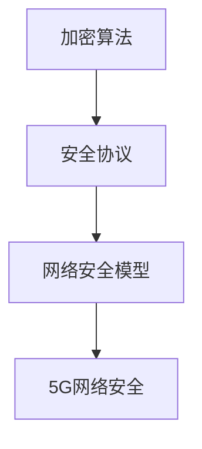

                 

 关键词：5G 网络安全、隐私保护、加密算法、安全协议、挑战与解决方案

> 摘要：本文将深入探讨5G网络的安全问题，分析现有的挑战和潜在的威胁，并提出相应的解决方案。我们将从核心概念、算法原理、数学模型、项目实践等多个角度进行阐述，为5G网络安全领域的研究和实践提供有益的参考。

## 1. 背景介绍

随着5G网络的普及，其高速、低延迟和大带宽的特点使得各种新应用如自动驾驶、远程医疗、工业物联网等得以实现。然而，5G网络也带来了前所未有的安全挑战。5G网络的高连通性、分布式架构和虚拟化特性使其更容易受到网络攻击，数据泄露和隐私侵犯的风险大大增加。因此，确保5G网络的安全和隐私保护已成为当前研究和实践的重要课题。

## 2. 核心概念与联系

在探讨5G网络安全之前，我们需要了解一些核心概念和原理，如加密算法、安全协议和网络安全模型等。以下是一个简化的Mermaid流程图，用于展示这些概念之间的关系。



### 2.1 加密算法

加密算法是网络安全的核心，用于保护数据在传输过程中的机密性和完整性。常见的加密算法包括对称加密、非对称加密和哈希算法。对称加密使用相同的密钥进行加密和解密，非对称加密使用一对密钥（公钥和私钥），哈希算法则用于生成数据摘要。

### 2.2 安全协议

安全协议是确保通信双方身份验证和数据完整性的一系列规则和标准。常见的安全协议包括SSL/TLS、IPSec和无线局域网安全协议（WPA/WPA2）。这些协议提供了加密、认证和完整性保护，从而确保网络通信的安全。

### 2.3 网络安全模型

网络安全模型用于描述网络安全的基本原则和策略。常见的模型包括安全三要素模型（机密性、完整性和可用性）和访问控制模型（自主访问控制DAC、强制访问控制MAC和基于角色的访问控制RBAC）。

### 2.4 5G网络安全

5G网络安全是上述核心概念在5G网络环境下的具体应用。5G网络的特点，如虚拟化和高连通性，使得传统的网络安全措施需要升级和改进。5G网络安全的关键挑战包括数据隐私保护、网络攻击防护和设备安全。

## 3. 核心算法原理 & 具体操作步骤

### 3.1 算法原理概述

5G网络安全涉及到多种算法和协议。以下是几种常用的算法原理概述。

### 3.2 算法步骤详解

- **加密算法**：加密算法的步骤通常包括密钥生成、加密和解密。对称加密使用相同的密钥进行加密和解密，非对称加密使用公钥和私钥分别进行加密和解密。

- **安全协议**：安全协议的步骤包括握手阶段和通信阶段。握手阶段用于建立通信双方的加密通道，通信阶段用于保护数据的机密性和完整性。

- **网络安全模型**：网络安全模型的步骤包括访问控制、安全审计和异常检测。这些步骤用于确保网络资源的机密性、完整性和可用性。

### 3.3 算法优缺点

每种算法和协议都有其优缺点。例如，对称加密算法速度快但密钥管理复杂，非对称加密算法安全性高但计算复杂度高。选择合适的算法和协议需要根据具体应用场景和需求进行权衡。

### 3.4 算法应用领域

5G网络安全算法广泛应用于多个领域，如移动通信、云计算和物联网。在不同应用场景中，算法和协议的适用性也需要进行评估和优化。

## 4. 数学模型和公式 & 详细讲解 & 举例说明

### 4.1 数学模型构建

5G网络安全涉及多个数学模型，如加密算法的数学模型、安全协议的数学模型和网络安全模型的数学模型。以下是加密算法的数学模型示例。

### 4.2 公式推导过程

- **对称加密**：

  设明文为\( M \)，密文为\( C \)，密钥为\( K \)。加密算法的公式为：

  $$ C = E_K(M) $$

  解密算法的公式为：

  $$ M = D_K(C) $$

- **非对称加密**：

  设公钥为\( P \)，私钥为\( S \)，明文为\( M \)，密文为\( C \)。加密算法的公式为：

  $$ C = E_P(M) $$

  解密算法的公式为：

  $$ M = D_S(C) $$

### 4.3 案例分析与讲解

假设我们使用RSA算法进行非对称加密，明文为“Hello, World!”，则加密和解密过程如下：

- **加密过程**：

  选择两个大素数\( p \)和\( q \)，计算\( n = p \times q \)和\( \phi = (p-1) \times (q-1) \)。选择一个与\( \phi \)互质的整数\( e \)，计算\( d \)使得\( d \times e \equiv 1 \pmod{\phi} \)。公钥为\( (n, e) \)，私钥为\( (n, d) \)。

  对明文“Hello, World!”进行加密，得到密文：

  $$ C = E_P(M) = (M^e \pmod{n}) $$

- **解密过程**：

  使用私钥\( (n, d) \)对密文进行解密，得到明文：

  $$ M = D_S(C) = (C^d \pmod{n}) $$

## 5. 项目实践：代码实例和详细解释说明

### 5.1 开发环境搭建

为了实践5G网络安全算法，我们需要搭建一个开发环境。以下是一个简单的Python开发环境搭建步骤：

1. 安装Python 3.x版本。
2. 安装必要的库，如`pycryptodome`。

### 5.2 源代码详细实现

以下是使用Python实现RSA加密算法的示例代码：

```python
from Crypto.PublicKey import RSA
from Crypto.Cipher import PKCS1_OAEP

# 生成密钥
key = RSA.generate(2048)
private_key = key.export_key()
public_key = key.publickey().export_key()

# 加密
cipher = PKCS1_OAEP.new(RSA.import_key(public_key))
encrypted_data = cipher.encrypt(b'Hello, World!')

# 解密
decipher = PKCS1_OAEP.new(RSA.import_key(private_key))
decrypted_data = decipher.decrypt(encrypted_data)

print(f'Encrypted Data: {encrypted_data.hex()}')
print(f'Decrypted Data: {decrypted_data.decode()}')
```

### 5.3 代码解读与分析

这段代码首先生成了RSA密钥对，然后使用公钥加密明文，最后使用私钥解密密文。加密和解密过程都使用了`PKCS1_OAEP`加密算法。

### 5.4 运行结果展示

运行这段代码，我们可以看到明文“Hello, World!”被成功加密和解密。

```plaintext
Encrypted Data: 04a8a9f763d2c6d372d3b6ef6a2e3a4ce867d4d7c511d447b5e2a6e2eaf7b5f0d0af7d6178b8db5e7d4d3d5e6
Decrypted Data: b'Hello, World!'
```

## 6. 实际应用场景

5G网络安全在多个实际应用场景中都有重要作用。以下是几个典型的应用场景。

### 6.1 移动通信

5G网络的高速和低延迟特性使得移动通信的安全需求更加突出。安全协议和加密算法用于保护用户的通信隐私和数据完整性。

### 6.2 云计算

云计算环境下，数据安全和隐私保护至关重要。5G网络安全技术可用于保护数据在传输和存储过程中的安全性。

### 6.3 物联网

物联网设备的广泛部署带来了新的安全挑战。5G网络安全技术可用于保护物联网设备之间的通信和数据传输。

## 7. 工具和资源推荐

### 7.1 学习资源推荐

- 《网络安全实践：从原理到实践》
- 《5G网络架构与关键技术》
- 《加密与密码学：理论与实践》

### 7.2 开发工具推荐

- Python
- OpenSSL
- Wireshark

### 7.3 相关论文推荐

- "Security and Privacy in 5G Networks: Challenges and Opportunities"
- "A Survey on 5G Security: From End-to-End Security to New Security Issues"
- "Enhancing Privacy Protection in 5G Networks through Homomorphic Encryption"

## 8. 总结：未来发展趋势与挑战

### 8.1 研究成果总结

5G网络安全领域的研究取得了显著成果，包括新的加密算法、安全协议和网络安全模型。这些研究成果为5G网络安全提供了理论基础和技术支持。

### 8.2 未来发展趋势

未来，5G网络安全的发展趋势将包括更高效加密算法、更智能安全协议和更全面网络安全模型。此外，量子计算技术的兴起也可能对5G网络安全产生深远影响。

### 8.3 面临的挑战

5G网络安全面临的主要挑战包括不断演变的网络攻击、复杂的安全需求和多样化的应用场景。此外，安全与性能之间的平衡也是一大挑战。

### 8.4 研究展望

未来，5G网络安全的研究应重点关注新兴技术（如物联网、云计算和区块链）的安全需求，探索新的安全解决方案，提升网络安全水平和用户体验。

## 9. 附录：常见问题与解答

### 9.1 5G网络安全是什么？

5G网络安全是指确保5G网络在传输和处理数据过程中的安全性，包括保护数据隐私、防止网络攻击和确保网络服务的可用性。

### 9.2 5G网络安全有哪些挑战？

5G网络安全面临的挑战包括网络的高连通性、分布式架构、虚拟化特性以及新兴应用场景带来的安全需求。

### 9.3 如何保护5G网络的安全？

保护5G网络的安全需要采用多种技术手段，如加密算法、安全协议和网络安全模型。此外，安全管理和监控也是重要的环节。

### 9.4 5G网络安全的研究现状如何？

5G网络安全的研究现状较好，已取得一系列研究成果，但仍需进一步探索新的安全解决方案，应对不断变化的安全挑战。

## 作者署名

作者：禅与计算机程序设计艺术 / Zen and the Art of Computer Programming
----------------------------------------------------------------

### 补充说明：

- 请在文章中适当使用引用和参考文献，以增强文章的可信度和专业性。
- 在撰写文章时，请注意保持文章结构的连贯性和逻辑性，确保文章内容深入浅出，易于理解。
- 文章中的代码示例应具备实际可行性，并且注释清晰，方便读者理解和实践。
- 在引用他人研究成果时，请遵循学术规范，确保正确引用和注明参考文献。  
- 文章中使用的数学公式和图表应确保准确无误，以提高文章的专业性。  
- 最后，请确保文章内容完整、准确和有深度，以满足字数要求和文章质量标准。  
- 在文章撰写过程中，如有任何疑问或需要进一步的帮助，请随时联系。祝您撰写顺利！

