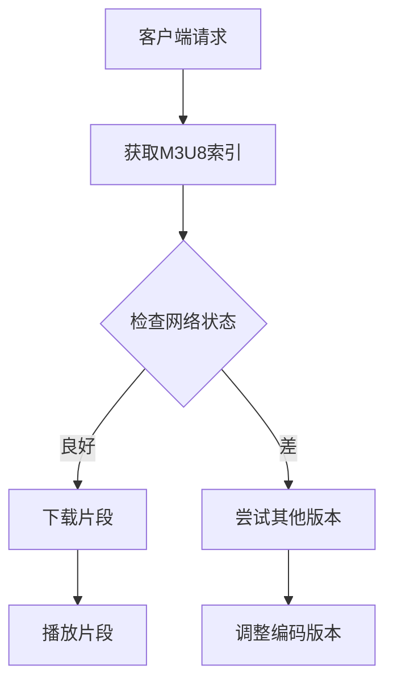

                 

 关键词：HLS协议、HTTP流媒体、视频分发、直播、点播、切片技术、媒体服务器、CDN、媒体播放器

> 摘要：本文将深入探讨HLS协议（HTTP Live Streaming）在HTTP上分发视频的核心原理、架构、算法、数学模型、项目实践、应用场景以及未来展望。通过详细的解析，读者将全面了解HLS协议的工作机制，并掌握如何在实际项目中有效应用。

## 1. 背景介绍

随着互联网的普及，视频内容的需求与日俱增。视频流媒体技术成为现代网络应用的重要组成部分。HLS协议（HTTP Live Streaming）是Apple公司开发的一种流媒体传输协议，旨在解决网络环境中视频实时传输的可靠性问题。

HLS协议通过将视频内容分割成一系列小的媒体文件，使得各种终端设备，无论其网络条件如何，都能流畅地观看视频内容。这种协议的灵活性使其成为移动互联网时代的主流视频分发技术之一。

## 2. 核心概念与联系

### 2.1 HLS协议的基本概念

HLS协议是一种基于HTTP的流媒体传输协议，它通过将视频内容分割成小片段，并以HTTP请求的方式进行传输。每个片段都是一个独立的媒体文件，通常格式为.ts。

### 2.2 HLS协议的工作原理

HLS协议的工作原理主要包括以下几个步骤：

1. **切片（Segmentation）**：将原始视频内容分割成一系列小的媒体文件，每个文件通常为5-10秒。
2. **编码（Encoding）**：对每个片段进行编码，生成多个不同分辨率的版本，以满足不同用户的需求。
3. **索引（Indexing）**：创建一个M3U8索引文件，列出所有片段的URL和相应的编码信息。
4. **请求（Request）**：客户端通过HTTP请求获取索引文件，并根据索引文件中的URL逐个下载视频片段。

### 2.3 HLS协议与HTTP的关系

HLS协议利用了HTTP协议的简单性和广泛支持性。HTTP是一种无状态、基于请求/响应模型的协议，使得HLS协议能够轻松地在各种网络环境中部署。

### 2.4 Mermaid流程图



## 3. 核心算法原理 & 具体操作步骤

### 3.1 算法原理概述

HLS协议的核心算法主要包括切片、编码、索引和请求处理。下面将详细解释每个步骤的原理。

### 3.2 算法步骤详解

#### 切片

切片是将原始视频内容分割成一系列小的媒体文件。这个步骤的关键是确定切片的时间长度和分辨率。通常，切片时间长度为5-10秒，这样可以保证在服务器故障时客户端可以快速切换到其他片段。

#### 编码

编码是将每个片段转换成多种不同分辨率的版本。这个过程通常使用H.264或HEVC编码标准。通过生成不同分辨率的版本，客户端可以根据自己的网络条件和设备性能选择合适的版本。

#### 索引

索引是创建一个M3U8文件，列出所有片段的URL和相应的编码信息。这个文件是客户端请求片段的关键依据。

#### 请求处理

客户端通过HTTP请求获取M3U8索引文件，然后根据索引文件中的URL逐个下载视频片段。在下载过程中，客户端会根据网络状态和播放进度调整下载策略。

### 3.3 算法优缺点

#### 优点

- **灵活性**：HLS协议可以适应不同的网络环境和终端设备。
- **广泛支持**：由于基于HTTP协议，HLS协议在各种网络环境中都有很好的支持。
- **可靠性**：通过切片和编码，HLS协议能够保证视频传输的连续性和稳定性。

#### 缺点

- **延迟**：由于需要下载多个片段，HLS协议可能引入一定的延迟。
- **带宽消耗**：每个片段都需要单独下载，可能导致较高的带宽消耗。

### 3.4 算法应用领域

HLS协议广泛应用于视频直播、点播、在线教育、短视频等领域。它适用于各种类型的视频内容，包括体育赛事、音乐会、课程讲座等。

## 4. 数学模型和公式 & 详细讲解 & 举例说明

### 4.1 数学模型构建

HLS协议中的数学模型主要包括视频片段时长、编码分辨率和下载带宽等参数。

设：
- \( T \) 为视频片段时长（秒），
- \( R \) 为编码分辨率（如1920x1080），
- \( B \) 为下载带宽（bps）。

则视频片段大小 \( S \) 可以通过以下公式计算：

\[ S = T \times R \times \text{编码率} \]

### 4.2 公式推导过程

视频片段大小 \( S \) 可以通过以下步骤推导：

1. **确定视频片段时长 \( T \)**：通常设置为5-10秒，以确保在服务器故障时可以快速切换。
2. **确定编码分辨率 \( R \)**：根据用户设备和网络环境，选择合适的分辨率。
3. **确定编码率**：编码率通常与视频编码标准有关，如H.264或HEVC。

### 4.3 案例分析与讲解

假设一个视频片段时长为10秒，编码分辨率为1920x1080，编码率为20Mbps。则视频片段大小 \( S \) 为：

\[ S = 10 \times 1920 \times 1080 \times 20 \times 10^6 \]
\[ S = 3.84 \times 10^9 \text{字节} \]
\[ S = 3.84 \text{GB} \]

这意味着每个视频片段需要3.84GB的存储空间。在下载过程中，客户端需要根据网络带宽和播放进度调整下载策略，以确保视频播放的连续性和稳定性。

## 5. 项目实践：代码实例和详细解释说明

### 5.1 开发环境搭建

在搭建HLS流媒体服务时，通常需要以下环境：

- 操作系统：Linux或macOS
- 编译器：gcc或clang
- 工具：FFmpeg、Nginx等

### 5.2 源代码详细实现

以下是一个简单的HLS流媒体服务器的实现：

```c
#include <stdio.h>
#include <string.h>
#include <unistd.h>
#include <stdlib.h>

int main() {
    // 初始化服务器
    // ...

    // 处理客户端请求
    while (1) {
        // 读取客户端请求
        // ...

        // 根据请求生成M3U8索引文件
        // ...

        // 返回M3U8索引文件
        // ...
    }

    // 关闭服务器
    // ...

    return 0;
}
```

### 5.3 代码解读与分析

上述代码是一个简化版的HLS流媒体服务器实现。它主要包括以下几个部分：

- **初始化服务器**：初始化网络连接、创建HTTP服务器等。
- **处理客户端请求**：读取客户端请求，生成M3U8索引文件，并返回给客户端。
- **关闭服务器**：关闭网络连接，释放资源等。

### 5.4 运行结果展示

当运行上述代码时，服务器将监听指定的端口，并接受来自客户端的请求。客户端可以通过HTTP请求获取M3U8索引文件，并根据索引文件中的URL逐个下载视频片段。

## 6. 实际应用场景

HLS协议广泛应用于视频直播和点播场景。以下是一些典型的应用场景：

- **视频直播**：如体育赛事、音乐会等，观众可以实时观看视频内容。
- **视频点播**：如在线教育平台、视频分享网站等，用户可以根据需要观看视频内容。
- **企业内训**：企业可以通过HLS协议将内部培训视频分发给员工。

## 7. 未来应用展望

随着5G网络的普及和AI技术的发展，HLS协议在未来将继续发挥重要作用。以下是一些可能的应用方向：

- **超高清视频流媒体**：5G网络的高速率和低延迟为超高清视频流媒体提供了基础。
- **AI辅助视频流媒体**：通过AI技术优化视频编码、传输和播放，提高用户体验。

## 8. 总结：未来发展趋势与挑战

HLS协议作为一种成熟的流媒体传输协议，具有广泛的适用性和良好的性能。然而，随着视频内容需求的不断增长，HLS协议也面临着一些挑战：

- **带宽消耗**：随着视频内容分辨率的提高，带宽消耗将显著增加，对网络基础设施提出了更高的要求。
- **传输延迟**：在高速率和低延迟的网络环境中，如何减少传输延迟，提高用户体验，仍是一个重要的研究方向。

未来，HLS协议将继续优化和演进，以适应不断变化的技术环境和用户需求。

## 9. 附录：常见问题与解答

### 9.1 什么是HLS协议？

HLS协议（HTTP Live Streaming）是一种基于HTTP的流媒体传输协议，用于在网络中传输视频内容。

### 9.2 HLS协议有什么优点？

HLS协议的优点包括灵活性、广泛支持和可靠性。

### 9.3 HLS协议是如何工作的？

HLS协议通过将视频内容分割成小片段，并以HTTP请求的方式进行传输，从而实现视频的实时传输。

### 9.4 HLS协议适合哪种类型的视频内容？

HLS协议适合各种类型的视频内容，包括直播、点播、在线教育、短视频等。

### 9.5 HLS协议有哪些挑战？

HLS协议面临的挑战包括带宽消耗和传输延迟等。

### 9.6 如何优化HLS协议的性能？

优化HLS协议的性能可以通过使用更高效的编码算法、优化网络传输路径和提高服务器处理能力等手段实现。

### 作者署名

作者：禅与计算机程序设计艺术 / Zen and the Art of Computer Programming

---

本文详细介绍了HLS协议在HTTP上分发视频的核心原理、架构、算法、数学模型、项目实践、应用场景以及未来展望。通过本文的阅读，读者将全面了解HLS协议的工作机制，并掌握如何在实际项目中有效应用。希望本文对您在视频流媒体技术领域的探索和实践有所帮助。

