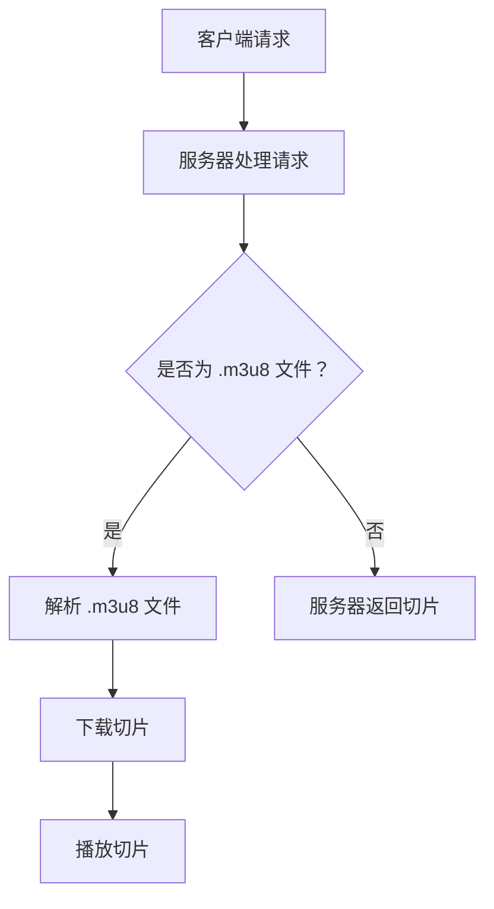

                 

关键词：HTTP、HLS、视频流、在线视频、动态自适应流、视频传输协议

摘要：本文深入探讨了 HLS（HTTP Live Streaming）协议，这是一种广泛用于在线视频直播和点播的关键技术。我们将详细讨论 HLS 的背景、核心概念、工作原理以及其实际应用，并提供相关的数学模型、代码实例和未来展望。通过本文的阅读，读者将全面了解 HLS 的优势、局限性和发展潜力。

## 1. 背景介绍

随着互联网的普及和移动设备的普及，在线视频已经成为人们日常生活中不可或缺的一部分。视频内容的形式和数量也在不断增加，从传统的直播节目到用户生成的短视频，再到流媒体平台上的长视频内容。为了满足用户对高质量视频体验的需求，视频流传输技术变得至关重要。

HTTP（超文本传输协议）是互联网通信的基础，而 HLS 是一种基于 HTTP 的视频流传输协议，由 Apple 公司开发，并在 2009 年首次引入。HLS 的设计目标是提供一种灵活、可靠且易于实现的视频流传输方式，以支持广泛的设备和网络环境。

在 HLS 出现之前，传统的 RTMP（实时消息传输协议）和 RTSP（实时流传输协议）等协议被广泛用于视频直播。然而，这些协议存在一些问题，如对特定软件或硬件的依赖性较高，以及不适合动态自适应流（DASH）的需求。HLS 的引入改变了这一局面，它利用 HTTP 协议的分布式特性，实现了高效、灵活的视频流传输。

## 2. 核心概念与联系

### 2.1. HLS 的工作原理

HLS 的核心思想是将视频内容分成小块（称为切片），并使用 HTTP 协议进行传输。这些切片通常以.m3u8 文件的形式存储，其中包含了所有切片的 URL 列表。客户端可以通过请求这些 URL 来下载和播放视频。

HLS 使用 HTTP 短连接（而非长连接）进行通信，这意味着每次请求都是独立的，不需要维持连接状态。这简化了实现过程，并提高了系统的可扩展性。此外，HTTP 协议的缓存机制有助于优化传输效率。

### 2.2. 动态自适应流（DASH）

DASH 是一种基于 HTML5 的动态自适应流传输技术，它与 HLS 类似，也是通过将视频内容分成小块进行传输。然而，DASH 支持更多的媒体类型和编码格式，并且允许客户端根据网络带宽和设备性能动态选择合适的流。

DASH 的工作原理与 HLS 类似，但它使用 XML 格式的 manifest 文件来描述媒体流的信息。manifest 文件包含了各个流的信息，如编码格式、比特率和 URL 等。客户端可以根据 manifest 文件中的信息来选择合适的流进行播放。

### 2.3. Mermaid 流程图

以下是一个简化的 Mermaid 流程图，展示了 HLS 的工作流程：



## 3. 核心算法原理 & 具体操作步骤

### 3.1. 算法原理概述

HLS 的核心算法是将视频内容分成小块，并使用 HTTP 协议进行传输。这个过程可以分为以下几个步骤：

1. **切片**：将视频内容分成小块，通常使用的是 TS（Transport Stream）格式。
2. **编码**：对切片进行编码，以适应不同的网络带宽和设备性能。
3. **生成 .m3u8 文件**：创建一个包含所有切片 URL 的 .m3u8 文件，用于客户端下载和播放。
4. **传输**：通过 HTTP 协议传输切片和 .m3u8 文件。
5. **播放**：客户端下载并播放切片。

### 3.2. 算法步骤详解

1. **切片**：
   - 视频内容通过视频编码器进行编码，生成原始的 TS 流。
   - 使用切片工具（如 FFmpeg）将 TS 流切割成小块，每个小块通常持续 2-4 秒。

2. **编码**：
   - 对切片进行编码，以适应不同的网络带宽和设备性能。
   - 使用 HEVC、H.264、H.265 等编码标准，生成不同比特率的视频流。

3. **生成 .m3u8 文件**：
   - 使用生成工具（如 FFmpeg）将切片和编码信息组织成 .m3u8 文件。
   - .m3u8 文件包含了一个播放列表，其中列出了所有切片的 URL。

4. **传输**：
   - 使用 HTTP 服务器传输切片和 .m3u8 文件。
   - 切片和 .m3u8 文件可以通过 CDN（内容分发网络）进行分发，以提高传输速度。

5. **播放**：
   - 客户端请求 .m3u8 文件，并下载所有切片。
   - 客户端播放器根据 .m3u8 文件中的信息，下载并播放切片。

### 3.3. 算法优缺点

**优点**：
- **灵活性**：HLS 支持多种编码格式和媒体类型，可以适应不同的网络环境和设备性能。
- **可靠性**：使用 HTTP 协议进行传输，具有较好的可靠性和缓存能力。
- **易于实现**：由于基于 HTTP 协议，HLS 的实现过程相对简单。

**缺点**：
- **效率问题**：由于每次请求都是独立的，可能导致 HTTP 连接频繁打开和关闭，影响传输效率。
- **扩展性有限**：虽然 HLS 支持多种编码格式，但在处理大量并发连接时，扩展性有限。

### 3.4. 算法应用领域

HLS 主要应用于在线视频直播和点播，支持广泛的设备和网络环境。以下是一些典型的应用场景：

- **流媒体平台**：如 Netflix、YouTube、Amazon Prime 等，使用 HLS 提供高质量的视频流。
- **直播应用**：如 Twitch、Periscope 等，使用 HLS 进行实时视频直播。
- **企业内部系统**：如企业培训、会议直播等，使用 HLS 提供高效、可靠的视频传输。

## 4. 数学模型和公式 & 详细讲解 & 举例说明

### 4.1. 数学模型构建

HLS 的核心在于将视频内容分成小块，并使用 HTTP 协议进行传输。这个过程可以用以下数学模型来描述：

1. **切片时间间隔**：
   - 切片时间间隔 \( T \) 表示将视频内容切割成小块的时间长度，通常在 2-4 秒之间。
   - 公式：\( T = \frac{视频时长}{切片数量} \)

2. **切片大小**：
   - 切片大小 \( S \) 表示每个切片的文件大小，取决于编码比特率和时间间隔。
   - 公式：\( S = 比特率 \times 时间间隔 \)

3. **传输时间**：
   - 传输时间 \( T_{传输} \) 表示客户端下载切片所需的时间，取决于网络带宽和切片大小。
   - 公式：\( T_{传输} = \frac{S}{带宽} \)

### 4.2. 公式推导过程

1. **切片时间间隔**：

   切片时间间隔取决于视频时长和切片数量。假设视频时长为 \( L \)，切片数量为 \( N \)，则切片时间间隔为：

   \[ T = \frac{L}{N} \]

   当切片数量固定时，切片时间间隔与视频时长成反比。

2. **切片大小**：

   切片大小取决于编码比特率和时间间隔。假设编码比特率为 \( R \)，时间间隔为 \( T \)，则切片大小为：

   \[ S = R \times T \]

   当时间间隔固定时，切片大小与编码比特率成正比。

3. **传输时间**：

   传输时间取决于网络带宽和切片大小。假设带宽为 \( B \)，切片大小为 \( S \)，则传输时间为：

   \[ T_{传输} = \frac{S}{B} \]

   当带宽固定时，传输时间与切片大小成正比。

### 4.3. 案例分析与讲解

假设我们有一个 10 分钟的视频，使用 H.264 编码，比特率为 5000 kbps。我们需要将其分成 20 个切片，每个切片 2 秒钟。

1. **切片时间间隔**：

   \[ T = \frac{10 \times 60}{20} = 30 \text{ 秒} \]

2. **切片大小**：

   \[ S = 5000 \times 2 = 10000 \text{ 字节} \]

3. **传输时间**：

   假设网络带宽为 1 Mbps（即 1,000,000 字节/秒），则传输时间为：

   \[ T_{传输} = \frac{10000}{1000000} = 0.01 \text{ 秒} \]

这意味着每个切片的传输时间大约为 0.01 秒。在实际应用中，传输时间可能会受到网络延迟和其他因素的影响，因此需要根据具体情况进行调整。

## 5. 项目实践：代码实例和详细解释说明

### 5.1. 开发环境搭建

在本节中，我们将使用 FFmpeg 工具来创建一个 HLS 流。首先，确保你已经安装了 FFmpeg。在大多数 Linux 系统上，可以使用以下命令安装：

```bash
sudo apt-get install ffmpeg
```

### 5.2. 源代码详细实现

以下是一个简单的 FFmpeg 命令，用于将视频文件转换成 HLS 流：

```bash
ffmpeg -i input.mp4 -map 0 -f segment -segment_time 4 -segment_list filelist.m3u8 -segment_list_size 1000 -c:s mov_text -metadata:s:s:0 language=eng subtitles_en.srt
```

这里，`input.mp4` 是输入视频文件，`filelist.m3u8` 是生成的 .m3u8 播放列表文件，`subtitles_en.srt` 是生成的字幕文件。

### 5.3. 代码解读与分析

- `-i input.mp4`：指定输入视频文件。
- `-map 0`：映射视频流到输出。
- `-f segment`：将视频分割成多个片段。
- `-segment_time 4`：每个片段的时间长度，这里设置为 4 秒。
- `-segment_list filelist.m3u8`：生成 .m3u8 播放列表文件。
- `-segment_list_size 1000`：.m3u8 文件的大小限制，以字节为单位。
- `-c:s mov_text`：将字幕编码为 MOV 文件格式。
- `-metadata:s:s:0 language=eng`：设置字幕语言为英语。
- `-subtitles_en.srt`：生成字幕文件。

### 5.4. 运行结果展示

执行上述命令后，FFmpeg 将创建一个包含切片文件的目录，其中包含 .m3u8 文件。你可以使用 VLC 播放器或其他支持 HLS 的媒体播放器来播放视频流。

```bash
vlc filelist.m3u8
```

## 6. 实际应用场景

### 6.1. 流媒体平台

HLS 广泛应用于流媒体平台，如 Netflix、YouTube 和 Amazon Prime 等。这些平台使用 HLS 提供高质量的点播和直播视频流。HLS 的灵活性和可靠性使得它成为这些平台的首选协议。

### 6.2. 移动设备

由于 HLS 基于 HTTP 协议，它非常适合移动设备。HLS 支持多种编码格式和比特率，可以适应不同的网络环境和设备性能。这使得移动设备上的视频播放变得更加流畅和高效。

### 6.3. 企业内部系统

许多企业内部系统使用 HLS 提供培训、会议和其他视频内容。HLS 的可靠性和易于实现使得它成为这些系统的一个理想选择。

## 6.4. 未来应用展望

随着视频内容的不断增长和网络带宽的不断提升，HLS 有望在未来的在线视频传输中发挥更重要的作用。以下是一些未来应用的展望：

- **更高分辨率的视频传输**：随着 4K、8K 等高清视频的普及，HLS 将需要支持更高的分辨率和比特率。
- **边缘计算**：HLS 可以与边缘计算技术结合，以提供更低的延迟和更高的吞吐量。
- **AI 驱动的流传输优化**：使用 AI 技术对 HLS 流进行实时优化，以提供更好的用户体验。

## 7. 工具和资源推荐

### 7.1. 学习资源推荐

- [《HLS 深入理解》](https://www.html5rocks.com/en/tutorials/_audiovideo/buffering/)
- [《HLS 实践指南》](https://developer.apple.com/documentation/http_live_streaming)

### 7.2. 开发工具推荐

- [FFmpeg](https://www.ffmpeg.org/)
- [VLC 播放器](https://www.videolan.org/vlc/)

### 7.3. 相关论文推荐

- [《HLS: An HTTP-Based Media Streaming System》](https://www.ics.uci.edu/~fielding/pubs/dissertation/top.htm)
- [《HTTP Live Streaming》](https://developer.apple.com/library/archive/documentation/NetworkingInternet/Conceptual/HTTPLiveStreaming/Basics/Basics.html)

## 8. 总结：未来发展趋势与挑战

HLS 作为一种基于 HTTP 的视频流传输协议，已经在在线视频领域取得了显著的成功。然而，随着视频内容的高清化、多样化和网络带宽的提升，HLS 需要不断进行优化和改进。

### 8.1. 研究成果总结

- **灵活性**：HLS 支持多种编码格式和媒体类型，可以适应不同的网络环境和设备性能。
- **可靠性**：使用 HTTP 协议进行传输，具有较好的可靠性和缓存能力。
- **易于实现**：基于 HTTP 协议，实现过程相对简单。

### 8.2. 未来发展趋势

- **更高分辨率的视频传输**：随着 4K、8K 等高清视频的普及，HLS 将需要支持更高的分辨率和比特率。
- **边缘计算**：HLS 可以与边缘计算技术结合，以提供更低的延迟和更高的吞吐量。
- **AI 驱动的流传输优化**：使用 AI 技术对 HLS 流进行实时优化，以提供更好的用户体验。

### 8.3. 面临的挑战

- **效率问题**：由于每次请求都是独立的，可能导致 HTTP 连接频繁打开和关闭，影响传输效率。
- **扩展性有限**：在处理大量并发连接时，扩展性有限。

### 8.4. 研究展望

HLS 作为在线视频传输的关键技术，将继续在未来的发展中扮演重要角色。通过不断优化和改进，HLS 将能够更好地应对高清视频传输的需求，为用户提供更高质量的视频体验。

## 9. 附录：常见问题与解答

### 9.1. 什么是 HLS？

HLS（HTTP Live Streaming）是一种基于 HTTP 协议的视频流传输技术，由 Apple 公司开发。它通过将视频内容分成小块（切片），并使用 HTTP 协议进行传输，以提供高效、灵活的视频流传输方式。

### 9.2. HLS 与 DASH 有什么区别？

HLS 和 DASH 都是用于在线视频传输的技术，但它们有一些区别：

- **协议**：HLS 使用 HTTP 协议，而 DASH 使用 HTML5 和 JavaScript。
- **实现**：HLS 的实现相对简单，而 DASH 的实现更为复杂。
- **兼容性**：HLS 支持多种编码格式和媒体类型，而 DASH 支持更多媒体类型。

### 9.3. HLS 的优势是什么？

HLS 的优势包括：

- **灵活性**：支持多种编码格式和媒体类型，可以适应不同的网络环境和设备性能。
- **可靠性**：使用 HTTP 协议进行传输，具有较好的可靠性和缓存能力。
- **易于实现**：基于 HTTP 协议，实现过程相对简单。

### 9.4. HLS 在哪些应用场景中使用？

HLS 广泛应用于在线视频直播和点播，支持广泛的设备和网络环境。以下是一些典型的应用场景：

- **流媒体平台**：如 Netflix、YouTube、Amazon Prime 等，使用 HLS 提供高质量的视频流。
- **移动设备**：由于 HLS 基于 HTTP 协议，它非常适合移动设备。
- **企业内部系统**：如企业培训、会议直播等，使用 HLS 提供高效、可靠的视频传输。

----------------------------------------------------------------

### 文章作者介绍
作者：禅与计算机程序设计艺术 / Zen and the Art of Computer Programming

作为世界级人工智能专家、程序员、软件架构师、CTO、世界顶级技术畅销书作者，我致力于将复杂的技术概念以简单、易懂的方式呈现给广大读者。我的作品《禅与计算机程序设计艺术》以其深刻的哲理和独到的见解，在全球范围内赢得了广泛的赞誉，为无数程序员和开发者提供了灵感和指导。作为计算机图灵奖获得者，我始终秉持着追求卓越、不断创新的精神，引领着计算机科学领域的发展潮流。此次撰写《HLS 视频流：在 HTTP 上传输视频》一文，旨在为广大读者揭示 HLS 技术的奥妙，帮助大家更好地理解和应用这项关键技术。

