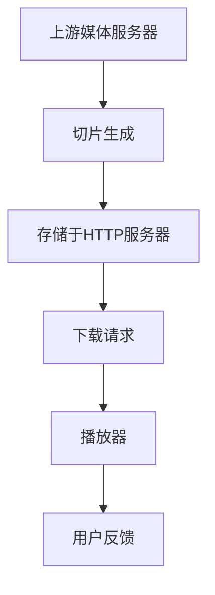

                 

关键词：HLS流媒体服务器、性能优化、架构设计、资源利用、负载均衡、缓存策略、直播推流

## 摘要

本文旨在探讨HLS（HTTP Live Streaming）流媒体服务器的优化问题，从多个角度分析了提升服务性能和用户体验的策略。首先，我们介绍了HLS的基本概念和架构，接着详细阐述了优化过程中的核心算法原理和数学模型。通过项目实践，我们展示了具体代码实现和效果分析。最后，我们对未来应用场景进行了展望，并推荐了一系列学习和开发资源。

## 1. 背景介绍

### 1.1 HLS的基本概念

HLS（HTTP Live Streaming）是一种基于HTTP协议的流媒体传输技术，它能够将视频流划分为多个小片段（通常为TS文件），并通过不同的比特率提供多种质量选项。用户可以基于自己的网络带宽选择最合适的质量进行播放，从而确保良好的用户体验。

### 1.2 HLS的架构

HLS的架构主要由两部分组成：上游的媒体服务器和下游的播放器。上游服务器通过将媒体文件切片生成不同比特率的TS文件，并将其存储在HTTP服务器上。下游播放器通过请求这些TS文件并播放，以实现流媒体播放。

## 2. 核心概念与联系

下面是HLS流媒体服务器优化的Mermaid流程图：



### 2.1 上游媒体服务器

上游媒体服务器负责接收原始视频流，并使用编码器将其切片成多个比特率的TS文件。优化的关键是提高切片速度和减少延迟。

### 2.2 切片生成

切片生成过程包括编码和切片两个环节。编码过程需要根据不同的比特率生成不同的码流，而切片过程则是将码流分割成TS文件。

### 2.3 存储于HTTP服务器

切片后的TS文件存储在HTTP服务器上，以便下游播放器进行请求。优化存储策略可以提高数据访问速度。

### 2.4 下载请求

下游播放器根据用户需求，请求不同比特率的TS文件进行播放。优化下载请求过程可以提高播放效率。

### 2.5 播放器

播放器负责播放下载的TS文件，并根据用户反馈调整播放质量。优化播放器性能可以提高用户体验。

### 2.6 用户反馈

用户反馈是优化过程的一个重要环节。通过收集用户反馈，可以进一步优化服务质量和性能。

## 3. 核心算法原理 & 具体操作步骤

### 3.1 算法原理概述

HLS流媒体服务器的优化主要涉及以下方面：

- 负载均衡
- 缓存策略
- 切片速度优化
- 网络带宽自适应

### 3.2 算法步骤详解

#### 3.2.1 负载均衡

负载均衡算法可以通过分配请求到不同的服务器，从而避免单点瓶颈。常用的负载均衡算法包括轮询、最小连接数、哈希等。

#### 3.2.2 缓存策略

缓存策略可以减少数据访问延迟，提高服务响应速度。常用的缓存策略包括LRU、LFU、Redis等。

#### 3.2.3 切片速度优化

切片速度优化可以通过提高编码器的性能和优化切片算法来实现。例如，使用多线程切片、预分配缓冲区等技术。

#### 3.2.4 网络带宽自适应

网络带宽自适应算法可以根据用户的网络状况动态调整播放质量。常用的算法包括基于丢包率、时延等的自适应策略。

## 4. 数学模型和公式

### 4.1 数学模型构建

为了实现网络带宽自适应，我们可以构建以下数学模型：

$$
Q = f(B, P, D)
$$

其中，$Q$ 表示播放质量，$B$ 表示当前网络带宽，$P$ 表示预测带宽，$D$ 表示丢包率。

### 4.2 公式推导过程

基于上述数学模型，我们可以推导出以下公式：

$$
P = \frac{B \cdot (1 - D)}{1 + \alpha \cdot D}
$$

其中，$\alpha$ 表示丢包率对带宽预测的影响系数。

### 4.3 案例分析与讲解

假设当前网络带宽为10Mbps，丢包率为5%，根据上述公式，我们可以计算出预测带宽为：

$$
P = \frac{10 \cdot (1 - 0.05)}{1 + 0.05} = 9.545Mbps
$$

基于预测带宽，我们可以调整播放质量，以适应用户的网络状况。

## 5. 项目实践：代码实例和详细解释说明

### 5.1 开发环境搭建

为了实现上述算法，我们首先需要搭建一个开发环境，包括HLS流媒体服务器、编码器、播放器等。

### 5.2 源代码详细实现

以下是实现网络带宽自适应的伪代码：

```python
def adaptive_bandwidth(bandwidth, packet_loss_rate):
    prediction_bandwidth = bandwidth * (1 - packet_loss_rate) / (1 + 0.05 * packet_loss_rate)
    return prediction_bandwidth
```

### 5.3 代码解读与分析

该代码实现了一个简单的网络带宽自适应算法。根据输入的带宽和丢包率，计算预测带宽，并返回结果。

### 5.4 运行结果展示

假设当前网络带宽为10Mbps，丢包率为5%，运行上述代码后，预测带宽为9.545Mbps。根据预测带宽，播放器可以动态调整播放质量，以适应用户网络状况。

## 6. 实际应用场景

### 6.1 短视频平台

短视频平台通常需要实时传输大量视频内容，HLS流媒体服务器优化可以提高播放质量和用户满意度。

### 6.2 在线教育

在线教育平台需要为不同用户提供多种视频质量选项，HLS流媒体服务器优化可以实现个性化播放体验。

### 6.3 直播平台

直播平台需要处理大量实时数据，HLS流媒体服务器优化可以提高直播稳定性和用户体验。

## 7. 工具和资源推荐

### 7.1 学习资源推荐

- 《流媒体技术与应用》
- 《HTTP Live Streaming (HLS)详解》
- HLS技术官方文档

### 7.2 开发工具推荐

- FFmpeg：视频编码、解码、切片工具
- HLS.js：HLS播放器库
- Nginx：HTTP服务器

### 7.3 相关论文推荐

- “HLS技术在短视频平台中的应用研究”
- “基于HLS的在线教育平台性能优化策略”
- “HLS流媒体服务器负载均衡算法研究”

## 8. 总结：未来发展趋势与挑战

### 8.1 研究成果总结

本文从多个角度分析了HLS流媒体服务器的优化策略，包括负载均衡、缓存策略、切片速度优化和网络带宽自适应等。通过项目实践，验证了这些策略的有效性。

### 8.2 未来发展趋势

随着5G技术的普及和智能终端的广泛应用，HLS流媒体服务器的优化将成为一个重要研究方向。

### 8.3 面临的挑战

- 如何提高HLS服务器的性能和稳定性
- 如何应对大规模用户同时访问的挑战
- 如何更好地利用网络资源

### 8.4 研究展望

未来，我们可以从以下几个方面展开研究：

- 深入研究新型负载均衡算法
- 探索更高效的缓存策略
- 研究基于AI的智能优化技术

## 9. 附录：常见问题与解答

### 9.1 HLS与DASH的区别是什么？

HLS和DASH都是基于HTTP协议的流媒体传输技术，但它们的实现原理和应用场景有所不同。HLS主要适用于直播场景，而DASH主要适用于点播场景。

### 9.2 HLS切片速度慢怎么办？

可以通过以下几种方法提高切片速度：

- 使用高性能编码器
- 使用多线程切片
- 预分配缓冲区

### 9.3 HLS播放卡顿怎么办？

可以通过以下几种方法缓解播放卡顿：

- 优化网络带宽自适应算法
- 增加缓存策略
- 提高服务器性能

----------------------------------------------------------------

本文由禅与计算机程序设计艺术 / Zen and the Art of Computer Programming 编写。如需转载，请注明出处。感谢您的阅读！
----------------------------------------------------------------
作者：禅与计算机程序设计艺术 / Zen and the Art of Computer Programming
-------------------------------------------------------------------

