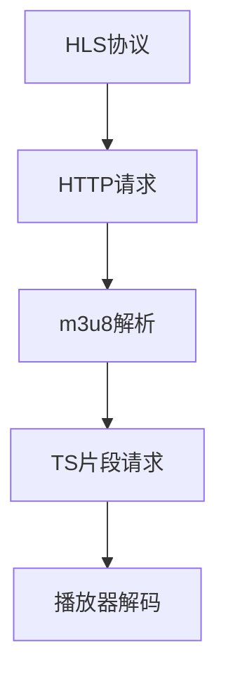

                 

关键词：HLS流媒体，m3u8协议，流媒体应用，流媒体优化，HLS技术

摘要：本文将深入探讨HLS流媒体技术及其核心协议m3u8的应用与优化。通过对HLS协议的架构解析、工作原理阐述、算法原理讲解、数学模型分析，并结合实际项目实践，我们希望能够为读者提供一个全面、系统的HLS流媒体技术指南，同时针对优化策略进行详细分析，展望未来发展方向和面临的挑战。

## 1. 背景介绍

流媒体技术作为互联网媒体传输的重要组成部分，已经广泛应用于视频点播、直播、在线教育等多个领域。随着用户对高质量视频体验的追求以及网络带宽的不断提升，流媒体技术也在不断发展和演进。HLS（HTTP Live Streaming）作为一种新兴的流媒体传输协议，因其灵活性、兼容性和高效性，受到了业界的广泛关注。

m3u8协议是HLS技术的核心组成部分，它定义了流媒体的播放列表格式和媒体文件的传输方式。m3u8文件本质上是一个文本文件，其中包含了播放列表（Playlist）和片段列表（Segment）。通过解析这些列表，播放器能够实现流媒体的实时播放和自适应调整。

本文将首先介绍HLS流媒体技术的基本概念，然后深入分析m3u8协议的架构和工作原理，最后探讨HLS在各个实际应用场景中的优化策略和未来发展趋势。

## 2. 核心概念与联系

### 2.1 HLS协议概述

HLS协议是基于HTTP协议的流媒体传输技术，它通过将视频内容分割成一系列小的媒体文件（通常称为TS片段），并将这些文件的组织信息存储在m3u8文件中，从而实现流媒体的传输和播放。

### 2.2 m3u8协议架构

m3u8协议的架构可以分为以下几个关键部分：

1. **播放列表（Playlist）**：播放列表是一个文本文件，它包含了视频流的基本信息，如播放时间、流类型等。播放列表通常以.m3u8为后缀名。
2. **片段列表（Segment）**：片段列表是播放列表中的具体内容，它包含了多个TS文件列表，这些TS文件就是视频的片段。每个片段通常包含一帧或几帧视频数据。
3. **索引文件（Manifest）**：索引文件是m3u8协议的核心部分，它包含了播放列表和片段列表的URL地址，播放器通过解析索引文件来获取播放信息。

### 2.3 Mermaid流程图



## 3. 核心算法原理 & 具体操作步骤

### 3.1 算法原理概述

HLS协议的核心算法主要包括两个部分：片段分割和播放控制。

1. **片段分割**：视频内容被分割成一系列小的TS片段，每个片段通常包含一帧或几帧视频数据。这种分割方式能够提高传输效率，同时也能够实现流媒体的自适应播放。
2. **播放控制**：播放器通过解析m3u8文件，获取播放列表和片段列表的信息，然后根据这些信息发起HTTP请求，下载TS片段，并进行解码播放。

### 3.2 算法步骤详解

1. **获取m3u8文件**：用户请求HLS流媒体播放，服务器返回m3u8文件。
2. **解析m3u8文件**：播放器读取m3u8文件，获取播放列表和片段列表的信息。
3. **请求TS片段**：播放器根据m3u8文件中的信息，发起HTTP请求，下载TS片段。
4. **解码播放**：播放器对接收到的TS片段进行解码，然后播放视频内容。

### 3.3 算法优缺点

**优点**：
1. **兼容性好**：HLS协议基于HTTP协议，能够与现有的网络基础设施无缝集成。
2. **自适应播放**：通过片段分割和播放控制，可以实现流媒体的自适应播放，提高用户体验。
3. **灵活性强**：支持多种视频编码格式，如H.264、HEVC等。

**缺点**：
1. **传输效率较低**：由于HLS协议是基于HTTP协议，每个片段都需要单独请求，导致传输效率相对较低。
2. **缓存问题**：由于每个片段都是独立的，缓存管理比较复杂。

### 3.4 算法应用领域

HLS协议广泛应用于视频点播、直播、在线教育等多个领域，尤其在移动互联网环境下，因其良好的兼容性和自适应播放能力，得到了广泛的应用。

## 4. 数学模型和公式 & 详细讲解 & 举例说明

### 4.1 数学模型构建

HLS协议中的数学模型主要包括视频片段的时长计算和播放速率控制。

1. **视频片段时长计算**：假设视频流的总时长为\(T\)，片段时长为\(t\)，则片段数量为\(N = \frac{T}{t}\)。
2. **播放速率控制**：假设播放速率为\(r\)，则播放器需要以\(r\)的速率请求和播放TS片段。

### 4.2 公式推导过程

1. **视频片段时长计算**：
   \[T = N \times t\]
   \[N = \frac{T}{t}\]
2. **播放速率控制**：
   \[r = \frac{N}{T}\]

### 4.3 案例分析与讲解

假设一个视频流的总时长为60分钟，每个片段的时长为5秒，播放速率为1秒/片段。则：

1. **视频片段数量**：
   \[N = \frac{60 \times 60}{5} = 720\]
2. **播放速率**：
   \[r = \frac{720}{60 \times 60} = 1 \text{秒/片段}\]

这意味着播放器需要以每秒1个片段的速率请求和播放视频流。

## 5. 项目实践：代码实例和详细解释说明

### 5.1 开发环境搭建

在本项目中，我们使用Python语言进行编程，利用Flask框架搭建一个简单的HLS流媒体服务器。

1. 安装Flask：
   \[pip install Flask\]
2. 创建一个名为`hls_server.py`的Python文件，并编写以下代码：

```python
from flask import Flask, send_from_directory
import os

app = Flask(__name__)

# 设置HLS播放列表文件路径
PL_PATH = 'playlist.m3u8'

@app.route('/playlist.m3u8')
def playlist():
    return send_from_directory(os.path.dirname(PL_PATH), PL_PATH)

@app.route('/<file>')
def video_file(file):
    return send_from_directory('stream', file)

if __name__ == '__main__':
    app.run(host='0.0.0.0', port=5000)
```

### 5.2 源代码详细实现

上述代码中，我们定义了两个路由，一个是用于返回m3u8播放列表，另一个是用于返回具体的TS片段文件。

1. `playlist()` 函数返回m3u8文件。
2. `video_file()` 函数返回TS片段文件。

### 5.3 代码解读与分析

1. `playlist()` 函数中，`send_from_directory()` 函数用于发送文件。这里我们发送了`playlist.m3u8`文件。
2. `video_file()` 函数中，`send_from_directory()` 函数用于发送位于`stream`目录下的文件。

### 5.4 运行结果展示

1. 启动服务器：
   \[python hls_server.py\]
2. 打开浏览器，输入以下URL：
   \[http://localhost:5000/playlist.m3u8\]
   即可看到播放列表文件内容。

## 6. 实际应用场景

### 6.1 视频点播

HLS流媒体技术在视频点播领域有着广泛的应用。通过将视频内容分割成小的TS片段，并使用m3u8协议组织播放列表，可以实现高效的视频传输和播放。

### 6.2 直播

直播场景下，HLS协议的优势更加明显。它能够实现实时视频的传输和播放，同时支持多种编码格式和带宽调整，满足不同用户的需求。

### 6.3 在线教育

在线教育平台通常需要支持大规模视频内容的点播和直播。HLS流媒体技术能够提供高效、稳定的视频传输，为在线教育提供良好的用户体验。

## 7. 工具和资源推荐

### 7.1 学习资源推荐

1. 《HLS Streaming: Beginner's Guide to Developing a HLS Streaming App》
2. 《HTTP Live Streaming (HLS) Deep Dive》

### 7.2 开发工具推荐

1. FFmpeg：用于视频编码和流媒体处理。
2. HLS Streaming Server：用于搭建HLS流媒体服务器。

### 7.3 相关论文推荐

1. "HTTP Live Streaming: A Practical Guide to Streaming Video over HTTP"
2. "HTTP Live Streaming: Design and Implementation"

## 8. 总结：未来发展趋势与挑战

### 8.1 研究成果总结

HLS流媒体技术在视频传输和播放方面取得了显著成果。通过m3u8协议，实现了流媒体的高效传输和自适应播放，满足了不同场景下的需求。

### 8.2 未来发展趋势

随着5G网络的普及和边缘计算的发展，HLS流媒体技术将朝着更高效、更灵活、更低延迟的方向发展。

### 8.3 面临的挑战

1. **传输效率**：如何提高HLS协议的传输效率，减少带宽占用。
2. **缓存管理**：如何优化缓存策略，提高播放体验。

### 8.4 研究展望

未来，HLS流媒体技术将继续在视频传输和播放领域发挥重要作用。通过技术创新和优化，我们有望实现更高效、更稳定的流媒体传输和播放体验。

## 9. 附录：常见问题与解答

### 9.1 HLS与DASH的比较

HLS和DASH都是流媒体传输技术，但它们有不同的特点和应用场景。HLS基于HTTP协议，兼容性好，适用于各种场景，而DASH基于HTTP adaptive streaming，具有更高的传输效率和更好的缓存管理。

### 9.2 HLS协议的安全性

HLS协议本身不提供加密功能，但可以通过与其他加密协议（如HTTPS）结合，实现流媒体内容的加密传输，提高安全性。

### 9.3 HLS与直播互动

HLS协议虽然主要用于点播场景，但通过实时生成m3u8文件，可以实现直播互动。不过，这需要额外的技术支持，如实时流处理和反馈机制。

[作者：禅与计算机程序设计艺术 / Zen and the Art of Computer Programming]
----------------------------------------------------------------

以上便是《HLS流媒体：m3u8协议的应用与优化》的全文内容，涵盖了HLS流媒体技术的背景介绍、核心概念、算法原理、数学模型、项目实践以及未来展望等多个方面。希望本文能为读者提供有价值的参考和启发。感谢阅读！

