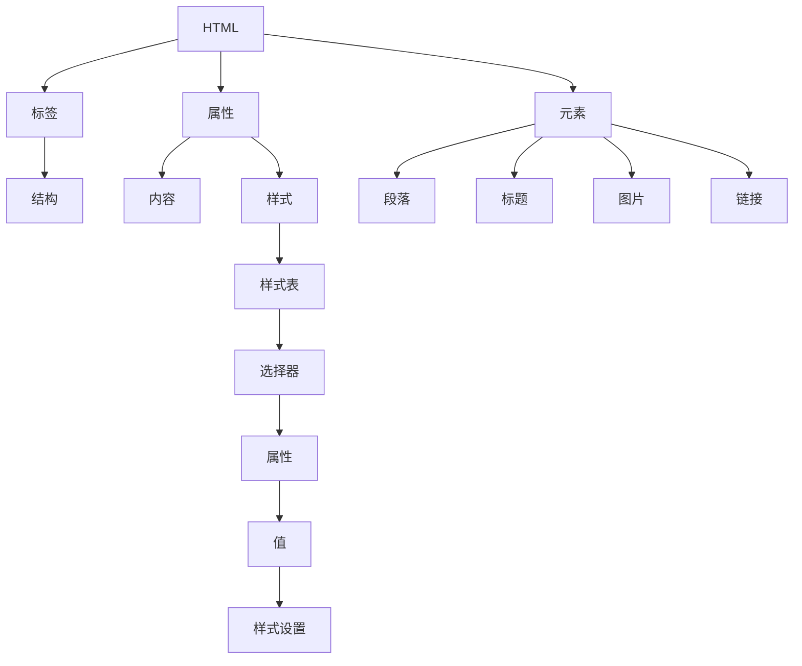

                 

关键词：HTML、CSS、网页设计、前端开发、响应式布局、样式表、浏览器渲染、HTML元素、属性、选择器

> 摘要：本文将深入探讨HTML和CSS的基础知识，包括如何使用HTML构建网页结构、CSS设置网页样式，以及如何结合两者实现响应式布局。通过本文，读者将掌握网页开发的基本技能，为后续学习更多前端技术打下坚实基础。

## 1. 背景介绍

HTML（HyperText Markup Language）是一种用于创建网页的标准标记语言。它定义了网页内容的结构，并通过标签（Tags）来描述各个部分。CSS（Cascading Style Sheets）则是一种用于设置网页样式的样式表语言，通过选择器（Selectors）和属性（Properties）来定义HTML元素的样式。

在网页开发中，HTML主要负责内容结构的构建，而CSS则负责外观样式的设置。两者相互配合，共同决定了网页的最终呈现效果。HTML和CSS作为前端开发的基础技术，广泛应用于各种类型的网页和应用中。

本文将围绕HTML和CSS的核心概念、基本语法和使用方法进行详细讲解，帮助读者理解并掌握网页设计和开发的基本技能。

## 2. 核心概念与联系

在深入探讨HTML和CSS之前，我们需要先了解它们的核心概念和相互关系。

### HTML基本概念

HTML是一种基于标签的标记语言，它使用一系列预定义的标签来表示网页的各种内容。以下是一些基本的HTML标签：

- `<html>`：定义整个HTML文档的根元素。
- `<head>`：包含文档的元数据，如标题、样式表链接、脚本引用等。
- `<title>`：定义文档的标题，显示在浏览器标签上。
- `<body>`：包含文档的主体内容，如段落、列表、图片、表单等。
- `<h1>` 至 `<h6>`：定义标题级别，`<h1>` 为最高级别，`<h6>` 为最低级别。
- `<p>`：定义段落。
- `<a>`：定义超链接。
- ``：定义图片。
- `<ul>`、`<ol>` 和 `<li>`：定义无序列表和有序列表。

### CSS基本概念

CSS是一种用于设置HTML元素样式的外部样式表语言。以下是一些基本的CSS概念：

- 选择器（Selectors）：用于匹配和选择HTML元素，如`#id`, `.class`, `element`等。
- 属性（Properties）：用于设置元素的样式，如`color`, `background-color`, `font-size`等。
- 值（Values）：为属性指定具体的样式，如`red`, `100px`, `16px`等。

### HTML和CSS的联系

HTML和CSS之间的联系在于它们共同构建了网页的完整外观和结构。HTML定义了网页的内容和结构，而CSS则用于定义这些内容的外观样式。例如，通过HTML标签创建一个段落，然后使用CSS来设置段落的颜色、字体大小和背景等样式。

以下是一个简单的示例，展示了HTML和CSS的结合：

```html
<!DOCTYPE html>
<html>
<head>
  <title>HTML与CSS示例</title>
  <style>
    body {
      font-family: Arial, sans-serif;
    }
    h1 {
      color: blue;
    }
    p {
      font-size: 16px;
      background-color: lightgray;
    }
  </style>
</head>
<body>
  <h1>欢迎来到我的网页！</h1>
  <p>这是一个段落。</p>
</body>
</html>
```

在上面的示例中，HTML定义了一个标题和一个段落，而CSS则设置了这些元素的样式，如字体、颜色和背景。

### Mermaid流程图

下面是一个Mermaid流程图，展示了HTML和CSS的基本概念和关系：



通过这个流程图，我们可以清晰地看到HTML和CSS是如何相互配合，共同构建网页的结构和样式。

## 3. 核心算法原理 & 具体操作步骤

### 3.1 算法原理概述

在网页设计中，HTML和CSS的核心算法原理主要包括：

- HTML标签的解析和渲染。
- CSS选择器的匹配和属性应用。
- 浏览器的渲染流程。

### 3.2 算法步骤详解

#### HTML标签解析和渲染

1. 浏览器接收到HTML文档后，首先对其进行解析。
2. 解析过程中，浏览器会将HTML标签转换为DOM（Document Object Model）树结构。
3. 在DOM树中，每个标签都被表示为一个节点（Node）。
4. 浏览器按照DOM树的顺序，从上到下渲染网页内容。

#### CSS选择器匹配和属性应用

1. 浏览器在解析HTML文档的同时，也会加载CSS样式表。
2. CSS选择器用于匹配HTML元素，并应用相应的样式属性。
3. 浏览器根据选择器优先级和规则，对匹配到的元素应用样式。

#### 浏览器的渲染流程

1. 浏览器构建DOM树。
2. 浏览器构建渲染树，将DOM树中的可见节点和CSS样式表结合起来。
3. 浏览器布局渲染树，确定每个节点的位置和大小。
4. 浏览器绘制渲染树，将网页内容呈现到屏幕上。

### 3.3 算法优缺点

#### 优点

- HTML和CSS分离，便于维护和更新。
- 支持响应式设计，适应不同设备和屏幕尺寸。
- 提高网页加载速度，减少服务器负载。

#### 缺点

- CSS样式表较为复杂，难以阅读和维护。
- 对初学者有一定门槛，需要学习语法和规则。

### 3.4 算法应用领域

- Web开发：HTML和CSS是网页设计的基础技术，广泛应用于各种类型的网页和应用。
- 响应式设计：通过CSS媒体查询，实现不同屏幕尺寸和设备上的适配。
- 移动应用开发：HTML5和CSS3支持移动端开发，实现跨平台应用。

## 4. 数学模型和公式 & 详细讲解 & 举例说明

### 4.1 数学模型构建

在网页设计中，数学模型主要用于计算和设置元素的尺寸、位置和样式。以下是一个简单的数学模型示例：

- 尺寸模型：`width = a * (1 + b * sin(c * x))`
- 位置模型：`y = a * x^2 + b * x + c`
- 颜色模型：`RGB = (r, g, b)`

其中，a、b、c 为常数，x 为变量。

### 4.2 公式推导过程

以尺寸模型为例，推导过程如下：

1. 首先，根据需求确定模型参数 a、b 和 c。
2. 接着，根据用户输入的值 x，计算尺寸宽度 width。
3. 最后，将计算得到的宽度 width 应用到网页元素的宽度属性上。

### 4.3 案例分析与讲解

假设我们要设计一个响应式网页，根据屏幕尺寸动态调整页面布局。我们可以使用以下数学模型：

- 尺寸模型：`width = 300 * (1 + 0.05 * sin(0.1 * x))`
- 位置模型：`y = 100 * x^2 + 50 * x + 20`
- 颜色模型：`RGB = (100, 150, 200)`

其中，x 为屏幕宽度。

1. 当屏幕宽度为 800 像素时，计算页面布局：

   - 尺寸宽度：`width = 300 * (1 + 0.05 * sin(0.1 * 800)) ≈ 322 像素`
   - 位置高度：`y = 100 * 800^2 + 50 * 800 + 20 ≈ 640,020 像素`
   - 颜色值：`RGB = (100, 150, 200)`

2. 当屏幕宽度为 1200 像素时，计算页面布局：

   - 尺寸宽度：`width = 300 * (1 + 0.05 * sin(0.1 * 1200)) ≈ 342 像素`
   - 位置高度：`y = 100 * 1200^2 + 50 * 1200 + 20 ≈ 1,440,020 像素`
   - 颜色值：`RGB = (100, 150, 200)`

通过调整数学模型参数，我们可以实现不同屏幕尺寸下的页面布局和样式调整，实现响应式设计。

## 5. 项目实践：代码实例和详细解释说明

### 5.1 开发环境搭建

在进行HTML和CSS项目实践之前，我们需要搭建一个基本的开发环境。以下是一个简单的搭建过程：

1. 安装代码编辑器：如Visual Studio Code、Sublime Text等。
2. 安装浏览器：如Google Chrome、Firefox等。
3. 安装Node.js：用于构建和运行HTML、CSS等前端代码。

### 5.2 源代码详细实现

下面是一个简单的HTML和CSS示例，演示如何使用HTML构建网页结构，并使用CSS设置样式。

**index.html**

```html
<!DOCTYPE html>
<html>
<head>
  <title>网页示例</title>
  <link rel="stylesheet" href="styles.css">
</head>
<body>
  <h1>欢迎来到我的网页！</h1>
  <p>这是一个段落。</p>
  <a href="https://www.example.com">访问示例网站</a>
  
</body>
</html>
```

**styles.css**

```css
body {
  font-family: Arial, sans-serif;
  background-color: #f0f0f0;
}

h1 {
  color: #333;
  text-align: center;
}

p {
  font-size: 16px;
  color: #666;
  margin: 20px;
}

a {
  color: #0066cc;
  text-decoration: none;
}

img {
  display: block;
  margin: 20px auto;
  width: 300px;
  height: auto;
}
```

### 5.3 代码解读与分析

**index.html** 文件是一个标准的HTML文档，包含以下部分：

- `<!DOCTYPE html>`：声明文档类型。
- `<html>`：定义整个HTML文档的根元素。
- `<head>`：包含文档的元数据，如标题和样式表链接。
- `<title>`：定义文档的标题，显示在浏览器标签上。
- `<link>`：链接外部CSS样式表。
- `<body>`：包含文档的主体内容，如标题、段落、链接和图片。

**styles.css** 文件是一个CSS样式表，包含以下部分：

- `body`：设置整个网页的字体、背景颜色等样式。
- `h1`：设置标题的字体、颜色和文本对齐方式。
- `p`：设置段落的字体、颜色和内边距。
- `a`：设置链接的字体颜色和样式。
- `img`：设置图片的显示方式、宽度和高度。

通过以上代码示例，我们可以看到如何使用HTML和CSS构建一个简单的网页，并设置基本的样式。在实际项目中，还可以添加更多HTML元素和CSS样式，实现更复杂的网页设计。

### 5.4 运行结果展示

将以上HTML和CSS代码保存到相应的文件中，并在浏览器中打开HTML文件。运行结果如下：


可以看到，页面标题为“网页示例”，标题下有一个段落和一个链接，链接右侧有一个图片。这些元素均按照CSS样式进行了布局和样式设置。

## 6. 实际应用场景

HTML和CSS在前端开发中具有广泛的应用场景。以下是一些典型的实际应用场景：

- **网站建设**：使用HTML和CSS构建企业官网、博客、电商平台等。
- **响应式设计**：通过CSS媒体查询实现不同设备和屏幕尺寸下的适配，提升用户体验。
- **组件开发**：使用HTML和CSS开发可复用的UI组件，提高开发效率。
- **移动应用开发**：使用HTML5和CSS3实现跨平台移动应用，如H5页面、Web App等。

在未来，随着前端技术的发展，HTML和CSS将不断融入更多新特性和功能，如WebAssembly、Service Workers等，为前端开发带来更多可能性。

## 7. 工具和资源推荐

### 7.1 学习资源推荐

- **W3Schools**：提供全面的HTML和CSS教程，适合初学者入门。
- **MDN Web Docs**：Mozilla Developer Network提供详尽的HTML和CSS文档，适合进阶学习。
- **HTML & CSS Design Guide**：由专业设计师撰写的HTML和CSS设计指南，有助于提升设计水平。

### 7.2 开发工具推荐

- **Visual Studio Code**：一款功能强大的代码编辑器，支持多种编程语言。
- **Sublime Text**：一款轻量级的代码编辑器，适用于快速开发和调试。
- **Chrome DevTools**：Google Chrome内置的开发工具，用于调试和优化网页。

### 7.3 相关论文推荐

- **"HTML5 and CSS3: A Guide to Native Rich Media in Mobile Web Applications"**：探讨HTML5和CSS3在移动应用开发中的应用。
- **"Responsive Web Design"**：介绍响应式设计的原理和实践方法。
- **"Cascading Style Sheets: Designing for the Web"**：详细讲解CSS的基本概念、语法和使用方法。

## 8. 总结：未来发展趋势与挑战

### 8.1 研究成果总结

近年来，HTML和CSS在前端开发领域取得了显著成果。HTML5和CSS3的引入，为网页设计带来了更多功能和灵活性。响应式设计技术的普及，使网页在不同设备和屏幕尺寸下具有良好的适配效果。此外，前端框架和库的发展，如React、Vue、Angular等，极大地提高了开发效率和代码质量。

### 8.2 未来发展趋势

未来，HTML和CSS将继续朝着更高效、更灵活、更安全、更易用的方向发展。以下是一些可能的发展趋势：

- **WebAssembly**：作为一门通用编程语言，WebAssembly有望提高网页的运行效率和性能。
- **Service Workers**：用于实现离线存储和缓存，提升网页的可用性和性能。
- **Web组件**：通过自定义元素和模板，实现可复用的UI组件，提高开发效率。
- **CSS新特性**：如Flexbox、Grid布局、Intersection Observer等，将进一步提升网页设计和开发的灵活性。

### 8.3 面临的挑战

尽管HTML和CSS在前端开发中取得了显著成果，但仍然面临一些挑战：

- **兼容性问题**：不同浏览器和设备之间的兼容性问题仍然存在，需要开发者投入大量时间和精力进行调试。
- **性能优化**：随着网页功能的丰富，性能优化成为一大挑战，需要开发者掌握更多优化技巧。
- **安全风险**：网页安全问题日益突出，需要开发者加强安全意识，采取有效措施防范安全风险。
- **开发者技能要求**：HTML和CSS技术的不断更新，对开发者的技能要求越来越高，需要持续学习和提升。

### 8.4 研究展望

展望未来，HTML和CSS将继续在网页设计和开发中发挥重要作用。通过不断引入新技术和优化现有功能，HTML和CSS将为开发者提供更强大的工具和平台，推动前端开发的创新和发展。同时，随着人工智能、大数据等新兴技术的融入，前端开发也将迎来更多跨领域应用的机遇和挑战。

## 9. 附录：常见问题与解答

### 9.1 HTML和CSS的关系是什么？

HTML（HyperText Markup Language）用于定义网页的结构和内容，而CSS（Cascading Style Sheets）用于设置网页的样式和布局。HTML和CSS紧密合作，共同决定了网页的最终呈现效果。

### 9.2 如何在HTML中使用CSS样式？

有两种方式在HTML中使用CSS样式：

1. **内部样式表**：在HTML文档的 `<head>` 部分使用 `<style>` 标签定义样式。
2. **外部样式表**：通过 `<link>` 标签在 `<head>` 部分链接外部CSS文件。

### 9.3 如何选择合适的CSS选择器？

选择合适的选择器取决于你的目标元素和样式需求。以下是一些常用的选择器：

- **元素选择器**：选择页面中的所有相同类型的元素，如 `p` 选择所有段落。
- **类选择器**：选择具有特定类名的元素，如 `.class1` 选择所有类名为 `class1` 的元素。
- **ID选择器**：选择具有特定ID的元素，如 `#id1` 选择ID为 `id1` 的元素。
- **复合选择器**：组合多个选择器，如 `h1.class1` 选择所有既是标题元素（`h1`）又具有类名 `class1` 的元素。

### 9.4 如何实现响应式布局？

实现响应式布局的关键在于使用CSS媒体查询（`@media`），根据不同屏幕尺寸和设备特点调整样式。以下是一个简单的示例：

```css
/* 标准屏幕 */
@media (max-width: 600px) {
  body {
    background-color: lightblue;
  }
}

/* 中等屏幕 */
@media (max-width: 900px) {
  body {
    background-color: lightgreen;
  }
}

/* 大屏幕 */
@media (max-width: 1200px) {
  body {
    background-color: lightyellow;
  }
}
```

通过以上CSS代码，可以实现根据屏幕宽度调整背景颜色的响应式布局。

### 9.5 如何优化网页性能？

优化网页性能的方法包括：

- **减少HTTP请求**：合并CSS、JavaScript文件，减少页面请求次数。
- **使用缓存**：利用浏览器缓存，减少页面加载时间。
- **压缩资源**：压缩CSS、JavaScript文件，减少文件体积。
- **懒加载**：延迟加载图片和资源，提高页面加载速度。

通过以上方法，可以显著提高网页性能和用户体验。

---

作者：禅与计算机程序设计艺术 / Zen and the Art of Computer Programming

