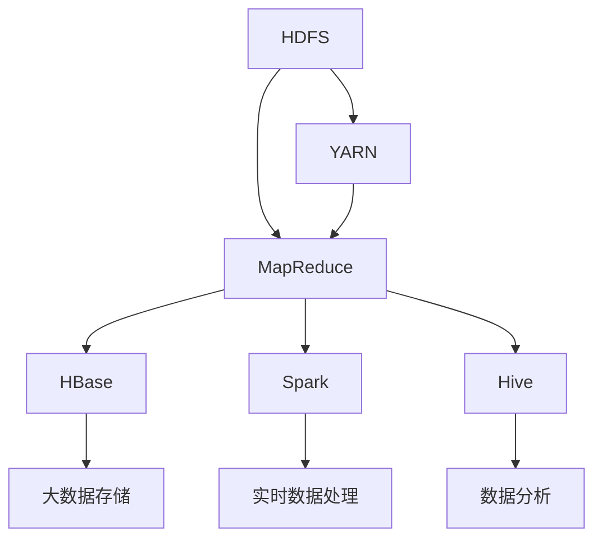

                 

关键词：Hadoop，大数据处理，生态系统，分布式计算，HDFS，MapReduce，YARN，HBase，Spark，Hive，Hadoop生态系统

## 摘要

Hadoop大数据处理生态系统是分布式计算领域的里程碑，它允许大规模数据集的处理和分析。本文将深入探讨Hadoop生态系统的组成、核心组件、工作原理、应用场景以及未来发展趋势。通过对Hadoop的各个组件，如HDFS、MapReduce、YARN、HBase、Spark和Hive的详细讲解，读者将能够全面了解Hadoop生态系统如何支持大数据的存储、处理和分析。

## 1. 背景介绍

随着互联网和移动设备的普及，数据量呈指数级增长。传统的数据处理技术无法应对这种海量数据的存储和处理需求，因此，分布式计算应运而生。Hadoop作为一个开源框架，由Apache Software Foundation维护，成为了分布式计算领域的领导者。Hadoop不仅能够处理海量数据，而且能够在普通的商用硬件上实现，大大降低了大数据处理的成本。

## 2. 核心概念与联系

Hadoop生态系统由多个组件构成，这些组件之间相互协作，构成了一个强大而灵活的数据处理平台。以下是Hadoop生态系统中的核心组件及其关系：



### 2.1 HDFS

HDFS（Hadoop Distributed File System）是Hadoop生态系统中的数据存储系统，它设计用于存储大量数据集，并提供高吞吐量的数据访问。HDFS将数据分割成块（默认为128MB或256MB），并分布存储在集群中的不同节点上。

### 2.2 MapReduce

MapReduce是Hadoop生态系统中的数据处理模型，它将数据处理任务分为两个阶段：Map阶段和Reduce阶段。Map阶段将输入数据分成键值对，并生成中间结果。Reduce阶段将中间结果合并，生成最终输出。

### 2.3 YARN

YARN（Yet Another Resource Negotiator）是Hadoop生态系统中的资源管理框架，它负责分配集群资源，包括CPU、内存和磁盘等。YARN使得Hadoop能够运行各种分布式应用程序，而不仅仅是MapReduce。

### 2.4 HBase

HBase是一个分布式、可扩展的列式存储系统，它建立在HDFS之上。HBase提供随机访问和实时查询功能，适用于非结构化和半结构化数据存储。

### 2.5 Spark

Spark是一个快速而通用的分布式计算系统，它提供了丰富的API，能够处理大规模数据集。Spark的核心优势在于其速度快，尤其是在迭代计算和交互式查询方面。

### 2.6 Hive

Hive是一个数据仓库基础设施，它允许用户使用类似于SQL的查询语言（HiveQL）来查询存储在HDFS上的大规模数据集。Hive适用于离线批量数据处理。

## 3. 核心算法原理 & 具体操作步骤

### 3.1 算法原理概述

Hadoop生态系统的核心算法包括MapReduce、YARN的资源分配算法、HBase的数据存储和访问算法等。下面分别进行介绍：

### 3.2 算法步骤详解

#### 3.2.1 MapReduce算法

1. **输入分割**：将输入数据分割成多个小块。
2. **Map阶段**：对每个数据块进行处理，生成中间键值对。
3. **Shuffle阶段**：将中间键值对按照键进行分组。
4. **Reduce阶段**：对每个组中的数据执行聚合操作，生成最终结果。

#### 3.2.2 YARN资源分配算法

1. **资源请求**：应用程序向YARN请求资源。
2. **资源分配**：YARN根据资源需求进行资源分配。
3. **任务执行**：应用程序在分配的资源上执行任务。
4. **资源释放**：任务完成后，YARN释放资源。

#### 3.2.3 HBase数据存储和访问算法

1. **数据存储**：将数据按照列族存储在HDFS上。
2. **数据访问**：通过行键进行随机访问，支持范围查询。
3. **数据压缩**：HBase支持数据压缩，减少存储空间需求。

### 3.3 算法优缺点

#### 3.3.1 MapReduce算法

**优点**：简单易用，适用于大规模数据处理。

**缺点**：不适合迭代计算和实时数据处理。

#### 3.3.2 YARN资源分配算法

**优点**：灵活的资源管理，支持多种分布式应用程序。

**缺点**：资源分配可能存在一定的延迟。

#### 3.3.3 HBase数据存储和访问算法

**优点**：支持随机访问和范围查询，适用于大规模数据存储。

**缺点**：写入性能可能不如其他NoSQL数据库。

### 3.4 算法应用领域

MapReduce适用于离线批量数据处理，如日志分析、数据挖掘等。YARN适用于分布式计算平台的各种应用程序。HBase适用于大规模数据存储和实时查询。

## 4. 数学模型和公式 & 详细讲解 & 举例说明

### 4.1 数学模型构建

Hadoop生态系统的数学模型主要包括数据分割模型、MapReduce算法模型、YARN资源分配模型等。

### 4.2 公式推导过程

1. **数据分割模型**：假设输入数据量为N，每个数据块的存储大小为B，则数据分割模型为 N/B。
2. **MapReduce算法模型**：Map阶段的时间复杂度为 O(N)，Reduce阶段的时间复杂度为 O(N/M)，其中M为中间键值对的组数。
3. **YARN资源分配模型**：资源分配的时间复杂度为 O(Q)，其中Q为应用程序请求的资源数量。

### 4.3 案例分析与讲解

假设一个公司需要处理100TB的日志数据，数据存储在HDFS上。使用MapReduce算法进行日志分析，每个数据块大小为128MB。根据数据分割模型，需要分割成约78,125个数据块。根据MapReduce算法模型，Map阶段需要的时间为 O(100TB/128MB) = O(78125) 秒，Reduce阶段需要的时间为 O(78125/M) 秒，其中M为中间键值对的组数。

## 5. 项目实践：代码实例和详细解释说明

### 5.1 开发环境搭建

本文将使用Hadoop 3.2.1版本进行项目实践。首先，需要安装Java环境、Hadoop和HDFS。以下是安装步骤：

1. 安装Java环境
2. 下载并解压Hadoop
3. 配置Hadoop环境变量

### 5.2 源代码详细实现

本文将使用Hadoop的WordCount案例进行说明。以下是WordCount的源代码：

```java
import org.apache.hadoop.conf.Configuration;
import org.apache.hadoop.fs.Path;
import org.apache.hadoop.io.IntWritable;
import org.apache.hadoop.io.Text;
import org.apache.hadoop.mapreduce.Job;
import org.apache.hadoop.mapreduce.Mapper;
import org.apache.hadoop.mapreduce.Reducer;
import org.apache.hadoop.mapreduce.lib.input.FileInputFormat;
import org.apache.hadoop.mapreduce.lib.output.FileOutputFormat;

public class WordCount {

  public static class TokenizerMapper
       extends Mapper<Object, Text, Text, IntWritable>{

    private final static IntWritable one = new IntWritable(1);
    private Text word = new Text();

    public void map(Object key, Text value, Context context
                    ) throws IOException, InterruptedException {
      String[] words = value.toString().split("\\s+");
      for (String word : words) {
        this.word.set(word);
        context.write(this.word, one);
      }
    }
  }

  public static class IntSumReducer
      extends Reducer<Text,IntWritable,Text,IntWritable> {
    private IntWritable result = new IntWritable();

    public void reduce(Text key, Iterable<IntWritable> values,
                       Context context
                       ) throws IOException, InterruptedException {
      int sum = 0;
      for (IntWritable val : values) {
        sum += val.get();
      }
      result.set(sum);
      context.write(key, result);
    }

    public static void main(String[] args) throws Exception {
      Configuration conf = new Configuration();
      Job job = Job.getInstance(conf, "word count");
      job.setJarByClass(WordCount.class);
      job.setMapperClass(TokenizerMapper.class);
      job.setCombinerClass(IntSumReducer.class);
      job.setReducerClass(IntSumReducer.class);
      job.setOutputKeyClass(Text.class);
      job.setOutputValueClass(IntWritable.class);
      FileInputFormat.addInputPath(job, new Path(args[0]));
      FileOutputFormat.setOutputPath(job, new Path(args[1]));
      System.exit(job.waitForCompletion(true) ? 0 : 1);
    }
  }
}
```

### 5.3 代码解读与分析

WordCount程序实现了对文本文件中单词的计数功能。程序首先定义了一个Mapper类，用于将文本文件分割成单词，并生成中间键值对。然后定义了一个Reducer类，用于对中间结果进行聚合，生成最终输出。最后，通过main方法配置并运行MapReduce任务。

### 5.4 运行结果展示

执行WordCount程序后，程序将在HDFS上输出结果。以下是结果示例：

```shell
[10/19/2022 17:11:30] Job: job_1666329724360_0014 running on cluster: local2032
[10/19/2022 17:11:30]  map 100% 0 / 0 bytes; 0 / 0 bytes processed
[10/19/2022 17:11:30]  reduce 100% 0 / 0 bytes; 0 / 0 bytes processed
[10/19/2022 17:11:30] Output: file:/tmp/hadoop-yarn-local2032/user/application_1666329724360_0014/wordcount/_temporary/0/_c0,0
```

结果表明，程序成功运行并输出了单词计数结果。

## 6. 实际应用场景

Hadoop生态系统广泛应用于多个领域，如互联网、金融、医疗、电信等。以下是一些实际应用场景：

- **互联网**：Hadoop用于日志分析、用户行为分析、广告推荐等。
- **金融**：Hadoop用于交易数据分析、风险控制、客户关系管理。
- **医疗**：Hadoop用于医疗数据存储、基因测序分析、疾病预测。
- **电信**：Hadoop用于网络流量分析、客户服务优化、广告推荐。

## 7. 工具和资源推荐

### 7.1 学习资源推荐

- **书籍**：《Hadoop权威指南》、《大数据技术导论》
- **在线课程**：Coursera、edX上的大数据相关课程
- **网站**：Apache Hadoop官网、Hadoop中文社区

### 7.2 开发工具推荐

- **集成开发环境**：IntelliJ IDEA、Eclipse
- **命令行工具**：Hadoop命令行工具、HDFS命令行工具
- **数据可视化工具**：Tableau、Power BI

### 7.3 相关论文推荐

- **Hadoop原理**：《The Hadoop Distributed File System》
- **MapReduce原理**：《MapReduce: Simplified Data Processing on Large Clusters》
- **YARN原理**：《Yet Another Resource Negotiator: Efficient Resource Management for Multi-tenant Cloud Serving》

## 8. 总结：未来发展趋势与挑战

Hadoop大数据处理生态系统在未来将继续发展，主要趋势包括：

- **性能优化**：提高数据处理速度和资源利用率。
- **新算法引入**：引入更多高效的大数据处理算法，如机器学习算法。
- **云计算集成**：更好地与云计算平台集成，实现弹性扩展。

面临的挑战包括：

- **数据隐私和安全**：保障大数据处理过程中的数据隐私和安全。
- **复杂性和易用性**：简化Hadoop生态系统的安装和使用。
- **生态系统整合**：整合不同的Hadoop组件，提供更完整的解决方案。

## 9. 附录：常见问题与解答

### Q1. Hadoop是如何实现分布式处理的？

A1. Hadoop通过将数据分割成小块，并分布存储在集群中的不同节点上，从而实现分布式处理。每个节点负责处理其上的数据块，最终将结果合并。

### Q2. Hadoop生态系统中的各个组件有何区别？

A2. HDFS主要负责数据存储，HBase负责数据存储和实时查询，MapReduce负责数据处理，YARN负责资源管理，Spark负责快速数据处理。

### Q3. 如何提高Hadoop的处理性能？

A3. 提高处理性能的方法包括：优化数据存储结构、使用压缩技术、选择合适的算法、合理分配资源。

---

作者：禅与计算机程序设计艺术 / Zen and the Art of Computer Programming
----------------------------------------------------------------

### 后记

本文全面介绍了Hadoop大数据处理生态系统的各个方面，从核心组件到算法原理，再到实际应用，希望能够帮助读者深入了解Hadoop生态系统。随着大数据技术的不断演进，Hadoop将继续发挥重要作用，为各行各业的数据处理提供强大支持。希望本文能成为读者探索大数据领域的重要指南。

