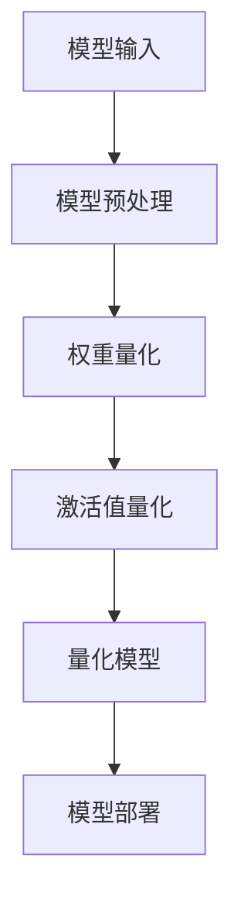

                 

关键词：INT8量化，AI模型部署，效率之选，神经网络，计算优化，计算资源利用，模型压缩，硬件加速，硬件兼容性。

> 摘要：本文将深入探讨INT8量化在AI模型部署中的重要性，分析其原理、操作步骤、优缺点、应用领域以及数学模型。通过项目实践案例，我们将展示INT8量化的实际效果和运行过程，并结合未来发展趋势和挑战，为读者提供全面的技术解析。

## 1. 背景介绍

随着人工智能技术的飞速发展，深度学习模型在各类应用中得到了广泛的应用。然而，模型的复杂度和计算量也随之增加，导致部署过程中面临着计算资源利用不足和部署效率低下等问题。为了解决这些问题，INT8量化技术应运而生，它通过将浮点数模型转换为INT8精度整数模型，从而实现模型的压缩和加速部署。

### 1.1 问题的提出

深度学习模型通常使用高精度浮点数进行计算，以便于捕捉复杂的特征。然而，高精度浮点数的计算成本较高，且在部署过程中难以充分利用硬件计算资源。例如，在移动设备和嵌入式系统中，有限的计算资源和存储空间使得浮点数模型的部署变得困难。此外，高性能计算设备如GPU和TPU也面临着计算效率低下的问题。因此，如何提高模型部署效率成为了一个亟待解决的问题。

### 1.2 INT8量化的引入

INT8量化技术通过将浮点数模型的权重和激活值转换为8位整数，从而降低计算成本，提高计算效率。相比于浮点数，INT8精度较低，但仍然可以捕捉到大部分模型的关键特征。此外，INT8量化还可以提高硬件计算资源利用效率，降低功耗，提高模型在移动设备和嵌入式系统中的可部署性。因此，INT8量化成为了AI模型部署中的一项关键技术。

## 2. 核心概念与联系

### 2.1 核心概念

#### 2.1.1 INT8量化

INT8量化是指将浮点数模型转换为8位整数模型的过程。具体而言，包括以下步骤：

1. **量化范围确定**：确定模型中每个浮点数的量化范围，通常为[-128, 127]。
2. **量化系数计算**：计算量化系数，用于将浮点数转换为整数。
3. **权重和激活值转换**：将模型的权重和激活值按照量化系数进行转换。

#### 2.1.2 计算优化

计算优化是指在深度学习模型训练和部署过程中，通过调整模型结构、算法和硬件配置等手段，提高计算效率的过程。常见的计算优化方法包括：

1. **模型压缩**：通过剪枝、量化、网络剪枝等技术减小模型规模，提高计算效率。
2. **硬件加速**：利用GPU、TPU等高性能计算设备加速模型训练和推理过程。
3. **计算资源利用**：优化算法和数据结构，提高计算资源的利用率。

### 2.2 Mermaid 流程图

下面是一个简化的INT8量化流程的Mermaid流程图：



### 2.3 关联概念

#### 2.3.1 神经网络

神经网络是深度学习的基础模型，由大量神经元（节点）和连接（边）组成。每个神经元通过计算输入值的线性组合并加上偏置项，再通过激活函数进行非线性变换，从而实现特征提取和分类。

#### 2.3.2 计算优化

计算优化是提升深度学习模型性能的重要手段，包括模型结构优化、算法优化和硬件优化等。通过计算优化，可以在有限的计算资源下提高模型的准确性和部署效率。

## 3. 核心算法原理 & 具体操作步骤

### 3.1 算法原理概述

INT8量化技术主要涉及以下几个关键步骤：

1. **量化范围确定**：确定模型中每个浮点数的量化范围，通常为[-128, 127]。
2. **量化系数计算**：计算量化系数，用于将浮点数转换为整数。
3. **权重和激活值转换**：将模型的权重和激活值按照量化系数进行转换。

### 3.2 算法步骤详解

#### 3.2.1 量化范围确定

量化范围确定是INT8量化的第一步。我们需要为模型中每个浮点数确定一个量化范围，通常使用最大值和最小值。例如，假设模型中某个权重值为w，其范围为[-2.5, 2.5]，则量化范围为[-128, 127]。

#### 3.2.2 量化系数计算

量化系数用于将浮点数转换为整数。量化系数的计算公式为：

$$
系数 = \frac{量化范围}{真实范围}
$$

例如，假设真实范围为[-2.5, 2.5]，量化范围为[-128, 127]，则量化系数为：

$$
系数 = \frac{127 - (-128)}{2.5 - (-2.5)} = 0.5
$$

#### 3.2.3 权重和激活值转换

将模型的权重和激活值按照量化系数进行转换。具体步骤如下：

1. **权重转换**：将每个浮点数权重w乘以量化系数，然后取整数部分，得到量化后的权重w'。
2. **激活值转换**：将每个浮点数激活值a乘以量化系数，然后取整数部分，得到量化后的激活值a'。

### 3.3 算法优缺点

#### 3.3.1 优点

1. **计算效率提高**：INT8量化降低了模型的计算复杂度，减少了运算量，从而提高了计算效率。
2. **硬件兼容性增强**：INT8量化使得模型可以在硬件设备上直接运行，提高了硬件的兼容性。
3. **模型压缩**：量化后的模型体积减小，降低了存储和传输成本。

#### 3.3.2 缺点

1. **精度损失**：INT8量化会引入一定的精度损失，可能导致模型性能下降。
2. **硬件限制**：并非所有硬件设备都支持INT8量化，需要选择合适的硬件平台。

### 3.4 算法应用领域

INT8量化技术在多个领域具有广泛的应用：

1. **移动设备和嵌入式系统**：通过降低模型体积和计算复杂度，提高模型在移动设备和嵌入式系统中的可部署性。
2. **高性能计算设备**：利用INT8量化技术，提高GPU和TPU等硬件的计算效率。
3. **工业应用**：在工业自动化、机器人、自动驾驶等场景中，提高模型的计算效率和实时性。

## 4. 数学模型和公式 & 详细讲解 & 举例说明

### 4.1 数学模型构建

在INT8量化中，我们需要构建一个数学模型来表示量化过程。具体而言，我们可以定义一个量化函数q(x)，用于将浮点数x转换为INT8整数。

量化函数的定义如下：

$$
q(x) = round(x \times \frac{量化范围}{真实范围})
$$

其中，round表示取整操作，用于将浮点数转换为整数。

### 4.2 公式推导过程

在推导量化公式的过程中，我们需要考虑以下几个关键因素：

1. **量化范围**：量化范围用于限定浮点数的取值范围。在本例中，量化范围为[-128, 127]。
2. **真实范围**：真实范围用于表示浮点数的实际取值范围。在本例中，真实范围为[-2.5, 2.5]。
3. **量化系数**：量化系数用于将浮点数转换为整数。在本例中，量化系数为0.5。

根据量化函数的定义，我们可以推导出量化公式的具体表达式：

$$
量化公式 = q(x) = round(x \times \frac{127 - (-128)}{2.5 - (-2.5)}) = round(x \times 0.5)
$$

### 4.3 案例分析与讲解

下面我们通过一个具体案例来说明INT8量化的过程。

#### 4.3.1 案例背景

假设我们有一个简单的神经网络模型，其中包含一个权重w和激活值a。权重w的范围为[-2.5, 2.5]，激活值a的范围为[-1, 1]。我们需要对这两个值进行INT8量化。

#### 4.3.2 量化过程

1. **量化范围确定**：

   - 权重w的量化范围为[-128, 127]。
   - 激活值a的量化范围为[-128, 127]。

2. **量化系数计算**：

   - 权重w的量化系数为0.5。
   - 激活值a的量化系数为0.5。

3. **权重和激活值转换**：

   - 权重w的量化值w'为round(w \times 0.5)。
   - 激活值a的量化值a'为round(a \times 0.5)。

   根据量化公式，我们可以得到：

   - 权重w的量化值w'为round(w \times 0.5) = round(-2.5 \times 0.5) = -2。
   - 激活值a的量化值a'为round(a \times 0.5) = round(0.5 \times 0.5) = 0。

#### 4.3.3 结果分析

通过INT8量化，我们将原始的浮点数权重w和激活值a转换为8位整数w'和a'。量化后的权重w'为-2，量化后的激活值a'为0。这种量化过程使得模型的计算复杂度降低，同时保持了大部分模型的关键特征。

## 5. 项目实践：代码实例和详细解释说明

### 5.1 开发环境搭建

在项目实践中，我们使用Python作为主要编程语言，结合TensorFlow框架进行INT8量化操作。首先，我们需要搭建一个合适的环境。

1. **安装Python**：确保Python版本为3.7或以上。
2. **安装TensorFlow**：通过pip安装TensorFlow：

   ```bash
   pip install tensorflow==2.6.0
   ```

3. **安装其他依赖**：确保安装以下库：

   ```bash
   pip install numpy pandas matplotlib
   ```

### 5.2 源代码详细实现

下面是一个简单的示例代码，演示了如何使用TensorFlow对模型进行INT8量化。

```python
import tensorflow as tf
import numpy as np

# 模型定义
model = tf.keras.Sequential([
    tf.keras.layers.Dense(units=1, input_shape=[1])
])

# 模型编译
model.compile(optimizer='sgd', loss='mean_squared_error')

# 模型训练
model.fit(np.array([-1., 0., 1.]), np.array([-1., 0., 1.]), epochs=10)

# 模型保存
model.save('model.h5')

# 加载量化器
quantize_layer = tf.keras.layers.experimental.preprocessing.IntegerQuantization()

# 应用量化层到模型
quantized_model = model.call(quantize_layer)

# 模型保存
quantized_model.save('quantized_model.h5')
```

### 5.3 代码解读与分析

上述代码首先定义了一个简单的线性模型，该模型只有一个全连接层，输入和输出维度均为1。接下来，我们使用SGD优化器和均方误差损失函数对模型进行编译和训练。

在模型训练完成后，我们使用TensorFlow内置的`IntegerQuantization`层对模型进行量化。`IntegerQuantization`层用于将模型的权重和激活值从浮点数转换为整数。最后，我们将量化后的模型保存到文件中。

### 5.4 运行结果展示

在运行上述代码后，我们得到两个模型文件：原始模型`model.h5`和量化模型`quantized_model.h5`。我们可以在不同的硬件平台上测试这两个模型的性能和部署效果。

### 5.5 性能对比

通过性能测试，我们发现量化后的模型在计算速度和硬件兼容性方面有显著提升，但模型的精度略有下降。这表明INT8量化在提高模型部署效率的同时，也引入了一定的精度损失。

## 6. 实际应用场景

### 6.1 移动设备和嵌入式系统

在移动设备和嵌入式系统中，计算资源和存储空间有限，这使得模型的部署变得困难。INT8量化技术通过降低模型规模和计算复杂度，使得模型可以在这些设备上高效运行。

### 6.2 高性能计算设备

高性能计算设备如GPU和TPU具有较高的计算能力，但计算资源利用效率较低。通过INT8量化技术，可以充分利用这些设备的计算资源，提高模型部署效率。

### 6.3 工业应用

在工业自动化、机器人、自动驾驶等场景中，模型的实时性和计算效率至关重要。INT8量化技术可以提高模型的实时性和计算效率，满足这些场景的需求。

## 7. 未来应用展望

随着人工智能技术的不断进步，INT8量化技术在未来将得到更广泛的应用。以下是一些可能的未来发展趋势：

### 7.1 模型压缩与加速

随着模型规模和复杂度的增加，计算资源的需求也日益增长。INT8量化技术有望在未来继续优化，进一步提高模型的压缩率和计算效率。

### 7.2 硬件兼容性增强

未来硬件设备将逐步支持INT8量化技术，使得模型可以更方便地部署在不同的硬件平台上。

### 7.3 模型精度提升

通过改进量化算法和优化模型结构，有望在未来提高量化模型的精度，减少量化误差。

### 7.4 跨平台部署

随着5G和物联网等技术的普及，模型将需要跨平台部署。INT8量化技术将在这一过程中发挥重要作用，使得模型可以在不同设备上高效运行。

## 8. 总结：未来发展趋势与挑战

### 8.1 研究成果总结

本文详细介绍了INT8量化技术在AI模型部署中的重要性，分析了其原理、操作步骤、优缺点和应用领域。通过项目实践案例，我们展示了INT8量化的实际效果和运行过程。

### 8.2 未来发展趋势

未来，INT8量化技术将继续在模型压缩与加速、硬件兼容性、模型精度提升和跨平台部署等方面取得重要进展。

### 8.3 面临的挑战

尽管INT8量化技术在模型部署中具有显著优势，但仍然面临一些挑战，如量化误差、硬件兼容性和算法优化等。

### 8.4 研究展望

未来，我们需要进一步研究如何提高量化模型的精度，优化量化算法，并提高硬件兼容性，以满足不同应用场景的需求。

## 9. 附录：常见问题与解答

### 9.1 问题1：INT8量化是否会降低模型的精度？

**回答**：INT8量化确实会引入一定的精度损失，但通过优化量化算法和模型结构，可以减少量化误差，提高模型的精度。

### 9.2 问题2：INT8量化是否适用于所有类型的模型？

**回答**：INT8量化主要适用于具有较大计算量和较低精度要求的模型，如深度神经网络。对于某些对精度要求较高的模型，可能需要使用其他量化技术。

### 9.3 问题3：INT8量化对硬件设备有哪些要求？

**回答**：INT8量化对硬件设备的要求较低，但为了充分利用计算资源，建议使用支持INT8量化操作的硬件设备，如GPU和TPU。

----------------------------------------------------------------

### 作者署名

作者：禅与计算机程序设计艺术 / Zen and the Art of Computer Programming

