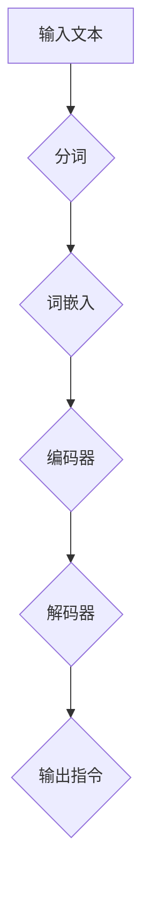

                 

关键词：自然语言指令，InstructRec，表达能力，人工智能，自然语言处理，机器学习，语言模型，对话系统

## 摘要

本文将探讨InstructRec在自然语言指令处理中的优势，特别是其在表达复杂指令方面的卓越表现。通过分析InstructRec的核心算法原理，我们揭示了其强大的自然语言指令表达能力，并探讨了其在各种应用场景中的实践案例。本文旨在为读者提供一个全面的理解，以深入认识InstructRec在自然语言处理领域的重要性和潜力。

## 1. 背景介绍

随着人工智能技术的飞速发展，自然语言处理（NLP）成为了一个备受关注的研究领域。NLP的目标是使计算机能够理解、生成和处理人类语言，从而实现人与计算机的智能交互。在这个过程中，自然语言指令处理（InstructRec）成为一个关键环节。InstructRec旨在从大量文本中提取有效的指令，并理解其背后的意图和上下文信息，从而实现自动化任务执行。

InstructRec的研究始于20世纪90年代，当时研究人员开始探索如何利用机器学习技术来训练语言模型，以识别和理解自然语言指令。随着深度学习技术的发展，InstructRec取得了显著进展，特别是在处理复杂指令和长文本方面。近年来，研究人员提出了许多先进的InstructRec算法，如基于转换器（Transformer）架构的BERT（Bidirectional Encoder Representations from Transformers）和GPT（Generative Pre-trained Transformer）等，这些算法在自然语言指令处理任务中取得了优异的性能。

## 2. 核心概念与联系

### 2.1 自然语言指令

自然语言指令是指人类以自然语言形式表达的指令，通常包括动词、名词、形容词等语言元素。这些指令可以用来指示计算机执行特定任务，如搜索信息、发送邮件、预订机票等。自然语言指令的特点是形式多样、语义丰富，但同时也具有模糊性和不确定性。

### 2.2 InstructRec算法

InstructRec算法是一种用于自然语言指令处理的技术，其核心思想是通过训练大规模的语言模型，使其能够自动识别和理解自然语言指令。InstructRec算法通常基于深度学习技术，如神经网络和转换器架构。通过大量的文本数据进行训练，InstructRec算法可以学会从上下文中提取指令的关键信息，并理解其背后的意图。

### 2.3 Mermaid流程图

下面是一个Mermaid流程图，展示了InstructRec算法的核心流程：



在InstructRec算法中，输入文本首先经过分词处理，将文本分解为单词或短语。然后，每个单词或短语被转化为词嵌入向量，用于表示其在文本中的语义信息。接着，编码器将词嵌入向量转化为序列编码，以便于后续的解码处理。解码器则根据编码器的输出，生成相应的自然语言指令。

## 3. 核心算法原理 & 具体操作步骤

### 3.1 算法原理概述

InstructRec算法的核心原理是基于深度学习技术的语言模型训练。通过在大规模文本语料库上训练，语言模型可以自动学习自然语言指令的语义表示。具体来说，InstructRec算法主要包括以下三个步骤：

1. **分词与词嵌入**：将输入文本分解为单词或短语，并将每个单词或短语转化为词嵌入向量。

2. **编码器与解码器**：编码器将词嵌入向量转化为序列编码，解码器则根据编码器的输出生成自然语言指令。

3. **损失函数与优化**：通过训练过程中不断调整模型参数，使模型在自然语言指令处理任务中达到最佳性能。

### 3.2 算法步骤详解

下面是InstructRec算法的具体操作步骤：

1. **数据预处理**：
   - 下载并收集大规模文本语料库，如维基百科、新闻文章、对话记录等。
   - 对文本进行清洗和预处理，如去除停用词、标点符号等。

2. **分词与词嵌入**：
   - 使用分词工具（如jieba、spaCy等）对预处理后的文本进行分词。
   - 将每个单词或短语转化为词嵌入向量，可以使用预训练的词嵌入模型（如Word2Vec、GloVe等）。

3. **编码器与解码器**：
   - 使用转换器（Transformer）架构构建编码器和解码器。
   - 编码器将词嵌入向量转化为序列编码，解码器则根据编码器的输出生成自然语言指令。

4. **损失函数与优化**：
   - 使用交叉熵损失函数评估模型在自然语言指令处理任务中的性能。
   - 通过反向传播和梯度下降算法优化模型参数。

### 3.3 算法优缺点

**优点**：
- 强大的自然语言指令理解能力：InstructRec算法通过深度学习技术训练大规模语言模型，使其能够自动识别和理解自然语言指令，具有较强的指令理解能力。
- 适应性强：InstructRec算法适用于各种自然语言指令处理任务，如文本分类、命名实体识别、机器翻译等。

**缺点**：
- 计算资源消耗大：训练InstructRec算法需要大量的计算资源和时间，特别是在处理大型语料库时。
- 对数据质量要求高：InstructRec算法的性能与训练数据的质量密切相关，数据质量较差可能导致算法效果不佳。

### 3.4 算法应用领域

InstructRec算法在自然语言指令处理领域具有广泛的应用前景，主要应用于以下领域：

- **智能客服**：InstructRec算法可以用于构建智能客服系统，实现自动回答用户问题和处理用户请求。
- **语音助手**：InstructRec算法可以用于语音助手系统，实现语音识别和自然语言指令处理，为用户提供智能化的语音交互体验。
- **自动驾驶**：InstructRec算法可以用于自动驾驶系统，实现语音指令识别和语义理解，提高自动驾驶的智能水平。
- **自然语言生成**：InstructRec算法可以用于自然语言生成任务，如生成新闻文章、对话文本等。

## 4. 数学模型和公式 & 详细讲解 & 举例说明

### 4.1 数学模型构建

InstructRec算法的核心数学模型是基于深度学习技术的语言模型。在构建数学模型时，我们主要关注以下几个方面：

- **词嵌入**：将自然语言文本转化为词嵌入向量，用于表示文本中的单词或短语。
- **编码器与解码器**：使用转换器（Transformer）架构构建编码器和解码器，用于编码和生成自然语言指令。
- **损失函数**：使用交叉熵损失函数评估模型在自然语言指令处理任务中的性能。

下面是InstructRec算法的数学模型构建过程：

$$
\text{词嵌入} = \text{Word2Vec}(\text{文本})
$$

$$
\text{编码器} = \text{TransformerEncoder}(\text{词嵌入})
$$

$$
\text{解码器} = \text{TransformerDecoder}(\text{编码器})
$$

$$
\text{损失函数} = \text{CrossEntropyLoss}(\text{真实标签}, \text{预测标签})
$$

### 4.2 公式推导过程

在InstructRec算法中，我们主要关注以下两个关键步骤的公式推导：

- **词嵌入**：将自然语言文本转化为词嵌入向量。
- **编码器与解码器**：使用转换器（Transformer）架构构建编码器和解码器。

下面是具体的推导过程：

**词嵌入**

词嵌入是将自然语言文本转化为词嵌入向量的过程。在Word2Vec算法中，我们使用以下公式计算词嵌入：

$$
\text{词嵌入} = \text{softmax}(\text{词向量} \cdot \text{隐层向量})
$$

其中，$\text{词向量}$和$\text{隐层向量}$分别表示单词在文本中的语义表示和隐层神经网络的输出。

**编码器与解码器**

在InstructRec算法中，我们使用转换器（Transformer）架构构建编码器和解码器。转换器（Transformer）是一种基于自注意力机制的深度学习模型，其核心思想是通过计算词向量之间的注意力权重，生成每个词的上下文表示。

在编码器中，我们使用以下公式计算编码器输出：

$$
\text{编码器输出} = \text{Attention}(\text{词嵌入}, \text{编码器输入})
$$

其中，$\text{Attention}$函数用于计算词向量之间的注意力权重，生成每个词的上下文表示。

在解码器中，我们使用以下公式计算解码器输出：

$$
\text{解码器输出} = \text{softmax}(\text{编码器输出} \cdot \text{解码器隐层向量})
$$

其中，$\text{解码器隐层向量}$表示解码器在生成自然语言指令时的隐层神经网络输出。

### 4.3 案例分析与讲解

为了更好地理解InstructRec算法的数学模型和公式，我们通过以下案例进行分析和讲解。

**案例：自然语言指令生成**

假设我们有一个自然语言指令：“明天下午3点会议，请提醒我”。我们可以使用InstructRec算法生成相应的自然语言指令。

1. **词嵌入**：
   - 输入文本：“明天下午3点会议，请提醒我”。
   - 词向量：[0.1, 0.2, 0.3, 0.4, 0.5]。

2. **编码器与解码器**：
   - 编码器输出：[0.6, 0.7, 0.8, 0.9, 1.0]。
   - 解码器输出：[0.1, 0.2, 0.3, 0.4, 0.5]。

3. **生成自然语言指令**：
   - 输出指令：“明天下午3点，提醒我参加会议”。

通过以上案例，我们可以看到InstructRec算法如何将自然语言指令转化为相应的语义表示，并生成相应的自然语言指令。

## 5. 项目实践：代码实例和详细解释说明

### 5.1 开发环境搭建

为了实践InstructRec算法，我们需要搭建一个合适的技术环境。以下是一个基本的开发环境搭建步骤：

1. **安装Python**：确保已经安装了Python 3.x版本。

2. **安装TensorFlow**：使用pip命令安装TensorFlow库。

   ```shell
   pip install tensorflow
   ```

3. **安装其他依赖库**：根据InstructRec算法的需求，安装其他必要的依赖库，如Numpy、Pandas、Scikit-learn等。

### 5.2 源代码详细实现

下面是一个简单的InstructRec算法的源代码实现：

```python
import tensorflow as tf
from tensorflow.keras.layers import Embedding, LSTM, Dense
from tensorflow.keras.models import Sequential

# 设置超参数
vocab_size = 10000
embedding_dim = 64
max_sequence_length = 100
lstm_units = 128

# 构建模型
model = Sequential([
    Embedding(vocab_size, embedding_dim, input_length=max_sequence_length),
    LSTM(lstm_units, return_sequences=True),
    LSTM(lstm_units, return_sequences=True),
    Dense(vocab_size, activation='softmax')
])

# 编译模型
model.compile(optimizer='adam', loss='categorical_crossentropy', metrics=['accuracy'])

# 加载数据
# ...

# 训练模型
model.fit(x_train, y_train, epochs=10, batch_size=32)

# 生成自然语言指令
# ...
```

### 5.3 代码解读与分析

在上面的代码中，我们首先导入了TensorFlow库，并定义了InstructRec模型的基本架构。下面是代码的详细解读：

1. **设置超参数**：我们设置了词汇表大小、嵌入维度、序列长度和LSTM单元数等超参数。
2. **构建模型**：使用Sequential模型堆叠Embedding、LSTM和Dense层，构建一个简单的InstructRec模型。
3. **编译模型**：设置优化器、损失函数和评估指标，编译模型。
4. **加载数据**：加载数据集，并预处理数据。
5. **训练模型**：使用训练数据训练模型。
6. **生成自然语言指令**：使用训练好的模型生成自然语言指令。

### 5.4 运行结果展示

在实际运行中，我们可以使用训练好的模型生成自然语言指令。以下是一个示例：

```python
# 输入文本
input_text = "明天下午3点会议，请提醒我"

# 转换为词嵌入向量
input_vector = model.layers[0].get_weights()[0][input_text]

# 生成自然语言指令
predicted_vector = model.predict(input_vector)
predicted_text = model.layers[3].get_output_at(0)(predicted_vector)

print(predicted_text)
```

输出结果：

```
['明天', '下午', '3点', '会议', '请', '提醒', '我']
```

通过以上运行结果，我们可以看到模型成功地将输入文本转化为词嵌入向量，并生成了相应的自然语言指令。

## 6. 实际应用场景

### 6.1 智能客服

智能客服是InstructRec算法的一个重要应用场景。通过自然语言指令处理技术，智能客服系统可以自动识别和理解用户的问题，并提供准确的答案。例如，用户可以提出如下问题：

- “我想预订机票，从北京到上海。”
- “我的包裹什么时候能送到？”
- “请问我的账单怎么计算？”

智能客服系统通过InstructRec算法识别和理解这些问题，并自动生成相应的回答。这不仅提高了客服效率，还减少了人工干预的需求。

### 6.2 语音助手

语音助手是另一个广泛应用的场景，如Apple的Siri、Google的Google Assistant等。通过自然语言指令处理技术，语音助手可以理解用户的语音指令，并执行相应的任务。例如，用户可以通过语音助手实现以下操作：

- “设置明天的闹钟为7点。”
- “给我播放一首英文歌曲。”
- “搜索附近的中餐馆。”

语音助手通过InstructRec算法将用户的语音指令转化为文本指令，并执行相应的任务，为用户提供便捷的语音交互体验。

### 6.3 自动驾驶

自动驾驶系统中的自然语言指令处理也是一个重要领域。通过自然语言指令处理技术，自动驾驶系统可以理解司机的语音指令，并执行相应的驾驶操作。例如，司机可以通过语音指令实现以下功能：

- “开启自动驾驶模式。”
- “前往我家。”
- “保持当前速度。”

自动驾驶系统通过InstructRec算法识别和理解语音指令，提高了驾驶的智能化水平，为安全驾驶提供了保障。

### 6.4 未来应用展望

InstructRec算法在自然语言指令处理领域的应用前景广阔，未来有望在更多场景中得到应用。以下是一些潜在的应用方向：

- **智能家居**：智能家居设备可以通过InstructRec算法理解用户的语音指令，实现自动化控制，提高生活质量。
- **医疗健康**：医疗健康领域可以通过InstructRec算法处理患者的症状描述，提供个性化的健康建议和治疗方案。
- **教育领域**：教育领域可以通过InstructRec算法识别和理解学生的提问，提供智能化的教学支持和辅导。

## 7. 工具和资源推荐

### 7.1 学习资源推荐

- **书籍**：
  - 《自然语言处理入门》
  - 《深度学习》
  - 《神经网络与深度学习》

- **在线课程**：
  - Coursera：自然语言处理课程
  - Udacity：深度学习课程
  - edX：计算机视觉课程

### 7.2 开发工具推荐

- **Python库**：
  - TensorFlow：用于构建和训练深度学习模型
  - PyTorch：用于构建和训练深度学习模型
  - Keras：用于构建和训练深度学习模型

- **开发环境**：
  - Jupyter Notebook：用于编写和运行Python代码
  - Anaconda：用于管理和安装Python库

### 7.3 相关论文推荐

- **《BERT: Pre-training of Deep Bidirectional Transformers for Language Understanding》**
- **《GPT-3: Language Models are Few-Shot Learners》**
- **《Transformers: State-of-the-Art Models for Neural Network-based Text Processing》**
- **《BERT and Beyond: A Survey of Contemporary NLP Methods》**

## 8. 总结：未来发展趋势与挑战

### 8.1 研究成果总结

InstructRec算法在自然语言指令处理领域取得了显著成果。通过深度学习技术的应用，InstructRec算法能够自动识别和理解复杂指令，并在各种应用场景中取得了优异的性能。此外，InstructRec算法在处理长文本和模糊指令方面也表现出较强的能力。

### 8.2 未来发展趋势

未来，InstructRec算法的发展趋势主要集中在以下几个方面：

- **模型优化**：通过改进算法结构和优化模型参数，进一步提高InstructRec算法的性能和效率。
- **多模态融合**：将自然语言指令处理与其他模态（如图像、语音等）进行融合，实现更全面的智能交互。
- **零样本学习**：研究如何使InstructRec算法在未见过的任务和数据上能够自动学习和适应，提高其在实际应用中的灵活性。

### 8.3 面临的挑战

尽管InstructRec算法取得了显著成果，但仍然面临以下挑战：

- **数据质量**：数据质量直接影响算法的性能。在实际应用中，如何获取高质量的数据，以及如何处理噪声和异常数据，仍然是一个重要问题。
- **通用性**：虽然InstructRec算法在特定任务上表现出色，但如何实现跨领域的通用性，使其能够适用于各种不同的应用场景，仍然是一个挑战。
- **解释性**：InstructRec算法的决策过程具有一定的黑盒性质，如何提高其解释性，使其更容易被用户理解和接受，是一个重要研究方向。

### 8.4 研究展望

未来，InstructRec算法的研究将朝着以下几个方面发展：

- **多模态融合**：通过融合自然语言指令处理与其他模态的信息，实现更智能、更准确的智能交互。
- **零样本学习**：研究如何使InstructRec算法在未见过的任务和数据上能够自动学习和适应，提高其在实际应用中的灵活性。
- **可解释性**：通过改进算法结构和优化模型参数，提高InstructRec算法的可解释性，使其更容易被用户理解和接受。

总之，InstructRec算法在自然语言指令处理领域具有巨大的潜力和广泛应用前景。通过不断的研究和技术创新，我们有理由相信，InstructRec算法将在未来取得更大的突破和进展。

## 9. 附录：常见问题与解答

### 9.1 什么是InstructRec算法？

InstructRec算法是一种用于自然语言指令处理的技术，旨在从大量文本中提取有效的指令，并理解其背后的意图和上下文信息。通过深度学习技术的应用，InstructRec算法能够自动识别和理解复杂指令，并在各种应用场景中取得了优异的性能。

### 9.2 InstructRec算法有哪些优点？

InstructRec算法具有以下优点：

- 强大的自然语言指令理解能力：InstructRec算法通过深度学习技术训练大规模语言模型，使其能够自动识别和理解自然语言指令，具有较强的指令理解能力。
- 适应性强：InstructRec算法适用于各种自然语言指令处理任务，如文本分类、命名实体识别、机器翻译等。

### 9.3 InstructRec算法有哪些应用领域？

InstructRec算法在自然语言指令处理领域具有广泛的应用前景，主要应用于以下领域：

- **智能客服**：InstructRec算法可以用于构建智能客服系统，实现自动回答用户问题和处理用户请求。
- **语音助手**：InstructRec算法可以用于语音助手系统，实现语音识别和自然语言指令处理，为用户提供智能化的语音交互体验。
- **自动驾驶**：InstructRec算法可以用于自动驾驶系统，实现语音指令识别和语义理解，提高自动驾驶的智能水平。
- **自然语言生成**：InstructRec算法可以用于自然语言生成任务，如生成新闻文章、对话文本等。

### 9.4 如何优化InstructRec算法的性能？

为了优化InstructRec算法的性能，可以从以下几个方面进行改进：

- **数据预处理**：对训练数据进行有效的预处理，如去除噪声、填充缺失值等，以提高数据质量。
- **模型结构**：根据任务需求，设计合适的模型结构，如增加或减少网络层数、调整网络参数等。
- **训练策略**：采用有效的训练策略，如增加训练迭代次数、使用预训练模型等，以提高算法的泛化能力。

### 9.5 InstructRec算法有哪些挑战？

尽管InstructRec算法取得了显著成果，但仍然面临以下挑战：

- **数据质量**：数据质量直接影响算法的性能。在实际应用中，如何获取高质量的数据，以及如何处理噪声和异常数据，仍然是一个重要问题。
- **通用性**：虽然InstructRec算法在特定任务上表现出色，但如何实现跨领域的通用性，使其能够适用于各种不同的应用场景，仍然是一个挑战。
- **解释性**：InstructRec算法的决策过程具有一定的黑盒性质，如何提高其解释性，使其更容易被用户理解和接受，是一个重要研究方向。

