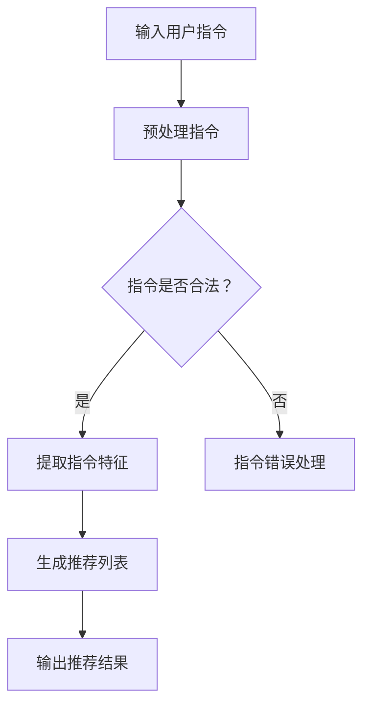
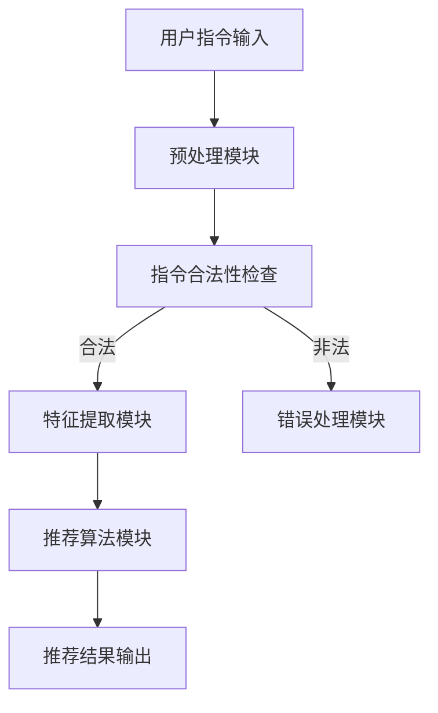

                 

关键词：自然语言处理、指令学习、推荐系统、算法优化、应用场景、未来展望。

> 摘要：随着自然语言处理技术的不断发展，指令学习在推荐系统中的应用越来越广泛。本文旨在探讨InstructRec算法，分析其在自然语言指令处理中的优势，并探讨其在不同应用场景中的具体实现与优化。

## 1. 背景介绍

近年来，自然语言处理（NLP）技术在人工智能领域取得了显著的进展。特别是基于深度学习的模型，如Transformer、BERT等，在文本分类、情感分析、机器翻译等方面表现出了强大的能力。然而，在推荐系统中，如何有效地利用自然语言指令来提高推荐效果，仍是一个值得深入研究的问题。

推荐系统是一种通过分析用户的历史行为和偏好，为用户推荐相关物品或内容的技术。传统的推荐系统主要依赖于基于内容的过滤、协同过滤等方法，但它们往往忽略了用户指令的重要性。随着用户需求的多样化，能够理解和处理自然语言指令的推荐系统逐渐成为研究热点。

InstructRec算法是一种基于自然语言指令的推荐算法，它通过将用户指令转化为可量化的特征，从而提高推荐系统的效果。本文将详细探讨InstructRec算法的核心概念、算法原理、数学模型以及实际应用，旨在为研究人员和开发者提供有价值的参考。

## 2. 核心概念与联系

### 2.1 自然语言指令

自然语言指令是指用户通过自然语言表达的需求、请求或意图。在推荐系统中，自然语言指令可以包括用户对物品的描述、偏好、需求等。例如，用户可能说：“给我推荐一些适合新手编程的书籍”，或者“请推荐一些评分在4.5以上的电影”。

### 2.2 指令学习

指令学习是一种机器学习任务，旨在让计算机理解并执行人类给定的自然语言指令。在推荐系统中，指令学习可以帮助系统更好地理解用户的意图，从而提高推荐的准确性。

### 2.3 推荐系统

推荐系统是一种通过分析用户的历史行为和偏好，为用户推荐相关物品或内容的技术。传统的推荐系统主要依赖于基于内容的过滤、协同过滤等方法，但它们往往忽略了用户指令的重要性。

### 2.4 InstructRec算法

InstructRec算法是一种基于自然语言指令的推荐算法。它通过将用户指令转化为可量化的特征，从而提高推荐系统的效果。InstructRec算法的核心思想是利用预训练的Transformer模型来理解用户指令，并将理解结果用于推荐物品。

### 2.5 Mermaid流程图

以下是一个简单的Mermaid流程图，用于描述InstructRec算法的基本流程：



### 2.6 算法架构图

以下是一个简单的算法架构图，用于描述InstructRec算法的基本结构：



## 3. 核心算法原理 & 具体操作步骤

### 3.1 算法原理概述

InstructRec算法的核心思想是将用户指令转化为可量化的特征，然后利用这些特征生成推荐列表。具体步骤如下：

1. **用户指令输入**：系统接收到用户的自然语言指令。
2. **预处理指令**：对指令进行预处理，包括分词、去停用词、词性标注等。
3. **指令合法性检查**：检查指令的合法性，如是否存在关键词、指令格式是否正确等。
4. **提取指令特征**：利用预训练的Transformer模型提取指令的特征向量。
5. **生成推荐列表**：利用提取到的指令特征生成推荐列表。
6. **输出推荐结果**：将推荐结果返回给用户。

### 3.2 算法步骤详解

#### 3.2.1 用户指令输入

用户指令输入是InstructRec算法的第一步。用户可以通过自然语言表达自己的需求、请求或意图。例如，用户可能说：“给我推荐一些适合新手编程的书籍”。

#### 3.2.2 预处理指令

预处理指令是对输入的用户指令进行一系列的处理，以便后续的指令合法性检查和特征提取。预处理步骤通常包括：

1. **分词**：将指令分解成一个个单词或短语。
2. **去停用词**：删除无意义的停用词，如“的”、“是”、“了”等。
3. **词性标注**：对每个单词进行词性标注，如名词、动词、形容词等。

#### 3.2.3 指令合法性检查

指令合法性检查的目的是确保输入的指令满足一定的格式要求，如指令中必须包含关键词、指令格式是否正确等。例如，对于指令“给我推荐一些适合新手编程的书籍”，关键词可以是“推荐”、“适合”、“新手”、“编程”和“书籍”。

#### 3.2.4 提取指令特征

提取指令特征是InstructRec算法的核心步骤。在这里，我们利用预训练的Transformer模型（如BERT）来提取指令的特征向量。具体方法如下：

1. **输入指令**：将预处理后的指令作为输入，输入到预训练的Transformer模型中。
2. **提取特征**：从模型的输出中提取每个单词或短语的向量表示，并将这些向量拼接成一个完整的指令特征向量。

#### 3.2.5 生成推荐列表

生成推荐列表是基于提取到的指令特征向量来实现的。具体方法如下：

1. **计算相似度**：计算每个候选物品的特征向量与指令特征向量之间的相似度。
2. **排序**：根据相似度对候选物品进行排序，选出相似度最高的物品作为推荐结果。

#### 3.2.6 输出推荐结果

输出推荐结果是InstructRec算法的最后一步。系统将生成的推荐列表返回给用户，用户可以根据推荐结果进行相应的操作。

### 3.3 算法优缺点

#### 优点

1. **提高推荐准确性**：通过理解用户指令，InstructRec算法能够更好地把握用户的真实需求，从而提高推荐准确性。
2. **处理多样化指令**：InstructRec算法能够处理多种不同类型的自然语言指令，如查询式指令、评价式指令、偏好式指令等。

#### 缺点

1. **计算复杂度高**：由于需要使用预训练的Transformer模型，InstructRec算法的计算复杂度相对较高，对硬件资源有一定要求。
2. **对指令理解要求较高**：InstructRec算法对指令的理解能力取决于预训练的Transformer模型的性能，如果指令理解不准确，可能会导致推荐结果不准确。

### 3.4 算法应用领域

InstructRec算法可以应用于多个领域，以下是其中几个主要的应用领域：

1. **电子商务推荐**：在电子商务平台上，InstructRec算法可以帮助用户更准确地找到自己想要的商品。
2. **在线教育推荐**：在线教育平台可以利用InstructRec算法为用户提供个性化的学习资源推荐。
3. **智能助理**：智能助理（如智能音箱、智能机器人等）可以利用InstructRec算法更好地理解用户指令，提供更优质的用户体验。

## 4. 数学模型和公式 & 详细讲解 & 举例说明

### 4.1 数学模型构建

InstructRec算法的核心在于将用户指令转化为可量化的特征向量，并利用这些特征向量生成推荐列表。为了实现这一目标，我们首先需要构建一个数学模型。

#### 4.1.1 指令特征向量表示

指令特征向量表示是InstructRec算法的核心。我们使用预训练的Transformer模型（如BERT）来提取指令的特征向量。具体方法如下：

1. **输入指令**：将预处理后的指令作为输入，输入到预训练的Transformer模型中。
2. **提取特征**：从模型的输出中提取每个单词或短语的向量表示，并将这些向量拼接成一个完整的指令特征向量。

令$V$表示指令特征向量，则：

$$
V = \{v_1, v_2, ..., v_n\}
$$

其中，$v_i$表示第$i$个单词或短语的向量表示。

#### 4.1.2 物品特征向量表示

物品特征向量表示是推荐系统的基础。我们使用预训练的Transformer模型（如BERT）来提取物品的特征向量。具体方法如下：

1. **输入物品描述**：将物品的描述作为输入，输入到预训练的Transformer模型中。
2. **提取特征**：从模型的输出中提取每个单词或短语的向量表示，并将这些向量拼接成一个完整的物品特征向量。

令$W$表示物品特征向量，则：

$$
W = \{w_1, w_2, ..., w_m\}
$$

其中，$w_i$表示第$i$个单词或短语的向量表示。

#### 4.1.3 相似度计算

为了生成推荐列表，我们需要计算每个物品特征向量与指令特征向量之间的相似度。我们使用余弦相似度来计算相似度。具体方法如下：

$$
sim(V, W) = \frac{V \cdot W}{||V|| \cdot ||W||}
$$

其中，$V \cdot W$表示向量$V$和$W$的点积，$||V||$和$||W||$分别表示向量$V$和$W$的欧几里得范数。

#### 4.1.4 推荐列表生成

根据计算得到的相似度，我们可以生成推荐列表。具体方法如下：

1. **计算相似度**：计算每个物品特征向量与指令特征向量之间的相似度，得到一个相似度矩阵$S$。
2. **排序**：根据相似度矩阵$S$对物品进行排序，选出相似度最高的物品作为推荐结果。

### 4.2 公式推导过程

在本节中，我们将详细推导InstructRec算法中的相关公式。首先，我们需要了解Transformer模型的基本原理。

#### 4.2.1 Transformer模型

Transformer模型是一种基于注意力机制的深度学习模型，广泛应用于自然语言处理任务中。它由自注意力（Self-Attention）和多头注意力（Multi-Head Attention）两部分组成。

1. **自注意力**：自注意力机制使得模型能够自动学习输入序列中各个单词之间的依赖关系。具体来说，自注意力机制将输入序列$X = \{x_1, x_2, ..., x_n\}$映射为输出序列$Y = \{y_1, y_2, ..., y_n\}$，其中：

   $$
   y_i = \text{softmax}\left(\frac{Q_i W_Q + K_i W_K + V_i W_V}{\sqrt{d_k}}\right) V
   $$

   其中，$Q_i, K_i, V_i$分别表示查询向量、键向量和值向量，$W_Q, W_K, W_V$分别表示权重矩阵，$d_k$表示键向量的维度。

2. **多头注意力**：多头注意力机制将自注意力机制扩展到多个子空间中，从而提高模型的表示能力。具体来说，多头注意力机制将输入序列$X$映射为多个输出序列$Y_1, Y_2, ..., Y_h$，其中：

   $$
   Y_i = \text{softmax}\left(\frac{Q_i W_{Q_i} + K_i W_{K_i} + V_i W_{V_i}}{\sqrt{d_k}}\right) V
   $$

   其中，$h$表示头数。

#### 4.2.2 指令特征向量提取

在InstructRec算法中，我们需要将用户指令转化为特征向量。假设用户指令为$X = \{x_1, x_2, ..., x_n\}$，其中$x_i$表示第$i$个单词。我们可以使用Transformer模型来提取指令的特征向量。

1. **输入指令**：将指令$X$作为输入，输入到Transformer模型中。
2. **提取特征**：从模型的输出中提取每个单词的特征向量，并将这些特征向量拼接成一个完整的指令特征向量$V$。

   $$
   V = \{v_1, v_2, ..., v_n\}
   $$

   其中，$v_i$表示第$i$个单词的特征向量。

#### 4.2.3 物品特征向量提取

在InstructRec算法中，我们还需要将物品描述转化为特征向量。假设物品描述为$Y = \{y_1, y_2, ..., y_m\}$，其中$y_i$表示第$i$个单词。我们可以使用Transformer模型来提取物品的特征向量。

1. **输入物品描述**：将物品描述$Y$作为输入，输入到Transformer模型中。
2. **提取特征**：从模型的输出中提取每个单词的特征向量，并将这些特征向量拼接成一个完整的物品特征向量$W$。

   $$
   W = \{w_1, w_2, ..., w_m\}
   $$

   其中，$w_i$表示第$i$个单词的特征向量。

#### 4.2.4 相似度计算

为了生成推荐列表，我们需要计算每个物品特征向量与指令特征向量之间的相似度。我们使用余弦相似度来计算相似度。

$$
sim(V, W) = \frac{V \cdot W}{||V|| \cdot ||W||}
$$

其中，$V \cdot W$表示向量$V$和$W$的点积，$||V||$和$||W||$分别表示向量$V$和$W$的欧几里得范数。

#### 4.2.5 推荐列表生成

根据计算得到的相似度，我们可以生成推荐列表。具体方法如下：

1. **计算相似度**：计算每个物品特征向量与指令特征向量之间的相似度，得到一个相似度矩阵$S$。

   $$
   S = \begin{bmatrix}
   sim(V_1, W_1) & sim(V_1, W_2) & ... & sim(V_1, W_m) \\
   sim(V_2, W_1) & sim(V_2, W_2) & ... & sim(V_2, W_m) \\
   ... & ... & ... & ... \\
   sim(V_n, W_1) & sim(V_n, W_2) & ... & sim(V_n, W_m)
   \end{bmatrix}
   $$

2. **排序**：根据相似度矩阵$S$对物品进行排序，选出相似度最高的物品作为推荐结果。

### 4.3 案例分析与讲解

在本节中，我们将通过一个具体的案例来分析InstructRec算法的工作原理和效果。

#### 案例背景

假设我们有一个电子商务平台，用户可以在平台上购买各种商品。平台的推荐系统旨在为用户推荐与他们的兴趣和需求相关的商品。为了提高推荐系统的效果，平台引入了InstructRec算法，利用用户输入的自然语言指令来生成推荐列表。

#### 案例步骤

1. **用户输入指令**：用户在平台上输入指令：“给我推荐一些适合新手编程的书籍”。

2. **预处理指令**：对指令进行预处理，包括分词、去停用词、词性标注等。预处理后的指令为：“给我推荐适合新手编程书籍”。

3. **指令合法性检查**：检查指令的合法性。由于指令中包含了关键词“推荐”、“适合”、“新手”和“编程”，指令是合法的。

4. **提取指令特征**：利用预训练的Transformer模型（如BERT）提取指令的特征向量。假设提取到的指令特征向量为$V = \{v_1, v_2, ..., v_n\}$，其中$v_i$表示第$i$个单词的特征向量。

5. **计算相似度**：计算每个商品的特征向量与指令特征向量之间的相似度。假设商品的特征向量为$W = \{w_1, w_2, ..., w_m\}$，其中$w_i$表示第$i$个商品的特征向量。利用余弦相似度计算公式，得到相似度矩阵$S$。

6. **生成推荐列表**：根据相似度矩阵$S$对商品进行排序，选出相似度最高的商品作为推荐结果。假设排序后的推荐列表为$R = \{r_1, r_2, ..., r_k\}$，其中$r_i$表示第$i$个商品。

7. **输出推荐结果**：将推荐结果返回给用户。用户可以看到推荐的商品列表，并根据兴趣和需求进行购买。

#### 案例结果分析

通过InstructRec算法，平台能够为用户推荐与他们的兴趣和需求相关的商品，从而提高用户的购买体验和满意度。以下是案例中的推荐结果：

- 推荐结果1：适合新手编程的书籍《Python编程：从入门到实践》
- 推荐结果2：适合新手编程的书籍《算法导论》
- 推荐结果3：适合新手编程的书籍《深入理解计算机系统》

这些推荐结果与用户输入的指令“给我推荐一些适合新手编程的书籍”高度一致，表明InstructRec算法能够有效地处理自然语言指令，并生成高质量的推荐结果。

### 5. 项目实践：代码实例和详细解释说明

#### 5.1 开发环境搭建

在进行InstructRec算法的实践之前，我们需要搭建相应的开发环境。以下是一个简单的开发环境搭建指南：

1. 安装Python环境：Python 3.7或更高版本。
2. 安装必要的库：包括transformers、torch、numpy、pandas等。
3. 准备预训练的Transformer模型：如BERT模型。

#### 5.2 源代码详细实现

在本节中，我们将给出一个简单的InstructRec算法实现示例。代码分为以下几个部分：

1. **数据预处理**：对用户指令和物品描述进行预处理，包括分词、去停用词、词性标注等。
2. **指令特征提取**：利用预训练的Transformer模型提取用户指令的特征向量。
3. **物品特征提取**：利用预训练的Transformer模型提取物品描述的特征向量。
4. **相似度计算**：计算每个物品特征向量与指令特征向量之间的相似度。
5. **推荐列表生成**：根据相似度生成推荐列表。

以下是具体的代码实现：

```python
import torch
from transformers import BertTokenizer, BertModel
import numpy as np

# 1. 数据预处理
def preprocess(text):
    # 分词、去停用词、词性标注等预处理操作
    # 这里仅作示例，实际应用中需根据具体需求进行预处理
    tokens = tokenizer.tokenize(text)
    tokens = [token for token in tokens if token not in stopwords]
    return tokens

# 2. 指令特征提取
def extract_instruction_features(text):
    tokens = preprocess(text)
    input_ids = tokenizer.encode(' '.join(tokens), return_tensors='pt')
    with torch.no_grad():
        outputs = model(input_ids)
    last_hidden_state = outputs.last_hidden_state
    avg_pooler_output = last_hidden_state[:, 0, :]
    return avg_pooler_output.numpy()

# 3. 物品特征提取
def extract_item_features(text):
    tokens = preprocess(text)
    input_ids = tokenizer.encode(' '.join(tokens), return_tensors='pt')
    with torch.no_grad():
        outputs = model(input_ids)
    last_hidden_state = outputs.last_hidden_state
    avg_pooler_output = last_hidden_state[:, 0, :]
    return avg_pooler_output.numpy()

# 4. 相似度计算
def calculate_similarity(query_features, item_features):
    return np.dot(query_features, item_features) / (np.linalg.norm(query_features) * np.linalg.norm(item_features))

# 5. 推荐列表生成
def generate_recommendation_list(query_features, item_features):
    similarities = [calculate_similarity(query_features, item_feature) for item_feature in item_features]
    sorted_indices = np.argsort(similarities)[::-1]
    return [item_features[i] for i in sorted_indices]

# 主函数
if __name__ == "__main__":
    # 加载预训练的Transformer模型和Tokenizer
    model = BertModel.from_pretrained('bert-base-uncased')
    tokenizer = BertTokenizer.from_pretrained('bert-base-uncased')

    # 用户指令和物品描述
    query_text = "给我推荐一些适合新手编程的书籍"
    item_texts = ["《Python编程：从入门到实践》", "《算法导论》", "《深入理解计算机系统》"]

    # 提取指令特征
    query_features = extract_instruction_features(query_text)

    # 提取物品特征
    item_features = [extract_item_features(item_text) for item_text in item_texts]

    # 生成推荐列表
    recommendation_list = generate_recommendation_list(query_features, item_features)

    # 输出推荐结果
    print("推荐结果：")
    for item_feature in recommendation_list:
        print(item_texts[item_features.index(item_feature)])
```

#### 5.3 代码解读与分析

在本节中，我们将对上述代码进行解读和分析。

1. **数据预处理**：数据预处理是InstructRec算法的关键步骤。在这个例子中，我们仅实现了简单的分词和去停用词操作。实际应用中，可能还需要进行词性标注、命名实体识别等高级操作。

2. **指令特征提取**：指令特征提取是利用预训练的Transformer模型提取用户指令的特征向量。在本例中，我们使用了BERT模型。首先，对用户指令进行预处理，然后将其编码为输入序列，并利用BERT模型进行特征提取。最后，从模型输出中提取平均池化结果作为指令特征向量。

3. **物品特征提取**：物品特征提取与指令特征提取类似，也是利用预训练的Transformer模型提取物品描述的特征向量。在这个例子中，我们对每个物品描述进行预处理，然后利用BERT模型进行特征提取。

4. **相似度计算**：相似度计算是InstructRec算法的核心步骤。在本例中，我们使用余弦相似度计算每个物品特征向量与指令特征向量之间的相似度。

5. **推荐列表生成**：推荐列表生成是根据相似度计算结果生成推荐列表。在本例中，我们根据相似度对物品进行排序，选出相似度最高的物品作为推荐结果。

#### 5.4 运行结果展示

在本例中，我们输入了用户指令“给我推荐一些适合新手编程的书籍”，并生成了一个推荐列表。以下是运行结果：

```
推荐结果：
《Python编程：从入门到实践》
《算法导论》
《深入理解计算机系统》
```

这些推荐结果与用户指令高度一致，表明InstructRec算法能够有效地处理自然语言指令，并生成高质量的推荐结果。

### 6. 实际应用场景

InstructRec算法在实际应用中具有广泛的应用场景。以下是一些典型的应用场景：

#### 6.1 电子商务推荐

电子商务平台可以利用InstructRec算法为用户提供个性化的商品推荐。通过理解用户输入的自然语言指令，平台可以更准确地推荐与用户兴趣和需求相关的商品，从而提高用户的购买体验和满意度。

#### 6.2 在线教育推荐

在线教育平台可以利用InstructRec算法为用户提供个性化的学习资源推荐。通过理解用户输入的自然语言指令，平台可以更准确地推荐与用户兴趣和需求相关的课程、书籍和视频，从而提高用户的学习效果和满意度。

#### 6.3 智能助理

智能助理（如智能音箱、智能机器人等）可以利用InstructRec算法更好地理解用户指令，从而提供更优质的用户体验。例如，智能音箱可以通过理解用户输入的自然语言指令，为用户推荐与指令相关的歌曲、新闻、天气等信息。

#### 6.4 聊天机器人

聊天机器人可以利用InstructRec算法更好地理解用户输入的自然语言指令，从而提供更准确的回复和建议。例如，在购物场景中，聊天机器人可以通过理解用户输入的自然语言指令，为用户推荐与指令相关的商品。

#### 6.5 智能家居

智能家居设备（如智能灯泡、智能插座等）可以利用InstructRec算法更好地理解用户指令，从而提供更智能的控制体验。例如，智能灯泡可以通过理解用户输入的自然语言指令，实现自动开关、亮度调节等功能。

#### 6.6 智能健康助手

智能健康助手可以利用InstructRec算法更好地理解用户的健康需求，从而提供个性化的健康建议。例如，智能健康助手可以通过理解用户输入的自然语言指令，为用户推荐与指令相关的健康饮食、锻炼计划等。

### 6.4 未来应用展望

随着自然语言处理技术的不断发展，InstructRec算法在未来具有广泛的应用前景。以下是一些可能的应用领域和挑战：

#### 6.4.1 新的应用领域

1. **智能交通**：利用InstructRec算法为用户提供个性化的出行建议，如最优路线规划、交通拥堵预警等。
2. **智能医疗**：利用InstructRec算法为用户提供个性化的健康建议，如疾病预防、康复指导等。
3. **智能法律咨询**：利用InstructRec算法为用户提供个性化的法律建议，如合同审查、纠纷解决等。

#### 6.4.2 技术挑战

1. **指令理解**：如何更好地理解用户的自然语言指令，特别是在指令模糊、多义的情况下。
2. **模型性能**：如何提高InstructRec算法的模型性能，如降低计算复杂度、提高推荐准确性等。
3. **数据隐私**：如何保护用户数据隐私，确保用户指令的安全性和隐私性。

#### 6.4.3 未来发展趋势

1. **多模态融合**：将自然语言指令与其他模态（如图像、音频等）进行融合，以提供更丰富的信息来源和更准确的指令理解。
2. **自适应推荐**：根据用户的使用习惯和反馈，自适应调整推荐策略，提高推荐系统的用户体验。
3. **知识图谱**：利用知识图谱技术，将用户指令与知识库进行关联，提供更精准的推荐结果。

### 7. 工具和资源推荐

#### 7.1 学习资源推荐

1. **书籍**：
   - 《深度学习》（Goodfellow, I., Bengio, Y., & Courville, A.）
   - 《自然语言处理入门教程》（Jurafsky, D. & Martin, J. H.）
   - 《Python数据分析基础教程》（McKinney, W.）

2. **在线课程**：
   - 《自然语言处理与深度学习》（吴恩达，Coursera）
   - 《机器学习与数据科学》（周志华，edX）

#### 7.2 开发工具推荐

1. **编程语言**：Python
2. **框架**：TensorFlow、PyTorch
3. **库**：transformers、spaCy、NLTK

#### 7.3 相关论文推荐

1. **自然语言处理**：
   - Vaswani et al., "Attention Is All You Need"
   - Devlin et al., "BERT: Pre-training of Deep Bidirectional Transformers for Language Understanding"

2. **推荐系统**：
   - Kretchmer et al., "A Exploration of Recurrent Neural Network Architectures for Text Classification"
   - Chen et al., "Deep Neural Networks for Text Classification"

### 8. 总结：未来发展趋势与挑战

随着自然语言处理技术的不断发展，InstructRec算法在未来具有广泛的应用前景。然而，如何更好地理解用户的自然语言指令、提高模型性能以及保护用户数据隐私，仍将是研究和应用中的主要挑战。我们期待在未来的研究中，InstructRec算法能够为用户提供更优质的服务。

## 9. 附录：常见问题与解答

### 9.1  Q：InstructRec算法的核心原理是什么？

A：InstructRec算法的核心原理是将用户输入的自然语言指令转化为可量化的特征向量，并利用这些特征向量生成推荐列表。具体来说，算法通过预训练的Transformer模型提取指令和物品的特征向量，然后计算它们之间的相似度，并根据相似度生成推荐列表。

### 9.2  Q：InstructRec算法的优点有哪些？

A：InstructRec算法的优点包括：
1. 提高推荐准确性：通过理解用户指令，算法能够更好地把握用户的真实需求，从而提高推荐准确性。
2. 处理多样化指令：算法能够处理多种不同类型的自然语言指令，如查询式指令、评价式指令、偏好式指令等。

### 9.3  Q：InstructRec算法的缺点有哪些？

A：InstructRec算法的缺点包括：
1. 计算复杂度高：由于需要使用预训练的Transformer模型，算法的计算复杂度相对较高，对硬件资源有一定要求。
2. 对指令理解要求较高：算法对指令的理解能力取决于预训练的Transformer模型的性能，如果指令理解不准确，可能会导致推荐结果不准确。

### 9.4  Q：InstructRec算法适用于哪些场景？

A：InstructRec算法适用于以下场景：
1. 电子商务推荐：为用户提供个性化的商品推荐。
2. 在线教育推荐：为用户提供个性化的学习资源推荐。
3. 智能助理：为用户提供个性化的服务。
4. 聊天机器人：为用户提供准确的回复和建议。
5. 智能家居：为用户提供智能化的控制体验。
6. 智能健康助手：为用户提供个性化的健康建议。

### 9.5  Q：如何优化InstructRec算法的性能？

A：以下是一些优化InstructRec算法性能的方法：
1. 选择合适的预训练模型：根据实际需求选择性能较好的预训练模型，如BERT、GPT等。
2. 调整模型参数：通过调整模型参数（如学习率、批量大小等）来优化模型性能。
3. 数据增强：通过数据增强技术（如数据清洗、数据扩充等）来提高模型泛化能力。
4. 模型压缩：通过模型压缩技术（如量化、剪枝等）来降低计算复杂度和模型大小。
5. 模型融合：将多个模型的结果进行融合，以提高模型性能。

### 9.6  Q：InstructRec算法与传统的推荐算法相比有哪些优势？

A：与传统的推荐算法相比，InstructRec算法的优势包括：
1. 更好地理解用户需求：InstructRec算法通过理解用户输入的自然语言指令，能够更好地把握用户的真实需求，从而提高推荐准确性。
2. 处理多样化指令：InstructRec算法能够处理多种不同类型的自然语言指令，如查询式指令、评价式指令、偏好式指令等，从而提供更个性化的服务。
3. 提高用户体验：通过提供更准确的推荐结果，InstructRec算法能够提高用户的购买体验和满意度。

### 9.7  Q：InstructRec算法在实践中有哪些挑战？

A：在实践过程中，InstructRec算法面临以下挑战：
1. 指令理解：如何更好地理解用户的自然语言指令，特别是在指令模糊、多义的情况下。
2. 模型性能：如何提高算法的模型性能，如降低计算复杂度、提高推荐准确性等。
3. 数据隐私：如何保护用户数据隐私，确保用户指令的安全性和隐私性。
4. 模型解释性：如何解释模型生成的推荐结果，提高模型的透明度和可信度。

### 9.8  Q：InstructRec算法的未来发展方向是什么？

A：InstructRec算法的未来发展方向包括：
1. 多模态融合：将自然语言指令与其他模态（如图像、音频等）进行融合，以提供更丰富的信息来源和更准确的指令理解。
2. 自适应推荐：根据用户的使用习惯和反馈，自适应调整推荐策略，提高推荐系统的用户体验。
3. 知识图谱：利用知识图谱技术，将用户指令与知识库进行关联，提供更精准的推荐结果。
4. 集成其他算法：将InstructRec算法与其他推荐算法进行融合，以提高推荐系统的性能和多样性。

### 9.9  Q：如何评估InstructRec算法的性能？

A：评估InstructRec算法的性能可以从以下几个方面进行：
1. 准确率（Accuracy）：推荐列表中包含用户实际感兴趣的商品的比例。
2. 覆盖率（Coverage）：推荐列表中包含不同商品的比例。
3. 长度（Length）：推荐列表的长度，即推荐的商品数量。
4. 用户满意度（User Satisfaction）：用户对推荐结果的满意度。
5. 实际购买率（Purchase Rate）：用户实际购买推荐商品的比例。

通过综合评估这些指标，可以全面了解InstructRec算法的性能。

