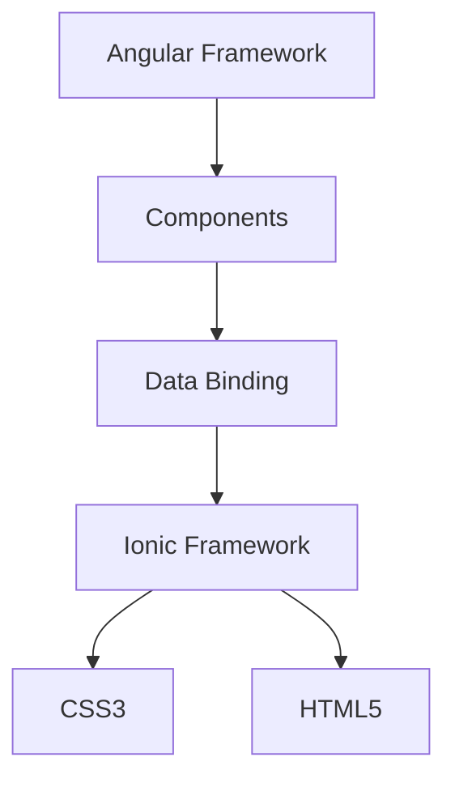

                 

关键词：Ionic框架，Angular，移动应用开发，前端开发，跨平台开发

> 摘要：本文将深入探讨Ionic框架的优势，特别是在基于Angular的移动应用开发中的表现。通过详细的分析和实例展示，读者将了解Ionic如何简化移动应用的开发过程，提高开发效率，并实现出色的用户体验。

## 1. 背景介绍

在移动应用开发领域，前端框架的选择至关重要。Ionic框架是一种开源的、基于HTML5和CSS3的移动应用开发框架，特别适合用于创建跨平台的应用程序。它的核心在于将Web技术应用于移动设备，使得开发者能够使用熟悉的Web技术栈（如Angular）来构建高性能的移动应用。

Angular是一个由Google维护的开源前端框架，广泛应用于企业级单页应用（SPA）的开发。Angular提供了强大的数据绑定、依赖注入、组件化等特性，这些特性使得开发者能够更高效地构建复杂的应用程序。

Ionic框架与Angular的结合使用，为开发者提供了一种独特的方式来构建跨平台的移动应用，使得开发工作更加高效和灵活。本文将详细探讨这种结合的优势和具体实现方法。

### 1.1 Ionic框架简介

Ionic框架的主要特点包括：

1. **跨平台兼容性**：Ionic使用Web技术构建应用，可以无缝地运行在iOS和Android平台上，同时还支持Windows Phone。
2. **丰富的组件库**：Ionic提供了大量的组件和图标，开发者可以轻松地集成到应用中，加快开发速度。
3. **出色的用户体验**：Ionic提供了丰富的动画效果和过渡效果，增强了应用的交互性和用户体验。
4. **集成原生功能**：Ionic允许开发者访问设备的原生功能，如摄像头、地理位置等，无需编写原生代码。
5. **易于集成第三方库**：Ionic支持各种第三方库，如lodash、Moment.js等，可以扩展应用的功能。

### 1.2 Angular简介

Angular框架的特点包括：

1. **数据绑定**：Angular的双向数据绑定使得数据的管理和维护变得更加简单。
2. **组件化开发**：Angular鼓励开发者使用组件化开发模式，使得代码的可维护性和可测试性大大提高。
3. **依赖注入**：Angular的依赖注入机制简化了组件之间的依赖关系管理。
4. **强大的路由功能**：Angular提供了强大的路由功能，支持异步路由加载，优化了应用的性能。
5. **丰富的生态系统**：Angular拥有丰富的生态系统，包括官方文档、社区支持、工具等。

## 2. 核心概念与联系

在深入探讨Ionic与Angular的结合之前，我们需要先了解它们的核心概念和架构。

### 2.1 Ionic与Angular的架构关系

Ionic框架构建在Angular之上，它利用了Angular的组件化开发模式和强大的数据绑定功能。以下是一个简化的Mermaid流程图，展示了Ionic和Angular之间的架构关系：



### 2.2 Ionic与Angular的核心概念

**Ionic核心概念：**

- **Components**：Ionic组件是构建Ionic应用的基本单元，如Ionic的导航栏（Navbar）、按钮（Button）、列表（List）等。
- **Pages**：页面是Ionic应用中的主要视图，每个页面都对应一个组件。
- **Navigation**：Ionic提供了丰富的导航组件，如导航栏（Nav）、侧边栏（Sidebar）等，支持深度链接和页面切换。

**Angular核心概念：**

- **Components**：Angular组件是Angular应用的基本构建块，每个组件都有自己的模板、样式和逻辑。
- **Modules**：Angular模块用于组织组件、服务和其他代码。
- **Directives**：Angular指令用于定义DOM上的行为。
- **Services**：Angular服务用于管理应用的状态和数据。

## 3. 核心算法原理 & 具体操作步骤

### 3.1 算法原理概述

Ionic与Angular的结合主要依赖于以下几个核心原理：

1. **组件化开发**：利用Angular的组件化开发模式，将应用拆分成多个独立的、可复用的组件。
2. **双向数据绑定**：Angular的双向数据绑定机制，使得组件的状态和数据可以轻松地同步。
3. **依赖注入**：Angular的依赖注入机制，简化了组件之间的依赖关系管理。
4. **路由管理**：Angular的路由功能，支持应用内部的路由跳转和页面切换。

### 3.2 算法步骤详解

1. **创建Angular项目**：

   使用Angular CLI创建一个新的Angular项目，如下所示：

   ```bash
   ng new my-ionic-app
   ```

2. **添加Ionic模块**：

   在Angular项目中，安装并导入Ionic模块，如下所示：

   ```bash
   npm install @ionic/angular --save
   import { IonicModule } from '@ionic/angular';
   @NgModule({
     declarations: [...],
     imports: [
       IonicModule.forRoot(),
       // 其他导入
     ],
     bootstrap: [AppComponent]
   })
   export class AppModule {}
   ```

3. **创建Ionic组件**：

   使用Angular CLI创建Ionic组件，如下所示：

   ```bash
   ng generate component navbar
   ```

   创建的组件将会包含一个基本的HTML模板和相关的样式文件。

4. **组件间数据传递**：

   使用Angular的双向数据绑定机制，实现组件间的数据传递，如下所示：

   ```html
   <ion-navbar>
     <ion-title>{{ title }}</ion-title>
   </ion-navbar>
   ```

   ```typescript
   @Component({
     selector: 'app-navbar',
     templateUrl: './navbar.component.html',
     styleUrls: ['./navbar.component.css']
   })
   export class NavbarComponent {
     title = 'My App';
   }
   ```

5. **页面路由**：

   使用Angular的路由功能，配置应用的路由，实现页面间的切换，如下所示：

   ```typescript
   @NgModule({
     imports: [
       RouterModule.forRoot(routes)
     ],
     exports: [RouterModule]
   })
   export class AppRoutingModule {}
   ```

   ```typescript
   const routes: Routes = [
     { path: '', component: HomeComponent },
     { path: 'about', component: AboutComponent },
     // 其他路由
   ];
   ```

6. **集成Ionic组件**：

   将创建的Ionic组件集成到Angular应用中，如下所示：

   ```html
   <ion-app>
     <app-navbar></app-navbar>
     <ion-router-outlet></ion-router-outlet>
   </ion-app>
   ```

### 3.3 算法优缺点

**优点：**

- **高效开发**：Ionic和Angular的结合，使得开发者可以快速构建跨平台的移动应用。
- **丰富的组件库**：Ionic提供了大量的组件和图标，减少了开发时间。
- **良好的用户体验**：Ionic提供了丰富的动画效果和过渡效果，增强了应用的交互性和用户体验。
- **集成原生功能**：Ionic允许开发者访问设备的原生功能，无需编写原生代码。

**缺点：**

- **性能问题**：由于Ionic应用是使用Web技术构建的，在一些复杂场景下，性能可能不如原生应用。
- **学习成本**：对于初学者来说，同时学习Ionic和Angular可能会有一定的学习成本。

### 3.4 算法应用领域

Ionic和Angular的结合，广泛应用于移动应用开发领域，特别是在需要快速迭代和跨平台部署的项目中。以下是一些典型的应用领域：

- **企业级应用**：企业级应用通常需要跨平台部署，Ionic和Angular的结合能够提供高效的开发体验。
- **电子商务应用**：电子商务应用需要良好的用户体验和高效的性能，Ionic和Angular能够满足这些需求。
- **教育应用**：教育应用通常需要丰富的交互和动画效果，Ionic和Angular提供了这些特性。

## 4. 数学模型和公式 & 详细讲解 & 举例说明

在Ionic和Angular的结合过程中，我们并不需要复杂的数学模型和公式。然而，为了更好地理解组件间数据传递的过程，我们可以引入一些基本的数学概念。

### 4.1 数学模型构建

在Angular中，组件间数据传递的主要机制是双向数据绑定。双向数据绑定可以看作是一个数学模型，它包含了以下几个基本元素：

1. **源数据**：源数据是组件内部的一个变量，用于存储数据。
2. **目标数据**：目标数据是组件外部的一个变量，用于接收数据。
3. **绑定关系**：绑定关系是指源数据和目标数据之间的关联。

数学模型可以表示为：

$$ 数据绑定模型 = 源数据 + 绑定关系 + 目标数据 $$

### 4.2 公式推导过程

双向数据绑定的公式推导过程如下：

1. **初始化**：当组件加载时，源数据和目标数据初始化为相同值。
2. **数据变更**：当源数据变更时，绑定关系会立即更新目标数据。
3. **反向变更**：当目标数据变更时，绑定关系会立即更新源数据。

这个过程可以用以下公式表示：

$$ 源数据 \to_{变更} 绑定关系 \to_{更新} 目标数据 $$

$$ 目标数据 \to_{变更} 绑定关系 \to_{更新} 源数据 $$

### 4.3 案例分析与讲解

假设我们有一个简单的组件，其中包含一个文本输入框和一个文本显示框，我们需要实现文本输入框的内容能够实时显示在文本显示框中。

1. **源数据构建**：

   在组件内部，我们定义一个名为`inputValue`的源数据，用于存储文本输入框的值。

   ```typescript
   @Component({
     selector: 'app-input-display',
     templateUrl: './input-display.component.html',
     styleUrls: ['./input-display.component.css']
   })
   export class InputDisplayComponent {
     inputValue: string = '';
   }
   ```

2. **绑定关系创建**：

   在HTML模板中，我们使用`ngModel`指令创建双向数据绑定，将`inputValue`与文本输入框和文本显示框绑定。

   ```html
   <ion-input [(ngModel)]="inputValue" placeholder="输入文本"></ion-input>
   <p>{{ inputValue }}</p>
   ```

3. **数据变更与更新**：

   当用户在文本输入框中输入内容时，`inputValue`会立即更新，并通过双向数据绑定更新文本显示框的显示内容。

   ```typescript
   // 文本输入框变更时
   inputValue = '新的文本内容';

   // 文本显示框变更时
   this.inputValue = '新的文本内容';
   ```

通过这个简单的案例，我们可以看到双向数据绑定是如何工作的。在实际应用中，双向数据绑定机制大大简化了组件间数据传递的复杂度，提高了开发效率。

## 5. 项目实践：代码实例和详细解释说明

为了更好地理解Ionic和Angular的结合，我们将通过一个实际的项目实践来展示开发过程和关键步骤。

### 5.1 开发环境搭建

在开始项目开发之前，我们需要搭建一个合适的环境。以下是基本步骤：

1. **安装Node.js**：访问Node.js官网下载并安装Node.js。
2. **安装Angular CLI**：在命令行中运行以下命令安装Angular CLI：

   ```bash
   npm install -g @angular/cli
   ```

3. **安装Ionic**：在命令行中运行以下命令安装Ionic：

   ```bash
   npm install @ionic/angular --save
   ```

4. **创建Angular项目**：

   ```bash
   ng new my-ionic-app
   ```

5. **进入项目目录**：

   ```bash
   cd my-ionic-app
   ```

### 5.2 源代码详细实现

在这个项目中，我们将创建一个简单的待办事项应用。以下是关键代码的实现过程：

1. **创建组件**：

   使用Angular CLI创建一个名为`todo-item`的组件，用于展示单个待办事项。

   ```bash
   ng generate component todo-item
   ```

2. **TodoItemComponent.html**：

   ```html
   <!-- todo-item.component.html -->
   <ion-item>
     <ion-label>{{ todo.text }}</ion-label>
     <ion-badge color="danger" (click)="removeTodo(todo)">{{ todo.status }}</ion-badge>
   </ion-item>
   ```

3. **TodoItemComponent.ts**：

   ```typescript
   // todo-item.component.ts
   import { Component, Input, Output, EventEmitter } from '@angular/core';

   @Component({
     selector: 'app-todo-item',
     templateUrl: './todo-item.component.html',
     styleUrls: ['./todo-item.component.css']
   })
   export class TodoItemComponent {
     @Input() todo: any;
     @Output() remove = new EventEmitter<any>();

     removeTodo(todo) {
       this.remove.emit(todo);
     }
   }
   ```

4. **AppComponent.html**：

   ```html
   <!-- app.component.html -->
   <ion-header>
     <ion-navbar>
       <ion-title>
         Todo List
       </ion-title>
     </ion-navbar>
   </ion-header>

   <ion-content>
     <ion-list>
       <app-todo-item *ngFor="let todo of todos" [todo]="todo" (remove)="removeTodo(todo)"></app-todo-item>
     </ion-list>
   </ion-content>

   <ion-footer>
     <ion-input placeholder="Add a new todo" [(ngModel)]="newTodoText"></ion-input>
     <ion-button (click)="addTodo()">Add</ion-button>
   </ion-footer>
   ```

5. **AppComponent.ts**：

   ```typescript
   // app.component.ts
   import { Component } from '@angular/core';

   @Component({
     selector: 'app-root',
     templateUrl: './app.component.html',
     styleUrls: ['./app.component.css']
   })
   export class AppComponent {
     todos = [
       { text: 'Buy milk', status: 'In Progress' },
       { text: 'Call mom', status: 'Completed' },
       { text: 'Go to the gym', status: 'Scheduled' }
     ];
     newTodoText: string = '';

     addTodo() {
       if (this.newTodoText) {
         this.todos.push({ text: this.newTodoText, status: 'In Progress' });
         this.newTodoText = '';
       }
     }

     removeTodo(todo) {
       const index = this.todos.indexOf(todo);
       if (index > -1) {
         this.todos.splice(index, 1);
       }
     }
   }
   ```

### 5.3 代码解读与分析

1. **组件结构**：

   - `TodoItemComponent`：用于展示单个待办事项，包含一个文本标签和一个状态标签。
   - `AppComponent`：应用的主组件，包含待办事项列表、输入框和添加按钮。

2. **数据绑定**：

   - 使用`*ngFor`指令在`AppComponent`中遍历待办事项列表，并渲染`TodoItemComponent`。
   - 使用`ngModel`指令在输入框中创建双向数据绑定，将输入内容绑定到`newTodoText`变量。

3. **事件处理**：

   - `AppComponent`中的`addTodo`方法用于添加新的待办事项到列表。
   - `AppComponent`中的`removeTodo`方法用于从列表中移除待办事项。

### 5.4 运行结果展示

1. **输入待办事项**：

   在输入框中输入“Buy eggs”并点击“Add”按钮，新的待办事项将添加到列表中。

   ```plaintext
   Todo List
   └─ Buy milk
   └─ Call mom
   └─ Go to the gym
   └─ Buy eggs
   ```

2. **完成待办事项**：

   点击“Buy milk”后面的“Completed”按钮，该待办事项的状态将更新为“Completed”。

   ```plaintext
   Todo List
   └─ Completed
   └─ Call mom
   └─ Go to the gym
   └─ Buy eggs
   ```

3. **移除待办事项**：

   点击“Buy eggs”后面的“Completed”按钮，该待办事项将从列表中移除。

   ```plaintext
   Todo List
   └─ Completed
   └─ Call mom
   └─ Go to the gym
   ```

通过这个简单的项目，我们可以看到Ionic和Angular如何结合使用，实现一个功能完整的待办事项应用。这个过程展示了组件化开发、双向数据绑定和路由管理等方面的核心原理和实践步骤。

## 6. 实际应用场景

Ionic与Angular的结合，在多个实际应用场景中展现出其强大的优势和灵活性。以下是一些典型的应用场景：

### 6.1 企业级应用

企业级应用通常需要满足高可用性、高性能和良好的用户体验。Ionic和Angular的结合，使得开发者可以快速构建具有高性能和良好用户体验的企业级应用。例如，企业内部的移动应用可以用来管理客户信息、订单处理、库存管理等工作。利用Ionic的组件库和Angular的路由功能，可以轻松地实现复杂的应用逻辑和交互。

### 6.2 电子商务应用

电子商务应用需要良好的用户体验和高效的性能。Ionic提供了丰富的组件和动画效果，可以增强用户购物体验。结合Angular的双向数据绑定和强大的路由功能，可以轻松地实现商品浏览、购物车管理和订单跟踪等功能。例如，一个电子商务平台可以使用Ionic的卡式布局展示商品列表，并使用Angular的表单验证确保用户输入的正确性。

### 6.3 教育应用

教育应用通常需要丰富的交互和动画效果，以吸引学生的注意力。Ionic提供了丰富的组件和动画库，可以用于创建引人入胜的教育应用。结合Angular的组件化和路由功能，可以轻松实现课程内容的管理、视频播放和在线测试等功能。例如，一个在线教育平台可以使用Ionic的侧边栏导航菜单，方便学生快速切换课程。

### 6.4 物流和运输应用

物流和运输应用需要实时跟踪货物状态、优化路线和提升物流效率。Ionic和Angular的结合，可以快速构建具有实时地图跟踪、路线规划和订单管理功能的移动应用。利用Ionic的地图组件和Angular的服务，可以轻松实现物流跟踪和路线优化功能。例如，一个物流平台可以使用Ionic的地图组件展示货物的实时位置，并使用Angular的服务处理订单和路线规划。

### 6.5 健康和健身应用

健康和健身应用需要实时监控用户健康状况、提供个性化健身计划和建议。Ionic提供了丰富的组件和图表库，可以用于创建健康和健身应用。结合Angular的数据绑定和路由功能，可以轻松实现健康数据跟踪、健身计划管理和用户互动等功能。例如，一个健身应用可以使用Ionic的图表组件展示用户运动数据，并使用Angular的服务处理健身计划生成和用户反馈。

通过这些实际应用场景，我们可以看到Ionic与Angular的结合，为移动应用开发带来了巨大的便利和灵活性。无论是在企业级应用、电子商务应用、教育应用、物流和运输应用，还是健康和健身应用中，Ionic和Angular都展现了其强大的应用能力和广泛的应用前景。

### 6.4 未来应用展望

随着技术的不断发展，Ionic与Angular的结合在移动应用开发领域有着广阔的发展前景。以下是几个未来可能的发展方向：

1. **性能优化**：随着移动设备的性能不断提升，用户对应用的性能要求也越来越高。未来Ionic可能会引入更多的原生组件和优化策略，以提高应用的响应速度和稳定性。同时，Angular也可能会通过更高效的框架设计和代码优化，进一步提升应用的性能。

2. **更多平台支持**：目前Ionic主要支持iOS、Android和Windows Phone。未来，Ionic可能会扩展到更多平台，如Flutter、React Native等，以适应不同开发者的需求和项目要求。

3. **智能化开发**：随着人工智能技术的进步，未来Ionic和Angular可能会引入智能化的开发工具，如代码生成器、智能代码补全等，以提高开发效率和代码质量。

4. **更丰富的组件库**：Ionic已经提供了丰富的组件库，但未来可能会进一步扩展组件库，包括更多行业特定的组件，如金融仪表盘、地图、图表等，以满足不同类型应用的需求。

5. **更广泛的生态系统**：Ionic和Angular的生态系统可能会继续扩大，包括更多的工具、库、文档和社区支持，为开发者提供更全面的学习和开发资源。

6. **跨平台一体化**：未来，Ionic和Angular可能会更紧密地集成，形成一个统一的开发平台，使得开发者能够使用相同的工具和语言，同时构建Web、移动和桌面应用。

通过这些发展方向，Ionic与Angular的结合将继续在移动应用开发领域发挥重要作用，为开发者提供更高效、更灵活的开发解决方案。

### 7. 工具和资源推荐

在学习和使用Ionic与Angular结合的过程中，开发者可以借助以下工具和资源来提高效率和理解：

#### 7.1 学习资源推荐

1. **官方文档**：Angular和Ionic的官方文档是学习这两个框架的最佳起点。官方文档详细介绍了框架的各个方面，包括安装、配置、使用示例等。

   - Angular官方文档：[https://angular.io/docs](https://angular.io/docs)
   - Ionic官方文档：[https://ionicframework.com/docs/](https://ionicframework.com/docs)

2. **在线教程和课程**：许多在线平台提供关于Ionic和Angular的教程和课程，如Udemy、Coursera和Pluralsight等。这些课程通常由经验丰富的开发者讲授，内容涵盖从基础到高级的各个方面。

   - Udemy: [https://www.udemy.com/search/?q=angular+ionic](https://www.udemy.com/search/?q=angular%20ionic)
   - Coursera: [https://www.coursera.org/courses?query=ionic](https://www.coursera.org/courses?query=ionic)
   - Pluralsight: [https://www.pluralsight.com/search?q=ionic+angular](https://www.pluralsight.com/search?q=ionic%20angular)

3. **开源项目**：GitHub上有很多基于Ionic和Angular的开源项目，开发者可以学习和参考这些项目的代码和架构，以加深对框架的理解。

   - GitHub: [https://github.com/search?q=ionic+angular](https://github.com/search?q=ionic%20angular)

#### 7.2 开发工具推荐

1. **Visual Studio Code**：Visual Studio Code是一个免费且开源的代码编辑器，它提供了丰富的插件支持，适合Ionic和Angular的开发。

   - Visual Studio Code: [https://code.visualstudio.com/](https://code.visualstudio.com/)

2. **Angular CLI**：Angular CLI是Angular的官方命令行工具，用于快速生成项目、组件和路由等。

   - Angular CLI: [https://cli.angular.io/](https://cli.angular.io/)

3. **Ionic CLI**：Ionic CLI是Ionic的官方命令行工具，用于生成Ionic项目、组件和页面等。

   - Ionic CLI: [https://ionicframework.com/docs/cli/](https://ionicframework.com/docs/cli/)

4. **Emmet**：Emmet是一个插件，用于简化HTML和CSS代码编写，极大地提高了开发效率。

   - Emmet插件：[https://marketplace.visualstudio.com/items?itemName=Emmet.vscode-emmet-extensions](https://marketplace.visualstudio.com/items?itemName=Emmet.vscode-emmet-extensions)

#### 7.3 相关论文推荐

1. **"AngularJS: Up and Running"**：这本书深入介绍了AngularJS的核心概念和用法，虽然AngularJS与Angular存在差异，但很多概念仍然适用。

   - 作者：Shyam Seshadri
   - 出版社：O'Reilly Media

2. **"Ionic 4 with Angular: Creating Hybrid Mobile and Progressive Web Apps"**：这本书详细介绍了如何使用Ionic和Angular构建跨平台应用。

   - 作者：Andrea Borghese
   - 出版社：Packt Publishing

3. **"Architecting Angular Applications"**：这本书提供了关于如何构建大型、可维护的Angular应用的深入见解。

   - 作者：Douglas Duteil
   - 出版社：O'Reilly Media

通过这些工具和资源的帮助，开发者可以更好地掌握Ionic和Angular的结合使用，提高开发效率和项目质量。

### 8. 总结：未来发展趋势与挑战

#### 8.1 研究成果总结

Ionic与Angular的结合在移动应用开发领域取得了显著的成果。通过组件化开发、双向数据绑定和依赖注入等核心原理，开发者能够高效地构建跨平台的高性能应用。此外，丰富的组件库和集成原生功能，使得开发者能够快速实现复杂应用的需求。这些优势使得Ionic和Angular成为移动应用开发的理想选择。

#### 8.2 未来发展趋势

1. **性能优化**：随着移动设备的性能不断提升，用户对应用的性能要求也越来越高。未来Ionic可能会引入更多的原生组件和优化策略，以提高应用的响应速度和稳定性。同时，Angular也可能会通过更高效的框架设计和代码优化，进一步提升应用的性能。

2. **更多平台支持**：目前Ionic主要支持iOS、Android和Windows Phone。未来，Ionic可能会扩展到更多平台，如Flutter、React Native等，以适应不同开发者的需求和项目要求。

3. **智能化开发**：随着人工智能技术的进步，未来Ionic和Angular可能会引入智能化的开发工具，如代码生成器、智能代码补全等，以提高开发效率和代码质量。

4. **更丰富的组件库**：Ionic已经提供了丰富的组件库，但未来可能会进一步扩展组件库，包括更多行业特定的组件，如金融仪表盘、地图、图表等，以满足不同类型应用的需求。

5. **更广泛的生态系统**：Ionic和Angular的生态系统可能会继续扩大，包括更多的工具、库、文档和社区支持，为开发者提供更全面的学习和开发资源。

6. **跨平台一体化**：未来，Ionic和Angular可能会更紧密地集成，形成一个统一的开发平台，使得开发者能够使用相同的工具和语言，同时构建Web、移动和桌面应用。

#### 8.3 面临的挑战

1. **性能瓶颈**：虽然Ionic和Angular在跨平台应用开发中具有优势，但在处理复杂场景时，性能问题仍然是一个挑战。特别是在数据量较大和交互频繁的应用中，如何优化性能是一个亟待解决的问题。

2. **学习成本**：对于初学者来说，同时学习Ionic和Angular可能会有一定的学习成本。需要掌握HTML、CSS、JavaScript等基础知识，以及Angular的组件化、双向数据绑定和依赖注入等概念。

3. **生态碎片化**：尽管Ionic和Angular拥有庞大的社区和丰富的资源，但生态碎片化问题仍然存在。不同版本之间的兼容性、不同第三方库的集成等问题，可能会给开发者带来困扰。

#### 8.4 研究展望

未来，Ionic与Angular的结合将继续在移动应用开发领域发挥重要作用。随着技术的不断进步，框架的性能和功能将持续优化，为开发者提供更高效、更灵活的开发解决方案。同时，随着更多平台和技术的支持，开发者将能够构建更复杂、更强大的跨平台应用。

为应对挑战，社区和企业需要共同努力，提高框架的性能和易用性，并提供更丰富的学习资源和技术支持。通过不断探索和创新，Ionic和Angular将在移动应用开发领域创造更多可能。

## 9. 附录：常见问题与解答

### 9.1 如何选择Ionic或React Native？

**问题**：在移动应用开发中，Ionic和React Native都是流行的框架，但不知如何选择？

**解答**：选择Ionic还是React Native，主要取决于项目需求和个人偏好。

- **项目需求**：如果项目需要跨平台开发且对性能要求不是特别高，Ionic是一个很好的选择。它基于Web技术，可以快速构建应用，且社区支持丰富。而React Native则更适合需要高性能、原生体验的应用，尤其是在复杂交互和动画效果方面表现更优。

- **个人偏好**：如果您对Web技术较为熟悉，且希望使用一个易于集成的框架，Ionic可能是更好的选择。如果您对原生开发有更多了解，且希望实现更流畅的用户体验，React Native可能更适合。

### 9.2 Ionic和Angular的兼容性问题如何解决？

**问题**：在使用Ionic框架时，如何解决与Angular的兼容性问题？

**解答**：解决Ionic和Angular的兼容性问题，可以遵循以下步骤：

1. **使用最新版本**：始终使用最新的Ionic和Angular版本，以避免已知的兼容性问题。
2. **检查文档**：查阅官方文档，了解最新的组件和API更新，确保在使用时遵循最新的指南。
3. **调试和错误报告**：遇到兼容性问题后，通过调试工具检查代码，并查看错误日志。如果问题未在官方文档中解决，可以尝试在社区论坛、Stack Overflow等平台寻求帮助。
4. **迁移指南**：对于旧版本的Angular或Ionic，可以参考官方迁移指南，逐步更新到最新版本，避免兼容性问题。

### 9.3 Ionic应用如何集成第三方库？

**问题**：在Ionic应用中，如何集成第三方库以扩展功能？

**解答**：在Ionic应用中集成第三方库，可以按照以下步骤操作：

1. **安装库**：使用npm或yarn命令，将第三方库安装到项目中。例如，安装lodash库：

   ```bash
   npm install lodash --save
   ```

2. **导入库**：在需要使用第三方库的组件或服务中，导入库。例如，在`app.module.ts`文件中导入lodash：

   ```typescript
   import * as _ from 'lodash';
   ```

3. **使用库**：在代码中调用第三方库的方法。例如，使用lodash的`_.map`方法：

   ```typescript
   let numbers = [1, 2, 3];
   let doubled = _.map(numbers, (num) => num * 2);
   ```

4. **模块化**：如果第三方库提供了模块化版本，可以按照模块化的方式进行导入和使用，以避免不必要的全局污染。

### 9.4 Ionic应用如何优化性能？

**问题**：如何在开发Ionic应用时优化性能？

**解答**：优化Ionic应用性能，可以采取以下策略：

1. **减少DOM操作**：避免在组件的变更检测期间进行过多的DOM操作，可以通过使用纯函数和组件分离视图逻辑来减少DOM操作。

2. **使用ion-view指令**：使用`ion-view`指令来优化页面渲染。当页面切换时，`ion-view`会自动销毁旧的视图并创建新的视图，从而减少内存占用。

3. **懒加载**：通过路由懒加载，仅在需要时加载组件，减少初始加载时间和内存占用。

4. **使用Web Workers**：对于计算密集型的任务，可以使用Web Workers在后台线程中执行，避免阻塞主线程。

5. **优化图片和资源**：使用压缩工具优化图片和资源文件，减少应用的加载时间。

6. **避免无限滚动**：对于需要无限滚动的页面，使用虚拟滚动（Virtual Scroll）技术，以减少渲染的开销。

通过遵循上述策略，可以显著提升Ionic应用的性能，为用户提供更好的体验。

## 10. 作者署名

作者：禅与计算机程序设计艺术 / Zen and the Art of Computer Programming

本文由禅与计算机程序设计艺术（Zen and the Art of Computer Programming）撰写，旨在为开发者提供关于Ionic与Angular结合使用的深入理解和实践指导。希望本文能帮助读者在移动应用开发领域取得更好的成果。如有任何疑问或建议，欢迎通过评论区或相关渠道与作者交流。

