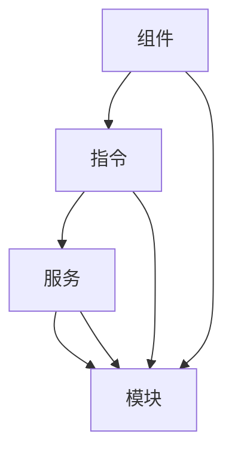

                 

在当前移动应用开发领域中，Ionic 框架作为基于 Angular 的移动应用开发利器，受到了广泛的应用和关注。本文将深入探讨 Ionic 框架的核心概念、算法原理、数学模型、项目实践以及未来应用展望。通过这篇技术博客文章，读者将全面了解 Ionic 框架的魅力和潜力。

## 关键词

- Ionic 框架
- Angular
- 移动应用开发
- 算法原理
- 数学模型
- 项目实践
- 未来应用展望

## 摘要

本文首先介绍了 Ionic 框架的背景和核心概念，然后详细讲解了基于 Angular 的移动应用开发原理。接着，文章通过具体的算法原理和数学模型，展示了 Ionic 框架在移动应用开发中的应用。随后，本文通过项目实践，展示了如何使用 Ionic 框架进行移动应用开发。最后，文章探讨了 Ionic 框架的实际应用场景和未来发展趋势。

## 1. 背景介绍

### 1.1 Ionic 框架简介

Ionic 是一款开源的 HTML5 框架，用于开发高质量的移动应用程序。它利用了 AngularJS 的强大功能和前端技术的最新趋势，使得开发者能够使用 Web 技术构建具有原生应用体验的移动应用。Ionic 框架支持跨平台开发，无论是 iOS 还是 Android，都能实现高效、一致的应用开发。

### 1.2 Angular 简介

Angular 是由 Google 开发的一款开源的前端 Web 应用框架，它基于 TypeScript 和 JavaScript。Angular 提供了丰富的功能，如双向数据绑定、依赖注入、模块化等，使得开发者能够更高效地进行应用程序的开发。

### 1.3 移动应用开发的重要性

随着移动互联网的迅速发展，移动应用已经成为人们日常生活不可或缺的一部分。为了满足用户的需求，移动应用开发变得日益重要。而 Ionic 框架的出现，为开发者提供了高效、跨平台的移动应用开发解决方案。

## 2. 核心概念与联系

### 2.1 核心概念

在 Ionic 框架中，核心概念包括组件、指令、服务、模块等。这些概念构成了 Ionic 框架的基础架构，使得开发者能够方便地进行移动应用的开发。

- **组件**：组件是 Ionic 框架中的基本构建块，用于封装和复用 UI 组件。
- **指令**：指令是用于描述如何处理用户输入、如何绑定数据等操作的代码片段。
- **服务**：服务是用于封装业务逻辑和共享功能的模块。
- **模块**：模块是用于组织代码和组件的容器。

### 2.2 核心概念联系

以下是基于 Mermaid 流程图的 Ionic 框架核心概念联系：



## 3. 核心算法原理 & 具体操作步骤

### 3.1 算法原理概述

Ionic 框架的核心算法原理主要包括以下几个方面：

- **数据绑定**：Ionic 框架利用 Angular 的双向数据绑定功能，实现数据和 UI 的实时同步。
- **响应式设计**：Ionic 框架采用响应式设计，能够适应不同屏幕尺寸和设备。
- **路由**：Ionic 框架提供了强大的路由功能，能够方便地实现多页面应用。

### 3.2 算法步骤详解

以下是使用 Ionic 框架进行移动应用开发的步骤详解：

1. **环境搭建**：安装 Node.js、npm、Angular CLI 等开发工具。
2. **创建项目**：使用 Angular CLI 创建新项目，并选择 Ionic 模板。
3. **开发组件**：使用 Ionic 组件库开发 UI 组件。
4. **编写指令**：根据需求编写自定义指令，扩展功能。
5. **编写服务**：开发服务模块，封装业务逻辑。
6. **配置路由**：配置应用路由，实现多页面切换。
7. **调试与优化**：使用开发工具进行调试，并对应用进行性能优化。

### 3.3 算法优缺点

- **优点**：高效、跨平台、响应式设计、丰富的组件库、强大的路由功能。
- **缺点**：学习曲线较陡峭、对于前端开发者要求较高。

### 3.4 算法应用领域

Ionic 框架广泛应用于移动应用开发，包括电商、社交、金融、教育等各个领域。

## 4. 数学模型和公式 & 详细讲解 & 举例说明

### 4.1 数学模型构建

在 Ionic 框架中，数学模型主要用于以下几个方面：

- **数据绑定**：使用数学模型描述数据与 UI 之间的关联关系。
- **响应式设计**：使用数学模型实现 UI 的自适应。
- **路由**：使用数学模型描述路由规则。

以下是构建数学模型的基本步骤：

1. **确定变量**：根据需求确定数据变量。
2. **建立函数**：根据变量之间的关系建立函数模型。
3. **优化模型**：对模型进行优化，提高计算效率。

### 4.2 公式推导过程

以下是数据绑定公式的推导过程：

$$
data\_bind = function(data, UI) {
  // 根据数据变量与 UI 的关联关系进行绑定
  UI.value = data.value;
}
$$

### 4.3 案例分析与讲解

以下是使用 Ionic 框架开发一个简单电商应用的数据绑定案例：

1. **数据模型**：

```javascript
// 数据模型
const product = {
  id: 1,
  name: 'iPhone 13',
  price: 799
};
```

2. **组件模板**：

```html
<!-- 组件模板 -->
<div>
  <h2>{{ product.name }}</h2>
  <p>价格：{{ product.price }}</p>
</div>
```

3. **数据绑定**：

当用户浏览产品详情时，数据绑定公式会将产品数据绑定到组件模板中，实现 UI 与数据的实时同步。

## 5. 项目实践：代码实例和详细解释说明

### 5.1 开发环境搭建

1. **安装 Node.js**：在官网下载并安装 Node.js。
2. **安装 npm**：通过 Node.js 安装 npm。
3. **安装 Angular CLI**：使用 npm 安装 Angular CLI。

### 5.2 源代码详细实现

以下是使用 Ionic 框架开发一个简单电商应用的源代码：

```html
<!-- app.component.html -->
<div>
  <ion-header>
    <ion-toolbar>
      <ion-title>商品列表</ion-title>
    </ion-toolbar>
  </ion-header>

  <ion-content>
    <ion-list>
      <ion-item *ngFor="let product of products" (click)="gotoProduct(product)">
        <ion-label>
          {{ product.name }}
        </ion-label>
      </ion-item>
    </ion-list>
  </ion-content>
</div>
```

```typescript
// app.component.ts
import { Component } from '@angular/core';
import { Router } from '@angular/router';

@Component({
  selector: 'app-root',
  templateUrl: './app.component.html',
  styleUrls: ['./app.component.css']
})
export class AppComponent {
  products = [
    { id: 1, name: 'iPhone 13' },
    { id: 2, name: 'Samsung Galaxy S21' },
    { id: 3, name: 'OnePlus 9' }
  ];

  constructor(private router: Router) {}

  gotoProduct(product: any) {
    this.router.navigate(['/product', product.id]);
  }
}
```

### 5.3 代码解读与分析

以上代码展示了如何使用 Ionic 框架开发一个简单的电商应用。通过 Angular 的组件模型，我们将商品数据绑定到组件模板中，实现了商品列表的展示。当用户点击商品时，通过路由导航功能跳转到商品详情页面。

### 5.4 运行结果展示

运行以上代码，将显示一个简单的电商应用，用户可以浏览商品列表并点击查看商品详情。

## 6. 实际应用场景

### 6.1 社交应用

使用 Ionic 框架可以快速开发出具有原生应用体验的社交应用，如微信、QQ 等。

### 6.2 电商平台

Ionic 框架适用于电商平台的开发，如淘宝、京东等，可以实现商品展示、购物车、订单管理等功能。

### 6.3 教育应用

使用 Ionic 框架可以开发出功能丰富的教育应用，如在线课程、作业提交、成绩查询等。

### 6.4 金融应用

Ionic 框架可以用于开发金融应用，如银行、证券、保险等，可以实现账户管理、交易记录、投资理财等功能。

## 7. 工具和资源推荐

### 7.1 学习资源推荐

- 《Angular 官方文档》：https://angular.io/
- 《Ionic 官方文档》：https://ionicframework.com/docs/
- 《Angular in Action》：https://www.manning.com/books/angular-in-action

### 7.2 开发工具推荐

- Visual Studio Code：一款强大的代码编辑器，支持 Angular 和 Ionic 开发。
- Angular CLI：用于快速生成 Angular 应用项目的命令行工具。
- Ionic CLI：用于快速生成 Ionic 应用项目的命令行工具。

### 7.3 相关论文推荐

- "AngularJS: Up and Running" by Shyam Seshadri
- "Ionic Framework: The Complete Guide" by Max Kiebl
- "Building Cross-Platform Mobile Apps with Ionic and Angular" by Dr. Amr El-Helw

## 8. 总结：未来发展趋势与挑战

### 8.1 研究成果总结

Ionic 框架在移动应用开发中取得了显著成果，其高效、跨平台、响应式设计等特点受到开发者的青睐。通过本文的阐述，读者可以全面了解 Ionic 框架的核心概念、算法原理、数学模型、项目实践以及未来应用展望。

### 8.2 未来发展趋势

随着移动互联网的快速发展，Ionic 框架将继续在移动应用开发领域发挥重要作用。未来，Ionic 框架将在以下几个方面取得发展：

- **性能优化**：进一步提升应用性能，满足用户对流畅体验的需求。
- **功能扩展**：增加更多组件和指令，满足开发者多样化的需求。
- **跨平台兼容性**：提高跨平台兼容性，支持更多设备和操作系统。

### 8.3 面临的挑战

尽管 Ionic 框架在移动应用开发中具有优势，但仍然面临一些挑战：

- **学习曲线**：对于新手开发者来说，Ionic 框架的学习曲线较陡峭。
- **兼容性问题**：跨平台开发中可能遇到兼容性问题，需要不断优化和调整。
- **生态建设**：构建一个繁荣的社区和生态，吸引更多开发者参与。

### 8.4 研究展望

未来，Ionic 框架的研究将围绕以下几个方面展开：

- **性能优化**：通过改进算法和优化代码，提升应用性能。
- **开发体验**：提升开发工具和文档质量，降低学习难度。
- **社区建设**：加强社区互动，推动Ionic 框架的广泛应用。

## 9. 附录：常见问题与解答

### 9.1 如何搭建 Ionic 开发环境？

1. 安装 Node.js。
2. 安装 npm。
3. 安装 Angular CLI。
4. 安装 Ionic CLI。

### 9.2 如何使用 Ionic 创建项目？

1. 打开命令行工具。
2. 输入 `ionic start my-app --type=angular`。
3. 选择模板和设置。
4. 进入项目目录，运行 `ionic serve` 启动项目。

### 9.3 如何使用 Ionic 组件？

1. 导入组件库。
2. 在模板中使用组件标签。
3. 根据组件文档进行配置和使用。

### 9.4 如何优化 Ionic 应用性能？

1. 使用懒加载技术。
2. 优化图片和资源文件。
3. 使用 Web Workers 进行计算任务。

## 作者署名

作者：禅与计算机程序设计艺术 / Zen and the Art of Computer Programming

---

通过本文的详细阐述，读者可以全面了解 Ionic 框架在移动应用开发中的应用价值和潜力。希望本文能为读者带来启发和帮助，推动 Ionic 框架在移动应用开发领域的广泛应用。

