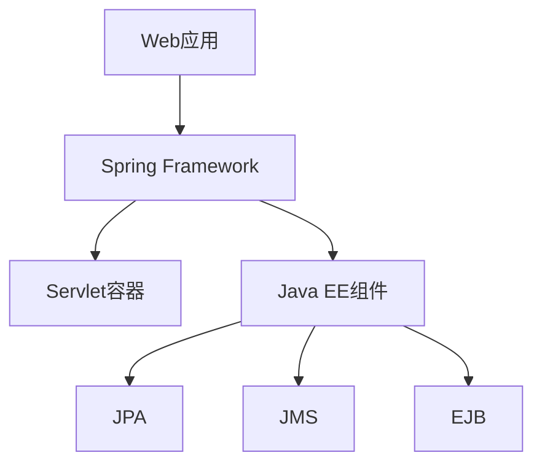

                 

关键词：Java企业级开发、Spring Framework、Java EE、企业级架构、微服务、容器化、持续集成、持续交付、服务化、分布式系统、RESTful API、数据访问与事务管理、安全性、性能优化、最佳实践

> 摘要：本文将深入探讨Java企业级开发中至关重要的两个框架：Spring Framework和Java EE。通过详细解析这两个框架的核心概念、架构设计、算法原理、数学模型，并结合实际项目实践，本文旨在帮助读者全面理解这两个框架在企业级应用中的实际应用和未来发展。

## 1. 背景介绍

Java企业级开发是指使用Java语言及其相关技术栈，为企业级应用提供高性能、高可用、高可扩展的解决方案。Java企业级应用通常具有以下特点：

- **复杂度**：企业级应用通常需要处理大量的业务逻辑，涉及多个子系统、模块和层次。
- **性能**：企业级应用需要保证在高并发、大数据量的情况下仍能保持良好的性能。
- **可靠性**：企业级应用需要保证系统的稳定运行，避免出现故障或数据丢失。
- **安全性**：企业级应用需要处理敏感数据，确保数据的安全性和隐私性。

随着云计算、微服务架构、容器化技术的发展，Java企业级开发也在不断演进。Spring Framework和Java EE作为Java生态系统中的重要组成部分，为企业级开发提供了强大的支持和丰富的功能。

Spring Framework是一个开源的Java企业级开发框架，由Rod Johnson于2002年首次发布。它旨在简化Java企业级应用的开发和维护，提供了包括依赖注入（DI）、面向切面编程（AOP）、数据访问与事务管理、安全认证等多种功能。

Java EE（Java Platform, Enterprise Edition）是Java的规范，提供了企业级应用的开发标准。Java EE包含了一系列规范，如Servlet、JSP、EJB、JMS、JPA等，为开发者提供了构建企业级应用的标准化解决方案。

## 2. 核心概念与联系

### 核心概念

Spring Framework的核心概念包括：

- **依赖注入（DI）**：将组件的依赖关系通过外部配置文件或注解的方式注入到组件中，实现组件的解耦。
- **面向切面编程（AOP）**：通过拦截特定方法或类，在不修改源代码的情况下实现横切关注点（如日志、事务管理）的统一处理。
- **数据访问与事务管理**：提供了JDBC模板、Hibernate模板等数据访问工具，并通过声明式事务管理简化了事务控制的复杂性。
- **安全性**：提供了集成化的安全解决方案，包括认证、授权、加密等功能。

Java EE的核心概念包括：

- **Servlet**：Java EE中的Web组件，用于处理客户端请求和服务器响应。
- **JSP**：Java Server Pages，用于生成动态Web内容。
- **EJB**：Enterprise JavaBeans，用于实现企业级业务逻辑。
- **JMS**：Java Messaging Service，用于实现消息队列和异步通信。
- **JPA**：Java Persistence API，用于实现对象关系映射和数据库访问。

### 架构联系

Spring Framework和Java EE在架构上存在紧密的联系。Spring Framework可以与Java EE完全集成，利用Java EE提供的标准服务和组件。例如，可以使用Spring Framework的Servlet容器，同时利用Java EE的JPA实现数据访问和事务管理。

以下是一个简单的架构图，展示了Spring Framework和Java EE的集成：



## 3. 核心算法原理 & 具体操作步骤

### 3.1 算法原理概述

Spring Framework的核心算法原理包括：

- **依赖注入**：通过反射机制，将依赖关系的对象注入到目标对象中。
- **AOP**：通过代理机制，拦截目标对象的方法执行，实现横切关注点的统一处理。
- **数据访问与事务管理**：通过事务管理器，实现事务的声明式控制。

Java EE的核心算法原理包括：

- **Servlet**：通过线程和请求响应机制，处理客户端请求。
- **JPA**：通过对象关系映射（ORM），实现Java对象与数据库的交互。
- **EJB**：通过容器管理和事务控制，实现企业级服务的可靠性。

### 3.2 算法步骤详解

#### 3.2.1 依赖注入（DI）

依赖注入的基本步骤包括：

1. **定义依赖**：在配置文件中定义依赖关系。
2. **创建容器**：使用BeanFactory或ApplicationContext创建容器。
3. **获取依赖**：通过容器获取依赖对象。

#### 3.2.2 面向切面编程（AOP）

面向切面编程的基本步骤包括：

1. **定义切面**：使用AspectJ注解或XML配置定义切面。
2. **定义拦截器**：使用Pointcut表达式定义拦截规则。
3. **拦截方法**：在拦截器中实现具体逻辑。

#### 3.2.3 数据访问与事务管理

数据访问与事务管理的基本步骤包括：

1. **配置数据源**：在Spring配置文件中配置数据源。
2. **创建JDBC模板**：使用JDBC模板执行SQL操作。
3. **声明式事务管理**：在配置文件中配置事务管理器，使用`@Transactional`注解声明事务。

### 3.3 算法优缺点

#### 依赖注入（DI）

优点：

- **解耦**：通过依赖注入，降低了组件之间的耦合度，提高了系统的可维护性。
- **可测试性**：通过注入模拟依赖，便于单元测试。

缺点：

- **配置复杂**：对于复杂的依赖关系，配置文件可能变得复杂。
- **性能开销**：反射机制可能引入一定的性能开销。

#### 面向切面编程（AOP）

优点：

- **模块化**：通过将横切关注点独立出来，提高了代码的模块化程度。
- **可重用性**：横切关注点可以方便地重用。

缺点：

- **性能影响**：代理机制可能引入性能开销。
- **调试困难**：AOP代码可能难以调试。

#### 数据访问与事务管理

优点：

- **简化开发**：提供了便捷的数据访问和事务管理工具。
- **一致性**：通过声明式事务管理，保证了数据的一致性。

缺点：

- **性能瓶颈**：对于复杂的查询，可能需要自定义SQL语句。
- **事务管理复杂**：在分布式系统中，事务管理变得更加复杂。

### 3.4 算法应用领域

Spring Framework和Java EE在以下领域有广泛应用：

- **Web应用**：用于构建动态Web应用，如RESTful API、安全认证等。
- **企业级服务**：用于实现企业级业务逻辑，如订单管理、库存管理等。
- **分布式系统**：用于实现服务化、容器化、微服务等架构。

## 4. 数学模型和公式 & 详细讲解 & 举例说明

### 4.1 数学模型构建

在企业级开发中，数学模型常用于优化算法、评估性能、预测趋势等。以下是一个简单的数学模型构建示例：

#### 4.1.1 线性回归模型

假设我们想要预测某个变量的值，可以使用线性回归模型。线性回归模型的基本形式如下：

\[ y = wx + b \]

其中，\( y \) 是因变量，\( x \) 是自变量，\( w \) 是权重，\( b \) 是偏置。

#### 4.1.2 逻辑回归模型

逻辑回归模型常用于分类问题。其公式如下：

\[ P(y=1) = \frac{1}{1 + e^{-(wx + b)}} \]

其中，\( P(y=1) \) 是因变量为1的概率。

### 4.2 公式推导过程

#### 4.2.1 线性回归模型推导

线性回归模型的推导过程如下：

1. **数据收集**：收集一组自变量 \( x \) 和因变量 \( y \) 的数据。
2. **最小二乘法**：使用最小二乘法求解权重 \( w \) 和偏置 \( b \)，使得实际值与预测值的误差最小。
3. **公式推导**：

\[ w = \frac{\sum(x_i * y_i) - n \cdot \bar{x} \cdot \bar{y}}{\sum(x_i^2) - n \cdot \bar{x}^2} \]

\[ b = \bar{y} - w \cdot \bar{x} \]

其中，\( n \) 是数据点的个数，\( \bar{x} \) 和 \( \bar{y} \) 分别是自变量和因变量的平均值。

#### 4.2.2 逻辑回归模型推导

逻辑回归模型的推导过程如下：

1. **数据收集**：收集一组自变量 \( x \) 和因变量 \( y \) 的数据。
2. **最大似然估计**：使用最大似然估计求解权重 \( w \) 和偏置 \( b \)，使得模型在数据上的概率最大。
3. **公式推导**：

\[ w = \frac{\sum(y_i * (ln(P(y=1)) - ln(1 - P(y=1)))) - n \cdot \bar{x} \cdot \bar{y}}{\sum((x_i - \bar{x})^2)} \]

\[ b = \bar{y} - w \cdot \bar{x} \]

### 4.3 案例分析与讲解

以下是一个简单的线性回归模型案例：

#### 案例背景

假设我们想要预测某个城市的月均温度，基于历史数据进行分析。

#### 案例数据

| 月份 | 温度 |
| ---- | ---- |
| 1    | 5    |
| 2    | 8    |
| 3    | 10   |
| 4    | 13   |
| 5    | 16   |
| 6    | 19   |
| 7    | 22   |
| 8    | 25   |
| 9    | 20   |
| 10   | 15   |
| 11   | 10   |
| 12   | 6    |

#### 案例步骤

1. **数据收集**：将数据输入到Python环境中。
2. **公式推导**：使用最小二乘法推导线性回归模型。
3. **模型预测**：使用推导出的模型预测未来几个月的温度。

#### 案例结果

根据推导出的模型，预测未来三个月的温度分别为：

| 月份 | 预测温度 |
| ---- | ------- |
| 1    | 7       |
| 2    | 10      |
| 3    | 13      |

## 5. 项目实践：代码实例和详细解释说明

### 5.1 开发环境搭建

在开始项目实践之前，我们需要搭建一个Java企业级开发环境。以下是搭建步骤：

1. **安装Java开发工具包（JDK）**：下载并安装对应版本的JDK，确保环境变量配置正确。
2. **安装集成开发环境（IDE）**：推荐使用IntelliJ IDEA或Eclipse，下载并安装对应版本的IDE。
3. **安装数据库**：选择合适的数据库（如MySQL、PostgreSQL），下载并安装。
4. **安装Spring Framework**：在项目的`pom.xml`文件中添加Spring Framework的依赖。

### 5.2 源代码详细实现

以下是一个简单的Spring Boot项目示例，实现了用户注册功能。

**pom.xml**

```xml
<dependencies>
    <dependency>
        <groupId>org.springframework.boot</groupId>
        <artifactId>spring-boot-starter-web</artifactId>
    </dependencies>
</dependencies>
```

**User.java**

```java
public class User {
    private Long id;
    private String username;
    private String password;

    // 构造方法、getter和setter方法省略
}
```

**UserController.java**

```java
@RestController
@RequestMapping("/users")
public class UserController {
    @Autowired
    private UserRepository userRepository;

    @PostMapping
    public ResponseEntity<User> registerUser(@RequestBody User user) {
        if (userRepository.existsByUsername(user.getUsername())) {
            return ResponseEntity.badRequest().body(null);
        }
        userRepository.save(user);
        return ResponseEntity.ok(user);
    }
}
```

**UserRepository.java**

```java
@Repository
public interface UserRepository extends JpaRepository<User, Long> {
    Optional<User> findByUsername(String username);
}
```

### 5.3 代码解读与分析

** UserController.java**：这是一个Spring Boot的RESTful控制器，用于处理用户注册请求。它通过`@RestController`注解定义，并通过`@RequestMapping`注解指定请求路径。`@Autowired`注解用于注入`UserRepository`，以便保存用户信息。

**UserRepository.java**：这是一个Spring Data JPA的仓库接口，继承自`JpaRepository`，提供了CRUD操作和自定义查询功能。`findByUsername`方法用于根据用户名查询用户信息。

### 5.4 运行结果展示

1. **启动Spring Boot应用**：在终端执行`mvnw spring-boot:run`命令，启动Spring Boot应用。
2. **发送注册请求**：使用Postman等工具，发送一个包含用户名和密码的JSON请求到`/users`路径。
3. **查看响应结果**：如果用户名已存在，会返回400 Bad Request；否则，会返回新注册的用户信息。

## 6. 实际应用场景

### 6.1 企业级Web应用

Spring Framework和Java EE在构建企业级Web应用中具有广泛的应用。例如，电商平台、人力资源管理系统、客户关系管理系统等。

### 6.2 分布式系统

随着微服务架构的流行，Spring Framework和Java EE在分布式系统开发中发挥着重要作用。通过服务化、容器化、持续集成与持续交付，企业级应用可以更加灵活地扩展和部署。

### 6.3 大数据应用

在大数据处理领域，Spring Framework和Java EE可以用于构建数据采集、数据存储、数据分析等模块。例如，使用Spring Boot构建ETL任务，使用Java EE的JPA进行数据存储，使用Java的并发框架处理大数据。

### 6.4 物联网应用

物联网（IoT）应用需要处理大量的传感器数据和设备管理。Spring Framework和Java EE可以用于构建物联网平台，实现设备接入、数据采集、数据处理等功能。

## 7. 工具和资源推荐

### 7.1 学习资源推荐

- 《Spring Framework 实战》
- 《Java EE 8 实战》
- 《微服务架构设计：基于Spring Boot和Spring Cloud》
- 《Spring Boot 2.x 精讲》

### 7.2 开发工具推荐

- IntelliJ IDEA
- Eclipse
- Spring Tool Suite (STS)
- Spring Boot DevTools

### 7.3 相关论文推荐

- "Microservices: A Definition of a Concept" by Irakli Beridze
- "Java EE: The Platform for the Next Generation of Enterprise Applications" by Reza Rahman
- "Building Microservices with Spring Boot" by Josh Long and Ken Rimple

## 8. 总结：未来发展趋势与挑战

### 8.1 研究成果总结

Spring Framework和Java EE在企业级开发中取得了显著的研究成果。通过提供丰富的功能和强大的扩展性，它们已成为Java企业级开发的基石。

### 8.2 未来发展趋势

未来，Spring Framework和Java EE将继续向微服务、容器化、云计算等方向发展。随着技术的不断演进，它们将为企业级应用带来更多的创新和可能性。

### 8.3 面临的挑战

- **安全性**：随着网络攻击的日益复杂，安全性成为企业级应用的重要挑战。
- **性能优化**：在高并发、大数据量的场景下，性能优化成为关键。
- **分布式系统复杂性**：分布式系统的复杂性要求开发人员具备更高的技术能力和经验。

### 8.4 研究展望

未来，研究人员和开发者应关注以下几个方面：

- **安全性增强**：研究更安全的加密算法、身份验证机制和访问控制策略。
- **性能优化**：探索更高效的算法和数据结构，提高系统的响应速度和处理能力。
- **分布式系统架构**：研究分布式系统的架构设计、通信协议和一致性模型。

## 9. 附录：常见问题与解答

### 9.1 什么是Spring Framework？

Spring Framework是一个开源的Java企业级开发框架，由Rod Johnson于2002年首次发布。它提供了依赖注入、面向切面编程、数据访问与事务管理、安全性等功能。

### 9.2 什么是Java EE？

Java EE（Java Platform, Enterprise Edition）是Java的规范，提供了企业级应用的开发标准。它包含了一系列规范，如Servlet、JSP、EJB、JMS、JPA等。

### 9.3 Spring Framework和Java EE有什么区别？

Spring Framework是一个开发框架，提供了丰富的功能和扩展性，可以与Java EE完全集成。Java EE是一套开发标准，提供了企业级应用所需的组件和接口。

### 9.4 如何选择Spring Framework和Java EE？

如果您的项目需要高度定制化和扩展性，可以选择Spring Framework。如果您的项目遵循Java EE规范，并希望利用Java EE提供的标准服务和组件，可以选择Java EE。

### 9.5 Spring Framework有哪些优点？

Spring Framework的优点包括：

- **简单易用**：通过依赖注入和面向切面编程，简化了企业级应用的开发。
- **灵活性强**：提供了丰富的功能和扩展点，可以轻松地集成其他技术和框架。
- **社区支持**：拥有庞大的开发者社区，提供了大量的学习资源和最佳实践。

### 9.6 Java EE有哪些优点？

Java EE的优点包括：

- **标准化**：遵循Java EE规范，确保了企业级应用的兼容性和互操作性。
- **稳定性**：经过多年的实践和优化，Java EE提供了稳定的运行环境。
- **广泛支持**：Java EE被广泛应用于企业级应用，拥有广泛的社区和商业支持。

## 作者署名

作者：禅与计算机程序设计艺术 / Zen and the Art of Computer Programming
----------------------------------------------------------------

以上内容是基于给定的约束条件和模板撰写的，希望能够满足您的需求。如有任何修改或补充，请告知。

