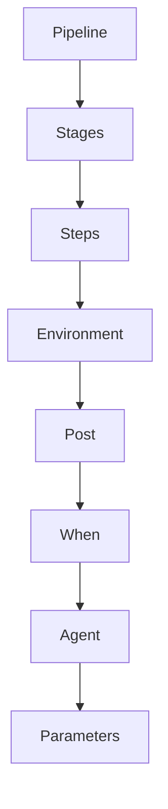

                 

关键词：Jenkins, Pipeline, 脚本开发，自动化构建，持续集成，DevOps

摘要：本文将探讨Jenkins Pipeline脚本开发的各个方面，从基础概念到高级应用，帮助读者深入了解Jenkins Pipeline的强大功能。我们将详细讲解Jenkins Pipeline的核心概念，提供实用的算法原理与操作步骤，并通过实际代码实例展示其应用场景，旨在为读者提供完整的Jenkins Pipeline开发指南。

## 1. 背景介绍

在当今快速发展的软件开发行业中，持续集成（CI）和持续部署（CD）已经成为确保软件质量和交付效率的关键实践。Jenkins，作为开源自动化构建工具的领导者，因其灵活性和强大的扩展性，被广泛应用于持续集成和持续部署流程中。而Jenkins Pipeline则是Jenkins实现持续集成和持续部署的核心组件，它允许开发者以代码形式定义构建、测试和部署流水线，大大提高了开发效率。

Jenkins Pipeline是一种基于Apache Groovy语言的声明式管道脚本，它将构建步骤以代码的形式进行定义，使得整个构建过程可以自动化和重复执行。本文将详细介绍Jenkins Pipeline的脚本开发，帮助读者掌握这一强大工具。

## 2. 核心概念与联系

### 2.1 Jenkins Pipeline基本概念

- **Pipeline**: Pipeline是Jenkins的一种工作流自动化工具，它可以定义整个构建、测试、部署的流程。
- **Stage**: Stage是Pipeline中的一个阶段，代表构建流程中的一个环节，如构建、测试、部署等。
- **Step**: Step是Pipeline中的一个执行单元，代表一个具体的操作，如执行Shell命令、安装依赖等。

### 2.2 Jenkins Pipeline架构

下面是Jenkins Pipeline的基本架构，用Mermaid流程图表示：



### 2.3 Jenkins Pipeline与CI/CD的关系

持续集成（CI）和持续部署（CD）是软件开发中的重要实践。Jenkins Pipeline通过自动化构建、测试和部署流程，实现了以下目标：

- **快速反馈**: 通过自动化测试，可以快速识别代码变更中的问题。
- **提高质量**: 通过持续集成，确保每次提交的代码都是可构建和可测试的。
- **加快交付**: 通过自动化部署，可以缩短新功能从开发到生产的周期。

## 3. 核心算法原理 & 具体操作步骤

### 3.1 算法原理概述

Jenkins Pipeline的工作原理是基于声明式语法，通过定义一系列步骤和阶段来实现自动化流程。下面是核心算法原理的概述：

- **声明式语法**: Jenkins Pipeline使用Groovy语言的一种声明式语法，定义构建步骤。
- **状态机模型**: 构建流程可以被看作是一个状态机，每个阶段和步骤对应一个状态。
- **流水线定义**: 通过编写Pipeline脚本，定义整个构建流程的各个环节。

### 3.2 算法步骤详解

#### 3.2.1 定义Pipeline

定义Pipeline的第一步是选择Pipeline类型，如自由风格或者多阶段流水线。以下是一个简单的自由风格Pipeline定义：

```groovy
pipeline {
    agent any
    stages {
        stage('Build') {
            steps {
                sh 'mvn clean install'
            }
        }
        stage('Test') {
            steps {
                sh 'mvn test'
            }
        }
        stage('Deploy') {
            steps {
                sh 'echo "Deploying to production..."'
            }
        }
    }
}
```

#### 3.2.2 管理分支

Jenkins Pipeline支持基于分支的构建，可以针对不同的分支执行不同的构建脚本。以下是如何根据分支构建的示例：

```groovy
pipeline {
    agent any
    branches {
        branch('master', {
            stages {
                stage('Master Build') {
                    steps {
                        sh 'mvn clean install'
                    }
                }
            }
        })
        branch('feature/*', {
            stages {
                stage('Feature Build') {
                    steps {
                        sh 'mvn clean install'
                    }
                }
            }
        })
    }
}
```

#### 3.2.3 并行执行

Jenkins Pipeline支持并行执行，允许在不同阶段或者同一阶段的步骤中并行执行。以下是一个并行执行的示例：

```groovy
pipeline {
    agent any
    stages {
        stage('Build and Test') {
            parallel {
                stage('Build') {
                    steps {
                        sh 'mvn clean install'
                    }
                }
                stage('Test') {
                    steps {
                        sh 'mvn test'
                    }
                }
            }
        }
    }
}
```

### 3.3 算法优缺点

**优点**：

- **灵活性**: Jenkins Pipeline允许开发者以代码的形式定义构建流程，非常灵活。
- **可扩展性**: 通过扩展Groovy语法，可以实现各种复杂的构建逻辑。
- **自动化**: 极大的提高了构建、测试和部署的自动化程度。

**缺点**：

- **学习曲线**: 初学者可能需要一段时间来熟悉Groovy语法和Pipeline的结构。
- **调试困难**: 由于Pipeline是声明式的，调试起来可能比命令行脚本更困难。

### 3.4 算法应用领域

Jenkins Pipeline广泛应用于各种软件开发项目，特别是需要持续集成和持续部署的场景。以下是几个典型的应用领域：

- **Web应用**: 对于Web应用的构建、测试和部署，Jenkins Pipeline提供了高效且灵活的解决方案。
- **移动应用**: Jenkins Pipeline可以用于移动应用的构建和测试，确保每次提交的代码都是可构建的。
- **微服务架构**: 在微服务架构中，Jenkins Pipeline可以帮助自动化多个服务的构建、测试和部署。

## 4. 数学模型和公式 & 详细讲解 & 举例说明

### 4.1 数学模型构建

在Jenkins Pipeline中，数学模型的应用主要体现在构建时间和资源消耗的计算上。以下是一个简单的数学模型构建：

- **构建时间**: 构建时间取决于多个因素，包括代码复杂度、依赖关系、硬件性能等。
- **资源消耗**: 资源消耗包括CPU、内存、磁盘空间等。

假设构建时间T可以表示为：

\[ T = f(C, D, P) \]

其中，\( C \)是代码复杂度，\( D \)是依赖关系，\( P \)是硬件性能。

### 4.2 公式推导过程

我们通过以下步骤推导构建时间公式：

1. **代码复杂度**: 代码复杂度可以通过代码行数、函数数量等指标来衡量。
2. **依赖关系**: 依赖关系可以通过模块数量、模块间的调用关系来衡量。
3. **硬件性能**: 硬件性能可以通过CPU频率、内存容量等指标来衡量。

结合上述因素，我们得到构建时间公式：

\[ T = k_1 \cdot C + k_2 \cdot D + k_3 \cdot P \]

其中，\( k_1, k_2, k_3 \)是权重系数，可以根据实际情况进行调整。

### 4.3 案例分析与讲解

假设我们有一个Web应用项目，代码复杂度C为1000行，依赖关系D为10个模块，硬件性能P为2GHz。根据构建时间公式，我们可以计算得到构建时间T：

\[ T = k_1 \cdot 1000 + k_2 \cdot 10 + k_3 \cdot 2 \]

假设权重系数\( k_1 = 0.5, k_2 = 0.2, k_3 = 0.3 \)，代入公式得到：

\[ T = 0.5 \cdot 1000 + 0.2 \cdot 10 + 0.3 \cdot 2 = 500 + 2 + 0.6 = 502.6 \]

因此，该Web应用项目的构建时间预计为503秒。

## 5. 项目实践：代码实例和详细解释说明

### 5.1 开发环境搭建

在进行Jenkins Pipeline脚本开发之前，需要搭建好开发环境。以下是开发环境搭建的详细步骤：

1. **安装Jenkins**: 从Jenkins官网下载最新版本，并按照官方文档安装。
2. **安装Groovy**: Jenkins Pipeline需要Groovy语言支持，从Groovy官网下载并安装。
3. **安装插件**: 在Jenkins管理界面中，安装必要的插件，如Pipeline插件、Git插件等。

### 5.2 源代码详细实现

以下是一个简单的Jenkins Pipeline脚本示例：

```groovy
pipeline {
    agent any
    environment {
        APP_VERSION = '1.0.0'
    }
    stages {
        stage('Check Out') {
            steps {
                checkout([
                    $class: 'GitSCM',
                    branches: [[name: 'master']],
                    repository: [
                        $class: 'GitRepository',
                        url: 'https://github.com/your-username/your-project.git'
                    ]
                ])
            }
        }
        stage('Build') {
            steps {
                sh "mvn -Dversion=${APP_VERSION} clean install"
            }
        }
        stage('Test') {
            steps {
                sh "mvn -Dversion=${APP_VERSION} test"
            }
        }
        stage('Deploy') {
            steps {
                sh "echo 'Deploying version ${APP_VERSION} to production...'"
            }
        }
    }
}
```

### 5.3 代码解读与分析

上述代码是一个简单的Jenkins Pipeline脚本，解读如下：

- **定义Pipeline**: 使用`pipeline`关键字定义Pipeline。
- **设置Agent**: 使用`agent`关键字设置运行构建的Agent。
- **定义环境变量**: 使用`environment`关键字设置环境变量`APP_VERSION`。
- **定义阶段**: 使用`stages`关键字定义构建、测试和部署等阶段。
- **执行步骤**: 在每个阶段中，使用`steps`关键字定义具体的执行步骤。

### 5.4 运行结果展示

执行上述脚本后，Jenkins会自动执行以下步骤：

1. **Checkout**: 从GitHub仓库检出代码。
2. **Build**: 使用Maven构建项目。
3. **Test**: 使用Maven执行测试。
4. **Deploy**: 输出部署信息。

运行结果可以通过Jenkins控制台输出查看。

## 6. 实际应用场景

### 6.1 跨平台构建

Jenkins Pipeline可以跨平台构建，支持Linux、Windows等多种操作系统。通过定义不同的Agent，可以实现同一项目在不同操作系统上的构建和测试。

### 6.2 多模块项目

在多模块项目中，Jenkins Pipeline可以根据模块的依赖关系，定义多个阶段和步骤，确保每个模块都能正确构建和测试。

### 6.3 持续集成

通过Jenkins Pipeline，可以实现持续集成，确保每次代码提交都是可构建和可测试的。这有助于及早发现和解决代码中的问题。

### 6.4 持续部署

Jenkins Pipeline可以自动化部署到各种环境，如开发、测试、生产等。通过定义不同的部署策略，可以实现零停机部署。

## 7. 工具和资源推荐

### 7.1 学习资源推荐

- **官方文档**: Jenkins和Groovy的官方文档是学习Pipeline的最佳资源。
- **在线教程**: 在线平台如Coursera、Udemy等提供了丰富的Jenkins和Groovy教程。
- **技术博客**: 许多技术博客和社区如DZone、Stack Overflow等都有关于Jenkins Pipeline的实战经验和教程。

### 7.2 开发工具推荐

- **Jenkins GUI**: 使用Jenkins GUI界面可以更直观地管理Pipeline。
- **编辑器**: 使用支持Groovy代码高亮和自动完成的IDE如IntelliJ IDEA或Eclipse。

### 7.3 相关论文推荐

- **《Jenkins Pipeline: A Cloud-Native Approach to Continuous Delivery》**: 该论文详细介绍了Jenkins Pipeline在持续交付中的应用。
- **《DevOps and Jenkins: A Guide to Implementing Continuous Integration and Delivery》**: 该书为DevOps实践者和Jenkins用户提供了详细的指南。

## 8. 总结：未来发展趋势与挑战

### 8.1 研究成果总结

Jenkins Pipeline在持续集成和持续部署领域取得了显著成果，极大地提高了开发效率和软件质量。随着DevOps的普及，Jenkins Pipeline的应用前景将更加广阔。

### 8.2 未来发展趋势

- **更多集成**: 未来Jenkins Pipeline将与其他DevOps工具（如Docker、Kubernetes等）更加紧密集成。
- **更加智能化**: 通过引入AI技术，Jenkins Pipeline将实现更加智能的构建和部署策略。
- **社区贡献**: 更多的开发者将参与Jenkins Pipeline的社区贡献，推动其持续发展和创新。

### 8.3 面临的挑战

- **性能优化**: 随着项目复杂度的增加，Jenkins Pipeline的性能优化将成为一个重要挑战。
- **安全性**: 在持续集成和持续部署过程中，确保代码和环境的的安全性是一个重要的挑战。

### 8.4 研究展望

未来，Jenkins Pipeline将在以下几个方面进行深入研究：

- **性能优化**: 通过算法优化和并行计算，提高Jenkins Pipeline的性能。
- **安全增强**: 通过引入安全检测和自动修复机制，确保持续集成和持续部署的安全性。
- **智能化**: 结合机器学习技术，实现更加智能的构建和部署策略。

## 9. 附录：常见问题与解答

### 9.1 如何调试Pipeline脚本？

- 使用Jenkins GUI界面中的“Edit”和“Save”按钮进行调试。
- 在Pipeline脚本中添加打印语句，如`println "Hello World!"`。

### 9.2 如何管理环境变量？

- 在Pipeline脚本中使用`environment`关键字定义环境变量。
- 在Jenkins配置中定义全局环境变量。

### 9.3 如何处理错误和异常？

- 使用`try`和`catch`语句处理错误和异常。
- 在Pipeline脚本中定义错误的回滚步骤。

### 9.4 如何扩展Pipeline功能？

- 通过编写自定义插件扩展Pipeline功能。
- 使用Groovy语言自定义构建步骤和阶段。

---

作者：禅与计算机程序设计艺术 / Zen and the Art of Computer Programming


