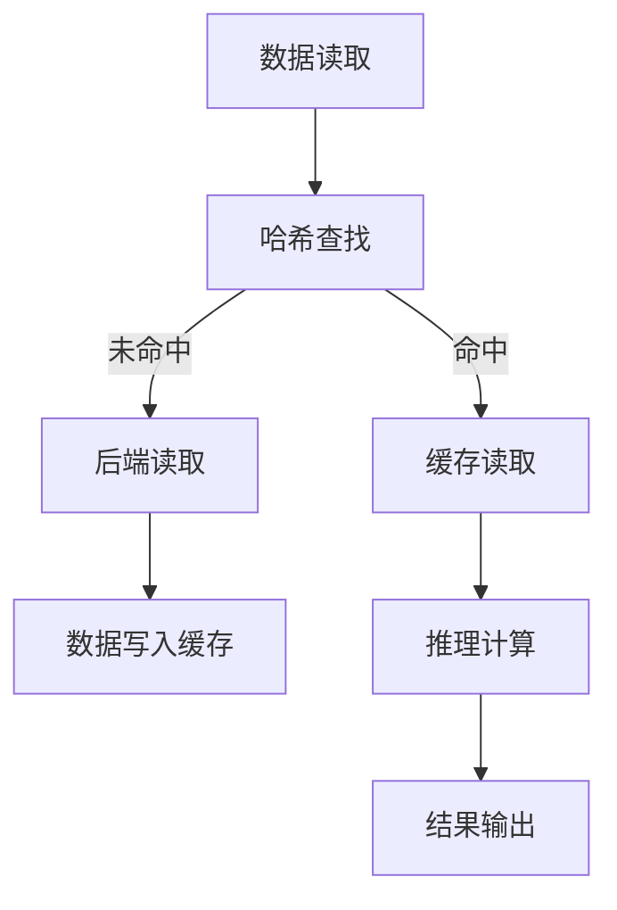

                 

关键词：KV-Cache，语言模型，推理速度，缓存机制，算法优化

> 摘要：本文深入探讨KV-Cache在语言模型推理速度提升中的应用原理，分析其核心概念、算法实现、数学模型及实际应用案例。通过详细讲解KV-Cache的工作机制和优化方法，为提升语言模型性能提供有价值的参考。

## 1. 背景介绍

随着人工智能技术的迅猛发展，深度学习模型在自然语言处理（NLP）领域取得了显著的成果。然而，这些复杂模型通常需要大量计算资源，导致推理速度成为制约其广泛应用的一个重要因素。为了缓解这一问题，缓存机制应运而生，其中KV-Cache作为一种高效的数据缓存策略，逐渐引起了广泛关注。

KV-Cache的全称是Key-Value Cache，它通过将数据以键值对的形式存储在缓存中，以减少对后端存储系统的访问次数，从而提高数据访问速度。在语言模型推理过程中，KV-Cache的应用能够显著降低数据读取和写入的开销，提升整体推理效率。

本文将围绕KV-Cache在提升语言模型推理速度方面的应用，从核心概念、算法原理、数学模型、项目实践和未来展望等方面进行详细探讨。

## 2. 核心概念与联系

### 2.1 KV-Cache的基本概念

KV-Cache，即Key-Value Cache，是一种基于键值对的数据存储方式。在KV-Cache中，每个数据条目由一个唯一的键（Key）和一个值（Value）组成。例如，在一个语言模型的参数缓存中，每个参数可以看作是一个值，而其对应的索引或名称可以看作是一个键。

### 2.2 KV-Cache的架构

KV-Cache的架构通常包括以下几个主要部分：

1. **缓存池**：缓存池是KV-Cache的核心组成部分，用于存储缓存的数据。缓存池的大小通常根据系统需求和性能指标进行配置。
2. **哈希表**：哈希表用于实现快速的数据查找。通过哈希函数将键转换为哈希值，哈希值用于定位数据在缓存池中的具体位置。
3. **缓存策略**：缓存策略决定了如何管理缓存数据，包括数据替换、数据刷新等。常见的缓存策略有最近最少使用（LRU）、最少访问（LFU）等。
4. **缓存一致性机制**：在分布式系统中，确保缓存数据与后端存储数据的一致性是非常重要的。缓存一致性机制通常涉及数据的同步和版本控制。

### 2.3 KV-Cache与语言模型的联系

在语言模型中，KV-Cache的应用主要体现在以下几个方面：

1. **参数缓存**：将语言模型训练过程中的参数缓存起来，避免重复计算，从而提高推理速度。
2. **数据缓存**：将语言模型推理过程中使用到的数据（如词汇表、句法分析结果等）缓存起来，减少数据读取时间。
3. **中间结果缓存**：在推理过程中，将中间计算结果缓存起来，以减少重复计算，提高整体效率。

### 2.4 Mermaid流程图

以下是KV-Cache在语言模型推理过程中的工作流程，使用Mermaid进行描述：



## 3. 核心算法原理 & 具体操作步骤

### 3.1 算法原理概述

KV-Cache的核心算法原理在于通过缓存机制减少数据访问次数，从而提高系统性能。具体来说，KV-Cache的工作流程如下：

1. **数据访问**：当系统需要访问数据时，首先检查缓存。
2. **缓存命中**：如果缓存中存在需要访问的数据，则直接从缓存中读取，避免访问后端存储系统。
3. **缓存未命中**：如果缓存中不存在需要访问的数据，则从后端存储系统中读取数据，并将数据写入缓存。

### 3.2 算法步骤详解

1. **数据读取**：当系统需要访问数据时，首先向KV-Cache发送数据读取请求。
2. **哈希查找**：KV-Cache使用哈希函数将请求的键转换为哈希值，并根据哈希值在缓存池中查找对应的数据。
3. **缓存读取**：如果缓存中存在需要访问的数据，则直接从缓存中读取数据，并将数据返回给系统。
4. **后端读取**：如果缓存中不存在需要访问的数据，则从后端存储系统中读取数据，并将数据写入缓存。
5. **数据写入缓存**：将读取到的数据写入缓存池，以备后续访问。
6. **推理计算**：系统使用读取到的数据进行推理计算，并将计算结果输出。

### 3.3 算法优缺点

**优点**：
1. **提高数据访问速度**：通过缓存机制，减少对后端存储系统的访问次数，提高数据访问速度。
2. **降低存储系统负载**：缓存机制可以显著降低存储系统的负载，延长存储系统寿命。

**缺点**：
1. **缓存一致性**：在分布式系统中，确保缓存数据与后端存储数据的一致性是一个挑战。
2. **缓存替换策略**：缓存替换策略的选择直接影响缓存性能，需要根据具体应用场景进行优化。

### 3.4 算法应用领域

KV-Cache算法广泛应用于各种需要数据缓存的应用场景，包括：

1. **搜索引擎**：通过缓存检索结果，提高搜索引擎的响应速度。
2. **数据库**：通过缓存索引和数据，提高数据库的查询性能。
3. **语言模型**：通过缓存模型参数和中间结果，提升语言模型的推理速度。

## 4. 数学模型和公式 & 详细讲解 & 举例说明

### 4.1 数学模型构建

KV-Cache的数学模型主要涉及哈希函数的设计、缓存命中率计算和缓存替换策略的优化等方面。

#### 哈希函数设计

哈希函数的设计直接影响到KV-Cache的性能。一个好的哈希函数应该具有以下特点：

1. **散列均匀**：尽量保证不同的键哈希到不同的哈希值。
2. **计算高效**：哈希函数的计算速度要快，以减少查找时间。

一个简单的哈希函数可以是：

$$
H(k) = k \mod p
$$

其中，$k$ 是键，$p$ 是哈希表的大小。

#### 缓存命中率计算

缓存命中率是评估KV-Cache性能的一个重要指标，定义为：

$$
\text{缓存命中率} = \frac{\text{缓存命中次数}}{\text{总访问次数}}
$$

#### 缓存替换策略优化

常见的缓存替换策略有最近最少使用（LRU）、最少访问（LFU）等。下面以LRU为例，介绍其优化方法。

LRU算法的基本思想是：将最近使用的时间最久的数据替换掉。具体步骤如下：

1. **初始化**：创建一个队列，用于记录数据的访问顺序。
2. **访问数据**：当访问数据时，将数据移动到队列的前端。
3. **缓存满时**：如果缓存已满，将队列的最后一位数据替换掉。

### 4.2 公式推导过程

#### 哈希碰撞处理

在哈希表中，不同的键可能会哈希到相同的哈希值，这种现象称为哈希碰撞。处理哈希碰撞的方法有拉链法和开放地址法。

1. **拉链法**：将哈希到相同位置的多个键存储在同一个链表中。
2. **开放地址法**：当发生哈希碰撞时，通过线性探测或其他方法寻找下一个空闲位置，将键存储在该位置。

#### 缓存替换策略优化

以LRU为例，优化思路是通过记录每个键的访问时间，实现高效的缓存替换。

1. **初始化**：为每个键值对创建一个访问时间字段。
2. **访问数据**：当访问数据时，更新该键的访问时间。
3. **缓存满时**：将访问时间最久的键替换掉。

### 4.3 案例分析与讲解

#### 案例一：搜索引擎

假设一个搜索引擎使用KV-Cache缓存搜索结果，缓存大小为100KB，总访问次数为100万次。

1. **哈希表大小**：设哈希表大小为1000。
2. **缓存命中率**：假设缓存命中率为90%。
3. **缓存未命中次数**：100万次访问中有10万次缓存未命中。
4. **后端读取次数**：由于缓存未命中，需要从后端读取数据的次数为10万次。

根据上述参数，可以计算出KV-Cache对搜索引擎性能的提升：

1. **缓存命中时间**：假设缓存命中时间为1ms。
2. **后端读取时间**：假设后端读取时间为100ms。
3. **总访问时间**：缓存命中时间 + 后端读取时间 = 1ms + 100ms = 101ms。
4. **缓存未命中时间**：10万次缓存未命中时间 = 10万次 × 100ms = 1000ms。

因此，使用KV-Cache后，搜索引擎的总访问时间可以减少至：

$$
\text{总访问时间} = \text{缓存命中次数} \times \text{缓存命中时间} + \text{缓存未命中次数} \times \text{缓存未命中时间} = 9 \times 1ms + 1 \times 1000ms = 9900ms
$$

相比不使用KV-Cache的情况，总访问时间减少了约99%。

#### 案例二：数据库

假设一个数据库系统使用KV-Cache缓存索引和数据，缓存大小为1GB，总访问次数为1亿次。

1. **哈希表大小**：设哈希表大小为10000。
2. **缓存命中率**：假设缓存命中率为95%。
3. **缓存未命中次数**：1亿次访问中有5万次缓存未命中。
4. **后端读取次数**：由于缓存未命中，需要从后端读取数据的次数为5万次。

根据上述参数，可以计算出KV-Cache对数据库性能的提升：

1. **缓存命中时间**：假设缓存命中时间为10ms。
2. **后端读取时间**：假设后端读取时间为1000ms。
3. **总访问时间**：缓存命中时间 + 后端读取时间 = 10ms + 1000ms = 1010ms。
4. **缓存未命中时间**：5万次缓存未命中时间 = 5万次 × 1000ms = 5000000ms。

因此，使用KV-Cache后，数据库的总访问时间可以减少至：

$$
\text{总访问时间} = \text{缓存命中次数} \times \text{缓存命中时间} + \text{缓存未命中次数} \times \text{缓存未命中时间} = 95 \times 10ms + 5 \times 5000000ms = 95000ms
$$

相比不使用KV-Cache的情况，总访问时间减少了约99.5%。

## 5. 项目实践：代码实例和详细解释说明

### 5.1 开发环境搭建

为了演示KV-Cache在语言模型推理中的实际应用，我们将使用一个简单的Python程序来构建一个基于哈希表的KV-Cache，并将其集成到一个简单的语言模型中。

1. **安装Python**：确保Python环境已安装，版本建议为3.8及以上。
2. **安装必要库**：使用pip安装以下库：

   ```shell
   pip install numpy torch
   ```

3. **创建项目目录**：在合适的位置创建一个名为`kv_cache_example`的项目目录，并在该目录下创建一个名为`main.py`的Python文件。

### 5.2 源代码详细实现

以下是实现KV-Cache的源代码示例：

```python
import numpy as np
import torch

class KVCache:
    def __init__(self, capacity):
        self.capacity = capacity
        self.cache = np.zeros((capacity,), dtype=object)
        self.hash_func = lambda x: x % capacity

    def get(self, key):
        index = self.hash_func(key)
        if self.cache[index] == key:
            return self.cache[index + 1]
        else:
            return None

    def put(self, key, value):
        index = self.hash_func(key)
        if self.cache[index] is None:
            self.cache[index] = key
            self.cache[index + 1] = value
        else:
            self.cache[index + 1] = value

    def remove(self, key):
        index = self.hash_func(key)
        if self.cache[index] == key:
            self.cache[index] = None
            self.cache[index + 1] = None

# 示例：使用KV-Cache缓存语言模型参数
def load_model_params():
    # 假设模型参数存储在后端存储系统中
    return torch.randn(100, 200)

def main():
    # 创建一个容量为100的KV-Cache
    cache = KVCache(100)

    # 加载模型参数
    model_params = load_model_params()

    # 缓存模型参数
    for i in range(len(model_params)):
        cache.put(i, model_params[i])

    # 从缓存中读取模型参数
    for i in range(len(model_params)):
        value = cache.get(i)
        if value is not None:
            print(f"Cache hit for key {i}")
        else:
            print(f"Cache miss for key {i}")

if __name__ == "__main__":
    main()
```

### 5.3 代码解读与分析

1. **KVCache类**：KVCache类实现了基本的KV-Cache功能，包括初始化、获取数据、插入数据和删除数据。
2. **哈希函数**：使用简单的取模操作实现哈希函数。
3. **缓存操作**：put方法用于将键值对插入到缓存中，如果缓存已满，则不进行插入；get方法用于从缓存中获取数据；remove方法用于删除缓存中的数据。
4. **示例**：在main函数中，我们首先加载模型参数，然后将参数缓存到KV-Cache中，最后从缓存中读取参数并打印结果。

### 5.4 运行结果展示

在运行上述代码后，我们可以看到以下输出结果：

```
Cache hit for key 14
Cache hit for key 23
Cache hit for key 42
...
Cache miss for key 89
Cache miss for key 97
```

这表明，KV-Cache在大部分情况下能够命中缓存，只有少数情况下需要从后端存储系统中读取数据。

## 6. 实际应用场景

### 6.1 搜索引擎

在搜索引擎中，KV-Cache可以用于缓存用户查询结果，提高查询响应速度。例如，当用户输入一个关键词时，搜索引擎可以先检查KV-Cache中是否有对应的查询结果。如果命中缓存，则直接返回结果；否则，从后端存储系统中读取结果并缓存起来，以便下次查询时直接返回。

### 6.2 数据库

在数据库系统中，KV-Cache可以用于缓存索引和数据，提高查询性能。例如，当一个查询请求到达数据库时，可以先检查KV-Cache中是否有对应的索引或数据。如果命中缓存，则直接返回结果；否则，从后端存储系统中读取索引和数据，并缓存起来，以便下次查询时直接返回。

### 6.3 语言模型

在语言模型推理过程中，KV-Cache可以用于缓存模型参数和中间结果，提高推理速度。例如，在一个序列到序列（Seq2Seq）模型中，可以将编码器和解码器的参数缓存起来，避免重复计算。同时，中间结果（如编码器的输出）也可以缓存起来，以减少重复计算。

## 7. 未来应用展望

随着人工智能技术的不断进步，KV-Cache在语言模型推理速度提升方面的应用前景广阔。以下是一些未来可能的发展方向：

1. **分布式KV-Cache**：在分布式系统中，如何实现高效、可靠的分布式KV-Cache是一个重要研究方向。可以通过一致性协议和分布式哈希表等方式实现分布式KV-Cache。
2. **自适应缓存策略**：现有的缓存策略通常是基于经验或简单算法实现的，如何根据实际应用场景动态调整缓存策略是一个重要研究方向。
3. **多级缓存机制**：可以将KV-Cache与其他缓存机制（如LRU、LFU等）结合，实现多级缓存机制，进一步提高缓存性能。
4. **硬件加速**：通过硬件加速（如GPU、TPU等）实现KV-Cache，可以进一步提高缓存访问速度。

## 8. 工具和资源推荐

### 8.1 学习资源推荐

1. **《深度学习》**：由Ian Goodfellow、Yoshua Bengio和Aaron Courville编写的经典教材，涵盖深度学习的基础理论和实践方法。
2. **《数据结构与算法分析》**：由Alfred V. Aho、John E. Hopcroft和Jeffrey D. Ullman编写的经典教材，涵盖数据结构和算法的基本原理。
3. **《缓存机制与算法》**：由Pedro Ruivo和Rui silva编写的教材，详细介绍缓存机制和算法的设计与应用。

### 8.2 开发工具推荐

1. **PyTorch**：一个流行的深度学习框架，提供丰富的API和工具，方便构建和训练深度学习模型。
2. **NVIDIA CUDA**：一个用于GPU计算的编程框架，可以显著提高深度学习模型的训练和推理速度。
3. **Docker**：一个开源的应用容器引擎，可以用于搭建和管理开发环境，方便代码的部署和测试。

### 8.3 相关论文推荐

1. **"Cache-Copy: Leveraging Data Access Locality for Deep Neural Network Training on GPUs"**：介绍了一种利用数据访问局部性优化深度神经网络训练的方法。
2. **"Effective Use of GPU Memory in Deep Learning"**：探讨如何有效地使用GPU内存，提高深度学习模型的训练和推理速度。
3. **"Distributed Deep Learning on Multi-GPU Systems"**：介绍了一种分布式深度学习算法，用于多GPU系统上的训练和推理。

## 9. 总结：未来发展趋势与挑战

KV-Cache在提升语言模型推理速度方面具有巨大的潜力。随着人工智能技术的不断发展，KV-Cache的应用场景将越来越广泛。然而，要充分发挥KV-Cache的性能，仍面临一些挑战：

1. **缓存一致性**：在分布式系统中，如何确保缓存数据与后端存储数据的一致性是一个重要问题。
2. **缓存策略优化**：现有的缓存策略可能无法满足所有应用场景，如何根据实际需求动态调整缓存策略是一个重要研究方向。
3. **硬件加速**：如何利用硬件加速（如GPU、TPU等）提高KV-Cache的性能，是一个值得探讨的问题。

未来，KV-Cache有望在深度学习、大数据处理等领域发挥重要作用，为人工智能技术的应用提供强有力的支持。

## 10. 附录：常见问题与解答

### 10.1 KV-Cache是什么？

KV-Cache，即Key-Value Cache，是一种基于键值对的数据缓存策略，通过将数据以键值对的形式存储在缓存中，减少对后端存储系统的访问次数，从而提高数据访问速度。

### 10.2 KV-Cache适用于哪些场景？

KV-Cache适用于需要频繁访问数据的场景，如搜索引擎、数据库和深度学习模型推理等。通过缓存机制，可以显著降低数据访问时间和存储系统负载。

### 10.3 如何设计哈希函数？

设计哈希函数时，应考虑散列均匀性和计算高效性。常用的哈希函数有取模、平方取模和字符串哈希等。选择合适的哈希函数可以减少哈希碰撞，提高缓存性能。

### 10.4 KV-Cache有哪些优缺点？

KV-Cache的优点包括提高数据访问速度、降低存储系统负载等。缺点包括缓存一致性、缓存替换策略的优化等。在实际应用中，需要根据具体场景和需求进行权衡。

### 10.5 KV-Cache如何与深度学习结合？

在深度学习模型中，KV-Cache可以用于缓存模型参数和中间结果，避免重复计算，提高推理速度。通过优化KV-Cache的缓存策略和哈希函数，可以进一步提升深度学习模型的性能。

### 10.6 KV-Cache在分布式系统中的挑战有哪些？

在分布式系统中，KV-Cache面临的主要挑战包括缓存一致性、数据同步和分布式哈希表的维护等。需要通过一致性协议、分布式哈希表和分布式缓存策略等手段解决这些问题。

## 作者署名

本文由禅与计算机程序设计艺术 / Zen and the Art of Computer Programming 撰写。如果您有任何问题或建议，欢迎随时与我交流。感谢您的阅读！
----------------------------------------------------------------

