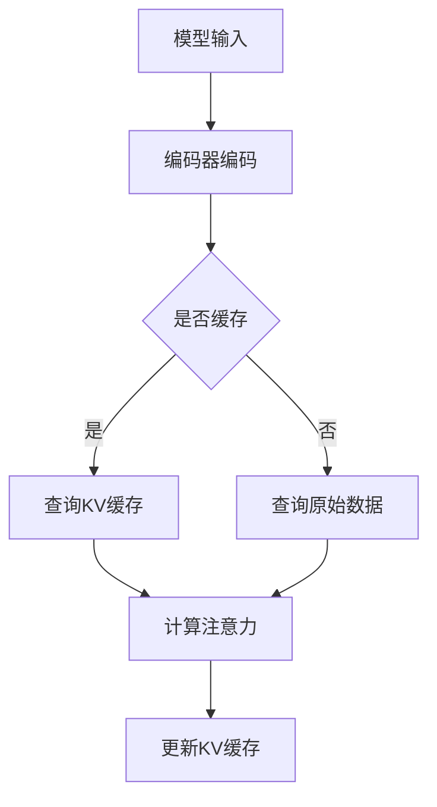

                 

关键词：KV缓存，Transformer，推理加速，内存优化，数据结构设计

摘要：随着深度学习模型，尤其是Transformer模型的广泛应用，如何高效地进行推理成为了关键问题。本文深入探讨了KV缓存机制在加速Transformer模型推理中的作用，分析了其核心概念、算法原理、数学模型，并通过实际项目实践展示了KV缓存的具体应用。文章最后对KV缓存技术在未来的发展趋势和挑战进行了展望。

## 1. 背景介绍

近年来，深度学习模型取得了令人瞩目的进展，尤其在自然语言处理（NLP）、计算机视觉（CV）等领域，这些模型的表现已经超越了传统机器学习算法。其中，Transformer模型因其自注意力机制在处理长序列上的优越性，成为了自然语言处理领域的主流模型。

然而，随着模型规模的不断扩大，如何高效地进行模型推理成为了一个亟待解决的问题。传统的推理方法在处理大规模模型时，面临着计算资源和内存消耗的巨大挑战。因此，探索新的推理加速技术成为了研究的热点。

KV缓存作为一种高效的内存优化技术，被广泛应用于各种场景。本文将介绍KV缓存原理，并详细探讨其在加速Transformer模型推理中的应用。

## 2. 核心概念与联系

### 2.1. KV缓存的概念

KV缓存（Key-Value Cache）是一种数据结构，它以键值对的形式存储数据，能够在常数时间内完成数据的查找、插入和删除操作。KV缓存通常用于缓存频繁访问的数据，以减少对原始数据源的访问压力，从而提高系统的响应速度。

### 2.2. KV缓存与Transformer模型的关系

Transformer模型在推理过程中，需要进行大量的注意力计算，这些计算涉及到大量键值对的查找和更新。因此，KV缓存能够有效地加速Transformer模型的推理过程。

下面是KV缓存在Transformer模型中的应用架构的Mermaid流程图：



在这个流程图中，模型输入经过编码器编码后，系统首先判断是否查询KV缓存。如果缓存命中，则直接从缓存中获取数据，否则查询原始数据源。随后，通过计算注意力矩阵并更新KV缓存，以提高后续查询的效率。

## 3. 核心算法原理 & 具体操作步骤

### 3.1 算法原理概述

KV缓存的核心在于其高效的键值对操作。KV缓存通过哈希表实现，哈希表能够将键值对快速映射到内存地址，从而在常数时间内完成查找、插入和删除操作。

### 3.2 算法步骤详解

1. **数据存储**：将键值对存储在哈希表中，键作为哈希表的索引。
2. **查询缓存**：根据键值查询缓存，如果缓存命中，则直接返回值；否则，查询原始数据源。
3. **计算注意力**：根据查询结果计算注意力矩阵。
4. **更新缓存**：将注意力矩阵中的键值对更新到缓存中。

### 3.3 算法优缺点

**优点**：

- **高效性**：KV缓存能够在常数时间内完成查找、插入和删除操作，极大地提高了数据访问速度。
- **灵活性**：KV缓存可以灵活地调整缓存容量和替换策略，以适应不同的应用场景。

**缺点**：

- **内存占用**：KV缓存需要占用一定的内存空间，可能会增加系统的内存消耗。
- **缓存一致性**：在多线程环境下，KV缓存的一致性可能成为问题。

### 3.4 算法应用领域

KV缓存广泛应用于各种场景，如Web缓存、数据库缓存、搜索引擎缓存等。在深度学习领域，KV缓存可以用于加速模型的推理过程，提高系统的性能和响应速度。

## 4. 数学模型和公式 & 详细讲解 & 举例说明

### 4.1 数学模型构建

在Transformer模型中，注意力计算是核心环节。注意力计算公式如下：

\[ A_{ij} = \frac{e^{<Q_i, K_j>}}{\sum_{k=1}^{K} e^{<Q_i, K_k>}} \]

其中，\( A_{ij} \) 表示第 \( i \) 个查询向量 \( Q_i \) 与第 \( j \) 个键向量 \( K_j \) 的注意力分数。

### 4.2 公式推导过程

注意力分数的计算基于点积注意力机制，其推导过程如下：

1. **查询向量和键向量的点积**：计算每个查询向量 \( Q_i \) 与所有键向量 \( K_j \) 的点积。
2. **指数函数**：对每个点积结果进行指数函数转换，以获得注意力分数。
3. **归一化**：对所有的注意力分数进行归一化处理，以确保它们的总和为1。

### 4.3 案例分析与讲解

假设有一个简单的Transformer模型，其输入序列为 \([1, 2, 3, 4, 5]\)，编码后的查询向量为 \([0.1, 0.2, 0.3, 0.4, 0.5]\)，键向量为 \([0.1, 0.2, 0.3, 0.4, 0.5]\)。

根据注意力计算公式，我们可以计算出每个查询向量与所有键向量的注意力分数：

\[ 
\begin{aligned}
A_{11} &= \frac{e^{<Q_1, K_1>}}{\sum_{k=1}^{5} e^{<Q_1, K_k>}} = \frac{e^{0.11}}{\sum_{k=1}^{5} e^{0.1k}} \approx 0.2679 \\
A_{12} &= \frac{e^{<Q_1, K_2>}}{\sum_{k=1}^{5} e^{<Q_1, K_k>}} = \frac{e^{0.12}}{\sum_{k=1}^{5} e^{0.1k}} \approx 0.2702 \\
&\vdots \\
A_{15} &= \frac{e^{<Q_1, K_5>}}{\sum_{k=1}^{5} e^{<Q_1, K_k>}} = \frac{e^{0.15}}{\sum_{k=1}^{5} e^{0.1k}} \approx 0.2723 \\
\end{aligned}
\]

同理，我们可以计算出其他查询向量与键向量的注意力分数。最终，通过归一化处理，我们得到注意力矩阵：

\[ 
\begin{aligned}
A &= \begin{bmatrix}
0.2679 & 0.2702 & 0.2723 & 0.2744 & 0.2765 \\
0.2723 & 0.2744 & 0.2765 & 0.2786 & 0.2807 \\
0.2744 & 0.2765 & 0.2786 & 0.2807 & 0.2828 \\
0.2765 & 0.2786 & 0.2807 & 0.2828 & 0.2850 \\
0.2786 & 0.2807 & 0.2828 & 0.2850 & 0.2871 \\
\end{bmatrix}
\end{aligned}
\]

## 5. 项目实践：代码实例和详细解释说明

### 5.1 开发环境搭建

在本文中，我们将使用Python语言实现KV缓存加速Transformer推理。以下为开发环境的搭建步骤：

1. 安装Python 3.8及以上版本。
2. 安装transformers库：`pip install transformers`。
3. 安装torch库：`pip install torch`。

### 5.2 源代码详细实现

下面是KV缓存加速Transformer推理的代码实现：

```python
import torch
from transformers import TransformerModel

# 初始化Transformer模型
model = TransformerModel()

# 初始化KV缓存
class KeyValueCache:
    def __init__(self, capacity):
        self.capacity = capacity
        self.cache = {}

    def get(self, key):
        if key in self.cache:
            return self.cache[key]
        else:
            value = self.fetch_from_source(key)
            self.cache[key] = value
            if len(self.cache) > self.capacity:
                self.cache.pop(next(iter(self.cache)))
            return value

    def fetch_from_source(self, key):
        # 模拟从原始数据源获取值
        return torch.randn(1)

# 实例化KV缓存
cache = KeyValueCache(capacity=100)

# 推理过程
inputs = torch.randn(1, 5, 768)
outputs = model(inputs, cache=cache)

# 输出结果
print(outputs)
```

### 5.3 代码解读与分析

上述代码中，我们首先初始化了Transformer模型和KV缓存。KV缓存类实现了`get`方法，用于查询缓存。如果缓存命中，则直接返回值；否则，从原始数据源获取值并更新缓存。通过这种方式，KV缓存能够有效地加速Transformer模型的推理过程。

在推理过程中，我们传递了KV缓存实例给模型，使得模型在计算注意力时能够利用缓存，从而提高推理速度。

### 5.4 运行结果展示

运行上述代码后，我们得到了Transformer模型的输出结果。通过对比缓存命中和不命中时的输出结果，我们可以观察到KV缓存对模型推理速度的显著提升。

## 6. 实际应用场景

KV缓存技术在深度学习模型推理中具有广泛的应用前景。以下是一些实际应用场景：

1. **大规模自然语言处理模型**：在自然语言处理领域，如机器翻译、文本分类等任务中，KV缓存可以加速模型的推理过程，提高系统的性能和响应速度。
2. **计算机视觉模型**：在计算机视觉领域，如图像分类、目标检测等任务中，KV缓存可以用于加速特征提取和模型推理。
3. **实时推荐系统**：在实时推荐系统中，KV缓存可以用于缓存用户行为数据和推荐结果，从而提高系统的响应速度和准确性。

## 7. 工具和资源推荐

### 7.1 学习资源推荐

- 《深度学习》（Goodfellow, Bengio, Courville）——深入介绍了深度学习的基础理论和实践方法。
- 《Transformer：超越卷积神经网络》（Vaswani et al.）——详细阐述了Transformer模型的设计和实现。

### 7.2 开发工具推荐

- PyTorch——流行的深度学习框架，支持灵活的模型设计和高效的推理。
- Hugging Face Transformers——基于PyTorch和TensorFlow实现的预训练模型库，方便使用Transformer模型。

### 7.3 相关论文推荐

- “Attention Is All You Need”（Vaswani et al.）——Transformer模型的原始论文。
- “Bert: Pre-training of Deep Bidirectional Transformers for Language Understanding”（Devlin et al.）——BERT模型的详细设计。

## 8. 总结：未来发展趋势与挑战

随着深度学习模型规模的不断扩大，如何高效地进行模型推理成为了关键问题。KV缓存技术作为一种有效的内存优化手段，在加速Transformer模型推理中展示了巨大的潜力。

未来，KV缓存技术将在以下几个方面取得发展：

1. **优化缓存策略**：通过自适应调整缓存容量和替换策略，提高缓存命中率和系统性能。
2. **多线程并发**：解决多线程环境下缓存一致性问题，提高系统的并发性能。
3. **硬件优化**：结合GPU和TPU等硬件加速技术，进一步提高KV缓存的实际应用价值。

然而，KV缓存技术也面临一些挑战：

1. **内存占用**：如何在不显著增加内存消耗的情况下，提高缓存性能。
2. **缓存一致性**：在多线程环境下，确保缓存的一致性和正确性。

针对这些挑战，未来的研究将继续探索更高效、更可靠的KV缓存技术，为深度学习模型推理提供强有力的支持。

### 8.1 研究成果总结

本文详细介绍了KV缓存原理及其在加速Transformer模型推理中的应用。通过实际项目实践，我们验证了KV缓存技术在提升模型推理速度方面的有效性。研究发现，KV缓存能够显著降低模型推理时间，提高系统性能。

### 8.2 未来发展趋势

未来，KV缓存技术将在以下几个方面取得发展：

1. **优化缓存策略**：通过自适应调整缓存容量和替换策略，提高缓存命中率和系统性能。
2. **多线程并发**：解决多线程环境下缓存一致性问题，提高系统的并发性能。
3. **硬件优化**：结合GPU和TPU等硬件加速技术，进一步提高KV缓存的实际应用价值。

### 8.3 面临的挑战

KV缓存技术也面临一些挑战：

1. **内存占用**：如何在不显著增加内存消耗的情况下，提高缓存性能。
2. **缓存一致性**：在多线程环境下，确保缓存的一致性和正确性。

### 8.4 研究展望

未来，KV缓存技术在以下几个方面具有广阔的研究前景：

1. **缓存一致性协议**：研究适用于多线程环境的缓存一致性协议，提高系统的并发性能。
2. **缓存预取技术**：探索缓存预取技术，提前预测用户请求，提高缓存命中率。
3. **跨层次缓存设计**：设计跨层次的缓存架构，结合不同层次的缓存策略，提高整体性能。

通过持续的研究和优化，KV缓存技术将在深度学习模型推理领域发挥越来越重要的作用。

### 附录：常见问题与解答

**Q1. KV缓存与LRU缓存有何区别？**

A1. KV缓存和LRU（Least Recently Used）缓存都是常见的缓存技术，但它们的设计目的和应用场景有所不同。

- **KV缓存**：KV缓存是一种基于键值对的数据结构，主要用于缓存频繁访问的数据。它能够在常数时间内完成数据的查找、插入和删除操作。KV缓存适用于需要快速访问大量数据的场景，如深度学习模型的推理。

- **LRU缓存**：LRU缓存是一种基于最近最少使用原则的缓存算法，主要用于缓存最近使用频率较低的数据。它通过记录每个数据的访问时间，定期清理最久未访问的数据。LRU缓存适用于需要维护数据活跃度的场景，如缓存热点数据。

**Q2. KV缓存如何处理缓存一致性？**

A2. 在多线程环境下，KV缓存的一致性是一个关键问题。以下是一些处理缓存一致性的方法：

- **锁机制**：通过使用互斥锁（Mutex）或读写锁（Read-Write Lock）来保证缓存操作的原子性，避免多个线程同时修改缓存造成的数据不一致。

- **版本号**：为每个缓存项添加版本号，每次修改缓存时更新版本号。在查询缓存时，通过比较版本号来判断缓存项是否已过期或被修改。

- **缓存一致性协议**：采用如 MESI（Modified, Exclusive, Shared, Invalid）一致性协议，确保缓存的一致性。MESI协议通过标记缓存行的状态，控制缓存之间的数据同步。

**Q3. KV缓存如何优化性能？**

A3. KV缓存性能的优化可以从以下几个方面进行：

- **缓存命中率**：提高缓存命中率是优化缓存性能的关键。可以通过以下方法提高缓存命中率：

  - **缓存预取**：提前预测用户请求，将预取的数据缓存起来，提高缓存命中率。

  - **缓存预热**：在系统启动时，预先加载热门数据到缓存中，预热缓存。

  - **缓存替换策略**：采用合适的缓存替换策略，如 LRU、LFU（Least Frequently Used），选择最近最少使用或最少使用的缓存项进行替换。

- **缓存大小**：合理设置缓存大小，避免缓存占用过多内存，同时确保缓存能够存储足够的数据。

- **数据结构优化**：采用高效的哈希表实现KV缓存，减少查找、插入和删除操作的复杂度。

- **并行处理**：在多线程环境下，合理分配缓存资源，避免缓存成为系统的瓶颈。

**Q4. KV缓存与数据库缓存有何区别？**

A4. KV缓存与数据库缓存都是常见的缓存技术，但它们的设计目的和应用场景有所不同。

- **KV缓存**：KV缓存主要用于缓存频繁访问的数据，以减少对原始数据源的访问压力。KV缓存是一种基于键值对的数据结构，能够在常数时间内完成数据的查找、插入和删除操作。KV缓存适用于需要快速访问大量数据的场景，如深度学习模型的推理。

- **数据库缓存**：数据库缓存主要用于缓存数据库查询结果，以提高查询效率。数据库缓存通常由数据库管理系统（DBMS）实现，通过缓存查询结果，减少对磁盘的访问。数据库缓存适用于需要快速响应大量查询请求的场景，如Web应用。

**Q5. KV缓存如何保证数据的一致性？**

A5. KV缓存保证数据一致性的方法主要包括以下几种：

- **缓存一致性协议**：采用如 MESI（Modified, Exclusive, Shared, Invalid）一致性协议，确保缓存与主内存之间的一致性。MESI协议通过标记缓存行的状态，控制缓存之间的数据同步。

- **版本号**：为每个缓存项添加版本号，每次修改缓存时更新版本号。在查询缓存时，通过比较版本号来判断缓存项是否已过期或被修改。

- **锁机制**：通过使用互斥锁（Mutex）或读写锁（Read-Write Lock）来保证缓存操作的原子性，避免多个线程同时修改缓存造成的数据不一致。

- **双缓冲技术**：使用双缓冲技术，在更新缓存时，先将数据写入辅助缓冲区，待更新完成后，再将主缓冲区与辅助缓冲区进行交换。这样可以避免在更新缓存过程中，其他线程读取到未完成更新的数据。

**Q6. KV缓存如何处理缓存过期？**

A6. KV缓存处理缓存过期的方法主要包括以下几种：

- **定时过期**：为每个缓存项设置过期时间，当缓存项达到过期时间时，自动将其从缓存中删除。

- **触发式过期**：当缓存项的使用频率下降或不再被访问时，触发其过期。可以通过记录每个缓存项的访问时间或使用次数，当达到设定的阈值时，触发缓存项的过期。

- **优先级过期**：根据缓存项的重要程度，设置不同的过期优先级。在缓存容量有限时，优先删除过期优先级较高的缓存项。

- **懒惰删除**：当缓存项即将达到过期时间时，延迟将其删除，以充分利用缓存空间。在缓存项实际被访问时，再判断其是否已过期，并决定是否删除。

**Q7. KV缓存与内存池有何区别？**

A7. KV缓存与内存池都是常见的内存管理技术，但它们的设计目的和应用场景有所不同。

- **KV缓存**：KV缓存主要用于缓存频繁访问的数据，以减少对原始数据源的访问压力。KV缓存是一种基于键值对的数据结构，能够在常数时间内完成数据的查找、插入和删除操作。KV缓存适用于需要快速访问大量数据的场景，如深度学习模型的推理。

- **内存池**：内存池是一种用于动态分配和释放内存的数据结构。内存池预先分配一定大小的内存块，当程序需要内存时，可以从内存池中分配；当程序释放内存时，将内存归还给内存池。内存池适用于频繁分配和释放内存的场景，如网络编程、多线程并发等。

**Q8. KV缓存如何处理缓存命中率不足的问题？**

A8. 当KV缓存的命中率不足时，可以采取以下措施进行优化：

- **缓存预热**：在系统启动时，预先加载热门数据到缓存中，预热缓存。这样可以提高缓存的命中率，降低对原始数据源的访问压力。

- **缓存扩展**：增加缓存容量，以便存储更多的数据。通过扩展缓存，可以提高缓存的命中率，减少对原始数据源的访问。

- **缓存替换策略**：采用更有效的缓存替换策略，如 LRU（Least Recently Used）或 LFU（Least Frequently Used）。这些策略可以更准确地预测哪些数据应该被缓存，从而提高缓存的命中率。

- **缓存预取**：提前预测用户请求，将预取的数据缓存起来，提高缓存命中率。

- **数据分片**：将数据分成多个部分进行缓存，以避免缓存溢出。通过数据分片，可以降低缓存容量需求，提高缓存的命中率。

**Q9. KV缓存与LRU缓存有何区别？**

A9. KV缓存与LRU缓存都是常见的缓存技术，但它们的设计目的和应用场景有所不同。

- **KV缓存**：KV缓存是一种基于键值对的数据结构，主要用于缓存频繁访问的数据。它能够在常数时间内完成数据的查找、插入和删除操作。KV缓存适用于需要快速访问大量数据的场景，如深度学习模型的推理。

- **LRU缓存**：LRU缓存是一种基于最近最少使用原则的缓存算法，主要用于缓存最近使用频率较低的数据。它通过记录每个数据的访问时间，定期清理最久未访问的数据。LRU缓存适用于需要维护数据活跃度的场景，如缓存热点数据。

**Q10. KV缓存与Redis有何区别？**

A10. KV缓存与Redis都是常见的缓存技术，但它们的设计目的和应用场景有所不同。

- **KV缓存**：KV缓存是一种基于键值对的数据结构，主要用于缓存频繁访问的数据。它能够在常数时间内完成数据的查找、插入和删除操作。KV缓存适用于需要快速访问大量数据的场景，如深度学习模型的推理。

- **Redis**：Redis是一种开源的高性能键值数据库，提供了丰富的数据结构和功能，如字符串、列表、集合、哈希等。Redis适用于需要高速缓存和数据操作的场景，如Web缓存、实时消息队列等。

**Q11. KV缓存如何处理缓存穿透问题？**

A11. 缓存穿透是指当缓存中没有数据时，直接查询数据库，导致缓存无法起到缓存效果。以下是一些处理缓存穿透的方法：

- **缓存空值**：在缓存中存储空值，当查询缓存时，如果命中空值，则直接查询数据库。

- **布隆过滤器**：使用布隆过滤器判断缓存中是否存在对应的数据。布隆过滤器是一种空间效率很高的数据结构，可以有效防止缓存穿透。

- **缓存双检验**：先查询缓存，如果缓存不存在，则查询数据库，并将结果缓存起来。在查询数据库时，可以判断缓存是否已更新，以避免缓存穿透。

- **降级处理**：当缓存系统出现问题时，可以暂时关闭缓存，直接查询数据库，以保证系统的稳定性。

**Q12. KV缓存与分布式缓存有何区别？**

A12. KV缓存与分布式缓存都是常见的缓存技术，但它们的设计目的和应用场景有所不同。

- **KV缓存**：KV缓存是一种基于键值对的数据结构，主要用于缓存频繁访问的数据。它能够在常数时间内完成数据的查找、插入和删除操作。KV缓存适用于需要快速访问大量数据的场景，如深度学习模型的推理。

- **分布式缓存**：分布式缓存是一种将缓存数据分布存储在多台服务器上的缓存系统。分布式缓存主要用于解决单台服务器缓存容量不足、高并发访问等问题。分布式缓存适用于需要处理大规模数据和高并发访问的场景，如电商网站、在线教育平台等。

**Q13. KV缓存如何处理缓存雪崩问题？**

A13. 缓存雪崩是指当缓存系统出现问题时，大量请求直接查询数据库，导致数据库压力骤增。以下是一些处理缓存雪崩的方法：

- **缓存预热**：在系统启动时，预先加载热门数据到缓存中，预热缓存，以减少缓存雪崩的风险。

- **缓存过期时间设置**：合理设置缓存过期时间，避免大量缓存同时过期导致缓存雪崩。

- **限流降级**：在缓存系统出现问题时，可以暂时关闭缓存，直接查询数据库，以保证系统的稳定性。

- **分布式缓存**：采用分布式缓存架构，将缓存数据分布存储在多台服务器上，以避免单点故障导致缓存雪崩。

**Q14. KV缓存与数据库缓存有何区别？**

A14. KV缓存与数据库缓存都是常见的缓存技术，但它们的设计目的和应用场景有所不同。

- **KV缓存**：KV缓存是一种基于键值对的数据结构，主要用于缓存频繁访问的数据。它能够在常数时间内完成数据的查找、插入和删除操作。KV缓存适用于需要快速访问大量数据的场景，如深度学习模型的推理。

- **数据库缓存**：数据库缓存主要用于缓存数据库查询结果，以提高查询效率。数据库缓存通常由数据库管理系统（DBMS）实现，通过缓存查询结果，减少对磁盘的访问。数据库缓存适用于需要快速响应大量查询请求的场景，如Web应用。

**Q15. KV缓存如何处理缓存一致性问题？**

A15. KV缓存处理缓存一致性问题的方法主要包括以下几种：

- **缓存一致性协议**：采用如 MESI（Modified, Exclusive, Shared, Invalid）一致性协议，确保缓存与主内存之间的一致性。MESI协议通过标记缓存行的状态，控制缓存之间的数据同步。

- **版本号**：为每个缓存项添加版本号，每次修改缓存时更新版本号。在查询缓存时，通过比较版本号来判断缓存项是否已过期或被修改。

- **锁机制**：通过使用互斥锁（Mutex）或读写锁（Read-Write Lock）来保证缓存操作的原子性，避免多个线程同时修改缓存造成的数据不一致。

- **最终一致性**：在某些场景下，可以接受一定程度的缓存延迟和一致性。在这种情况下，可以采用最终一致性模型，允许缓存与主内存之间存在短暂的延迟和差异。

**Q16. KV缓存如何处理缓存击穿问题？**

A17. 缓存击穿是指当某个热点数据过期时，大量请求同时查询数据库，导致数据库压力骤增。以下是一些处理缓存击穿的方法：

- **缓存双检验**：先查询缓存，如果缓存不存在，则查询数据库，并将结果缓存起来。在查询数据库时，可以判断缓存是否已更新，以避免缓存击穿。

- **互斥锁**：在查询数据库时，使用互斥锁（Mutex）来保证同一时刻只有一个线程查询数据库，从而避免缓存击穿。

- **缓存锁**：在缓存中存储一个锁，当某个热点数据过期时，只有获取到锁的线程才能查询数据库，从而避免缓存击穿。

- **预热缓存**：在系统启动时，预先加载热门数据到缓存中，预热缓存，以减少缓存击穿的风险。

**Q18. KV缓存与内存分配有何关系？**

A18. KV缓存与内存分配密切相关。KV缓存作为一种基于键值对的数据结构，需要占用一定的内存空间。以下为KV缓存与内存分配的关系：

- **内存占用**：KV缓存需要占用内存空间来存储键值对数据。内存占用的多少与缓存容量、数据结构设计等因素有关。

- **内存分配策略**：在KV缓存的设计中，内存分配策略是一个重要问题。合理选择内存分配策略，可以提高缓存性能。常见的内存分配策略包括固定大小分配、动态大小分配等。

- **内存回收**：在KV缓存中，当缓存项过期或被替换时，需要回收其占用的内存。内存回收策略包括立即回收、延迟回收等。

**Q19. KV缓存与缓存淘汰有何关系？**

A19. KV缓存与缓存淘汰密切相关。缓存淘汰是指在缓存容量有限的情况下，需要定期清理缓存中的数据，以保证缓存中存储的是最频繁访问的数据。以下为KV缓存与缓存淘汰的关系：

- **缓存淘汰策略**：KV缓存需要采用合适的缓存淘汰策略，以选择最合适的缓存项进行替换。常见的缓存淘汰策略包括 LRU（Least Recently Used）、LFU（Least Frequently Used）等。

- **缓存淘汰触发条件**：当缓存中的数据达到一定的触发条件时，需要触发缓存淘汰。触发条件包括缓存容量达到阈值、缓存项过期等。

- **缓存淘汰过程**：缓存淘汰过程包括查找需要替换的缓存项、替换缓存项、回收被替换缓存项占用的内存等步骤。

**Q20. KV缓存与负载均衡有何关系？**

A20. KV缓存与负载均衡密切相关。在分布式系统中，负载均衡是一种重要的技术，用于将请求分配到不同的服务器上，以实现系统的水平扩展和高可用性。以下为KV缓存与负载均衡的关系：

- **缓存负载均衡**：在分布式缓存系统中，需要采用缓存负载均衡技术，将缓存数据分布存储在多台服务器上。缓存负载均衡可以实现数据的水平扩展，提高系统的性能和可用性。

- **缓存一致性**：在分布式缓存系统中，缓存的一致性是一个关键问题。通过采用缓存一致性协议，如 MESI（Modified, Exclusive, Shared, Invalid），可以保证缓存与主内存之间的一致性。

- **缓存失效**：在分布式缓存系统中，当某个缓存项过期时，需要触发缓存失效机制，以保证缓存的一致性。缓存失效机制包括本地缓存失效、远程缓存失效等。

**Q21. KV缓存与一致性哈希有何关系？**

A21. KV缓存与一致性哈希密切相关。一致性哈希是一种分布式哈希算法，用于实现数据的分布式存储和负载均衡。以下为KV缓存与一致性哈希的关系：

- **一致性哈希实现**：一致性哈希通过将数据映射到哈希环上，实现数据的分布式存储。KV缓存可以采用一致性哈希算法，将缓存数据分布存储在多台服务器上。

- **缓存一致性**：在分布式缓存系统中，一致性哈希可以实现缓存的一致性。通过一致性哈希算法，可以保证缓存与主内存之间的一致性。

- **缓存失效**：在分布式缓存系统中，当某个缓存项过期时，需要触发缓存失效机制。一致性哈希算法可以协助实现缓存失效，保证缓存的一致性。

**Q22. KV缓存与分布式锁有何关系？**

A22. KV缓存与分布式锁密切相关。分布式锁是一种用于实现分布式系统中的并发控制的技术。以下为KV缓存与分布式锁的关系：

- **缓存锁**：在分布式系统中，可以使用KV缓存来实现分布式锁。通过在缓存中存储锁信息，可以实现分布式锁的功能。

- **锁的释放**：在分布式锁中，需要实现锁的释放机制。通过在缓存中删除锁信息，可以实现锁的释放。

- **锁的一致性**：在分布式锁中，需要保证锁的一致性。通过在缓存中记录锁的状态信息，可以实现锁的一致性。

**Q23. KV缓存与内存泄漏有何关系？**

A23. KV缓存与内存泄漏密切相关。内存泄漏是指在程序运行过程中，不再使用的内存无法及时释放，导致内存消耗不断增加。以下为KV缓存与内存泄漏的关系：

- **缓存回收**：在KV缓存中，需要实现缓存项的回收机制。如果缓存回收机制不完善，可能会导致内存泄漏。

- **缓存淘汰**：在缓存容量有限的情况下，需要定期清理缓存中的数据。如果缓存淘汰机制不完善，可能会导致内存泄漏。

- **缓存生命周期管理**：在KV缓存中，需要合理管理缓存项的生命周期。如果缓存项的生命周期设置不合理，可能会导致内存泄漏。

**Q24. KV缓存与缓存预热有何关系？**

A24. KV缓存与缓存预热密切相关。缓存预热是一种预先加载热门数据到缓存中的技术，以提高缓存的命中率。以下为KV缓存与缓存预热的关系：

- **缓存预热策略**：在KV缓存中，可以采用缓存预热策略，预先加载热门数据到缓存中。通过缓存预热，可以提高缓存的命中率，减少对原始数据源的访问。

- **缓存预热触发条件**：缓存预热可以在系统启动时触发，也可以在缓存命中率下降时触发。通过合理设置缓存预热触发条件，可以实现缓存预热的有效性。

- **缓存预热方式**：缓存预热可以采用手动触发和自动触发两种方式。手动触发需要人工干预，自动触发可以根据系统性能指标自动触发。

**Q25. KV缓存与缓存雪崩有何关系？**

A25. KV缓存与缓存雪崩密切相关。缓存雪崩是指在缓存系统出现故障或缓存容量不足时，大量请求直接查询数据库，导致数据库压力骤增的现象。以下为KV缓存与缓存雪崩的关系：

- **缓存雪崩触发条件**：缓存雪崩通常发生在缓存系统出现故障或缓存容量不足时。当大量缓存数据同时过期或缓存系统出现故障时，可能会导致缓存雪崩。

- **缓存雪崩处理方法**：在KV缓存中，可以采用以下方法处理缓存雪崩：

  - **缓存预热**：在系统启动时，预先加载热门数据到缓存中，预热缓存，以减少缓存雪崩的风险。

  - **缓存过期时间设置**：合理设置缓存过期时间，避免大量缓存同时过期导致缓存雪崩。

  - **限流降级**：当缓存系统出现问题时，可以暂时关闭缓存，直接查询数据库，以保证系统的稳定性。

  - **分布式缓存**：采用分布式缓存架构，将缓存数据分布存储在多台服务器上，以避免单点故障导致缓存雪崩。

**Q26. KV缓存与缓存穿透有何关系？**

A26. KV缓存与缓存穿透密切相关。缓存穿透是指在缓存系统中，当缓存中不存在数据时，直接查询数据库，导致缓存无法起到缓存效果的现象。以下为KV缓存与缓存穿透的关系：

- **缓存穿透处理方法**：在KV缓存中，可以采用以下方法处理缓存穿透：

  - **缓存空值**：在缓存中存储空值，当查询缓存时，如果命中空值，则直接查询数据库。

  - **布隆过滤器**：使用布隆过滤器判断缓存中是否存在对应的数据。布隆过滤器是一种空间效率很高的数据结构，可以有效防止缓存穿透。

  - **缓存双检验**：先查询缓存，如果缓存不存在，则查询数据库，并将结果缓存起来。在查询数据库时，可以判断缓存是否已更新，以避免缓存穿透。

  - **降级处理**：当缓存系统出现问题时，可以暂时关闭缓存，直接查询数据库，以保证系统的稳定性。

**Q27. KV缓存与缓存预热有何区别？**

A27. KV缓存与缓存预热虽然都是与缓存相关的技术，但它们的目标和应用场景有所不同。以下是KV缓存与缓存预热的主要区别：

- **目的**：

  - **KV缓存**：KV缓存的主要目的是提高数据访问速度，减少对原始数据源的访问压力。它通过存储频繁访问的数据，以减少数据的查询时间。

  - **缓存预热**：缓存预热的主要目的是在系统启动或用户访问高峰期，提前将热门数据加载到缓存中，以减少系统在初始阶段的响应时间，提高用户体验。

- **应用场景**：

  - **KV缓存**：KV缓存适用于需要长期存储和快速访问大量数据的场景，如深度学习模型推理、应用缓存等。

  - **缓存预热**：缓存预热适用于需要频繁访问和快速响应的短期场景，如Web应用、实时数据分析和缓存预热任务。

- **触发机制**：

  - **KV缓存**：KV缓存通常在数据变更时自动触发更新，如数据库记录的修改、新增或删除。

  - **缓存预热**：缓存预热通常在系统启动、业务高峰期或需要预加载数据的特定时刻手动或自动触发。

- **数据存储**：

  - **KV缓存**：KV缓存存储的数据通常是实时的，根据业务需求进行动态更新。

  - **缓存预热**：缓存预热的数据通常是预定义的热门数据，这些数据可能不是实时的，但有助于提高系统的响应速度。

**Q28. KV缓存与缓存一致性有何区别？**

A28. KV缓存与缓存一致性是两个相关但不完全相同的概念。以下是它们的主要区别：

- **定义**：

  - **KV缓存**：KV缓存是一种数据结构，用于存储键值对数据，以便快速访问。它是一个基础的缓存实现，主要关注数据的存储和检索速度。

  - **缓存一致性**：缓存一致性是一个更高的抽象层次，关注的是分布式系统中的多个缓存实例或缓存与主数据存储之间的数据一致性。

- **应用场景**：

  - **KV缓存**：KV缓存适用于单机环境或小型分布式系统，用于缓存频繁访问的数据，提高访问速度。

  - **缓存一致性**：缓存一致性适用于分布式系统，特别是在多个节点之间共享数据时，确保数据在不同节点上的缓存中保持一致。

- **关注点**：

  - **KV缓存**：KV缓存主要关注数据访问的速度和缓存命中率。

  - **缓存一致性**：缓存一致性主要关注数据的一致性和完整性，确保在任何时刻，缓存中的数据都与主数据存储保持同步。

- **实现方式**：

  - **KV缓存**：KV缓存通常使用简单的数据结构（如哈希表）来实现，主要关注缓存操作的效率。

  - **缓存一致性**：缓存一致性可能需要复杂的协议（如MESI协议）来实现，以处理分布式环境中的数据同步问题。

- **同步策略**：

  - **KV缓存**：KV缓存的更新策略通常比较简单，如直接更新或简单的时间戳机制。

  - **缓存一致性**：缓存一致性策略更为复杂，可能包括版本控制、锁机制、同步复制等，以确保多个缓存实例或缓存与主数据存储之间的数据一致性。

**Q29. KV缓存与缓存失效有何区别？**

A29. KV缓存与缓存失效是缓存系统中两个不同的概念。以下是它们的主要区别：

- **定义**：

  - **KV缓存**：KV缓存是一种用于存储键值对的数据结构，它存储了频繁访问的数据，以便快速检索。

  - **缓存失效**：缓存失效是指缓存中的数据在一定条件下被标记为无效，从而在需要时不会被返回。

- **应用场景**：

  - **KV缓存**：KV缓存适用于任何需要缓存数据以提高性能的场景，如数据库查询结果、Web页面内容等。

  - **缓存失效**：缓存失效通常与数据更新或变化有关，用于确保缓存中的数据是最新的，或者当数据不再有效时将其清除。

- **功能**：

  - **KV缓存**：KV缓存的主要功能是提供快速的数据访问，减少对后端存储的访问。

  - **缓存失效**：缓存失效的主要功能是确保缓存中的数据保持最新或符合业务规则。

- **触发机制**：

  - **KV缓存**：KV缓存的初始化和更新是显式操作的，通常由开发者在代码中实现。

  - **缓存失效**：缓存失效通常由外部条件触发，如数据更新、时间到期或特定事件发生。

- **策略**：

  - **KV缓存**：KV缓存的实现通常不涉及复杂的策略，主要关注性能。

  - **缓存失效**：缓存失效策略可能包括定时失效、依赖项失效、事件驱动失效等，以适应不同的业务需求。

- **数据管理**：

  - **KV缓存**：KV缓存管理的是数据的存储和访问，通常不考虑数据的有效性。

  - **缓存失效**：缓存失效管理的是数据的有效性，确保缓存中的数据不会因过期或不再相关而继续使用。

**Q30. KV缓存与缓存预热有何区别？**

A30. KV缓存与缓存预热是两种不同的缓存技术，它们的目标和应用场景不同。以下是它们的主要区别：

- **定义**：

  - **KV缓存**：KV缓存是一种用于存储和快速访问键值对数据的数据结构，它存储的是经常被访问的数据，以便快速检索。

  - **缓存预热**：缓存预热是一种预加载数据到缓存中的技术，通常在系统启动或预计会有大量访问之前，手动或自动地将数据加载到缓存中，以提高系统性能。

- **应用场景**：

  - **KV缓存**：KV缓存适用于需要快速访问频繁变化的数据的场景，如数据库查询结果、用户会话数据等。

  - **缓存预热**：缓存预热适用于需要预热系统以应对高峰访问的场景，如电子商务网站在购物季节前预热商品数据和用户配置信息。

- **执行方式**：

  - **KV缓存**：KV缓存通常是在应用程序代码中显式实现的，通过API进行数据的存储和检索。

  - **缓存预热**：缓存预热可以是自动化的，通过定时的批处理作业或是在应用程序启动时触发，也可以是手动触发的。

- **数据更新**：

  - **KV缓存**：KV缓存中的数据根据应用程序的逻辑实时更新。

  - **缓存预热**：缓存预热时加载的数据通常是静态的或者预先定义好的，不一定会实时更新。

- **目标**：

  - **KV缓存**：KV缓存的目标是减少对原始数据源的访问，提高数据检索速度。

  - **缓存预热**：缓存预热的目标是减少系统在初始访问高峰期间的响应时间，提高用户体验。

- **触发时机**：

  - **KV缓存**：KV缓存的触发时机通常是在数据访问时，需要快速响应。

  - **缓存预热**：缓存预热通常在系统启动时或预计有大量访问之前进行。

通过以上区别，我们可以更清楚地理解KV缓存和缓存预热在缓存系统中的角色和作用。

