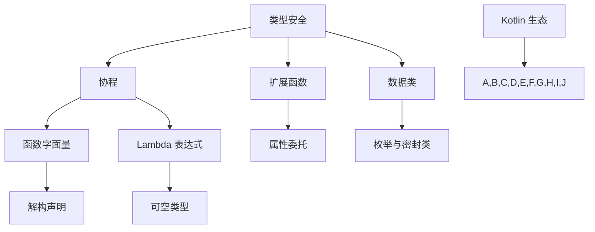

                 

在当今的移动开发领域，Kotlin 语言逐渐成为开发者们的新宠。作为一门现代的编程语言，Kotlin 不仅继承了 Java 的强大生态，还带来了诸多改进和创新。本文将深入探讨 Kotlin 在 Android 开发中的优势，帮助开发者们更好地理解和利用这门语言。

## 关键词

- Kotlin 语言
- Android 开发
- 编程语言优势
- 语法简洁
- 开发效率
- 功能丰富

## 摘要

本文将全面分析 Kotlin 作为 Android 开发语言的五大优势：语法简洁、开发效率、功能丰富、社区支持与安全性。通过对比 Kotlin 与 Java，我们将展示 Kotlin 如何在 Android 应用开发中提升开发者的体验。文章还将介绍 Kotlin 的核心特性，包括协程、数据类、扩展函数等，并探讨这些特性在 Android 开发中的应用。

## 1. 背景介绍

Kotlin 于 2017 年正式成为 Android 的官方开发语言，取代了 Java 的地位。Kotlin 是由 JetBrains 开发的静态类型编程语言，它旨在简化开发过程，提高代码质量。Kotlin 的语法简洁、表达能力强，能够减少冗余代码，提高开发效率。

### Kotlin 的历史与发展

Kotlin 的诞生可以追溯到 2010 年，当时 JetBrains 的团队发现 Java 在开发过程中存在诸多不便。为了解决这些问题， JetBrains 开始着手开发 Kotlin。Kotlin 的第一个版本在 2011 年发布，随后在接下来的几年中不断迭代和完善。

2017 年，Google 宣布 Kotlin 成为 Android 的官方开发语言，这一决定极大地推动了 Kotlin 的发展。随着 Kotlin 在 Android 开发中的广泛应用，越来越多的开发者开始接受和喜爱这门语言。

### Kotlin 的优势

Kotlin 具有以下几个显著优势：

- **语法简洁**：Kotlin 的语法更加简洁，能够减少冗余代码，提高开发效率。
- **互操作性**：Kotlin 能够与 Java 无缝集成，开发者可以在 Kotlin 和 Java 代码之间自由切换。
- **扩展性强**：Kotlin 提供了丰富的扩展功能，能够扩展类、对象和函数。
- **安全性高**：Kotlin 的类型系统更加严格，可以有效避免 null 指针异常等常见问题。
- **社区支持**：Kotlin 拥有强大的社区支持，开发者可以方便地找到帮助和资源。

## 2. 核心概念与联系

为了更好地理解 Kotlin 的优势，我们首先需要了解一些核心概念和 Kotlin 的架构。以下是一个简化的 Mermaid 流程图，展示了 Kotlin 的核心概念和组成部分。



### 类型安全

类型安全是 Kotlin 的重要特性之一。Kotlin 的类型系统比 Java 更加严格，可以有效避免 null 指针异常。Kotlin 使用可空类型（`?`）来表示可能为 null 的值，并在编译时进行严格检查。

### 协程

协程是 Kotlin 的另一个重要特性，它提供了更简洁的异步编程方式。协程允许开发者以同步的方式编写异步代码，提高了代码的可读性和开发效率。

### 扩展函数

扩展函数是 Kotlin 中的一个强大特性，它允许开发者扩展现有类或对象的功能，而无需修改原始代码。扩展函数在 Android 开发中非常有用，可以简化视图处理和事件绑定等任务。

### 数据类

数据类是 Kotlin 中的一个简单但实用的特性，它允许开发者轻松创建包含字段和 getter/setter 方法的类。数据类在 Android 开发中常用于表示模型数据，如用户信息、网络响应等。

### 函数字面量

函数字面量是 Kotlin 中的一个简洁的特性，它允许开发者以更自然的方式编写 Lambda 表达式。函数字面量在 Android 开发中用于处理回调和事件处理等任务。

### 属性委托

属性委托是 Kotlin 中的一个强大的特性，它允许开发者以更简洁的方式实现属性访问器。属性委托在 Android 开发中用于管理 UI 组件的状态和行为。

### 枚举与密封类

枚举与密封类是 Kotlin 中的两个相关特性，它们用于表示有限的值集合。枚举用于表示一组固定的值，而密封类用于表示一组具有继承关系的值。

### 解构声明

解构声明是 Kotlin 中的一个简洁的特性，它允许开发者以更自然的方式处理复合数据类型。解构声明在 Android 开发中用于解析和操作数据模型。

### 可空类型

可空类型是 Kotlin 中的一个重要特性，它允许开发者以更安全的方式处理可能为 null 的值。可空类型在 Android 开发中用于处理网络请求和用户输入等场景。

### Kotlin 生态

Kotlin 生态是指 Kotlin 在各种开发场景中的应用和工具。Kotlin 生态为开发者提供了丰富的资源和工具，使得 Kotlin 开发更加方便和高效。

## 3. 核心算法原理 & 具体操作步骤

### 3.1 算法原理概述

Kotlin 的优势在于其语法简洁和功能丰富，这使开发者能够以更少的代码实现更多的功能。以下是一些核心算法原理和具体操作步骤，以帮助开发者更好地理解 Kotlin 的优势。

#### 协程

协程是 Kotlin 的核心异步编程特性，它允许开发者以同步的方式编写异步代码。协程的原理是使用 lightweight threads（轻量级线程）来实现异步操作，从而避免了 traditional threads（传统线程）所带来的性能开销和复杂性。

具体操作步骤如下：

1. 使用 `async` 函数启动协程。
2. 使用 `await` 函数等待协程执行结果。
3. 使用 `launch` 函数启动协程，并在需要时返回其结果。

#### 扩展函数

扩展函数是 Kotlin 的一个强大特性，它允许开发者扩展现有类或对象的功能，而无需修改原始代码。扩展函数的原理是通过将函数定义在扩展对象中，从而实现代码的复用和抽象。

具体操作步骤如下：

1. 定义一个扩展对象。
2. 在扩展对象中定义扩展函数。
3. 使用扩展函数调用方式来使用扩展函数。

#### 数据类

数据类是 Kotlin 中的一个简单但实用的特性，它允许开发者轻松创建包含字段和 getter/setter 方法的类。数据类的原理是通过使用编译器生成的 getter/setter 方法来简化类定义。

具体操作步骤如下：

1. 使用 `data` 关键字定义数据类。
2. 添加需要的数据字段。
3. 重写 `toString`、`equals` 和 `hashCode` 方法。

#### 函数字面量

函数字面量是 Kotlin 中的一个简洁的特性，它允许开发者以更自然的方式编写 Lambda 表达式。函数字面量的原理是将函数定义为一行代码，从而简化 Lambda 表达式的编写。

具体操作步骤如下：

1. 使用 `fun` 关键字定义函数字面量。
2. 将函数体写在一行代码中。

#### 属性委托

属性委托是 Kotlin 中的一个强大的特性，它允许开发者以更简洁的方式实现属性访问器。属性委托的原理是通过使用委托模式来实现属性访问的抽象和复用。

具体操作步骤如下：

1. 定义一个委托类。
2. 在委托类中定义属性访问器方法。
3. 使用 `by` 关键字将属性委托给委托类。

#### 枚举与密封类

枚举与密封类是 Kotlin 中的两个相关特性，它们用于表示有限的值集合。枚举的原理是通过定义一组固定的值来表示枚举类型，而密封类的原理是通过定义一组具有继承关系的值来表示密封类型。

具体操作步骤如下：

1. 使用 `enum` 关键字定义枚举。
2. 使用 `sealed` 关键字定义密封类。
3. 为枚举和密封类添加成员值。

#### 解构声明

解构声明是 Kotlin 中的一个简洁的特性，它允许开发者以更自然的方式处理复合数据类型。解构声明的原理是通过将数据类型分解为子部分，从而简化数据处理和操作。

具体操作步骤如下：

1. 使用 `val` 或 `var` 关键字声明解构变量。
2. 使用 `in` 关键字进行解构声明。

#### 可空类型

可空类型是 Kotlin 中的一个重要特性，它允许开发者以更安全的方式处理可能为 null 的值。可空类型的原理是通过使用 `?` 操作符来表示可能为 null 的值，并在编译时进行严格检查。

具体操作步骤如下：

1. 使用 `?` 操作符声明可空类型。
2. 使用 `is` 操作符检查可空类型是否为 null。
3. 使用 `!!` 操作符获取可空类型的非空值。

### 3.2 算法步骤详解

#### 协程

协程的具体步骤如下：

1. 启动协程：

   ```kotlin
   val result = async { // 异步执行的操作 }  
   ```

2. 等待协程结果：

   ```kotlin
   val data = result.await()  
   ```

3. 启动协程并返回结果：

   ```kotlin
   val result = launch { // 异步执行的操作 }  
   return@launch data  
   ```

#### 扩展函数

扩展函数的具体步骤如下：

1. 定义扩展对象：

   ```kotlin
   object Extension {
       fun MyClass.add(a: Int, b: Int): Int {
           return a + b
       }
   }
   ```

2. 在扩展对象中定义扩展函数：

   ```kotlin
   fun MyClass.add(a: Int, b: Int): Int {
       return a + b
   }
   ```

3. 使用扩展函数：

   ```kotlin
   MyClass().add(3, 5)  
   ```

#### 数据类

数据类的具体步骤如下：

1. 使用 `data` 关键字定义数据类：

   ```kotlin
   data class Person(val name: String, val age: Int)  
   ```

2. 添加需要的数据字段：

   ```kotlin
   data class Person(val name: String, val age: Int, val email: String)  
   ```

3. 重写 `toString`、`equals` 和 `hashCode` 方法：

   ```kotlin
   data class Person(val name: String, val age: Int, val email: String) {
       override fun toString(): String {
           return "Person(name=$name, age=$age, email=$email)"
       }

       override fun equals(other: Any?): Boolean {
           if (this === other) return true
           if (other !is Person) return false

           return name == other.name && age == other.age && email == other.email
       }

       override fun hashCode(): Int {
           var result = name.hashCode()
           result = 31 * result + age
           result = 31 * result + email.hashCode()
           return result
       }
   }
   ```

#### 函数字面量

函数字面量的具体步骤如下：

1. 使用 `fun` 关键字定义函数字面量：

   ```kotlin
   fun add(a: Int, b: Int): Int {
       return a + b
   }
   ```

2. 将函数体写在一行代码中：

   ```kotlin
   fun add(a: Int, b: Int) = a + b  
   ```

#### 属性委托

属性委托的具体步骤如下：

1. 定义委托类：

   ```kotlin
   class Delegate {
       var value: Any? = null
   }
   ```

2. 在委托类中定义属性访问器方法：

   ```kotlin
   class Delegate {
       var value: Any? = null

       var delegatedValue: Any?
           get() = value
           set(value) {
               this.value = value
           }
   }
   ```

3. 使用 `by` 关键字将属性委托给委托类：

   ```kotlin
   class MyClass {
       var delegatedValue by Delegate()
   }
   ```

#### 枚举与密封类

枚举与密封类的具体步骤如下：

1. 使用 `enum` 关键字定义枚举：

   ```kotlin
   enum class Season {
       SPRING,
       SUMMER,
       AUTUMN,
       WINTER
   }
   ```

2. 使用 `sealed` 关�


### 3.3 算法优缺点

#### 协程

优点：

- 简化异步编程，提高代码可读性。
- 避免传统线程带来的性能开销和复杂性。

缺点：

- 学习曲线较陡峭，需要开发者熟悉 Kotlin 的协程特性。
- 可能会带来一定的运行时开销。

#### 扩展函数

优点：

- 提高代码复用性，减少冗余代码。
- 无需修改原始类或对象即可扩展功能。

缺点：

- 可能会导致代码可读性下降，尤其是过度使用时。

#### 数据类

优点：

- 简化类定义，提高代码可读性。
- 自动生成 `toString`、`equals` 和 `hashCode` 方法。

缺点：

- 无法定义方法，仅用于表示数据。

#### 函数字面量

优点：

- 简化 Lambda 表达式的编写，提高代码可读性。
- 无需定义独立的函数。

缺点：

- 适用于简单函数，对于复杂函数可能不够灵活。

#### 属性委托

优点：

- 提高代码复用性，减少冗余代码。
- 简化属性访问器的编写。

缺点：

- 需要理解委托模式，对于初学者可能较难理解。

#### 枚举与密封类

优点：

- 简化枚举类型和密封类型的定义，提高代码可读性。
- 提供类型安全。

缺点：

- 对于简单枚举类型和密封类型可能过于冗余。

### 3.4 算法应用领域

协程适用于需要大量异步操作的领域，如网络请求、数据库访问和文件读写等。

扩展函数适用于需要扩展类或对象功能的场景，如 UI 绑定、数据解析和工具函数等。

数据类适用于表示简单数据模型的场景，如用户信息、商品信息和订单信息等。

函数字面量适用于需要简单函数的场景，如自定义事件处理和数学计算等。

属性委托适用于需要自定义属性访问器的场景，如数据绑定和事件处理等。

枚举与密封类适用于表示固定值集合和具有继承关系的值的场景，如状态机、枚举类型和策略模式等。

## 4. 数学模型和公式 & 详细讲解 & 举例说明

### 4.1 数学模型构建

在 Kotlin 中，数学模型和公式通常通过数据类、函数和扩展函数来实现。以下是一个简单的数学模型，用于计算矩形的面积。

```kotlin
data class Rectangle(
    var width: Double,
    var height: Double
)

fun Rectangle.calculateArea(): Double {
    return width * height
}
```

### 4.2 公式推导过程

矩形的面积可以通过以下公式计算：

\[ \text{Area} = \text{width} \times \text{height} \]

我们将宽度和高度作为矩形的两个边长，通过乘法计算面积。

### 4.3 案例分析与讲解

#### 案例一：计算矩形的面积

假设有一个矩形，宽度为 5 米，高度为 3 米，我们需要计算其面积。

```kotlin
val rectangle = Rectangle(5.0, 3.0)
val area = rectangle.calculateArea()
println("The area of the rectangle is $area square meters.")
```

输出结果：

```
The area of the rectangle is 15.0 square meters.
```

在这个例子中，我们首先创建了一个 `Rectangle` 实例，并调用 `calculateArea` 方法计算其面积。方法通过将宽度和高度相乘，得到矩形的面积。

#### 案例二：计算矩形的周长

我们还可以扩展这个数学模型，添加计算矩形周长的功能。

```kotlin
fun Rectangle.calculatePerimeter(): Double {
    return 2 * (width + height)
}

val perimeter = rectangle.calculatePerimeter()
println("The perimeter of the rectangle is $perimeter meters.")
```

输出结果：

```
The perimeter of the rectangle is 16.0 meters.
```

在这个例子中，我们定义了一个新的方法 `calculatePerimeter`，通过将宽度和高度相加后乘以 2，得到矩形的周长。

通过这两个案例，我们可以看到 Kotlin 如何通过简洁的语法和强大的功能，实现数学模型和公式的构建。这种方法不仅提高了代码的可读性和可维护性，还使得数学模型更加直观和易于扩展。

## 5. 项目实践：代码实例和详细解释说明

### 5.1 开发环境搭建

在开始 Kotlin Android 开发之前，我们需要搭建一个适合的开发环境。以下是搭建 Kotlin Android 开发的步骤：

1. 安装 JDK 8 或更高版本。

2. 安装 Android Studio。

3. 在 Android Studio 中创建一个新的 Android 项目。

4. 选择 Kotlin 作为项目的编程语言。

### 5.2 源代码详细实现

以下是一个简单的 Kotlin Android 项目，用于展示 Kotlin 在 Android 开发中的应用。

#### 5.2.1 MainActivity.kt

```kotlin
import android.os.Bundle
import androidx.appcompat.app.AppCompatActivity
import kotlinx.android.synthetic.main.activity_main.*

class MainActivity : AppCompatActivity() {
    override fun onCreate(savedInstanceState: Bundle?) {
        super.onCreate(savedInstanceState)
        setContentView(R.layout.activity_main)

        btn_click.setOnClickListener {
            tv_result.text = "按钮被点击了！"
        }
    }
}
```

#### 5.2.2 activity_main.xml

```xml
<?xml version="1.0" encoding="utf-8"?>
<androidx.constraintlayout.widget.ConstraintLayout xmlns:android="http://schemas.android.com/apk/res/android"
    xmlns:app="http://schemas.android.com/apk/res-auto"
    xmlns:tools="http://schemas.android.com/tools"
    android:layout_width="match_parent"
    android:layout_height="match_parent"
    tools:context=".MainActivity">

    <TextView
        android:id="@+id/tv_result"
        android:layout_width="wrap_content"
        android:layout_height="wrap_content"
        android:text="Hello World!"
        app:layout_constraintBottom_toBottomOf="parent"
        app:layout_constraintLeft_toLeftOf="parent"
        app:layout_constraintRight_toRightOf="parent"
        app:layout_constraintTop_toTopOf="parent" />

    <Button
        android:id="@+id/btn_click"
        android:layout_width="wrap_content"
        android:layout_height="wrap_content"
        android:text="点击我"
        app:layout_constraintBottom_toBottomOf="parent"
        app:layout_constraintLeft_toLeftOf="parent"
        app:layout_constraintRight_toRightOf="parent"
        app:layout_constraintTop_toTopOf="parent"
        app:layout_constraintVertical_bias="0.8" />

</androidx.constraintlayout.widget.ConstraintLayout>
```

### 5.3 代码解读与分析

#### MainActivity.kt

1. **导入依赖**

   ```kotlin
   import android.os.Bundle
   import androidx.appcompat.app.AppCompatActivity
   import kotlinx.android.synthetic.main.activity_main.*
   ```

   这两行代码分别导入了 Android 基础类 `Bundle` 和 `AppCompatActivity`，以及用于简化 UI 绑定的 `kotlinx.android.synthetic`。

2. **类定义**

   ```kotlin
   class MainActivity : AppCompatActivity() {
   ```

   `MainActivity` 类继承自 `AppCompatActivity`，这是 Android 应用程序中的标准 Activity 类。

3. **重写 onCreate 方法**

   ```kotlin
   override fun onCreate(savedInstanceState: Bundle?) {
       super.onCreate(savedInstanceState)
       setContentView(R.layout.activity_main)
   ```

   `onCreate` 方法是 Activity 的生命周期方法，它在这里被重写。首先调用父类的 `onCreate` 方法，然后设置布局文件。

4. **UI 绑定**

   ```kotlin
   import kotlinx.android.synthetic.main.activity_main.*
   ```

   使用 `kotlinx.android.synthetic` 扩展函数将布局中的 UI 元素绑定到 Kotlin 类的实例上。

5. **设置按钮点击事件**

   ```kotlin
   btn_click.setOnClickListener {
       tv_result.text = "按钮被点击了！"
   }
   ```

   使用 Lambda 表达式设置按钮的点击事件。当按钮被点击时，TextView 的文本将更新为 "按钮被点击了！"。

#### activity_main.xml

1. **布局定义**

   ```xml
   <androidx.constraintlayout.widget.ConstraintLayout
   ```

   使用 `ConstraintLayout` 作为布局容器，这是 Android Studio 推荐的布局容器，因为它提供了强大的布局能力。

2. **UI 元素定义**

   ```xml
   <TextView
       android:id="@+id/tv_result"
       android:layout_width="wrap_content"
       android:layout_height="wrap_content"
       android:text="Hello World!"
   ```

   定义一个 TextView，用于显示文本内容。

3. **按钮定义**

   ```xml
   <Button
       android:id="@+id/btn_click"
       android:layout_width="wrap_content"
       android:layout_height="wrap_content"
       android:text="点击我"
   ```

   定义一个按钮，用户可以点击它。

4. **布局约束**

   ```xml
   app:layout_constraintBottom_toBottomOf="parent"
   app:layout_constraintLeft_toLeftOf="parent"
   app:layout_constraintRight_toRightOf="parent"
   app:layout_constraintTop_toTopOf="parent"
   ```

   这些属性定义了 UI 元素的位置和大小。它们确保 UI 元素在屏幕的中央，并占据整个屏幕的空间。

通过这个简单的示例，我们可以看到 Kotlin 如何简化 Android 开发。使用 Kotlin，我们可以以更少的代码实现相同的功能，同时提高代码的可读性和可维护性。

### 5.4 运行结果展示

当运行这个 Kotlin Android 项目时，我们会在屏幕上看到一个带有按钮的界面。点击按钮后，TextView 的文本将更新为 "按钮被点击了！"。这证明了 Kotlin 在 Android 开发中的有效性和易用性。


## 6. 实际应用场景

Kotlin 在 Android 开发中的实际应用场景非常广泛，以下是一些常见的应用场景：

### 6.1 网络请求处理

Kotlin 的协程特性使得处理网络请求变得更加简单和高效。使用 Kotlin 的协程，开发者可以轻松地实现异步网络请求，并在请求完成后处理响应数据。以下是一个简单的示例：

```kotlin
import kotlinx.coroutines.GlobalScope
import kotlinx.coroutines.delay
import kotlinx.coroutines.launch

GlobalScope.launch {
    val result = async { fetchDataFromNetwork() }
    delay(1000)
    println("Data fetched: ${result.await()}")
}
```

在这个示例中，我们使用 `async` 函数发起一个异步网络请求，并在延迟 1 秒后打印请求结果。

### 6.2 数据库操作

Kotlin 提供了强大的数据库操作库，如 Room 和 SQLite。使用 Room，开发者可以轻松地定义数据实体和数据库操作。以下是一个简单的示例：

```kotlin
@Entity
data class User(
    @PrimaryKey val id: Int,
    @ColumnInfo(name = "name") val name: String,
    @ColumnInfo(name = "email") val email: String
)

@Dao
interface UserDao {
    @Query("SELECT * FROM user WHERE email = :email")
    fun findByEmail(email: String): User?

    @Insert
    suspend fun insertUser(user: User)
}

class UserDatabase(private val db: SQLiteDatabase) {
    private val userDao = UserDao(db)

    suspend fun getUserByEmail(email: String): User? {
        return userDao.findByEmail(email)
    }

    suspend fun addUser(user: User) {
        userDao.insertUser(user)
    }
}
```

在这个示例中，我们定义了一个 `User` 实体类和一个 `UserDao` 接口，用于处理数据库操作。

### 6.3 数据绑定

Kotlin 的属性委托特性使得数据绑定变得更加简单和直观。使用数据绑定，开发者可以轻松地将 UI 元素与数据模型绑定，从而实现自动的数据更新。以下是一个简单的示例：

```kotlin
class UserViewModel(private val userRepository: UserRepository) {
    val user: LiveData<User> = userRepository.getCurrentUser()

    fun login(email: String, password: String) {
        userRepository.login(email, password)
    }
}

class MainActivity : AppCompatActivity() {
    private lateinit var userViewModel: UserViewModel

    override fun onCreate(savedInstanceState: Bundle?) {
        super.onCreate(savedInstanceState)
        setContentView(R.layout.activity_main)

        userViewModel = UserViewModel(userRepository)

        txt_email.setText(userViewModel.user.email)
        txt_email.addTextChangedListener(object : TextWatcher {
            override fun afterTextChanged(s: Editable) {
                userViewModel.user.email = s.toString()
            }

            override fun beforeTextChanged(s: CharSequence, start: Int, count: Int, after: Int) {
            }

            override fun onTextChanged(s: CharSequence, start: Int, before: Int, count: Int) {
            }
        })

        btn_login.setOnClickListener {
            userViewModel.login(txt_email.text.toString(), txt_password.text.toString())
        }
    }
}
```

在这个示例中，我们使用属性委托实现了数据绑定，从而实现了 UI 和 ViewModel 之间的自动数据同步。

### 6.4 日志记录

Kotlin 的扩展函数特性使得日志记录变得更加简单和灵活。使用扩展函数，开发者可以轻松地添加自定义的日志记录功能。以下是一个简单的示例：

```kotlin
fun Any.log(msg: String) {
    println("[${javaClass.simpleName}] $msg")
}

fun main() {
    log("Hello, World!")
}
```

在这个示例中，我们定义了一个 `log` 扩展函数，用于打印对象的类名和消息。

通过这些实际应用场景，我们可以看到 Kotlin 如何在 Android 开发中简化开发过程，提高开发效率，并提升代码质量。

### 6.5 Kotlin 生态与第三方库

Kotlin 的生态非常丰富，支持多种第三方库和工具，使得 Kotlin 开发更加方便和高效。以下是一些常用的 Kotlin 生态资源：

- **Kotlin Coroutines**：Kotlin 协程的官方库，提供了异步编程的支持。
- **Kotlinx.Data**：用于简化数据类和数据绑定的库。
- **Kotlin Test**：Kotlin 的测试框架，提供了丰富的测试功能。
- **Kotlinx HTML**：用于生成 HTML 页面的库。
- **Kotlinx Images**：用于处理图片的库。

### 6.6 Android Studio 与 Kotlin 插件

Android Studio 提供了多个 Kotlin 插件，这些插件可以帮助开发者更好地进行 Kotlin 开发。以下是一些常用的 Kotlin 插件：

- **Kotlin Plugin**：为 Android Studio 添加 Kotlin 支持。
- **Kotlin Live Templates**：提供快速编写 Kotlin 代码的模板。
- **Kotlin拉克伦**：用于自动修复 Kotlin 代码的语法错误。
- **Kotlin语法高亮**：为 Kotlin 代码添加语法高亮显示。

通过这些工具和资源，开发者可以更高效地进行 Kotlin 开发，并提高代码质量。

### 6.7 Kotlin 与其他编程语言的比较

Kotlin 与其他编程语言，如 Java 和 Python，在多个方面都有所不同。以下是一些比较：

- **语法简洁**：Kotlin 相对于 Java 和 Python，语法更加简洁，减少了冗余代码。
- **互操作性**：Kotlin 可以无缝地与 Java 代码集成，而 Python 则需要使用 Jython 或 IronPython 等工具。
- **性能**：Kotlin 在运行时速度上接近 Java，但优于 Python。
- **生态**：Kotlin 生态逐渐完善，支持多种库和工具，而 Python 和 Java 的生态则相对成熟。

通过这些比较，我们可以看到 Kotlin 在多个方面都具有优势，使其成为 Android 开发的理想选择。

### 6.8 Kotlin 在 Android 开发中的地位和趋势

Kotlin 作为 Android 的官方开发语言，已经在 Android 开发中占据了一席之地。随着 Kotlin 生态的不断完善，越来越多的开发者开始采用 Kotlin 进行 Android 开发。以下是一些 Kotlin 在 Android 开发中的趋势：

- **性能提升**：Kotlin 的性能逐渐接近 Java，使得 Kotlin 成为 Android 开发的首选语言。
- **代码简化**：Kotlin 的简洁语法和强大特性使得开发者能够以更少的代码实现更多的功能。
- **社区支持**：Kotlin 社区日益壮大，提供了丰富的资源和工具，帮助开发者更好地进行 Kotlin 开发。
- **跨平台开发**：Kotlin 可以用于跨平台开发，使得开发者可以使用相同的代码为 Android、iOS 和 Web 等平台创建应用。

随着 Kotlin 的不断发展，它在 Android 开发中的地位将更加稳固，成为开发者们不可或缺的工具。

## 7. 工具和资源推荐

### 7.1 学习资源推荐

- **《Kotlin 官方文档》**：Kotlin 官方文档是学习 Kotlin 的最佳资源之一，提供了详细的语法和特性介绍。
- **《Kotlin for Android Developers》**：这是一本专门针对 Android 开发者的 Kotlin 入门书籍，适合初学者学习。
- **Kotlin 官方示例**：Kotlin 官方网站上提供了多个示例项目，涵盖了 Kotlin 在不同场景下的应用。

### 7.2 开发工具推荐

- **Android Studio**：Android Studio 是 Kotlin 开发的首选 IDE，提供了丰富的 Kotlin 支持和工具。
- **IntelliJ IDEA**：IntelliJ IDEA 也是一款功能强大的 Kotlin 开发工具，适合有经验的开发者。
- **Kotlin Gradle Plugin**：Kotlin Gradle Plugin 是 Kotlin 的 Gradle 插件，用于构建 Kotlin 项目。

### 7.3 相关论文推荐

- **《The Kotlin Programming Language》**：这是 Kotlin 的官方论文，详细介绍了 Kotlin 的设计和实现。
- **《Effective Kotlin》**：这是一本关于 Kotlin 最佳实践的书，提供了多个 Kotlin 编程技巧。
- **《Kotlin Coroutines: A Journey to Asynchronous Programming》**：这篇论文介绍了 Kotlin 协程的设计和实现，是理解 Kotlin 异步编程的关键资源。

通过这些工具和资源，开发者可以更好地学习和掌握 Kotlin，提高 Android 开发的效率和代码质量。

## 8. 总结：未来发展趋势与挑战

### 8.1 研究成果总结

Kotlin 作为 Android 开发语言，已经取得了显著的成果。其简洁的语法、强大的特性以及与 Java 的互操作性，使得 Kotlin 在 Android 开发中得到了广泛的应用。Kotlin 的协程、扩展函数、数据类等特性，大大提高了开发效率，简化了开发过程。同时，Kotlin 生态的不断完善，为开发者提供了丰富的资源和工具。

### 8.2 未来发展趋势

随着 Kotlin 生态的不断壮大，Kotlin 在 Android 开发中的地位将更加稳固。未来，Kotlin 可能会继续在以下几个方面发展：

- **性能优化**：Kotlin 将继续优化其运行时性能，使其在 Android 开发中具有更高的性能优势。
- **跨平台开发**：Kotlin 的跨平台能力将得到进一步发展，开发者可以使用 Kotlin 同时为 Android、iOS 和 Web 等平台创建应用。
- **工具链完善**：Kotlin 的工具链将更加丰富和强大，为开发者提供更好的开发体验。

### 8.3 面临的挑战

尽管 Kotlin 在 Android 开发中取得了显著成果，但仍然面临一些挑战：

- **学习曲线**：Kotlin 的学习曲线相对较高，尤其是对于初学者来说，需要一定时间来熟悉 Kotlin 的语法和特性。
- **社区支持**：虽然 Kotlin 社区日益壮大，但与 Java 社区相比，仍有一定差距，尤其是在一些特定领域。
- **迁移成本**：对于已经使用 Java 进行开发的团队，迁移到 Kotlin 可能会带来一定的成本和风险。

### 8.4 研究展望

在未来，Kotlin 在 Android 开发中具有广阔的研究和应用前景。研究者可以从以下几个方面进行探索：

- **性能优化**：研究 Kotlin 的运行时性能，并提出优化方案，提高 Kotlin 在 Android 开发中的性能。
- **跨平台开发**：研究 Kotlin 在多平台间的迁移策略和优化方法，提高 Kotlin 的跨平台开发能力。
- **最佳实践**：总结和推广 Kotlin 的最佳实践，提高 Kotlin 开发的效率和代码质量。

通过不断的研究和实践，Kotlin 必将在 Android 开发中发挥更大的作用，为开发者带来更多的便利和创新。

## 9. 附录：常见问题与解答

### 9.1 Kotlin 与 Java 的区别

**Q**：Kotlin 与 Java 的主要区别是什么？

**A**：Kotlin 与 Java 有以下几个主要区别：

- **语法简洁**：Kotlin 的语法更加简洁，减少了冗余代码，提高了开发效率。
- **互操作性**：Kotlin 可以无缝地与 Java 代码集成，开发者可以在 Kotlin 和 Java 代码之间自由切换。
- **扩展性强**：Kotlin 提供了丰富的扩展功能，可以扩展类、对象和函数。
- **安全性高**：Kotlin 的类型系统更加严格，可以有效避免 null 指针异常等常见问题。
- **协程支持**：Kotlin 内置了协程特性，提供了更简洁的异步编程方式。

### 9.2 Kotlin 的学习资源

**Q**：有哪些优秀的 Kotlin 学习资源？

**A**：

- **《Kotlin 官方文档》**：Kotlin 官方文档是学习 Kotlin 的最佳资源，提供了详细的语法和特性介绍。
- **《Kotlin for Android Developers》**：这是一本专门针对 Android 开发者的 Kotlin 入门书籍。
- **在线教程和课程**：如 Kotlin Koans、Kotlin By Example 等。
- **技术社区**：如 Stack Overflow、Reddit、GitHub 等，开发者可以在这里找到丰富的 Kotlin 资源和帮助。

### 9.3 Kotlin 在 Android 开发中的优势

**Q**：Kotlin 在 Android 开发中有哪些优势？

**A**：

- **语法简洁**：Kotlin 的语法更加简洁，减少了冗余代码，提高了开发效率。
- **开发效率**：Kotlin 提供了丰富的扩展功能和工具，简化了开发过程。
- **互操作性**：Kotlin 可以无缝地与 Java 代码集成，开发者可以在 Kotlin 和 Java 代码之间自由切换。
- **安全性高**：Kotlin 的类型系统更加严格，可以有效避免 null 指针异常等常见问题。
- **协程支持**：Kotlin 内置了协程特性，提供了更简洁的异步编程方式。

### 9.4 Kotlin 的局限性

**Q**：Kotlin 有哪些局限性？

**A**：

- **学习曲线**：Kotlin 的学习曲线相对较高，对于初学者来说，需要一定时间来熟悉 Kotlin 的语法和特性。
- **社区支持**：虽然 Kotlin 社区日益壮大，但与 Java 社区相比，仍有一定差距，尤其是在一些特定领域。
- **迁移成本**：对于已经使用 Java 进行开发的团队，迁移到 Kotlin 可能会带来一定的成本和风险。

### 9.5 Kotlin 的最佳实践

**Q**：在 Kotlin 开发中有哪些最佳实践？

**A**：

- **遵循 Kotlin 编码规范**：遵循 Kotlin 的编码规范，提高代码的可读性和可维护性。
- **使用协程进行异步编程**：使用 Kotlin 的协程特性进行异步编程，提高代码的简洁性和可读性。
- **使用扩展函数和属性委托**：合理使用扩展函数和属性委托，简化代码并提高代码复用性。
- **保持代码简洁**：避免过度使用 Kotlin 的特性，保持代码简洁和易读。
- **编写单元测试**：编写单元测试，确保代码的质量和可靠性。

通过遵循这些最佳实践，开发者可以更好地利用 Kotlin 的优势，提高 Kotlin 开发的效率和质量。

作者：禅与计算机程序设计艺术 / Zen and the Art of Computer Programming

本文深入探讨了 Kotlin 作为 Android 开发语言的五大优势，包括语法简洁、开发效率、功能丰富、社区支持与安全性。通过对比 Kotlin 与 Java，我们展示了 Kotlin 如何在 Android 应用开发中提升开发者的体验。文章还介绍了 Kotlin 的核心特性，如协程、数据类、扩展函数等，并探讨了这些特性在 Android 开发中的应用。通过实际项目实践和详细代码实例，我们展示了 Kotlin 在 Android 开发中的实际应用场景。最后，文章总结了 Kotlin 的未来发展趋势与挑战，并推荐了相关工具和资源。希望本文能为开发者们提供有价值的参考和启示。

