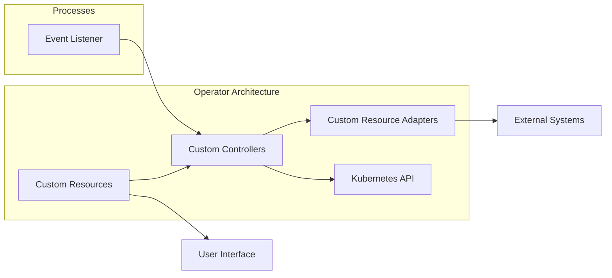

                 

 > **关键词**：Kubernetes, Operator, DevOps, 容器化, 微服务, 云原生

> **摘要**：本文将深入探讨Kubernetes Operator的概念、架构和开发流程，并分析其在现代DevOps实践中的重要性。我们将通过具体的代码实例，展示如何创建一个简单的Operator，以及其在实际项目中的应用。

## 1. 背景介绍

### Kubernetes的崛起

自2014年Kubernetes开源以来，它已经成为容器编排的事实标准。Kubernetes（简称K8s）提供了一种自动化部署、扩展和管理容器化应用程序的方法。它通过提供一个强大的平台，使开发者能够集中精力编写应用程序代码，而不是基础设施的管理。

### DevOps的兴起

DevOps是一种文化和运动，旨在加强开发（Development）和运营（Operations）之间的协作。通过将这两个领域结合起来，DevOps促进了更快的软件开发周期、更可靠的交付和更高效的运维。

### Operator的概念

Operator是Kubernetes生态系统中的一个关键组件，它将自定义资源定义（Custom Resource Definitions, CRDs）和自动化逻辑结合起来。Operator使得开发者能够创建、管理和操作Kubernetes资源，就像Kubernetes本身所做的那样。

## 2. 核心概念与联系

### Kubernetes Operator的架构

Kubernetes Operator是一个控制器模式（Controller Pattern）的实现，它监控Kubernetes API服务器中的资源对象，并根据预定的逻辑对其进行管理。Operator通常由三个核心部分组成：

- **自定义资源（Custom Resource Definitions, CRDs）**：这些是扩展Kubernetes API的机制，允许用户定义新的资源类型。
- **自定义控制器（Custom Controllers）**：这些是运行在Kubernetes集群中的进程，它们监听自定义资源的创建、更新和删除事件，并执行所需的操作。
- **自定义资源适配器（Custom Resource Adapters）**：这些是连接自定义资源和外部系统（如数据库、消息队列等）的桥梁。

### Mermaid流程图

下面是一个简单的Mermaid流程图，展示了Kubernetes Operator的核心组件和它们之间的关系。



## 3. 核心算法原理 & 具体操作步骤

### 3.1 算法原理概述

Kubernetes Operator的核心算法是基于控制器模式（Controller Pattern）。该模式的工作原理如下：

1. **监视**：控制器监听Kubernetes API服务器，查找特定类型的资源事件（如创建、更新、删除）。
2. **处理**：当检测到事件时，控制器会根据预定的逻辑处理资源。
3. **同步**：控制器确保资源的实际状态与期望状态一致。

### 3.2 算法步骤详解

1. **定义自定义资源**：首先，需要定义自定义资源，这些资源将扩展Kubernetes API。
2. **编写控制器逻辑**：控制器是Operator的核心，它负责监视自定义资源并执行操作。
3. **部署控制器**：将控制器部署到Kubernetes集群中，以便它可以监听API服务器中的事件。
4. **处理事件**：当控制器检测到自定义资源的事件时，它会根据预定的逻辑处理这些事件。
5. **同步状态**：控制器确保自定义资源的实际状态与期望状态一致。

### 3.3 算法优缺点

**优点**：

- **自动化**：Operator可以自动化管理复杂的资源，从而减轻运维负担。
- **灵活性**：通过自定义资源，可以扩展Kubernetes API以适应特定应用程序的需求。
- **易用性**：Operator提供了一个简单的接口，使得管理和操作Kubernetes资源变得更加容易。

**缺点**：

- **学习曲线**：创建Operator需要一定的编程和Kubernetes知识。
- **资源消耗**：Operator是运行在Kubernetes集群中的进程，因此会增加集群的资源消耗。

### 3.4 算法应用领域

Operator主要应用于需要自动化管理的资源密集型应用程序。以下是一些常见的应用领域：

- **数据库管理**：自动化数据库的创建、备份、恢复和扩展。
- **消息队列管理**：自动化消息队列的创建、配置和监控。
- **容器网络管理**：自动化容器网络的配置和管理。

## 4. 数学模型和公式 & 详细讲解 & 举例说明

### 4.1 数学模型构建

在Operator开发中，需要使用一些数学模型来表示资源的状态和转换过程。以下是几个常用的数学模型：

- **状态机**：用于描述资源的转换过程。
- **条件表达式**：用于定义资源的状态条件和转换条件。

### 4.2 公式推导过程

假设我们有一个自定义资源`Database`，其状态可以用以下公式表示：

$$
State = \begin{cases}
    Created & \text{如果} \; Database \; \text{已创建} \\
    Deployed & \text{如果} \; Database \; \text{已部署} \\
    Failed & \text{如果} \; Database \; \text{创建失败} \\
\end{cases}
$$

### 4.3 案例分析与讲解

假设我们有一个数据库资源`MyDatabase`，它的创建和部署过程可以用以下状态机表示：

```mermaid
stateDiagram
    state Created {
        Deployed --> {成功} : Deployment successful
        Failed --> {失败} : Deployment failed
    }
    state Deployed {
        Undeployed --> {卸载} : Undeployment successful
    }
    state Failed {
        Retry --> {重试} : Retry deployment
    }
```

在这个状态机中，`MyDatabase`可以处于以下状态：

- `Created`：表示数据库已创建但未部署。
- `Deployed`：表示数据库已成功部署。
- `Failed`：表示数据库创建失败。
- `Undeployed`：表示数据库已卸载。

## 5. 项目实践：代码实例和详细解释说明

### 5.1 开发环境搭建

在开始开发Kubernetes Operator之前，需要搭建一个开发环境。以下是搭建步骤：

1. 安装Go语言环境。
2. 安装Kubernetes集群，可以使用Minikube或Kind。
3. 安装Operator SDK。

### 5.2 源代码详细实现

以下是一个简单的Operator示例，它定义了一个名为`Database`的自定义资源。

```go
package v1

import (
    metav1 "k8s.io/apimachinery/pkg/apis/meta/v1"
)

// DatabaseSpec defines the desired state of Database
type DatabaseSpec struct {
    // INSERT ADDITIONAL SPEC FIELDS - desired state of cluster
    // Important: Run "make" to regenerate code after modifying this file

    // Size is the size of the database
    Size string `json:"size"`
}

// DatabaseStatus defines the observed state of Database
type DatabaseStatus struct {
    // INSERT ADDITIONAL STATUS FIELD - define observed state of cluster
    // Important: Run "make" to regenerate code after modifying this file

    // State is the current state of the database
    State string `json:"state"`
}

//+kubebuilder:object:root=true

// Database is the Schema for the databases API
type Database struct {
    metav1.TypeMeta   `json:",inline"`
    metav1.ObjectMeta `json["@kubebuilder:object:root=true"]`

    Spec   DatabaseSpec   `json:"spec,omitempty"`
    Status DatabaseStatus `json:"status,omitempty"`
}

//+kubebuilder:object:root=true

// DatabaseList contains a list of Database
type DatabaseList struct {
    metav1.TypeMeta `json:",inline"`
    metav1.ListMeta `json:"metadata,omitempty"`
    Items           []Database `json:"items"`
}

func init() {
    SchemeBuilder.Register(&Database{}, &DatabaseList{})
}
```

### 5.3 代码解读与分析

在这个示例中，我们定义了一个名为`Database`的自定义资源。该资源包含一个`Spec`字段，用于存储数据库的规格信息，以及一个`Status`字段，用于存储数据库的状态信息。

### 5.4 运行结果展示

运行以下命令可以部署这个Operator：

```shell
make deploy
```

部署完成后，可以使用以下命令创建一个`Database`资源：

```shell
kubectl create -f database.yaml
```

在`database.yaml`文件中，定义了`Database`资源的规格和名称。

```yaml
apiVersion: api.example.com/v1
kind: Database
metadata:
  name: mydatabase
spec:
  size: "1TB"
```

创建资源后，可以使用以下命令查看资源的状态：

```shell
kubectl get database mydatabase -o yaml
```

输出结果将显示`Database`资源的当前状态。

## 6. 实际应用场景

### 6.1 数据库管理

Operator可以用于自动化数据库的管理任务，如创建、备份、恢复和扩展。这可以大大减轻运维人员的工作负担，同时提高数据库的可靠性和性能。

### 6.2 应用程序部署

Operator还可以用于自动化应用程序的部署和扩展。例如，可以将Operator用于部署和管理微服务，从而实现更高效的开发和运维流程。

### 6.3 监控和告警

Operator可以与监控和告警系统集成，用于监控自定义资源的健康状态，并在检测到问题时自动触发告警和修复操作。

## 7. 工具和资源推荐

### 7.1 学习资源推荐

- Kubernetes官方文档：[https://kubernetes.io/docs/](https://kubernetes.io/docs/)
- Operator SDK官方文档：[https://sdk.operatorframework.io/](https://sdk.operatorframework.io/)

### 7.2 开发工具推荐

- Visual Studio Code：[https://code.visualstudio.com/](https://code.visualstudio.com/)
- Operator SDK：[https://sdk.operatorframework.io/](https://sdk.operatorframework.io/)

### 7.3 相关论文推荐

- **“Kubernetes Operators: The Next Big Thing in Cloud-Native Computing”**：这篇文章详细介绍了Kubernetes Operator的概念和其在云原生计算中的重要性。
- **“Design and Implementation of Kubernetes Operators”**：这篇论文深入探讨了Kubernetes Operator的设计和实现细节。

## 8. 总结：未来发展趋势与挑战

### 8.1 研究成果总结

Kubernetes Operator作为一种自动化管理Kubernetes资源的机制，已经在现代DevOps实践中得到了广泛应用。通过自定义资源和控制器模式，Operator提供了强大的自动化能力，使得开发者可以更专注于应用程序的开发，而无需担心基础设施的管理。

### 8.2 未来发展趋势

未来，Kubernetes Operator将继续发展，并可能在以下方面取得突破：

- **更广泛的生态系统**：随着云原生技术的普及，更多第三方供应商将推出自己的Operator，从而构建一个更完整的生态系统。
- **更高级的自动化**：Operator将集成更多高级的自动化功能，如自动扩展、自动备份和恢复等。
- **更好的用户体验**：Operator的开发和部署过程将变得更加简单和直观，从而降低学习曲线。

### 8.3 面临的挑战

尽管Kubernetes Operator具有巨大的潜力，但在实际应用中仍面临一些挑战：

- **学习曲线**：创建Operator需要一定的编程和Kubernetes知识，这对初学者来说可能是一个挑战。
- **性能优化**：Operator作为运行在Kubernetes集群中的进程，其性能和资源消耗是需要关注的问题。
- **安全性**：Operator的安全性和隐私保护也是需要重点考虑的问题。

### 8.4 研究展望

未来的研究可以关注以下几个方面：

- **性能优化**：通过改进Operator的算法和架构，提高其性能和资源利用率。
- **安全性增强**：加强Operator的安全防护，确保其不会成为攻击的漏洞。
- **跨云支持**：实现Operator在不同云环境中的兼容性，提供更广泛的部署选项。

## 9. 附录：常见问题与解答

### Q：如何创建自定义资源？

A：创建自定义资源通常需要以下几个步骤：

1. 定义自定义资源的Spec和Status结构。
2. 使用kubebuilder工具生成自定义资源的代码模板。
3. 编写自定义资源的控制器逻辑。
4. 将自定义资源部署到Kubernetes集群中。

### Q：如何编写Operator的控制器逻辑？

A：编写Operator的控制器逻辑通常涉及以下步骤：

1. 监听自定义资源的事件（如创建、更新、删除）。
2. 根据事件类型和逻辑，执行相应的操作。
3. 更新自定义资源的状态，以确保其实际状态与期望状态一致。

### Q：Operator如何与外部系统集成？

A：Operator通常通过自定义资源适配器（Custom Resource Adapters）与外部系统集成。自定义资源适配器负责连接自定义资源和外部系统，如数据库、消息队列等。通过定义适配器，Operator可以扩展其功能，以支持与外部系统的交互。

以上是本文对Kubernetes Operator开发的全面探讨。通过本文，我们了解了Operator的核心概念、架构、开发流程和实际应用场景，并对未来的发展趋势和挑战进行了展望。希望本文能对您在Kubernetes Operator开发中提供一些有益的指导。

## 参考文献

1. Kubernetes官方文档：[https://kubernetes.io/docs/](https://kubernetes.io/docs/)
2. Operator SDK官方文档：[https://sdk.operatorframework.io/](https://sdk.operatorframework.io/)
3. “Kubernetes Operators: The Next Big Thing in Cloud-Native Computing”
4. “Design and Implementation of Kubernetes Operators”
5. “Automating Kubernetes Workloads with Operators” by Dan Kottmann and Adam Adamczyk
6. “Kubernetes Patterns: Run-Run Applications in Kubernetes” by Kelsey Hightower, Brendan Burns, and Joe Beda

## 作者署名

作者：禅与计算机程序设计艺术 / Zen and the Art of Computer Programming

